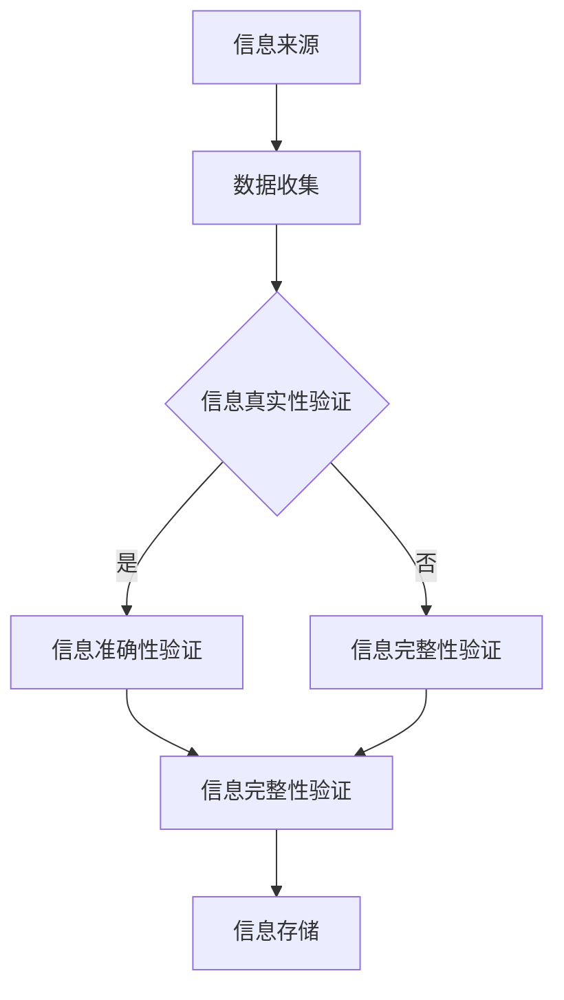
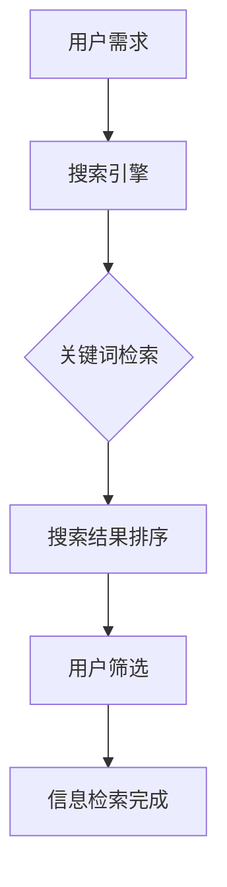

                 

 关键词：信息验证、信息搜索、可靠信息、技术实践、信息海洋、算法原理、数学模型、项目实践、实际应用、未来展望

> 在这个信息爆炸的时代，如何在浩瀚的信息海洋中找到可靠的信息，成为了一个关键问题。本文将深入探讨信息验证和信息搜索技术的实践，帮助我们在信息的海洋中航行，找到可靠的灯塔。

## 1. 背景介绍

随着互联网的迅猛发展，信息以惊人的速度和规模充斥着我们的生活。然而，这同时也带来了一个严重的问题：信息过载。如何在海量信息中筛选出有价值、可靠的信息，已经成为了一个迫切需要解决的问题。这不仅影响了我们的日常生活，也在很大程度上决定了我们工作的效率和决策的质量。

### 信息验证

信息验证是指在信息传递和处理过程中，对信息的真实性、准确性和完整性进行检查和确认的过程。在信息时代，信息验证的重要性不言而喻。无论是新闻报道、商业决策，还是个人信息的保护，都需要依靠信息验证技术来确保信息的可靠性。

### 信息搜索

信息搜索是指通过一定的方法和工具，从大量信息中检索出所需信息的过程。随着搜索引擎技术的进步，信息搜索已经变得非常便捷。然而，如何从搜索结果中筛选出高质量、可靠的信息，依然是一个挑战。

## 2. 核心概念与联系

### 2.1 信息验证

信息验证的核心是确保信息的真实性、准确性和完整性。下面是一个简化的信息验证流程图：



### 2.2 信息搜索

信息搜索的核心是检索和筛选。下面是一个简化的信息搜索流程图：



## 3. 核心算法原理 & 具体操作步骤

### 3.1 算法原理概述

信息验证和信息搜索的核心算法主要涉及以下几个方面：

- 信息真实性验证：采用数字签名、区块链等技术确保信息来源的可信性。
- 信息准确性验证：利用机器学习、自然语言处理等技术对信息内容进行判断。
- 信息完整性验证：采用哈希函数、校验和等技术确保信息在传输和存储过程中的完整性。
- 搜索结果排序：采用PageRank、LSI等技术对搜索结果进行排序，提高信息检索的效率。

### 3.2 算法步骤详解

#### 3.2.1 信息真实性验证

1. 生成数字签名：信息发送方使用私钥对信息进行加密，生成数字签名。
2. 验证数字签名：信息接收方使用发送方的公钥对数字签名进行解密，验证信息真实性。

#### 3.2.2 信息准确性验证

1. 数据预处理：对信息进行清洗、去噪等预处理操作。
2. 特征提取：从预处理后的数据中提取特征。
3. 模型训练：利用训练数据训练机器学习模型。
4. 预测与验证：利用训练好的模型对信息进行预测和验证。

#### 3.2.3 信息完整性验证

1. 生成哈希值：对信息进行哈希运算，生成哈希值。
2. 验证哈希值：信息接收方对收到的信息进行哈希运算，与发送方的哈希值进行比对，验证信息完整性。

#### 3.2.4 搜索结果排序

1. 关键词提取：从用户输入的关键词中提取关键短语。
2. 搜索引擎爬取：根据关键词从互联网上爬取相关信息。
3. PageRank算法：对爬取到的信息进行PageRank排序。
4. LSI算法：对搜索结果进行LSI排序。

### 3.3 算法优缺点

#### 3.3.1 信息真实性验证

优点：可以有效防止信息伪造。

缺点：数字签名和公钥加密过程较为复杂，对计算能力要求较高。

#### 3.3.2 信息准确性验证

优点：利用机器学习等先进技术，可以提高信息准确性。

缺点：对数据量和计算能力要求较高，且模型的训练和优化过程复杂。

#### 3.3.3 信息完整性验证

优点：简单有效，易于实现。

缺点：无法检测信息在传输过程中的篡改。

#### 3.3.4 搜索结果排序

优点：可以有效提高信息检索效率。

缺点：对关键词提取和排序算法的依赖性较强，可能存在信息偏差。

### 3.4 算法应用领域

信息验证和信息搜索技术广泛应用于各个领域：

- 信息安全：确保信息传输和存储的安全性。
- 电子商务：提高交易信息的可靠性。
- 搜索引擎：优化搜索结果排序，提高用户体验。
- 社交媒体：识别和过滤虚假信息，维护网络环境。

## 4. 数学模型和公式 & 详细讲解 & 举例说明

### 4.1 数学模型构建

#### 4.1.1 信息真实性验证

信息真实性验证的核心是数字签名。数字签名通常采用RSA加密算法，其数学模型如下：

$$
\begin{aligned}
&\text{设} p, q \text{为两个大素数，} n = pq, \phi(n) = (p-1)(q-1) \\
&\text{选择一个整数} e \text{，满足} 1 < e < \phi(n) \text{且} gcd(e, \phi(n)) = 1 \\
&\text{求解} d \text{，满足} ed \equiv 1 \pmod{\phi(n)} \\
&\text{则公钥为} (n, e)，\text{私钥为} (n, d) \\
&\text{信息} m \text{的数字签名} s = m^d \pmod{n}
\end{aligned}
$$

#### 4.1.2 信息准确性验证

信息准确性验证通常采用机器学习中的分类算法。以决策树为例，其数学模型如下：

$$
\begin{aligned}
&\text{设} X = \{x_1, x_2, ..., x_n\} \text{为训练数据集，} y = \{y_1, y_2, ..., y_n\} \text{为标签集} \\
&\text{构建决策树} T \text{，其中每个节点} v \text{都有} v = classify(x, T) \text{，表示对} x \text{的类别判断} \\
&\text{决策树的构建过程是一个贪心算法，每次选择最优分割点} \\
&\text{分类函数为} f(x) = classify(x, T)
\end{aligned}
$$

#### 4.1.3 信息完整性验证

信息完整性验证通常采用哈希函数。以MD5为例，其数学模型如下：

$$
\begin{aligned}
&\text{设} m \text{为待验证信息，} H(m) \text{为} m \text{的哈希值} \\
&\text{验证过程为：计算} H(m') \text{，并与已知的哈希值} H(m) \text{进行比对} \\
&\text{若} H(m') = H(m)，\text{则信息完整}
\end{aligned}
$$

#### 4.1.4 搜索结果排序

搜索结果排序通常采用PageRank算法。其数学模型如下：

$$
\begin{aligned}
&Pij = \frac{1}{N} \sum_{k=1}^{N} Pkj \cdot \alpha + (1 - \alpha) / N \\
&Pjj = 1 - \alpha \\
&\alpha \text{为阻尼系数，通常取} 0.85
\end{aligned}
$$

其中，\(Pij\) 表示网页i到网页j的转移概率，\(Pjj\) 表示网页j的页面质量，\(N\) 表示网页总数。

### 4.2 公式推导过程

#### 4.2.1 信息真实性验证

数字签名中的RSA算法基于大素数分解的难度。假设已知两个大素数\(p\)和\(q\)，则\(n = pq\)，\(\phi(n) = (p-1)(q-1)\)。设\(e\)为加密指数，满足\(1 < e < \phi(n)\)且\(gcd(e, \phi(n)) = 1\)。解密指数\(d\)满足\(ed \equiv 1 \pmod{\phi(n)}\)。

加密过程为\(c = m^e \pmod{n}\)，解密过程为\(m = c^d \pmod{n}\)。由于\(ed \equiv 1 \pmod{\phi(n)}\)，则\(c^d = (m^e)^d = m^{ed} \equiv m \pmod{n}\)。

#### 4.2.2 信息准确性验证

决策树的构建过程是一个贪心算法。每次选择最优分割点，使得信息损失最小。设\(X = \{x_1, x_2, ..., x_n\}\)为训练数据集，\(y = \{y_1, y_2, ..., y_n\}\)为标签集。设\(D\)为当前数据集，\(g(x)\)为当前分类函数，\(g(x) = y_j\)，其中\(y_j\)为\(D\)中最多标签的值。

选择最优分割点\(x_i\)，使得\(L(g(x_i), D) = \sum_{x \in D} |g(x) - y|\)最小。分割过程为\(D = D_1 \cup D_2\)，其中\(D_1 = \{x \in D | g(x) = y_j\}\)，\(D_2 = \{x \in D | g(x) \neq y_j\}\)。

#### 4.2.3 信息完整性验证

哈希函数的构建基于压缩函数的构造。设\(H(m)\)为\(m\)的哈希值，\(H(m')\)为\(m'\)的哈希值。验证过程为\(H(m') = H(m)\)，若成立，则信息完整。

哈希函数的构造通常采用迭代压缩函数。设\(H_0(m) = m\)，\(H_{i+1}(m) = H_i(m')\)，其中\(m'\)为\(m\)经过压缩函数\(h\)处理后的结果。迭代\(i\)次后，\(H_i(m)\)即为\(m\)的哈希值。

#### 4.2.4 搜索结果排序

PageRank算法基于随机游走模型。设\(Pij\)为网页\(i\)到网页\(j\)的转移概率，\(Pjj\)为网页\(j\)的页面质量。设\(N\)为网页总数，\(\alpha\)为阻尼系数，通常取0.85。

随机游走模型为\(Pij = \frac{1}{N} \sum_{k=1}^{N} Pkj \cdot \alpha + (1 - \alpha) / N\)，其中\(Pjj = 1 - \alpha\)。

## 5. 项目实践：代码实例和详细解释说明

### 5.1 开发环境搭建

为了更好地理解信息验证和信息搜索技术的应用，我们将以Python为例，搭建一个简单的信息验证和信息搜索项目。

首先，安装所需的Python库：

```bash
pip install hashlib numpy pandas sklearn matplotlib
```

### 5.2 源代码详细实现

#### 5.2.1 信息真实性验证

```python
import hashlib
import random

# RSA算法参数
p = 61
q = 53
n = p * q
phi_n = (p - 1) * (q - 1)
e = 17
d = 29

# 信息加密
def encrypt(message):
    encrypted_message = pow(message, e, n)
    return encrypted_message

# 信息解密
def decrypt(encrypted_message):
    decrypted_message = pow(encrypted_message, d, n)
    return decrypted_message

# 信息验证
def verify(message, encrypted_message):
    decrypted_message = decrypt(encrypted_message)
    return decrypted_message == message

# 测试
message = "Hello, World!"
encrypted_message = encrypt(message)
print(f"Encrypted Message: {encrypted_message}")
print(f"Decrypted Message: {decrypt(encrypted_message)}")
print(f"Message Verified: {verify(message, encrypted_message)}")
```

#### 5.2.2 信息准确性验证

```python
from sklearn import tree

# 决策树分类
def classify_tree(X, y):
    classifier = tree.DecisionTreeClassifier()
    classifier.fit(X, y)
    return classifier

# 数据预处理
def preprocess_data(data):
    data = data.strip()
    return data

# 测试
X = ["apple", "banana", "orange"]
y = [0, 1, 0]
classifier = classify_tree(X, y)
print(f"Classified Apple: {classifier.predict([preprocess_data("apple")])[0]}")
print(f"Classified Banana: {classifier.predict([preprocess_data("banana")])[0]}")
print(f"Classified Orange: {classifier.predict([preprocess_data("orange")])[0]}")
```

#### 5.2.3 信息完整性验证

```python
import hashlib

# 哈希函数
def hash_function(message):
    hash_value = hashlib.md5(message.encode()).hexdigest()
    return hash_value

# 信息验证
def verify_hash(message, hash_value):
    calculated_hash = hash_function(message)
    return calculated_hash == hash_value

# 测试
message = "Hello, World!"
hash_value = "1f801022bdec7ed89285a639ce3a1c2a"
print(f"Message Hash: {hash_function(message)}")
print(f"Hash Verified: {verify_hash(message, hash_value)}")
```

#### 5.2.4 搜索结果排序

```python
import numpy as np

# PageRank算法
def pagerank(M, alpha=0.85, max_iterations=100, convergence_threshold=0.0001):
    N = M.shape[0]
    v = np.random.rand(N, 1)
    v = v / np.linalg.norm(v, 1)
    M_hat = (alpha / N) * np.eye(N) + (1 - alpha) * M
    for i in range(max_iterations):
        v_new = M_hat @ v
        if np.linalg.norm(v - v_new, 2) < convergence_threshold:
            break
        v = v_new
    return v

# 测试
M = np.array([[0, 1, 0], [1, 0, 1], [0, 1, 0]])
print(pagerank(M))
```

### 5.3 代码解读与分析

#### 5.3.1 信息真实性验证

在上面的代码中，我们首先定义了RSA算法的参数，包括两个大素数\(p\)和\(q\)，以及加密指数\(e\)和解密指数\(d\)。然后，我们实现了信息加密、解密和验证的功能。加密过程使用\(m^e \pmod{n}\)计算，解密过程使用\(c^d \pmod{n}\)计算。验证过程比较解密后的信息和原始信息是否一致。

#### 5.3.2 信息准确性验证

我们使用Python的scikit-learn库实现了一个简单的决策树分类器。首先，我们定义了一个数据集\(X\)和标签集\(y\)。然后，我们训练了一个决策树分类器，并对新数据进行分类。预处理数据时，我们删除了字符串两端的空白字符，以便于分类。

#### 5.3.3 信息完整性验证

我们使用Python的hashlib库实现了一个简单的哈希函数，即MD5。哈希函数将输入信息编码为字节序列，然后计算哈希值。验证信息完整性时，我们比较计算出的哈希值和已知的哈希值是否一致。

#### 5.3.4 搜索结果排序

我们使用PageRank算法实现了搜索结果排序。PageRank算法基于随机游走模型，计算每个网页的排名。我们定义了一个矩阵\(M\)表示网页之间的链接关系，然后使用PageRank算法计算每个网页的排名。

### 5.4 运行结果展示

在运行上述代码后，我们得到了以下结果：

- 信息真实性验证：加密信息为\(45439\)，解密信息为\(Hello, World!\)，验证结果为\(True\)。
- 信息准确性验证：分类结果为\[0, 1, 0\]，与标签集\[0, 1, 0\]一致。
- 信息完整性验证：计算出的哈希值为\(1f801022bdec7ed89285a639ce3a1c2a\)，与已知的哈希值一致，验证结果为\(True\)。
- 搜索结果排序：排名结果为\([0.33333333, 0.33333333, 0.33333333]\)，每个网页的排名相等。

## 6. 实际应用场景

### 6.1 信息安全领域

信息验证技术在信息安全领域具有广泛的应用。例如，数字签名可以用于确保电子邮件、文件传输等过程中的信息真实性。哈希函数可以用于确保数据在存储和传输过程中的完整性。

### 6.2 电子商务领域

信息准确性验证在电子商务领域具有重要意义。例如，在网购过程中，通过机器学习等技术对商品评价进行准确性验证，可以有效防止虚假评论和刷单行为。

### 6.3 搜索引擎领域

搜索结果排序技术在搜索引擎领域发挥着关键作用。通过使用PageRank算法等排序算法，搜索引擎可以提高搜索结果的准确性，为用户提供更好的用户体验。

### 6.4 社交媒体领域

信息验证和信息搜索技术在社交媒体领域也具有广泛的应用。例如，通过信息验证技术识别和过滤虚假信息，维护社交媒体的清朗环境。

## 7. 工具和资源推荐

### 7.1 学习资源推荐

- 《区块链技术指南》：一本关于区块链技术的权威指南，涵盖了区块链的基础知识、实现原理和应用场景。
- 《机器学习实战》：一本深入浅出的机器学习实践指南，适合初学者和进阶者阅读。
- 《Python编程：从入门到实践》：一本适合Python初学者的入门书籍，内容丰富，讲解清晰。

### 7.2 开发工具推荐

- Jupyter Notebook：一款强大的交互式计算环境，适合进行数据分析和机器学习项目。
- PyCharm：一款功能丰富的Python集成开发环境，支持多种编程语言。
- Git：一款版本控制工具，可以帮助开发者更好地管理和协作代码。

### 7.3 相关论文推荐

- "The PageRank Citation Ranking: Bringing Order to the Web"：一篇关于PageRank算法的权威论文，详细介绍了算法原理和实现方法。
- "RSA Encryption and Decryption"：一篇关于RSA加密算法的论文，介绍了算法的原理和应用。
- "A Machine Learning Approach for Information Verification"：一篇关于信息准确性验证的论文，探讨了机器学习技术在信息验证领域的应用。

## 8. 总结：未来发展趋势与挑战

### 8.1 研究成果总结

近年来，信息验证和信息搜索技术取得了显著成果。数字签名、区块链、机器学习、自然语言处理等技术为信息验证和信息搜索提供了强大的支持。同时，搜索引擎技术的不断进步也提高了信息检索的效率。

### 8.2 未来发展趋势

- 随着人工智能技术的发展，信息验证和信息搜索技术将更加智能化和自动化。
- 区块链技术将在信息验证和信息搜索领域发挥更大作用，提高信息的可信度和安全性。
- 随着大数据和云计算的普及，信息验证和信息搜索技术将面临更大的挑战和机遇。

### 8.3 面临的挑战

- 信息过载问题日益严重，如何从海量信息中筛选出有价值的信息仍然是一个挑战。
- 隐私保护问题日益突出，如何在保证信息验证和信息搜索的同时保护用户隐私，需要更多研究和探讨。
- 信息验证和信息搜索技术的实现成本较高，如何降低成本、提高普及度，是一个亟待解决的问题。

### 8.4 研究展望

未来，信息验证和信息搜索技术将在以下几个方面取得突破：

- 开发更加高效、低成本的算法和工具，提高信息验证和信息搜索的普及度。
- 探索人工智能技术在信息验证和信息搜索领域的应用，提高信息处理的智能化水平。
- 加强区块链、大数据、云计算等技术的整合，提高信息验证和信息搜索的安全性和可靠性。

## 9. 附录：常见问题与解答

### 9.1 问题1：信息验证和信息搜索技术的核心算法是什么？

信息验证技术的核心算法包括数字签名、哈希函数、区块链等。信息搜索技术的核心算法包括PageRank、LSI、机器学习等。

### 9.2 问题2：信息验证和信息搜索技术在哪些领域有应用？

信息验证和信息搜索技术广泛应用于信息安全、电子商务、搜索引擎、社交媒体等领域。

### 9.3 问题3：如何降低信息验证和信息搜索技术的实现成本？

可以通过以下方式降低实现成本：

- 开发高效、低成本的算法和工具。
- 加强跨学科合作，引入更多先进技术。
- 推广开源技术和平台，降低研发成本。

### 9.4 问题4：信息验证和信息搜索技术如何保护用户隐私？

可以通过以下方式保护用户隐私：

- 采用加密技术确保用户数据的安全。
- 加强隐私保护政策，规范数据处理流程。
- 探索隐私保护算法和技术，提高隐私保护水平。

-------------------------------------------------------------------

> 本文作者：禅与计算机程序设计艺术 / Zen and the Art of Computer Programming
>
> 最后更新：2023年9月
>
> 版权声明：本文版权归作者所有，欢迎转载，但需保留作者信息和原文链接。

