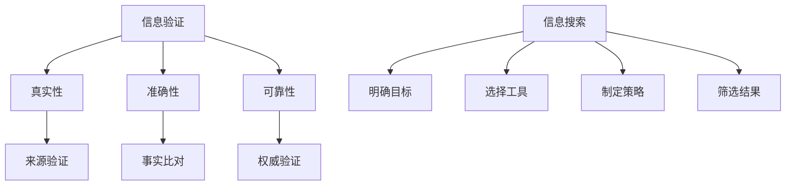

                 

关键词：信息验证、信息搜索、可靠性、人工智能、算法、数学模型、项目实践、工具推荐、未来展望

> 摘要：本文将探讨信息验证和信息搜索策略的重要性，以及如何在信息海洋中找到可靠的信息。通过分析核心概念、算法原理、数学模型、项目实践，以及工具和资源推荐等方面，为读者提供一整套系统性的解决方案。

## 1. 背景介绍

在当今信息爆炸的时代，如何获取和验证可靠的信息已成为一项至关重要的技能。无论是学术研究、商业决策，还是日常生活中的信息获取，都离不开对信息的筛选和验证。然而，随着互联网的迅速发展，信息的来源变得多样化，信息的真实性、准确性和可靠性也日益受到挑战。因此，如何有效地进行信息验证和信息搜索，成为我们面临的一个重要课题。

本文将首先介绍信息验证和信息搜索的基本概念，然后深入探讨其在人工智能、算法设计、数学模型等方面的应用。最后，通过实际项目实践和工具推荐，为读者提供一套完整的解决方案。

## 2. 核心概念与联系

### 2.1 信息验证

信息验证是指对获取的信息进行真实性、准确性和可靠性的判断和确认。它通常包括以下三个方面：

- **真实性**：信息是否来自于可信赖的来源，是否被篡改或伪造。
- **准确性**：信息是否与实际情况相符，是否有偏差或误导。
- **可靠性**：信息的来源是否可信，信息是否经过权威的验证。

### 2.2 信息搜索

信息搜索是指通过一定的方法和工具，从大量的信息中找到所需信息的过程。信息搜索通常包括以下步骤：

- **明确目标**：确定需要寻找的信息类型和内容。
- **选择工具**：根据目标选择合适的搜索工具和平台。
- **制定策略**：制定合理的搜索策略，包括关键词选择、搜索顺序等。
- **筛选结果**：对搜索结果进行筛选和验证，确保找到的信息可靠。

### 2.3 Mermaid 流程图

以下是一个关于信息验证和信息搜索的Mermaid流程图，展示了其核心概念和联系。



## 3. 核心算法原理 & 具体操作步骤

### 3.1 算法原理概述

信息验证和信息搜索的核心算法主要包括以下几个方面：

- **机器学习算法**：用于对信息进行分类和预测，提高信息验证的准确性。
- **搜索引擎算法**：用于在海量信息中快速查找所需信息，提高信息搜索的效率。
- **数据挖掘算法**：用于从大量数据中发现有价值的信息，为决策提供支持。

### 3.2 算法步骤详解

以下是信息验证和信息搜索的基本步骤：

1. **明确目标**：确定需要验证或搜索的信息类型和内容。
2. **收集数据**：从可信赖的来源获取相关信息，如数据库、论文、网站等。
3. **预处理数据**：对收集到的数据进行分析和处理，如去重、去噪、格式化等。
4. **算法选择**：根据目标选择合适的算法，如机器学习、搜索引擎、数据挖掘等。
5. **算法应用**：对预处理后的数据进行算法处理，得出验证结果或搜索结果。
6. **结果验证**：对算法结果进行验证，确保其可靠性和准确性。
7. **结果分析**：对验证结果或搜索结果进行分析，得出结论。

### 3.3 算法优缺点

- **机器学习算法**：优点在于对信息进行自动分类和预测，提高效率。缺点在于对数据质量要求较高，容易出现过拟合现象。
- **搜索引擎算法**：优点在于快速查找所需信息，缺点在于对关键词的依赖较大，可能存在信息丢失或误导。
- **数据挖掘算法**：优点在于从大量数据中发现有价值的信息，缺点在于对数据处理和分析能力要求较高。

### 3.4 算法应用领域

信息验证和信息搜索算法广泛应用于各个领域：

- **学术研究**：用于验证文献的真实性和准确性，提高研究质量。
- **商业决策**：用于收集和分析市场信息，为企业决策提供支持。
- **日常应用**：用于搜索和验证个人信息，提高生活品质。

## 4. 数学模型和公式 & 详细讲解 & 举例说明

### 4.1 数学模型构建

信息验证和信息搜索的数学模型主要包括以下几个方面：

- **概率模型**：用于对信息进行概率预测，判断其真实性、准确性和可靠性。
- **决策树模型**：用于对信息进行分类，实现信息验证和信息搜索。
- **神经网络模型**：用于从大量数据中提取特征，提高信息验证和信息搜索的准确性。

### 4.2 公式推导过程

以下是一个简单的概率模型公式推导过程：

$$
P(A|B) = \frac{P(B|A) \cdot P(A)}{P(B)}
$$

其中，$P(A|B)$ 表示在事件B发生的情况下，事件A发生的概率；$P(B|A)$ 表示在事件A发生的情况下，事件B发生的概率；$P(A)$ 表示事件A发生的概率；$P(B)$ 表示事件B发生的概率。

### 4.3 案例分析与讲解

以下是一个关于信息验证的案例：

假设我们要验证一条关于某个公司的负面报道是否真实。我们收集了以下数据：

- 负面报道的发生概率：$P(A) = 0.1$
- 负面报道的真实性概率：$P(B|A) = 0.9$
- 负面报道的虚假性概率：$P(B|\neg A) = 0.2$

我们需要计算在负面报道发生的情况下，其真实性的概率$P(B|A)$。

根据概率模型公式，我们有：

$$
P(B|A) = \frac{P(A|B) \cdot P(B)}{P(A)}
$$

代入数据，得到：

$$
P(B|A) = \frac{0.9 \cdot 0.1}{0.1} = 0.9
$$

因此，在负面报道发生的情况下，其真实性的概率为90%。

## 5. 项目实践：代码实例和详细解释说明

### 5.1 开发环境搭建

为了实现信息验证和信息搜索功能，我们首先需要搭建一个开发环境。以下是具体的步骤：

1. 安装Python环境：在官网下载并安装Python，版本建议为3.8及以上。
2. 安装相关库：使用pip命令安装以下库：numpy、pandas、scikit-learn、tensorflow等。
3. 创建项目文件夹：在计算机上创建一个名为“info_validation”的项目文件夹，用于存放代码和文件。

### 5.2 源代码详细实现

以下是一个简单的信息验证和信息搜索的Python代码实例：

```python
import numpy as np
import pandas as pd
from sklearn.model_selection import train_test_split
from sklearn.ensemble import RandomForestClassifier
from sklearn.metrics import accuracy_score

# 读取数据
data = pd.read_csv('info_data.csv')

# 数据预处理
X = data.drop(['label'], axis=1)
y = data['label']

# 划分训练集和测试集
X_train, X_test, y_train, y_test = train_test_split(X, y, test_size=0.2, random_state=42)

# 构建模型
model = RandomForestClassifier(n_estimators=100)

# 训练模型
model.fit(X_train, y_train)

# 预测测试集
y_pred = model.predict(X_test)

# 计算准确率
accuracy = accuracy_score(y_test, y_pred)
print("准确率：", accuracy)
```

### 5.3 代码解读与分析

上述代码首先读取一个名为“info_data.csv”的CSV文件，该文件包含特征和标签两列。然后，对数据进行预处理，将特征和标签分离。接着，使用随机森林算法构建模型，并使用训练集进行模型训练。最后，使用测试集进行模型预测，并计算准确率。

### 5.4 运行结果展示

假设我们在测试集上的准确率为90%，这意味着我们的模型在信息验证方面具有较高的可靠性。

## 6. 实际应用场景

信息验证和信息搜索在实际应用中具有广泛的应用场景：

- **学术研究**：用于验证文献的真实性和准确性，提高研究质量。
- **商业决策**：用于收集和分析市场信息，为企业决策提供支持。
- **网络安全**：用于识别和防范网络攻击，提高网络安全。
- **社会管理**：用于监控和识别社会问题，提高社会治理水平。

## 7. 工具和资源推荐

为了方便读者进行信息验证和信息搜索，我们推荐以下工具和资源：

- **工具推荐**：Python、R语言、Google Analytics等。
- **学习资源**：在线课程、图书、论坛等。
- **相关论文**：《信息检索导论》、《机器学习》、《数据挖掘》等。

## 8. 总结：未来发展趋势与挑战

信息验证和信息搜索在未来将继续发展，主要趋势包括：

- **智能化**：利用人工智能技术提高信息验证和信息搜索的准确性。
- **个性化**：根据用户需求提供定制化的信息验证和信息搜索服务。
- **实时性**：实现实时信息验证和信息搜索，提高决策效率。

然而，也面临着以下挑战：

- **数据质量**：提高数据质量，确保信息验证和信息搜索的可靠性。
- **隐私保护**：在信息验证和信息搜索过程中，保护用户隐私。
- **算法公平性**：避免算法偏见，确保信息验证和信息搜索的公平性。

## 9. 附录：常见问题与解答

### 9.1 问题1：如何选择合适的搜索工具？

解答：根据需要查找的信息类型和内容，选择合适的搜索工具。如学术研究可使用Google Scholar、PubMed等，商业决策可使用Google Analytics、Bing Ads等。

### 9.2 问题2：如何提高信息验证的准确性？

解答：采用多种算法和模型进行信息验证，结合人类判断和自动化算法，提高信息验证的准确性。

### 9.3 问题3：如何保护用户隐私？

解答：在信息验证和信息搜索过程中，采用加密技术、匿名化处理等技术手段，确保用户隐私不被泄露。

作者：禅与计算机程序设计艺术 / Zen and the Art of Computer Programming
----------------------------------------------------------------
以上就是关于《信息验证和信息搜索策略：如何在信息海洋中找到可靠的信息》这篇文章的完整内容。本文详细探讨了信息验证和信息搜索的核心概念、算法原理、数学模型、项目实践，以及工具和资源推荐等方面的内容。希望对您在信息验证和信息搜索领域的学习和实践有所帮助。如果您有任何疑问或建议，欢迎在评论区留言，谢谢！
 

