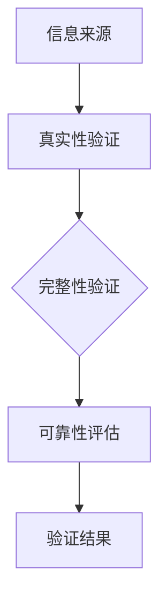
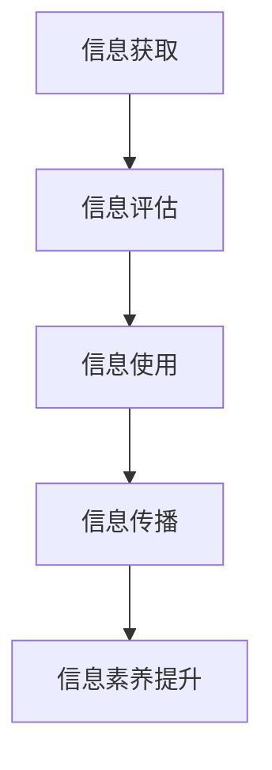

                 

关键词：信息验证、信息素养、教育、数字时代、编程技能、网络安全、人工智能

> 摘要：随着数字时代的到来，信息验证和信息素养教育的重要性日益凸显。本文旨在探讨信息验证的基本概念、在教育中的重要性，以及如何通过培养信息素养能力，为个人和整个社会应对数字时代挑战提供坚实的支撑。

## 1. 背景介绍

在信息化和数字化的快速推进过程中，数据和信息成为了现代社会运行的核心资源。信息验证作为一种保障数据真实性和可靠性的机制，变得至关重要。同时，信息素养教育也愈发受到关注，它不仅关乎个体的知识获取与技能提升，更涉及整个社会对信息资源的高效利用和信息安全保障。

### 1.1 数字时代的特征

- **信息爆炸**：随着互联网的普及和智能设备的广泛应用，信息以惊人的速度增长和传播。
- **技术变革**：人工智能、大数据、云计算等新技术不断涌现，改变了信息处理和利用的方式。
- **网络安全威胁**：网络攻击、数据泄露等安全事件频繁发生，给个人和社会带来了巨大的风险。

### 1.2 信息验证的基本概念

信息验证是指对信息源、内容、完整性、可靠性等方面进行核查和确认的过程。在数字化时代，信息验证不仅是为了确保信息的真实性，也是为了防范虚假信息、隐私泄露和网络欺诈等安全风险。

### 1.3 信息素养教育的兴起

信息素养教育旨在培养学生对信息的获取、评估、使用和传播的能力，是新时代教育的重要组成部分。随着数字技术的不断发展，信息素养教育的内涵和外延也在不断扩展。

## 2. 核心概念与联系

### 2.1 信息验证的重要性

信息验证是数字时代不可或缺的一环，其核心概念包括：

- **真实性**：验证信息的来源是否可信，内容是否真实。
- **完整性**：确保信息在传输和存储过程中未被篡改。
- **可靠性**：评估信息发布者的可信度和信息内容的可靠性。

以下是一个简化的 Mermaid 流程图，展示了信息验证的基本架构：



### 2.2 信息素养教育的作用

信息素养教育涉及以下几个方面：

- **信息检索**：培养学生有效地从大量信息中获取所需信息的能力。
- **信息评估**：教给学生如何评估信息来源和内容的真实性、准确性和相关性。
- **信息使用**：指导学生如何合理、有效地使用信息，包括信息整合、分析和应用。
- **信息传播**：培养学生正确、负责任地传播信息的能力。

以下是一个简化的 Mermaid 流程图，展示了信息素养教育的基本架构：



## 3. 核心算法原理 & 具体操作步骤

### 3.1 算法原理概述

信息验证和信息素养教育涉及多种算法和策略，以下是其中的两个关键算法：

- **哈希算法**：用于确保信息的完整性。哈希算法将信息映射为固定长度的哈希值，任何信息的修改都会导致哈希值的改变。
- **数字签名**：用于验证信息的真实性和完整性。数字签名是一种加密算法，确保信息的发送者身份和内容的不可篡改性。

### 3.2 算法步骤详解

#### 3.2.1 哈希算法

1. **选择哈希函数**：例如，SHA-256。
2. **计算哈希值**：对信息进行哈希处理，得到哈希值。
3. **存储哈希值**：将哈希值与原始信息一同存储或传输。
4. **验证完整性**：接收信息后，计算新的哈希值，与存储的哈希值进行比较，以验证信息的完整性。

#### 3.2.2 数字签名

1. **生成密钥对**：包括私钥和公钥。
2. **计算签名**：使用私钥对信息进行加密，生成数字签名。
3. **验证签名**：使用公钥对数字签名进行解密，并与原始信息进行比较，以验证信息的真实性。

### 3.3 算法优缺点

- **哈希算法**：优点是速度快、计算简单，缺点是对单个信息的修改无法检测。
- **数字签名**：优点是可检测信息的完整性和真实性，缺点是计算复杂度较高。

### 3.4 算法应用领域

- **哈希算法**：广泛应用于数据完整性验证、密码存储等领域。
- **数字签名**：广泛应用于电子合同、数字证书等领域。

## 4. 数学模型和公式 & 详细讲解 & 举例说明

### 4.1 数学模型构建

信息验证和信息素养教育的数学模型可以基于概率论和图论构建。例如，可以使用贝叶斯网络来描述信息来源的可信度，使用图论中的网络分析来评估信息的传播路径和影响力。

### 4.2 公式推导过程

以贝叶斯网络为例，其概率公式为：

$$P(A|B) = \frac{P(B|A)P(A)}{P(B)}$$

其中，$P(A|B)$ 表示在条件 $B$ 下事件 $A$ 的概率，$P(B|A)$ 表示在条件 $A$ 下事件 $B$ 的概率，$P(A)$ 和 $P(B)$ 分别表示事件 $A$ 和事件 $B$ 的概率。

### 4.3 案例分析与讲解

假设我们想要评估一个网站的可信度。我们可以构建一个贝叶斯网络，其中包含网站的可信度、内容质量、用户评论等多个因素。通过收集和分析数据，我们可以计算每个因素的贝叶斯概率，从而得出网站的整体可信度。

## 5. 项目实践：代码实例和详细解释说明

### 5.1 开发环境搭建

我们需要准备一个编程环境，例如 Python，并安装必要的库，如 `hashlib` 和 `cryptography`。

### 5.2 源代码详细实现

以下是一个简单的 Python 示例，展示了如何使用哈希算法和数字签名：

```python
import hashlib
from cryptography.hazmat.primitives import hashes
from cryptography.hazmat.primitives.asymmetric import padding

# 哈希算法示例
def calculate_hash(data):
    hasher = hashlib.sha256()
    hasher.update(data)
    return hasher.hexdigest()

# 数字签名示例
def sign_data(data, private_key):
    signer = private_key.signer(padding.PSS(
        mgf=padding.MGF1(hashes.SHA256()),
        salt_length=padding.PSS.MAX_LENGTH
    ))
    signer.update(data)
    return signer.finalize()

# 验证签名示例
def verify_signature(data, signature, public_key):
    verifier = public_key.verifier(signature, padding.PSS(
        mgf=padding.MGF1(hashes.SHA256()),
        salt_length=padding.PSS.MAX_LENGTH
    ))
    verifier.update(data)
    try:
        verifier.verify()
        return True
    except:
        return False

# 测试
data = b"Hello, World!"
private_key = ... # 生成私钥
public_key = ... # 生成公钥

hash_value = calculate_hash(data)
signature = sign_data(data, private_key)
is_valid = verify_signature(data, signature, public_key)

print("Hash Value:", hash_value)
print("Signature Valid:", is_valid)
```

### 5.3 代码解读与分析

这段代码首先定义了计算哈希值和数字签名的函数，然后使用这些函数对数据进行操作，最后验证签名是否有效。通过这个示例，我们可以看到如何将信息验证的基本算法应用到实际的编程实践中。

### 5.4 运行结果展示

运行这段代码后，我们将会得到哈希值和签名验证结果。这表明我们的数据在传输过程中没有被篡改，且发送者的身份得到了验证。

## 6. 实际应用场景

### 6.1 信息验证在网络安全中的应用

信息验证在网络安全中扮演着至关重要的角色。例如，在电子邮件系统中，通过数字签名和哈希算法，可以确保邮件的真实性和完整性。此外，在金融交易中，信息验证用于验证交易双方的合法性和交易数据的可靠性。

### 6.2 信息素养教育在社会治理中的作用

信息素养教育不仅对个人有益，也对社会治理具有重要意义。通过培养公民的信息素养，可以增强社会的整体信息识别和应对能力，减少虚假信息和网络欺诈事件的发生。

### 6.3 未来应用展望

随着技术的不断进步，信息验证和信息素养教育将在更多的领域得到应用。例如，在智能城市建设中，通过物联网设备收集的数据需要经过严格的信息验证，以确保数据的真实性和可靠性。同时，随着人工智能的发展，信息素养教育也将更加注重培养学生对人工智能技术的理解和应用能力。

## 7. 工具和资源推荐

### 7.1 学习资源推荐

- 《信息素养：面向信息社会的核心能力》
- 《网络安全技术实践》
- 《人工智能：一种现代方法》

### 7.2 开发工具推荐

- Python
- OpenSSL
- Hashimoto

### 7.3 相关论文推荐

- "The Importance of Information Literacy in the Digital Age"
- "Cryptographic Hash Functions: A Survey"
- "A Survey of Digital Signature Schemes"

## 8. 总结：未来发展趋势与挑战

### 8.1 研究成果总结

信息验证和信息素养教育在数字时代的重要性得到了广泛认可。通过多种算法和策略，信息验证能够有效保障数据的真实性和完整性，信息素养教育则提升了个体和社会对信息资源的高效利用和应对能力。

### 8.2 未来发展趋势

未来，信息验证和信息素养教育将更加注重技术的融合和应用，例如，在区块链、物联网等领域中发挥重要作用。同时，随着人工智能的发展，信息素养教育也将更加注重培养学生的跨学科能力和创新思维。

### 8.3 面临的挑战

信息验证和信息素养教育面临着数据隐私、网络安全等挑战。随着数据规模的扩大和技术的复杂度增加，如何确保信息的真实性和可靠性，如何培养具备信息素养能力的人才，成为亟待解决的问题。

### 8.4 研究展望

未来，信息验证和信息素养教育的研究将更加深入和多元化。例如，研究如何通过智能算法和大数据分析提升信息验证的效率和准确性，如何通过游戏化学习等创新方式提高信息素养教育的效果。

## 9. 附录：常见问题与解答

### 9.1 信息验证是什么？

信息验证是指对信息源、内容、完整性、可靠性等方面进行核查和确认的过程，以确保信息的真实性和可靠性。

### 9.2 信息素养教育包括哪些方面？

信息素养教育包括信息检索、信息评估、信息使用和信息传播等方面，旨在培养学生对信息的获取、评估、使用和传播的能力。

### 9.3 为什么信息验证和信息素养教育在数字时代非常重要？

在数字时代，信息爆炸和网络安全威胁日益严峻，信息验证和信息素养教育能够有效保障数据的真实性和完整性，提升个体和社会对信息资源的高效利用和信息安全保障能力。

### 9.4 如何培养信息素养能力？

通过系统的信息素养教育，结合实践项目和案例分析，可以培养个体的信息检索、评估、使用和传播能力。

---

**作者：禅与计算机程序设计艺术 / Zen and the Art of Computer Programming** 

本文旨在探讨信息验证和信息素养教育在数字时代的重要性，通过理论阐述、算法讲解和实际应用，展示了信息验证和信息素养教育的核心概念和应用价值。随着技术的不断进步，这些领域将面临新的挑战和机遇，继续深入研究和实践，将有助于构建更加安全、高效的数字时代。

