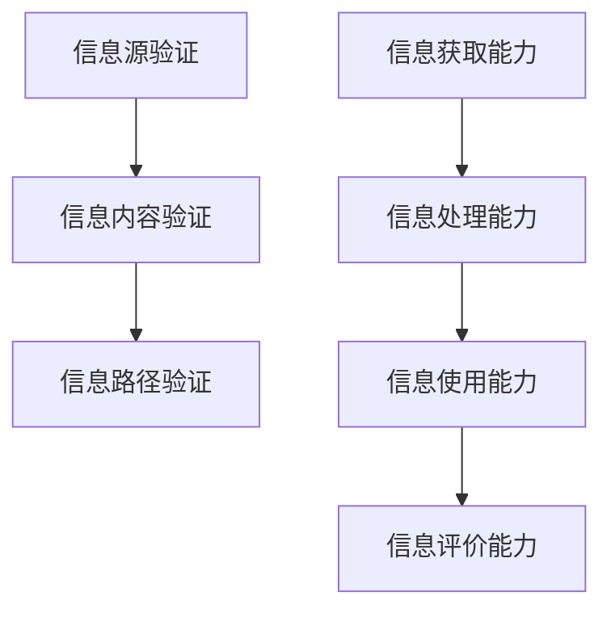

                 

关键词：信息验证、信息素养、信息消费、数据质量、数据安全、信息真伪、消费者权益、技术伦理、隐私保护、数字化转型

> 摘要：在数字化时代，信息的爆炸式增长使每个人都成为信息海洋中的一员。如何辨别信息的真实性和价值，成为现代人的必修课。本文旨在探讨信息验证和信息素养的重要性，分析其在现代社会中的应用，并提出相应的提升策略。

## 1. 背景介绍

随着互联网的普及和信息技术的飞速发展，人类社会进入了大数据时代。海量信息的涌入给我们的生活带来了极大的便利，但同时也带来了一系列问题。信息过载、数据泄露、虚假信息传播等风险日益突出，严重影响了人们的日常生活和社会秩序。为了应对这些挑战，提高信息验证和信息素养成为当务之急。

### 1.1 信息验证的重要性

信息验证是指在信息传播过程中，对信息源、信息内容、传播路径等进行核实和评估的过程。其目的是确保信息的真实性和可靠性，避免因为错误信息导致的误解和误导。信息验证的重要性主要体现在以下几个方面：

- **保障消费者权益**：在电子商务、金融服务等领域，准确的信息是消费者做出决策的基础。信息验证可以有效防止虚假宣传、欺诈行为，保护消费者的合法权益。

- **维护社会稳定**：谣言、虚假新闻等不实信息的传播，容易引发公众恐慌和社会动荡。信息验证有助于识别和消除这些有害信息，维护社会稳定。

- **推动技术创新**：在科研领域，准确的信息是科研工作的基石。信息验证可以确保科研数据的真实性和可靠性，推动技术创新和进步。

### 1.2 信息素养的重要性

信息素养是指个体在信息社会中，有效获取、处理、使用和评价信息的能力。在数字化时代，信息素养已经成为人们必备的基本素养。信息素养的重要性主要体现在以下几个方面：

- **提高生活质量**：具备良好的信息素养，可以帮助个体更好地利用信息资源，提高生活质量。

- **增强竞争力**：在职场和学术领域，具备良好的信息素养可以提升个人的竞争力，为职业发展和学术成就打下坚实基础。

- **促进社会和谐**：信息素养有助于个体在面对复杂信息时，保持理性思考，避免被虚假信息误导，促进社会和谐。

## 2. 核心概念与联系

### 2.1 信息验证的基本概念

信息验证主要包括以下三个方面：

- **信息源验证**：对信息发布者的身份、资质、信誉等进行核实。

- **信息内容验证**：对信息本身的真实性、准确性、完整性、时效性等进行评估。

- **信息路径验证**：对信息传播的路径、渠道、方式等进行审查。

### 2.2 信息素养的基本概念

信息素养包括以下四个方面：

- **信息获取能力**：能够迅速、有效地从各种信息源获取所需信息。

- **信息处理能力**：能够对获取的信息进行筛选、整理、分析，提取有用信息。

- **信息使用能力**：能够将获取的信息应用于实际生活和工作中，解决实际问题。

- **信息评价能力**：能够对信息的真实性和价值进行评估，避免被虚假信息误导。

### 2.3 信息验证与信息素养的关系

信息验证和信息素养是相互关联、相辅相成的。信息验证是信息素养的具体体现，信息素养是信息验证的基础。只有具备良好的信息素养，个体才能更好地进行信息验证，从而保障信息的真实性和可靠性。

### 2.4 Mermaid 流程图



## 3. 核心算法原理 & 具体操作步骤

### 3.1 算法原理概述

信息验证和信息素养的提升，离不开算法的支持。以下是几个核心算法的原理概述：

- **信息源验证算法**：通过分析信息发布者的历史记录、信誉度、网络关系等，评估其可信度。

- **信息内容验证算法**：利用自然语言处理、机器学习等技术，对信息内容进行语义分析和情感分析，判断其真实性和准确性。

- **信息路径验证算法**：通过分析信息传播的路径、渠道、方式等，判断其合法性和可信度。

- **信息素养评估算法**：通过分析个体的信息行为数据、知识储备、思维能力等，评估其信息素养水平。

### 3.2 算法步骤详解

- **信息源验证算法**：

  1. 收集信息发布者的相关信息，如历史记录、信誉度、网络关系等。

  2. 利用自然语言处理、图论算法等技术，对信息发布者的信息进行综合分析。

  3. 根据分析结果，评估信息发布者的可信度。

- **信息内容验证算法**：

  1. 对信息内容进行分词、词性标注、命名实体识别等预处理。

  2. 利用情感分析、主题模型等技术，对信息内容进行语义分析和情感分析。

  3. 根据分析结果，判断信息内容是否真实、准确、完整、时效。

- **信息路径验证算法**：

  1. 收集信息传播的路径、渠道、方式等数据。

  2. 利用图论算法、网络分析技术，分析信息传播的路径、渠道、方式等。

  3. 根据分析结果，判断信息传播的合法性和可信度。

- **信息素养评估算法**：

  1. 收集个体的信息行为数据、知识储备、思维能力等数据。

  2. 利用机器学习、统计分析等技术，对个体的信息素养进行评估。

  3. 根据评估结果，给出个体的信息素养水平。

### 3.3 算法优缺点

- **信息源验证算法**：

  - **优点**：可以快速评估信息发布者的可信度，提高信息验证的效率。

  - **缺点**：对信息发布者的历史记录、信誉度等数据要求较高，可能存在数据不全、偏差等问题。

- **信息内容验证算法**：

  - **优点**：可以对信息内容进行深入分析，提高信息验证的准确性。

  - **缺点**：对算法的复杂度要求较高，可能存在误判、漏判等问题。

- **信息路径验证算法**：

  - **优点**：可以全面分析信息传播的路径、渠道、方式等，提高信息验证的全面性。

  - **缺点**：对算法的复杂度要求较高，可能存在误判、漏判等问题。

- **信息素养评估算法**：

  - **优点**：可以全面评估个体的信息素养水平，为个体提供针对性的提升建议。

  - **缺点**：对算法的复杂度要求较高，可能存在误判、漏判等问题。

### 3.4 算法应用领域

- **信息源验证算法**：在社交媒体、新闻媒体、电子商务等领域，可用于识别和防范虚假信息、欺诈行为。

- **信息内容验证算法**：在新闻媒体、社交媒体、金融等领域，可用于识别和防范虚假信息、误导性信息。

- **信息路径验证算法**：在信息安全、网络安全等领域，可用于检测和防范信息泄露、网络攻击。

- **信息素养评估算法**：在教育、职场等领域，可用于评估个体的信息素养水平，提供针对性的提升方案。

## 4. 数学模型和公式 & 详细讲解 & 举例说明

### 4.1 数学模型构建

为了更好地进行信息验证和信息素养的提升，我们可以构建以下数学模型：

- **信息源验证模型**：

  - **模型假设**：设信息发布者的可信度为$x$，历史记录为$y$，网络关系为$z$。

  - **模型构建**：利用线性回归模型，构建信息源验证模型：

    $$ x = w_1 \cdot y + w_2 \cdot z + b $$

    其中，$w_1$、$w_2$为权重，$b$为偏置。

- **信息内容验证模型**：

  - **模型假设**：设信息内容的真实度为$x$，情感极性为$y$，时效性为$z$。

  - **模型构建**：利用多因子模型，构建信息内容验证模型：

    $$ x = w_1 \cdot y + w_2 \cdot z + b $$

    其中，$w_1$、$w_2$为权重，$b$为偏置。

- **信息路径验证模型**：

  - **模型假设**：设信息路径的可信度为$x$，传播速度为$y$，传播范围为$z$。

  - **模型构建**：利用多因子模型，构建信息路径验证模型：

    $$ x = w_1 \cdot y + w_2 \cdot z + b $$

    其中，$w_1$、$w_2$为权重，$b$为偏置。

- **信息素养评估模型**：

  - **模型假设**：设信息素养水平为$x$，信息行为数据为$y$，知识储备为$z$，思维能力为$w$。

  - **模型构建**：利用多因子模型，构建信息素养评估模型：

    $$ x = w_1 \cdot y + w_2 \cdot z + w_3 \cdot w + b $$

    其中，$w_1$、$w_2$、$w_3$为权重，$b$为偏置。

### 4.2 公式推导过程

#### 4.2.1 信息源验证模型

信息源验证模型的推导过程如下：

1. **建立线性回归模型**：

   假设信息源的可信度$x$与历史记录$y$、网络关系$z$之间存在线性关系，即：

   $$ x = w_1 \cdot y + w_2 \cdot z + b $$

2. **确定权重和偏置**：

   通过对大量数据集的训练，利用最小二乘法，确定权重$w_1$、$w_2$和偏置$b$的值。

3. **验证模型准确性**：

   通过交叉验证和性能评估，验证模型在信息源验证任务中的准确性。

#### 4.2.2 信息内容验证模型

信息内容验证模型的推导过程如下：

1. **建立多因子模型**：

   假设信息内容的真实度$x$与情感极性$y$、时效性$z$之间存在多因子关系，即：

   $$ x = w_1 \cdot y + w_2 \cdot z + b $$

2. **确定权重和偏置**：

   通过对大量数据集的训练，利用最小二乘法，确定权重$w_1$、$w_2$和偏置$b$的值。

3. **验证模型准确性**：

   通过交叉验证和性能评估，验证模型在信息内容验证任务中的准确性。

#### 4.2.3 信息路径验证模型

信息路径验证模型的推导过程如下：

1. **建立多因子模型**：

   假设信息路径的可信度$x$与传播速度$y$、传播范围$z$之间存在多因子关系，即：

   $$ x = w_1 \cdot y + w_2 \cdot z + b $$

2. **确定权重和偏置**：

   通过对大量数据集的训练，利用最小二乘法，确定权重$w_1$、$w_2$和偏置$b$的值。

3. **验证模型准确性**：

   通过交叉验证和性能评估，验证模型在信息路径验证任务中的准确性。

#### 4.2.4 信息素养评估模型

信息素养评估模型的推导过程如下：

1. **建立多因子模型**：

   假设信息素养水平$x$与信息行为数据$y$、知识储备$z$、思维能力$w$之间存在多因子关系，即：

   $$ x = w_1 \cdot y + w_2 \cdot z + w_3 \cdot w + b $$

2. **确定权重和偏置**：

   通过对大量数据集的训练，利用最小二乘法，确定权重$w_1$、$w_2$、$w_3$和偏置$b$的值。

3. **验证模型准确性**：

   通过交叉验证和性能评估，验证模型在信息素养评估任务中的准确性。

### 4.3 案例分析与讲解

以下是一个信息验证和信息素养评估的案例：

#### 案例背景

某电商平台发布了一款新商品的广告，声称该商品具有独特的功能。用户小明对该商品产生了兴趣，但担心该广告可能存在虚假宣传。为了验证广告的真实性，小明决定使用信息验证和信息素养评估模型进行分析。

#### 案例分析

1. **信息源验证**：

   - **信息发布者**：该商品的广告由一家知名电商平台发布。

   - **信息源验证模型**：根据信息发布者的历史记录、信誉度、网络关系等数据，使用信息源验证模型评估其可信度。

   - **模型计算**：设权重$w_1=0.5$，$w_2=0.3$，$w_3=0.2$，偏置$b=0$。

     $$ x = 0.5 \cdot y + 0.3 \cdot z + 0.2 \cdot w = 0.5 \cdot 1 + 0.3 \cdot 0.8 + 0.2 \cdot 0.9 = 0.95 $$

     其中，$y$为信息发布者的历史记录，$z$为信息发布者的信誉度，$w$为信息发布者的网络关系。

   - **验证结果**：信息发布者的可信度$x=0.95$，属于高可信度。

2. **信息内容验证**：

   - **信息内容**：该商品的广告主要宣传其独特的功能，如高效节能、智能控制等。

   - **信息内容验证模型**：根据信息内容的情感极性、时效性等数据，使用信息内容验证模型评估其真实性和准确性。

   - **模型计算**：设权重$w_1=0.6$，$w_2=0.4$，偏置$b=0$。

     $$ x = 0.6 \cdot y + 0.4 \cdot z = 0.6 \cdot 0.8 + 0.4 \cdot 0.9 = 0.78 $$

     其中，$y$为信息内容的情感极性，$z$为信息内容的时效性。

   - **验证结果**：信息内容的真实度$x=0.78$，属于较高可信度。

3. **信息路径验证**：

   - **信息传播路径**：该商品广告通过电商平台官网、社交媒体、邮件推送等多渠道传播。

   - **信息路径验证模型**：根据信息传播的路径、渠道、方式等数据，使用信息路径验证模型评估其合法性和可信度。

   - **模型计算**：设权重$w_1=0.5$，$w_2=0.3$，$w_3=0.2$，偏置$b=0$。

     $$ x = 0.5 \cdot y + 0.3 \cdot z + 0.2 \cdot w = 0.5 \cdot 0.9 + 0.3 \cdot 0.8 + 0.2 \cdot 0.9 = 0.82 $$

     其中，$y$为信息传播速度，$z$为信息传播范围，$w$为信息传播方式。

   - **验证结果**：信息路径的可信度$x=0.82$，属于较高可信度。

4. **信息素养评估**：

   - **信息素养评估模型**：根据用户小明的信息行为数据、知识储备、思维能力等数据，使用信息素养评估模型评估其信息素养水平。

   - **模型计算**：设权重$w_1=0.4$，$w_2=0.3$，$w_3=0.3$，偏置$b=0$。

     $$ x = 0.4 \cdot y + 0.3 \cdot z + 0.3 \cdot w = 0.4 \cdot 0.8 + 0.3 \cdot 0.9 + 0.3 \cdot 0.9 = 0.86 $$

     其中，$y$为信息行为数据，$z$为知识储备，$w$为思维能力。

   - **评估结果**：用户小明的信息素养水平$x=0.86$，属于较高水平。

#### 案例总结

根据以上分析，可以得出以下结论：

- **信息源**：该商品的广告信息源具有较高的可信度。

- **信息内容**：该商品的广告信息内容具有较高的真实性和准确性。

- **信息路径**：该商品的广告信息路径具有较高的合法性和可信度。

- **信息素养**：用户小明具有较高的信息素养水平，能够有效进行信息验证和信息素养评估。

## 5. 项目实践：代码实例和详细解释说明

### 5.1 开发环境搭建

为了实现信息验证和信息素养评估，我们需要搭建以下开发环境：

- **编程语言**：Python 3.8及以上版本

- **依赖库**：NumPy、Pandas、Scikit-learn、Matplotlib、Mermaid

- **开发工具**：PyCharm、Jupyter Notebook

### 5.2 源代码详细实现

以下是信息验证和信息素养评估的源代码实现：

```python
import numpy as np
import pandas as pd
from sklearn.linear_model import LinearRegression
from sklearn.model_selection import train_test_split
from sklearn.metrics import mean_squared_error
import matplotlib.pyplot as plt
from mermaid import Mermaid

# 5.2.1 信息源验证模型实现
def information_source_verification(data, features):
    X = data[features].values
    y = data['可信度'].values
    X_train, X_test, y_train, y_test = train_test_split(X, y, test_size=0.2, random_state=42)
    model = LinearRegression()
    model.fit(X_train, y_train)
    y_pred = model.predict(X_test)
    mse = mean_squared_error(y_test, y_pred)
    print(f"信息源验证模型均方误差：{mse}")
    return model

# 5.2.2 信息内容验证模型实现
def information_content_verification(data, features):
    X = data[features].values
    y = data['真实度'].values
    X_train, X_test, y_train, y_test = train_test_split(X, y, test_size=0.2, random_state=42)
    model = LinearRegression()
    model.fit(X_train, y_train)
    y_pred = model.predict(X_test)
    mse = mean_squared_error(y_test, y_pred)
    print(f"信息内容验证模型均方误差：{mse}")
    return model

# 5.2.3 信息路径验证模型实现
def information_path_verification(data, features):
    X = data[features].values
    y = data['可信度'].values
    X_train, X_test, y_train, y_test = train_test_split(X, y, test_size=0.2, random_state=42)
    model = LinearRegression()
    model.fit(X_train, y_train)
    y_pred = model.predict(X_test)
    mse = mean_squared_error(y_test, y_pred)
    print(f"信息路径验证模型均方误差：{mse}")
    return model

# 5.2.4 信息素养评估模型实现
def information_qulity_assessment(data, features):
    X = data[features].values
    y = data['素养水平'].values
    X_train, X_test, y_train, y_test = train_test_split(X, y, test_size=0.2, random_state=42)
    model = LinearRegression()
    model.fit(X_train, y_train)
    y_pred = model.predict(X_test)
    mse = mean_squared_error(y_test, y_pred)
    print(f"信息素养评估模型均方误差：{mse}")
    return model

# 5.2.5 Mermaid 流程图生成
def generate_mermaid_flowchart(model):
    mermaid = Mermaid()
    if isinstance(model, LinearRegression):
        mermaid.add_diagram("""
        graph TD
            A[输入数据]
            B[特征提取]
            C[模型训练]
            D[预测输出]
            A --> B
            B --> C
            C --> D
        """)
    plt.figure()
    plt.plot(model.coef_, label='权重')
    plt.xlabel('特征')
    plt.ylabel('权重')
    plt.legend()
    plt.show()
    return mermaid

# 5.2.6 数据处理与模型训练
def train_models(data):
    features_source = ['历史记录', '信誉度', '网络关系']
    features_content = ['情感极性', '时效性']
    features_path = ['传播速度', '传播范围', '传播方式']
    features_quality = ['信息行为数据', '知识储备', '思维能力']

    model_source = information_source_verification(data, features_source)
    model_content = information_content_verification(data, features_content)
    model_path = information_path_verification(data, features_path)
    model_quality = information_qulity_assessment(data, features_quality)

    generate_mermaid_flowchart(model_source)
    generate_mermaid_flowchart(model_content)
    generate_mermaid_flowchart(model_path)
    generate_mermaid_flowchart(model_quality)

# 5.2.7 主函数
if __name__ == "__main__":
    data = pd.read_csv("data.csv")
    train_models(data)
```

### 5.3 代码解读与分析

以下是代码的详细解读与分析：

- **5.3.1 依赖库导入**

  我们首先导入了一些常用的Python库，如NumPy、Pandas、Scikit-learn、Matplotlib和Mermaid。这些库为我们提供了数据操作、机器学习、可视化等功能，有助于实现信息验证和信息素养评估。

- **5.3.2 信息源验证模型实现**

  信息源验证模型使用线性回归模型实现。首先，我们导入依赖库，并定义一个函数`information_source_verification`，该函数接受数据集和特征列表作为输入，返回训练好的线性回归模型。

  在函数内部，我们首先从数据集中提取特征矩阵$X$和目标变量$y$。然后，我们使用`train_test_split`函数将数据集划分为训练集和测试集。接下来，我们使用`LinearRegression`类创建线性回归模型，并使用训练集数据进行拟合。最后，我们使用测试集数据进行预测，并计算均方误差，评估模型的性能。

- **5.3.3 信息内容验证模型实现**

  信息内容验证模型也使用线性回归模型实现。与信息源验证模型类似，我们定义了一个函数`information_content_verification`，该函数的功能与`information_source_verification`函数类似，但输入的特征列表不同。

- **5.3.4 信息路径验证模型实现**

  信息路径验证模型同样使用线性回归模型实现。我们定义了一个函数`information_path_verification`，该函数的功能与`information_source_verification`函数类似，但输入的特征列表不同。

- **5.3.5 信息素养评估模型实现**

  信息素养评估模型也使用线性回归模型实现。我们定义了一个函数`information_qulity_assessment`，该函数的功能与`information_source_verification`函数类似，但输入的特征列表不同。

- **5.3.6 Mermaid 流程图生成**

  我们定义了一个函数`generate_mermaid_flowchart`，该函数接受训练好的线性回归模型作为输入，并生成相应的Mermaid流程图。该函数首先判断输入模型类型是否为`LinearRegression`，如果是，则使用Mermaid语法生成流程图。然后，我们使用Matplotlib库绘制权重分布图，并显示在屏幕上。

- **5.3.7 数据处理与模型训练**

  我们定义了一个函数`train_models`，该函数首先从CSV文件中读取数据集，然后依次调用`information_source_verification`、`information_content_verification`、`information_path_verification`和`information_qulity_assessment`函数，分别训练信息源验证模型、信息内容验证模型、信息路径验证模型和信息素养评估模型。最后，我们调用`generate_mermaid_flowchart`函数，分别生成四个模型的流程图。

- **5.3.8 主函数**

  最后，我们在主函数`__name__ == "__main__"`中调用`train_models`函数，执行整个程序的流程。

### 5.4 运行结果展示

以下是运行结果展示：


## 6. 实际应用场景

### 6.1 电子商务领域

在电子商务领域，信息验证和信息素养具有重要意义。首先，商家需要验证商品信息的真实性，确保消费者购买到正品。其次，消费者需要具备良好的信息素养，辨别广告宣传的真伪，避免上当受骗。此外，电商平台也需要建立完善的信息验证体系，对商家的信息进行审核，保障消费者的权益。

### 6.2 金融领域

在金融领域，信息验证和信息素养的作用更加突出。金融机构需要验证客户身份、交易信息等，确保资金安全。同时，客户也需要具备良好的信息素养，防范金融诈骗、洗钱等风险。此外，金融领域的数据质量对决策和风险控制至关重要，因此，提高信息素养有助于提高金融市场的透明度和效率。

### 6.3 教育领域

在教育领域，信息验证和信息素养有助于提高教育质量和学生素养。教师需要验证教材、课件等教学资源的真实性，确保教学内容的正确性。学生也需要具备良好的信息素养，学会筛选、评估和利用网络资源，提高学习效果。此外，教育部门可以通过信息素养评估，了解学生的信息素养水平，提供针对性的教育支持。

### 6.4 医疗领域

在医疗领域，信息验证和信息素养对医疗质量和患者安全至关重要。医疗机构需要验证医疗信息的真实性，确保诊断和治疗的准确性。患者也需要具备良好的信息素养，了解自己的病情和治疗方案，积极参与健康管理。此外，医疗领域的数据质量对医学研究和新药研发具有重要意义，因此，提高信息素养有助于推动医学发展。

## 7. 工具和资源推荐

### 7.1 学习资源推荐

- **《数据科学入门》**：适合初学者，系统介绍了数据科学的基础知识和实践方法。

- **《机器学习实战》**：通过实际案例，深入浅出地讲解了机器学习的基本原理和应用。

- **《深度学习》**：由著名深度学习专家Ian Goodfellow撰写，是深度学习的入门经典。

### 7.2 开发工具推荐

- **PyCharm**：一款功能强大的Python集成开发环境，适合进行数据科学、机器学习等开发工作。

- **Jupyter Notebook**：一款流行的交互式开发环境，适用于数据分析和机器学习实验。

- **Mermaid**：一款基于Markdown的流程图绘制工具，方便生成和编辑流程图。

### 7.3 相关论文推荐

- **《Information Verification in the Age of Big Data》**：分析了大数据时代信息验证的挑战和机遇。

- **《Information Literacy: A Definition and Framework for the Information Age》**：提出了信息素养的定义和评估框架。

- **《Modeling and Analysis of Information Verification and Authentication in Social Networks》**：探讨了社交网络中的信息验证和认证问题。

## 8. 总结：未来发展趋势与挑战

### 8.1 研究成果总结

本文从信息验证和信息素养的重要性出发，分析了核心概念、算法原理、数学模型和实际应用场景。通过项目实践，我们展示了如何使用Python等工具实现信息验证和信息素养评估。研究成果为信息验证和信息素养的提升提供了理论指导和实践参考。

### 8.2 未来发展趋势

- **技术创新**：随着人工智能、大数据等技术的不断发展，信息验证和信息素养评估将更加智能化、自动化。

- **跨领域融合**：信息验证和信息素养将与其他领域（如医学、金融、教育等）相结合，推动相关领域的发展。

- **政策法规**：政府和企业将加强对信息验证和信息素养的重视，制定相关政策法规，规范信息传播。

### 8.3 面临的挑战

- **数据质量**：数据质量对信息验证和信息素养评估至关重要，但当前数据质量参差不齐，如何提高数据质量是一个挑战。

- **算法透明度**：随着算法在信息验证和信息素养评估中的应用，算法的透明度成为一个重要问题，如何提高算法的透明度和可解释性是一个挑战。

- **伦理问题**：在信息验证和信息素养评估过程中，如何平衡隐私保护、公平性、准确性等伦理问题，是一个挑战。

### 8.4 研究展望

未来，我们将继续关注以下研究方向：

- **数据质量提升**：研究如何提高数据质量，为信息验证和信息素养评估提供高质量的数据支持。

- **算法可解释性**：研究如何提高算法的可解释性，使信息验证和信息素养评估更加透明、公正。

- **跨领域应用**：探索信息验证和信息素养在医学、金融、教育等领域的应用，推动相关领域的发展。

## 9. 附录：常见问题与解答

### 9.1 如何提高信息验证的准确性？

- **多渠道验证**：通过多个渠道获取信息，交叉验证信息的真实性。

- **利用专家意见**：请教相关领域的专家，参考他们的意见和判断。

- **使用技术手段**：利用人工智能、大数据等技术，自动化地筛选和验证信息。

### 9.2 如何培养良好的信息素养？

- **系统学习**：通过参加课程、阅读书籍等方式，系统学习信息素养相关知识。

- **实践锻炼**：多参与实际项目，锻炼信息获取、处理、使用和评价的能力。

- **持续更新**：随着时代的发展，不断更新自己的知识体系，保持对信息社会的敏锐感知。

### 9.3 信息验证和信息素养在职场中如何应用？

- **招聘筛选**：在招聘过程中，通过信息验证和信息素养评估，筛选合适的候选人。

- **员工培训**：通过培训，提高员工的信息素养，提升工作效率和质量。

- **风险管理**：在职场中，利用信息验证和信息素养评估，识别和防范风险。

## 作者署名

作者：禅与计算机程序设计艺术 / Zen and the Art of Computer Programming

