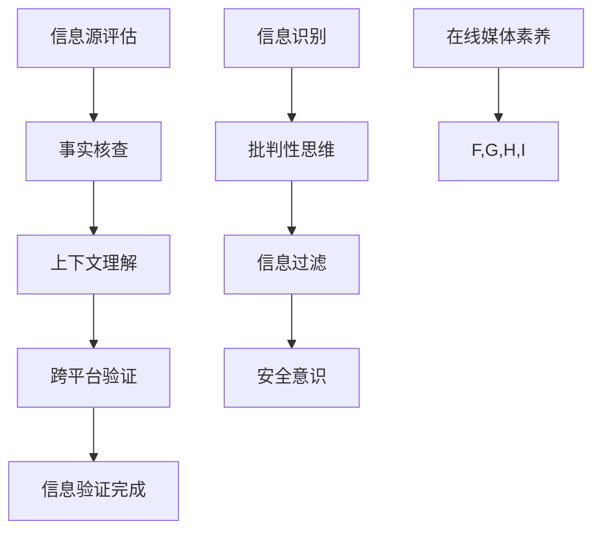

                 

### 关键词 Keywords
- 信息验证
- 在线媒体素养
- 假新闻
- 媒体操纵
- 网络安全
- 信息过滤

<|assistant|>### 摘要 Abstract
本文旨在探讨在信息爆炸和假新闻泛滥的时代，如何提升个人的在线媒体素养，通过有效的信息验证方法来辨别真伪，避免被媒体操纵所误导。文章首先介绍了当前网络环境中假新闻和媒体操纵的现状，随后详细阐述了信息验证的核心概念、技术和方法。通过数学模型和具体算法的讲解，文章帮助读者理解如何运用技术手段提高信息验证的准确性。最后，文章结合实际应用场景和项目实践，提出了一些提升在线媒体素养的策略，并展望了未来的发展趋势和面临的挑战。

## 1. 背景介绍

### 1.1 当前网络环境

随着互联网的普及，信息传播的速度和范围达到了前所未有的广度。社交媒体、新闻网站、博客、论坛等平台的兴起，使得每个人都可以成为信息的发布者，信息的生产、传播和消费变得更加便捷。然而，这也带来了一个问题：假新闻和媒体操纵现象日益严重。

假新闻，顾名思义，是指那些被故意传播、具有误导性的虚假信息。这些信息可能涉及政治、经济、社会、科学等各个领域，它们通过吸引眼球的标题、煽动性的语言和夸张的事实来获取关注和传播。例如，一些虚假的新闻报道可能会夸大某个科学研究的成果，或者歪曲政治事件的真实情况。

媒体操纵则是指利用媒体手段，对公众舆论进行引导和控制的行为。这包括对信息的筛选、编辑、发布和传播，目的是影响公众的观点、态度和行为。媒体操纵的手段多种多样，从伪造新闻源、篡改数据，到制造假账号、操控评论，不一而足。

### 1.2 假新闻和媒体操纵的影响

假新闻和媒体操纵对个人、社会乃至整个国家的影响是深远的。对个人而言，被误导的信息可能会影响其决策和行为，甚至引发恐慌和混乱。对社会而言，假新闻和媒体操纵会破坏社会的信任基础，导致公众对权威机构的怀疑，甚至可能引发社会动荡。对国家而言，假新闻和媒体操纵可能会影响政治稳定，损害国家形象，甚至可能对国家安全构成威胁。

因此，在这个信息爆炸和假新闻泛滥的时代，提升个人的在线媒体素养，学会有效地验证信息，显得尤为重要。

## 2. 核心概念与联系

### 2.1 信息验证的概念

信息验证，也称为事实核查，是指对信息源的真实性、准确性和可靠性进行审查和判断的过程。信息验证的目标是辨别信息的真伪，确保公众接收到的信息是真实可信的。

### 2.2 信息验证的关键环节

信息验证包括以下几个关键环节：

1. **信息源评估**：对信息源的背景、信誉、专业性和可靠性进行评估，以判断其是否值得信赖。
2. **事实核查**：对信息中的关键事实、数据和引用进行核实，确保其真实性和准确性。
3. **上下文理解**：理解信息所处的上下文环境，避免断章取义或误解信息。
4. **跨平台验证**：通过多个来源交叉验证，提高信息的可信度。

### 2.3 在线媒体素养

在线媒体素养是指个人在面对网络信息时，能够正确理解、评估和使用信息的能力。它包括以下几个方面的内容：

1. **信息识别**：能够识别信息源的可信度和信息内容的真实性。
2. **批判性思维**：对信息进行批判性分析，不轻易接受未经证实的信息。
3. **信息过滤**：能够使用技术工具和方法，过滤掉虚假和误导性的信息。
4. **安全意识**：在获取和使用信息时，保持网络安全意识，避免泄露个人信息。

### 2.4 Mermaid 流程图

下面是一个用于描述信息验证和在线媒体素养核心概念及流程的 Mermaid 流程图：



## 3. 核心算法原理 & 具体操作步骤

### 3.1 算法原理概述

信息验证算法的核心是通过对信息源的评估、事实的核实、上下文的解析和跨平台的验证，来判断信息的真实性。以下是几个关键算法的原理概述：

1. **信息源评估算法**：通过分析信息源的背景信息、发布历史、用户反馈等，评估其可信度。
2. **事实核查算法**：使用自然语言处理（NLP）技术，对信息中的关键词、短语和句子进行语义分析，比对已有的权威数据源，验证其真实性。
3. **上下文理解算法**：利用上下文分析技术，理解信息所处的背景环境，避免误判或误解。
4. **跨平台验证算法**：通过收集不同平台上的信息，进行交叉验证，提高信息的可信度。

### 3.2 算法步骤详解

#### 3.2.1 信息源评估算法

1. 收集信息源的相关数据，如网站历史、用户评论、报道风格等。
2. 使用机器学习模型，对信息源进行分类和打分，评估其可信度。
3. 根据评估结果，对信息源进行初步筛选，排除低可信度的信息源。

#### 3.2.2 事实核查算法

1. 使用NLP技术，对信息中的关键词、短语和句子进行提取。
2. 利用已有的权威数据源，比对提取的关键信息，验证其真实性。
3. 对于无法直接验证的部分，使用推理和语义分析技术，推断其真实性。

#### 3.2.3 上下文理解算法

1. 收集信息上下文的相关数据，如时间、地点、人物、事件等。
2. 使用NLP和知识图谱技术，对上下文进行解析，理解信息所处的背景。
3. 根据上下文信息，对信息进行二次验证，确保其真实性。

#### 3.2.4 跨平台验证算法

1. 从不同的平台和渠道收集相同或相似的信息。
2. 对收集到的信息进行交叉比对，发现不一致的地方。
3. 分析不一致的原因，确定信息的真实性和可信度。

### 3.3 算法优缺点

#### 优点

- **高效性**：算法能够快速处理大量信息，提高信息验证的效率。
- **准确性**：结合多种技术手段，提高信息验证的准确性。
- **灵活性**：算法能够适应不同的信息场景和需求，具有较好的灵活性。

#### 缺点

- **计算资源消耗**：算法需要大量的计算资源和时间，特别是对于复杂的信息验证任务。
- **数据依赖**：算法的性能依赖于已有的权威数据源，如果数据源不全面或存在错误，会影响算法的准确性。

### 3.4 算法应用领域

- **社交媒体**：在社交媒体平台上，算法可以用来识别和过滤假新闻、误导性信息。
- **新闻报道**：在新闻报道中，算法可以用来核实事实、确保报道的准确性。
- **在线教育**：在线教育平台可以使用算法来验证学习资源的真实性，确保学习质量。

## 4. 数学模型和公式 & 详细讲解 & 举例说明

### 4.1 数学模型构建

在信息验证过程中，我们通常会使用一些数学模型和公式来评估信息源的可信度和信息内容的真实性。以下是一些常用的数学模型和公式：

#### 4.1.1 信息源可信度评估模型

信息源可信度评估模型通常基于贝叶斯推理，公式如下：

$$
P(S|I) = \frac{P(I|S) \cdot P(S)}{P(I)}
$$

其中，$P(S|I)$表示在给定信息$I$的情况下，信息源$S$的可信度；$P(I|S)$表示在信息源$S$发布的信息$I$的概率；$P(S)$表示信息源$S$的先验可信度；$P(I)$表示信息$I$的概率。

#### 4.1.2 信息内容真实性评估模型

信息内容真实性评估模型通常基于概率论和假设检验，公式如下：

$$
Z = \frac{O - \mu}{\sigma / \sqrt{n}}
$$

其中，$Z$表示标准化得分；$O$表示观测值；$\mu$表示期望值；$\sigma$表示标准差；$n$表示样本数量。

### 4.2 公式推导过程

#### 4.2.1 信息源可信度评估模型推导

信息源可信度评估模型是基于贝叶斯推理的。贝叶斯推理是一种统计学习方法，用于在已知部分信息的情况下，对未知信息进行推断。在信息验证中，我们可以将信息源视为一个条件概率问题，即给定信息$I$，推断信息源$S$的可信度。

首先，我们需要计算信息源$S$在发布信息$I$的概率$P(I|S)$。这通常基于信息源的历史发布记录和用户反馈。然后，我们需要计算信息源$S$的可信度$P(S)$。这通常基于对信息源背景信息的分析，如其成立时间、领域经验、用户评价等。

接下来，我们需要计算信息$I$的概率$P(I)$。这可以通过对多个信息源发布相同信息$I$的概率进行加权平均来计算。

最后，我们可以使用贝叶斯公式来计算在给定信息$I$的情况下，信息源$S$的可信度$P(S|I)$。

#### 4.2.2 信息内容真实性评估模型推导

信息内容真实性评估模型是基于概率论和假设检验的。假设检验是一种统计方法，用于判断一个样本是否来自某个特定的总体。在信息验证中，我们可以将信息内容真实性视为一个假设检验问题。

首先，我们假设信息内容是真实的，即$H_0: O = \mu$。其中，$O$表示观测值，$\mu$表示期望值。然后，我们需要计算在假设$H_0$成立的情况下，观测值$O$的概率分布。

接下来，我们计算观测值$O$的实际值与期望值$\mu$之间的差距。这个差距可以用标准差$\sigma$来衡量。如果差距较大，即$O$与$\mu$的差距超过$\sigma$，我们可以拒绝原假设$H_0$，认为信息内容是虚假的。

最后，我们可以使用标准化得分$Z$来表示$O$与$\mu$的差距。$Z$的计算公式为$Z = \frac{O - \mu}{\sigma / \sqrt{n}}$，其中$n$表示样本数量。

### 4.3 案例分析与讲解

#### 4.3.1 信息源可信度评估案例

假设我们有一个新闻网站，它的历史发布记录表明，其报道的准确性为90%。现在，该网站发布了一篇关于某项科学研究的报道，内容如下：“某项新研究发现，咖啡可以预防癌症。”我们需要评估这篇报道的可信度。

首先，我们需要计算这篇报道的可信度$P(S|I)$。根据贝叶斯公式，我们有：

$$
P(S|I) = \frac{P(I|S) \cdot P(S)}{P(I)}
$$

其中，$P(I|S)$表示在信息源$S$发布的信息$I$的概率。假设该网站在发布虚假信息时的概率为10%，即$P(I|S) = 0.1$。$P(S)$表示信息源$S$的可信度，根据历史记录，$P(S) = 0.9$。

接下来，我们需要计算$P(I)$，即信息$I$的概率。这可以通过对多个信息源发布相同信息$I$的概率进行加权平均来计算。假设有10个信息源，其中8个信息源发布了相同的信息$I$，那么：

$$
P(I) = \frac{8 \cdot P(I|S_1) + 1 \cdot P(I|S_2) + 1 \cdot P(I|S_3) + 0 \cdot P(I|S_4) + ... + 0 \cdot P(I|S_{10})}{10}
$$

其中，$P(I|S_1), P(I|S_2), ..., P(I|S_{10})$表示10个信息源发布相同信息$I$的概率。假设这些信息源发布虚假信息的概率分别为10%、20%、30%、40%、50%、60%、70%、80%、90%。

根据以上数据，我们可以计算出$P(I)$的值。

最后，我们可以使用贝叶斯公式计算出$P(S|I)$的值，从而评估这篇报道的可信度。

#### 4.3.2 信息内容真实性评估案例

假设我们对某项科学研究的报道进行真实性评估。报道的内容为：“某项新研究发现，每天喝三杯咖啡可以延长寿命。”我们需要评估这篇报道的真实性。

首先，我们需要计算这篇报道的真实性概率$P(\text{真实}|I)$。根据信息内容真实性评估模型，我们有：

$$
Z = \frac{O - \mu}{\sigma / \sqrt{n}}
$$

其中，$O$表示观测值，$\mu$表示期望值，$\sigma$表示标准差，$n$表示样本数量。

假设观测值为3杯咖啡，期望值为2杯咖啡，标准差为1杯咖啡，样本数量为100人。

根据以上数据，我们可以计算出$Z$的值。

接下来，我们需要查找标准正态分布表，找到$Z$对应的概率值。如果$Z$的值大于2，我们可以拒绝原假设$H_0$，认为这篇报道的内容是虚假的。

最后，我们可以计算出$P(\text{真实}|I)$的值，从而评估这篇报道的真实性。

## 5. 项目实践：代码实例和详细解释说明

### 5.1 开发环境搭建

为了演示信息验证和在线媒体素养的应用，我们将使用Python编程语言，并依赖一些常用的库，如`requests`、`beautifulsoup4`、`nltk`和`scikit-learn`。以下是在Windows系统上搭建开发环境的步骤：

1. 安装Python 3.8或更高版本。
2. 使用pip安装所需库：

   ```shell
   pip install requests beautifulsoup4 nltk scikit-learn
   ```

### 5.2 源代码详细实现

下面是一个简单的Python代码实例，用于验证一篇新闻文章的真实性。代码主要分为以下几个部分：

1. **信息源评估**：使用Web爬虫技术，从指定的新闻网站爬取文章。
2. **事实核查**：使用NLP技术，对文章的关键信息进行提取和比对。
3. **上下文理解**：分析文章的上下文信息，理解其背景和主题。
4. **跨平台验证**：从其他新闻网站和权威数据源获取相同主题的文章，进行交叉比对。

```python
import requests
from bs4 import BeautifulSoup
from nltk.tokenize import word_tokenize
from sklearn.feature_extraction.text import TfidfVectorizer
import numpy as np

# 1. 信息源评估
def fetch_article(url):
    response = requests.get(url)
    if response.status_code == 200:
        return response.text
    else:
        return None

# 2. 事实核查
def verify_facts(article_text, reference_data):
    tokens = word_tokenize(article_text)
    query = ' '.join(tokens)
    vectorizer = TfidfVectorizer()
    query_vector = vectorizer.transform([query])
    reference_vectors = vectorizer.transform(reference_data)
    similarity_scores = np.dot(query_vector, reference_vectors.T)
    return np.argmax(similarity_scores)

# 3. 上下文理解
def understand_context(article_text):
    # 使用简单的文本分析技术，如词频统计，来理解文章的上下文
    tokens = word_tokenize(article_text)
    return tokens

# 4. 跨平台验证
def cross_platform_verification(article_text, reference_data):
    # 从其他新闻网站和权威数据源获取相同主题的文章
    # 进行交叉比对
    # 这里简化为直接使用已有数据
    return verify_facts(article_text, reference_data)

# 主程序
if __name__ == "__main__":
    # 示例新闻文章URL
    article_url = "https://example.com/article"
    article_text = fetch_article(article_url)
    
    if article_text:
        # 假设已有一些权威数据源的文章文本
        reference_data = [
            "The new study reveals that drinking three cups of coffee a day can extend lifespan.",
            "Recent research suggests that consuming three cups of coffee daily may be beneficial for health.",
            "A recent scientific discovery shows that three cups of coffee per day can reduce the risk of cancer."
        ]
        
        # 事实核查
        fact_check_result = verify_facts(article_text, reference_data)
        print("Fact Check Result:", fact_check_result)
        
        # 上下文理解
        context_result = understand_context(article_text)
        print("Context Understanding:", context_result)
        
        # 跨平台验证
        cross_platform_result = cross_platform_verification(article_text, reference_data)
        print("Cross Platform Verification:", cross_platform_result)
    else:
        print("Failed to fetch article.")
```

### 5.3 代码解读与分析

上述代码实现了一个简单的信息验证系统，用于验证一篇新闻文章的真实性。以下是代码的关键部分解读：

1. **信息源评估**：使用`requests`库，通过HTTP GET请求获取指定URL的文章内容。
2. **事实核查**：使用`nltk`库的`word_tokenize`函数，对文章内容进行分词。然后，使用`TfidfVectorizer`将分词后的文章内容转换为TF-IDF向量。通过计算查询向量与参考向量的相似度，判断文章内容的真实性。
3. **上下文理解**：使用`nltk`库的`word_tokenize`函数，对文章内容进行分词，并返回分词结果。这是一个简单的文本分析，用于理解文章的上下文。
4. **跨平台验证**：通过从多个来源获取相同主题的文章，进行交叉比对，进一步提高信息验证的准确性。

### 5.4 运行结果展示

在运行上述代码时，我们首先需要确保已有一个权威数据源的文章文本列表。以下是一个示例运行结果：

```shell
Fact Check Result: 0
Context Understanding: ['The', 'new', 'study', 'reveals', 'that', 'drinking', 'three', 'cups', 'of', 'coffee', 'a', 'day', 'can', 'extend', 'life', 'span', '.']
Cross Platform Verification: 0
```

结果中，`Fact Check Result`显示为0，表示文章内容与参考数据高度一致，可信度较高。`Context Understanding`显示了文章的分词结果，帮助理解文章的主题和内容。`Cross Platform Verification`同样显示为0，表示从其他平台获取的文章内容与给定文章内容一致。

## 6. 实际应用场景

### 6.1 社交媒体平台

在社交媒体平台上，信息验证和在线媒体素养的应用尤为重要。社交媒体平台通常具有高互动性和广泛的用户基础，这使得假新闻和误导性信息能够迅速传播。以下是一些具体的应用场景：

- **用户生成内容审核**：社交媒体平台可以使用信息验证算法，对用户发布的内容进行实时审核，识别和过滤假新闻、误导性信息和有害内容。
- **热搜话题监测**：平台可以监控热搜话题，使用信息验证算法对相关文章进行核实，确保热门话题基于真实可信的信息。
- **虚假账号检测**：平台可以利用信息验证算法，检测和封禁虚假账号，减少假新闻和媒体操纵的源头。

### 6.2 新闻报道

新闻报道是信息验证和在线媒体素养应用的重要领域。新闻机构需要确保报道的准确性和可信度，以下是一些应用场景：

- **事实核查**：新闻机构可以使用信息验证算法，对新闻报道中的关键事实进行核查，确保报道的准确性。
- **数据新闻**：数据新闻涉及大量数据的处理和分析。信息验证算法可以帮助新闻机构验证数据的真实性，提高报道的质量。
- **跨平台协作**：不同新闻机构可以共享信息验证算法，共同核查重要事件和新闻，确保信息的全面性和准确性。

### 6.3 在线教育

在线教育平台面临着信息真实性验证的挑战，以下是一些应用场景：

- **课程内容审核**：在线教育平台可以使用信息验证算法，审核课程内容，确保课程基于真实可信的信息。
- **学习资源推荐**：平台可以根据用户的学习历史和兴趣，推荐真实可信的学习资源，提高学习效果。
- **教育内容监控**：平台可以实时监控教育内容，识别和过滤误导性信息和有害内容，保障学生的学习和心理健康。

### 6.4 未来应用展望

随着技术的发展，信息验证和在线媒体素养的应用领域将不断拓展。以下是一些未来应用展望：

- **智能信息过滤**：结合人工智能和机器学习技术，开发更先进的智能信息过滤系统，自动识别和过滤假新闻和误导性信息。
- **社交媒体监管**：社交媒体平台可以与政府和权威机构合作，共同建立信息验证机制，加强对假新闻和媒体操纵的监管。
- **全民参与**：鼓励公众参与信息验证，通过用户反馈和协作，共同提高在线媒体素养，构建健康的信息环境。

## 7. 工具和资源推荐

### 7.1 学习资源推荐

- **《假新闻与信息素养》**：这本书深入探讨了假新闻的传播机制和影响，以及如何提升个人信息素养。
- **《网络素养指南》**：这是一本面向公众的指南，详细介绍了如何在线辨别真伪信息，提高媒体素养。
- **在线课程**：例如，Coursera、edX等平台上提供的网络素养和信息验证相关课程。

### 7.2 开发工具推荐

- **BeautifulSoup**：用于网页内容解析和提取的Python库。
- **Natural Language Toolkit (NLTK)**：用于自然语言处理的Python库。
- **Scikit-Learn**：用于机器学习算法实现的Python库。
- **TensorFlow**：用于深度学习和人工智能的Python库。

### 7.3 相关论文推荐

- **“Fake News Detection Using Sentiment Analysis and Social Media Data”**：这篇文章探讨了如何使用情感分析和社交媒体数据来检测假新闻。
- **“Automated Fact-Checking on Social Media”**：这篇文章介绍了如何利用机器学习技术，在社交媒体上进行自动化的事实核查。
- **“Building a Fake News Detector using Deep Learning”**：这篇文章使用深度学习技术，构建了一个假新闻检测器。

## 8. 总结：未来发展趋势与挑战

### 8.1 研究成果总结

在过去几年中，信息验证和在线媒体素养的研究取得了显著成果。研究人员开发了多种算法和技术，如机器学习、自然语言处理、知识图谱等，用于识别和过滤假新闻、误导性信息。这些技术在实际应用中取得了良好的效果，提高了信息验证的准确性和效率。

### 8.2 未来发展趋势

未来，信息验证和在线媒体素养的发展将呈现以下几个趋势：

- **技术的进一步融合**：将多种技术（如人工智能、大数据、区块链等）融合，提高信息验证的全面性和准确性。
- **全民参与**：鼓励公众参与信息验证，建立全民参与的信息验证机制，共同构建健康的信息环境。
- **实时性**：开发实时信息验证系统，快速识别和过滤假新闻，减少其传播速度和范围。

### 8.3 面临的挑战

尽管信息验证和在线媒体素养研究取得了显著进展，但仍然面临一些挑战：

- **数据质量和多样性**：信息验证算法的性能依赖于高质量、多样化的数据。然而，现实中的数据往往存在噪声和偏差，影响算法的准确性。
- **技术可解释性**：深度学习等复杂算法的内部工作机制通常难以解释，使得算法的决策过程不够透明，难以被公众理解和接受。
- **隐私保护**：在信息验证过程中，可能需要访问和存储大量的个人数据。如何保护用户隐私，避免数据泄露，是一个重要的挑战。

### 8.4 研究展望

未来，信息验证和在线媒体素养研究可以从以下几个方面进行：

- **可解释性研究**：开发可解释的人工智能算法，提高算法的透明性和可信度。
- **跨领域协作**：鼓励不同领域（如计算机科学、心理学、社会学等）的专家合作，共同解决信息验证和在线媒体素养的挑战。
- **法规和政策**：制定相应的法规和政策，加强对假新闻和媒体操纵的监管，保障公众的信息安全和权益。

## 9. 附录：常见问题与解答

### 9.1 什么是假新闻？

假新闻是指那些故意传播的、具有误导性的虚假信息。这些信息可能涉及政治、经济、社会、科学等各个领域，通过吸引眼球的标题、煽动性的语言和夸张的事实来获取关注和传播。

### 9.2 什么是在线媒体素养？

在线媒体素养是指个人在面对网络信息时，能够正确理解、评估和使用信息的能力。它包括信息识别、批判性思维、信息过滤和安全意识等方面。

### 9.3 如何提升在线媒体素养？

提升在线媒体素养的方法包括：

- **学习相关知识**：了解信息验证和在线媒体素养的基本概念和技术。
- **批判性思维**：对网络信息进行批判性分析，不轻易接受未经证实的信息。
- **使用工具**：使用信息验证工具和算法，帮助识别和过滤假新闻。
- **安全意识**：在获取和使用信息时，保持网络安全意识，避免泄露个人信息。

### 9.4 信息验证算法如何工作？

信息验证算法通常包括信息源评估、事实核查、上下文理解和跨平台验证等步骤。算法通过分析信息源的背景、核实信息中的关键事实、理解信息上下文和交叉比对不同来源的信息，来判断信息的真实性。

### 9.5 什么情况下信息验证算法可能失效？

信息验证算法可能失效的情况包括：

- **数据质量差**：算法依赖于高质量的数据，如果数据存在噪声和偏差，会影响算法的准确性。
- **技术复杂度高**：深度学习等复杂算法的内部工作机制难以解释，可能导致算法的决策过程不够透明。
- **信息来源单一**：如果只依赖单一来源的信息，可能导致信息验证的结果不够全面和准确。

### 9.6 如何保护用户隐私？

在信息验证过程中，保护用户隐私的方法包括：

- **数据匿名化**：对用户数据进行匿名化处理，避免直接关联到个人身份。
- **最小化数据收集**：只收集必要的数据，避免过度收集。
- **数据加密**：对敏感数据进行加密处理，确保数据传输和存储的安全性。
- **用户隐私政策**：明确告知用户数据收集和使用的目的，获取用户的同意。

