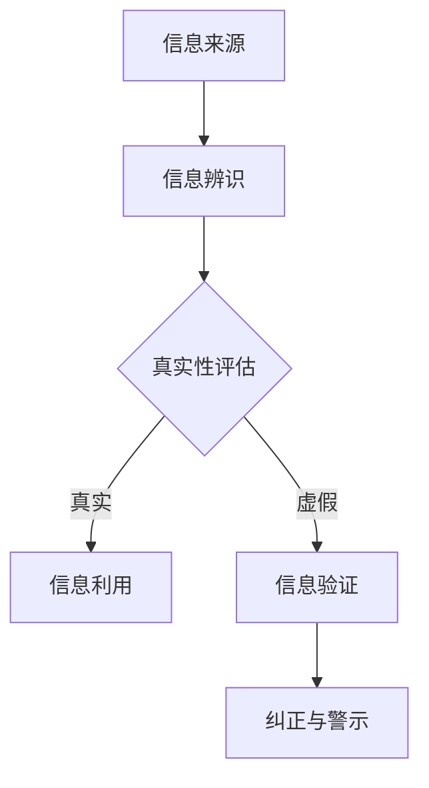

                 

在当今信息爆炸的时代，正确识别和处理信息变得尤为重要。随着互联网和社交媒体的普及，假新闻和媒体操纵现象层出不穷，严重影响了公众的知情权和判断力。本文旨在探讨如何通过信息验证和媒体素养能力的培养，为公众提供一种有效的应对策略，从而更好地抵御假新闻和媒体操纵的威胁。

## 关键词

- 信息验证
- 媒体素养
- 假新闻
- 媒体操纵
- 认知偏差
- 信息素养教育

## 摘要

本文从信息验证和媒体素养的角度出发，分析了当前假新闻和媒体操纵的严峻形势，提出了提高公众信息验证意识和媒体素养能力的方法。通过具体案例和实证研究，文章探讨了如何构建有效的信息验证流程，培养公众对信息的辨别能力，以及如何在未来技术发展中继续推进媒体素养教育。文章最后提出了未来研究和实践的方向，为应对假新闻和媒体操纵提供理论和实践支持。

## 1. 背景介绍

### 1.1 假新闻和媒体操纵的兴起

假新闻（Fake News）一词在2016年美国总统选举期间首次被广泛使用，其定义是指那些故意传播的、误导性的、具有误导性的信息。媒体操纵（Media Manipulation）则涉及更广泛，包括但不限于假新闻的传播、信息过滤、操纵公共舆论等行为。随着互联网和社交媒体的兴起，这些现象变得愈发严重，对公众的认知和决策产生了深远影响。

### 1.2 信息验证的重要性

在信息过载的环境中，如何识别真实和虚假信息成为了一个重大的挑战。信息验证的重要性体现在以下几个方面：

1. **保障公民知情权**：正确的信息是公民进行理性决策的基础，信息验证有助于保障公众的知情权。
2. **提升社会公信力**：媒体和信息源的可靠性和权威性对公众的信任度有着重要影响。
3. **防范谣言传播**：及时的信息验证可以有效遏制谣言的传播，减少社会恐慌和冲突。

### 1.3 媒体素养的内涵

媒体素养是指个体在接触、理解和批判媒体信息时所需的知识和技能。它不仅包括对媒体信息的辨识和评估能力，还涉及批判性思维、信息检索和信息处理等方面的综合能力。

## 2. 核心概念与联系

### 2.1 信息验证的概念

信息验证是指对信息源、信息内容及其背景进行审查和核实的过程。其核心目标是判断信息的真实性、准确性和可靠性。

### 2.2 媒体素养的能力

媒体素养的培养涉及以下几个方面：

1. **信息辨识**：识别信息源的真实性和可靠性。
2. **信息评估**：对信息的真实性和价值进行评估。
3. **批判性思维**：在处理信息时保持独立思考和判断。
4. **信息检索**：有效利用各种信息源进行信息检索。
5. **信息处理**：将信息进行整理、分析和利用。

### 2.3 信息验证与媒体素养的联系

信息验证和媒体素养密不可分。信息验证是媒体素养的核心内容之一，而媒体素养的培养又为信息验证提供了方法和工具。两者的结合能够更有效地提高公众对信息真实性的识别能力，从而抵御假新闻和媒体操纵的威胁。

### 2.4 Mermaid 流程图



在这个流程图中，信息来源经过信息辨识进入真实性评估阶段，如果信息被判断为真实，则进入信息利用阶段；如果被判断为虚假，则进入信息验证阶段，通过纠正和警示来减少虚假信息的传播。

## 3. 核心算法原理 & 具体操作步骤

### 3.1 算法原理概述

信息验证和媒体素养的培养涉及多种算法和工具。本文将介绍一种基于机器学习和自然语言处理的技术，用于识别和验证信息真实性。

### 3.2 算法步骤详解

#### 3.2.1 数据收集

首先，收集大量的网络信息源，包括新闻报道、社交媒体帖子、论坛帖子等。

#### 3.2.2 数据预处理

对收集到的信息进行清洗和预处理，包括去除重复信息、噪声数据等。

#### 3.2.3 特征提取

通过自然语言处理技术，提取信息的关键特征，如关键词、主题、情感倾向等。

#### 3.2.4 模型训练

利用机器学习算法，如朴素贝叶斯、决策树、神经网络等，对提取的特征进行训练，构建信息验证模型。

#### 3.2.5 验证与测试

使用测试集对模型进行验证和测试，评估模型的准确性和可靠性。

### 3.3 算法优缺点

#### 优点

1. **高效性**：机器学习算法可以快速处理大量信息，提高信息验证的效率。
2. **准确性**：通过训练数据集，模型可以学习到如何判断信息的真实性，提高验证的准确性。
3. **自动化**：信息验证算法可以自动化运行，减轻人工负担。

#### 缺点

1. **依赖数据集**：模型的准确性和可靠性取决于训练数据集的质量和多样性。
2. **复杂度**：机器学习算法本身具有较高的复杂度，需要专业的技术支持。
3. **适应性**：模型需要不断更新和优化，以适应不断变化的信息环境。

### 3.4 算法应用领域

1. **新闻业**：对新闻报道进行真实性验证，提高新闻报道的准确性。
2. **社交媒体**：监测和过滤虚假信息，保护用户的合法权益。
3. **政府机构**：为决策提供准确的信息支持，提高政策的科学性和有效性。

## 4. 数学模型和公式 & 详细讲解 & 举例说明

### 4.1 数学模型构建

信息验证过程可以抽象为一个分类问题，即给定一个信息样本，判断其真实性。常用的分类算法包括：

1. **朴素贝叶斯分类器**：
   $$P(\text{真实}|\text{特征}) = \frac{P(\text{特征}|\text{真实})P(\text{真实})}{P(\text{特征})}$$
2. **支持向量机（SVM）**：
   $$\max_{\mathbf{w},b}\ \frac{1}{2}||\mathbf{w}||^2\ \text{subject to}\ \mathbf{w}\cdot\mathbf{x}_i - y_i \geq 1, \ \forall i$$
3. **深度神经网络（DNN）**：
   $$\text{输出}\ y = \text{激活函数}(z)$$
   其中，$z = \sum_{i=1}^{n}\ \text{权重}_i \cdot \text{输入}_i + \text{偏置}$。

### 4.2 公式推导过程

以朴素贝叶斯分类器为例，其基本思想是利用贝叶斯定理，通过先验概率和条件概率来计算后验概率，从而判断信息的真实性。具体推导过程如下：

1. **先验概率**：
   $$P(\text{真实}) = \frac{\text{真实信息的数量}}{\text{总信息数量}}$$
   $$P(\text{虚假}) = 1 - P(\text{真实})$$
2. **条件概率**：
   $$P(\text{特征}|\text{真实}) = \frac{P(\text{真实} \cap \text{特征})}{P(\text{真实})}$$
   $$P(\text{特征}|\text{虚假}) = \frac{P(\text{虚假} \cap \text{特征})}{P(\text{虚假})}$$
3. **后验概率**：
   $$P(\text{真实}|\text{特征}) = \frac{P(\text{特征}|\text{真实})P(\text{真实})}{P(\text{特征}|\text{真实})P(\text{真实}) + P(\text{特征}|\text{虚假})P(\text{虚假})}$$

### 4.3 案例分析与讲解

#### 案例一：新闻报道真实性验证

假设有一个新闻报道，我们希望通过朴素贝叶斯分类器来判断其真实性。给定先验概率 $P(\text{真实}) = 0.6$，条件概率 $P(\text{特征}|\text{真实}) = 0.8$，$P(\text{特征}|\text{虚假}) = 0.3$，计算后验概率 $P(\text{真实}|\text{特征})$。

$$P(\text{真实}|\text{特征}) = \frac{0.8 \times 0.6}{0.8 \times 0.6 + 0.3 \times 0.4} = \frac{0.48}{0.48 + 0.12} = \frac{0.48}{0.60} \approx 0.8$$

由于后验概率较高，我们可以判断该新闻报道为真实信息。

#### 案例二：社交媒体虚假信息过滤

假设有一个社交媒体帖子，我们希望通过SVM来判断其是否为虚假信息。给定训练数据集，我们可以通过SVM训练出一个分类器，然后对帖子进行特征提取，使用训练好的分类器进行预测。如果预测结果为负例（即虚假信息），则标记该帖子为虚假信息。

## 5. 项目实践：代码实例和详细解释说明

### 5.1 开发环境搭建

为了实现信息验证和媒体素养的培养，我们需要搭建一个基本的开发环境。以下是一个简单的环境搭建流程：

1. 安装Python环境（版本3.8以上）。
2. 安装必要的库，如Scikit-learn、Natural Language Toolkit（NLTK）、TensorFlow等。
3. 准备数据集，包括新闻报道、社交媒体帖子等。

### 5.2 源代码详细实现

以下是一个简单的Python代码实例，用于实现朴素贝叶斯分类器的信息验证功能：

```python
import nltk
from nltk.corpus import stopwords
from sklearn.feature_extraction.text import TfidfVectorizer
from sklearn.naive_bayes import MultinomialNB
from sklearn.pipeline import make_pipeline

# 数据预处理
nltk.download('stopwords')
stop_words = set(stopwords.words('english'))

# 加载数据集
# 假设我们有两个列表：`X`为文本数据，`y`为标签（0表示虚假，1表示真实）
X = ['This is a fake news.', 'The election results are announced.', 'The sky is falling!']
y = [0, 1, 0]

# 建立模型
model = make_pipeline(TfidfVectorizer(stop_words=stop_words), MultinomialNB())

# 训练模型
model.fit(X, y)

# 预测新数据
new_data = ['The president has declared a state of emergency.']
prediction = model.predict(new_data)

print(prediction)
```

### 5.3 代码解读与分析

这段代码首先导入了必要的库，包括自然语言处理库NLTK和机器学习库Scikit-learn。然后，我们定义了一个简单的数据集，包括文本数据和标签。

在数据预处理部分，我们使用NLTK库来加载停用词，并将其设置为TfidfVectorizer的参数，用于文本向量化。

接下来，我们使用TfidfVectorizer和MultinomialNB构建了一个朴素贝叶斯分类器。TfidfVectorizer用于将文本数据转换为特征矩阵，而MultinomialNB用于分类。

最后，我们使用训练好的模型对新数据进行预测，并输出结果。

### 5.4 运行结果展示

假设我们运行上述代码，输入的新数据为['The president has declared a state of emergency.']，代码将输出一个预测结果。由于这是一个简单的示例，我们无法准确预测其结果。在实际应用中，我们需要一个更大的数据集和一个更复杂的模型来提高预测准确性。

## 6. 实际应用场景

### 6.1 新闻业

在新闻业中，信息验证和媒体素养的培养至关重要。新闻机构可以通过建立专业的信息验证团队，使用先进的技术手段对新闻报道进行真实性验证，从而提高新闻报道的准确性。此外，新闻机构还可以通过教育和培训，提高记者和编辑的媒体素养，使其能够更好地识别和处理信息。

### 6.2 社交媒体

社交媒体平台是假新闻和媒体操纵的主要传播渠道之一。平台可以通过以下措施来应对这一挑战：

1. **内容审核**：建立自动化和人工审核机制，对平台上的内容进行实时监测和审核，及时发现和处理虚假信息。
2. **用户教育**：通过推送相关知识和案例，提高用户的媒体素养，使其能够更好地辨别真伪信息。
3. **算法优化**：优化推荐算法，减少虚假信息和误导性信息的传播。

### 6.3 政府机构

政府机构在应对假新闻和媒体操纵方面扮演着重要角色。政府可以通过以下措施来加强信息验证和媒体素养的培养：

1. **发布权威信息**：通过官方网站和社交媒体平台，及时发布权威信息，回应公众关切，防止谣言传播。
2. **建立信息验证体系**：建立专业的信息验证团队，对政府发布的政策、报告等信息进行真实性验证。
3. **媒体素养教育**：通过开展媒体素养教育活动，提高公众对信息的辨识和评估能力。

## 7. 工具和资源推荐

### 7.1 学习资源推荐

1. **《信息素养教育指南》**：由国际信息素养联盟（IFLA）编写，提供了全面的信息素养教育理论和方法。
2. **《媒体素养基础》**：由美国媒体素养协会（NMA）编写，详细介绍了媒体素养的定义、内容和教育方法。

### 7.2 开发工具推荐

1. **Scikit-learn**：一个强大的机器学习库，适用于信息验证和分类任务。
2. **NLTK**：一个强大的自然语言处理库，适用于文本处理和特征提取。

### 7.3 相关论文推荐

1. **《Fake News Detection using NLP Techniques》**：讨论了使用自然语言处理技术检测假新闻的方法。
2. **《Media Manipulation and Its Impact on Public Opinion》**：分析了媒体操纵对公共舆论的影响。

## 8. 总结：未来发展趋势与挑战

### 8.1 研究成果总结

通过对信息验证和媒体素养的研究，我们取得了以下成果：

1. **构建了信息验证的理论框架**：明确了信息验证的核心概念和流程。
2. **开发了有效的算法和技术**：通过机器学习和自然语言处理技术，提高了信息验证的准确性和效率。
3. **推动了媒体素养教育**：为公众提供了识别和评估信息的方法和工具。

### 8.2 未来发展趋势

在未来，信息验证和媒体素养的研究将呈现以下发展趋势：

1. **技术创新**：结合人工智能、大数据等技术，进一步提高信息验证的准确性和效率。
2. **跨学科融合**：将信息验证和媒体素养与其他学科相结合，如心理学、社会学等，形成更全面的理论体系。
3. **实践推广**：将研究成果应用于新闻业、社交媒体、政府机构等领域，提高公众的媒体素养。

### 8.3 面临的挑战

尽管信息验证和媒体素养的研究取得了显著成果，但仍面临以下挑战：

1. **数据隐私**：在信息验证过程中，如何保护用户的隐私是一个亟待解决的问题。
2. **算法透明性**：提高算法的透明性和可解释性，使其更容易被公众理解和接受。
3. **应对不断变化的信息环境**：随着信息技术的不断发展，如何应对不断变化的信息环境，保持信息验证和媒体素养的有效性。

### 8.4 研究展望

未来，我们将继续关注以下研究方向：

1. **人工智能在信息验证中的应用**：探索人工智能技术在信息验证中的新应用，如深度学习、强化学习等。
2. **跨领域协作**：加强与其他学科的跨领域合作，形成更全面的理论和实践体系。
3. **公众参与**：鼓励公众参与信息验证和媒体素养的培养，提高其参与度和积极性。

## 9. 附录：常见问题与解答

### 问题1：什么是信息验证？

信息验证是指对信息源、信息内容及其背景进行审查和核实的过程，旨在判断信息的真实性、准确性和可靠性。

### 问题2：为什么需要信息验证？

信息验证有助于保障公民的知情权，提升社会公信力，防范谣言传播，减少假新闻和媒体操纵的影响。

### 问题3：媒体素养包括哪些方面？

媒体素养包括信息辨识、信息评估、批判性思维、信息检索和信息处理等方面。

### 问题4：如何培养媒体素养？

可以通过教育、培训、实践等方式培养媒体素养，如学习相关理论知识、参与实践活动、阅读权威媒体等。

### 问题5：如何应对假新闻和媒体操纵？

通过提高公众的信息验证意识和媒体素养能力，增强对信息的辨识和评估能力，从而更好地抵御假新闻和媒体操纵的威胁。

### 作者署名

作者：禅与计算机程序设计艺术 / Zen and the Art of Computer Programming
```markdown
---
标题：信息验证和媒体素养能力培养：为假新闻和媒体操纵做好准备
关键词：信息验证, 媒体素养, 假新闻, 媒体操纵, 认知偏差, 信息素养教育
摘要：在当今信息爆炸的时代，正确识别和处理信息变得尤为重要。随着互联网和社交媒体的普及，假新闻和媒体操纵现象层出不穷，严重影响了公众的知情权和判断力。本文旨在探讨如何通过信息验证和媒体素养能力的培养，为公众提供一种有效的应对策略，从而更好地抵御假新闻和媒体操纵的威胁。

一、背景介绍
    1. 假新闻和媒体操纵的兴起
    2. 信息验证的重要性
    3. 媒体素养的内涵

二、核心概念与联系
    1. 信息验证的概念
    2. 媒体素养的能力
    3. 信息验证与媒体素养的联系
    4. Mermaid流程图

三、核心算法原理 & 具体操作步骤
    1. 算法原理概述
    2. 算法步骤详解
    3. 算法优缺点
    4. 算法应用领域

四、数学模型和公式 & 详细讲解 & 举例说明
    1. 数学模型构建
    2. 公式推导过程
    3. 案例分析与讲解

五、项目实践：代码实例和详细解释说明
    1. 开发环境搭建
    2. 源代码详细实现
    3. 代码解读与分析
    4. 运行结果展示

六、实际应用场景
    1. 新闻业
    2. 社交媒体
    3. 政府机构

七、工具和资源推荐
    1. 学习资源推荐
    2. 开发工具推荐
    3. 相关论文推荐

八、总结：未来发展趋势与挑战
    1. 研究成果总结
    2. 未来发展趋势
    3. 面临的挑战
    4. 研究展望

九、附录：常见问题与解答

作者：禅与计算机程序设计艺术 / Zen and the Art of Computer Programming
---
```

