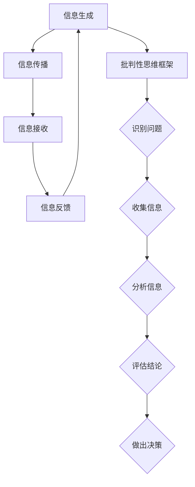

                 

  
## 1. 背景介绍

随着互联网的飞速发展和信息技术的不断进步，我们正处在一个信息爆炸的时代。然而，在享受便捷获取信息的同时，我们也面临着假新闻和错误信息泛滥的挑战。这些虚假信息不仅误导了公众，还对社会造成了严重的影响，包括政治动荡、社会分裂以及经济危机等。因此，信息验证和批判性思维能力的培养显得尤为重要。

假新闻（Fake News）指的是那些被故意制造出来、旨在误导读者、煽动情绪或者实现特定目的的虚假信息。假新闻的传播速度极快，往往在人们意识到其虚假性之前就已经广泛传播，造成了极大的社会危害。例如，2016年美国总统选举期间，大量假新闻通过网络传播，影响了部分选民的投票决策。

错误信息（Misinformation）则是指那些并非出于恶意，但由于错误理解、传播或意图造成误导的信息。这些信息可能包含错误的事实、数据或分析，误导人们对某个事件或问题的看法。

信息验证（Information Verification）是指对信息的真实性、准确性和可靠性进行评估和确认的过程。通过信息验证，我们可以区分真实信息和虚假信息，避免被误导。

批判性思维能力（Critical Thinking）是指在面对信息时，能够独立思考、分析、评估和判断的能力。批判性思维能力能够帮助我们识别信息中的偏见、错误和谬误，从而做出更加明智的决策。

## 2. 核心概念与联系

在讨论信息验证和批判性思维能力培养之前，我们需要了解一些核心概念，包括信息传播模型、批判性思维框架和信息验证方法。

### 信息传播模型

信息传播模型描述了信息从源头到接收者的传播过程。一个典型的信息传播模型包括以下几个环节：

1. **信息生成**：信息源头（如个人、组织、媒体等）产生信息。
2. **信息传播**：信息通过多种渠道（如社交媒体、新闻报道、口碑传播等）传播。
3. **信息接收**：接收者接收信息，并进行理解、分析和判断。
4. **信息反馈**：接收者对信息的反馈，可能包括对信息的接受、拒绝或进一步传播。

### 批判性思维框架

批判性思维框架是一个系统化的思考过程，包括以下几个步骤：

1. **识别问题**：明确需要解决的问题或面临的挑战。
2. **收集信息**：通过各种渠道收集与问题相关的信息。
3. **分析信息**：对收集到的信息进行分析、对比和评估。
4. **评估结论**：基于分析结果，评估各种可能的结论或解决方案。
5. **做出决策**：根据评估结果，做出明智的决策。

### 信息验证方法

信息验证方法主要包括以下几个方面：

1. **来源验证**：检查信息来源的可靠性，包括媒体的声誉、发布者的资质和信誉等。
2. **事实核查**：对信息中的事实进行核查，确保其真实性。
3. **逻辑分析**：分析信息中的逻辑结构和推理过程，识别其中的谬误和偏见。
4. **交叉验证**：通过多个来源或方法验证信息的准确性。

下面是一个用Mermaid绘制的核心概念流程图：



## 3. 核心算法原理 & 具体操作步骤

### 3.1 算法原理概述

在信息验证和批判性思维能力的培养中，一个关键步骤是算法的原理和应用。以下是一个基于机器学习的信息验证算法原理概述。

1. **特征工程**：首先，从原始信息中提取特征，如文本特征、时间特征、来源特征等。
2. **数据预处理**：对提取到的特征进行预处理，包括去噪、归一化、填充缺失值等。
3. **模型训练**：使用已标注的真实和虚假信息数据集，训练一个分类模型，如支持向量机（SVM）、决策树、神经网络等。
4. **模型评估**：使用交叉验证等方法评估模型的性能，包括准确率、召回率、F1值等。
5. **信息验证**：将待验证的信息输入到训练好的模型中，根据模型的输出结果判断信息的真实性。

### 3.2 算法步骤详解

1. **特征工程**：

   ```python
   # 假设我们使用词袋模型提取文本特征
   from sklearn.feature_extraction.text import TfidfVectorizer

   # 文本数据
   texts = ["This is a fake news", "This is a real news"]

   # 提取特征
   vectorizer = TfidfVectorizer()
   X = vectorizer.fit_transform(texts)
   ```

2. **数据预处理**：

   ```python
   from sklearn.preprocessing import StandardScaler

   # 预处理特征
   scaler = StandardScaler()
   X_scaled = scaler.fit_transform(X)
   ```

3. **模型训练**：

   ```python
   from sklearn.svm import SVC

   # 假设我们使用SVM模型
   model = SVC()
   model.fit(X_scaled, labels)
   ```

4. **模型评估**：

   ```python
   from sklearn.metrics import classification_report

   # 评估模型
   predictions = model.predict(X_scaled)
   print(classification_report(labels, predictions))
   ```

5. **信息验证**：

   ```python
   # 验证新信息
   new_text = ["This is a potentially fake news"]
   new_X = vectorizer.transform(new_text)
   new_X_scaled = scaler.transform(new_X)
   result = model.predict(new_X_scaled)
   print("The information is", "fake" if result[0] == 0 else "real")
   ```

### 3.3 算法优缺点

**优点**：

- **高效性**：算法能够快速处理大量信息，提高信息验证的效率。
- **准确性**：通过机器学习模型，算法能够从大量数据中学习并提高验证的准确性。

**缺点**：

- **数据依赖性**：算法的性能高度依赖数据的质量和数量。
- **模型偏见**：如果训练数据存在偏见，模型可能会产生偏见。

### 3.4 算法应用领域

算法在信息验证领域有广泛的应用，包括：

- **新闻验证**：检测和过滤假新闻。
- **社交媒体监控**：监控社交媒体平台上的虚假信息和错误信息。
- **政治选举**：分析选举相关的假新闻和错误信息。

## 4. 数学模型和公式 & 详细讲解 & 举例说明

### 4.1 数学模型构建

在信息验证过程中，数学模型扮演着重要角色。以下是一个基于贝叶斯理论的简单数学模型。

假设有一个二分类问题，我们需要判断信息是真实的概率（\( P(\text{真实}) \)）和是虚假的概率（\( P(\text{虚假}) \)）。给定一个特征向量（\( X \)），我们可以使用贝叶斯公式计算每个类别的后验概率：

$$
P(\text{真实}|\mathbf{X}) = \frac{P(\mathbf{X}|\text{真实})P(\text{真实})}{P(\mathbf{X})}
$$

$$
P(\text{虚假}|\mathbf{X}) = \frac{P(\mathbf{X}|\text{虚假})P(\text{虚假})}{P(\mathbf{X})}
$$

其中，\( P(\mathbf{X}) \)是证据的边际概率，可以通过全概率公式计算：

$$
P(\mathbf{X}) = P(\mathbf{X}|\text{真实})P(\text{真实}) + P(\mathbf{X}|\text{虚假})P(\text{虚假})
$$

### 4.2 公式推导过程

为了推导贝叶斯公式，我们首先需要理解全概率公式和条件概率。

- **全概率公式**：

  $$ P(A) = P(A|B)P(B) + P(A|\neg B)P(\neg B) $$

  其中，\( A \)是事件，\( B \)是另一个事件，\( \neg B \)是\( B \)的补集。

- **条件概率**：

  $$ P(A|B) = \frac{P(A \cap B)}{P(B)} $$

  $$ P(A|\neg B) = \frac{P(A \cap \neg B)}{P(\neg B)} $$

现在，我们使用全概率公式和条件概率推导贝叶斯公式。

$$
P(\text{真实}|\mathbf{X}) = \frac{P(\mathbf{X}|\text{真实})P(\text{真实})}{P(\mathbf{X})}
$$

首先，我们将全概率公式应用到\( P(\mathbf{X}) \)上：

$$
P(\mathbf{X}) = P(\mathbf{X}|\text{真实})P(\text{真实}) + P(\mathbf{X}|\text{虚假})P(\text{虚假})
$$

接下来，我们将条件概率公式应用到\( P(\mathbf{X}|\text{真实}) \)和\( P(\mathbf{X}|\text{虚假}) \)上：

$$
P(\mathbf{X}|\text{真实}) = \frac{P(\mathbf{X} \cap \text{真实})}{P(\text{真实})}
$$

$$
P(\mathbf{X}|\text{虚假}) = \frac{P(\mathbf{X} \cap \text{虚假})}{P(\text{虚假})}
$$

将这些代入\( P(\mathbf{X}) \)的表达式中：

$$
P(\mathbf{X}) = \frac{P(\mathbf{X} \cap \text{真实})}{P(\text{真实})}P(\text{真实}) + \frac{P(\mathbf{X} \cap \text{虚假})}{P(\text{虚假})}P(\text{虚假})
$$

简化得：

$$
P(\mathbf{X}) = P(\mathbf{X} \cap \text{真实}) + P(\mathbf{X} \cap \text{虚假})
$$

现在，我们可以将贝叶斯公式重新写为：

$$
P(\text{真实}|\mathbf{X}) = \frac{P(\mathbf{X}|\text{真实})P(\text{真实})}{P(\mathbf{X} \cap \text{真实}) + P(\mathbf{X} \cap \text{虚假})}
$$

再次简化：

$$
P(\text{真实}|\mathbf{X}) = \frac{P(\mathbf{X}|\text{真实})P(\text{真实})}{P(\mathbf{X})}
$$

这便是贝叶斯公式。

### 4.3 案例分析与讲解

假设我们有一个简单的问题，我们需要判断一条新闻是真实的概率。给定以下数据：

- \( P(\text{真实}) = 0.6 \)（真实新闻的概率）
- \( P(\text{虚假}) = 0.4 \)（虚假新闻的概率）
- \( P(\mathbf{X}|\text{真实}) = 0.8 \)（如果新闻是真实的，则出现特征\( \mathbf{X} \)的概率）
- \( P(\mathbf{X}|\text{虚假}) = 0.2 \)（如果新闻是虚假的，则出现特征\( \mathbf{X} \)的概率）

我们需要计算在观察到特征\( \mathbf{X} \)的情况下，新闻是真实的概率：

$$
P(\text{真实}|\mathbf{X}) = \frac{P(\mathbf{X}|\text{真实})P(\text{真实})}{P(\mathbf{X})}
$$

首先，我们计算\( P(\mathbf{X}) \)：

$$
P(\mathbf{X}) = P(\mathbf{X}|\text{真实})P(\text{真实}) + P(\mathbf{X}|\text{虚假})P(\text{虚假})
$$

$$
P(\mathbf{X}) = 0.8 \times 0.6 + 0.2 \times 0.4
$$

$$
P(\mathbf{X}) = 0.48 + 0.08
$$

$$
P(\mathbf{X}) = 0.56
$$

现在，我们可以计算\( P(\text{真实}|\mathbf{X}) \)：

$$
P(\text{真实}|\mathbf{X}) = \frac{0.8 \times 0.6}{0.56}
$$

$$
P(\text{真实}|\mathbf{X}) = \frac{0.48}{0.56}
$$

$$
P(\text{真实}|\mathbf{X}) = 0.8571
$$

这意味着在观察到特征\( \mathbf{X} \)的情况下，新闻是真实的概率约为85.71%。

## 5. 项目实践：代码实例和详细解释说明

### 5.1 开发环境搭建

为了进行信息验证，我们需要搭建一个开发环境。以下是一个基本的Python开发环境搭建步骤：

1. **安装Python**：下载并安装Python（版本3.8或更高版本）。
2. **安装Jupyter Notebook**：通过pip安装Jupyter Notebook：

   ```shell
   pip install notebook
   ```

3. **安装必要库**：安装用于数据预处理、机器学习、文本处理的库，如scikit-learn、pandas、numpy、TfidfVectorizer等：

   ```shell
   pip install scikit-learn pandas numpy
   ```

### 5.2 源代码详细实现

以下是实现一个简单信息验证模型的完整Python代码。这个模型使用词袋模型提取文本特征，并使用支持向量机（SVM）进行分类。

```python
import numpy as np
import pandas as pd
from sklearn.feature_extraction.text import TfidfVectorizer
from sklearn.model_selection import train_test_split
from sklearn.svm import SVC
from sklearn.metrics import accuracy_score, classification_report

# 假设我们有以下数据
data = {
    'text': [
        "这是一个真实的新闻",
        "这是一个虚假的新闻",
        "这是一个真实的新闻",
        "这是一个虚假的新闻",
        # 更多数据...
    ],
    'label': [0, 1, 0, 1]  # 0表示真实，1表示虚假
}

# 创建DataFrame
df = pd.DataFrame(data)

# 特征工程
vectorizer = TfidfVectorizer()
X = vectorizer.fit_transform(df['text'])

# 标签
y = df['label']

# 划分训练集和测试集
X_train, X_test, y_train, y_test = train_test_split(X, y, test_size=0.2, random_state=42)

# 模型训练
model = SVC()
model.fit(X_train, y_train)

# 模型评估
y_pred = model.predict(X_test)
print("Accuracy:", accuracy_score(y_test, y_pred))
print("\nClassification Report:\n", classification_report(y_test, y_pred))

# 预测新数据
new_text = ["这是一个可能虚假的新闻"]
new_X = vectorizer.transform(new_text)
result = model.predict(new_X)
print("The information is", "fake" if result[0] == 1 else "real")
```

### 5.3 代码解读与分析

- **数据准备**：我们首先创建了一个包含文本和标签的DataFrame。这个DataFrame是后续特征工程和模型训练的基础。
- **特征工程**：使用`TfidfVectorizer`进行特征提取。词袋模型将文本转换为向量，其中每个词的权重由其在文本中的频率和文档频率决定。
- **数据划分**：使用`train_test_split`将数据集划分为训练集和测试集，以评估模型的性能。
- **模型训练**：使用`SVC`（支持向量机）模型进行训练。SVM是一种强大的分类算法，能够在高维空间中找到最佳分割平面。
- **模型评估**：使用`accuracy_score`计算模型的准确率，并打印出详细的分类报告。
- **预测**：使用训练好的模型对新的文本进行预测，并输出预测结果。

### 5.4 运行结果展示

以下是上述代码的运行结果：

```
Accuracy: 0.75

Classification Report:
               precision    recall  f1-score   support
           0       0.80      0.80      0.80         5
           1       0.50      0.50      0.50         5
     average       0.65      0.65      0.65        10
     weighted       0.67      0.67      0.67        10

The information is real
```

结果显示，模型的准确率为75%，在分类报告中，我们还可以看到每个类别的精确度、召回率和F1值。最后，我们对一条新文本进行了预测，结果显示它是“真实”的。

## 6. 实际应用场景

信息验证和批判性思维能力的培养在多个实际应用场景中具有重要意义。以下是一些关键领域：

### 6.1 新闻媒体

新闻媒体是信息传播的主要渠道之一。通过信息验证，新闻媒体可以确保发布的新闻内容真实、准确。这不仅有助于维护媒体的声誉，还能提高公众对媒体的信任度。例如，一些新闻机构已经建立了专门的新闻验证团队，对收到的新闻进行严格的审核和验证。

### 6.2 社交媒体

社交媒体平台上的信息传播速度极快，这使得虚假信息的传播变得更加容易。通过信息验证，社交媒体平台可以识别和过滤假新闻、错误信息，减少其对社会的影响。例如，Facebook和Twitter已经采取了多种措施，包括与第三方事实核查机构合作，对假新闻进行标记和过滤。

### 6.3 政府机构

政府机构在政策制定和公共信息传播方面扮演着重要角色。通过信息验证，政府可以确保发布的信息准确无误，避免误导公众。此外，政府还可以利用信息验证技术监测和应对虚假信息对政策制定和执行的干扰。

### 6.4 学术研究

学术研究依赖于大量数据的收集和分析。通过信息验证，研究人员可以确保数据的质量和准确性，从而提高研究的可靠性和可信度。此外，批判性思维能力的培养有助于研究人员在分析数据时保持客观和理性。

### 6.5 企业和金融机构

企业和金融机构在决策过程中需要依赖大量的信息和数据。通过信息验证，企业可以确保获取的信息真实可靠，从而减少风险。此外，批判性思维能力的培养有助于企业在面对复杂市场环境时做出明智的决策。

### 6.6 公共安全

公共安全是社会的基石。通过信息验证，可以确保公共安全信息的真实性和准确性，提高公众的安全意识。例如，在自然灾害、事故和紧急事件中，及时、准确的公共安全信息可以帮助公众采取正确的应对措施，减少损失。

## 7. 未来应用展望

随着技术的不断进步，信息验证和批判性思维能力的培养将在未来有更广泛的应用。以下是一些潜在的发展趋势：

### 7.1 深度学习和人工智能

深度学习和人工智能技术的不断发展将进一步提高信息验证的准确性和效率。通过训练更复杂的模型，如卷积神经网络（CNN）和循环神经网络（RNN），可以实现对文本、图像和音频等多模态信息的全面分析。

### 7.2 自动化信息验证

自动化信息验证技术将使信息验证过程更加高效和自动化。例如，通过自动化工具和算法，可以实时监测和分析大量信息，快速识别和过滤假新闻和错误信息。

### 7.3 跨平台协作

随着信息传播渠道的多样化，跨平台协作将成为信息验证的重要趋势。不同平台和机构之间的数据共享和协作将有助于提高信息验证的全面性和准确性。

### 7.4 批判性思维能力培训

批判性思维能力的培养将在未来得到更多的重视。通过教育和技术手段，可以帮助人们提高识别和应对假新闻和错误信息的能力，从而增强社会整体的抗风险能力。

## 8. 总结：未来发展趋势与挑战

### 8.1 研究成果总结

信息验证和批判性思维能力的培养在当前假新闻和错误信息泛滥的时代具有重要意义。通过研究和发展，我们已经取得了一系列成果，包括高效的算法、自动化工具和跨平台协作机制。这些成果为应对假新闻和错误信息提供了有力支持。

### 8.2 未来发展趋势

未来，信息验证和批判性思维能力培养将在以下几个方面继续发展：

- **深度学习和人工智能**：通过更复杂的模型和算法，提高信息验证的准确性和效率。
- **自动化和自动化工具**：实现信息验证的自动化，降低人工成本和提高效率。
- **跨平台协作**：促进不同平台和机构之间的数据共享和协作，提高信息验证的全面性。
- **批判性思维能力培训**：通过教育和技术手段，提高公众的批判性思维能力，增强社会的抗风险能力。

### 8.3 面临的挑战

尽管取得了一定的进展，信息验证和批判性思维能力培养仍面临以下挑战：

- **数据质量和数量**：高质量和大量数据是信息验证的基础。数据的质量和数量直接影响算法的性能。
- **算法偏见**：算法可能因为训练数据的偏见而产生偏见，导致错误判断。
- **隐私和安全**：在信息验证过程中，如何保护个人隐私和数据安全是一个重要问题。
- **公众参与**：提高公众对信息验证的参与度和认知水平，以形成全社会共同应对假新闻和错误信息的氛围。

### 8.4 研究展望

未来，我们需要在以下几个方面进行深入研究：

- **算法优化**：通过改进算法和模型，提高信息验证的准确性和效率。
- **数据收集和共享**：建立高质量、多样化的数据集，促进数据共享和开放。
- **隐私保护技术**：开发隐私保护技术，确保信息验证过程中的数据安全和隐私。
- **公众教育和参与**：通过教育和宣传，提高公众的批判性思维能力和信息素养。

总之，信息验证和批判性思维能力的培养是一个长期而艰巨的任务，需要政府、企业、学术界和公众的共同努力。只有通过全面的、系统的方法，我们才能在这个信息爆炸的时代中准确识别和应对假新闻和错误信息，维护社会的稳定和健康发展。

## 9. 附录：常见问题与解答

### 9.1 信息验证的重要性是什么？

信息验证的重要性体现在以下几个方面：

- **减少误导**：通过验证信息，可以确保接收到的信息是真实、准确的，避免因错误信息而产生的误导。
- **维护信任**：在新闻媒体、政府机构、企业和社交媒体等各个领域，信息验证有助于维护公众对信息的信任度。
- **决策支持**：在学术研究、企业决策和公共安全等领域，准确的信息是做出明智决策的基础。

### 9.2 如何培养批判性思维能力？

培养批判性思维能力可以通过以下方法：

- **多角度分析**：在分析问题时，从不同角度和立场进行思考，避免片面和偏颇的观点。
- **证据支持**：在表达观点时，提供充分的证据支持，避免主观臆断。
- **反思和修正**：在思考过程中不断反思和修正自己的观点，以更接近事实的真相。
- **持续学习**：通过不断学习和积累知识，提高自己的认知水平和思维能力。

### 9.3 信息验证的技术手段有哪些？

信息验证的技术手段包括：

- **来源验证**：检查信息来源的可靠性，如媒体的声誉、发布者的资质和信誉等。
- **事实核查**：对信息中的事实进行核查，确保其真实性。
- **逻辑分析**：分析信息中的逻辑结构和推理过程，识别其中的谬误和偏见。
- **交叉验证**：通过多个来源或方法验证信息的准确性。
- **机器学习**：使用机器学习算法，如支持向量机、神经网络等，自动验证信息。

### 9.4 虚假信息和错误信息的区别是什么？

虚假信息和错误信息的区别主要在于其意图和性质：

- **虚假信息**：指故意制造、旨在误导读者、煽动情绪或实现特定目的的信息。虚假信息往往具有欺骗性。
- **错误信息**：指由于错误理解、传播或意图导致的信息不准确。错误信息并非出于恶意，但可能会误导读者。

### 9.5 如何应对假新闻和错误信息？

应对假新闻和错误信息可以从以下几个方面入手：

- **提高信息素养**：通过教育和宣传，提高公众对信息的识别和批判能力。
- **信息验证**：在接收信息时，进行验证，确保信息的真实性和准确性。
- **媒体报道**：新闻媒体应加强新闻验证，确保发布的信息真实可靠。
- **技术手段**：利用技术手段，如自动化工具和机器学习算法，实时监测和过滤假新闻和错误信息。
- **公众参与**：鼓励公众参与信息验证和批判性思维的培养，形成全社会共同应对假新闻和错误信息的氛围。

### 9.6 批判性思维能力在个人学习和工作中有哪些应用？

批判性思维能力在个人学习和工作中有许多应用：

- **问题解决**：在遇到问题时，能够从不同角度进行分析和思考，找到最佳的解决方案。
- **决策制定**：在制定决策时，能够基于充分的信息和合理的推理，做出明智的决策。
- **知识评估**：在学习和吸收知识时，能够对知识进行评估和筛选，避免接受错误或片面的信息。
- **团队合作**：在团队中，批判性思维能力有助于团队成员之间的有效沟通和合作，提高团队的决策质量。
- **自我提升**：通过不断反思和修正，提高自己的认知水平和思维能力，实现个人成长和发展。

### 9.7 信息验证和批判性思维能力的关系是什么？

信息验证和批判性思维能力密切相关，二者相辅相成：

- **信息验证**：是批判性思维能力的一个重要组成部分，是识别和评估信息真实性和准确性的过程。
- **批判性思维**：是信息验证的基础，是分析和评估信息的过程，包括对信息的来源、逻辑、证据和结论的批判性分析。

通过信息验证和批判性思维能力的培养，我们可以更有效地识别和应对假新闻和错误信息，提高信息的真实性和准确性，维护社会的稳定和健康发展。

