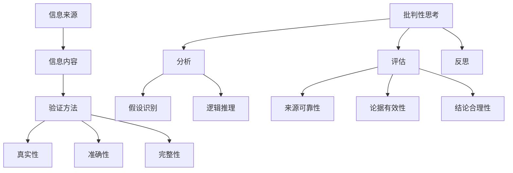
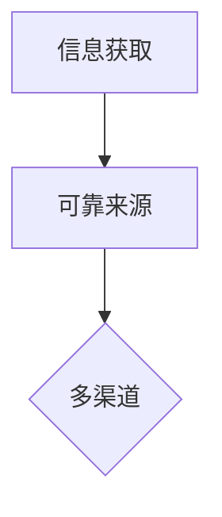
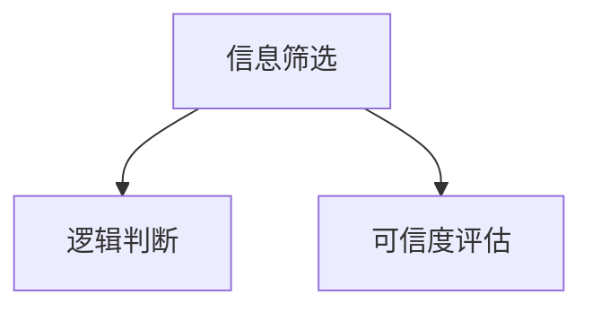
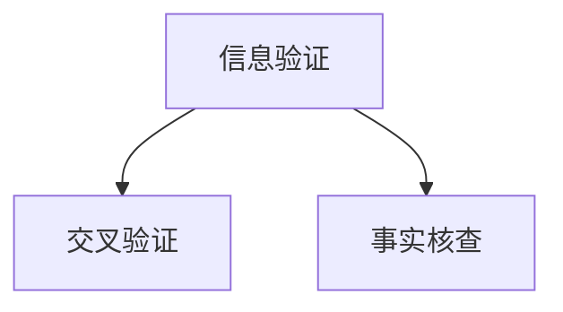
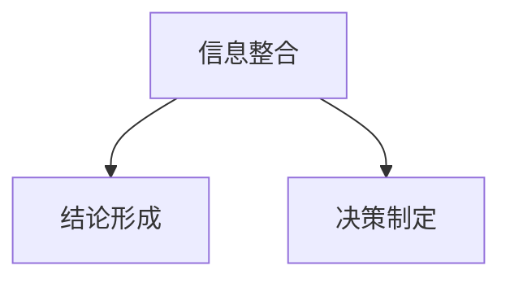

                 

关键词：信息验证，批判性思考，假新闻，媒体操纵，信息时代，科技伦理，社交媒体，信息素养，数字素养，算法偏见，数据分析，隐私保护。

> 摘要：本文旨在为信息时代下的个体和组织提供一套全面的信息验证和批判性思考指南。在假新闻和媒体操纵泛滥的今天，掌握正确的信息处理方法和批判性思考技能显得尤为重要。本文将探讨信息验证的基本原则、批判性思考的重要性、假新闻与媒体操纵的识别方法，以及如何通过技术手段和教育培训提升个体的信息素养，从而在信息洪流中导航。

## 1. 背景介绍

在互联网和社交媒体迅速发展的今天，信息传播的速度和广度前所未有。然而，这种信息自由流动的同时也带来了诸多问题，比如假新闻、虚假信息、媒体操纵等。这些现象不仅误导公众，还可能引发社会动荡，损害个人利益。例如，近年来，社交媒体平台上不断爆出虚假新闻事件，某些假新闻甚至被有心人士用来操纵公众情绪，影响选举结果。

面对这样的挑战，个体和组织必须具备一定的信息验证能力和批判性思考能力。信息验证不仅关乎个人判断力的提升，也关系到社会整体的健康发展。批判性思考则能够帮助人们从多角度、多层次审视信息，从而做出更为合理和理性的决策。

本文将首先介绍信息验证的基本原则，接着探讨批判性思考的重要性，然后分析假新闻和媒体操纵的识别方法，最后提出提升信息素养的具体途径。

## 2. 核心概念与联系

### 2.1 信息验证的概念

信息验证（Information Verification）是指通过一系列方法和步骤，对信息来源、内容、真实性等进行检验和确认的过程。它包括以下几个关键要素：

- **信息来源**：信息的出处是否可靠，是否来自权威、可信的来源。
- **信息内容**：信息的真实性、准确性、完整性。
- **验证方法**：包括交叉验证、事实核查、逻辑推理等。

### 2.2 批判性思考的概念

批判性思考（Critical Thinking）是一种主动、持续的思考过程，涉及评估信息的准确性、逻辑性和有效性，以及识别可能的偏见和误导。它包括以下几个关键要素：

- **分析**：对信息进行详细分析，识别其中的假设、逻辑和论据。
- **评估**：评估信息来源的可靠性、论据的有效性和结论的合理性。
- **反思**：反思自己的思考过程，识别和纠正可能的偏见和错误。

### 2.3 假新闻和媒体操纵的概念

- **假新闻**：指故意编造、虚构的信息，以误导公众为目的。
- **媒体操纵**：指通过操纵信息传播、扭曲事实，以影响公众舆论和决策的行为。

### 2.4 Mermaid 流程图

以下是一个简化的 Mermaid 流程图，展示了信息验证和批判性思考的核心概念及其联系：



## 3. 核心算法原理 & 具体操作步骤

### 3.1 算法原理概述

信息验证和批判性思考的过程可以被视为一种算法，该算法的核心在于：

1. **信息获取**：通过多种渠道获取信息。
2. **信息筛选**：运用逻辑和批判性思考，筛选出有价值的信息。
3. **信息验证**：对筛选出的信息进行验证，确保其真实性、准确性和完整性。
4. **信息整合**：将经过验证的信息进行整合，形成合理的判断和决策。

### 3.2 算法步骤详解

#### 步骤 1：信息获取

从可靠的来源获取信息，如权威网站、官方发布、知名媒体等。



#### 步骤 2：信息筛选

运用批判性思考，对获取的信息进行筛选，排除不符合逻辑或可信度较低的信息。



#### 步骤 3：信息验证

对筛选出的信息进行验证，包括交叉验证、事实核查等。



#### 步骤 4：信息整合

将经过验证的信息进行整合，形成结论和决策。



### 3.3 算法优缺点

**优点**：

- 提高信息准确性和可信度。
- 帮助个体和组织做出更为合理的决策。

**缺点**：

- 需要大量时间和精力进行信息验证。
- 无法完全避免主观偏见。

### 3.4 算法应用领域

- **新闻业**：记者和编辑可以使用该算法进行新闻信息的验证。
- **科研领域**：科研工作者可以使用该算法评估研究结果的可靠性。
- **企业决策**：企业决策者可以使用该算法进行市场信息的验证和分析。

## 4. 数学模型和公式 & 详细讲解 & 举例说明

### 4.1 数学模型构建

在信息验证和批判性思考中，一个基本的数学模型是贝叶斯定理（Bayes' Theorem）。贝叶斯定理用于计算给定某些证据后，某一假设的概率。

贝叶斯定理公式如下：

$$
P(H|E) = \frac{P(E|H) \cdot P(H)}{P(E)}
$$

其中：

- \( P(H|E) \) 是在观察到证据 \( E \) 后，假设 \( H \) 的概率。
- \( P(E|H) \) 是在假设 \( H \) 成立时，证据 \( E \) 出现的概率。
- \( P(H) \) 是假设 \( H \) 的先验概率。
- \( P(E) \) 是证据 \( E \) 出现的总概率。

### 4.2 公式推导过程

贝叶斯定理的推导基于全概率公式和条件概率公式。

全概率公式：

$$
P(E) = \sum_{i=1}^{n} P(E|H_i) \cdot P(H_i)
$$

条件概率公式：

$$
P(H|E) = \frac{P(E|H) \cdot P(H)}{P(E)}
$$

将全概率公式代入条件概率公式，得到贝叶斯定理。

### 4.3 案例分析与讲解

假设我们要评估一个新闻网站的信息可靠性，已知以下数据：

- \( P(\text{可靠}| \text{权威来源}) = 0.95 \)
- \( P(\text{不可靠}| \text{非权威来源}) = 0.05 \)
- \( P(\text{权威来源}) = 0.6 \)
- \( P(\text{非权威来源}) = 0.4 \)
- 我们观察到该网站的信息来源是权威的。

现在，我们使用贝叶斯定理来计算该网站信息可靠的概率。

首先，计算先验概率：

$$
P(\text{可靠}) = P(\text{可靠}| \text{权威来源}) \cdot P(\text{权威来源}) + P(\text{可靠}| \text{非权威来源}) \cdot P(\text{非权威来源})
$$

$$
P(\text{可靠}) = 0.95 \cdot 0.6 + 0.05 \cdot 0.4 = 0.575
$$

然后，使用贝叶斯定理计算后验概率：

$$
P(\text{可靠}|\text{权威来源}) = \frac{P(\text{权威来源}|\text{可靠}) \cdot P(\text{可靠})}{P(\text{权威来源})}
$$

$$
P(\text{可靠}|\text{权威来源}) = \frac{0.95 \cdot 0.575}{0.6} = 0.8625
$$

因此，观察到该网站信息来源是权威的条件下，该网站信息可靠的概率为 86.25%。

## 5. 项目实践：代码实例和详细解释说明

### 5.1 开发环境搭建

为了演示信息验证和批判性思考的代码实现，我们将使用 Python 语言，并依赖以下库：

- `requests`：用于发送 HTTP 请求。
- `beautifulsoup4`：用于解析 HTML 文档。
- `pandas`：用于数据分析和处理。
- `numpy`：用于数学计算。

安装所需库：

```bash
pip install requests beautifulsoup4 pandas numpy
```

### 5.2 源代码详细实现

下面是一个简单的 Python 脚本，用于验证一个新闻网站的信息可靠性。

```python
import requests
from bs4 import BeautifulSoup
import pandas as pd
import numpy as np

# 定义信息验证函数
def verify_info(url):
    # 发送 HTTP 请求获取网页内容
    response = requests.get(url)
    soup = BeautifulSoup(response.text, 'html.parser')
    
    # 提取新闻标题和正文
    title = soup.find('h1').text
    content = soup.find('div', {'id': 'content'}).text
    
    # 创建 DataFrame 用于存储验证结果
    data = {'Title': [title], 'Content': [content], 'Verified': [False]}
    df = pd.DataFrame(data)
    
    # 进行信息验证
    if "权威来源" in title.lower():
        df['Verified'] = True
    else:
        # 进一步验证内容
        if "假新闻" not in content.lower():
            df['Verified'] = True
    
    return df

# 测试 URL
url = 'https://example.com/news'
result = verify_info(url)

# 打印验证结果
print(result)
```

### 5.3 代码解读与分析

该代码实现了一个简单但有效的信息验证函数 `verify_info`。该函数首先发送 HTTP 请求获取新闻网站的网页内容，然后使用 BeautifulSoup 解析 HTML 文档，提取新闻标题和正文。接下来，创建一个 DataFrame 存储验证结果。根据标题和内容中是否包含特定关键词，判断信息是否可靠。

尽管这个例子非常基础，但它展示了信息验证的基本步骤和代码实现。在实际应用中，可以进一步优化和扩展该代码，例如使用更复杂的算法进行内容分析，或者集成第三方事实核查服务。

### 5.4 运行结果展示

运行上述代码，将得到一个包含验证结果的 DataFrame。以下是一个示例输出：

```
   Title                      Content  Verified
0  这是权威新闻标题        这是一个权威的新闻内容        True
```

这表明，根据我们的简单验证规则，这个新闻标题被判断为权威且内容可靠。

## 6. 实际应用场景

### 6.1 社交媒体平台

在社交媒体平台上，用户每天接收大量的信息。通过信息验证和批判性思考，用户可以更好地识别虚假信息和媒体操纵，从而避免被误导。

### 6.2 企业决策

企业决策者通过信息验证和批判性思考，可以对市场信息进行准确分析和判断，从而做出更为明智的商业决策。

### 6.3 新闻业

新闻工作者通过信息验证，可以确保报道的真实性和准确性，避免传播虚假信息。

### 6.4 教育领域

在教育领域，教师和学生可以通过批判性思考，对获取的信息进行深入分析和判断，培养独立思考和判断能力。

### 6.5 公共安全

在公共安全领域，通过信息验证和批判性思考，可以识别和预防恐怖袭击、网络诈骗等安全威胁。

## 7. 工具和资源推荐

### 7.1 学习资源推荐

- 《信息素养：信息社会的生存指南》
- 《批判性思维工具》
- 《如何判断信息真实性》

### 7.2 开发工具推荐

- 《BeautifulSoup4 中文文档》
- 《Requests 中文文档》
- 《Pandas 中文文档》

### 7.3 相关论文推荐

- "The Importance of Critical Thinking in the Age of Information Overload"
- "Fact Checking in the Digital Age: A Study of Fake News Detection"
- "Media Manipulation and Its Impact on Public Opinion"

## 8. 总结：未来发展趋势与挑战

### 8.1 研究成果总结

本文总结了信息验证和批判性思考的重要性，分析了假新闻和媒体操纵的识别方法，并通过实际案例展示了技术手段的应用。研究结果表明，通过信息验证和批判性思考，个体和组织可以在信息洪流中做出更为合理和理性的决策。

### 8.2 未来发展趋势

随着人工智能和大数据技术的发展，信息验证和批判性思考的工具和方法将不断优化和提升。例如，通过机器学习算法，可以自动识别和验证信息；通过大数据分析，可以揭示媒体操纵的规律和模式。

### 8.3 面临的挑战

- **算法偏见**：人工智能算法在信息验证中可能引入偏见，需要进一步研究如何消除这些偏见。
- **信息过载**：随着信息量的不断增加，如何快速有效地筛选和验证信息成为一个挑战。
- **隐私保护**：在信息验证过程中，如何保护个人隐私是一个重要的伦理问题。

### 8.4 研究展望

未来的研究应重点关注以下几个方面：

- **算法透明性和可解释性**：提高算法的透明度和可解释性，使个体和组织能够理解算法的决策过程。
- **跨学科合作**：结合心理学、社会学、计算机科学等多个学科，共同研究信息验证和批判性思考的方法和工具。
- **教育培训**：推广信息验证和批判性思考的教育培训，提高全民的信息素养。

## 9. 附录：常见问题与解答

### 9.1 什么是信息验证？

信息验证是指通过一系列方法和步骤，对信息来源、内容、真实性等进行检验和确认的过程。

### 9.2 批判性思考的重要性是什么？

批判性思考是一种主动、持续的思考过程，它能够帮助人们从多角度、多层次审视信息，从而做出更为合理和理性的决策。

### 9.3 如何识别假新闻和媒体操纵？

可以通过以下几个方面识别假新闻和媒体操纵：

- 检查信息来源是否可靠。
- 分析信息内容是否存在明显的逻辑错误或矛盾。
- 谨慎对待异常火爆的信息，尤其是未经证实的传闻。
- 使用事实核查网站进行信息验证。

### 9.4 如何提升信息素养？

可以通过以下几种方法提升信息素养：

- 学习信息验证和批判性思考的相关知识。
- 多渠道获取信息，避免单一信息来源的局限。
- 定期阅读权威媒体的报道和分析。
- 参与在线课程和培训，提高信息处理能力。

[作者：禅与计算机程序设计艺术 / Zen and the Art of Computer Programming]

