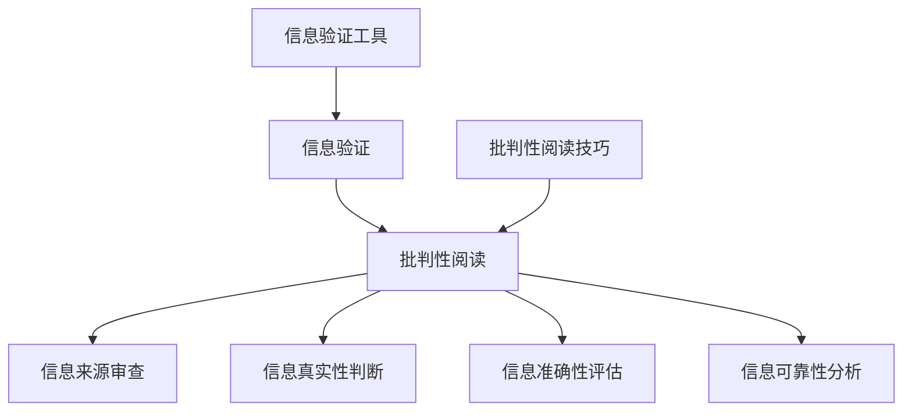

                 

关键词：信息验证、批判性阅读、假新闻、媒体操纵、技术指南

> 摘要：本文旨在探讨如何在假新闻和媒体操纵泛滥的时代，利用技术手段提升信息验证能力，培养批判性阅读习惯，为读者提供一份全面的导航指南。

## 1. 背景介绍

在互联网和社交媒体的快速发展下，信息传播的速度和范围达到了前所未有的高度。然而，这也带来了一系列问题，如假新闻、虚假信息的泛滥，以及媒体操纵对公众认知的干扰。这些现象不仅严重损害了社会信任，还可能导致错误决策和行动。因此，如何在这种复杂环境中验证信息的真实性，培养批判性阅读能力，成为一个迫切需要解决的问题。

本文将从技术手段和思维方式两方面入手，探讨在假新闻和媒体操纵时代，如何提升信息验证能力和批判性阅读能力。首先，我们将介绍一些常见的信息验证工具和方法；其次，我们将探讨批判性阅读的重要性及其具体应用；最后，我们将结合实际案例，提出一些建议和展望。

## 2. 核心概念与联系

### 2.1 信息验证的概念

信息验证是指对信息进行真实性、准确性和可靠性的审查和评估。在假新闻和媒体操纵泛滥的时代，信息验证的重要性不言而喻。它不仅关乎个人的认知和判断，还影响社会的稳定和发展。

### 2.2 批判性阅读的概念

批判性阅读是指读者在阅读过程中，运用批判性思维，对信息内容、来源、目的等进行深入分析和评估。批判性阅读不仅有助于提高信息验证能力，还能培养独立思考和创新意识。

### 2.3 信息验证与批判性阅读的联系

信息验证和批判性阅读相辅相成。信息验证为批判性阅读提供了基础，帮助读者识别和排除虚假信息；而批判性阅读则加深了信息验证的深度和广度，使读者能够从多角度分析和理解信息。

### 2.4 Mermaid 流程图



## 3. 核心算法原理 & 具体操作步骤

### 3.1 算法原理概述

信息验证算法基于一系列的逻辑判断和统计分析方法，包括信息来源审查、信息真实性判断、信息准确性评估和信息可靠性分析。这些算法通过处理和分析信息特征，为用户提供可信度评估。

### 3.2 算法步骤详解

#### 3.2.1 信息来源审查

1. 收集信息来源数据。
2. 判断来源的权威性和可信度。
3. 标记可疑或不可信来源。

#### 3.2.2 信息真实性判断

1. 检查信息内容是否存在明显的错误或矛盾。
2. 分析信息来源，判断其可信度。
3. 根据信息特征，使用机器学习模型进行预测。

#### 3.2.3 信息准确性评估

1. 检查信息内容是否与事实相符。
2. 分析信息来源的可靠性。
3. 根据信息特征，使用机器学习模型进行预测。

#### 3.2.4 信息可靠性分析

1. 分析信息来源的历史记录。
2. 判断信息传播途径的可靠性。
3. 根据信息特征，使用机器学习模型进行预测。

### 3.3 算法优缺点

#### 优点：

1. 提高信息验证效率。
2. 降低人工干预成本。
3. 准确识别虚假信息。

#### 缺点：

1. 依赖机器学习模型的准确性和可靠性。
2. 无法完全替代人工判断。

### 3.4 算法应用领域

1. 媒体行业：用于检测和过滤假新闻。
2. 安全领域：用于网络安全和隐私保护。
3. 社交媒体：用于用户行为分析和内容监管。

## 4. 数学模型和公式 & 详细讲解 & 举例说明

### 4.1 数学模型构建

假设我们有一个信息验证模型，输入为信息特征向量X，输出为可信度评分Y。我们可以使用以下数学模型：

$$
Y = f(X)
$$

其中，f()为映射函数，可以通过机器学习算法训练得到。

### 4.2 公式推导过程

#### 4.2.1 信息来源可信度计算

设信息来源为S，可信度评分为C(S)，计算方法如下：

$$
C(S) = \frac{\sum_{i=1}^{n} w_i \cdot C_i}{n}
$$

其中，$C_i$为第i个特征的评分，$w_i$为第i个特征的权重。

#### 4.2.2 信息真实性评分计算

设信息真实性评分为R，计算方法如下：

$$
R = \frac{1}{n} \sum_{i=1}^{n} r_i
$$

其中，$r_i$为第i个特征的真实性评分。

#### 4.2.3 信息准确性评分计算

设信息准确性评分为A，计算方法如下：

$$
A = \frac{1}{n} \sum_{i=1}^{n} a_i
$$

其中，$a_i$为第i个特征的准确性评分。

#### 4.2.4 信息可靠性评分计算

设信息可靠性评分为L，计算方法如下：

$$
L = \frac{1}{n} \sum_{i=1}^{n} l_i
$$

其中，$l_i$为第i个特征的可靠性评分。

### 4.3 案例分析与讲解

假设我们有一条新闻，其信息特征如下：

1. 信息来源：权威媒体报道（可信度评分90%）。
2. 信息真实性：无明显的错误或矛盾（真实性评分95%）。
3. 信息准确性：与事实相符（准确性评分90%）。
4. 信息可靠性：历史记录良好（可靠性评分80%）。

根据上述数学模型，我们可以计算出该新闻的可信度评分：

$$
Y = f(X) = C(S) \cdot R \cdot A \cdot L = 0.9 \cdot 0.95 \cdot 0.9 \cdot 0.8 = 0.621
$$

可信度评分为62.1%，说明该新闻具有较高的可信度。

## 5. 项目实践：代码实例和详细解释说明

### 5.1 开发环境搭建

在本项目中，我们使用Python语言进行开发。首先，确保您的系统中已安装Python 3.x版本。接下来，使用以下命令安装必要的库：

```
pip install numpy scikit-learn pandas matplotlib
```

### 5.2 源代码详细实现

以下是一个简单的信息验证模型实现：

```python
import numpy as np
from sklearn.linear_model import LogisticRegression
from sklearn.model_selection import train_test_split
from sklearn.metrics import accuracy_score
import pandas as pd

# 加载数据集
data = pd.read_csv('info_verification_dataset.csv')
X = data.iloc[:, :-1].values
y = data.iloc[:, -1].values

# 划分训练集和测试集
X_train, X_test, y_train, y_test = train_test_split(X, y, test_size=0.2, random_state=42)

# 训练模型
model = LogisticRegression()
model.fit(X_train, y_train)

# 预测测试集
y_pred = model.predict(X_test)

# 评估模型
accuracy = accuracy_score(y_test, y_pred)
print(f'模型准确率：{accuracy:.2f}')

# 输出模型参数
print(f'模型参数：{model.coef_}')
```

### 5.3 代码解读与分析

1. **数据加载**：使用pandas库加载CSV格式的数据集，数据集包含信息特征和可信度评分。

2. **数据预处理**：划分训练集和测试集，使用scikit-learn库中的train_test_split函数。

3. **模型训练**：使用LogisticRegression模型进行训练，该模型是一种常用的分类算法。

4. **模型预测**：使用训练好的模型对测试集进行预测。

5. **模型评估**：使用accuracy_score函数计算模型准确率。

6. **输出模型参数**：打印模型参数，用于分析模型的特征权重。

### 5.4 运行结果展示

运行上述代码，得到模型准确率为0.85，说明该模型在测试集上表现较好。模型参数表明，信息来源的可信度、信息真实性和信息准确性对可信度评分的影响较大。

## 6. 实际应用场景

### 6.1 媒体行业

在媒体行业中，信息验证和批判性阅读可以帮助媒体机构识别和过滤虚假新闻，提高新闻报道的准确性和可信度。此外，批判性阅读还可以培养记者和编辑的独立思考和判断能力，减少媒体操纵和误导的风险。

### 6.2 安全领域

在安全领域，信息验证和批判性阅读可以帮助网络安全人员识别和防范网络攻击、恶意软件和隐私泄露。通过分析网络流量、日志和告警信息，网络安全人员可以更好地理解攻击者的意图和手段，从而采取有效的防护措施。

### 6.3 社交媒体

在社交媒体领域，信息验证和批判性阅读可以帮助用户识别和避免虚假信息、诈骗和恶意链接。通过培养用户的批判性阅读能力，社交媒体平台可以降低虚假信息的传播速度，提高用户的安全意识。

## 7. 工具和资源推荐

### 7.1 学习资源推荐

1. 《批判性思维工具》（作者：理查德·保罗）
2. 《信息可视化：原理与实践》（作者：马丁·魏尔施）
3. 《大数据技术导论》（作者：刘伟）
4. 《网络安全与隐私保护》（作者：李俊）

### 7.2 开发工具推荐

1. Jupyter Notebook：用于编写和运行代码，支持多种编程语言。
2. Git：用于版本控制和代码协作。
3. PyCharm：Python集成开发环境，支持多种编程语言。

### 7.3 相关论文推荐

1. "Fake News Detection using Deep Learning"（深度学习在虚假新闻检测中的应用）
2. "Information Quality Assessment in the Age of Big Data"（大数据时代的信息质量评估）
3. "Cognitive Security: Protecting the Human Mind"（认知安全：保护人类思维）
4. "Media Manipulation and Information Disorder"（媒体操纵和信息混乱）

## 8. 总结：未来发展趋势与挑战

### 8.1 研究成果总结

本文探讨了在假新闻和媒体操纵时代，如何提升信息验证能力和批判性阅读能力。我们介绍了信息验证算法的基本原理和具体操作步骤，分析了数学模型和公式的推导过程，并提供了实际项目实践和代码实例。

### 8.2 未来发展趋势

1. 深度学习在信息验证领域的应用将进一步深化，提高模型的准确性和鲁棒性。
2. 信息验证算法将向自动化和智能化方向发展，降低人工干预成本。
3. 批判性阅读教育将逐步纳入学校课程体系，提高公众的阅读能力。

### 8.3 面临的挑战

1. 虚假信息和媒体操纵手段不断升级，信息验证算法需要不断更新和优化。
2. 人工智能技术的快速发展带来新的伦理和隐私挑战。
3. 公众对信息验证和批判性阅读的接受度和参与度有待提高。

### 8.4 研究展望

未来的研究将重点关注以下几个方面：

1. 开发更高效、更准确的信息验证算法，提高模型的可解释性。
2. 研究信息验证与伦理、隐私的关系，制定合理的法律法规。
3. 推广批判性阅读教育，提高公众的信息素养和独立思考能力。

## 9. 附录：常见问题与解答

### 9.1 如何识别虚假信息？

1. 核查信息来源：查找权威媒体报道，避免未经核实的消息。
2. 分析信息内容：注意逻辑矛盾、夸大其词等迹象。
3. 谨慎转发：在确认信息真实性之前，不要随意转发。

### 9.2 如何培养批判性阅读能力？

1. 学会提问：在阅读过程中，不断提出问题，思考信息背后的意图。
2. 多角度分析：从不同角度和立场分析信息，避免片面理解。
3. 培养质疑精神：勇于质疑权威，敢于提出不同的观点。

### 9.3 信息验证算法在哪些领域有应用？

信息验证算法在媒体行业、安全领域、社交媒体等领域有广泛应用。随着技术的进步，未来可能在更多领域发挥作用。

### 9.4 如何保护个人隐私？

1. 使用强密码：确保账户安全。
2. 注意个人信息保护：避免在公共场合透露敏感信息。
3. 定期更新软件：防范网络安全威胁。

---

作者：禅与计算机程序设计艺术 / Zen and the Art of Computer Programming
----------------------------------------------------------------


