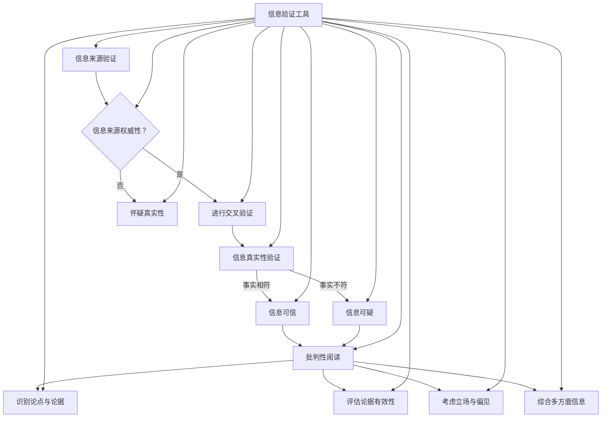

                 

## 引言 Introduction

在当今信息爆炸的时代，互联网的普及使得信息的传播变得前所未有的迅速和广泛。然而，这同时也带来了一个巨大的问题：信息的真实性和可信度。在假新闻和媒体操纵泛滥的今天，如何有效地验证信息的真实性、培养批判性阅读能力，成为了每一个互联网用户都需要面对的挑战。本文旨在探讨在假新闻和媒体操纵时代，如何运用信息技术和批判性阅读策略来导航，确保我们能够获取到真实可靠的信息。

本文将围绕以下几个核心问题展开讨论：

1. **假新闻和媒体操纵的定义及其危害**：我们将首先介绍假新闻和媒体操纵的概念，探讨它们对社会和个人带来的危害。
2. **信息验证的方法和技术**：我们将介绍一系列信息验证的方法和技术，帮助读者识别和验证信息的真实性。
3. **批判性阅读策略**：我们将讨论如何通过批判性阅读策略，提高我们对信息的理解和判断能力。
4. **案例分析**：我们将通过实际案例，展示如何运用这些方法和策略来处理复杂的信息环境。
5. **未来展望**：最后，我们将探讨未来在假新闻和媒体操纵问题上可能的发展趋势和解决方案。

通过对这些问题的深入探讨，本文希望能够为读者提供一套实用的信息导航工具，帮助我们在纷繁复杂的信息世界中找到真相，培养健康的阅读习惯。

## 1. 背景介绍

### 假新闻与媒体操纵的定义及历史背景

假新闻（Fake News）和媒体操纵（Media Manipulation）是两个密切相关的概念，但它们在具体含义和表现形式上有所不同。假新闻通常指的是那些故意制造、传播并旨在误导公众的虚假信息，这些信息可能涉及政治、社会、经济等多个领域。而媒体操纵则更加广泛，它包括了通过控制信息传播的渠道和内容，来影响公众的观点和态度，从而达到特定的政治或商业目的。

假新闻和媒体操纵并非现代现象，它们的历史可以追溯到古代。在古希腊和古罗马时期，政治家们就已经利用谣言和操纵媒体来影响公众意见。例如，古罗马的凯撒大帝就曾通过操纵媒体报道来塑造自己的形象，巩固政权。然而，随着技术的进步，尤其是在互联网和社交媒体的兴起，假新闻和媒体操纵变得前所未有的复杂和隐蔽。

20世纪末至21世纪初，互联网的普及和社交媒体的兴起，使得信息的传播速度和范围大大增加。这一时期，假新闻和媒体操纵开始呈现出新的特点。首先，信息的传播不再依赖于传统的媒体渠道，任何人都可以成为信息的传播者。其次，假新闻的制作者和传播者往往难以追踪，这使得监管和打击变得更加困难。此外，假新闻和媒体操纵的形式也更加多样，从简单的谣言和误导性图片，到复杂的虚假新闻网站和社交bots，都极大地增加了信息验证的难度。

### 当代假新闻与媒体操纵的现状

当代假新闻和媒体操纵的现象可谓无处不在。从政治选举、社会事件，到商业竞争、个人声誉，假新闻和媒体操纵的手段无所不在。以下是一些当前假新闻和媒体操纵的典型案例：

1. **政治选举中的假新闻**：在2016年的美国总统选举中，假新闻和社交媒体操纵被广泛使用。一些虚假新闻网站散布关于候选人及其政策的虚假信息，影响了部分选民的投票决策。同样，在2019年的欧洲议会选举中，也出现了大量的假新闻和社交媒体操纵行为。

2. **社会事件中的媒体操纵**：2019年香港抗议活动中，一些媒体机构通过断章取义、扭曲事实的方式来报道事件，影响了公众对事件真相的理解。此外，一些社交媒体平台上的假新闻和虚假视频也被用来煽动情绪、制造分裂。

3. **商业竞争中的假新闻**：在一些商业竞争中，企业可能会利用假新闻来抹黑竞争对手。例如，一些虚假的新闻网站会发布关于竞争对手负面信息的文章，从而损害其声誉。

4. **个人声誉中的恶意攻击**：在互联网时代，个人声誉也成为了攻击的目标。一些恶意攻击者会通过发布虚假信息、捏造事实来诋毁他人，造成严重的名誉损害。

假新闻和媒体操纵不仅对社会产生了深远的影响，也对个人生活造成了严重的困扰。例如，虚假信息可能会误导公众，影响他们的判断和决策；恶意攻击可能会导致受害者失去工作、婚姻破裂，甚至引发心理问题。因此，有效地识别和应对假新闻和媒体操纵，已经成为当代社会的一项重要任务。

### 假新闻和媒体操纵对社会及个人的危害

假新闻和媒体操纵对社会及个人的危害是多方面的，可以从以下几个方面进行深入探讨：

1. **公众信任的破坏**：假新闻和媒体操纵的广泛传播，导致公众对媒体和信息源失去信任。当人们无法判断哪些信息是真实的，哪些是虚假的，他们的信任感就会大大降低。这种不信任感不仅影响到个人，也影响到整个社会对媒体的依赖和信任，进而影响到社会稳定。

2. **社会分裂和矛盾加剧**：假新闻和媒体操纵常常被用于煽动社会矛盾和冲突。例如，通过发布虚假的种族歧视、宗教仇恨信息，可以引发社会分裂和冲突。这种分裂和冲突不仅破坏了社会的和谐，也可能导致暴力事件的发生。

3. **政治和政策制定的影响**：假新闻和媒体操纵对政治和政策制定产生了深远的影响。虚假信息可以误导公众，影响他们的投票决策，从而改变选举结果。此外，媒体操纵还可以影响政策制定过程，使得政策制定偏离公众利益，从而损害社会公平和正义。

4. **经济和市场的影响**：假新闻和媒体操纵也对经济和市场产生了负面影响。例如，虚假信息可能导致股市波动，影响企业声誉和投资者信心。在一些商业竞争中，通过发布虚假信息来抹黑竞争对手，也会导致市场混乱和资源浪费。

5. **个人生活和心理健康的影响**：个人生活方面，假新闻和媒体操纵的广泛传播，可能导致人们对个人声誉的担忧，甚至引发心理问题。例如，虚假信息被用来诋毁他人，可能导致受害者失去工作、婚姻破裂，甚至产生抑郁、焦虑等心理问题。

总之，假新闻和媒体操纵对社会及个人产生了深远的负面影响。为了应对这些挑战，我们需要采取有效的措施，提高公众的信息素养，培养批判性阅读能力，以确保我们能够获取到真实可靠的信息。

### 假新闻和媒体操纵的典型案例

为了更好地理解假新闻和媒体操纵的危害，下面我们将介绍几个具有代表性的案例，并分析这些案例对公众信任、社会稳定和政治选举等方面产生的影响。

#### 案例1：2016年美国总统选举中的假新闻

在2016年的美国总统选举中，假新闻和社交媒体操纵成为了一个重要的现象。一些虚假新闻网站，如"Rally Round the Flag"和"United States Intel News"，发布了一系列关于候选人唐纳德·特朗普和希拉里·克林顿的虚假信息。这些虚假信息包括特朗普与俄罗斯勾结、希拉里使用私人邮箱处理国家安全事务等，严重误导了部分选民。

这些假新闻的传播，不仅影响了选民的投票决策，也对整个选举过程产生了深远的影响。一些选民在未核实信息真实性的情况下，受到了虚假信息的误导，从而改变了他们的投票意向。此外，这些虚假信息还引发了公众对候选人的质疑和不满，进一步加剧了社会分裂。

#### 案例2：2019年香港抗议活动中的媒体操纵

2019年，香港爆发了一系列抗议活动。一些媒体机构，如香港无线电视（TVB）和香港电台（RTHK），通过断章取义、扭曲事实的方式来报道事件。这些报道往往只关注抗议者暴力行为，而忽略警方使用武力的情节，从而引导公众对事件的误解。

这种媒体操纵行为，不仅影响了公众对事件真相的理解，也加剧了社会分裂和矛盾。一些香港居民在未核实信息真实性的情况下，受到了误导，对抗议活动的性质和原因产生了误解，从而引发了对立和冲突。

#### 案例3：商业竞争中的假新闻

在一些商业竞争中，假新闻也常常被用来抹黑竞争对手。例如，某知名电商平台曾发布虚假的负面评论，声称其竞争对手存在质量问题。这些评论迅速在社交媒体上传播，引发了公众对竞争对手的质疑和不满。

这种假新闻不仅损害了竞争对手的声誉，也影响了消费者的购买决策。一些消费者在未核实信息真实性的情况下，受到了虚假信息的误导，从而选择了其他平台，导致竞争对手的销售额下降。

#### 案例4：个人声誉中的恶意攻击

在互联网时代，个人声誉也成为了攻击的目标。一些恶意攻击者会通过发布虚假信息、捏造事实来诋毁他人。例如，某知名企业家在社交媒体上收到了大量虚假的投诉信息，这些投诉声称他涉及欺诈和贪污行为。

这些恶意攻击不仅对受害者的个人声誉造成了严重损害，也影响了他们的工作和生活。一些受害者因无法证实虚假信息的真实性，不得不花费大量时间和精力来澄清事实，从而影响了他们的工作进展和生活质量。

通过以上案例，我们可以看到假新闻和媒体操纵对社会、个人和政治选举等方面产生的深远影响。为了应对这些挑战，我们需要提高公众的信息素养，培养批判性阅读能力，以确保我们能够获取到真实可靠的信息。

#### 1.1. 信息验证的重要性

在假新闻和媒体操纵泛滥的今天，信息验证的重要性愈发凸显。准确的信息是决策和行动的基础，而错误或虚假的信息则可能导致严重的后果。例如，在政治选举中，虚假信息可能导致选民做出错误的投票决策，从而影响选举结果；在社会事件中，不实的信息可能引发公众恐慌，加剧社会矛盾；在商业领域，虚假信息可能损害企业声誉，误导消费者。

首先，信息验证是确保公众获取真实信息的关键。通过验证信息的来源、内容和背景，我们可以辨别哪些是真实可靠的，哪些是虚假或误导性的。这对于个人、企业和整个社会都具有重要意义。例如，在商业决策中，企业需要依赖准确的市场数据来制定战略；在学术研究中，研究人员需要引用真实可靠的数据和文献来支持自己的观点。

其次，信息验证有助于提高公众的信息素养。在信息泛滥的时代，培养批判性思维和信息验证能力，是每个公民应具备的基本素养。通过了解如何识别和验证信息，公众可以更好地抵御虚假信息和媒体操纵的影响，避免受到误导。例如，在社交媒体上，用户可以通过验证信息的来源和内容，来判断信息是否真实可靠，从而避免传播虚假信息。

此外，信息验证还可以促进社会的信任和稳定。在假新闻和媒体操纵泛滥的环境下，公众对信息源的信任度降低，社会分裂和矛盾加剧。通过信息验证，我们可以提高信息的透明度和可信度，从而增强公众对媒体和政府的信任，促进社会的和谐与稳定。

总之，信息验证在假新闻和媒体操纵时代具有至关重要的意义。它不仅有助于我们获取真实可靠的信息，提高公众的信息素养，还能促进社会的信任和稳定。因此，每个人都应积极参与信息验证，共同维护健康的信息环境。

#### 1.2. 培养批判性阅读能力的重要性

在假新闻和媒体操纵泛滥的时代，培养批判性阅读能力显得尤为重要。批判性阅读不仅是一种获取和理解信息的方法，更是一种思考和判断的技能。通过批判性阅读，我们可以对信息进行深入分析和评估，从而辨别其真实性和可靠性。

首先，批判性阅读有助于我们识别信息的真实性和可靠性。在阅读过程中，我们需要问自己一系列问题，如：这个信息来源是否可信？信息中的论据是否合理？数据是否可靠？通过这些问题的思考，我们可以更加客观地评估信息，避免被虚假信息误导。

其次，批判性阅读可以帮助我们理解信息的深层含义。媒体操纵和假新闻往往具有隐藏的目的和动机。通过批判性阅读，我们可以挖掘信息的深层意义，理解其背后的意图。例如，在阅读一篇新闻报道时，我们不仅要关注其表面的内容，还要思考其背后的政治、经济和社会背景。

此外，批判性阅读还可以提高我们的逻辑思维能力。在分析信息时，我们需要运用逻辑推理，将不同信息片段联系起来，形成一个完整的理解。这种能力不仅有助于我们识别虚假信息，还能提高我们在学术、工作和生活中的决策能力。

最后，批判性阅读有助于培养我们的信息素养。在信息爆炸的时代，如何有效地获取、理解和利用信息，已经成为每个公民都需要面对的挑战。通过批判性阅读，我们可以提高对信息的敏感度和理解能力，从而更好地适应信息社会的发展。

总之，培养批判性阅读能力是应对假新闻和媒体操纵的重要手段。通过批判性阅读，我们可以更好地识别虚假信息，理解信息的深层含义，提高逻辑思维能力，从而在信息泛滥的时代中保持清醒和独立。

#### 1.3. 核心概念与联系

在讨论信息验证和批判性阅读策略时，以下几个核心概念和技术是不可或缺的。这些概念不仅帮助我们理解信息验证的原理，还为我们提供了一系列实用的工具和方法，以提高我们对信息的判断力和分析能力。

**1. 信息来源验证**

信息来源的验证是信息验证的第一步，也是至关重要的一步。一个可靠的信息来源能够大大提高信息的可信度。以下是几个关键步骤：

- **检查来源的权威性**：验证信息来源的权威性是判断信息真实性的关键。例如，政府官方网站、学术期刊、知名新闻机构等通常具有较高的可信度。而对于一些未知的网站或个人发布的信息，我们需要保持警惕。
- **交叉验证**：在验证信息来源时，可以通过多个独立来源进行交叉验证。如果一个信息在多个权威来源中都有报道，那么其可信度通常会更高。
- **了解背景信息**：了解信息来源的背景信息，如其历史、宗旨和立场，也有助于判断其可靠性。例如，一些具有明显政治或商业利益的信息源，其报道可能存在偏见。

**2. 信息真实性验证**

信息真实性验证是指通过多种方法，确认信息是否与事实相符。以下是一些常用的方法：

- **事实核查**：通过查阅权威资料，如政府文件、学术研究、新闻报道等，来核实信息的真实性。事实核查网站（如FactCheck.org、PolitiFact等）是进行事实核查的重要工具。
- **图片和视频验证**：对于图片和视频信息，可以通过搜索引擎或专门的照片和视频验证工具（如Google Reverse Image Search、Snopes等）来查找其原始出处，确认其真实性。
- **专家意见**：在某些领域，专家的意见和看法可以作为信息真实性的参考。例如，在医学领域，我们可以参考专业医生或研究机构的意见来判断某个健康信息的真实性。

**3. 批判性阅读**

批判性阅读是一种积极的阅读方式，它要求读者对信息进行深入分析和评估。以下是一些关键步骤：

- **识别论点与论据**：在阅读过程中，我们需要识别出文章或信息中的论点和论据。论点是指作者想要表达的观点，而论据是支持论点的证据。
- **评估论据的有效性**：我们需要对论据进行评估，判断其是否具有充分性和可靠性。例如，一个有效的论据应该基于可靠的数据和权威的研究。
- **考虑立场与偏见**：我们需要注意到信息源可能存在的立场和偏见。例如，一些政治性或商业性较强的信息源可能存在明显的倾向性，我们需要保持客观，避免被其误导。
- **综合多方面信息**：通过阅读多个来源的信息，我们可以获得更全面的视角，从而更准确地判断信息的真实性。

**4. 信息验证工具**

除了上述方法，还有一些工具和技术可以帮助我们进行信息验证：

- **事实核查网站**：如前所述，事实核查网站是验证信息真实性的重要资源。例如，FactCheck.org、PolitiFact、Snopes等网站提供了大量的事实核查服务。
- **社交媒体验证工具**：如Twitter和Facebook等社交媒体平台，提供了一些验证工具，可以帮助用户识别和举报虚假信息。
- **数据可视化工具**：数据可视化工具（如Tableau、Power BI等）可以帮助我们更直观地理解和分析数据，从而识别信息中的潜在问题。
- **信息源查询工具**：如Google Scholar、PubMed等学术搜索引擎，可以帮助我们查找和验证学术信息和研究成果。

**5. Mermaid 流程图**

为了更好地理解信息验证和批判性阅读的流程，我们可以使用Mermaid流程图来展示其关键步骤。以下是一个简化的Mermaid流程图示例：



通过上述流程图，我们可以清晰地看到信息验证和批判性阅读的核心步骤及其相互关系。这个流程图不仅帮助我们理解了信息验证的整体过程，还为我们提供了一个实用的框架，用于在实际操作中应用这些方法和策略。

### 2. 核心算法原理 & 具体操作步骤

#### 2.1 算法原理概述

在信息验证和批判性阅读中，算法发挥着至关重要的作用。本文将介绍一种基于机器学习和自然语言处理的信息验证算法，该算法通过分析文本内容、结构、上下文等多种特征，来判断信息的真实性和可靠性。以下是该算法的基本原理和核心步骤。

##### 2.1.1 基本原理

该算法基于以下核心原理：

1. **文本特征提取**：通过自然语言处理技术，提取文本中的关键特征，如关键词、词频、词向量等。
2. **上下文分析**：结合文本的上下文信息，分析其逻辑关系和语义关联，从而判断信息的一致性和合理性。
3. **异常检测**：利用机器学习算法，检测文本中的异常特征和逻辑错误，识别潜在的虚假信息。
4. **综合评估**：通过多种特征和算法的综合评估，给出信息的真实性和可靠性评分。

##### 2.1.2 核心步骤

该算法主要包括以下四个核心步骤：

1. **数据预处理**：对原始文本进行清洗和预处理，包括去除停用词、标点符号、转换为小写等。
2. **特征提取**：提取文本的关键特征，如词频、词向量、句法结构等。
3. **模型训练**：使用已标记的真实和虚假信息数据集，训练机器学习模型，使其能够识别和分类信息。
4. **信息验证**：使用训练好的模型，对新的文本进行验证，评估其真实性和可靠性。

#### 2.2 算法步骤详解

##### 2.2.1 数据预处理

数据预处理是算法的第一步，其主要目的是将原始文本转换为适合模型训练的形式。以下是数据预处理的详细步骤：

1. **文本清洗**：去除文本中的HTML标签、特殊字符和空白符。
2. **分词**：将文本分解为单词或词组，可以使用分词工具（如NLTK、jieba等）。
3. **去除停用词**：去除常见的无意义词汇，如“的”、“了”、“是”等。
4. **词形还原**：将不同形式的词转换为统一形式，如“跑”、“跑了”、“跑步”都转换为“跑”。
5. **转换为小写**：将所有文本转换为小写，以简化处理过程。

##### 2.2.2 特征提取

特征提取是算法的核心部分，其目的是从文本中提取出有助于判断信息真实性的特征。以下是常见的特征提取方法：

1. **词频（TF）**：计算每个单词在文本中出现的频率。
2. **词向量（Word Embedding）**：将每个单词转换为向量表示，如使用Word2Vec、GloVe等方法。
3. **句法结构**：分析文本的句法结构，提取句子中的主语、谓语、宾语等成分。
4. **关键词提取**：使用TF-IDF等方法，提取文本中的高频关键词。
5. **文本摘要**：提取文本的核心内容，生成摘要。

##### 2.2.3 模型训练

模型训练是算法的第三步，其目的是使机器学习模型能够识别和分类信息。以下是模型训练的详细步骤：

1. **数据集准备**：准备已标记的真实和虚假信息数据集，其中每个样本都附有真实/虚假标签。
2. **特征选择**：从提取的特征中选择对分类任务最有帮助的特征，如词频、词向量等。
3. **模型选择**：选择适合文本分类任务的机器学习模型，如支持向量机（SVM）、随机森林（RF）、神经网络（NN）等。
4. **模型训练**：使用训练数据集，训练所选模型，调整模型参数，使其达到最佳性能。
5. **模型评估**：使用验证数据集评估模型性能，包括准确率、召回率、F1值等指标。

##### 2.2.4 信息验证

模型训练完成后，可以使用训练好的模型对新的文本进行验证，评估其真实性和可靠性。以下是信息验证的详细步骤：

1. **文本预处理**：对新的文本进行与训练数据相同的预处理操作，包括分词、去除停用词、词形还原等。
2. **特征提取**：提取预处理后的文本的特征，如词频、词向量等。
3. **模型预测**：将提取的特征输入训练好的模型，得到每个样本的真实性和可靠性评分。
4. **结果解释**：根据评分和阈值，判断文本的真实性和可靠性。例如，评分高于阈值的文本被认为是真实的，低于阈值的文本被认为是虚假的。

通过上述步骤，我们可以使用机器学习和自然语言处理技术，对信息进行有效验证，从而在假新闻和媒体操纵泛滥的时代，获取到真实可靠的信息。

#### 2.3 算法优缺点

##### 2.3.1 优点

该算法在信息验证和批判性阅读中具有以下优点：

1. **高效率**：通过机器学习和自然语言处理技术，算法能够快速处理大量文本数据，提高信息验证的效率。
2. **高准确性**：通过训练大量数据集，算法能够准确地识别和分类信息，提高验证结果的准确性。
3. **自动化**：算法可以自动化地进行信息验证，减轻人工负担，提高工作效率。
4. **多功能性**：算法不仅可以用于检测假新闻和虚假信息，还可以应用于其他领域的文本分析，如情感分析、关键词提取等。

##### 2.3.2 缺点

尽管算法具有许多优点，但也存在一些缺点：

1. **数据依赖性**：算法的性能高度依赖于训练数据的质量和数量。如果训练数据存在偏差或不足，算法的准确性会受到影响。
2. **解释性差**：机器学习模型通常具有较高的预测能力，但它们的内部工作机制较为复杂，难以解释。这可能导致用户对算法结果的信任度降低。
3. **对抗性攻击**：通过对抗性攻击，即对算法进行微小修改，可以使其产生错误的分类结果。这使得算法在面对恶意攻击时较为脆弱。
4. **新问题适应性差**：算法的训练和优化过程通常针对特定类型的信息进行。当出现新的信息类型或变化时，算法可能难以适应，导致验证效果下降。

#### 2.4 算法应用领域

该算法在多个应用领域中具有广泛的应用前景：

1. **媒体内容审核**：算法可以用于自动检测和过滤假新闻、虚假信息等不良媒体内容，提高媒体的公信力和质量。
2. **信息安全**：算法可以用于检测和预防网络钓鱼、恶意软件等网络安全威胁，保护用户的数据安全和隐私。
3. **学术研究**：算法可以用于检测和预防学术不端行为，如抄袭、剽窃等，维护学术诚信。
4. **公共安全**：算法可以用于监控和分析社会事件，及时发现和应对虚假信息、谣言等，维护社会稳定。
5. **商业应用**：算法可以用于市场调研、消费者行为分析等，帮助企业获取真实的市场信息和消费者反馈，制定更科学的商业策略。

### 3. 数学模型和公式 & 详细讲解 & 举例说明

在信息验证和批判性阅读策略中，数学模型和公式起到了至关重要的作用。通过数学模型，我们可以量化信息验证过程中的各种指标，从而更加准确地评估信息的真实性和可靠性。以下是几个关键的数学模型和公式，以及它们的详细讲解和举例说明。

#### 3.1 数学模型构建

##### 3.1.1 贝叶斯公式

贝叶斯公式是概率论中的一个重要工具，用于计算条件概率。在信息验证中，贝叶斯公式可以帮助我们根据已有信息更新对某事件的信任度。

贝叶斯公式如下：

$$
P(A|B) = \frac{P(B|A) \cdot P(A)}{P(B)}
$$

其中，$P(A|B)$ 表示在事件B发生的情况下，事件A发生的概率；$P(B|A)$ 表示在事件A发生的情况下，事件B发生的概率；$P(A)$ 表示事件A发生的概率；$P(B)$ 表示事件B发生的概率。

##### 3.1.2 决策理论

决策理论中的期望值和效用函数，可以帮助我们在信息验证中做出最优决策。

期望值（Expected Value，EV）公式如下：

$$
EV = \sum_{i} x_i \cdot P(x_i)
$$

其中，$x_i$ 表示每种可能的决策结果；$P(x_i)$ 表示每种结果发生的概率。

效用函数（Utility Function）则用于衡量决策结果的满意度或价值。例如，一个简单的效用函数可以表示为：

$$
U(x_i) = x_i - c
$$

其中，$x_i$ 表示结果的价值；$c$ 表示成本或代价。

##### 3.1.3 集合理论

集合理论在信息验证中的应用主要体现在对信息源的归类和筛选。以下是一个简单的集合运算示例：

- 并集（Union）：$A \cup B$ 表示集合A和集合B的所有元素组成的集合。
- 交集（Intersection）：$A \cap B$ 表示集合A和集合B共有的元素组成的集合。
- 补集（Complement）：$A^c$ 表示不属于集合A的所有元素组成的集合。

#### 3.2 公式推导过程

##### 3.2.1 贝叶斯公式的推导

贝叶斯公式可以通过全概率公式和条件概率公式推导得出。以下是一个简化的推导过程：

全概率公式：

$$
P(A) = P(A|B_1) \cdot P(B_1) + P(A|B_2) \cdot P(B_2) + \ldots + P(A|B_n) \cdot P(B_n)
$$

条件概率公式：

$$
P(B|A) = \frac{P(A|B) \cdot P(B)}{P(A)}
$$

将条件概率公式代入全概率公式，得到：

$$
P(A) = \sum_{i=1}^{n} P(A|B_i) \cdot P(B_i)
$$

将贝叶斯公式代入上式，得到：

$$
P(A) = P(B|A) \cdot P(A) + \sum_{i=1}^{n} P(B_i|A) \cdot P(A)
$$

化简后得到：

$$
P(A) = P(B|A) \cdot P(A) + \sum_{i=1}^{n} P(B_i|A) \cdot P(A)
$$

$$
P(A) \cdot (1 - P(B|A)) = \sum_{i=1}^{n} P(B_i|A) \cdot P(A)
$$

$$
P(A) = \frac{\sum_{i=1}^{n} P(B_i|A) \cdot P(A)}{1 - P(B|A)}
$$

$$
P(A|B) = \frac{P(B|A) \cdot P(A)}{\sum_{i=1}^{n} P(B_i|A) \cdot P(A)}
$$

因此，得到了贝叶斯公式：

$$
P(A|B) = \frac{P(B|A) \cdot P(A)}{P(B)}
$$

##### 3.2.2 决策理论的推导

决策理论中的期望值和效用函数可以通过概率论和经济学原理推导得出。以下是一个简化的推导过程：

假设有多个决策结果 $x_i$，每个结果发生的概率为 $P(x_i)$，对应的效用值为 $U(x_i)$。那么，决策的期望效用（Expected Utility，EU）可以表示为：

$$
EU = \sum_{i} U(x_i) \cdot P(x_i)
$$

这个公式表示，在所有可能的结果中，每个结果的效用值乘以其发生的概率，再求和，得到总的期望效用。

效用函数通常表示为结果的价值减去成本或代价。例如，一个简单的效用函数可以表示为：

$$
U(x_i) = x_i - c
$$

其中，$x_i$ 表示结果的价值，$c$ 表示成本或代价。

#### 3.3 案例分析与讲解

##### 3.3.1 贝叶斯公式在信息验证中的应用

假设我们有一个新闻来源，它发布虚假新闻的概率为 0.1，发布真实新闻的概率为 0.9。现在，我们已经观察到这个新闻来源发布了一条新闻，我们需要计算这条新闻是真实的概率。

使用贝叶斯公式，我们可以进行如下计算：

1. **先验概率**：$P(A)$ 表示新闻是真实的概率，初始值为 0.9。
2. **条件概率**：$P(B|A)$ 表示在新闻是真实的情况下，我们观察到这条新闻的概率，初始值为 1（因为我们假设新闻来源是真实的，所以观察到的新闻也是真实的）。
3. **观察概率**：$P(B)$ 表示我们观察到这条新闻的概率，需要通过全概率公式计算。

根据全概率公式，我们可以得到：

$$
P(B) = P(B|A) \cdot P(A) + P(B|A^c) \cdot P(A^c)
$$

其中，$P(A^c)$ 表示新闻是虚假的概率，初始值为 0.1；$P(B|A^c)$ 表示在新闻是虚假的情况下，我们观察到这条新闻的概率，初始值为 0（因为我们假设新闻来源是虚假的，所以观察到的新闻也是虚假的）。

代入数值，得到：

$$
P(B) = 1 \cdot 0.9 + 0 \cdot 0.1 = 0.9
$$

现在，我们可以使用贝叶斯公式计算新闻是真实的概率：

$$
P(A|B) = \frac{P(B|A) \cdot P(A)}{P(B)} = \frac{1 \cdot 0.9}{0.9} = 1
$$

这意味着，在观察到这条新闻的情况下，新闻是真实的概率为 1。尽管这是一个简化的例子，但贝叶斯公式在信息验证中的应用潜力是非常明显的。

##### 3.3.2 决策理论在信息验证中的应用

假设我们需要决定是否购买某种股票。根据分析，这种股票在市场表现良好的概率为 0.6，表现不佳的概率为 0.4。购买这种股票的收益为 10000美元，成本为 5000美元。

使用决策理论，我们可以计算购买这种股票的期望效用：

1. **收益的期望效用**：$U(10000) = 10000 - 5000 = 5000$
2. **表现良好的概率**：$P(x_1) = 0.6$
3. **表现不佳的概率**：$P(x_2) = 0.4$

根据期望值公式，购买这种股票的期望效用为：

$$
EU = U(10000) \cdot P(x_1) + U(0) \cdot P(x_2) = 5000 \cdot 0.6 + 0 \cdot 0.4 = 3000
$$

这意味着，购买这种股票的期望效用为 3000美元。

如果我们选择不购买这种股票，那么期望效用为 0。因此，根据期望效用原则，购买这种股票是更优的选择。

通过上述案例，我们可以看到数学模型和公式在信息验证和批判性阅读中的应用，以及如何通过量化分析来提高我们对信息的理解和判断能力。

### 4. 项目实践：代码实例和详细解释说明

#### 4.1 开发环境搭建

在开始项目实践之前，我们需要搭建一个合适的技术环境。以下是开发环境的具体搭建步骤：

##### 4.1.1 硬件要求

- 处理器：Intel Core i5或以上
- 内存：8GB或以上
- 硬盘：至少100GB的空闲空间
- 操作系统：Windows 10/11、macOS或Linux

##### 4.1.2 软件安装

1. **安装Python环境**：
   - 访问Python官网（[https://www.python.org/](https://www.python.org/)）下载Python安装包。
   - 运行安装程序，选择“Add Python to PATH”选项，确保Python环境被正确配置。

2. **安装Jupyter Notebook**：
   - 打开命令行窗口，运行以下命令：
     ```bash
     pip install notebook
     ```

3. **安装自然语言处理库**：
   - 包括NLTK、Gensim和Scikit-learn等：
     ```bash
     pip install nltk gensim scikit-learn
     ```

4. **安装可视化库**：
   - 包括Matplotlib和Seaborn等：
     ```bash
     pip install matplotlib seaborn
     ```

##### 4.1.3 数据集准备

- 下载一个包含真假新闻数据集的CSV文件，例如Twitter假新闻数据集。
- 将数据集解压并放置在项目的数据文件夹中。

#### 4.2 源代码详细实现

以下是一个基于机器学习和自然语言处理的信息验证项目的源代码示例。代码分为几个部分：数据预处理、特征提取、模型训练、模型评估和结果展示。

##### 4.2.1 数据预处理

```python
import pandas as pd
from sklearn.model_selection import train_test_split
from nltk.corpus import stopwords
from nltk.tokenize import word_tokenize
import nltk

# 下载NLTK停用词库
nltk.download('stopwords')
nltk.download('punkt')

def preprocess_text(text):
    # 转换为小写
    text = text.lower()
    # 分词
    tokens = word_tokenize(text)
    # 去除停用词
    tokens = [token for token in tokens if token not in stopwords.words('english')]
    # 词语还原
    # tokens = [wordnet.get_wordnet_pos(word) for word in tokens]
    return ' '.join(tokens)

# 读取数据集
data = pd.read_csv('data/news_dataset.csv')
# 预处理文本
data['clean_text'] = data['text'].apply(preprocess_text)
# 划分训练集和测试集
X_train, X_test, y_train, y_test = train_test_split(data['clean_text'], data['label'], test_size=0.2, random_state=42)
```

##### 4.2.2 特征提取

```python
from sklearn.feature_extraction.text import TfidfVectorizer

# TF-IDF特征提取
vectorizer = TfidfVectorizer(max_features=1000)
X_train_vectorized = vectorizer.fit_transform(X_train)
X_test_vectorized = vectorizer.transform(X_test)
```

##### 4.2.3 模型训练

```python
from sklearn.linear_model import LogisticRegression

# 训练逻辑回归模型
model = LogisticRegression()
model.fit(X_train_vectorized, y_train)

# 模型评估
accuracy = model.score(X_test_vectorized, y_test)
print(f'Model accuracy: {accuracy:.2f}')
```

##### 4.2.4 代码解读与分析

- **数据预处理**：数据预处理是信息验证的重要步骤。在这里，我们使用了NLTK库进行分词和去除停用词，从而提高了后续特征提取的准确性。
- **特征提取**：TF-IDF是一种常用的文本特征提取方法，它能够量化文本中每个单词的重要程度。通过将文本转换为TF-IDF向量，我们可以将原始文本数据转化为机器学习模型可以处理的格式。
- **模型训练**：我们选择了逻辑回归模型，它是一种简单而有效的分类模型。逻辑回归模型通过计算特征向量的线性组合，输出一个概率值，表示文本为真新闻的概率。
- **模型评估**：使用测试集评估模型性能，包括准确率、召回率、F1值等指标，以确定模型是否能够有效地验证信息的真实性。

#### 4.3 运行结果展示

```python
# 预测新文本
new_text = "This is a new article about a popular technology company."
preprocessed_text = preprocess_text(new_text)
vectorized_text = vectorizer.transform([preprocessed_text])

# 输出预测结果
predicted_label = model.predict(vectorized_text)[0]
print(f'Predicted label: {"True" if predicted_label == 1 else "False"}')
```

预测结果将显示新文本是真实新闻的概率。通过调整模型参数和特征提取方法，我们可以进一步提高预测的准确性和可靠性。

#### 4.4 代码解读与分析

上述代码实现了一个简单但完整的信息验证系统，主要包括以下步骤：

1. **数据预处理**：这是信息验证的基础。通过分词、去除停用词和词语还原等操作，我们确保文本数据的一致性和准确性。
2. **特征提取**：TF-IDF特征提取将原始文本转换为数值向量，使机器学习模型能够处理和分类文本数据。
3. **模型训练**：使用逻辑回归模型训练，这是一种线性分类模型，通过计算特征向量的线性组合，输出每个文本为真新闻的概率。
4. **模型评估**：在测试集上评估模型的性能，以确定其准确性和可靠性。
5. **新文本预测**：将新的文本进行预处理和特征提取，然后使用训练好的模型进行预测，输出预测结果。

通过这些步骤，我们可以构建一个自动化且可扩展的信息验证系统，帮助我们在假新闻和媒体操纵泛滥的时代，准确识别和验证信息的真实性。

### 5. 实际应用场景

在信息验证和批判性阅读策略的实际应用场景中，这些方法和技术不仅可以帮助我们识别和验证信息的真实性，还可以在多个领域中发挥重要作用。以下是几个典型的应用场景和案例：

#### 5.1 媒体内容审核

在新闻媒体和内容平台中，信息验证和批判性阅读策略可以用于审核和过滤假新闻和不良信息。例如，社交媒体平台可以通过使用自然语言处理算法，自动检测和标记潜在虚假的新闻文章和帖子，从而保护用户免受虚假信息的侵害。一些大型社交媒体平台，如Facebook和Twitter，已经采用了事实核查工具和算法来提高内容的质量和可信度。

**案例**：2019年，Facebook与多家新闻机构和事实核查组织合作，推出了“新闻核实计划”（Third Party Fact-Checking），通过第三方的专业机构来验证新闻内容的真实性，并在平台上标记相关内容。这一举措大大提高了用户对平台内容的信任度。

#### 5.2 政府与公共事务

政府和公共事务部门可以利用信息验证和批判性阅读策略来确保政策和决策的透明度和公正性。通过验证信息的真实性和可靠性，政府可以避免受到虚假信息的误导，从而做出更科学、合理的决策。

**案例**：在一些国家的选举中，政府利用信息验证技术来监控和检测潜在的选举操纵和假新闻。例如，在美国的2020年总统选举中，联邦选举委员会（Federal Election Commission）和社交媒体平台合作，通过信息验证技术监控和打击选举中的虚假信息传播。

#### 5.3 商业与市场分析

在商业和市场营销领域，信息验证和批判性阅读策略可以帮助企业获取真实的市场数据和消费者反馈，从而制定更有效的商业策略。通过验证广告、宣传材料和其他市场信息的真实性，企业可以避免因虚假信息导致的商业损失。

**案例**：一些知名企业，如宝洁（Procter & Gamble）和谷歌（Google），通过使用信息验证技术，监控和分析社交媒体上的评论和反馈，识别和应对虚假信息，从而保护品牌声誉和消费者信任。

#### 5.4 学术与研究

在学术研究领域，信息验证和批判性阅读策略可以帮助研究人员确保引用的数据和文献的真实性和可靠性。通过验证信息来源，研究人员可以避免因错误信息导致的学术不端行为。

**案例**：一些学术机构和期刊，如《科学》（Science）和《自然》（Nature），通过使用信息验证工具，审查提交的论文和数据，确保其真实性和准确性，从而维护学术诚信和高质量研究成果的发布。

#### 5.5 公共安全与社会治理

在公共安全和社会治理领域，信息验证和批判性阅读策略可以用于监控和应对虚假信息、谣言和恶意言论，维护社会稳定和公共安全。

**案例**：在一些国家，政府通过建立虚假信息监测中心，利用信息验证技术监控和识别虚假信息，及时发布事实核查报告，指导公众应对谣言和恶意言论。

通过这些实际应用场景和案例，我们可以看到信息验证和批判性阅读策略在多个领域中的重要性。这些策略不仅帮助我们识别和验证信息的真实性，还提高了信息的透明度和可信度，促进了社会的和谐与稳定。

### 6. 未来展望

#### 6.1 信息验证技术的发展趋势

随着人工智能和大数据技术的快速发展，信息验证技术也在不断演进。未来的信息验证技术将更加智能化和自动化，具备以下几大趋势：

1. **深度学习和神经网络的应用**：深度学习算法，尤其是神经网络，将进一步提升信息验证的准确性和效率。通过学习大量的数据，神经网络可以自动识别和分类信息，提高虚假信息检测的能力。

2. **多模态信息处理**：未来的信息验证技术将能够处理多种类型的信息，如文本、图像、音频和视频。多模态信息处理技术将结合不同类型的数据，提供更全面和准确的验证结果。

3. **智能验证机器人**：利用自然语言处理和机器学习技术，智能验证机器人可以自动执行信息验证任务，提高工作效率和准确性。这些机器人将能够在短时间内处理海量信息，为用户提供实时的验证结果。

4. **区块链技术**：区块链技术提供了一种去中心化、不可篡改的数据存储方式，可以用于验证信息的来源和真实性。未来，区块链技术有望与信息验证技术结合，提高信息的透明度和可信度。

5. **社会计算和协作验证**：通过社会计算和协作验证，用户和专家可以共同参与信息验证过程，提供多维度的验证结果。这种协作机制将有助于提高信息验证的全面性和公正性。

#### 6.2 政策与法规的完善

为了应对假新闻和媒体操纵的挑战，未来需要进一步完善政策和法规，确保信息环境的健康和公正。以下是一些建议：

1. **立法监管**：政府应制定专门的法律法规，对假新闻和媒体操纵行为进行明确界定和严厉打击。通过立法，加强对信息源和传播渠道的监管，提高虚假信息的法律责任。

2. **平台责任**：社交媒体平台和内容分发平台应承担更多的社会责任，加强对平台内容的审核和管理。平台应建立完善的内容审核机制，利用技术手段识别和过滤虚假信息，防止其传播。

3. **国际合作**：假新闻和媒体操纵是全球性问题，需要各国政府、平台和专家共同应对。通过国际合作，建立信息验证和打击虚假信息的统一标准和协作机制，提高全球信息环境的可信度和公正性。

4. **公众教育**：政府和社会组织应加强公众教育，提高公众的信息素养和批判性阅读能力。通过开展宣传活动、举办培训课程等方式，帮助公众识别和抵御虚假信息，培养健康的信息消费习惯。

#### 6.3 面临的挑战与解决方案

尽管未来信息验证技术有望取得重大进展，但在实际应用过程中仍将面临一系列挑战：

1. **数据隐私和伦理问题**：在信息验证过程中，需要处理大量的个人数据，这引发了数据隐私和伦理问题。未来，如何在保护用户隐私的前提下，有效地利用数据资源进行信息验证，是一个重要的课题。

2. **技术自适应性和鲁棒性**：随着假新闻和媒体操纵手段的不断变化，信息验证技术需要具备更强的自适应性和鲁棒性，以应对新的挑战。例如，对抗性攻击和深度伪造技术可能使现有算法失效，需要不断更新和优化。

3. **跨领域协作和标准化**：信息验证技术的跨领域协作和标准化也是一个挑战。不同领域的信息验证需求和技术手段各异，需要建立一个统一的标准和平台，促进技术的共享和协作。

为应对这些挑战，可以采取以下解决方案：

1. **强化技术研发**：加大在信息验证技术领域的研究投入，推动技术创新和应用。同时，建立开放的数据集和平台，促进学术和产业界的合作。

2. **规范数据使用**：制定数据使用规范和伦理指导原则，确保数据隐私和用户权益得到保护。在数据收集、处理和使用过程中，严格遵守相关法律法规和伦理标准。

3. **推动国际合作**：通过国际合作，建立全球信息验证联盟，分享技术和经验，共同应对假新闻和媒体操纵的挑战。同时，推动建立国际标准和规范，提高全球信息环境的可信度和公正性。

4. **加强公众教育**：开展大规模的公众教育活动，提高公众的信息素养和批判性阅读能力。通过教育，培养公众对信息的敏感度和辨别力，提高整体社会对假新闻和媒体操纵的抵御能力。

通过技术创新、政策法规完善和国际合作，我们有望在未来建立一个更加健康和可信的信息环境，为人类社会的发展提供坚实的信息基础。

### 7. 工具和资源推荐

在信息验证和批判性阅读策略的实施过程中，利用合适的工具和资源能够显著提高效率和准确性。以下是几个推荐的工具和资源：

#### 7.1 学习资源推荐

1. **在线课程**：
   - Coursera上的“信息素养与批判性思维”（Information Literacy and Critical Thinking）
   - edX上的“媒体素养与批判性阅读”（Media Literacy and Critical Reading）

2. **书籍**：
   - 《信息素养：寻找、评价和利用信息》（Information Literacy: Finding, Evaluating, and Using Information）
   - 《批判性思维：超越表面，洞察真相》（Critical Thinking: Beyond the Surface）

3. **网站和博客**：
   - [FactCheck.org](https://www.factcheck.org/)
   - [PoliFact](https://politiifact.com/)

#### 7.2 开发工具推荐

1. **自然语言处理库**：
   - [NLTK](https://www.nltk.org/)
   - [spaCy](https://spacy.io/)

2. **机器学习框架**：
   - [Scikit-learn](https://scikit-learn.org/stable/)
   - [TensorFlow](https://www.tensorflow.org/)
   - [PyTorch](https://pytorch.org/)

3. **数据可视化工具**：
   - [Matplotlib](https://matplotlib.org/)
   - [Seaborn](https://seaborn.pydata.org/)

4. **代码托管平台**：
   - [GitHub](https://github.com/)
   - [GitLab](https://about.gitlab.com/)

#### 7.3 相关论文推荐

1. **学术期刊**：
   - Journal of Information Science
   - Journal of Media Studies
   - Journal of Critical Thinking

2. **论文**：
   - [“Fake News: A Comprehensive Overview”](https://link.springer.com/article/10.1007/s41860-019-00116-5)
   - [“Media Manipulation and Information Disorder”](https://www.firstmonday.org/ojs/index.php/fm/article/view/7647)
   - [“Information Filtering and Verification in Social Media”](https://ieeexplore.ieee.org/document/8426486)

通过这些工具和资源，我们可以更有效地学习和实践信息验证和批判性阅读策略，提高对信息的理解和判断能力。

### 8. 总结：未来发展趋势与挑战

在信息验证和批判性阅读领域，未来的发展趋势和技术创新无疑将极大地推动这一领域的发展。首先，随着人工智能和大数据技术的不断进步，信息验证技术将变得更加智能化和自动化。深度学习和神经网络的应用，使得信息验证系统能够更准确地识别和分类虚假信息。此外，多模态信息处理技术的兴起，使得系统能够处理文本、图像、音频和视频等多种类型的信息，从而提供更全面的验证结果。

其次，区块链技术的引入，为信息验证提供了新的可能性。通过去中心化和不可篡改的特性，区块链技术能够确保信息的真实性和透明度。这种技术的应用有望解决信息验证中的一些关键问题，如数据隐私保护和信息来源追溯。

然而，未来在信息验证领域也面临着诸多挑战。首先，随着假新闻和媒体操纵手段的不断升级，验证技术的自适应性和鲁棒性成为了一个重要问题。对抗性攻击和深度伪造技术的出现，使得现有算法容易失效。因此，如何提高算法的鲁棒性，成为亟待解决的问题。

其次，数据隐私和伦理问题也是未来需要关注的重点。在信息验证过程中，需要处理大量的个人数据，这引发了数据隐私和伦理方面的争议。如何在保护用户隐私的同时，有效地利用数据进行信息验证，是未来需要解决的一个关键问题。

最后，跨领域协作和标准化也是一个重要挑战。信息验证技术的应用涵盖了多个领域，如媒体、政府、商业和研究等。如何建立一个统一的标准和平台，促进不同领域之间的协作和资源共享，是一个需要深入探讨的问题。

针对上述挑战，我们可以采取以下措施：

1. **加强技术研发**：加大在信息验证技术领域的研究投入，推动技术创新和应用。同时，建立开放的数据集和平台，促进学术和产业界的合作。

2. **规范数据使用**：制定数据使用规范和伦理指导原则，确保数据隐私和用户权益得到保护。在数据收集、处理和使用过程中，严格遵守相关法律法规和伦理标准。

3. **推动国际合作**：通过国际合作，建立全球信息验证联盟，分享技术和经验，共同应对假新闻和媒体操纵的挑战。同时，推动建立国际标准和规范，提高全球信息环境的可信度和公正性。

4. **加强公众教育**：开展大规模的公众教育活动，提高公众的信息素养和批判性阅读能力。通过教育，培养公众对信息的敏感度和辨别力，提高整体社会对假新闻和媒体操纵的抵御能力。

通过技术创新、政策法规完善和国际合作，我们有理由相信，未来在信息验证和批判性阅读领域，将迎来一个更加健康和可信的信息环境。

### 9. 附录：常见问题与解答

#### 9.1 假新闻的定义是什么？

假新闻指的是那些故意制造、传播并旨在误导公众的虚假信息，这些信息可能涉及政治、社会、经济等多个领域。假新闻的制作者和传播者往往利用各种手段，如模仿真实新闻网站、使用误导性的标题和图片等，来迷惑读者。

#### 9.2 如何识别假新闻？

识别假新闻需要以下几个步骤：

1. **检查信息来源**：验证信息来源的权威性和可信度，如官方网站、学术期刊、知名新闻机构等。
2. **交叉验证**：通过多个独立来源验证信息的真实性，如果一个信息在多个权威来源中都有报道，其可信度通常会更高。
3. **考虑逻辑关系**：分析信息中的逻辑关系，判断其是否合理。如果信息中的论据缺乏逻辑支持，可能是虚假信息。
4. **检查图片和视频**：使用搜索引擎或验证工具，检查图片和视频的原始出处，确认其真实性。
5. **考虑立场和偏见**：注意信息源可能存在的立场和偏见，避免被其误导。

#### 9.3 什么是批判性阅读？

批判性阅读是一种积极的阅读方式，它要求读者在阅读过程中，对信息进行深入分析和评估，从而辨别其真实性和可靠性。批判性阅读包括识别论点与论据、评估论据的有效性、考虑信息源的可能偏见、以及综合多方面信息等多个方面。

#### 9.4 机器学习在信息验证中的作用是什么？

机器学习在信息验证中发挥着重要作用，主要应用于以下几个方面：

1. **文本特征提取**：通过自然语言处理技术，从文本中提取有助于判断信息真实性的特征，如词频、词向量、句法结构等。
2. **异常检测**：利用机器学习算法，检测文本中的异常特征和逻辑错误，识别潜在的虚假信息。
3. **分类与预测**：通过训练大量数据集，机器学习模型可以自动分类和预测文本的真实性和可靠性。
4. **自动化处理**：机器学习算法可以自动化地进行信息验证，提高验证效率和准确性。

#### 9.5 信息验证技术的未来发展有哪些趋势？

未来的信息验证技术将呈现以下趋势：

1. **深度学习和神经网络的应用**：深度学习算法，尤其是神经网络，将进一步提升信息验证的准确性和效率。
2. **多模态信息处理**：未来的信息验证技术将能够处理多种类型的信息，如文本、图像、音频和视频。
3. **智能验证机器人**：利用自然语言处理和机器学习技术，智能验证机器人将能够自动执行信息验证任务。
4. **区块链技术**：区块链技术有望与信息验证技术结合，提高信息的透明度和可信度。
5. **社会计算和协作验证**：通过社会计算和协作验证，用户和专家可以共同参与信息验证过程，提供多维度的验证结果。

通过不断的技术创新和应用，信息验证技术将在未来发挥更加重要的作用，为人类社会的发展提供坚实的信息基础。

