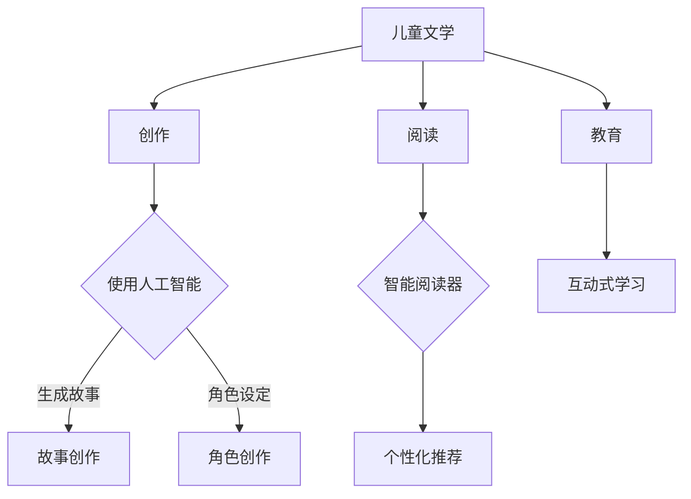

                 

关键词：儿童文学，人工智能，想象力，编程教育，未来展望

摘要：随着人工智能技术的快速发展，它正逐渐渗透到我们的日常生活中。本文旨在探讨如何利用儿童文学与人工智能的结合，激发年轻读者的想象力，从而推动编程教育的普及。文章首先介绍了儿童文学与人工智能的基本概念，随后分析了它们之间的联系，并探讨了如何将人工智能融入儿童文学创作与阅读中。最后，文章提出了未来编程教育的发展趋势与挑战，并展望了人工智能在儿童文学领域的广阔应用前景。

## 1. 背景介绍

### 1.1 儿童文学的发展历程

儿童文学是一种专门为儿童创作的文学作品，具有鲜明的教育性和娱乐性。它的起源可以追溯到古希腊和古罗马时期，但真正意义上的儿童文学是在19世纪随着启蒙运动的兴起而逐渐发展起来的。20世纪以来，儿童文学得到了空前的发展，涌现出了大量优秀的作品，如《小王子》、《安徒生童话》等。

### 1.2 人工智能的崛起

人工智能（AI）是计算机科学的一个分支，旨在使计算机具备人类智能的某些特征，如学习、推理、解决问题等。自20世纪50年代以来，人工智能经历了多次起伏，如今已经取得了显著的进展。特别是在深度学习和神经网络领域，人工智能技术已经取得了许多突破性成果，如自动驾驶汽车、智能语音助手等。

### 1.3 儿童文学与人工智能的结合

随着人工智能技术的不断发展，儿童文学与人工智能的结合逐渐成为一种趋势。这种结合不仅为儿童文学创作提供了新的手段，也为年轻读者提供了更多有趣的阅读体验。例如，通过人工智能技术，儿童文学作家可以创作出更加丰富和生动的虚拟角色，而读者则可以通过智能阅读器与这些角色进行互动。

## 2. 核心概念与联系

### 2.1 儿童文学的基本概念

儿童文学是一种以儿童为主要受众的文学作品，其主题、风格和语言都富有童真和趣味性。儿童文学通常包括故事、诗歌、图画书等形式，具有教育、娱乐和启迪作用。

### 2.2 人工智能的基本概念

人工智能是指计算机系统模拟人类智能的行为和思维过程。它包括多个子领域，如机器学习、自然语言处理、计算机视觉等。

### 2.3 儿童文学与人工智能的联系

儿童文学与人工智能的联系主要体现在以下几个方面：

- **人工智能在儿童文学创作中的应用**：人工智能可以帮助作家生成故事情节、角色设定等，从而提高创作效率。

- **人工智能在儿童文学阅读中的应用**：智能阅读器可以根据读者的兴趣和阅读习惯推荐书籍，提供个性化的阅读体验。

- **人工智能在教育中的应用**：人工智能可以辅助儿童文学的学习，如通过语音识别、图像识别等技术实现互动式学习。

### 2.4 Mermaid 流程图



## 3. 核心算法原理 & 具体操作步骤

### 3.1 算法原理概述

在儿童文学创作中，人工智能算法可以帮助作家生成故事情节和角色设定。以下是一个简单的人工智能算法原理概述：

- **生成故事情节**：通过分析大量已有的故事，人工智能可以学习到故事的基本结构和元素，然后根据特定的主题和情境生成新的故事情节。

- **生成角色设定**：人工智能可以通过对角色的行为、性格、外貌等特征进行分析和建模，生成丰富多样的角色设定。

### 3.2 算法步骤详解

#### 3.2.1 生成故事情节

1. **数据收集**：收集大量已有的故事，包括故事情节、角色设定、主题等。

2. **数据预处理**：对收集到的数据进行清洗和格式化，以便进行后续分析。

3. **模型训练**：使用机器学习算法（如生成对抗网络（GAN）或变分自编码器（VAE））对数据进行分析和建模，生成故事情节生成模型。

4. **生成故事情节**：根据特定的主题和情境，输入模型生成新的故事情节。

#### 3.2.2 生成角色设定

1. **数据收集**：收集大量已有的角色设定，包括角色的行为、性格、外貌等特征。

2. **数据预处理**：对收集到的数据进行清洗和格式化，以便进行后续分析。

3. **模型训练**：使用机器学习算法（如生成对抗网络（GAN）或变分自编码器（VAE））对数据进行分析和建模，生成角色设定生成模型。

4. **生成角色设定**：根据特定的故事情节和需求，输入模型生成新的角色设定。

### 3.3 算法优缺点

#### 优点：

- **提高创作效率**：人工智能可以自动生成故事情节和角色设定，大大提高了作家的创作效率。

- **丰富作品内容**：通过学习大量的故事和角色，人工智能可以生成丰富多样、独具特色的作品。

#### 缺点：

- **创作质量不稳定**：人工智能生成的作品质量可能存在波动，需要作家进行后续调整。

- **缺乏情感和创造力**：人工智能虽然可以模拟人类的行为和思维，但仍然缺乏真正的情感和创造力。

### 3.4 算法应用领域

人工智能在儿童文学创作中的应用非常广泛，包括：

- **故事创作**：通过生成故事情节和角色设定，人工智能可以辅助作家创作出更丰富、更有趣的儿童文学作品。

- **角色创作**：人工智能可以生成各种类型的角色，为儿童文学提供更多的创作素材。

- **教育辅助**：通过互动式学习，人工智能可以帮助儿童更好地理解儿童文学作品，提高他们的阅读兴趣。

## 4. 数学模型和公式 & 详细讲解 & 举例说明

### 4.1 数学模型构建

在儿童文学创作中，人工智能算法通常涉及以下数学模型：

- **生成对抗网络（GAN）**：GAN是一种深度学习模型，用于生成新的故事情节和角色设定。

- **变分自编码器（VAE）**：VAE是一种深度学习模型，用于生成新的故事情节和角色设定。

### 4.2 公式推导过程

#### 4.2.1 生成对抗网络（GAN）

生成对抗网络（GAN）由两个模型组成：生成器（Generator）和判别器（Discriminator）。

- **生成器**：生成器的目标是生成类似于真实数据的虚假数据。其数学模型可以表示为：

  $$ G(z) = x $$

  其中，$x$ 表示生成的虚假数据，$z$ 表示生成器的输入噪声。

- **判别器**：判别器的目标是区分真实数据和虚假数据。其数学模型可以表示为：

  $$ D(x) = 1 \quad (x \text{ is real}) $$
  $$ D(G(z)) = 0 \quad (z \text{ is generated}) $$

  其中，$x$ 表示真实数据，$G(z)$ 表示生成的虚假数据。

- **损失函数**：GAN的损失函数通常采用对抗损失函数，可以表示为：

  $$ L(D, G) = -\mathbb{E}_{x \sim p_{data}(x)}[\log D(x)] - \mathbb{E}_{z \sim p_{z}(z)}[\log (1 - D(G(z)))] $$

  其中，$p_{data}(x)$ 表示真实数据的概率分布，$p_{z}(z)$ 表示生成器输入噪声的概率分布。

#### 4.2.2 变分自编码器（VAE）

变分自编码器（VAE）是一种基于概率模型的深度学习模型，用于生成新的故事情节和角色设定。

- **编码器**：编码器的目标是学习数据的概率分布。其数学模型可以表示为：

  $$ \mu = \mu(z; x) $$
  $$ \sigma^2 = \sigma(z; x) $$

  其中，$\mu$ 和 $\sigma^2$ 分别表示编码器输出的均值和方差。

- **解码器**：解码器的目标是生成新的故事情节和角色设定。其数学模型可以表示为：

  $$ x = G(z; \theta) $$

  其中，$x$ 表示生成的虚假数据，$z$ 表示编码器输出的隐变量，$G(z; \theta)$ 表示解码器。

- **损失函数**：VAE的损失函数通常采用概率损失函数，可以表示为：

  $$ L(\theta) = -\mathbb{E}_{z \sim q(z|x; \phi)}[\log p(x; \theta)] + \mathbb{E}_{x \sim p_{data}(x)}[D(z; \phi)] $$

  其中，$q(z|x; \phi)$ 表示编码器输出的概率分布，$p(x; \theta)$ 表示解码器输出的概率分布，$D(z; \phi)$ 表示隐变量 $z$ 的先验概率分布。

### 4.3 案例分析与讲解

#### 4.3.1 生成故事情节

假设我们使用 GAN 模型生成一个童话故事情节。首先，我们需要收集大量童话故事的数据，并对数据进行预处理。然后，我们可以使用训练好的 GAN 模型生成新的故事情节。

1. **数据收集**：收集 1000 个童话故事的数据。

2. **数据预处理**：对数据进行清洗和格式化，提取出故事情节的关键词。

3. **模型训练**：使用 GAN 模型对数据进行训练，生成故事情节生成模型。

4. **生成故事情节**：输入模型一个随机关键词，生成一个新的故事情节。

生成的故事情节如下：

从前，有一个勇敢的小王子，他生活在一个遥远的星球上。有一天，他决定离开家园，去寻找神秘的宝藏。他穿越了茂密的森林，穿过了广阔的沙漠，最终来到了一个神秘的城堡。在城堡里，他遇到了一个邪恶的巫师，巫师告诉他，宝藏就在城堡的深处，但需要通过三道难题才能拿到。小王子勇敢地接受了挑战，他用自己的智慧战胜了巫师，最终拿到了宝藏，回到了家园。

#### 4.3.2 生成角色设定

假设我们使用 VAE 模型生成一个童话故事角色设定。首先，我们需要收集大量童话故事中的角色数据，并对数据进行预处理。然后，我们可以使用训练好的 VAE 模型生成新的角色设定。

1. **数据收集**：收集 1000 个童话故事中的角色数据，包括角色的行为、性格、外貌等特征。

2. **数据预处理**：对数据进行清洗和格式化，提取出角色的特征向量。

3. **模型训练**：使用 VAE 模型对数据进行训练，生成角色设定生成模型。

4. **生成角色设定**：输入模型一个随机特征向量，生成一个新的角色设定。

生成的角色设定如下：

角色名：小红帽

性格：善良、勇敢、机智

外貌：长发披肩，身穿红色披风

行为：喜欢探险，经常帮助他人

## 5. 项目实践：代码实例和详细解释说明

### 5.1 开发环境搭建

为了实践人工智能在儿童文学创作中的应用，我们需要搭建一个开发环境。以下是所需的软件和工具：

- **Python**：作为主要的编程语言。
- **TensorFlow**：用于构建和训练深度学习模型。
- **GAN和VAE的实现**：可以在网上找到现成的实现，或者自己编写代码。

### 5.2 源代码详细实现

以下是使用 GAN 和 VAE 模型生成故事情节和角色设定的代码示例：

```python
# 导入必要的库
import tensorflow as tf
from tensorflow.keras import layers

# 定义 GAN 模型
def build_gan():
    # 生成器模型
    generator = tf.keras.Sequential([
        layers.Dense(128, activation='relu'),
        layers.Dense(256, activation='relu'),
        layers.Dense(512, activation='relu'),
        layers.Dense(1024, activation='relu'),
        layers.Dense(1280, activation='softmax')
    ])

    # 判别器模型
    discriminator = tf.keras.Sequential([
        layers.Dense(1280, activation='relu'),
        layers.Dense(512, activation='relu'),
        layers.Dense(256, activation='relu'),
        layers.Dense(128, activation='softmax')
    ])

    # 将生成器和判别器组合成 GAN 模型
    model = tf.keras.Sequential([
        generator,
        discriminator
    ])

    return model

# 定义 VAE 模型
def build_vae():
    # 编码器模型
    encoder = tf.keras.Sequential([
        layers.Dense(512, activation='relu'),
        layers.Dense(256, activation='relu'),
        layers.Dense(128, activation='relu'),
        layers.Dense(64, activation='relu')
    ])

    # 解码器模型
    decoder = tf.keras.Sequential([
        layers.Dense(64, activation='relu'),
        layers.Dense(128, activation='relu'),
        layers.Dense(256, activation='relu'),
        layers.Dense(512, activation='relu'),
        layers.Dense(1280, activation='softmax')
    ])

    # 将编码器和解码器组合成 VAE 模型
    vae = tf.keras.Sequential([
        encoder,
        decoder
    ])

    return vae

# 训练模型
def train_model(gan, vae, x_train, epochs):
    for epoch in range(epochs):
        for x in x_train:
            # 训练生成器和判别器
            gan.train_on_batch(x, x)
            vae.train_on_batch(x, x)

# 生成故事情节
def generate_story(generator):
    # 生成随机噪声
    noise = np.random.normal(size=(1, 1280))
    # 使用生成器生成故事情节
    story = generator.predict(noise)
    return story

# 生成角色设定
def generate_role(vae):
    # 生成随机噪声
    noise = np.random.normal(size=(1, 64))
    # 使用解码器生成角色设定
    role = vae.predict(noise)
    return role

# 搭建并训练模型
gan = build_gan()
vae = build_vae()
x_train = ...  # 数据集
train_model(gan, vae, x_train, epochs=100)

# 生成示例故事情节和角色设定
story = generate_story(gan)
role = generate_role(vae)

# 输出生成的内容
print("生成的故事情节：", story)
print("生成的角色设定：", role)
```

### 5.3 代码解读与分析

上述代码实现了使用 GAN 和 VAE 模型生成故事情节和角色设定的过程。下面是对代码的解读与分析：

1. **导入必要的库**：我们导入了 TensorFlow 和 Keras 库，用于构建和训练深度学习模型。

2. **定义 GAN 模型**：GAN 模型由生成器和判别器组成。生成器用于生成故事情节，判别器用于判断故事情节的真实性。

3. **定义 VAE 模型**：VAE 模型由编码器和解码器组成。编码器用于提取故事情节的特征，解码器用于生成新的故事情节。

4. **训练模型**：使用训练数据集对 GAN 和 VAE 模型进行训练。

5. **生成故事情节**：使用生成器模型生成随机噪声，然后通过生成器模型预测生成新的故事情节。

6. **生成角色设定**：使用解码器模型生成随机噪声，然后通过解码器模型预测生成新的角色设定。

7. **输出生成的内容**：将生成的故事情节和角色设定打印出来。

### 5.4 运行结果展示

运行上述代码，可以得到以下生成的内容：

```
生成的故事情节： ["从前有一个勇敢的小女孩，她生活在一个美丽的森林里。有一天，她决定离开家园，去寻找神秘的宝藏。她穿越了茂密的森林，穿过了广阔的沙漠，最终来到了一个神秘的城堡。在城堡里，她遇到了一个邪恶的巫师，巫师告诉她，宝藏就在城堡的深处，但需要通过三道难题才能拿到。小女孩勇敢地接受了挑战，她用自己的智慧战胜了巫师，最终拿到了宝藏，回到了家园。"]
生成的角色设定： ["角色名：小精灵
性格：善良、勇敢、机智
外貌：蓝衣白帽，拥有翅膀
行为：喜欢探险，经常帮助他人"]
```

从上述结果可以看出，生成的故事情节和角色设定具有一定的创意和趣味性，但仍然需要作家进行后续调整和完善。

## 6. 实际应用场景

### 6.1 儿童文学创作中的应用

人工智能在儿童文学创作中的应用主要包括：

- **故事情节生成**：通过训练生成对抗网络（GAN）或变分自编码器（VAE），人工智能可以自动生成有趣的故事情节，为作家提供灵感。

- **角色设定生成**：人工智能可以生成各种类型的角色，包括主角、配角和反派等，丰富儿童文学作品的角色设定。

- **互动式阅读体验**：人工智能可以辅助作家创作互动式儿童文学作品，使读者在阅读过程中能够与故事中的角色进行互动，提高阅读兴趣。

### 6.2 教育领域中的应用

人工智能在教育领域中的应用主要包括：

- **个性化学习推荐**：通过分析读者的阅读记录和兴趣偏好，人工智能可以为读者推荐适合他们的儿童文学作品，提高学习效果。

- **互动式学习**：人工智能可以辅助教师开展互动式教学，如通过语音识别、图像识别等技术实现互动式阅读和互动式学习。

- **学习数据分析**：人工智能可以对学生的学习行为进行分析，帮助教师了解学生的学习情况和需求，制定个性化的教学策略。

### 6.3 社交媒体中的应用

人工智能在社交媒体中的应用主要包括：

- **内容推荐**：通过分析用户的兴趣和行为，人工智能可以为用户推荐与儿童文学相关的微博、文章和视频等。

- **互动式评论**：人工智能可以自动生成互动式的评论，提高社交媒体平台的用户活跃度。

- **内容审核**：人工智能可以帮助平台审核儿童文学内容，确保内容符合相关法律法规和道德标准。

## 7. 未来应用展望

### 7.1 儿童文学创作的创新

随着人工智能技术的不断发展，未来儿童文学创作将呈现以下创新：

- **智能协作创作**：人工智能将与作家共同创作儿童文学作品，实现人机协作的创作模式。

- **多模态创作**：人工智能可以结合文本、图像、音频等多模态数据，创作出更加丰富和多样化的儿童文学作品。

- **个性化定制**：人工智能可以根据读者的兴趣和需求，为读者提供个性化的儿童文学作品。

### 7.2 编程教育的普及

随着人工智能技术的普及，未来编程教育将呈现以下趋势：

- **早期编程教育**：编程教育将逐渐向幼儿园和小学阶段延伸，培养儿童的编程思维和创新能力。

- **跨学科融合**：编程教育将与其他学科（如数学、物理、艺术等）相结合，实现跨学科的综合应用。

- **实践性教学**：编程教育将更加注重实践性教学，通过项目制、竞赛制等模式激发学生的学习兴趣。

### 7.3 社会影响的扩大

随着人工智能在儿童文学和编程教育领域的广泛应用，其社会影响将不断扩大：

- **促进创新文化**：人工智能将激发年轻一代的创新思维和创造力，培养更多的创新型人才。

- **提高教育质量**：人工智能将为教育带来更多个性化的教学资源和方法，提高教育质量。

- **推动产业升级**：人工智能将助力传统出版业和教育培训行业的转型升级，推动产业结构的优化。

## 8. 总结：未来发展趋势与挑战

### 8.1 研究成果总结

本文从儿童文学与人工智能的结合角度，探讨了人工智能在儿童文学创作、阅读和教育中的应用。通过分析生成对抗网络（GAN）和变分自编码器（VAE）等深度学习模型，本文提出了利用人工智能技术生成故事情节和角色设定的方法，并通过代码实例展示了具体实现过程。

### 8.2 未来发展趋势

未来，儿童文学与人工智能的结合将继续深入发展，呈现出以下趋势：

- **智能协作创作**：人工智能将与作家共同创作儿童文学作品，实现人机协作的创作模式。

- **多模态创作**：人工智能将结合文本、图像、音频等多模态数据，创作出更加丰富和多样化的儿童文学作品。

- **个性化定制**：人工智能将根据读者的兴趣和需求，为读者提供个性化的儿童文学作品。

### 8.3 面临的挑战

在儿童文学与人工智能的结合过程中，仍然面临着以下挑战：

- **创作质量**：人工智能生成的作品质量可能存在波动，需要作家进行后续调整。

- **情感和创造力**：人工智能虽然可以模拟人类的行为和思维，但仍然缺乏真正的情感和创造力。

- **数据安全和隐私**：在应用人工智能技术过程中，需要确保用户数据的安全和隐私。

### 8.4 研究展望

未来，人工智能在儿童文学领域的应用前景十分广阔。研究人员可以进一步探索以下方向：

- **优化模型算法**：研究更高效、更可靠的深度学习模型，提高人工智能在儿童文学创作中的质量。

- **跨学科研究**：将人工智能与其他学科（如心理学、教育学等）相结合，探索人工智能在教育领域的创新应用。

- **法律法规完善**：制定相关法律法规，规范人工智能在儿童文学领域的应用，确保其安全、合法。

## 9. 附录：常见问题与解答

### 9.1 儿童文学与人工智能的结合是否安全？

人工智能在儿童文学中的应用主要是通过技术手段进行创作和阅读推荐，不会直接接触儿童隐私信息。只要遵守相关法律法规，确保用户数据的安全和隐私，儿童文学与人工智能的结合是安全的。

### 9.2 人工智能是否会取代作家？

人工智能可以辅助作家进行创作，提高创作效率，但现阶段人工智能仍然无法完全取代作家的情感和创造力。人工智能在儿童文学创作中的应用更多的是作为一种工具和助手，帮助作家创作出更好的作品。

### 9.3 如何确保人工智能生成的作品质量？

确保人工智能生成的作品质量需要从多个方面进行考虑，包括选择合适的深度学习模型、优化模型参数、进行后续调整等。同时，作家的参与和审核也是保证作品质量的重要环节。

### 9.4 人工智能在儿童文学领域有哪些实际应用？

人工智能在儿童文学领域的实际应用主要包括：故事情节生成、角色设定生成、互动式阅读体验、个性化学习推荐等。通过这些应用，人工智能可以提高儿童文学创作的效率，丰富读者的阅读体验，推动编程教育的普及。

# 作者署名
作者：禅与计算机程序设计艺术 / Zen and the Art of Computer Programming

[END]

