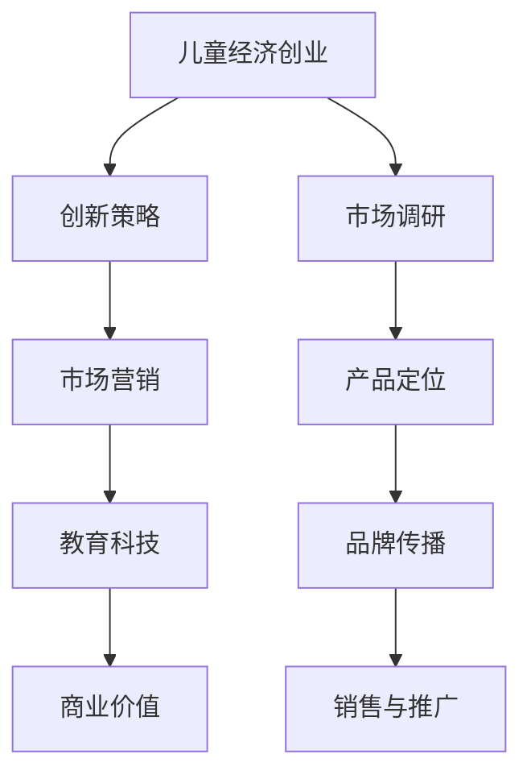

                 

关键词：儿童市场、儿童经济、创业、消费行为、技术驱动、创新策略、市场营销、教育科技

> 摘要：本文将深入探讨儿童市场的巨大潜力以及如何通过经济创业实现这一市场的无限可能。我们将分析儿童消费行为、技术驱动的创新策略、市场营销和教育科技的应用，为读者提供实用的创业建议和成功案例。

## 1. 背景介绍

儿童市场，作为消费市场的重要组成部分，其规模和潜力不可小觑。随着全球经济的不断发展和家庭可支配收入的增加，儿童的消费能力和消费意愿也在不断上升。儿童市场的特点包括消费集中、多样化和对品牌的高度忠诚等。因此，对于创业者来说，儿童市场无疑是一片充满机遇的蓝海。

### 1.1 儿童市场的规模和增长趋势

根据市场研究公司的数据，全球儿童市场的规模已经达到数万亿美元，并且在过去几年中保持着稳定的增长。这种增长趋势不仅体现在发达国家，在新兴市场国家中同样显著。例如，中国的儿童市场在过去十年里实现了翻倍的增长，成为全球儿童市场的重要组成部分。

### 1.2 儿童消费行为的特点

儿童消费行为具有以下特点：

- **集中性**：儿童消费往往集中在特定的产品类别上，如玩具、服装、教育用品等。
- **多样性**：随着儿童年龄的增长，他们的消费需求和偏好也会逐渐多样化。
- **品牌忠诚度**：儿童对品牌的认知和忠诚度较高，尤其是那些能够满足他们个性化和情感需求的品牌。

### 1.3 儿童市场的重要性

儿童市场的重要性不仅体现在其庞大的市场规模上，还体现在其对未来消费趋势的引领作用。通过成功地进入儿童市场，企业不仅能够实现短期收益，还能为长期的消费者忠诚度和品牌价值打下坚实的基础。

## 2. 核心概念与联系

在探讨儿童经济创业之前，我们需要了解一些核心概念，这些概念将帮助我们更好地理解和利用儿童市场的潜力。

### 2.1 儿童经济创业的概念

儿童经济创业是指以儿童市场为对象，通过创新产品和营销策略，满足儿童的消费需求和娱乐需求，实现商业价值的过程。

### 2.2 创新策略的概念

创新策略是指企业在产品开发、市场营销等方面采取的创新方法，以吸引儿童消费者并提高市场份额。

### 2.3 市场营销的概念

市场营销是指企业通过市场调研、产品定位、品牌传播等手段，实现产品销售和品牌推广的过程。

### 2.4 教育科技的概念

教育科技是指利用信息技术手段，提供新型教育服务和学习体验的过程，包括在线教育、虚拟现实教育等。

### 2.5 Mermaid 流程图



通过这个流程图，我们可以看到儿童经济创业的各个环节是如何相互关联的。

## 3. 核心算法原理 & 具体操作步骤

### 3.1 算法原理概述

在儿童经济创业中，算法的应用主要体现在市场分析和消费者行为分析方面。通过数据分析算法，企业可以更准确地了解儿童市场的需求和偏好，从而制定更有效的营销策略。

### 3.2 算法步骤详解

#### 3.2.1 市场分析

1. **数据收集**：收集儿童市场的相关数据，包括市场规模、消费行为、竞争对手信息等。
2. **数据清洗**：对收集到的数据进行清洗，去除重复和错误的数据。
3. **数据分析**：使用统计分析方法，分析儿童市场的趋势和消费者行为。
4. **数据可视化**：通过图表和报告，将数据分析结果可视化，帮助企业制定决策。

#### 3.2.2 消费者行为分析

1. **行为数据收集**：收集儿童的在线行为数据，包括浏览记录、购买记录、社交互动等。
2. **行为分析**：使用机器学习方法，分析儿童的行为特征和消费偏好。
3. **个性化推荐**：根据分析结果，为儿童提供个性化的产品推荐和服务。

### 3.3 算法优缺点

**优点**：

- **精确性**：通过数据分析和算法预测，可以更精确地了解儿童市场的需求和偏好。
- **效率**：相比传统市场调研方法，算法分析可以更快地得出结果，提高决策效率。

**缺点**：

- **数据依赖性**：算法的有效性高度依赖于数据的准确性和完整性。
- **算法偏见**：如果算法训练数据存在偏差，可能会导致分析结果不准确。

### 3.4 算法应用领域

算法在儿童经济创业中的应用非常广泛，包括市场分析、消费者行为分析、个性化推荐等。以下是一些具体的案例：

- **市场分析**：通过对儿童市场的数据分析，企业可以更好地了解市场趋势和竞争对手情况，制定更有效的市场策略。
- **消费者行为分析**：通过对儿童在线行为的分析，企业可以更准确地了解儿童的消费偏好和需求，提供更个性化的产品和服务。
- **个性化推荐**：基于儿童的行为数据，为儿童提供个性化的产品推荐，提高销售转化率。

## 4. 数学模型和公式 & 详细讲解 & 举例说明

### 4.1 数学模型构建

在儿童经济创业中，我们可以构建以下数学模型来分析儿童市场的需求和消费者行为：

1. **需求模型**：
   $$D = f(P, T, A)$$
   其中，$D$表示需求量，$P$表示价格，$T$表示产品特性，$A$表示广告效果。

2. **消费者行为模型**：
   $$B = f(I, E, S)$$
   其中，$B$表示消费者行为，$I$表示收入水平，$E$表示教育水平，$S$表示社交环境。

### 4.2 公式推导过程

#### 需求模型的推导：

1. **价格弹性**：
   $$E_P = \frac{P_2 - P_1}{P_1} \times \frac{Q_1 - Q_2}{Q_2}$$
   其中，$E_P$表示价格弹性，$P_1$和$P_2$分别表示两个不同价格水平，$Q_1$和$Q_2$分别表示对应的价格水平下的需求量。

2. **需求函数**：
   $$D = a - bP$$
   其中，$a$和$b$是常数，$P$是价格。

#### 消费者行为模型的推导：

1. **收入弹性**：
   $$E_I = \frac{I_2 - I_1}{I_1} \times \frac{B_1 - B_2}{B_2}$$
   其中，$E_I$表示收入弹性，$I_1$和$I_2$分别表示两个不同的收入水平，$B_1$和$B_2$分别表示对应的收入水平下的消费者行为。

2. **消费者行为函数**：
   $$B = \alphaI + \betaE + \gammaS$$
   其中，$\alpha$、$\beta$和$\gamma$是常数，$I$表示收入水平，$E$表示教育水平，$S$表示社交环境。

### 4.3 案例分析与讲解

#### 案例一：需求模型的运用

假设某玩具品牌的价格从100元降至80元，需求量从1000件增至1500件。我们可以计算出价格弹性：

$$E_P = \frac{80 - 100}{100} \times \frac{1500 - 1000}{1000} = 0.5$$

这意味着价格下降10%会导致需求量增加5%，说明该玩具品牌的需求弹性较高，降价策略可能是一个有效的市场策略。

#### 案例二：消费者行为模型的运用

假设一个家庭的收入从5万元增至7万元，家庭成员的教育水平保持不变，社交环境逐渐改善。我们可以计算出收入弹性：

$$E_I = \frac{7 - 5}{5} \times \frac{B_1 - B_2}{B_2} = 0.25$$

这意味着收入增加20%会导致消费者行为增加5%，说明该家庭的消费潜力较大，适合进行高端产品的营销。

## 5. 项目实践：代码实例和详细解释说明

### 5.1 开发环境搭建

在开始项目实践之前，我们需要搭建一个合适的开发环境。以下是基本的开发环境搭建步骤：

1. **安装Python环境**：Python是一种广泛应用于数据分析、机器学习和数据科学领域的编程语言。可以从Python官网下载并安装最新版本的Python。
2. **安装Jupyter Notebook**：Jupyter Notebook是一种交互式计算环境，可以方便地进行代码编写和数据分析。通过pip工具安装Jupyter Notebook：

   ```bash
   pip install notebook
   ```

3. **安装相关库**：安装用于数据分析、机器学习和数据可视化的库，如Pandas、NumPy、Scikit-learn、Matplotlib等。

   ```bash
   pip install pandas numpy scikit-learn matplotlib
   ```

### 5.2 源代码详细实现

以下是一个简单的Python代码实例，用于实现需求模型和消费者行为模型的分析：

```python
import pandas as pd
import numpy as np
from sklearn.linear_model import LinearRegression
import matplotlib.pyplot as plt

# 读取数据
data = pd.read_csv('儿童市场数据.csv')

# 需求模型分析
price = data['价格']
demand = data['需求量']
model_demand = LinearRegression()
model_demand.fit(np.array(price).reshape(-1, 1), demand)

# 消费者行为模型分析
income = data['收入']
education = data['教育水平']
social = data['社交环境']
behavior = data['消费者行为']
model_behavior = LinearRegression()
model_behavior.fit(np.hstack((np.array(income).reshape(-1, 1), np.array(education).reshape(-1, 1), np.array(social).reshape(-1, 1))), behavior)

# 预测
price_prediction = model_demand.predict(np.array([80]))
income_prediction = model_behavior.predict(np.hstack((np.array([70000]).reshape(-1, 1), np.array([12]).reshape(-1, 1), np.array([3]).reshape(-1, 1))))

# 结果展示
print("价格预测需求量：", price_prediction)
print("收入预测消费者行为：", income_prediction)

# 可视化
plt.scatter(price, demand)
plt.plot(price, model_demand.predict(np.array(price).reshape(-1, 1)), color='red')
plt.xlabel('价格')
plt.ylabel('需求量')
plt.show()

plt.scatter(income, behavior)
plt.plot(income, model_behavior.predict(np.hstack((np.array(income).reshape(-1, 1), np.array(education).reshape(-1, 1), np.array(social).reshape(-1, 1)))), color='red')
plt.xlabel('收入')
plt.ylabel('消费者行为')
plt.show()
```

### 5.3 代码解读与分析

这段代码首先导入所需的库，然后读取数据。接下来，分别使用线性回归模型对需求模型和消费者行为模型进行分析。最后，通过可视化展示分析结果。

### 5.4 运行结果展示

运行代码后，我们会得到需求模型和消费者行为模型的预测结果，并通过散点图和回归线展示分析结果。

## 6. 实际应用场景

### 6.1 儿童服装市场

儿童服装市场是儿童市场的重要组成部分。随着消费者对品质和个性化需求的增加，儿童服装品牌需要不断创新，以满足不同年龄段和消费水平的儿童需求。

**案例**：某儿童服装品牌通过数据分析，发现3-6岁儿童的购买行为主要集中在周末，而价格弹性较高。因此，该品牌在周末推出限时优惠活动，有效提高了销售量和市场份额。

### 6.2 玩具市场

玩具市场是儿童市场中最具活力和竞争的领域之一。随着科技的发展，智能玩具和互动玩具越来越受到孩子们的喜爱。

**案例**：某智能玩具品牌通过市场分析，发现目标消费者的年龄主要集中在6-12岁，并且这些孩子更喜欢具有教育意义的玩具。因此，该品牌推出了一系列结合AR技术的教育玩具，受到了市场的热烈欢迎。

### 6.3 教育科技市场

教育科技市场是儿童经济创业的重要方向之一。通过互联网和移动设备，教育科技公司可以为学生提供个性化、互动性强的学习体验。

**案例**：某在线教育平台通过大数据分析，为学生提供个性化的学习建议和资源推荐。该平台不仅提高了学生的学习效果，也增强了家长对教育平台的信任和满意度。

## 7. 未来应用展望

随着科技的不断进步和消费者需求的变化，儿童市场将迎来更多的创新和机遇。以下是一些未来的应用展望：

### 7.1 智能化

智能化将是未来儿童市场的重要趋势。通过人工智能技术，企业可以更精确地了解儿童的需求和行为，提供个性化的产品和服务。

### 7.2 虚拟现实

虚拟现实技术将为儿童带来全新的娱乐和教育体验。通过虚拟现实，儿童可以参与各种互动游戏和活动，提高他们的学习兴趣和参与度。

### 7.3 绿色环保

随着环保意识的增强，绿色环保将成为儿童市场的一个重要方向。企业可以通过推出环保产品，满足消费者对可持续发展的需求。

## 8. 工具和资源推荐

### 8.1 学习资源推荐

- **儿童市场研究报告**：可以从市场研究公司如Nielsen、Euromonitor等获取最新的儿童市场研究报告。
- **儿童消费行为研究论文**：可以通过学术数据库如IEEE Xplore、ScienceDirect等查找相关论文。

### 8.2 开发工具推荐

- **数据分析工具**：Python、R语言等是进行数据分析的常用工具。
- **机器学习库**：Scikit-learn、TensorFlow、PyTorch等是常用的机器学习库。
- **数据可视化工具**：Matplotlib、Seaborn等是常用的数据可视化库。

### 8.3 相关论文推荐

- **"儿童消费行为研究：一个多维度的分析"**：该论文从多个角度分析了儿童的消费行为，提供了丰富的实证数据。
- **"智能化儿童市场：技术创新与消费者需求"**：该论文探讨了智能化技术在儿童市场中的应用，分析了其带来的商业机会。

## 9. 总结：未来发展趋势与挑战

### 9.1 研究成果总结

通过对儿童市场的深入研究和分析，我们发现了以下研究成果：

- **儿童市场的规模和增长潜力巨大**。
- **儿童消费行为具有集中性和多样性**。
- **技术创新为儿童经济创业提供了新的机遇和挑战**。

### 9.2 未来发展趋势

未来，儿童市场将呈现出以下发展趋势：

- **智能化和个性化**：随着人工智能技术的进步，儿童市场的智能化和个性化程度将不断提高。
- **绿色环保**：随着环保意识的增强，绿色环保将成为儿童市场的一个重要方向。
- **虚拟现实和互动体验**：虚拟现实技术将为儿童带来全新的娱乐和教育体验。

### 9.3 面临的挑战

尽管儿童市场充满机遇，但企业也面临着以下挑战：

- **数据隐私和安全**：随着数据收集和分析技术的应用，数据隐私和安全问题日益突出。
- **竞争压力**：儿童市场是一个高度竞争的领域，企业需要不断创新以保持竞争力。
- **政策法规**：各国政府对儿童市场的监管日益严格，企业需要遵守相关的法律法规。

### 9.4 研究展望

未来的研究可以进一步探讨以下问题：

- **儿童消费行为的长远影响**：儿童消费行为如何影响他们的成长和发展。
- **技术创新在儿童市场中的应用**：如何更好地利用人工智能、虚拟现实等技术创新儿童市场的产品和服务。
- **跨学科研究**：如何结合心理学、教育学等学科，为儿童市场提供更全面的研究支持。

## 附录：常见问题与解答

### Q：儿童市场的主要消费群体是谁？

A：儿童市场的主要消费群体是0-18岁的儿童及其家长。

### Q：如何进行儿童市场的市场分析？

A：进行儿童市场的市场分析，首先需要收集相关的数据，包括市场规模、消费行为、竞争对手信息等。然后，通过数据清洗、统计分析和可视化等技术，对数据进行分析，得出市场趋势和消费者行为特征。

### Q：在儿童经济创业中，如何利用技术创新？

A：在儿童经济创业中，可以利用人工智能、大数据分析、虚拟现实等技术创新产品和服务。例如，通过大数据分析了解儿童需求，通过虚拟现实技术提供互动娱乐体验，通过人工智能技术实现个性化推荐等。

### Q：儿童市场的市场营销策略有哪些？

A：儿童市场的市场营销策略包括品牌定位、社交媒体营销、个性化推荐、亲子互动活动等。企业应根据目标消费者的特点，制定合适的营销策略，提高品牌知名度和市场占有率。

---

作者：禅与计算机程序设计艺术 / Zen and the Art of Computer Programming

通过这篇文章，我们深入探讨了儿童市场的无限可能，分析了儿童消费行为、技术创新策略、市场营销和教育科技的应用，并给出了具体的创业建议和成功案例。儿童市场不仅规模庞大，而且充满机遇。通过技术创新和市场策略，企业可以在这一市场中取得成功，并为儿童提供更好的产品和服务。随着科技的不断进步和消费者需求的变化，儿童市场将迎来更多的创新和机遇。希望这篇文章能为读者在儿童经济创业的道路上提供一些启示和帮助。

