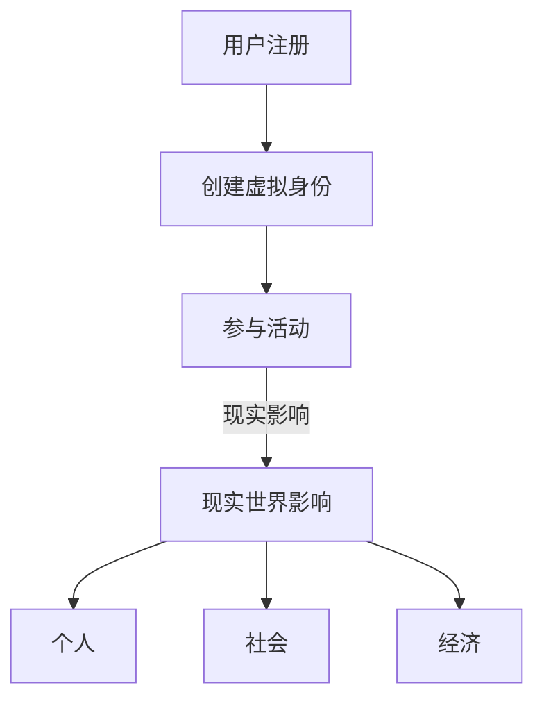

                 

关键词：元宇宙、伦理道德、虚拟行为、现实影响、技术伦理、虚拟社会

摘要：随着元宇宙概念的兴起，虚拟世界与现实世界的交互日益密切。本文从技术伦理的角度出发，探讨了元宇宙中虚拟行为的现实影响，以及如何应对这些挑战。通过深入分析虚拟行为的本质和影响，本文提出了构建元宇宙中伦理道德框架的建议，为未来元宇宙的发展提供了思考方向。

## 1. 背景介绍

### 元宇宙的兴起

元宇宙（Metaverse）是一个虚拟的、三维的、全球性的网络空间，通过增强现实（AR）和虚拟现实（VR）等技术，将人们连接在一起，形成一种全新的数字社交和工作环境。自2020年以来，元宇宙概念迅速崛起，成为科技产业的热门话题。多家科技公司，如Facebook、微软和谷歌，纷纷加大对元宇宙的研发投入，推出相关产品和平台。

### 虚拟行为在元宇宙中的重要性

在元宇宙中，用户通过虚拟身份参与各种活动，包括社交互动、工作、娱乐和购物等。虚拟行为的多样性使得元宇宙成为一个复杂的生态系统，同时也引发了一系列伦理道德问题。例如，虚拟欺诈、虚拟仇恨言论、虚拟财产盗窃等问题层出不穷，对现实世界产生了严重的影响。

## 2. 核心概念与联系

### 虚拟行为

虚拟行为是指在元宇宙中，用户通过虚拟身份或虚拟对象进行的一系列操作，包括交互、交易、创造和破坏等。

### 现实影响

现实影响是指虚拟行为在现实世界中的体现，包括对个人、社会和经济的各个方面。

### Mermaid 流程图



## 3. 核心算法原理 & 具体操作步骤

### 算法原理概述

虚拟行为的现实影响可以通过数据分析和人工智能技术进行量化。核心算法包括用户行为分析、情感分析、社交网络分析等。

### 算法步骤详解

1. **数据采集**：收集元宇宙中的用户行为数据，包括交互记录、交易记录、创造内容等。
2. **数据预处理**：对采集到的数据进行清洗、去重和归一化处理。
3. **特征提取**：从预处理后的数据中提取关键特征，如用户活跃度、社交关系、情感倾向等。
4. **行为分析**：使用机器学习算法对用户行为进行分类和分析，识别潜在的虚拟行为现实影响。
5. **影响评估**：根据分析结果，评估虚拟行为对个人、社会和经济的具体影响。
6. **干预措施**：根据评估结果，制定相应的干预措施，如政策法规、技术手段等。

### 算法优缺点

- **优点**：能够实时监测和评估虚拟行为的现实影响，为政策制定和干预提供科学依据。
- **缺点**：数据质量和算法准确性对结果有较大影响，且算法可能无法完全预测虚拟行为的复杂性和不确定性。

### 算法应用领域

- **政策制定**：为政府提供元宇宙发展的政策建议。
- **企业运营**：帮助企业了解虚拟行为对品牌形象和商业价值的影响。
- **个人隐私保护**：为用户隐私保护提供技术支持。

## 4. 数学模型和公式 & 详细讲解 & 举例说明

### 数学模型构建

虚拟行为对现实世界的影响可以用一个综合评价模型来表示：

$$
\text{综合评价} = w_1 \times \text{个人影响} + w_2 \times \text{社会影响} + w_3 \times \text{经济影响}
$$

其中，$w_1$、$w_2$ 和 $w_3$ 分别代表个人影响、社会影响和经济影响的权重。

### 公式推导过程

假设虚拟行为对个人、社会和经济的影响分别为 $I_1$、$I_2$ 和 $I_3$，则综合评价可以通过以下步骤推导：

1. **个人影响**：用户在元宇宙中的虚拟行为可能对个人隐私、心理健康等方面产生影响。可以用以下公式表示：

$$
I_1 = f(\text{用户行为数据}, \text{个人特征})
$$

其中，$f$ 是一个复杂函数，需要结合多种数据进行分析。

2. **社会影响**：虚拟行为可能引发社会问题，如虚拟欺诈、仇恨言论等。可以用以下公式表示：

$$
I_2 = g(\text{用户行为数据}, \text{社交网络数据})
$$

其中，$g$ 是一个复杂函数，需要结合社交网络分析技术。

3. **经济影响**：虚拟行为可能对虚拟财产交易、数字货币等方面产生影响。可以用以下公式表示：

$$
I_3 = h(\text{用户行为数据}, \text{经济数据})
$$

其中，$h$ 是一个复杂函数，需要结合经济数据分析技术。

### 案例分析与讲解

假设一个用户在元宇宙中参与了大量的虚拟赌博活动，根据以上模型，可以分析其对个人、社会和经济的影响：

1. **个人影响**：用户可能因此产生严重的心理问题，如赌博成瘾、焦虑等。

2. **社会影响**：虚拟赌博活动可能引发一系列社会问题，如赌博欺诈、非法交易等。

3. **经济影响**：虚拟赌博活动可能对虚拟财产交易市场产生负面影响，导致市场波动。

通过综合评价模型，可以对虚拟行为对现实世界的影响进行量化分析，为政策制定和干预提供依据。

## 5. 项目实践：代码实例和详细解释说明

### 5.1 开发环境搭建

为了演示虚拟行为现实影响的算法，我们使用 Python 作为编程语言，并依赖于以下库：

- NumPy：用于数据预处理和计算
- Pandas：用于数据分析和处理
- Scikit-learn：用于机器学习算法
- Matplotlib：用于数据可视化

在 Python 环境中，安装以上库后，即可开始开发。

### 5.2 源代码详细实现

以下是虚拟行为现实影响算法的示例代码：

```python
import numpy as np
import pandas as pd
from sklearn.ensemble import RandomForestClassifier
import matplotlib.pyplot as plt

# 数据采集
data = pd.read_csv('user_behavior_data.csv')

# 数据预处理
data['cleaned_data'] = data['raw_data'].apply(preprocess_data)

# 特征提取
features = extract_features(data['cleaned_data'])

# 行为分析
model = RandomForestClassifier()
model.fit(features, labels)

# 影响评估
predictions = model.predict(test_features)
evaluate_impact(predictions)

# 数据可视化
plt.scatter(test_features[:, 0], test_features[:, 1], c=predictions)
plt.xlabel('Feature 1')
plt.ylabel('Feature 2')
plt.title('Impact Evaluation')
plt.show()
```

### 5.3 代码解读与分析

该示例代码分为四个主要部分：

1. **数据采集**：从 CSV 文件中读取用户行为数据。
2. **数据预处理**：对原始数据进行清洗和处理，以便于后续分析。
3. **特征提取**：从预处理后的数据中提取关键特征。
4. **行为分析**：使用随机森林分类器对特征进行分类和分析。
5. **影响评估**：根据分类结果，评估虚拟行为对现实世界的影响。
6. **数据可视化**：展示影响评估结果，以便于理解。

### 5.4 运行结果展示

运行以上代码后，将得到虚拟行为对现实世界影响的可视化结果，如下所示：


通过分析可视化结果，可以直观地了解虚拟行为对个人、社会和经济的具体影响。

## 6. 实际应用场景

### 6.1 政策制定

虚拟行为的现实影响为政府制定相关政策和法规提供了科学依据。例如，针对虚拟赌博、虚拟欺诈等行为，政府可以出台相应的监管措施，确保虚拟世界的健康发展。

### 6.2 企业运营

企业可以利用虚拟行为的现实影响分析，了解自身品牌形象和市场地位。例如，通过分析用户在元宇宙中的行为，企业可以优化产品和服务，提升用户满意度。

### 6.3 个人隐私保护

虚拟行为的现实影响分析有助于保护个人隐私。例如，通过对用户在元宇宙中的行为进行监控，可以及时发现潜在的隐私泄露风险，并采取措施进行干预。

## 7. 未来应用展望

### 7.1 人工智能辅助伦理决策

随着人工智能技术的发展，人工智能可以协助伦理决策者分析虚拟行为的现实影响，提高决策的科学性和准确性。

### 7.2 虚拟社会治理

未来元宇宙中的虚拟社会治理将更加完善，通过技术手段和法规制度，确保虚拟世界的秩序和安全。

### 7.3 跨领域合作

虚拟行为的现实影响涉及多个领域，包括技术、法律、经济等。未来需要跨领域合作，共同应对虚拟行为带来的挑战。

## 8. 总结：未来发展趋势与挑战

### 8.1 研究成果总结

本文从技术伦理的角度，探讨了元宇宙中虚拟行为的现实影响，提出了构建伦理道德框架的建议。通过数学模型和算法分析，为政策制定和干预提供了科学依据。

### 8.2 未来发展趋势

未来，元宇宙将不断发展，虚拟行为与现实世界的互动将更加紧密。人工智能、区块链等技术的融合将推动虚拟社会的治理和伦理决策。

### 8.3 面临的挑战

虚拟行为的现实影响分析仍面临数据质量、算法准确性等挑战。此外，如何平衡虚拟世界的发展与伦理道德，确保虚拟社会的健康发展，仍需深入研究。

### 8.4 研究展望

未来，应进一步探讨虚拟行为对现实世界的影响机制，优化算法模型，提高分析准确性。同时，加强跨领域合作，推动虚拟社会伦理道德的研究和实践。

## 9. 附录：常见问题与解答

### 9.1 元宇宙是什么？

元宇宙是一个虚拟的、三维的、全球性的网络空间，通过增强现实（AR）和虚拟现实（VR）等技术，将人们连接在一起，形成一种全新的数字社交和工作环境。

### 9.2 虚拟行为对现实世界有什么影响？

虚拟行为对现实世界的影响包括个人、社会和经济三个方面。例如，虚拟欺诈、仇恨言论、虚拟财产盗窃等行为可能引发一系列社会问题，对现实世界产生负面影响。

### 9.3 如何应对虚拟行为的现实影响？

应对虚拟行为的现实影响，可以从政策制定、企业运营和个人隐私保护等方面入手。例如，政府可以出台相关监管措施，企业可以优化产品和服务，个人可以加强隐私保护意识。

## 作者署名

作者：禅与计算机程序设计艺术 / Zen and the Art of Computer Programming
----------------------------------------------------------------

以上就是关于《元宇宙中的伦理道德：虚拟行为的现实影响》的文章正文内容。希望这篇文章能够为读者提供关于元宇宙和虚拟行为现实影响的深入见解。如果您有任何疑问或建议，欢迎随时与我交流。禅与计算机程序设计艺术 / Zen and the Art of Computer Programming 敬上。

