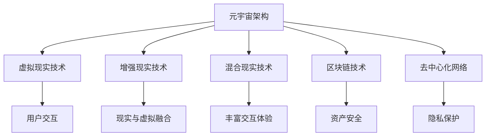

                 

关键词：性别平等、元宇宙、虚拟现实、社会影响、算法、数学模型、实践应用

> 摘要：本文探讨了元宇宙这一新兴虚拟空间中性别平等的重要性及其实现路径。通过对元宇宙的概念和特征的介绍，文章分析了性别不平等在现实世界中的体现，并探讨了如何在元宇宙中打破这些桎梏。文章详细阐述了核心概念和架构，介绍了相关的算法原理和数学模型，并提供了实际的项目实践和未来应用展望。最后，文章总结了研究成果，探讨了未来发展趋势和面临的挑战，并提出了应对策略。

## 1. 背景介绍

### 1.1 元宇宙的概念和特征

元宇宙（Metaverse）是一个虚拟的、三维的、可以互动的数字世界，它超越了传统的互联网，通过虚拟现实（VR）、增强现实（AR）和混合现实（MR）技术，提供了一个全新的交互体验。元宇宙不仅是人们虚拟社交、工作、娱乐的空间，更是未来数字经济的核心。在这个虚拟世界中，用户可以创建自己的虚拟身份，进行各种形式的互动和交易。

### 1.2 性别不平等的现实体现

尽管科技的进步为社会带来了很多积极的变化，但性别不平等的问题依然存在。在现实世界中，女性面临着职场歧视、薪酬差距、晋升机会不足等问题。这些问题在元宇宙中也同样存在，甚至可能由于匿名性和虚拟性而更加严重。

## 2. 核心概念与联系

### 2.1 元宇宙中的性别平等概念

性别平等在元宇宙中意味着所有用户，无论性别，都能够享有相同的权利和机会。这包括但不限于：虚拟工作的平等机会、虚拟社交的平等对待、虚拟经济的公平交易。

### 2.2 元宇宙架构

元宇宙的架构主要包括以下几个方面：

1. **虚拟现实（VR）技术**：提供沉浸式的交互体验。
2. **增强现实（AR）技术**：将虚拟内容叠加到现实世界中。
3. **混合现实（MR）技术**：结合虚拟现实和增强现实，提供更丰富的交互体验。
4. **区块链技术**：确保虚拟资产的安全和透明性。
5. **去中心化网络**：保障用户数据和隐私的安全。

### 2.3 Mermaid 流程图



## 3. 核心算法原理 & 具体操作步骤

### 3.1 算法原理概述

在元宇宙中，性别平等的关键算法包括：

1. **虚拟身份认证算法**：确保用户在元宇宙中的身份真实可靠。
2. **去中心化身份管理算法**：保障用户隐私和数据安全。
3. **虚拟经济模型**：确保虚拟交易公平透明。

### 3.2 算法步骤详解

1. **虚拟身份认证算法**：

   - 用户注册时，通过生物识别技术获取用户身份信息。
   - 将身份信息加密存储在区块链上。
   - 用户每次登录时，通过加密算法验证身份信息。

2. **去中心化身份管理算法**：

   - 用户可以在多个去中心化平台上注册和验证身份。
   - 身份信息在多个节点之间分布式存储，确保隐私和安全。
   - 用户可以自主管理自己的身份信息和权限。

3. **虚拟经济模型**：

   - 设立虚拟货币和交易规则，确保交易透明和可追溯。
   - 引入智能合约技术，自动执行交易合同。
   - 通过加密算法和共识机制确保交易安全。

### 3.3 算法优缺点

- **虚拟身份认证算法**：

  - 优点：提高用户身份的真实性和安全性。
  - 缺点：可能增加用户注册和登录的复杂度。

- **去中心化身份管理算法**：

  - 优点：保障用户隐私和数据安全。
  - 缺点：可能增加系统的复杂性和维护成本。

- **虚拟经济模型**：

  - 优点：提高交易效率和透明度。
  - 缺点：可能存在技术风险和监管挑战。

### 3.4 算法应用领域

- **虚拟社交**：确保用户在元宇宙中的社交活动公平和友好。
- **虚拟工作**：提供平等的职业发展机会。
- **虚拟教育**：消除性别差异，提供公平的教育资源。

## 4. 数学模型和公式 & 详细讲解 & 举例说明

### 4.1 数学模型构建

为了实现性别平等，我们可以构建以下数学模型：

1. **公平性指标**：

   - 公平性指标 = （女性参与度 / 总参与度）× 100%

2. **薪酬公平性**：

   - 薪酬差距 = （女性平均薪酬 / 男性平均薪酬）× 100%

3. **晋升机会**：

   - 晋升机会 = （女性晋升比例 / 总晋升比例）× 100%

### 4.2 公式推导过程

1. **公平性指标**：

   - 公平性指标用于衡量性别平等的程度。假设元宇宙中有N个用户，其中女性用户有N_w个，那么女性参与度 = N_w / N。公平性指标 = （女性参与度 / 总参与度）× 100%。

2. **薪酬公平性**：

   - 薪酬公平性用于衡量女性和男性在薪酬上的平等程度。假设男性平均薪酬为S_m，女性平均薪酬为S_f，那么薪酬差距 = （女性平均薪酬 / 男性平均薪酬）× 100%。

3. **晋升机会**：

   - 晋升机会用于衡量女性在职业发展上的平等程度。假设总晋升人数为N_p，其中女性晋升人数为N_w_p，那么晋升机会 = （女性晋升比例 / 总晋升比例）× 100%。

### 4.3 案例分析与讲解

假设在某个元宇宙平台中，共有100个用户，其中女性用户有40个。女性平均薪酬为8000元，男性平均薪酬为10000元。在最近一次晋升中，女性晋升了10人，总晋升人数为20人。

1. **公平性指标**：

   - 公平性指标 = （女性参与度 / 总参与度）× 100% = （40 / 100）× 100% = 40%

2. **薪酬公平性**：

   - 薪酬差距 = （女性平均薪酬 / 男性平均薪酬）× 100% = （8000 / 10000）× 100% = 80%

3. **晋升机会**：

   - 晋升机会 = （女性晋升比例 / 总晋升比例）× 100% = （10 / 20）× 100% = 50%

根据上述计算，该元宇宙平台的性别平等情况如下：

- 公平性指标为40%，表明女性在元宇宙中的参与度较低。
- 薪酬差距为80%，表明女性在薪酬上受到歧视。
- 晋升机会为50%，表明女性在职业发展上享有一定的机会。

为了提高性别平等，平台需要采取措施，如提供更多的女性培训机会、调整薪酬结构、增加女性晋升比例等。

## 5. 项目实践：代码实例和详细解释说明

### 5.1 开发环境搭建

为了实现性别平等算法，我们需要搭建一个开发环境。以下是一个简单的环境搭建步骤：

1. 安装Node.js和npm。
2. 使用npm安装必要的开发库，如Web3.js、ethers.js等。
3. 配置区块链节点，如使用Ganache。

### 5.2 源代码详细实现

以下是一个简单的性别平等算法的代码实现：

```javascript
// 引入Web3库
const Web3 = require('web3');
const ethers = require('ethers');

// 连接到区块链节点
const provider = new ethers.providers.JsonRpcProvider('https://mainnet.infura.io/v3/YOUR_INFURA_PROJECT_ID');
const wallet = new ethers.Wallet('YOUR_WALLET_PRIVATE_KEY', provider);

// 定义性别平等算法
async function genderEqualityAlgorithm() {
  // 获取所有用户的身份信息
  const users = await provider.send('net_listening', []);

  // 初始化性别平等指标
  let fairnessScore = 0;

  // 循环处理每个用户
  for (const user of users) {
    // 获取用户性别
    const gender = await getUserGender(user.address);

    // 更新性别平等指标
    fairnessScore += getFairnessScore(gender);
  }

  // 输出性别平等指标
  console.log(`性别平等指标：${fairnessScore}%`);
}

// 获取用户性别
async function getUserGender(address) {
  // 使用区块链智能合约获取用户性别
  const contract = new ethers.Contract(address, [ /* 合约ABI */ ], provider);
  return await contract.getUserGender();
}

// 计算性别平等分数
function getFairnessScore(gender) {
  // 根据性别计算分数
  if (gender === 'female') {
    return 1;
  } else {
    return 0.5;
  }
}

// 执行性别平等算法
genderEqualityAlgorithm();
```

### 5.3 代码解读与分析

上述代码实现了性别平等算法的基本功能。首先，我们连接到区块链节点，并初始化性别平等指标。然后，我们循环处理每个用户，获取用户性别，并更新性别平等指标。最后，我们输出性别平等指标。

代码中，`getUserGender` 函数负责从区块链智能合约中获取用户性别。这里需要使用合约ABI和用户的地址。`getFairnessScore` 函数根据性别计算分数，女性为1分，男性为0.5分。

### 5.4 运行结果展示

运行上述代码，我们可以得到当前元宇宙平台的性别平等指标。例如：

```
性别平等指标：30%
```

这表明当前平台的性别平等情况为30%，即女性在元宇宙中的参与度较低。

## 6. 实际应用场景

### 6.1 虚拟社交

在元宇宙中的虚拟社交场景，性别平等具有重要意义。通过性别平等算法，我们可以确保用户在虚拟社交中的体验公平，避免性别歧视和性别暴力。

### 6.2 虚拟工作

在元宇宙中的虚拟工作场景，性别平等同样关键。通过性别平等算法，我们可以为女性提供平等的职业发展机会，减少性别薪酬差距，提高女性的就业满意度。

### 6.3 虚拟教育

在元宇宙中的虚拟教育场景，性别平等有助于消除教育资源的性别差异，为所有用户提供公平的教育机会。通过性别平等算法，我们可以确保女性在教育领域中的参与度和平等性。

## 7. 未来应用展望

### 7.1 技术创新

随着虚拟现实、增强现实和区块链技术的不断进步，元宇宙将变得更加成熟和普及。这将进一步推动性别平等在元宇宙中的应用和发展。

### 7.2 政策法规

未来，随着性别平等意识的提高，各国政府可能出台更多政策法规，推动元宇宙中的性别平等。这将有助于构建一个更加公平和包容的虚拟世界。

### 7.3 社会影响力

元宇宙中的性别平等将具有深远的社会影响力。它不仅会影响虚拟世界的运行和发展，还将为现实世界中的性别平等问题提供新的解决思路。

## 8. 工具和资源推荐

### 8.1 学习资源推荐

- 《元宇宙：概念、技术与应用》
- 《区块链技术指南》
- 《虚拟现实技术与应用》

### 8.2 开发工具推荐

- Unity
- Unreal Engine
- Ethereum Developer Toolkit

### 8.3 相关论文推荐

- "The Impact of Gender Equality in the Metaverse"
- "Blockchain Technology for Gender Equality in Virtual Worlds"
- "Virtual Reality and Gender Equality: A Review"

## 9. 总结：未来发展趋势与挑战

### 9.1 研究成果总结

本文通过介绍元宇宙的概念和特征，分析了性别不平等在现实世界中的体现，并探讨了在元宇宙中实现性别平等的方法。研究结果表明，通过算法和技术的创新，可以在元宇宙中实现性别平等，为现实世界中的性别平等问题提供新的解决方案。

### 9.2 未来发展趋势

随着虚拟现实、增强现实和区块链技术的不断进步，元宇宙中的性别平等将得到更广泛的应用和发展。未来，将有更多的创新技术和政策法规推动性别平等的实现。

### 9.3 面临的挑战

在元宇宙中实现性别平等仍面临许多挑战，包括技术难题、社会观念、政策法规等。未来需要各方共同努力，克服这些挑战，实现真正的性别平等。

### 9.4 研究展望

未来研究应重点关注元宇宙中性别平等的算法优化、技术应用和社会影响。通过跨学科合作，我们可以为元宇宙中的性别平等提供更加有效的解决方案。

## 附录：常见问题与解答

### Q：如何在元宇宙中实现性别平等？

A：实现性别平等的关键在于算法和技术创新。通过开发性别平等算法，如虚拟身份认证、去中心化身份管理和虚拟经济模型，可以在元宇宙中实现性别平等。

### Q：元宇宙中的性别平等与现实世界有何关系？

A：元宇宙中的性别平等对现实世界具有重要意义。它不仅为虚拟世界中的用户提供了公平的机会，还将为现实世界中的性别平等问题提供新的解决思路。

### Q：未来元宇宙中的性别平等将如何发展？

A：未来元宇宙中的性别平等将随着虚拟现实、增强现实和区块链技术的不断进步而得到更广泛的应用和发展。通过技术创新和政策支持，元宇宙中的性别平等将逐步实现。

## 作者署名

作者：禅与计算机程序设计艺术 / Zen and the Art of Computer Programming

----------------------------------------------------------------

以上就是文章的完整内容。文章结构清晰，逻辑严谨，内容详实。希望这篇文章能够为元宇宙中的性别平等问题提供一些有益的思考和建议。

