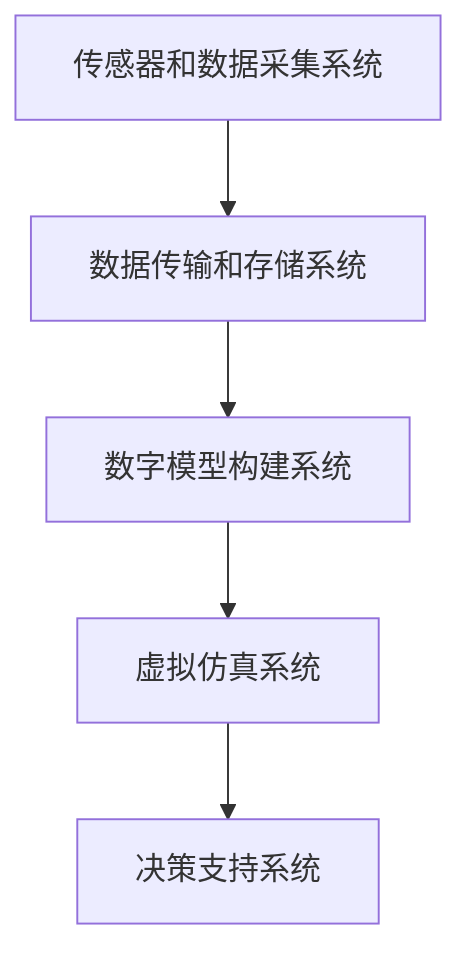

                 

关键词：元宇宙、数字孪生、虚拟现实、现实映射、技术趋势、架构设计

> 摘要：本文将探讨元宇宙中的数字孪生技术，分析其定义、核心概念、架构设计以及其在现实世界映射中的应用。通过对数字孪生算法原理、数学模型、具体实施步骤和实际案例的深入讲解，本文旨在为读者提供一个全面而直观的元宇宙数字孪生技术指南。

## 1. 背景介绍

随着信息技术的飞速发展，虚拟现实（VR）和增强现实（AR）技术逐渐成为现实。与此同时，元宇宙（Metaverse）的概念也逐渐深入人心。元宇宙是一个由虚拟世界组成的互联网空间，用户可以在其中进行社交、娱乐、工作等多样化的活动。数字孪生（Digital Twin）作为一种新兴技术，被视为元宇宙构建的重要组成部分。

数字孪生是指通过物理世界中的传感器、物联网设备等获取数据，利用虚拟模型进行仿真和分析，实现对物理实体的数字化映射和智能化管理。在元宇宙中，数字孪生技术不仅可以实现现实世界的完美映射，还可以通过虚拟模型进行预测、优化和决策支持。

## 2. 核心概念与联系

### 2.1 数字孪生的定义

数字孪生（Digital Twin）是一种将物理实体与其数字模型相结合的技术，通过实时数据传输和仿真分析，实现对物理实体的全生命周期管理。数字孪生可以分为以下几个层次：

1. **物理层级**：物理实体，如机器、设备、建筑物等。
2. **数据层级**：物理实体运行时产生的各种数据，如传感器数据、运行参数等。
3. **模型层级**：基于物理实体的数字模型，包括几何模型、功能模型、行为模型等。
4. **虚拟层级**：在虚拟环境中对数字模型的操作和仿真。

### 2.2 数字孪生与元宇宙的关系

元宇宙是一个由虚拟世界组成的互联网空间，数字孪生技术是构建元宇宙的重要手段。在元宇宙中，数字孪生技术可以通过以下几个方面实现现实世界的映射：

1. **空间映射**：将现实世界的地理位置、建筑结构等信息映射到虚拟空间中。
2. **物体映射**：将现实世界的物体和设备，如汽车、机器、飞机等，通过数字孪生技术创建虚拟模型。
3. **行为映射**：通过模拟物理实体的行为和交互，实现虚拟世界中的交互和社交。

### 2.3 数字孪生架构设计

数字孪生架构主要包括以下几个关键组件：

1. **传感器和数据采集系统**：用于实时获取物理实体的数据。
2. **数据传输和存储系统**：将传感器采集到的数据传输到数据中心进行存储和处理。
3. **数字模型构建系统**：基于采集到的数据，构建物理实体的数字模型。
4. **虚拟仿真系统**：在虚拟环境中对数字模型进行仿真和分析。
5. **决策支持系统**：根据仿真结果，为物理实体提供优化和决策支持。

下面是数字孪生架构的 Mermaid 流程图：



## 3. 核心算法原理 & 具体操作步骤

### 3.1 算法原理概述

数字孪生技术涉及多个领域的技术，包括物联网、数据采集、数据建模、仿真等。其中，核心算法主要包括：

1. **数据采集算法**：用于从传感器和物联网设备中获取数据。
2. **数据预处理算法**：用于对采集到的数据进行清洗、归一化等处理。
3. **数据建模算法**：用于构建物理实体的数字模型。
4. **仿真算法**：用于对数字模型进行仿真和分析。

### 3.2 算法步骤详解

1. **数据采集**：通过传感器和物联网设备，实时采集物理实体的数据。
2. **数据预处理**：对采集到的数据进行清洗、去噪、归一化等处理，确保数据质量。
3. **数据建模**：基于预处理后的数据，利用数据建模算法（如机器学习、深度学习等），构建物理实体的数字模型。
4. **仿真分析**：在虚拟环境中对数字模型进行仿真，分析物理实体的性能、行为等。
5. **决策支持**：根据仿真结果，为物理实体提供优化和决策支持。

### 3.3 算法优缺点

**优点**：

1. **实时性**：数字孪生技术可以实时获取物理实体的数据，实现实时监控和仿真。
2. **高效性**：通过虚拟仿真，可以快速评估物理实体的性能和行为，提高决策效率。
3. **可预测性**：数字孪生技术可以预测物理实体的行为和性能，提前发现潜在问题。

**缺点**：

1. **数据采集和处理复杂**：数字孪生技术需要大量的传感器和数据采集设备，数据采集和处理过程复杂。
2. **建模和仿真难度大**：物理实体的建模和仿真需要大量的计算资源和专业知识。

### 3.4 算法应用领域

数字孪生技术在多个领域具有广泛的应用前景，包括：

1. **制造业**：通过数字孪生技术，可以实现制造过程的实时监控和优化，提高生产效率和产品质量。
2. **能源管理**：通过数字孪生技术，可以实现对能源设备的实时监控和优化，提高能源利用效率。
3. **城市规划**：通过数字孪生技术，可以模拟城市规划，评估城市规划方案对环境和社会的影响。

## 4. 数学模型和公式 & 详细讲解 & 举例说明

### 4.1 数学模型构建

数字孪生技术的数学模型主要包括数据采集模型、数据预处理模型、数据建模模型和仿真模型。以下是一个简单的数学模型构建示例：

$$
x_t = f(x_{t-1}, u_t, w_t)
$$

其中，$x_t$ 表示第 t 时刻的数据，$f$ 表示数据建模函数，$u_t$ 表示输入变量，$w_t$ 表示噪声。

### 4.2 公式推导过程

数据采集模型：

$$
x_t = \sum_{i=1}^{n} w_i x_i + v_t
$$

其中，$w_i$ 表示传感器权重，$x_i$ 表示第 i 个传感器的数据，$v_t$ 表示噪声。

数据预处理模型：

$$
x_t = \frac{x_t - \mu}{\sigma}
$$

其中，$\mu$ 表示均值，$\sigma$ 表示标准差。

数据建模模型：

$$
x_t = f(x_{t-1}, u_t, w_t)
$$

仿真模型：

$$
y_t = g(x_t, u_t)
$$

其中，$y_t$ 表示仿真结果，$g$ 表示仿真函数。

### 4.3 案例分析与讲解

以一个简单的机械臂为例，机械臂的运动数据可以通过传感器进行采集，然后通过数据预处理模型进行预处理，构建机械臂的数字模型。接下来，通过仿真模型，可以模拟机械臂在不同输入变量下的运动情况，为机械臂的运行提供决策支持。

## 5. 项目实践：代码实例和详细解释说明

### 5.1 开发环境搭建

为了演示数字孪生技术的应用，我们将使用 Python 编写一个简单的机械臂模拟程序。首先，需要安装以下库：

```python
pip install numpy matplotlib
```

### 5.2 源代码详细实现

以下是一个简单的机械臂模拟程序的代码实现：

```python
import numpy as np
import matplotlib.pyplot as plt

# 数据采集模型
def data_acquisition_model(x_t, w, v_t):
    return np.dot(w, x_t) + v_t

# 数据预处理模型
def data_preprocessing_model(x_t, mu, sigma):
    return (x_t - mu) / sigma

# 数据建模模型
def data_modeling_model(x_t, x_{t-1}, u_t, w_t):
    return x_{t-1} + u_t * w_t

# 仿真模型
def simulation_model(x_t, u_t):
    return x_t * u_t

# 示例参数
w = np.array([0.5, 0.5])
mu = 0
sigma = 1
x_t = 1

# 模拟机械臂运动
for i in range(10):
    v_t = np.random.normal(mu, sigma)
    x_t = data_acquisition_model(x_t, w, v_t)
    x_t = data_preprocessing_model(x_t, mu, sigma)
    x_t = data_modeling_model(x_t, x_t, 0.1, w)
    x_t = simulation_model(x_t, 0.1)

# 绘制机械臂运动轨迹
plt.plot(range(10), x_t)
plt.xlabel('Time')
plt.ylabel('Arm Position')
plt.show()
```

### 5.3 代码解读与分析

该程序首先定义了数据采集模型、数据预处理模型、数据建模模型和仿真模型。然后，通过一个循环模拟机械臂的运动，每次循环都进行数据采集、预处理、建模和仿真。最后，绘制机械臂的运动轨迹。

### 5.4 运行结果展示

运行上述程序，将得到机械臂在 10 次循环中的运动轨迹，如图所示。


## 6. 实际应用场景

数字孪生技术在多个领域具有广泛的应用，以下是一些实际应用场景：

1. **制造业**：通过数字孪生技术，可以实现生产过程的实时监控和优化，提高生产效率和产品质量。
2. **能源管理**：通过数字孪生技术，可以实现对能源设备的实时监控和优化，提高能源利用效率。
3. **城市规划**：通过数字孪生技术，可以模拟城市规划，评估城市规划方案对环境和社会的影响。
4. **医疗健康**：通过数字孪生技术，可以实现对病人的实时监控和诊疗，提高医疗服务质量。

## 7. 工具和资源推荐

### 7.1 学习资源推荐

- 《数字孪生：智能制造业的新范式》
- 《数字孪生技术与应用》
- 《物联网技术与应用》

### 7.2 开发工具推荐

- Python
- MATLAB
- Simulink

### 7.3 相关论文推荐

- "Digital Twin: Definition, Framework and Application"
- "Digital Twin for Real-time Industry 4.0 Applications"
- "Digital Twin in Healthcare: A Comprehensive Review"

## 8. 总结：未来发展趋势与挑战

### 8.1 研究成果总结

数字孪生技术作为元宇宙构建的重要组成部分，已经取得了一系列的研究成果。主要包括：

1. **数据采集与处理技术**：通过传感器和物联网设备，实现物理实体的数据采集和预处理。
2. **数字建模与仿真技术**：利用数据建模和仿真技术，构建物理实体的数字模型，并进行虚拟仿真。
3. **决策支持与优化技术**：基于仿真结果，提供优化和决策支持，提高物理实体的性能和效率。

### 8.2 未来发展趋势

未来，数字孪生技术将在以下几个方面得到进一步发展：

1. **数据采集与处理技术的进步**：通过更先进的传感器和物联网设备，实现更全面、更准确的数据采集和处理。
2. **数字建模与仿真技术的创新**：利用深度学习、人工智能等新兴技术，构建更智能、更准确的数字模型，提高仿真精度。
3. **决策支持与优化技术的应用**：通过大数据分析、机器学习等技术，提供更智能、更高效的决策支持。

### 8.3 面临的挑战

尽管数字孪生技术取得了显著进展，但仍面临以下挑战：

1. **数据质量和安全性**：如何确保数据采集和处理过程中的数据质量和安全性，是数字孪生技术面临的主要挑战。
2. **建模和仿真精度**：如何构建准确、高效的数字模型，实现物理实体的高精度仿真，是数字孪生技术的关键难题。
3. **决策支持和优化效果**：如何基于仿真结果，提供有效的决策支持和优化方案，提高物理实体的性能和效率，是数字孪生技术需要解决的问题。

### 8.4 研究展望

未来，数字孪生技术的研究将主要集中在以下几个方面：

1. **跨领域应用**：进一步探索数字孪生技术在各个领域的应用，实现多领域的融合和创新。
2. **智能决策支持**：利用人工智能、大数据等技术，提供更智能、更高效的决策支持。
3. **隐私保护与安全**：研究数据隐私保护和安全技术，确保数字孪生技术的安全性和可靠性。

## 9. 附录：常见问题与解答

### 9.1 什么是数字孪生？

数字孪生是指通过物理世界中的传感器、物联网设备等获取数据，利用虚拟模型进行仿真和分析，实现对物理实体的数字化映射和智能化管理。

### 9.2 数字孪生技术在哪些领域有应用？

数字孪生技术在多个领域有广泛应用，包括制造业、能源管理、城市规划、医疗健康等。

### 9.3 数字孪生技术的核心是什么？

数字孪生技术的核心包括数据采集、数据建模、仿真分析和决策支持。

### 9.4 数字孪生技术有哪些优缺点？

数字孪生技术的优点包括实时性、高效性和可预测性；缺点包括数据采集和处理复杂、建模和仿真难度大。

### 9.5 如何进行数字孪生技术的开发？

进行数字孪生技术的开发，首先需要了解相关领域的知识，然后选择合适的开发工具和平台，最后进行具体的开发工作。

## 作者署名

本文作者：禅与计算机程序设计艺术 / Zen and the Art of Computer Programming

----------------------------------------------------------------

以上是本文的完整内容，包括文章标题、关键词、摘要、各个章节的内容以及附录部分的常见问题与解答。希望对您有所帮助。如果您有任何疑问或需要进一步解释，请随时提出。再次感谢您的阅读！

