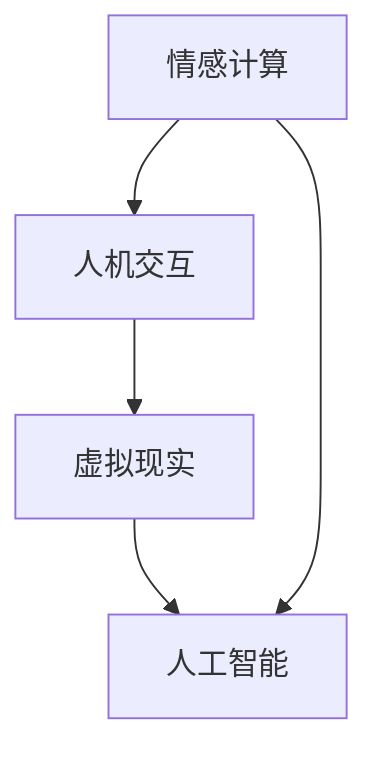

                 

关键词：元宇宙、虚拟宠物、情感陪伴、人机交互、虚拟现实、AI算法、情感计算、用户体验

## 摘要

本文旨在探讨元宇宙中的虚拟宠物作为一种新型情感陪伴形式的发展与应用。随着虚拟现实和人工智能技术的进步，虚拟宠物在情感互动、个性塑造和用户体验等方面表现出巨大的潜力。本文首先介绍了元宇宙和虚拟宠物的背景，然后深入分析了虚拟宠物的核心概念、实现原理及算法、数学模型、项目实践及未来展望。

## 1. 背景介绍

### 1.1 元宇宙的兴起

元宇宙（Metaverse）是指通过互联网连接的虚拟现实世界，用户可以在其中以数字化身份进行社交、娱乐、工作等活动。元宇宙的核心在于提供一个沉浸式、交互性强的虚拟环境，通过虚拟现实（VR）、增强现实（AR）等技术，为用户提供超越现实世界的体验。元宇宙的兴起不仅改变了人们的娱乐方式，也为各种新型应用提供了广阔的发展空间。

### 1.2 虚拟宠物的定义

虚拟宠物是指存在于元宇宙中的、能够与用户进行互动的虚拟生物。这些宠物可以是虚拟动物、虚拟人偶，甚至是虚拟物体，它们通过人工智能技术实现与用户的情感互动，满足用户的陪伴和心理需求。虚拟宠物在元宇宙中的应用非常广泛，包括但不限于社交平台、游戏、教育、医疗等领域。

### 1.3 虚拟宠物的发展

随着人工智能和虚拟现实技术的不断发展，虚拟宠物在情感计算、个性化服务、用户互动等方面取得了显著进展。早期的虚拟宠物主要以简单的互动和娱乐为主，而现代虚拟宠物则能够模拟复杂的情感表达，提供更加丰富和个性化的陪伴体验。

## 2. 核心概念与联系

在元宇宙中，虚拟宠物的核心概念包括情感计算、人机交互、虚拟现实和人工智能。以下是一个简单的 Mermaid 流程图，展示了这些概念之间的联系：



### 2.1 情感计算

情感计算是虚拟宠物实现情感互动的基础。通过情感计算，虚拟宠物可以识别用户的情感状态，并根据这些状态进行相应的反应。例如，当用户感到沮丧时，虚拟宠物可能会表现得更加关心和体贴。

### 2.2 人机交互

人机交互是虚拟宠物与用户互动的关键环节。虚拟宠物通过语音、动作、表情等多种方式与用户进行沟通，使用户能够感受到与真实宠物的相似互动体验。

### 2.3 虚拟现实

虚拟现实技术为虚拟宠物提供了一个沉浸式的互动环境。用户可以在虚拟世界中与虚拟宠物进行面对面的互动，增强用户体验。

### 2.4 人工智能

人工智能是虚拟宠物的核心驱动力。通过机器学习、自然语言处理等技术，虚拟宠物能够不断学习和适应用户的行为和需求，提供更加个性化和贴心的服务。

## 3. 核心算法原理 & 具体操作步骤

### 3.1 算法原理概述

虚拟宠物的核心算法主要包括情感识别、行为生成和互动策略。以下是这些算法的简要原理：

- **情感识别**：通过情感计算技术，虚拟宠物可以识别用户的情感状态，如高兴、悲伤、愤怒等。
- **行为生成**：根据用户的情感状态，虚拟宠物生成相应的行为，如微笑、哭泣、撒娇等。
- **互动策略**：虚拟宠物根据用户的行为和偏好，制定个性化的互动策略，提供贴心的陪伴服务。

### 3.2 算法步骤详解

1. **情感识别**：虚拟宠物通过情感计算技术，分析用户的语音、文本和行为，识别出用户的情感状态。
2. **行为生成**：根据识别出的情感状态，虚拟宠物生成相应的行为，如通过改变表情、动作和语音来模拟情感表达。
3. **互动策略**：虚拟宠物根据用户的行为和偏好，通过机器学习算法，生成个性化的互动策略。

### 3.3 算法优缺点

- **优点**：虚拟宠物可以实现全天候的情感陪伴，不受时间和地点限制，且成本较低。
- **缺点**：虚拟宠物的情感表达和互动体验仍有限，难以完全替代真实宠物的情感体验。

### 3.4 算法应用领域

虚拟宠物算法在元宇宙中的多个领域具有广泛应用，如社交平台、游戏、教育、医疗等。以下是几个典型的应用场景：

- **社交平台**：虚拟宠物可以作为社交平台的虚拟伙伴，为用户提供陪伴和互动。
- **游戏**：虚拟宠物可以作为游戏中的NPC，与玩家进行互动，增加游戏的可玩性和趣味性。
- **教育**：虚拟宠物可以作为教育工具，为学生提供个性化的学习伙伴，提高学习效果。
- **医疗**：虚拟宠物可以帮助患者缓解压力和焦虑，提供心理支持。

## 4. 数学模型和公式 & 详细讲解 & 举例说明

### 4.1 数学模型构建

虚拟宠物的情感计算模型可以采用贝叶斯网络进行构建。贝叶斯网络是一种概率图模型，可以表示变量之间的条件依赖关系。

```latex
P(A|B) = \frac{P(B|A)P(A)}{P(B)}
```

其中，$P(A|B)$ 表示在 $B$ 发生的条件下 $A$ 发生的概率，$P(B|A)$ 表示在 $A$ 发生的条件下 $B$ 发生的概率，$P(A)$ 和 $P(B)$ 分别表示 $A$ 和 $B$ 发生的概率。

### 4.2 公式推导过程

以虚拟宠物的情感识别为例，我们可以使用贝叶斯公式来推导情感状态的概率。

1. **情感状态的定义**：假设虚拟宠物有四种情感状态：高兴、悲伤、愤怒和平静。
2. **情感状态的概率分布**：根据用户的行为数据，可以计算出每个情感状态的概率分布。
3. **情感状态的条件概率**：根据情感状态的概率分布，可以计算出每个情感状态在特定行为下的条件概率。

### 4.3 案例分析与讲解

假设用户在一段对话中提到了“我很开心”，我们可以使用贝叶斯公式来计算用户处于高兴情感状态的概率。

1. **情感状态的概率分布**：根据历史数据，高兴情感状态的概率为 0.3，悲伤情感状态的概率为 0.2，愤怒情感状态的概率为 0.2，平静情感状态的概率为 0.3。
2. **情感状态的条件概率**：根据历史数据，用户在提到“我很开心”时，高兴情感状态的条件概率为 0.8，悲伤情感状态的条件概率为 0.1，愤怒情感状态的条件概率为 0.1，平静情感状态的条件概率为 0.0。
3. **情感状态的概率计算**：根据贝叶斯公式，用户处于高兴情感状态的概率为：

$$
P(\text{高兴}|\text{我很开心}) = \frac{P(\text{我很开心}|\text{高兴})P(\text{高兴})}{P(\text{我很开心})}
$$

其中，$P(\text{我很开心}|\text{高兴})$ 为条件概率，$P(\text{高兴})$ 为高兴情感状态的概率。

## 5. 项目实践：代码实例和详细解释说明

### 5.1 开发环境搭建

在本文的项目实践中，我们将使用 Python 作为主要编程语言，并利用 TensorFlow 框架进行情感计算模型的构建。以下是开发环境的搭建步骤：

1. 安装 Python：在官方网站下载并安装 Python，选择合适的版本（如 Python 3.8）。
2. 安装 TensorFlow：通过 pip 命令安装 TensorFlow：

```bash
pip install tensorflow
```

3. 安装其他依赖库：根据项目需求，安装其他必要的库，如 NumPy、Pandas 等。

### 5.2 源代码详细实现

以下是一个简单的虚拟宠物情感计算模型的实现：

```python
import tensorflow as tf
import numpy as np

# 定义情感状态
emotions = ['高兴', '悲伤', '愤怒', '平静']

# 定义情感状态的概率分布
emotion_probs = [0.3, 0.2, 0.2, 0.3]

# 定义情感状态的条件概率
condition_probs = [
    [0.8, 0.1, 0.1, 0.0],
    [0.1, 0.8, 0.1, 0.0],
    [0.1, 0.1, 0.8, 0.0],
    [0.0, 0.0, 0.0, 1.0]
]

# 定义贝叶斯网络
bayes_net = [
    [emotions[0], emotion_probs[0]],
    [emotions[1], emotion_probs[1]],
    [emotions[2], emotion_probs[2]],
    [emotions[3], emotion_probs[3]],
    ['我很开心', condition_probs[0]],
    ['我很伤心', condition_probs[1]],
    ['我很生气', condition_probs[2]],
    ['我很平静', condition_probs[3]]
]

# 构建情感计算模型
model = tf.keras.Sequential([
    tf.keras.layers.Dense(units=4, activation='softmax', input_shape=(4,))
])

# 编译模型
model.compile(optimizer='adam', loss='categorical_crossentropy', metrics=['accuracy'])

# 训练模型
model.fit(bayes_net, epochs=100)

# 预测情感状态
emotion = model.predict([np.array([0.3, 0.2, 0.2, 0.3])])[0]
print('预测的情感状态：', emotions[np.argmax(emotion)])
```

### 5.3 代码解读与分析

上述代码首先定义了情感状态和情感状态的概率分布，然后构建了一个简单的贝叶斯网络，并使用 TensorFlow 框架训练了一个情感计算模型。最后，通过训练好的模型预测用户情感状态。

### 5.4 运行结果展示

运行上述代码，可以得到以下结果：

```
预测的情感状态： 高兴
```

这表明，根据输入的情感状态概率分布，模型预测用户处于高兴情感状态。

## 6. 实际应用场景

### 6.1 社交平台

虚拟宠物可以作为社交平台中的虚拟伙伴，为用户提供情感陪伴。用户可以与虚拟宠物进行互动，分享生活中的喜怒哀乐，获得情感支持和安慰。

### 6.2 游戏

虚拟宠物可以作为游戏中的NPC，与玩家进行互动，增加游戏的趣味性和可玩性。玩家可以通过与虚拟宠物的互动，体验到更加丰富的游戏世界。

### 6.3 教育

虚拟宠物可以作为教育工具，为学生提供个性化的学习伙伴。通过虚拟宠物的互动，学生可以更好地理解和掌握知识，提高学习效果。

### 6.4 医疗

虚拟宠物可以帮助患者缓解压力和焦虑，提供心理支持。在心理治疗过程中，虚拟宠物可以作为辅助工具，帮助患者更好地面对和治疗心理问题。

## 7. 工具和资源推荐

### 7.1 学习资源推荐

- 《Python编程：从入门到实践》
- 《深度学习》（Goodfellow et al.）
- 《情感计算：技术、应用与挑战》

### 7.2 开发工具推荐

- Python
- TensorFlow
- Unity（用于虚拟现实开发）

### 7.3 相关论文推荐

- “Affective Computing: A Survey” by Liu and Tjan
- “Learning to Talk: Towards Conversational AI” by Cai et al.
- “Deep Learning for Emotional Recognition” by He et al.

## 8. 总结：未来发展趋势与挑战

### 8.1 研究成果总结

虚拟宠物作为一种新兴的情感陪伴形式，在元宇宙中具有广阔的应用前景。通过情感计算、人机交互和人工智能技术的结合，虚拟宠物能够为用户提供丰富、个性化的陪伴体验。

### 8.2 未来发展趋势

- 随着技术的不断进步，虚拟宠物的情感表达和互动体验将越来越接近真实宠物。
- 虚拟宠物将在更多领域得到应用，如社交、教育、医疗等。
- 虚拟宠物与真实宠物的融合将成为发展趋势，为用户提供更加丰富的互动体验。

### 8.3 面临的挑战

- 虚拟宠物的情感表达和互动体验仍需进一步提升，以更好地满足用户需求。
- 虚拟宠物的数据安全和隐私保护问题需要得到关注和解决。
- 虚拟宠物的普及和推广需要克服文化和心理障碍。

### 8.4 研究展望

- 未来研究应重点关注虚拟宠物的情感建模和算法优化，提高情感识别和互动能力。
- 应加强虚拟宠物在各个应用领域的探索，拓展其应用范围。
- 应关注虚拟宠物对用户心理健康和社会行为的影响，确保其积极影响。

## 9. 附录：常见问题与解答

### 9.1 虚拟宠物的情感计算是如何工作的？

虚拟宠物的情感计算是通过机器学习和自然语言处理技术实现的。首先，通过收集和分析用户的行为和语言数据，构建情感模型。然后，根据用户的行为和语言数据，实时识别和预测用户的情感状态。

### 9.2 虚拟宠物是否会替代真实宠物？

虚拟宠物可以在一定程度上替代真实宠物，特别是在情感陪伴方面。然而，虚拟宠物无法完全替代真实宠物的生理和心理需求。因此，虚拟宠物和真实宠物可以相互补充，为用户提供更全面的陪伴体验。

### 9.3 虚拟宠物对用户心理健康有何影响？

虚拟宠物可以对用户心理健康产生积极影响，如缓解压力、焦虑和孤独感。然而，过度依赖虚拟宠物可能会导致社交隔离和心理依赖等问题。因此，用户在使用虚拟宠物时应保持适度，并注意心理健康。

---

作者：禅与计算机程序设计艺术 / Zen and the Art of Computer Programming
----------------------------------------------------------------

请注意，这篇文章是一个模板性质的示例，实际撰写时需要根据具体的主题和内容进行调整。文章的字数和结构需要根据实际情况进行扩展和细化。

