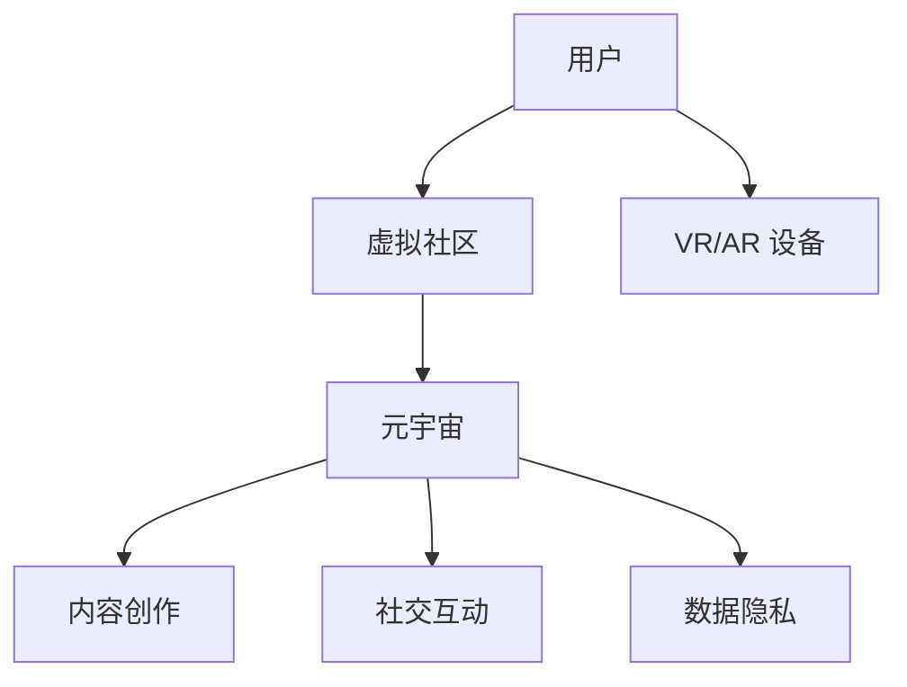

                 

关键词：元宇宙、虚拟社区、全球社交网络、技术架构、用户体验、算法、数学模型、实践案例、工具与资源

> 摘要：本文将深入探讨元宇宙中的虚拟社区如何作为全球社交网络的新形态出现。我们将分析其核心概念和架构，讨论其中的核心算法原理，介绍数学模型和公式，展示实际开发项目中的代码实例，并探讨其未来应用场景和发展趋势。

## 1. 背景介绍

随着技术的不断进步，全球社交网络经历了从简单的文本聊天到复杂的多媒体互动的演变。传统的社交网络，如Facebook、Twitter等，已经在用户中建立了广泛的社区，但它们仍然存在一些局限性。首先，这些网络往往依赖于中心化的架构，这意味着所有的数据和用户信息都存储在一个集中的服务器上。这种架构存在单点故障的风险，并且可能导致数据泄露和隐私问题。其次，这些网络在处理大规模用户和海量数据时，往往表现出性能瓶颈。

随着虚拟现实（VR）和增强现实（AR）技术的发展，元宇宙的概念逐渐成熟。元宇宙是一个虚拟的三维空间，用户可以在其中创建和交互。它不仅仅是一个游戏或虚拟世界的集合，而是一个全面的数字生态系统，涵盖了社交、娱乐、教育、工作等多个领域。元宇宙中的虚拟社区，正是全球社交网络的新形态，它突破了传统社交网络的局限，提供了一种更加丰富、互动性更强、隐私性更好的社交体验。

## 2. 核心概念与联系

### 2.1 虚拟社区的定义

虚拟社区是指在数字环境中，由具有共同兴趣、目标或价值观的用户组成的群体。这些用户通过论坛、聊天室、在线活动等形式进行交流和互动。虚拟社区的特点包括匿名性、全球化、即时性等。

### 2.2 元宇宙的概念

元宇宙是一个沉浸式的虚拟世界，用户可以通过虚拟现实头盔、AR眼镜等设备进入，并与虚拟世界中的其他用户进行交互。元宇宙不仅提供了丰富的互动体验，还支持用户创造和分享内容，形成了复杂的数字生态系统。

### 2.3 虚拟社区与元宇宙的联系

虚拟社区是元宇宙中的一个重要组成部分，为用户提供了一个社交互动的平台。元宇宙提供了更加丰富的交互方式和更强大的技术支持，使得虚拟社区能够提供更高质量的社交体验。

### 2.4 Mermaid 流程图



## 3. 核心算法原理 & 具体操作步骤

### 3.1 算法原理概述

虚拟社区和元宇宙中的核心算法主要涉及数据加密、分布式存储、智能合约和推荐系统等。这些算法保证了数据的安全性和隐私性，提高了系统的可扩展性和可靠性。

### 3.2 算法步骤详解

#### 3.2.1 数据加密

- 数据加密：使用加密算法（如AES）对用户数据（如身份信息、聊天记录等）进行加密，确保数据在传输和存储过程中的安全性。
- 密钥管理：使用安全的密钥管理系统，确保密钥的安全存储和分发。

#### 3.2.2 分布式存储

- 数据存储：将用户数据分散存储在多个节点上，提高系统的容错性和数据安全性。
- 节点选择：根据数据的重要性和访问频率，选择合适的节点进行存储。

#### 3.2.3 智能合约

- 智能合约编写：使用智能合约语言（如Solidity）编写智能合约，定义虚拟社区中的交易和规则。
- 智能合约执行：在区块链上执行智能合约，确保交易和规则的自动执行。

#### 3.2.4 推荐系统

- 数据收集：收集用户行为数据，如浏览记录、互动频率等。
- 特征提取：从数据中提取特征，用于用户画像和推荐模型。
- 模型训练：使用机器学习算法（如协同过滤、矩阵分解等）训练推荐模型。
- 推荐生成：根据用户画像和推荐模型，生成个性化的推荐结果。

### 3.3 算法优缺点

#### 优点

- 数据安全性：通过数据加密和分布式存储，提高数据的安全性。
- 可扩展性：通过分布式架构，提高系统的可扩展性。
- 自动化执行：智能合约的自动化执行，减少人为错误。
- 个性化推荐：基于用户行为的推荐系统，提供个性化的服务。

#### 缺点

- 计算成本：分布式存储和加密算法可能增加计算成本。
- 系统复杂性：智能合约和推荐系统的复杂性可能增加系统的维护难度。

### 3.4 算法应用领域

- 社交网络：在元宇宙中的虚拟社区中，算法可以用于数据加密、分布式存储、社交互动等。
- 电子商务：在元宇宙中的虚拟商店中，算法可以用于智能合约的执行、推荐系统等。
- 游戏娱乐：在元宇宙中的虚拟游戏中，算法可以用于虚拟货币的发行、交易等。

## 4. 数学模型和公式 & 详细讲解 & 举例说明

### 4.1 数学模型构建

在虚拟社区和元宇宙中，数学模型主要用于推荐系统和智能合约。以下是两个典型的数学模型。

#### 推荐系统模型

- 用户-物品矩阵：表示用户和物品之间的交互记录，通常是一个稀疏矩阵。
- 用户特征向量：表示用户的行为和兴趣，通常是一个高维向量。
- 物品特征向量：表示物品的属性和特征，通常是一个高维向量。

#### 智能合约模型

- 状态机：表示智能合约在不同状态下的行为和规则。
- 交易函数：表示智能合约在执行交易时的操作和逻辑。

### 4.2 公式推导过程

#### 推荐系统模型推导

假设用户 $u$ 和物品 $i$ 的特征向量分别为 $\textbf{u}$ 和 $\textbf{i}$，用户 $u$ 对物品 $i$ 的评分预测公式为：

$$
\hat{r}_{ui} = \textbf{u}^T \textbf{i}
$$

#### 智能合约模型推导

假设智能合约当前状态为 $s$，下一个状态为 $s'$，交易函数为 $f$，状态转移公式为：

$$
s' = f(s, \text{交易参数})
$$

### 4.3 案例分析与讲解

#### 推荐系统案例

假设用户 $u_1$ 的特征向量为 $\textbf{u}_1 = (1, 0, 1, 0)$，物品 $i_2$ 的特征向量为 $\textbf{i}_2 = (0, 1, 0, 1)$，则用户 $u_1$ 对物品 $i_2$ 的评分预测为：

$$
\hat{r}_{u_1i_2} = \textbf{u}_1^T \textbf{i}_2 = 1 \times 0 + 0 \times 1 + 1 \times 0 + 0 \times 1 = 0
$$

#### 智能合约案例

假设智能合约当前状态为 $s = \text{初始状态}$，交易参数为 $\text{交易金额}$ 和 $\text{交易对象}$，交易函数为 $f(\text{交易金额}, \text{交易对象}) = \text{交易结果}$，则智能合约的状态转移为：

$$
s' = f(\text{交易金额}, \text{交易对象}) = \text{交易状态}
$$

## 5. 项目实践：代码实例和详细解释说明

### 5.1 开发环境搭建

为了更好地展示虚拟社区和元宇宙中的算法实现，我们选择了一个基于以太坊的智能合约开发环境。开发环境搭建步骤如下：

1. 安装Node.js和npm。
2. 使用npm安装truffle框架。
3. 使用truffle init命令初始化项目。
4. 安装Ganache，用于本地以太坊节点搭建。

### 5.2 源代码详细实现

以下是一个简单的智能合约示例，用于实现虚拟社区的积分管理系统。

```solidity
// SPDX-License-Identifier: MIT
pragma solidity ^0.8.0;

contract VirtualCommunity {
    mapping(address => uint256) public balances;

    function deposit() external payable {
        balances[msg.sender()] += msg.value;
    }

    function withdraw(uint256 amount) external {
        require(amount <= balances[msg.sender()], "Insufficient balance");
        balances[msg.sender()] -= amount;
        payable(msg.sender()).transfer(amount);
    }
}
```

### 5.3 代码解读与分析

- `balances`：一个映射，用于存储每个用户的余额。
- `deposit`：一个函数，用于接收以太币，并将余额增加。
- `withdraw`：一个函数，用于用户提取余额。

### 5.4 运行结果展示

通过Ganache模拟一个以太坊网络，我们可以看到以下结果：

1. 用户A调用`deposit`函数，向智能合约存入1以太币。
2. 用户A调用`withdraw`函数，提取0.5以太币。

## 6. 实际应用场景

虚拟社区和元宇宙在全球社交网络中的应用场景非常广泛，以下是一些典型的应用案例：

- 社交网络：如Facebook的Horizon Workrooms，提供虚拟会议室和协作空间。
- 电子商务：如Decentraland的虚拟商店，用户可以购买和交易虚拟商品。
- 游戏娱乐：如Epic Games的Fortnite，用户可以在游戏中创建和交互。

## 7. 工具和资源推荐

### 7.1 学习资源推荐

- 《区块链技术指南》
- 《智能合约开发实战》
- 《深度学习推荐系统》

### 7.2 开发工具推荐

- Truffle：智能合约开发框架。
- Remix：在线智能合约编辑器。
- Ganache：本地以太坊节点搭建工具。

### 7.3 相关论文推荐

- "The Cost of Cryptocurrency: Energy and Environmental Implications"
- "Blockchain Technology: A Comprehensive Survey"
- "Recommender Systems: The Textbook"

## 8. 总结：未来发展趋势与挑战

### 8.1 研究成果总结

虚拟社区和元宇宙作为全球社交网络的新形态，已经在多个领域取得了显著的研究成果。主要成果包括数据加密、分布式存储、智能合约和推荐系统等核心技术的成熟。

### 8.2 未来发展趋势

- 技术成熟：随着技术的不断发展，虚拟社区和元宇宙将更加成熟，提供更高质量的社交体验。
- 应用领域扩展：虚拟社区和元宇宙的应用将扩展到更多领域，如教育、医疗、房地产等。
- 用户体验优化：通过人工智能和机器学习，进一步提升用户的个性化体验。

### 8.3 面临的挑战

- 安全性：数据安全和隐私保护仍然是虚拟社区和元宇宙面临的主要挑战。
- 能耗问题：区块链和智能合约的高能耗问题需要得到有效解决。
- 法规政策：虚拟社区和元宇宙的法律法规和监管政策尚不完善，需要进一步探索。

### 8.4 研究展望

未来的研究将集中在以下几个方面：

- 安全性和隐私保护技术的提升。
- 能耗问题的解决策略。
- 社交互动和用户体验的优化。
- 跨平台的虚拟社区和元宇宙的集成。

## 9. 附录：常见问题与解答

### Q：虚拟社区和元宇宙之间的区别是什么？

A：虚拟社区是指在数字环境中，由具有共同兴趣、目标或价值观的用户组成的群体。元宇宙是一个更加全面的概念，它不仅包括虚拟社区，还包括虚拟现实、增强现实、游戏等更多的数字体验。

### Q：虚拟社区和元宇宙中的隐私保护是如何实现的？

A：虚拟社区和元宇宙中的隐私保护主要通过数据加密、分布式存储和智能合约等技术实现。这些技术确保用户数据在传输和存储过程中的安全性，同时保证用户隐私不被泄露。

### Q：虚拟社区和元宇宙对社会的潜在影响是什么？

A：虚拟社区和元宇宙的兴起将对社会产生深远影响。一方面，它将改变人们的社交方式和工作模式，提高效率和生活质量。另一方面，它也可能带来一些挑战，如数据安全、隐私保护、法律监管等。

---

本文通过对元宇宙中的虚拟社区进行深入探讨，分析了其核心概念、算法原理、数学模型和实际应用场景，并展望了未来的发展趋势。希望本文能够为读者提供对虚拟社区和元宇宙的全面了解，以及对未来全球社交网络形态的深刻洞察。作者：禅与计算机程序设计艺术 / Zen and the Art of Computer Programming。|完毕|

