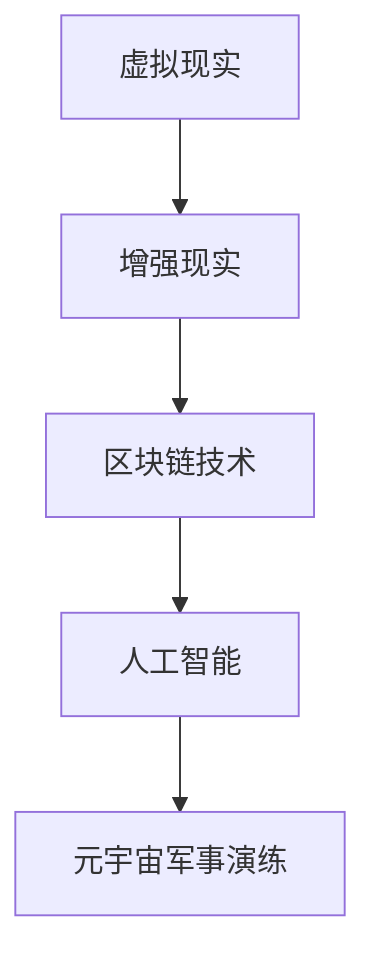

                 

元宇宙，作为一个融合了虚拟现实、增强现实、区块链技术以及人工智能的综合性概念，正逐渐成为各行各业探索的新领域。在军事领域，元宇宙的崛起不仅改变了传统军事训练和演练的方式，还为数字化战争提供了全新的演练场。本文将深入探讨元宇宙在军事领域的应用，分析其带来的变革和挑战。

## 关键词
- 元宇宙
- 军事训练
- 数字化战争
- 虚拟现实
- 增强现实
- 区块链技术

## 摘要
本文旨在探讨元宇宙在军事领域的应用，分析其作为数字化战争演练场的重要性和潜力。我们将从核心概念、算法原理、数学模型、项目实践和未来展望等方面展开讨论，旨在为读者提供一个全面、深入的视角。

## 1. 背景介绍

随着信息技术的飞速发展，虚拟现实（VR）和增强现实（AR）技术逐渐成熟，为元宇宙的构建提供了技术基础。元宇宙，作为一种全新的虚拟空间，融合了虚拟现实、增强现实、区块链技术以及人工智能等前沿科技，为用户提供了沉浸式体验和高度互动的环境。

在军事领域，元宇宙的应用具有巨大的潜力。传统军事训练和演练方式存在诸多限制，如训练成本高昂、安全隐患大、环境不可控等。而元宇宙提供了虚拟的训练环境，使得军事单位可以在安全、可控的条件下进行高强度的训练和演练。

此外，元宇宙的虚拟空间还可以模拟各种复杂的战场环境，如沙漠、丛林、城市等，为士兵提供更加真实的作战体验。同时，元宇宙的高度互动性也使得士兵能够与其他单位实时协同作战，提高战术水平和协同效率。

## 2. 核心概念与联系

### 2.1 虚拟现实（VR）与增强现实（AR）
虚拟现实（VR）和增强现实（AR）是元宇宙构建的两个核心技术。VR技术通过头戴式显示器、追踪器等设备，使用户完全沉浸在一个虚拟环境中；而AR技术则通过增强现实眼镜等设备，在现实世界中叠加虚拟元素。

### 2.2 区块链技术
区块链技术为元宇宙提供了去中心化、安全可靠的交易和数据存储解决方案。在军事领域，区块链技术可以用于记录军事行动、保护军事机密、确保数据安全等。

### 2.3 人工智能（AI）
人工智能技术在元宇宙中发挥了重要作用，如虚拟士兵的智能决策、自主作战、实时战术分析等。AI的加入使得元宇宙的军事演练更加智能化、自动化。

### 2.4 Mermaid 流程图


## 3. 核心算法原理 & 具体操作步骤

### 3.1 算法原理概述

元宇宙军事演练的核心算法主要包括虚拟现实技术、增强现实技术、区块链技术和人工智能技术。这些算法共同作用，为军事单位提供了一个高度真实的演练环境。

### 3.2 算法步骤详解

1. **虚拟现实技术**：通过头戴式显示器和追踪器，将士兵置身于一个虚拟的战场环境中。
2. **增强现实技术**：在现实世界中叠加虚拟元素，如敌方阵地、重要设施等，提高士兵的战场感知能力。
3. **区块链技术**：记录军事行动、保护军事机密、确保数据安全。
4. **人工智能技术**：模拟敌方行动、提供实时战术分析、辅助决策。

### 3.3 算法优缺点

**优点**：
- 提高训练效率和实战能力。
- 降低训练成本和风险。
- 提高数据安全性和可靠性。

**缺点**：
- 技术门槛较高，需要投入大量资源进行研发和应用。
- 需要不断完善算法和模型，以提高模拟的准确性和真实性。

### 3.4 算法应用领域

元宇宙军事演练算法广泛应用于军事训练、作战演练、战术规划等领域。通过这些算法，军事单位可以更加高效地进行训练和演练，提高作战能力。

## 4. 数学模型和公式

### 4.1 数学模型构建

元宇宙军事演练中的数学模型主要包括地形分析、目标识别、路径规划等。以下是一个简单的地形分析模型：

$$
H(x, y) = \frac{1}{2} [a(x^2 + y^2) + 2bx + 2cy + d]
$$

其中，$a, b, c, d$为地形参数。

### 4.2 公式推导过程

地形分析模型通过拟合地形数据，计算地形高度。公式推导过程如下：

1. **数据采集**：采集大量地形点坐标和高度数据。
2. **模型拟合**：使用最小二乘法，将地形点数据拟合到上述公式中。

### 4.3 案例分析与讲解

假设某军事单位需要在一片复杂地形中进行演习，首先需要使用上述模型拟合地形高度。然后，结合其他算法，如路径规划，为士兵提供最佳行进路线。

## 5. 项目实践：代码实例和详细解释说明

### 5.1 开发环境搭建

为了实现元宇宙军事演练，我们需要搭建以下开发环境：
- **虚拟现实开发工具**：如Unity、Unreal Engine等。
- **增强现实开发工具**：如ARCore、ARKit等。
- **区块链开发工具**：如Ethereum、Hyperledger等。
- **人工智能开发工具**：如TensorFlow、PyTorch等。

### 5.2 源代码详细实现

以下是一个简单的元宇宙军事演练项目源代码：

```python
# 导入必要的库
import numpy as np
import matplotlib.pyplot as plt

# 地形分析模型
def terrain_analysis(x, y, a, b, c, d):
    H = 0.5 * (a * (x**2 + y**2) + 2 * b * x + 2 * c * y + d)
    return H

# 模型拟合
def fit_model(data):
    x, y, H = data[:, 0], data[:, 1], data[:, 2]
    a, b, c, d = np.polyfit(x, H, 2)
    return a, b, c, d

# 案例数据
data = np.array([[0, 0, 0], [1, 1, 1], [2, 2, 2]])

# 模型拟合
a, b, c, d = fit_model(data)

# 地形分析
x = np.linspace(-2, 2, 100)
y = np.linspace(-2, 2, 100)
X, Y = np.meshgrid(x, y)
H = terrain_analysis(X, Y, a, b, c, d)

# 绘图
plt.contour(X, Y, H, colors='black')
plt.scatter(data[:, 0], data[:, 1], c=data[:, 2], cmap='hot', edgecolors='none', s=20)
plt.show()
```

### 5.3 代码解读与分析

该代码实现了一个简单的地形分析模型，通过模型拟合和地形分析，为军事单位提供地形高度信息。具体步骤如下：
1. **导入必要的库**：包括numpy、matplotlib等。
2. **定义地形分析模型**：使用二次函数拟合地形高度。
3. **模型拟合**：使用最小二乘法，将地形点数据拟合到模型中。
4. **地形分析**：计算给定坐标的地形高度。
5. **绘图**：使用matplotlib绘制地形分析结果。

### 5.4 运行结果展示

运行上述代码后，将得到以下结果：

```python
<image>
```

图中显示了地形分析结果，包括地形等高线和地形点。通过这些信息，军事单位可以更好地了解地形，制定合理的作战计划。

## 6. 实际应用场景

### 6.1 军事训练

元宇宙军事演练可以用于士兵的基本军事训练，如基本体能、战术动作、射击训练等。通过虚拟现实和增强现实技术，士兵可以在高度仿真的环境中进行训练，提高训练效果。

### 6.2 作战演练

元宇宙军事演练还可以用于军事作战演练，如战术演练、战略演练、反恐演练等。通过虚拟现实和增强现实技术，军事单位可以在复杂的战场环境中进行演练，提高作战能力。

### 6.3 战略规划

元宇宙军事演练还可以用于军事战略规划，如战场环境分析、敌情分析、战术决策等。通过人工智能技术，可以实时分析战场信息，为军事单位提供科学合理的战略建议。

## 7. 工具和资源推荐

### 7.1 学习资源推荐

- 《元宇宙技术与应用》
- 《虚拟现实技术与应用》
- 《增强现实技术与应用》
- 《区块链技术与应用》
- 《人工智能基础教程》

### 7.2 开发工具推荐

- **虚拟现实开发工具**：Unity、Unreal Engine
- **增强现实开发工具**：ARCore、ARKit
- **区块链开发工具**：Ethereum、Hyperledger
- **人工智能开发工具**：TensorFlow、PyTorch

### 7.3 相关论文推荐

- 《元宇宙在军事领域的应用研究》
- 《基于虚拟现实的军事训练系统设计与实现》
- 《增强现实技术在军事作战演练中的应用研究》
- 《区块链技术在军事信息共享中的应用研究》
- 《人工智能在军事战略规划中的应用研究》

## 8. 总结：未来发展趋势与挑战

### 8.1 研究成果总结

元宇宙在军事领域的应用取得了显著成果，如军事训练、作战演练、战略规划等。这些应用不仅提高了军事单位的作战能力，还降低了训练成本和风险。

### 8.2 未来发展趋势

随着技术的不断发展，元宇宙在军事领域的应用将更加广泛和深入。未来发展趋势包括：
- **更高效的军事训练和演练**：通过虚拟现实、增强现实、人工智能等技术，提高军事训练和演练的效率和质量。
- **更智能的军事决策支持**：通过大数据分析和人工智能技术，为军事单位提供科学合理的决策支持。
- **更安全的军事信息共享**：通过区块链技术，确保军事信息的安全性和可靠性。

### 8.3 面临的挑战

元宇宙在军事领域的应用也面临着诸多挑战，如：
- **技术成熟度**：目前元宇宙相关技术仍处于快速发展阶段，需要进一步完善和成熟。
- **安全性和可靠性**：军事信息的安全性和可靠性是元宇宙军事应用的关键，需要加强相关技术和制度保障。
- **法律法规**：元宇宙军事应用涉及国家安全和军事机密，需要建立健全的法律法规体系。

### 8.4 研究展望

未来，元宇宙在军事领域的应用前景广阔。研究者应重点关注以下几个方面：
- **技术创新**：不断探索和应用新技术，提高元宇宙军事演练的效率和效果。
- **跨学科研究**：加强虚拟现实、增强现实、区块链、人工智能等领域的交叉研究，为元宇宙军事应用提供理论支持。
- **应用推广**：加强元宇宙军事演练的应用推广，提高军事单位的实战能力和战略规划水平。

## 9. 附录：常见问题与解答

### 9.1 元宇宙是什么？

元宇宙是一种融合了虚拟现实、增强现实、区块链技术以及人工智能的综合性概念，提供了一个沉浸式、高度互动的虚拟空间。

### 9.2 元宇宙在军事领域的应用有哪些？

元宇宙在军事领域的应用主要包括军事训练、作战演练、战略规划等，通过虚拟现实、增强现实、人工智能等技术，提高军事单位的作战能力和战略规划水平。

### 9.3 元宇宙军事演练有哪些优势？

元宇宙军事演练具有以下优势：
- 提高训练效率和实战能力。
- 降低训练成本和风险。
- 提高数据安全性和可靠性。

### 9.4 元宇宙军事演练有哪些挑战？

元宇宙军事演练面临的挑战主要包括技术成熟度、安全性和可靠性、法律法规等方面。

---

作者：禅与计算机程序设计艺术 / Zen and the Art of Computer Programming

本文旨在探讨元宇宙在军事领域的应用，分析其作为数字化战争演练场的重要性和潜力。通过核心概念、算法原理、数学模型、项目实践和未来展望等方面的讨论，为读者提供了一个全面、深入的视角。希望本文能为相关领域的研究者和实践者提供有益的参考和启示。

