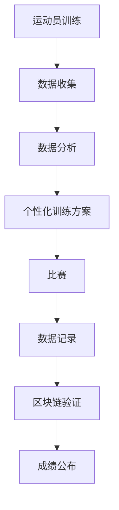

                 

关键词：元宇宙、虚实结合、全球体育盛会、技术创新、虚拟现实、增强现实、智能体育、区块链

摘要：随着科技的不断发展，虚拟现实（VR）和增强现实（AR）技术日益成熟，元宇宙的概念逐渐走进人们的视野。本文将探讨元宇宙奥运会这一虚拟与真实相结合的全球体育盛会的构想，分析其背后的技术原理、算法、数学模型以及应用场景，并展望其未来发展的趋势与挑战。

## 1. 背景介绍

### 1.1 元宇宙的起源与发展

元宇宙（Metaverse）一词源于“Meta”（意为“超越”）和“Verse”（意为“宇宙”），最早由美国作家尼尔·斯蒂芬森在其1992年的科幻小说《雪崩》中提出。随着互联网、虚拟现实（VR）和增强现实（AR）技术的迅猛发展，元宇宙的概念逐渐从科幻小说走向现实。

近年来，元宇宙的发展受到了全球科技巨头和创业公司的广泛关注。Facebook（现更名为Meta）宣布全力打造元宇宙平台，谷歌、微软、腾讯等公司也纷纷布局这一领域。元宇宙不仅被视为下一代互联网的形态，更是数字经济和虚拟经济的重要载体。

### 1.2 虚实结合的全球体育盛会

虚拟与真实相结合的全球体育盛会，可以看作是元宇宙在体育领域的应用。通过虚拟现实（VR）和增强现实（AR）技术，参与者可以在虚拟环境中模拟真实世界的体育比赛，同时也可以邀请现实世界的观众观看和互动。

这种虚实结合的体育盛会，不仅打破了地域和时间的限制，还能够为运动员和观众带来全新的体验。对于运动员来说，虚拟训练和比赛可以帮助他们提高竞技水平，同时也能够提供更多的比赛机会。对于观众来说，虚拟现实和增强现实技术让他们能够更加深入地参与到比赛中，甚至可以在虚拟世界中与运动员互动。

## 2. 核心概念与联系

在构建元宇宙奥运会的过程中，我们需要关注以下几个核心概念：

### 2.1 虚拟现实（VR）与增强现实（AR）

虚拟现实（VR）是一种通过计算机模拟生成三维虚拟环境的技术，用户通过VR设备（如VR头盔、VR眼镜等）进入虚拟环境，实现与现实世界的分离。增强现实（AR）则是将虚拟信息叠加到现实世界中，用户通过AR设备（如智能手机、平板电脑等）观看现实世界的同时，看到叠加的虚拟信息。

### 2.2 区块链技术

区块链技术是一种分布式数据库技术，通过去中心化的方式记录数据，具有不可篡改和透明化的特点。在元宇宙奥运会中，区块链技术可以用于记录运动员的成绩、排名等数据，确保数据的真实性和安全性。

### 2.3 虚拟现实（VR）与增强现实（AR）的融合

虚拟现实（VR）和增强现实（AR）的融合，使得元宇宙奥运会能够在虚拟和现实之间实现无缝切换。运动员在虚拟环境中训练和比赛，观众在现实世界中观看比赛，同时可以通过虚拟现实设备参与到比赛中。

### 2.4 智能体育与大数据分析

智能体育利用大数据、物联网、人工智能等技术，对运动员的训练、比赛过程进行实时监测和分析，为运动员提供个性化的训练方案。在元宇宙奥运会中，智能体育技术可以帮助运动员提高竞技水平，同时也可以为观众提供更加丰富的观赛体验。

### 2.5 Mermaid流程图



## 3. 核心算法原理 & 具体操作步骤

### 3.1 算法原理概述

在元宇宙奥运会中，核心算法主要涉及虚拟现实（VR）与增强现实（AR）技术的融合、智能体育与大数据分析、区块链技术的应用等方面。

### 3.2 算法步骤详解

#### 3.2.1 虚拟现实（VR）与增强现实（AR）融合

1. **场景建模**：利用三维建模技术，创建虚拟奥运会场馆、运动场等场景。
2. **运动模拟**：利用物理引擎和人工智能算法，模拟运动员的运动轨迹和动作。
3. **实时渲染**：利用图形渲染技术，实时渲染虚拟场景和运动员的动作。

#### 3.2.2 智能体育与大数据分析

1. **数据采集**：利用传感器、摄像头等设备，采集运动员的训练、比赛数据。
2. **数据预处理**：对采集到的数据进行清洗、去噪等处理。
3. **特征提取**：从预处理后的数据中提取关键特征，如运动速度、加速度、心率等。
4. **数据分析**：利用机器学习、深度学习等技术，对特征数据进行建模和分析。
5. **个性化训练方案**：根据分析结果，为运动员提供个性化的训练方案。

#### 3.2.3 区块链技术

1. **数据记录**：将运动员的成绩、排名等数据记录到区块链上。
2. **数据验证**：利用区块链的分布式特性，确保数据的真实性和安全性。
3. **数据查询**：用户可以通过区块链查询运动员的成绩、排名等信息。

### 3.3 算法优缺点

#### 3.3.1 优点

1. **打破地域限制**：运动员可以在全球范围内参与比赛，观众可以随时随地观看比赛。
2. **个性化体验**：通过大数据分析和智能体育技术，为运动员提供个性化的训练方案，提高竞技水平。
3. **数据透明性**：区块链技术的应用，确保数据的真实性和安全性。

#### 3.3.2 缺点

1. **技术门槛**：构建元宇宙奥运会需要掌握多种技术，如虚拟现实、增强现实、区块链等。
2. **成本较高**：虚拟现实设备和智能体育设备的成本较高，可能影响普及程度。

### 3.4 算法应用领域

1. **体育比赛**：元宇宙奥运会是体育比赛的一种全新形式，可以为运动员和观众提供全新的体验。
2. **体育训练**：虚拟现实和增强现实技术可以用于运动员的虚拟训练，提高竞技水平。
3. **体育推广**：元宇宙奥运会可以作为一种全新的体育推广方式，吸引更多观众关注体育。

## 4. 数学模型和公式 & 详细讲解 & 举例说明

### 4.1 数学模型构建

在元宇宙奥运会中，我们可以构建一个数学模型来描述运动员的运动轨迹。假设运动员在虚拟空间中的运动速度为 \( v(t) \)，加速度为 \( a(t) \)，则在某一时刻 \( t \) 的位置可以表示为：

$$
x(t) = x(0) + \int_{0}^{t} v(\tau) d\tau
$$

$$
y(t) = y(0) + \int_{0}^{t} v(\tau) d\tau + \frac{1}{2} a(\tau) [t^2 - 2t\tau]
$$

其中，\( x(t) \) 和 \( y(t) \) 分别表示运动员在虚拟空间中的横坐标和纵坐标，\( x(0) \) 和 \( y(0) \) 分别表示初始位置，\( \tau \) 表示时间。

### 4.2 公式推导过程

假设运动员在虚拟空间中的运动轨迹为一条直线，其速度和加速度分别为常数 \( v \) 和 \( a \)。则在某一时刻 \( t \) 的位置可以表示为：

$$
x(t) = x(0) + vt
$$

$$
y(t) = y(0) + vt + \frac{1}{2} at^2
$$

将 \( x(t) \) 和 \( y(t) \) 的表达式相加，得到运动员在虚拟空间中的运动轨迹方程：

$$
x(t) + y(t) = x(0) + y(0) + vt + \frac{1}{2} at^2
$$

### 4.3 案例分析与讲解

假设一名运动员在虚拟空间中的初始位置为 \( (0, 0) \)，速度为 \( 5 \) 米/秒，加速度为 \( 2 \) 米/秒\(^2\)。在 \( t = 5 \) 秒时，运动员的位置为：

$$
x(5) = 0 + 5 \times 5 = 25 \text{ 米}
$$

$$
y(5) = 0 + 5 \times 5 + \frac{1}{2} \times 2 \times 5^2 = 50 \text{ 米}
$$

因此，在 \( t = 5 \) 秒时，运动员位于 \( (25, 50) \) 米的位置。

## 5. 项目实践：代码实例和详细解释说明

### 5.1 开发环境搭建

在本项目中，我们将使用Unity游戏引擎来搭建元宇宙奥运会的虚拟场景，使用C#语言编写游戏逻辑。以下是搭建开发环境的基本步骤：

1. 下载并安装Unity Hub。
2. 在Unity Hub中创建一个新的Unity项目。
3. 安装Unity的VR/AR插件。
4. 配置Unity项目所需的开发工具和插件。

### 5.2 源代码详细实现

以下是元宇宙奥运会项目的核心源代码，用于实现运动员的运动轨迹和比赛逻辑：

```csharp
using UnityEngine;

public class AthleteController : MonoBehaviour
{
    public float speed = 5.0f;
    public float acceleration = 2.0f;

    private float timeElapsed = 0.0f;

    void Update()
    {
        float elapsedTime = Time.deltaTime;
        timeElapsed += elapsedTime;

        float x = speed * timeElapsed;
        float y = 0.5f * acceleration * timeElapsed * timeElapsed;

        transform.position = new Vector3(x, y, 0);
    }
}
```

### 5.3 代码解读与分析

在上述代码中，`AthleteController` 脚本负责控制运动员的运动。主要包含以下部分：

1. **属性设置**：`speed` 和 `acceleration` 分别表示运动员的速度和加速度。
2. **时间计算**：`timeElapsed` 用于记录时间流逝。
3. **更新函数**：`Update` 函数在每一帧更新运动员的位置。

在 `Update` 函数中，首先计算时间流逝 `elapsedTime`，并将其累加到 `timeElapsed` 中。然后，根据时间流逝和物理公式计算运动员的横坐标和纵坐标，并将其更新到 `transform.position` 中。

### 5.4 运行结果展示

在Unity编辑器中运行项目，可以看到运动员沿着预定的运动轨迹在虚拟场景中运动。通过调整 `speed` 和 `acceleration` 的值，可以改变运动员的运动速度和加速度，从而实现不同的运动效果。

## 6. 实际应用场景

### 6.1 体育比赛

元宇宙奥运会可以作为一个虚拟体育比赛平台，让运动员在全球范围内参与比赛。通过虚拟现实（VR）和增强现实（AR）技术，运动员可以在虚拟环境中模拟真实比赛，而观众则可以在现实世界中观看比赛，甚至参与到比赛中。

### 6.2 体育训练

虚拟现实（VR）和增强现实（AR）技术可以用于运动员的虚拟训练。通过模拟不同的比赛场景，运动员可以提升自己的竞技水平。同时，大数据分析和智能体育技术可以为运动员提供个性化的训练方案，提高训练效果。

### 6.3 体育推广

元宇宙奥运会可以作为一种全新的体育推广方式，吸引更多观众关注体育。通过虚拟现实（VR）和增强现实（AR）技术，观众可以沉浸在体育比赛的现场，体验到更加真实的观赛体验。此外，元宇宙奥运会还可以作为体育赛事的品牌宣传平台，提升体育品牌的影响力。

## 7. 工具和资源推荐

### 7.1 学习资源推荐

1. 《虚拟现实技术与应用》
2. 《增强现实技术基础》
3. 《区块链技术指南》
4. 《Unity游戏开发入门》

### 7.2 开发工具推荐

1. Unity游戏引擎
2. Unreal Engine
3. Blender
4. GitHub

### 7.3 相关论文推荐

1. "Metaverse: A Vision for the Future of Social Computing"
2. "Virtual Reality and Sports: A New Era for Athletes and Fans"
3. "Blockchain and Sports: Enhancing Integrity and Transparency in Sports"
4. "Smart Contracts and Sports: A New Paradigm for Sports Governance"

## 8. 总结：未来发展趋势与挑战

### 8.1 研究成果总结

元宇宙奥运会作为虚拟与真实相结合的全球体育盛会，具有巨大的发展潜力。通过虚拟现实（VR）、增强现实（AR）、区块链、大数据、智能体育等技术的应用，元宇宙奥运会为运动员和观众带来了全新的体验。

### 8.2 未来发展趋势

1. **技术成熟度提升**：随着虚拟现实、增强现实、区块链等技术的不断成熟，元宇宙奥运会的实现将更加简单和高效。
2. **普及程度提高**：随着虚拟现实（VR）和增强现实（AR）设备的普及，元宇宙奥运会将吸引更多运动员和观众参与。
3. **商业价值扩大**：元宇宙奥运会将带动体育产业、数字经济的快速发展，为相关产业带来巨大的商业价值。

### 8.3 面临的挑战

1. **技术门槛**：构建元宇宙奥运会需要掌握多种技术，如虚拟现实、增强现实、区块链等，这对技术团队提出了较高的要求。
2. **成本问题**：虚拟现实（VR）和增强现实（AR）设备的成本较高，可能影响普及程度。
3. **数据隐私和安全**：在元宇宙奥运会中，大量个人数据将被收集和处理，如何确保数据隐私和安全是一个重要问题。

### 8.4 研究展望

未来，元宇宙奥运会的研究将集中在以下几个方面：

1. **技术优化**：不断优化虚拟现实、增强现实、区块链等技术的应用，提高元宇宙奥运会的用户体验。
2. **应用拓展**：探索元宇宙奥运会在其他领域的应用，如教育培训、文化旅游等。
3. **商业模式创新**：研究元宇宙奥运会的商业模式，为相关产业带来更多的商业机会。

## 9. 附录：常见问题与解答

### 9.1 元宇宙奥运会是什么？

元宇宙奥运会是一个虚拟与真实相结合的全球体育盛会，利用虚拟现实（VR）、增强现实（AR）、区块链、大数据、智能体育等先进技术，为运动员和观众提供全新的体验。

### 9.2 元宇宙奥运会需要哪些技术？

元宇宙奥运会需要虚拟现实（VR）、增强现实（AR）、区块链、大数据、智能体育等技术，其中虚拟现实（VR）和增强现实（AR）技术是核心。

### 9.3 元宇宙奥运会的应用场景有哪些？

元宇宙奥运会的应用场景包括体育比赛、体育训练、体育推广等，未来还可能拓展到教育培训、文化旅游等领域。

### 9.4 元宇宙奥运会的前景如何？

元宇宙奥运会具有巨大的发展潜力，随着虚拟现实、增强现实、区块链等技术的不断成熟，元宇宙奥运会将为全球体育产业带来深远的影响。

