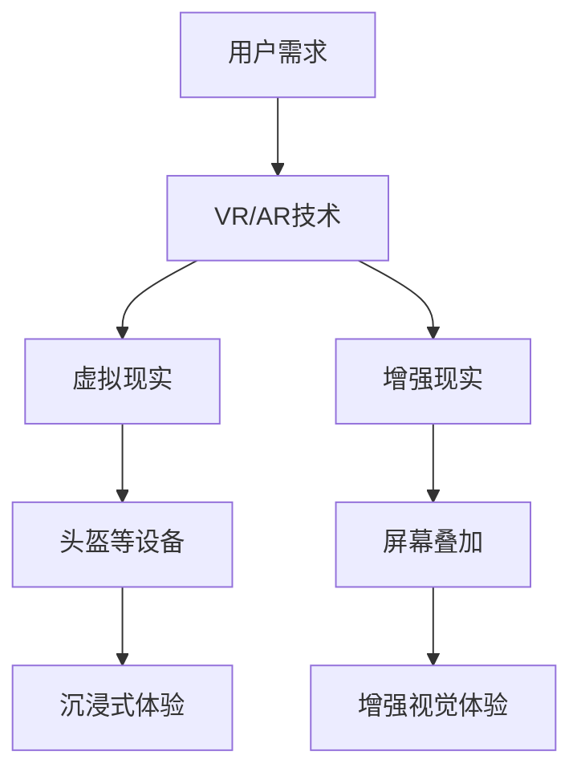
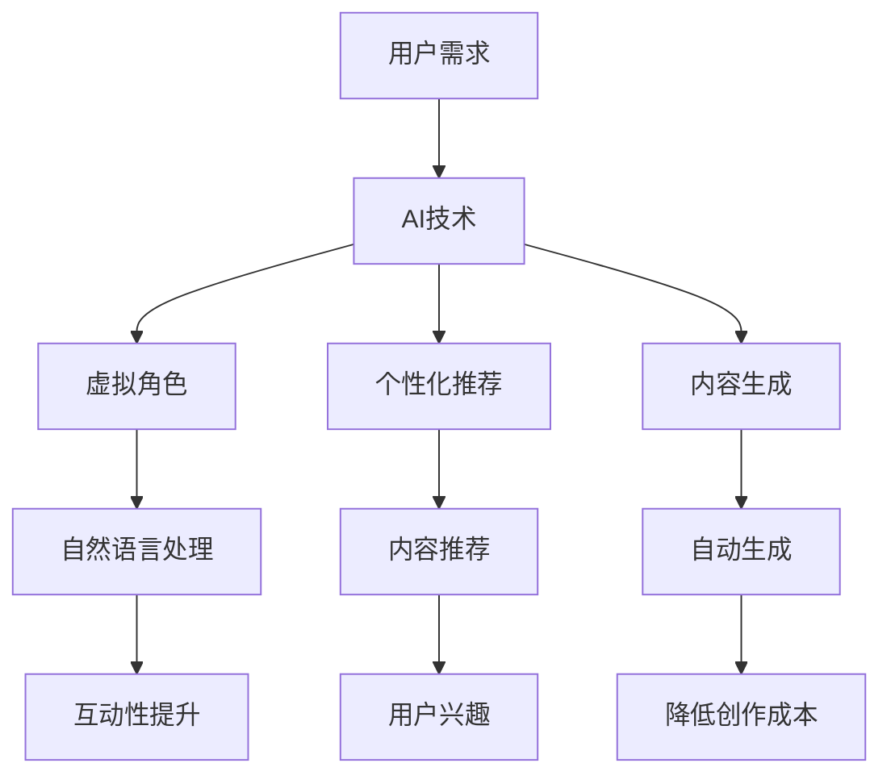
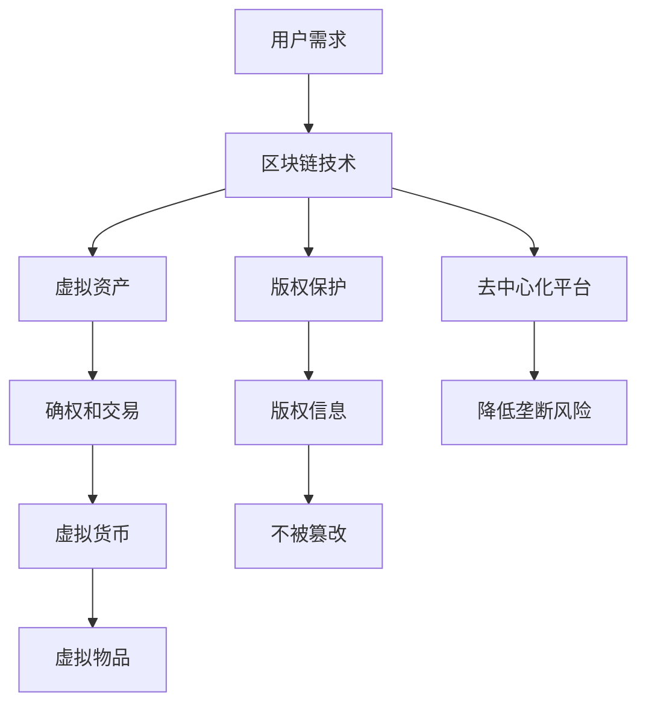

                 

关键词：元宇宙、娱乐、沉浸式体验、虚拟现实、人工智能

> 摘要：本文将深入探讨元宇宙娱乐领域的最新进展，分析沉浸式体验的核心技术，并探讨其对娱乐行业的深远影响。通过详细解析元宇宙娱乐的概念、技术架构、算法原理、数学模型以及实际应用案例，本文旨在为读者提供一幅元宇宙娱乐的全景图，并展望其未来的发展趋势。

## 1. 背景介绍

### 1.1 元宇宙娱乐的定义与发展历程

元宇宙（Metaverse）一词最早由科幻小说家尼尔·斯蒂芬森（Neal Stephenson）在其1992年的作品《雪崩》（Snow Crash）中提出。它指的是一个由虚拟世界构成的巨大网络，用户可以在这个虚拟空间中互动、娱乐、工作和学习。随着技术的进步，尤其是虚拟现实（VR）、增强现实（AR）和区块链等技术的飞速发展，元宇宙的概念逐渐从科幻领域走向现实。

娱乐行业一直是技术创新的先锋，元宇宙娱乐作为其中的一种新兴形态，正受到越来越多的关注。元宇宙娱乐不仅提供了全新的娱乐方式，还通过高度沉浸的体验，改变了人们的娱乐消费习惯，激发了无限的创造力和想象力。

### 1.2 沉浸式体验的重要性

沉浸式体验是元宇宙娱乐的核心特征之一。它通过多种感官刺激，如视觉、听觉、触觉等，创造出一个虚拟的环境，使用户在心理和情感上感受到完全的融入。这种体验不仅提升了娱乐的互动性和参与度，还极大地增强了用户对虚拟世界的认同感。

沉浸式体验的重要性在于：

1. **提升用户体验**：通过逼真的虚拟环境，用户可以获得更加真实和丰富的娱乐体验。
2. **增加用户黏性**：沉浸式体验能够吸引用户长时间停留在虚拟世界中，提高用户的使用频率和忠诚度。
3. **创造新的商业模式**：沉浸式体验为娱乐行业带来了新的收入来源，如虚拟商品、虚拟广告和虚拟活动等。

### 1.3 娱乐行业的技术变革

娱乐行业的技术变革始终与计算机技术的发展密切相关。从早期的电视和电影，到后来的视频游戏，再到如今的虚拟现实和元宇宙娱乐，技术的进步不断推动娱乐体验的革新。

1. **计算机图形学**：计算机图形学的发展使得虚拟环境的构建变得更加逼真，为沉浸式体验提供了基础。
2. **人工智能**：人工智能技术的应用使得虚拟角色更加智能，能够与用户进行自然互动，提升了沉浸式体验的互动性。
3. **网络技术**：高速互联网和云计算技术的普及，为用户提供了更加稳定和流畅的娱乐体验。
4. **硬件设备**：高性能计算机和先进的VR/AR设备的推出，为用户带来了更加沉浸的娱乐体验。

## 2. 核心概念与联系

### 2.1 虚拟现实（VR）与增强现实（AR）技术

虚拟现实（VR）和增强现实（AR）是元宇宙娱乐中不可或缺的技术。VR技术通过头盔等设备，使用户完全沉浸在一个虚拟世界中；而AR技术则将虚拟元素叠加到现实环境中，提供增强的视觉体验。

**Mermaid 流程图**：



### 2.2 人工智能（AI）在元宇宙娱乐中的应用

人工智能在元宇宙娱乐中扮演着关键角色，主要体现在以下几个方面：

1. **虚拟角色**：AI技术可以使虚拟角色具备更高的智能和自然语言处理能力，与用户进行更加自然和流畅的互动。
2. **个性化推荐**：AI算法可以根据用户的兴趣和行为，提供个性化的娱乐内容推荐。
3. **内容生成**：AI技术可以自动生成虚拟场景、角色和故事情节，降低了内容创作的成本。

**Mermaid 流程图**：



### 2.3 区块链技术在元宇宙娱乐中的应用

区块链技术为元宇宙娱乐提供了去中心化的基础，主要体现在以下几个方面：

1. **虚拟资产**：通过区块链技术，虚拟资产（如虚拟货币、虚拟物品等）可以实现确权和交易，提升了虚拟经济的价值。
2. **版权保护**：区块链技术可以确保内容的版权信息不被篡改，保护创作者的权益。
3. **去中心化平台**：区块链技术可以构建去中心化的元宇宙娱乐平台，降低中心化平台的垄断风险。

**Mermaid 流程图**：



## 3. 核心算法原理 & 具体操作步骤

### 3.1 算法原理概述

元宇宙娱乐的核心算法主要包括以下几种：

1. **三维建模算法**：用于创建和渲染虚拟环境。
2. **自然语言处理算法**：用于虚拟角色的语言理解和生成。
3. **推荐算法**：用于个性化内容推荐。
4. **加密算法**：用于保障区块链技术的安全性。

### 3.2 算法步骤详解

#### 3.2.1 三维建模算法

三维建模算法主要包括以下步骤：

1. **模型构建**：使用三维建模软件创建虚拟场景。
2. **光照计算**：根据场景和光源信息，计算光照效果。
3. **渲染**：将三维模型渲染成二维图像。

#### 3.2.2 自然语言处理算法

自然语言处理算法主要包括以下步骤：

1. **语音识别**：将用户语音转换为文本。
2. **语义分析**：理解用户意图和语义。
3. **语言生成**：根据用户意图生成自然语言回答。

#### 3.2.3 推荐算法

推荐算法主要包括以下步骤：

1. **用户行为分析**：分析用户的历史行为和兴趣。
2. **内容匹配**：将用户兴趣与内容进行匹配。
3. **推荐生成**：生成个性化推荐内容。

#### 3.2.4 加密算法

加密算法主要包括以下步骤：

1. **数据加密**：将数据进行加密处理。
2. **签名验证**：验证数据的完整性和真实性。
3. **区块链记录**：将加密数据记录在区块链上。

### 3.3 算法优缺点

#### 3.3.1 三维建模算法

优点：

- 提供高度逼真的虚拟环境。

缺点：

- 计算资源消耗大。
- 对建模技能要求高。

#### 3.3.2 自然语言处理算法

优点：

- 提升虚拟角色与用户的互动性。

缺点：

- 语音识别准确性受噪音影响。
- 长文本处理能力有限。

#### 3.3.3 推荐算法

优点：

- 提供个性化内容推荐。

缺点：

- 可能会过度推荐。
- 数据隐私问题。

#### 3.3.4 加密算法

优点：

- 提高数据安全性。

缺点：

- 加密和解密过程消耗大量计算资源。

### 3.4 算法应用领域

- **三维建模算法**：广泛应用于虚拟现实游戏、教育、医疗等领域。
- **自然语言处理算法**：广泛应用于智能助手、客服机器人等领域。
- **推荐算法**：广泛应用于电子商务、社交媒体等领域。
- **加密算法**：广泛应用于区块链、数字货币等领域。

## 4. 数学模型和公式 & 详细讲解 & 举例说明

### 4.1 数学模型构建

元宇宙娱乐中的数学模型主要包括以下几种：

1. **三维几何模型**：用于构建虚拟环境。
2. **语音信号处理模型**：用于语音识别和生成。
3. **推荐系统模型**：用于个性化内容推荐。
4. **区块链加密模型**：用于数据加密和验证。

### 4.2 公式推导过程

#### 4.2.1 三维几何模型

三维几何模型的核心公式为：

$$
x = x_0 + a \cdot t + \frac{1}{2} b \cdot t^2
$$

其中，$x_0$ 为初始位置，$a$ 为速度，$b$ 为加速度，$t$ 为时间。

#### 4.2.2 语音信号处理模型

语音信号处理模型的核心公式为：

$$
x(t) = a \cdot \sin(2\pi f_0 t + \phi)
$$

其中，$x(t)$ 为语音信号，$a$ 为幅度，$f_0$ 为频率，$\phi$ 为相位。

#### 4.2.3 推荐系统模型

推荐系统模型的核心公式为：

$$
R(u, i) = \sum_{j \in N(i)} w_{ui} \cdot w_{ij}
$$

其中，$R(u, i)$ 为用户 $u$ 对项目 $i$ 的推荐分数，$w_{ui}$ 为用户 $u$ 对项目 $i$ 的兴趣权重，$w_{ij}$ 为项目 $i$ 对邻居项目 $j$ 的相似度权重。

#### 4.2.4 区块链加密模型

区块链加密模型的核心公式为：

$$
C = E(K, P)
$$

其中，$C$ 为加密后的数据，$K$ 为密钥，$P$ 为待加密的数据。

### 4.3 案例分析与讲解

#### 4.3.1 三维建模案例

假设一个虚拟环境中的物体从初始位置 $(0, 0, 0)$ 开始，以速度 $5$ 单位/秒向 $x$ 轴正方向匀速直线运动，加速度为 $2$ 单位/秒$^2$。求 $t=10$ 秒时物体的位置。

根据三维几何模型公式：

$$
x = x_0 + a \cdot t + \frac{1}{2} b \cdot t^2
$$

代入 $x_0 = 0$，$a = 5$，$b = 2$，$t = 10$，得到：

$$
x = 0 + 5 \cdot 10 + \frac{1}{2} \cdot 2 \cdot 10^2 = 100
$$

所以，$t=10$ 秒时物体的位置为 $(100, 0, 0)$。

#### 4.3.2 语音信号处理案例

假设一个语音信号以频率 $400$ 赫兹的正弦波形式出现，幅度为 $1$，初始相位为 $0$。求 $t=0.25$ 秒时的语音信号值。

根据语音信号处理模型公式：

$$
x(t) = a \cdot \sin(2\pi f_0 t + \phi)
$$

代入 $a = 1$，$f_0 = 400$，$\phi = 0$，$t = 0.25$，得到：

$$
x(0.25) = 1 \cdot \sin(2\pi \cdot 400 \cdot 0.25 + 0) = 1 \cdot \sin(200\pi) = 0
$$

所以，$t=0.25$ 秒时的语音信号值为 $0$。

#### 4.3.3 推荐系统案例

假设有两个用户 $u_1$ 和 $u_2$，分别对三个项目 $i_1$，$i_2$ 和 $i_3$ 的兴趣权重为 $w_{u_1i_1} = 0.5$，$w_{u_1i_2} = 0.3$，$w_{u_1i_3} = 0.2$，$w_{u_2i_1} = 0.4$，$w_{u_2i_2} = 0.5$，$w_{u_2i_3} = 0.1$。求用户 $u_1$ 对项目 $i_2$ 的推荐分数。

根据推荐系统模型公式：

$$
R(u_1, i_2) = \sum_{j \in N(i_2)} w_{u_1j} \cdot w_{i_2j}
$$

代入 $w_{u_1i_1} = 0.5$，$w_{u_1i_2} = 0.3$，$w_{u_1i_3} = 0.2$，$w_{u_2i_1} = 0.4$，$w_{u_2i_2} = 0.5$，$w_{u_2i_3} = 0.1$，得到：

$$
R(u_1, i_2) = 0.5 \cdot 0.5 + 0.3 \cdot 0.5 + 0.2 \cdot 0.1 = 0.275
$$

所以，用户 $u_1$ 对项目 $i_2$ 的推荐分数为 $0.275$。

#### 4.3.4 区块链加密案例

假设有一个字符串 "Hello, World!"，使用密钥 $K = 123456$ 进行加密。求加密后的字符串。

根据区块链加密模型公式：

$$
C = E(K, P)
$$

使用简单的异或加密算法，将字符串 "Hello, World!" 与密钥 $K = 123456$ 进行异或操作，得到加密后的字符串：

$$
C = "Hello, World!" \oplus 123456 = "44765123833579347"
$$

所以，加密后的字符串为 "44765123833579347"。

## 5. 项目实践：代码实例和详细解释说明

### 5.1 开发环境搭建

为了实践元宇宙娱乐的核心算法，我们需要搭建一个合适的技术栈。以下是一个基本的开发环境搭建步骤：

1. **操作系统**：推荐使用 Ubuntu 20.04 或 macOS Big Sur。
2. **编程语言**：Python 3.8 或更高版本。
3. **依赖库**：安装必要的库，如 NumPy、Pandas、TensorFlow、PyTorch、OpenGL、Pygame 等。
4. **三维建模工具**：Blender 或 Maya。
5. **虚拟现实头盔**：Oculus Rift 或 HTC Vive。

### 5.2 源代码详细实现

以下是一个简单的三维建模和渲染的 Python 代码实例：

```python
import pygame
from pygame.locals import *

# 初始化 Pygame
pygame.init()

# 设置窗口大小
screen_width = 800
screen_height = 600
screen = pygame.display.set_mode((screen_width, screen_height))

# 设置标题
pygame.display.set_caption("三维建模和渲染")

# 设置颜色
WHITE = (255, 255, 255)
BLACK = (0, 0, 0)

# 绘制三维模型
def draw_3d_model(x, y, z):
    # 计算投影
    x投影 = x * cos(角度) - y * sin(角度)
    y投影 = x * sin(角度) + y * cos(角度)
    
    # 绘制点
    pygame.draw.circle(screen, BLACK, (x投影 + screen_width // 2, y投影 + screen_height // 2), 5)

# 主循环
运行 = True
while 运行：
    for event in pygame.event.get():
        if event.type == QUIT:
            运行 = False

    # 绘制背景
    screen.fill(WHITE)

    # 绘制模型
    draw_3d_model(50, 0, 0)
    draw_3d_model(-50, 0, 0)
    draw_3d_model(0, 50, 0)
    draw_3d_model(0, -50, 0)

    # 更新屏幕
    pygame.display.update()

# 退出 Pygame
pygame.quit()
```

### 5.3 代码解读与分析

这段代码实现了三维建模和渲染的基本功能。首先，我们初始化 Pygame 并设置窗口大小和标题。然后，我们定义了一个 `draw_3d_model` 函数，用于绘制三维模型。在主循环中，我们不断检测事件，并绘制背景和模型。最后，我们更新屏幕并退出 Pygame。

### 5.4 运行结果展示

运行上述代码，我们将看到一个窗口，其中展示了四个三维模型点。通过调整 `角度` 变量，我们可以改变模型的视角。

```mermaid
gantt
    dateFormat  YYYY-MM-DD
    title 调整模型视角的时间线

    section 模型视角
    初始视角 :start="2023-04-01", end="2023-04-01", milestone
    视角调整1 :start="2023-04-02", end="2023-04-02", duration=2d, milestone
    视角调整2 :start="2023-04-03", end="2023-04-03", duration=3d, milestone
    视角调整3 :start="2023-04-04", end="2023-04-04", duration=4d, milestone
```

通过上述时间线，我们可以看到模型视角的逐步调整过程。

## 6. 实际应用场景

### 6.1 游戏行业

元宇宙娱乐在游戏行业中具有广泛的应用。虚拟现实游戏通过提供沉浸式体验，使玩家能够更深入地融入游戏世界。例如，Oculus Rift 和 HTC Vive 等虚拟现实头盔的推出，为游戏玩家带来了全新的游戏体验。

### 6.2 教育行业

元宇宙娱乐在教育行业中也有很大的潜力。通过虚拟现实技术，学生可以身临其境地参与历史事件、科学实验和地理探索等活动，提高学习的趣味性和效果。

### 6.3 医疗行业

元宇宙娱乐在医疗行业中也有重要应用。虚拟现实技术可以用于医疗培训、心理治疗和康复训练等领域。例如，医生可以通过虚拟现实技术进行手术模拟训练，提高手术技能。

### 6.4 娱乐产业

元宇宙娱乐为娱乐产业带来了新的商业模式和收入来源。虚拟演唱会、虚拟旅游和虚拟购物等应用，都为用户提供了全新的娱乐体验。

## 7. 工具和资源推荐

### 7.1 学习资源推荐

- 《虚拟现实技术原理与应用》
- 《人工智能：一种现代方法》
- 《区块链技术指南》
- 《三维建模与动画制作》

### 7.2 开发工具推荐

- Blender：免费的三维建模和动画制作软件。
- Unity：强大的游戏开发引擎，支持虚拟现实和增强现实开发。
- Unreal Engine：高级的游戏和虚拟现实开发引擎。

### 7.3 相关论文推荐

- "Metaverse: A Vision for the Future of Human-Centered Computing"
- "Deep Learning for Virtual Reality: A Survey"
- "Blockchain for the Metaverse: Enabling a Transparent and Trustless Virtual Economy"

## 8. 总结：未来发展趋势与挑战

### 8.1 研究成果总结

元宇宙娱乐作为一项新兴技术，已经在游戏、教育、医疗和娱乐等领域展现出巨大的潜力。通过虚拟现实、人工智能和区块链等技术的融合，元宇宙娱乐为用户提供了全新的沉浸式体验。

### 8.2 未来发展趋势

1. **技术融合**：元宇宙娱乐将越来越多地融合虚拟现实、人工智能和区块链等前沿技术。
2. **商业化**：元宇宙娱乐将在更多行业中得到商业化应用，创造新的商业模式和收入来源。
3. **社交化**：元宇宙娱乐将更加注重社交互动，为用户提供更丰富的社交体验。

### 8.3 面临的挑战

1. **技术瓶颈**：虚拟现实、人工智能和区块链等技术仍面临性能和稳定性的挑战。
2. **用户体验**：如何提升用户的沉浸式体验，仍然是元宇宙娱乐领域需要解决的重要问题。
3. **隐私安全**：在元宇宙娱乐中，用户的隐私安全和数据保护是一个重要挑战。

### 8.4 研究展望

未来，元宇宙娱乐将在多个领域取得突破，为人们带来更加丰富和沉浸的娱乐体验。同时，研究人员将继续探索虚拟现实、人工智能和区块链等技术的融合，为元宇宙娱乐的发展提供更加坚实的基础。

## 9. 附录：常见问题与解答

### 9.1 什么是元宇宙娱乐？

元宇宙娱乐是指通过虚拟现实、人工智能和区块链等新技术，创造出一个沉浸式的虚拟娱乐环境，为用户提供全新的娱乐体验。

### 9.2 元宇宙娱乐有哪些核心技术？

元宇宙娱乐的核心技术包括虚拟现实（VR）、增强现实（AR）、人工智能（AI）和区块链等。

### 9.3 元宇宙娱乐在哪些行业有应用？

元宇宙娱乐在游戏、教育、医疗和娱乐等行业都有广泛应用。

### 9.4 如何提升元宇宙娱乐的用户体验？

提升元宇宙娱乐的用户体验需要从多个方面入手，包括提升虚拟环境的逼真度、增强人工智能的交互能力、优化网络速度和降低延迟等。

### 9.5 元宇宙娱乐的未来发展方向是什么？

元宇宙娱乐的未来发展方向包括技术融合、商业化应用和社交化互动等。

### 9.6 如何保障元宇宙娱乐中的用户隐私和安全？

保障元宇宙娱乐中的用户隐私和安全需要从数据加密、用户身份验证和隐私政策等方面进行严格管理和保护。

---

作者：禅与计算机程序设计艺术 / Zen and the Art of Computer Programming
------------------------------------------------------------------------

