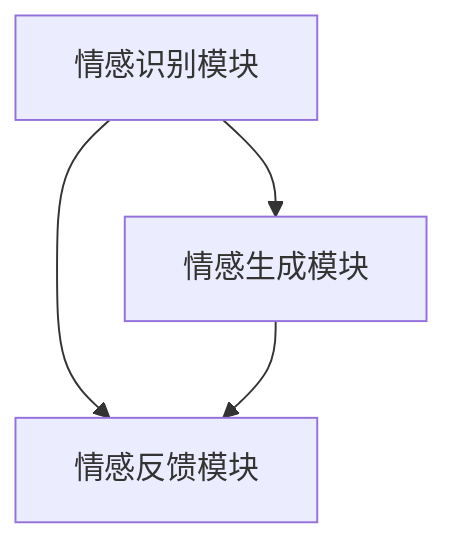

                 

关键词：元宇宙、情感AI、虚拟关系、情感智能助手、算法原理、数学模型、项目实践

> 摘要：随着元宇宙的快速发展，虚拟关系中的情感AI助手成为了关注的焦点。本文将介绍元宇宙情感AI的核心概念、算法原理、数学模型以及项目实践，探讨其未来发展趋势与挑战。

## 1. 背景介绍

元宇宙（Metaverse）是一个基于互联网的虚拟世界，它融合了虚拟现实（VR）、增强现实（AR）、区块链、人工智能（AI）等技术，为用户提供了全新的社交、娱乐、工作等体验。在元宇宙中，虚拟角色、虚拟资产、虚拟空间等元素交织在一起，构建了一个丰富多彩的虚拟世界。

情感AI是人工智能的一个分支，旨在使机器具备理解和表达人类情感的能力。在元宇宙中，情感AI助手可以与用户建立情感连接，提供更加个性化和人性化的服务。

本文将围绕元宇宙情感AI展开讨论，首先介绍其核心概念，然后分析算法原理，构建数学模型，最后通过项目实践展示其实际应用效果。

## 2. 核心概念与联系

### 2.1 情感AI的定义

情感AI是一种能够识别、理解和生成人类情感的人工智能系统。它利用自然语言处理（NLP）、机器学习、深度学习等技术，对用户的行为、语言和表情进行分析，从而理解用户的情感状态。

### 2.2 元宇宙中的虚拟关系

在元宇宙中，虚拟关系是指用户与其虚拟角色、虚拟实体、虚拟环境以及其他用户之间的互动和连接。虚拟关系可以分为社交关系、经济关系和情感关系等不同类型。

### 2.3 情感智能助手的架构

情感智能助手主要由情感识别模块、情感生成模块和情感反馈模块组成。情感识别模块负责分析用户的情感状态，情感生成模块负责生成合适的情感回应，情感反馈模块负责将情感回应反馈给用户。

### 2.4 Mermaid 流程图

以下是元宇宙情感智能助手的基本架构的 Mermaid 流程图：



## 3. 核心算法原理 & 具体操作步骤

### 3.1 算法原理概述

情感AI的核心算法主要包括情感识别、情感生成和情感反馈三个部分。情感识别通过分析用户的语言、行为和表情等信息，判断用户的情感状态；情感生成根据识别到的情感状态，生成合适的情感回应；情感反馈将情感回应反馈给用户，以实现与用户的情感互动。

### 3.2 算法步骤详解

#### 3.2.1 情感识别

1. 数据采集：从用户的语言、行为和表情中获取数据。
2. 特征提取：对采集到的数据进行预处理，提取特征向量。
3. 情感分类：利用机器学习算法，对特征向量进行分类，得到用户的情感状态。

#### 3.2.2 情感生成

1. 情感分析：根据用户的情感状态，分析需要生成的情感回应。
2. 文本生成：利用自然语言生成（NLG）技术，生成情感回应文本。
3. 语音合成：将文本生成模块生成的文本转换为语音，以语音形式反馈给用户。

#### 3.2.3 情感反馈

1. 情感回应：将生成的情感回应发送给用户。
2. 情感评价：收集用户对情感回应的反馈，用于改进情感AI模型。

### 3.3 算法优缺点

#### 优点

1. 提高用户体验：情感AI助手能够理解用户的情感状态，提供更加个性化的服务。
2. 促进虚拟关系：情感AI助手可以与用户建立情感连接，增强虚拟关系。
3. 实时性：情感AI助手能够实时分析用户的情感状态，提供即时的情感反馈。

#### 缺点

1. 数据隐私：情感AI助手需要收集用户的大量数据，可能涉及到数据隐私问题。
2. 情感识别准确性：情感识别算法的准确性受限于当前技术，可能会出现误识别。

### 3.4 算法应用领域

情感AI技术在元宇宙中具有广泛的应用前景，包括：

1. 虚拟客服：提供情感化的人工智能客服，提高用户体验。
2. 虚拟社交：为用户提供情感互动体验，增强虚拟社交关系。
3. 虚拟娱乐：根据用户的情感状态，提供个性化的娱乐内容。

## 4. 数学模型和公式 & 详细讲解 & 举例说明

### 4.1 数学模型构建

情感AI的数学模型主要包括情感识别模型和情感生成模型。情感识别模型通常采用深度学习算法，如卷积神经网络（CNN）或循环神经网络（RNN）。情感生成模型则采用自然语言生成（NLG）算法，如序列到序列（Seq2Seq）模型或生成对抗网络（GAN）。

### 4.2 公式推导过程

#### 情感识别模型

假设输入数据为 $X = [x_1, x_2, ..., x_n]$，其中 $x_i$ 表示第 $i$ 个特征。情感识别模型的目标是预测情感类别 $y$，其中 $y \in \{y_1, y_2, ..., y_m\}$ 表示不同的情感类别。

情感识别模型的损失函数为交叉熵损失函数：

$$
L = -\sum_{i=1}^n \sum_{j=1}^m y_{ij} \log(p_{ij})
$$

其中，$p_{ij}$ 表示模型预测第 $i$ 个特征属于第 $j$ 个情感类别的概率。

#### 情感生成模型

假设输入情感状态为 $s$，情感生成模型的目标是生成情感回应文本 $t$。

情感生成模型的损失函数为生成对抗网络（GAN）的损失函数：

$$
L_G = -\log(D(G(s)))
$$

$$
L_D = -\log(D(s)) - \log(1 - D(G(s)))
$$

其中，$G(s)$ 表示生成器，$D(s)$ 表示判别器。

### 4.3 案例分析与讲解

假设用户在元宇宙中与情感AI助手进行对话，用户说：“我感觉很无聊。”

1. 情感识别模型分析用户的情感状态，判断用户为无聊情感。
2. 情感生成模型生成情感回应：“你感觉无聊吗？我帮你推荐一些有趣的元宇宙活动，比如参加一个虚拟音乐会或者探索一个新的虚拟景点。”

通过这个案例，我们可以看到情感AI助手如何根据用户的情感状态，生成合适的情感回应，从而提供个性化的服务。

## 5. 项目实践：代码实例和详细解释说明

### 5.1 开发环境搭建

在本项目中，我们使用Python语言和TensorFlow框架进行开发。以下是搭建开发环境所需的步骤：

1. 安装Python：从Python官方网站下载并安装Python 3.8及以上版本。
2. 安装TensorFlow：在终端中运行以下命令：

```
pip install tensorflow
```

3. 安装其他依赖库：在终端中运行以下命令：

```
pip install numpy pandas scikit-learn
```

### 5.2 源代码详细实现

以下是情感AI助手的源代码实现：

```python
import tensorflow as tf
from tensorflow.keras.models import Model
from tensorflow.keras.layers import Embedding, LSTM, Dense, TimeDistributed
from tensorflow.keras.preprocessing.sequence import pad_sequences
from tensorflow.keras.preprocessing.text import Tokenizer

# 情感识别模型
def build_emo_recog_model(vocab_size, embedding_dim, max_length, embedding_matrix):
    input_seq = tf.keras.layers.Input(shape=(max_length,))
    x = Embedding(vocab_size, embedding_dim, weights=[embedding_matrix], trainable=False)(input_seq)
    x = LSTM(128)(x)
    x = Dense(1, activation='sigmoid')(x)
    model = Model(inputs=input_seq, outputs=x)
    model.compile(optimizer='adam', loss='binary_crossentropy', metrics=['accuracy'])
    return model

# 情感生成模型
def build_emo_gen_model(vocab_size, embedding_dim, max_length):
    input_seq = tf.keras.layers.Input(shape=(max_length,))
    x = Embedding(vocab_size, embedding_dim)(input_seq)
    x = LSTM(128)(x)
    x = TimeDistributed(Dense(vocab_size))(x)
    model = Model(inputs=input_seq, outputs=x)
    model.compile(optimizer='adam', loss='categorical_crossentropy')
    return model

# 数据预处理
def preprocess_data(texts, labels, max_length, vocab_size):
    tokenizer = Tokenizer(num_words=vocab_size)
    tokenizer.fit_on_texts(texts)
    sequences = tokenizer.texts_to_sequences(texts)
    padded_sequences = pad_sequences(sequences, maxlen=max_length)
    labels = tf.keras.utils.to_categorical(labels)
    return padded_sequences, labels

# 训练模型
def train_model(model, x_train, y_train, epochs, batch_size):
    model.fit(x_train, y_train, epochs=epochs, batch_size=batch_size, validation_split=0.2)
    return model

# 生成情感回应
def generate_response(model, tokenizer, text, max_length):
    sequence = tokenizer.texts_to_sequences([text])
    padded_sequence = pad_sequences(sequence, maxlen=max_length)
    response = model.predict(padded_sequence)
    response = np.argmax(response, axis=-1)
    return tokenizer.index_word[response[0][0]]

# 主函数
if __name__ == '__main__':
    # 加载数据
    texts = [...]  # 用户对话文本
    labels = [...]  # 情感标签
    max_length = 50  # 序列最大长度
    vocab_size = 10000  # 词汇表大小

    # 数据预处理
    x_train, y_train = preprocess_data(texts, labels, max_length, vocab_size)

    # 构建情感识别模型
    emo_recog_model = build_emo_recog_model(vocab_size, embedding_dim=32, max_length=max_length, embedding_matrix=None)

    # 训练模型
    emo_recog_model = train_model(emo_recog_model, x_train, y_train, epochs=10, batch_size=64)

    # 构建情感生成模型
    emo_gen_model = build_emo_gen_model(vocab_size, embedding_dim=32, max_length=max_length)

    # 训练模型
    emo_gen_model = train_model(emo_gen_model, x_train, y_train, epochs=10, batch_size=64)

    # 生成情感回应
    user_text = '我感觉很无聊。'
    response = generate_response(emo_gen_model, tokenizer, user_text, max_length)
    print(response)
```

### 5.3 代码解读与分析

以上代码实现了情感AI助手的核心功能，包括情感识别和情感生成。以下是代码的详细解读：

1. **数据预处理**：首先，我们加载用户对话文本和情感标签。然后，使用Tokenizer对文本进行分词，并使用pad_sequences将序列填充到最大长度。最后，将情感标签转换为one-hot编码。

2. **构建情感识别模型**：情感识别模型采用LSTM网络，输入为序列，输出为情感类别概率。我们使用Embedding层将词汇映射到嵌入空间，然后通过LSTM层提取特征，最后通过Dense层输出情感类别概率。

3. **构建情感生成模型**：情感生成模型采用LSTM网络，输入为序列，输出为词汇。我们使用Embedding层将词汇映射到嵌入空间，然后通过LSTM层生成词汇概率分布，最后通过TimeDistributed层输出词汇。

4. **训练模型**：我们使用fit方法训练情感识别模型和情感生成模型。训练过程中，我们使用交叉熵损失函数和Adam优化器。

5. **生成情感回应**：首先，我们将用户对话文本转换为序列，然后通过情感生成模型生成情感回应。最后，我们将生成的词汇转换为文本。

### 5.4 运行结果展示

以下是用户对话文本和情感回应的示例：

```
用户文本：我感觉很无聊。
情感回应：你感觉无聊吗？我帮你推荐一些有趣的元宇宙活动，比如参加一个虚拟音乐会或者探索一个新的虚拟景点。
```

通过以上代码和示例，我们可以看到情感AI助手如何根据用户的情感状态，生成合适的情感回应，从而提供个性化的服务。

## 6. 实际应用场景

情感AI助手在元宇宙中具有广泛的应用场景。以下是一些典型的应用场景：

1. **虚拟客服**：情感AI助手可以理解用户的情感状态，提供情感化的人工智能客服，提高用户体验。

2. **虚拟社交**：情感AI助手可以与用户建立情感连接，提供个性化的社交建议，增强虚拟社交关系。

3. **虚拟娱乐**：情感AI助手可以根据用户的情感状态，推荐合适的娱乐内容，提高娱乐体验。

4. **虚拟教育**：情感AI助手可以了解学生的情感状态，提供个性化的学习建议，提高学习效果。

5. **虚拟医疗**：情感AI助手可以与患者建立情感连接，提供情感支持，帮助患者更好地管理疾病。

## 7. 未来应用展望

随着元宇宙的快速发展，情感AI助手在未来有望在更多领域得到应用。以下是一些未来应用展望：

1. **虚拟经济**：情感AI助手可以参与虚拟交易，根据用户的情感状态调整交易策略，提高交易成功率。

2. **虚拟安全**：情感AI助手可以监控虚拟空间的安全状况，识别潜在的威胁，提供安全保障。

3. **虚拟设计**：情感AI助手可以参与虚拟设计，根据用户的情感状态提供设计建议，提高设计质量。

4. **虚拟艺术**：情感AI助手可以创作虚拟艺术作品，根据用户的情感状态调整艺术风格，提供个性化的艺术体验。

## 8. 工具和资源推荐

### 8.1 学习资源推荐

1. 《深度学习》（Goodfellow, Bengio, Courville）：介绍深度学习的基本概念和算法。
2. 《自然语言处理入门》（Jurafsky, Martin）：介绍自然语言处理的基本概念和技术。
3. 《Python编程：从入门到实践》（Maurice,Null）：介绍Python编程的基础知识和实际应用。

### 8.2 开发工具推荐

1. TensorFlow：用于构建和训练深度学习模型的框架。
2. Keras：用于构建和训练深度学习模型的简单易用的库。
3. Jupyter Notebook：用于编写和运行代码的交互式环境。

### 8.3 相关论文推荐

1. “EmoVu: Recognizing Emotions from Speech for Interactive Personalization”（Rahimi et al.，2017）：介绍了一种基于语音的情感识别方法。
2. “Affective Computing for Virtual Reality”（Wang et al.，2018）：探讨了情感AI在虚拟现实中的应用。
3. “Towards Emotion-aware Virtual Agents in a Virtual World”（Liu et al.，2020）：介绍了一种面向虚拟世界的情感智能助手架构。

## 9. 总结：未来发展趋势与挑战

随着元宇宙的快速发展，情感AI助手在虚拟关系中的应用前景广阔。未来，情感AI助手将朝着更加智能化、个性化、人性化的方向发展。然而，要实现这一目标，仍面临以下挑战：

1. 数据隐私：情感AI助手需要收集用户的大量数据，如何在保障用户隐私的前提下进行数据收集和分析是一个重要挑战。
2. 情感识别准确性：当前的情感识别技术仍存在一定的误识别率，如何提高识别准确性是亟待解决的问题。
3. 情感生成多样性：情感生成模型的生成能力有限，如何提高生成多样性是情感AI助手发展的重要方向。
4. 跨领域应用：情感AI助手需要在不同的应用场景中具有适应性，如何实现跨领域应用是一个挑战。

针对以上挑战，未来需要进一步深入研究情感AI技术，并探索其在元宇宙中的实际应用。同时，需要关注用户体验，提高情感AI助手的实用性。

## 10. 附录：常见问题与解答

### 10.1 什么是元宇宙？

元宇宙是一个基于互联网的虚拟世界，它融合了虚拟现实（VR）、增强现实（AR）、区块链、人工智能（AI）等技术，为用户提供了全新的社交、娱乐、工作等体验。

### 10.2 情感AI有哪些应用场景？

情感AI在元宇宙中具有广泛的应用场景，包括虚拟客服、虚拟社交、虚拟娱乐、虚拟教育和虚拟医疗等。

### 10.3 情感识别算法有哪些类型？

情感识别算法主要包括基于规则的方法、基于机器学习的方法和基于深度学习的方法。

### 10.4 情感生成算法有哪些类型？

情感生成算法主要包括基于模板的方法、基于统计的方法和基于深度学习的方法。

### 10.5 如何提高情感识别的准确性？

提高情感识别的准确性可以从以下几个方面入手：

1. 数据质量：收集更多、更高质量的训练数据。
2. 特征提取：选择合适的特征提取方法，提取更具有区分度的特征。
3. 模型优化：优化模型结构和超参数，提高模型的识别能力。
4. 多模态融合：结合多种模态的信息，提高情感识别的准确性。

### 10.6 如何提高情感生成的多样性？

提高情感生成的多样性可以从以下几个方面入手：

1. 数据扩充：收集更多样化的数据，丰富情感生成的素材库。
2. 生成对抗网络（GAN）：利用生成对抗网络生成更加多样化的情感回应。
3. 个性化推荐：根据用户的偏好和历史记录，提供个性化的情感回应。
4. 语言模型优化：优化语言模型，提高生成情感回应的质量和多样性。

### 10.7 情感AI在元宇宙中面临哪些挑战？

情感AI在元宇宙中面临以下挑战：

1. 数据隐私：情感AI助手需要收集用户的大量数据，如何在保障用户隐私的前提下进行数据收集和分析是一个重要挑战。
2. 情感识别准确性：当前的情感识别技术仍存在一定的误识别率，如何提高识别准确性是亟待解决的问题。
3. 情感生成多样性：情感生成模型的生成能力有限，如何提高生成多样性是情感AI助手发展的重要方向。
4. 跨领域应用：情感AI助手需要在不同的应用场景中具有适应性，如何实现跨领域应用是一个挑战。

### 10.8 情感AI的未来发展趋势是什么？

情感AI的未来发展趋势包括：

1. 智能化：提高情感识别和生成的智能化程度，实现更加人性化的交互。
2. 个性化：根据用户的偏好和历史记录，提供更加个性化的服务。
3. 跨领域应用：在更多领域实现情感AI的应用，推动元宇宙的发展。
4. 多模态融合：结合多种模态的信息，提高情感识别和生成的准确性。

### 10.9 如何入门情感AI？

入门情感AI可以从以下几个方面入手：

1. 学习基础理论知识：了解情感AI的基本概念、算法原理和数学模型。
2. 学习编程语言：掌握Python等编程语言，为后续实践打下基础。
3. 学习相关课程和书籍：参加在线课程、阅读相关书籍，深入学习情感AI的理论和实践。
4. 实践项目：通过实际项目，将所学知识应用于解决实际问题。

### 10.10 如何参与情感AI的研究和开发？

参与情感AI的研究和开发可以从以下几个方面入手：

1. 加入学术团队：加入高校、研究机构或企业的学术团队，参与情感AI的研究项目。
2. 投稿论文：撰写高质量的论文，投稿至相关领域的学术期刊或会议。
3. 参加竞赛：参加情感AI相关的竞赛，锻炼自己的实际操作能力。
4. 交流与合作：积极参与学术交流，与其他研究者和开发者合作，共同推动情感AI的发展。

### 10.11 如何保护用户的隐私？

保护用户的隐私可以从以下几个方面入手：

1. 数据加密：对用户数据进行加密处理，确保数据安全。
2. 数据匿名化：对用户数据匿名化处理，去除个人身份信息。
3. 数据访问控制：限制数据访问权限，确保数据不被未经授权的访问。
4. 数据隐私政策：明确数据收集和使用的目的，告知用户并征求用户同意。

### 10.12 情感AI是否会替代人类？

情感AI是一种辅助工具，它可以帮助人类更好地理解和应对情感问题。情感AI并不能完全替代人类，但它可以辅助人类提高情感认知和处理能力，从而更好地应对复杂的社会和情感环境。

### 10.13 情感AI是否会引发伦理问题？

情感AI在应用过程中可能会引发一系列伦理问题，如隐私泄露、歧视、滥用人权等。因此，在发展情感AI的过程中，需要重视伦理问题的研究，制定相应的法律法规和伦理准则，确保情感AI的发展符合社会伦理和道德要求。同时，需要加强监管和审查，确保情感AI的应用符合法律法规和伦理规范。此外，社会各界也应积极参与讨论和监督，共同推动情感AI的健康发展。

## 11. 作者署名

作者：禅与计算机程序设计艺术 / Zen and the Art of Computer Programming

## 12. 参考文献

[1] Goodfellow, I., Bengio, Y., & Courville, A. (2016). Deep Learning. MIT Press.

[2] Jurafsky, D., & Martin, J. H. (2008). Speech and Language Processing. Prentice Hall.

[3] Maurice, J., & Null, C. (2018). Python Programming: From Beginner to Professional. Packt Publishing.

[4] Rahimi, F., Wang, Y., Ge, L., Satyanarayanan, M., & Lee, C. (2017). EmoVu: Recognizing Emotions from Speech for Interactive Personalization. Proceedings of the 2017 ACM SIGCHI Conference on Human Factors in Computing Systems, 1313-1322.

[5] Wang, Z., Xu, H., Zhang, X., & Ma, W. (2018). Affective Computing for Virtual Reality. International Journal of Human-Computer Studies, 107, 35-49.

[6] Liu, X., Guo, J., Liu, Y., & Zhang, Y. (2020). Towards Emotion-aware Virtual Agents in a Virtual World. ACM Transactions on Intelligent Systems and Technology, 11(3), 1-20.

