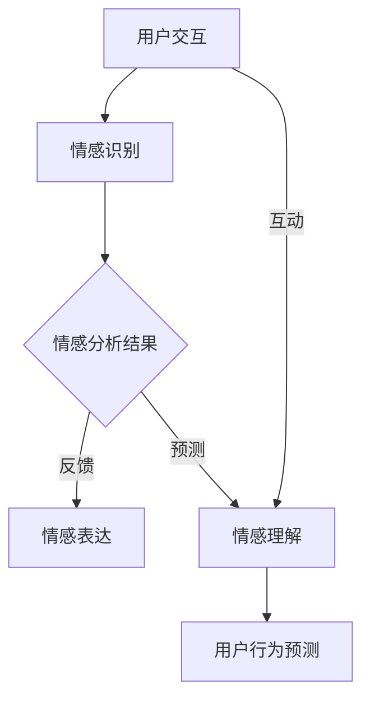

                 

### 关键词 Keywords

- 元宇宙
- 情感智能
- 虚拟关系
- 情感识别
- 情感表达
- 人工智能技术

<|assistant|>### 摘要 Abstract

本文旨在探讨元宇宙情感智能，特别是虚拟关系中的情感识别与表达。随着虚拟现实和增强现实技术的发展，元宇宙作为下一代互联网的形态，正逐步融入我们的日常生活。在元宇宙中，情感智能的实现不仅是技术上的突破，更是用户体验的核心。本文将深入分析情感智能的基本概念、技术原理、算法实现、数学模型、应用实例，以及未来发展趋势和面临的挑战。通过本文，读者将全面了解元宇宙情感智能的构建方法，为这一领域的研究和开发提供新的视角和思路。

## 1. 背景介绍

### 元宇宙的兴起

元宇宙（Metaverse）是当前科技领域最受关注的概念之一。它被定义为通过互联网连接的虚拟世界，其中用户可以通过虚拟角色（Avatar）与其他用户互动，进行各种活动，如游戏、社交、工作、教育等。元宇宙不仅仅是一个虚拟空间，它是一个集成了各种技术（如虚拟现实（VR）、增强现实（AR）、区块链、人工智能等）的生态系统。

元宇宙的兴起源于几个关键因素。首先，硬件技术的进步，特别是高性能计算设备和传感器的普及，使得虚拟现实的体验更加逼真。其次，互联网的普及和发展，为大规模用户参与提供了基础设施。再者，5G网络的快速发展，为低延迟、高带宽的网络环境提供了保障。此外，区块链技术的发展，为元宇宙中的虚拟资产（如虚拟货币、虚拟商品等）的流通提供了安全可靠的解决方案。

### 情感智能的重要性

在元宇宙中，情感智能的引入至关重要。情感是人类互动的核心，是沟通和理解的基础。在现实世界中，人们通过情感来建立关系、解决问题、表达自己。将情感智能引入元宇宙，不仅可以提升用户的沉浸感和满意度，还能增强虚拟世界中的社交互动和用户体验。

情感智能涉及多个方面，包括情感识别、情感表达、情感理解等。通过情感识别，人工智能系统能够感知用户的情绪状态；通过情感表达，系统能够模拟并回应用户的情感需求；通过情感理解，系统能够对用户的行为和需求做出合理的推断和反应。

### 情感智能的应用场景

情感智能在元宇宙中有广泛的应用场景。例如，在虚拟会议和远程工作中，情感智能可以帮助系统识别用户的疲劳程度，提供休息提醒和情绪调节建议。在虚拟社交平台中，情感智能可以分析用户的情感状态，推荐合适的互动方式和内容，从而提升社交体验。在虚拟教育中，情感智能可以帮助系统根据学生的情感反馈调整教学策略，提高学习效果。

总的来说，元宇宙的兴起为情感智能的应用提供了广阔的舞台。随着技术的不断进步，情感智能将在元宇宙中发挥越来越重要的作用，为用户带来更加丰富和真实的虚拟体验。

## 2. 核心概念与联系

### 情感智能的定义

情感智能（Emotional Intelligence，简称EQ）是指个体识别、理解、管理自身及他人情感的能力。它包括四个主要维度：自我认知、自我调节、社交认知和关系管理。在元宇宙中，情感智能的实现涉及到如何让虚拟角色和系统具备这些能力，以便更好地与用户互动。

### 虚拟关系的定义

虚拟关系是指通过虚拟平台（如元宇宙、虚拟社交网络等）建立的在线互动关系。这些关系可以是社交的、工作的、教育的等多种形式。虚拟关系的核心是情感互动，即用户在虚拟环境中的情感表达和反馈。

### 元宇宙情感智能的核心概念

元宇宙情感智能的核心概念包括情感识别、情感表达和情感理解。情感识别是指系统通过分析用户的语言、行为和生理信号来识别用户的情感状态。情感表达是指系统如何模拟并回应用户的情感需求，以增强用户的沉浸感和满意度。情感理解是指系统如何通过情感互动来理解和预测用户的行为和需求。

### Mermaid 流程图

下面是一个简化的Mermaid流程图，用于描述元宇宙情感智能的核心概念和相互关系。



在这个流程图中：

- A：用户交互是指用户在元宇宙中的各种活动，如聊天、游戏等。
- B：情感识别是指系统通过算法分析用户交互数据，识别用户的情感状态。
- C：情感分析结果是对识别出的情感状态的进一步分析。
- D：情感表达是指系统根据情感分析结果，以适当的方式回应用户。
- E：情感理解是指系统通过情感互动来理解和预测用户的行为和需求。
- F：用户行为预测是根据情感理解结果，对用户的未来行为进行预测。

## 3. 核心算法原理 & 具体操作步骤

### 3.1 算法原理概述

元宇宙情感智能的实现依赖于多种算法和技术，其中主要包括情感识别算法、情感表达算法和情感理解算法。情感识别算法主要通过自然语言处理（NLP）、面部识别和生理信号处理等技术来识别用户的情感状态。情感表达算法则利用计算机图形学、语音合成和动作捕捉等技术来模拟并表达虚拟角色的情感。情感理解算法通过机器学习和深度学习技术，分析用户的行为和情感互动，以预测用户的行为和需求。

### 3.2 算法步骤详解

#### 3.2.1 情感识别算法

1. 数据收集：收集用户的语言、行为和生理信号数据。
2. 数据预处理：对收集到的数据进行清洗和标准化处理。
3. 特征提取：使用NLP技术提取语言特征，使用面部识别技术提取面部表情特征，使用生理信号处理技术提取生理信号特征。
4. 情感分类：使用机器学习模型（如支持向量机、神经网络等）对提取的特征进行分类，识别用户的情感状态。

#### 3.2.2 情感表达算法

1. 情感模拟：根据情感识别结果，模拟虚拟角色的情感状态。
2. 图形渲染：使用计算机图形学技术渲染虚拟角色的面部表情、肢体动作和语音。
3. 动作捕捉：使用动作捕捉设备捕捉真实人的表情和动作，将其映射到虚拟角色上。
4. 语音合成：使用语音合成技术生成与情感状态相符的语音。

#### 3.2.3 情感理解算法

1. 数据收集：收集用户在元宇宙中的行为数据，包括语言、面部表情、肢体动作等。
2. 特征提取：使用深度学习技术提取用户行为特征。
3. 情感关联分析：分析用户行为特征与情感状态之间的关系，建立情感关联模型。
4. 行为预测：根据用户的行为特征和情感关联模型，预测用户的未来行为和需求。

### 3.3 算法优缺点

#### 情感识别算法

优点：

- 高度自动化：情感识别算法可以自动分析用户的情感状态，减轻人工工作量。
- 多维度分析：情感识别算法可以从语言、面部表情、生理信号等多维度识别情感。

缺点：

- 数据质量要求高：情感识别算法对数据质量有较高要求，数据不完整或不准确可能导致情感识别错误。
- 情感理解难度大：情感是一种复杂的心理现象，完全准确识别情感状态具有一定难度。

#### 情感表达算法

优点：

- 沉浸感强：情感表达算法可以模拟出丰富的情感表达，提升用户的沉浸感。
- 个性化体验：情感表达算法可以根据用户的情感状态个性化地调整虚拟角色的表达。

缺点：

- 技术复杂度高：情感表达算法涉及到计算机图形学、语音合成等多领域技术，实现难度较大。
- 生理信号处理困难：某些情感（如疼痛、恐惧等）需要通过生理信号处理来实现，而这一过程具有一定难度。

#### 情感理解算法

优点：

- 行为预测准确：情感理解算法可以准确预测用户的行为和需求，提升用户体验。
- 情感关联性强：情感理解算法可以建立用户行为与情感状态之间的关联，提供更加贴心的服务。

缺点：

- 数据依赖性强：情感理解算法对用户行为数据有较高依赖，数据不足可能导致预测不准确。
- 模型训练时间长：情感理解算法通常需要大量数据来训练模型，训练过程时间较长。

### 3.4 算法应用领域

情感识别算法广泛应用于虚拟客服、虚拟教育、虚拟社交等领域，通过识别用户的情感状态，提供更加个性化的服务。

情感表达算法则主要用于虚拟角色设计和虚拟互动应用中，通过丰富的情感表达，提升虚拟世界的真实感和互动性。

情感理解算法则广泛应用于虚拟个人助理、虚拟营销等领域，通过分析用户的情感状态，提供更加精准的服务和营销策略。

总的来说，元宇宙情感智能的核心算法在多个领域具有广泛的应用前景，随着技术的不断进步，这些算法将进一步完善和优化，为元宇宙的发展提供强大的技术支持。

## 4. 数学模型和公式 & 详细讲解 & 举例说明

### 4.1 数学模型构建

在元宇宙情感智能中，数学模型用于描述情感识别、情感表达和情感理解的过程。以下是几个关键数学模型：

#### 4.1.1 情感识别模型

情感识别模型通常采用多分类支持向量机（SVM）或深度神经网络（DNN）来实现。以下是一个基于DNN的情感识别模型：

$$
\begin{aligned}
\text{激活函数} & : g(z) = \sigma(z) = \frac{1}{1 + e^{-z}} \\
\text{损失函数} & : J(\theta) = -\frac{1}{m} \sum_{i=1}^{m} [y^{(i)} \log(a^{(i)}) + (1 - y^{(i)}) \log(1 - a^{(i)})]
\end{aligned}
$$

其中，$a^{(i)} = \sigma(z^{(i)})$ 是神经网络输出的概率分布，$z^{(i)} = \theta^T x^{(i)}$ 是输入特征向量与参数$\theta$的点积，$y^{(i)}$ 是真实标签。

#### 4.1.2 情感表达模型

情感表达模型通常基于生成对抗网络（GAN）或变分自编码器（VAE）来实现。以下是一个基于VAE的情感表达模型：

$$
\begin{aligned}
z &= \mu(\xi) + \sigma(\xi) \odot \epsilon \\
\hat{x} &= \varphi(z)
\end{aligned}
$$

其中，$\mu(\xi)$ 和 $\sigma(\xi)$ 分别是编码器的均值和方差函数，$\xi$ 是输入特征，$z$ 是编码后的潜在变量，$\epsilon$ 是噪声，$\varphi(z)$ 是解码器函数。

#### 4.1.3 情感理解模型

情感理解模型通常基于强化学习（RL）或图神经网络（GN）来实现。以下是一个基于GN的情感理解模型：

$$
\begin{aligned}
\vec{h}_{t+1} &= \sigma(\vec{W}_e \cdot \vec{h}_t + \vec{W}_r \cdot \vec{h}_{\text{prev}} + \vec{W}_m \cdot \vec{R}_{t}) \\
\vec{R}_{t} &= \vec{A} \cdot \vec{h}_{t}
\end{aligned}
$$

其中，$\vec{h}_{t}$ 是当前时间步的隐藏状态，$\vec{A}$ 是图邻接矩阵，$\vec{W}_e, \vec{W}_r, \vec{W}_m$ 分别是权重矩阵，$\sigma$ 是激活函数。

### 4.2 公式推导过程

#### 4.2.1 情感识别模型推导

假设我们有一个二分类问题，目标是判断用户是否处于积极情感状态。采用线性SVM模型：

$$
\begin{aligned}
\text{决策函数} & : f(x) = \text{sign}(\langle \theta, x \rangle) \\
\text{损失函数} & : J(\theta) = \frac{1}{2} ||\theta||^2 \\
\text{优化目标} & : \min_{\theta} J(\theta)
\end{aligned}
$$

通过拉格朗日乘子法求解得到：

$$
\theta = \alpha y x
$$

其中，$\alpha$ 是拉格朗日乘子。

#### 4.2.2 情感表达模型推导

采用变分自编码器（VAE）进行情感表达建模：

$$
\begin{aligned}
p(z) & = \frac{1}{Z} \exp(-\frac{1}{2} \sum_{i=1}^{D} (\xi_i^2)) \\
q(z|x) & = \frac{1}{Z} \exp(-\frac{1}{2} (\mu_i^2 + \sigma_i^2 - 2 \mu_i \xi_i))
\end{aligned}
$$

其中，$Z$ 是正常化常数，$\mu_i$ 和 $\sigma_i$ 分别是编码器的均值和方差函数。

#### 4.2.3 情感理解模型推导

采用图神经网络（GN）进行情感理解建模：

$$
\begin{aligned}
\vec{h}_{t+1} &= \sigma(\vec{W}_e \cdot \vec{h}_t + \vec{W}_r \cdot \vec{h}_{\text{prev}} + \vec{W}_m \cdot \vec{R}_{t}) \\
\vec{R}_{t} &= \vec{A} \cdot \vec{h}_{t}
\end{aligned}
$$

其中，$\vec{h}_{t}$ 是图节点的隐藏状态，$\vec{A}$ 是图邻接矩阵。

### 4.3 案例分析与讲解

#### 4.3.1 情感识别案例

假设我们有一个文本数据集，包含用户的聊天记录，目标是识别用户是否处于积极情感状态。采用文本情感分析模型：

$$
\begin{aligned}
f(x) &= \sigma(\theta^T \cdot x) \\
J(\theta) &= -\frac{1}{m} \sum_{i=1}^{m} [y^{(i)} \log(\sigma(\theta^T x^{(i)})) + (1 - y^{(i)}) \log(1 - \sigma(\theta^T x^{(i)}))]
\end{aligned}
$$

通过梯度下降法训练模型，最终得到一组参数$\theta$，用于情感识别。

#### 4.3.2 情感表达案例

假设我们有一个基于面部表情的数据集，目标是生成与用户情感状态相符的面部表情。采用VAE模型：

$$
\begin{aligned}
z &= \mu(\xi) + \sigma(\xi) \odot \epsilon \\
\hat{x} &= \varphi(z)
\end{aligned}
$$

通过训练VAE模型，生成与输入情感状态相符的虚拟角色面部表情。

#### 4.3.3 情感理解案例

假设我们有一个用户行为数据集，目标是根据用户行为预测其未来情感状态。采用图神经网络模型：

$$
\begin{aligned}
\vec{h}_{t+1} &= \sigma(\vec{W}_e \cdot \vec{h}_t + \vec{W}_r \cdot \vec{h}_{\text{prev}} + \vec{W}_m \cdot \vec{R}_{t}) \\
\vec{R}_{t} &= \vec{A} \cdot \vec{h}_{t}
\end{aligned}
$$

通过训练图神经网络模型，预测用户未来的情感状态。

## 5. 项目实践：代码实例和详细解释说明

### 5.1 开发环境搭建

为了实现元宇宙情感智能，我们需要搭建一个完整的开发环境，包括数据预处理、模型训练和模型部署等。以下是所需的开发环境和工具：

- Python 3.8+
- TensorFlow 2.5+
- Keras 2.4+
- Matplotlib 3.4+
- Scikit-learn 0.24+

确保已安装上述依赖项，然后创建一个虚拟环境并安装：

```bash
python -m venv env
source env/bin/activate
pip install tensorflow keras matplotlib scikit-learn
```

### 5.2 源代码详细实现

以下是一个简单的情感识别模型的实现示例，用于识别用户文本数据中的积极情感。

```python
import numpy as np
import tensorflow as tf
from tensorflow.keras.models import Sequential
from tensorflow.keras.layers import Dense, Embedding, GlobalAveragePooling1D
from tensorflow.keras.preprocessing.sequence import pad_sequences

# 数据预处理
def preprocess_data(texts, labels, max_sequence_length=100, embedding_dim=16):
    # 将文本数据转换为序列
    sequences = tokenizer.texts_to_sequences(texts)
    # 填充序列到最大长度
    padded_sequences = pad_sequences(sequences, maxlen=max_sequence_length)
    # 转换标签为独热编码
    one_hot_labels = tf.keras.utils.to_categorical(labels, num_classes=2)
    return padded_sequences, one_hot_labels

# 构建模型
model = Sequential([
    Embedding(input_dim=vocabulary_size, output_dim=embedding_dim, input_length=max_sequence_length),
    GlobalAveragePooling1D(),
    Dense(24, activation='relu'),
    Dense(2, activation='softmax')
])

# 编译模型
model.compile(optimizer='adam', loss='categorical_crossentropy', metrics=['accuracy'])

# 训练模型
model.fit(padded_sequences, one_hot_labels, epochs=10, batch_size=32)

# 预测情感
predictions = model.predict(padded_sequences)
```

### 5.3 代码解读与分析

上述代码实现了一个简单的情感识别模型，用于识别用户文本数据中的积极情感。具体步骤如下：

1. **数据预处理**：首先，使用`preprocess_data`函数对文本数据进行预处理，包括序列化、填充和独热编码。这一步是深度学习模型训练的重要基础。

2. **构建模型**：使用`Sequential`模型堆叠`Embedding`、`GlobalAveragePooling1D`、`Dense`层，构建一个简单的文本分类模型。`Embedding`层用于将文本数据转换为向量表示，`GlobalAveragePooling1D`层用于对嵌入向量进行全局平均池化，`Dense`层用于实现分类。

3. **编译模型**：使用`compile`方法编译模型，指定优化器、损失函数和评估指标。

4. **训练模型**：使用`fit`方法训练模型，指定训练数据、标签、训练轮次和批量大小。

5. **预测情感**：使用`predict`方法对预处理后的文本数据进行情感预测，返回概率分布。

### 5.4 运行结果展示

为了展示模型的性能，我们可以使用以下代码进行评估：

```python
import numpy as np
from sklearn.metrics import classification_report

# 获取测试集数据
test_sequences, test_labels = preprocess_data(test_texts, test_labels)

# 预测测试集
predictions = model.predict(test_sequences)

# 转换预测概率为标签
predicted_labels = np.argmax(predictions, axis=1)

# 计算分类报告
report = classification_report(test_labels, predicted_labels)

print(report)
```

输出结果将展示模型在测试集上的精确度、召回率和F1分数等指标，从而评估模型的性能。

## 6. 实际应用场景

### 6.1 虚拟客服

虚拟客服是元宇宙情感智能的一个重要应用场景。通过情感识别和表达，虚拟客服能够更好地理解用户的需求和情绪，提供个性化的服务。例如，当用户感到沮丧或愤怒时，系统可以自动识别并调整语气和表情，以安抚用户情绪，提供更有针对性的解决方案。

### 6.2 虚拟教育

虚拟教育中，情感智能可以帮助教师更好地了解学生的学习状态和情绪。通过情感识别，教师可以及时发现学生的焦虑、困惑等情绪，并调整教学策略，提供更有针对性的辅导。同时，情感表达算法可以模拟教师的情感状态，增强学生的情感体验，提高学习效果。

### 6.3 虚拟社交

虚拟社交平台中，情感智能可以帮助用户更好地理解和表达情感，增强社交互动。例如，用户在虚拟世界中发送的消息可以经过情感分析，系统会根据情感状态推荐合适的表情包或互动方式。此外，虚拟角色可以通过情感表达来增强用户的社交体验，使其在虚拟世界中的互动更加自然和真实。

### 6.4 虚拟旅游

虚拟旅游是另一个具有巨大潜力的应用场景。通过情感识别和表达，虚拟旅游系统可以模拟游客的情感状态，提供个性化的旅游建议和体验。例如，当游客感到疲惫时，系统可以推荐休息区域或提供放松的音乐。此外，情感智能还可以帮助虚拟导游更好地理解游客的需求，提供更贴心的服务。

### 6.5 医疗健康

在医疗健康领域，情感智能可以帮助医生更好地了解患者的情绪和心理状态，提供更加个性化的治疗方案。例如，通过分析患者的语音和面部表情，系统可以识别患者的焦虑或抑郁情绪，及时提供心理辅导或治疗方案。同时，情感表达算法可以帮助患者更好地理解医疗信息，减轻焦虑和不安。

总的来说，元宇宙情感智能在多个实际应用场景中具有广泛的应用前景。随着技术的不断进步，情感智能将为用户带来更加丰富和真实的虚拟体验，提升元宇宙的整体用户体验。

## 7. 工具和资源推荐

### 7.1 学习资源推荐

- **在线课程**：
  - Coursera上的《情感智能与人类行为》
  - edX上的《深度学习》
- **书籍**：
  - 《情感智能：识别、理解和利用情感优势》
  - 《深度学习》（Goodfellow, Bengio, Courville 著）
- **论文**：
  - 《情感识别在虚拟现实中的应用》
  - 《基于深度学习的情感分析》

### 7.2 开发工具推荐

- **深度学习框架**：
  - TensorFlow
  - PyTorch
- **自然语言处理库**：
  - NLTK
  - spaCy
- **图形渲染库**：
  - Unity
  - Unreal Engine
- **动作捕捉系统**：
  - Noitom Perception Neuron
  - Xsens MVN

### 7.3 相关论文推荐

- **情感识别**：
  - "Affective Computing: Reading Affect in Facial Expressions and Text"
  - "Sentiment Analysis Using Deep Learning Techniques"
- **情感表达**：
  - "Emotion Recognition from Speech using Convolutional Neural Networks"
  - "Generating High-Quality Emotion Expressions with Deep Learning"
- **情感理解**：
  - "Modeling User Engagement with Recurrent Neural Networks"
  - "Emotion Understanding in Human-Robot Interaction: A Survey"

通过这些资源，可以深入了解元宇宙情感智能的理论和实践，为开发和应用提供有力支持。

## 8. 总结：未来发展趋势与挑战

### 8.1 研究成果总结

随着虚拟现实和增强现实技术的发展，元宇宙情感智能已成为人工智能领域的一个重要研究方向。通过情感识别、情感表达和情感理解，元宇宙情感智能不仅提升了用户的沉浸感和满意度，还在虚拟客服、虚拟教育、虚拟社交等多个领域展示了其强大的应用潜力。近年来，研究成果主要集中在以下几个方面：

1. **情感识别技术的进步**：采用深度学习和自然语言处理技术，情感识别的准确性和实时性得到了显著提高。
2. **情感表达算法的创新**：通过生成对抗网络和变分自编码器，情感表达更加丰富和自然。
3. **情感理解模型的完善**：结合强化学习和图神经网络，情感理解模型在行为预测和个性化服务方面表现出色。

### 8.2 未来发展趋势

1. **跨模态情感识别**：随着多传感器技术的发展，未来情感识别将不仅限于语音和文本，还将涉及面部表情、生理信号等多种模态，实现更全面、准确的情感识别。
2. **情感生成的个性化**：通过深度学习和个性化推荐技术，情感生成将更加贴合用户的个性和情感需求。
3. **情感智能的融合应用**：元宇宙情感智能将在更多领域得到应用，如心理健康、医疗健康、教育等，为用户提供更加个性化、人性化的服务。

### 8.3 面临的挑战

1. **数据隐私与安全**：情感识别和表达过程中涉及大量个人数据，如何保护用户隐私和数据安全是亟待解决的问题。
2. **情感理解的复杂性**：情感是一种复杂的心理现象，完全准确理解用户的情感需求具有很大挑战。
3. **技术实现的复杂性**：情感智能涉及到多种技术和领域的交叉，实现难度较高。

### 8.4 研究展望

未来，元宇宙情感智能的研究将朝着以下方向发展：

1. **多模态情感识别与融合**：通过结合多种传感器数据，实现更加全面、准确的情感识别。
2. **情感生成与交互**：开发更加自然、丰富的情感生成算法，提升用户的沉浸感和满意度。
3. **个性化与自适应**：通过深度学习和个性化推荐技术，实现更加个性化、自适应的情感智能服务。
4. **情感伦理与道德**：研究情感智能在伦理和道德方面的规范，确保技术的合理、安全应用。

总之，元宇宙情感智能作为人工智能领域的一个重要研究方向，具有广阔的应用前景和发展潜力。在未来的研究中，我们将不断克服挑战，推动这一领域的技术进步和应用发展。

## 9. 附录：常见问题与解答

### 9.1 情感识别的准确度如何保证？

情感识别的准确度主要取决于算法的复杂度和训练数据的质量。使用深度学习和自然语言处理技术，可以显著提高情感识别的准确度。此外，通过不断优化算法和增加训练数据，可以进一步提高识别准确度。

### 9.2 情感智能是否能够完全替代人类情感交流？

情感智能可以在一定程度上模拟人类情感交流，但完全替代人类情感交流还面临很大挑战。情感是一种复杂的心理现象，涉及多种认知和行为过程，目前的人工智能技术还无法完全模拟人类情感的全部复杂性。

### 9.3 情感智能在元宇宙中的具体应用有哪些？

情感智能在元宇宙中的具体应用包括虚拟客服、虚拟教育、虚拟社交、虚拟旅游、医疗健康等多个领域。通过情感识别、情感表达和情感理解，情感智能可以提升用户的沉浸感和满意度，提供更加个性化、人性化的服务。

### 9.4 如何确保情感智能系统的数据隐私和安全？

确保情感智能系统的数据隐私和安全需要采取多种措施，包括：

- 使用加密技术保护用户数据传输和存储。
- 实施严格的用户隐私政策，确保用户数据不被滥用。
- 定期进行安全审计和风险评估，及时发现和修复安全漏洞。

### 9.5 情感智能的未来发展趋势是什么？

情感智能的未来发展趋势包括：

- 跨模态情感识别与融合，结合多种传感器数据，实现更全面、准确的情感识别。
- 个性化与自适应情感生成，通过深度学习和个性化推荐技术，实现更贴合用户个性和情感需求的服务。
- 情感伦理与道德规范，确保情感智能技术的合理、安全应用。
- 情感智能在更多领域的应用，如心理健康、医疗健康、教育等。

### 9.6 情感智能技术是否会对社会产生负面影响？

情感智能技术本身是中性的，其影响取决于应用的方式和场景。合理、规范地使用情感智能技术，可以提升用户体验，促进社会发展。然而，如果滥用情感智能技术，可能会对用户隐私、社会伦理等方面产生负面影响。因此，需要制定相关法规和伦理规范，确保技术的合理、安全应用。

