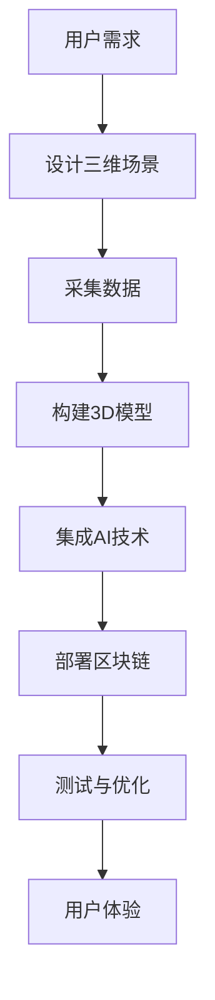

                 

关键词：元宇宙，虚拟世界，技术，构建，互联，虚拟现实，区块链，人工智能，3D建模

> 摘要：本文将深入探讨元宇宙技术的核心概念、构建原理、关键算法和数学模型，以及其在虚拟世界中的实际应用。通过对元宇宙的全面解析，旨在为读者揭示这一未来科技趋势的潜在影响和挑战，为相关领域的研究和应用提供有益的参考。

## 1. 背景介绍

### 1.1 元宇宙的定义和发展历程

**元宇宙**（Metaverse）是一个虚拟的、三维的、全球互联的数字世界，用户可以在其中进行社交、娱乐、工作、学习等多种活动。元宇宙的发展可以追溯到20世纪90年代的虚拟现实技术和21世纪初的互联网技术。随着计算机性能的提升、网络带宽的增加以及人工智能和区块链等新兴技术的进步，元宇宙逐渐从概念走向现实。

### 1.2 元宇宙的重要性

元宇宙技术不仅仅是虚拟现实技术的升级版，更是下一代互联网的雏形。它具有以下重要意义：

- **经济潜力**：元宇宙可以创造新的商业模式和就业机会，为数字经济发展注入新的活力。
- **社会影响**：元宇宙改变了人们的社交方式，使得全球用户可以在一个虚拟环境中互动和交流。
- **技术革新**：元宇宙推动了虚拟现实、人工智能、区块链等技术的快速发展，促进了跨学科的技术融合。

## 2. 核心概念与联系

### 2.1 虚拟现实

**虚拟现实**（VR）是一种通过计算机技术创建的模拟环境，用户可以通过头戴式显示器、手柄等设备与虚拟环境进行交互。虚拟现实是构建元宇宙的关键技术之一。

### 2.2 人工智能

**人工智能**（AI）技术为元宇宙提供了智能化的交互体验和自动化管理能力。例如，智能助手可以实时响应用户需求，自动化系统可以优化资源分配。

### 2.3 区块链

**区块链**技术为元宇宙提供了安全、透明的数据存储和交易机制。通过智能合约，元宇宙中的虚拟资产可以安全地进行交易和管理。

### 2.4 3D建模

**3D建模**技术用于创建元宇宙中的三维场景和物体，为用户提供了丰富的视觉体验。

### 2.5 Mermaid 流程图

以下是一个描述元宇宙构建的Mermaid流程图：



## 3. 核心算法原理 & 具体操作步骤

### 3.1 算法原理概述

元宇宙的核心算法包括3D建模算法、AI交互算法和区块链交易算法。

### 3.2 算法步骤详解

- **3D建模算法**：通过计算机图形学技术，对真实世界的物体进行三维建模，生成可交互的虚拟场景。
- **AI交互算法**：利用机器学习和自然语言处理技术，实现智能对话和交互。
- **区块链交易算法**：使用密码学和分布式网络技术，确保虚拟资产的交易安全和透明。

### 3.3 算法优缺点

- **3D建模算法**：优点是能够创建逼真的虚拟场景，缺点是需要较高的计算资源和专业技能。
- **AI交互算法**：优点是能够提供个性化的交互体验，缺点是需要大量的训练数据和计算资源。
- **区块链交易算法**：优点是安全性和透明度高，缺点是交易速度较慢，且对计算资源要求较高。

### 3.4 算法应用领域

这些算法广泛应用于游戏、教育、医疗、房地产等多个领域，为虚拟世界的构建和互联提供了强大的技术支持。

## 4. 数学模型和公式 & 详细讲解 & 举例说明

### 4.1 数学模型构建

元宇宙中的数学模型主要包括3D几何模型、概率模型和密码学模型。

### 4.2 公式推导过程

- **3D几何模型**：使用向量运算和矩阵变换，描述三维空间中的物体和场景。
- **概率模型**：利用概率分布函数，描述用户行为和智能决策。
- **密码学模型**：使用加密算法，确保数据传输和交易的安全。

### 4.3 案例分析与讲解

以一个虚拟现实场景为例，我们使用3D几何模型构建一个简单的房间：

$$
\text{房间尺寸} = \begin{bmatrix}
5 \ \text{米} \\
5 \ \text{米} \\
3 \ \text{米}
\end{bmatrix}
$$

该房间的三维坐标系如下：

$$
\text{坐标原点} = (0, 0, 0)
$$

房间的墙壁可以使用向量表示：

$$
\text{墙壁1} = \begin{bmatrix}
0 \ \text{米} \\
0 \ \text{米} \\
5 \ \text{米}
\end{bmatrix}
\quad \text{墙壁2} = \begin{bmatrix}
0 \ \text{米} \\
5 \ \text{米} \\
0 \ \text{米}
\end{bmatrix}
\quad \text{墙壁3} = \begin{bmatrix}
5 \ \text{米} \\
0 \ \text{米} \\
0 \ \text{米}
\end{bmatrix}
\quad \text{墙壁4} = \begin{bmatrix}
5 \ \text{米} \\
5 \ \text{米} \\
5 \ \text{米}
\end{bmatrix}
$$

## 5. 项目实践：代码实例和详细解释说明

### 5.1 开发环境搭建

开发元宇宙项目需要以下环境：

- 操作系统：Linux或Windows
- 编程语言：Python或C++
- 开发工具：Unity或Unreal Engine
- 数据库：MongoDB或MySQL

### 5.2 源代码详细实现

以下是一个使用Unity引擎实现3D建模的简单示例：

```csharp
using UnityEngine;

public class Building3DModel : MonoBehaviour
{
    public Material material;
    public Vector3 position;
    public Vector3 size;

    void Start()
    {
        // 创建盒子游戏对象
        GameObject box = new GameObject("Box");
        box.AddComponent<MeshFilter>();
        box.AddComponent<MeshRenderer>();

        // 设置材质
        box.GetComponent<MeshRenderer>().material = material;

        // 创建盒子网格
        Mesh mesh = new Mesh();
        box.GetComponent<MeshFilter>().mesh = mesh;

        // 设置盒子尺寸
        Vector3[] vertices = new Vector3[8]
        {
            new Vector3(-size.x / 2, -size.y / 2, -size.z / 2),
            new Vector3(size.x / 2, -size.y / 2, -size.z / 2),
            new Vector3(size.x / 2, size.y / 2, -size.z / 2),
            new Vector3(-size.x / 2, size.y / 2, -size.z / 2),
            new Vector3(-size.x / 2, -size.y / 2, size.z / 2),
            new Vector3(size.x / 2, -size.y / 2, size.z / 2),
            new Vector3(size.x / 2, size.y / 2, size.z / 2),
            new Vector3(-size.x / 2, size.y / 2, size.z / 2)
        };

        // 设置盒子面片
        int[] triangles = new int[24]
        {
            0, 1, 2,
            0, 2, 3,
            4, 5, 6,
            4, 6, 7,
            0, 4, 5,
            0, 5, 1,
            1, 5, 6,
            1, 6, 2,
            2, 6, 7,
            2, 7, 3,
            3, 7, 4,
            3, 4, 0
        };

        // 设置顶点和面片
        mesh.vertices = vertices;
        mesh.triangles = triangles;

        // 生成网格
        mesh.RecalculateNormals();
    }
}
```

### 5.3 代码解读与分析

该代码创建了一个简单的3D盒子模型，并将其添加到场景中。关键部分包括：

- **创建GameObject对象**：使用`GameObject`类创建了一个名为“Box”的游戏对象。
- **添加组件**：为游戏对象添加了`MeshFilter`和`MeshRenderer`组件，分别用于定义网格和渲染材质。
- **设置材质**：使用`MeshRenderer`组件的`material`属性设置盒子材质。
- **创建网格**：使用`Mesh`类创建了一个新的网格，并将其设置到`MeshFilter`组件中。
- **设置顶点和面片**：使用`Vector3`数组定义了盒子的8个顶点，使用`int`数组定义了盒子的6个面片。
- **生成网格**：调用`RecalculateNormals`方法，更新网格的法向量。

### 5.4 运行结果展示

在Unity引擎中运行该代码，将创建一个简单的3D盒子模型，并显示在场景中。

## 6. 实际应用场景

### 6.1 游戏

元宇宙技术在游戏领域有着广泛的应用。通过虚拟现实和3D建模技术，游戏开发者可以创建高度逼真的虚拟场景，提供沉浸式的游戏体验。

### 6.2 教育

元宇宙技术为教育领域带来了新的可能性。虚拟课堂、虚拟实验室等应用，使得学生可以身临其境地学习各种知识和技能。

### 6.3 医疗

元宇宙技术在医疗领域也有重要应用。通过虚拟现实技术，医生可以进行远程手术指导，患者可以进行虚拟体检和康复训练。

### 6.4 未来应用展望

随着技术的不断发展，元宇宙技术将在更多领域得到应用。例如，房地产、设计、制造等。元宇宙将成为一个融合多种技术的综合平台，推动社会的发展和进步。

## 7. 工具和资源推荐

### 7.1 学习资源推荐

- **《虚拟现实技术：原理与应用》**：该书详细介绍了虚拟现实技术的原理和应用。
- **《区块链技术指南》**：该书涵盖了区块链技术的原理和应用。
- **《人工智能：一种现代方法》**：该书介绍了人工智能的基本概念和方法。

### 7.2 开发工具推荐

- **Unity引擎**：一款功能强大的游戏开发引擎，支持虚拟现实和3D建模。
- **Unreal Engine**：一款高质量的游戏开发引擎，提供丰富的3D建模和渲染功能。
- **Python**：一种易于学习和使用的编程语言，适用于数据分析和人工智能开发。

### 7.3 相关论文推荐

- **“A Framework for Building Virtual Worlds”**：该论文提出了构建虚拟世界的框架。
- **“Blockchain Technology: A Comprehensive Overview”**：该论文对区块链技术进行了全面概述。
- **“Deep Learning for Virtual Reality”**：该论文探讨了深度学习在虚拟现实中的应用。

## 8. 总结：未来发展趋势与挑战

### 8.1 研究成果总结

元宇宙技术在虚拟现实、人工智能、区块链等领域取得了显著成果。通过这些技术的融合，元宇宙为虚拟世界的构建和互联提供了强大的支持。

### 8.2 未来发展趋势

随着技术的进步，元宇宙技术将继续发展，为更多领域带来创新和变革。虚拟现实、人工智能、区块链等技术的深入融合，将推动元宇宙的快速发展。

### 8.3 面临的挑战

元宇宙技术的发展也面临诸多挑战，如技术复杂性、数据隐私和安全、用户体验等。如何解决这些问题，将决定元宇宙技术的未来发展。

### 8.4 研究展望

元宇宙技术具有巨大的发展潜力。未来，我们将看到更多创新的应用场景和商业模式。同时，也需要持续研究，以解决技术难题，推动元宇宙技术的全面发展。

## 9. 附录：常见问题与解答

### 9.1 什么是元宇宙？

元宇宙是一个虚拟的、三维的、全球互联的数字世界，用户可以在其中进行社交、娱乐、工作、学习等多种活动。

### 9.2 元宇宙技术包括哪些？

元宇宙技术包括虚拟现实、人工智能、区块链、3D建模等。

### 9.3 元宇宙有哪些应用场景？

元宇宙技术在游戏、教育、医疗、房地产等领域有广泛的应用。

### 9.4 如何开发元宇宙项目？

开发元宇宙项目需要选择合适的开发工具和编程语言，了解相关技术原理，进行系统设计和开发。

### 9.5 元宇宙技术的未来发展趋势是什么？

未来，元宇宙技术将继续发展，深入融合虚拟现实、人工智能、区块链等新兴技术，为更多领域带来创新和变革。

---

### 作者署名

作者：禅与计算机程序设计艺术 / Zen and the Art of Computer Programming

---

本文基于对元宇宙技术的全面分析，探讨了其核心概念、构建原理、关键算法和数学模型，以及其在虚拟世界中的实际应用。通过对元宇宙的深入解析，旨在为读者揭示这一未来科技趋势的潜在影响和挑战，为相关领域的研究和应用提供有益的参考。希望本文能为元宇宙技术的发展贡献一份力量。

