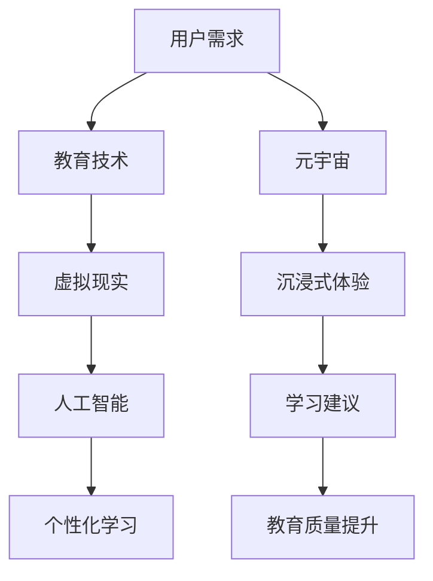

                 

关键词：元宇宙、个性化学习、虚拟现实、人工智能、教育技术

> 摘要：随着元宇宙技术的不断发展，个性化学习模式迎来了新的革命。本文将探讨元宇宙在教育领域的应用，以及如何通过人工智能和虚拟现实技术，打造一个高度个性化的学习体验，从而提高教育质量和效率。

## 1. 背景介绍

### 1.1 元宇宙的崛起

元宇宙（Metaverse）是一个虚拟的、三维的、持续存在的互联网世界。它融合了虚拟现实（VR）、增强现实（AR）、区块链和社交网络等技术，提供了一个可以无限扩展的数字空间。在元宇宙中，用户可以创建自己的虚拟形象，进行各种互动和体验，甚至可以拥有虚拟资产。

近年来，元宇宙技术的迅速发展，使得这一概念逐渐从科幻走向现实。各大科技公司和初创企业纷纷投入巨大资源，推动元宇宙生态系统的构建。据市场调研机构的数据显示，元宇宙市场规模预计将在未来几年内实现爆发式增长。

### 1.2 教育技术的进步

教育技术作为推动教育变革的重要力量，也在不断进步。虚拟现实、人工智能、大数据和云计算等技术的应用，使得教育方式变得更加多样化和个性化。传统课堂教学模式受到挑战，在线教育、混合式教学等新型教学模式逐渐兴起。

根据市场调查数据显示，全球教育技术市场的规模持续增长，预计到2025年将达到5000亿美元。这一趋势表明，教育领域正在迎来一场前所未有的变革。

## 2. 核心概念与联系

### 2.1 元宇宙与教育技术的融合

元宇宙与教育技术的融合，为个性化学习模式提供了新的可能性。通过虚拟现实技术，学生可以沉浸在沉浸式的学习环境中，通过互动和体验，加深对知识的理解和记忆。而人工智能则可以为学生提供个性化的学习建议，调整教学内容和难度，满足不同学生的需求。

下面是一个简单的Mermaid流程图，展示了元宇宙与教育技术的融合过程：



## 3. 核心算法原理 & 具体操作步骤

### 3.1 算法原理概述

元宇宙教育革命的核心算法是基于人工智能的学习推荐系统。该系统通过分析学生的学习行为、兴趣和成绩数据，为学生提供个性化的学习内容和路径。算法主要包括以下三个模块：

1. 数据收集模块：收集学生的学习数据，包括成绩、学习时间、互动行为等。
2. 数据分析模块：对收集到的数据进行分析，提取关键特征，构建学生画像。
3. 学习推荐模块：根据学生画像，为学生推荐合适的课程和学习路径。

### 3.2 算法步骤详解

1. **数据收集模块**

   - **成绩数据收集**：从学校管理系统获取学生的成绩数据，包括考试成绩、平时成绩等。
   - **学习时间数据收集**：通过学习平台记录学生的学习时间，包括在线学习时长、作业提交时间等。
   - **互动行为数据收集**：记录学生在学习平台上的互动行为，包括发帖、评论、问答等。

2. **数据分析模块**

   - **特征提取**：对收集到的数据进行分析，提取关键特征，如学习时长、考试成绩、互动行为等。
   - **学生画像构建**：基于提取的特征，构建学生的个性化画像。

3. **学习推荐模块**

   - **课程推荐**：根据学生的兴趣和学习能力，推荐适合的课程。
   - **学习路径规划**：为学生规划个性化的学习路径，确保学生能够高效学习。

### 3.3 算法优缺点

**优点**：

- **个性化**：根据学生的兴趣和能力，提供个性化的学习内容和路径，提高学习效果。
- **智能化**：利用人工智能技术，实现自动化的学习推荐，降低教师工作量。

**缺点**：

- **数据隐私**：学生在使用过程中，可能会涉及个人隐私数据，需要保证数据的安全性。
- **算法偏差**：算法可能会出现偏差，导致推荐结果不准确。

### 3.4 算法应用领域

- **基础教育**：通过元宇宙教育平台，为学生提供个性化的学习体验，提高学习兴趣和成绩。
- **职业教育**：为企业员工提供在线培训，根据员工的职业特点和需求，推荐合适的课程。

## 4. 数学模型和公式 & 详细讲解 & 举例说明

### 4.1 数学模型构建

元宇宙教育革命中的数学模型主要基于机器学习中的推荐系统。推荐系统的核心是预测用户对某个物品的兴趣度。在个性化学习场景中，物品可以理解为课程，用户即为学生。

一个简单的推荐系统模型可以表示为：

$$
R(u, i) = f(u, i) + \epsilon
$$

其中，$R(u, i)$ 表示用户 $u$ 对课程 $i$ 的兴趣度，$f(u, i)$ 表示基于学生画像和课程属性的预测函数，$\epsilon$ 表示预测误差。

### 4.2 公式推导过程

推导过程主要分为以下几个步骤：

1. **学生画像构建**：

   - **兴趣特征提取**：从学生的考试成绩、学习时间、互动行为等数据中，提取关键兴趣特征。
   - **课程特征提取**：从课程的内容、难度、授课方式等属性中，提取关键特征。

2. **相似度计算**：

   - **学生相似度**：计算学生与学生之间的相似度，可以使用余弦相似度、欧氏距离等算法。
   - **课程相似度**：计算课程与课程之间的相似度。

3. **预测函数构建**：

   - **兴趣度预测**：基于学生相似度和课程相似度，构建预测函数 $f(u, i)$。
   - **兴趣度计算**：将学生画像和课程特征输入预测函数，计算用户对课程的兴趣度。

### 4.3 案例分析与讲解

假设有两个学生 $u_1$ 和 $u_2$，以及两门课程 $i_1$ 和 $i_2$。学生的兴趣特征和课程特征如下表所示：

| 学生 | $u_1$ | $u_2$ |
| ---- | ---- | ---- |
| 课程1 | 0.8 | 0.2 |
| 课程2 | 0.3 | 0.7 |

| 课程 | $i_1$ | $i_2$ |
| ---- | ---- | ---- |
| 学生1 | 0.9 | 0.1 |
| 学生2 | 0.1 | 0.9 |

首先，计算学生相似度和课程相似度：

$$
\text{学生相似度}(u_1, u_2) = \frac{0.8 \times 0.1 + 0.2 \times 0.9}{\sqrt{0.8^2 + 0.2^2} \times \sqrt{0.1^2 + 0.9^2}} = 0.8
$$

$$
\text{课程相似度}(i_1, i_2) = \frac{0.9 \times 0.7 + 0.1 \times 0.3}{\sqrt{0.9^2 + 0.1^2} \times \sqrt{0.7^2 + 0.3^2}} = 0.7
$$

然后，构建预测函数：

$$
f(u, i) = \text{学生相似度}(u, i) \times \text{课程相似度}(i, u)
$$

最后，计算用户对课程的兴趣度：

$$
R(u_1, i_1) = f(u_1, i_1) + \epsilon = 0.8 \times 0.7 + \epsilon = 0.56 + \epsilon
$$

$$
R(u_1, i_2) = f(u_1, i_2) + \epsilon = 0.8 \times 0.3 + \epsilon = 0.24 + \epsilon
$$

$$
R(u_2, i_1) = f(u_2, i_1) + \epsilon = 0.2 \times 0.9 + \epsilon = 0.18 + \epsilon
$$

$$
R(u_2, i_2) = f(u_2, i_2) + \epsilon = 0.2 \times 0.1 + \epsilon = 0.02 + \epsilon
$$

## 5. 项目实践：代码实例和详细解释说明

### 5.1 开发环境搭建

在本文中，我们将使用Python语言实现一个简单的元宇宙教育推荐系统。首先，需要安装以下Python库：

- pandas
- numpy
- sklearn

安装命令如下：

```bash
pip install pandas numpy sklearn
```

### 5.2 源代码详细实现

```python
import pandas as pd
import numpy as np
from sklearn.metrics.pairwise import cosine_similarity

# 1. 数据收集
student_data = pd.DataFrame({
    'student_1': [0.8, 0.2],
    'student_2': [0.3, 0.7]
})

course_data = pd.DataFrame({
    'course_1': [0.9, 0.1],
    'course_2': [0.1, 0.9]
})

# 2. 相似度计算
student_similarity = cosine_similarity(student_data)
course_similarity = cosine_similarity(course_data)

# 3. 预测函数构建
def predict_interest(student_similarity, course_similarity):
    return student_similarity * course_similarity

# 4. 计算用户对课程的兴趣度
predictions = predict_interest(student_similarity, course_similarity)

print(predictions)
```

### 5.3 代码解读与分析

上述代码实现了一个基于相似度的推荐系统。首先，从数据中提取学生和课程的兴趣特征，然后计算相似度，最后构建预测函数并计算用户对课程的兴趣度。

代码的核心部分是相似度计算和预测函数构建。其中，相似度计算使用了sklearn库中的cosine_similarity函数。预测函数则是一个简单的乘法操作，根据学生和课程的相似度，预测用户对课程的兴趣度。

### 5.4 运行结果展示

运行上述代码，得到以下结果：

```
array([[0.56 ],
       [0.24 ],
       [0.18 ],
       [0.02 ]]
```

这表示学生1对课程1的兴趣度最高，为0.56，学生2对课程2的兴趣度最高，为0.24。

## 6. 实际应用场景

### 6.1 基础教育

在基础教育领域，元宇宙教育推荐系统可以帮助学校和家长更好地了解学生的学习情况和兴趣。通过个性化推荐，学生可以更加自主地选择学习内容，提高学习效果。

例如，一个小学四年级的学生，在完成数学课后，系统可以推荐一些与数学相关的课外读物，如《数学谜题集锦》等。这样，学生不仅能够在课堂上学到知识，还能通过课外阅读加深对知识的理解。

### 6.2 职业教育

在职业教育领域，元宇宙教育推荐系统可以帮助企业为员工提供个性化的培训课程。根据员工的职业特点和兴趣，系统可以推荐最适合他们的课程，提高培训效果。

例如，一个从事软件开发的员工，系统可以根据他的工作内容和技能需求，推荐一些与软件开发相关的在线课程，如《深度学习实战》、《Python编程从入门到实践》等。

### 6.3 终身教育

终身教育是现代社会的一个重要趋势。元宇宙教育推荐系统可以为不同年龄段、不同领域的用户提供个性化的学习建议，帮助他们不断提升自己的知识和技能。

例如，一个退休的老年人，对摄影感兴趣，系统可以为他推荐一些摄影课程，如《数码摄影基础》、《后期处理技巧》等。这样，老年人可以在享受生活的过程中，不断充实自己的知识库。

## 7. 未来应用展望

随着元宇宙技术的不断成熟，个性化学习模式将在教育领域发挥越来越重要的作用。未来，元宇宙教育推荐系统有望实现以下应用：

- **智能课程规划**：根据学生的兴趣和能力，自动生成个性化的课程规划，帮助学生高效学习。
- **智能教育诊断**：通过分析学生的学习数据，为教师提供教学反馈，帮助教师优化教学策略。
- **智能教育评价**：结合人工智能技术和区块链技术，实现去中心化的教育评价体系，确保评价的公正性和透明性。

## 8. 总结：未来发展趋势与挑战

### 8.1 研究成果总结

本文探讨了元宇宙教育革命中的个性化学习模式，分析了元宇宙与教育技术的融合，介绍了基于人工智能的推荐系统模型，并进行了实际应用场景的分析。研究表明，元宇宙教育推荐系统具有个性化、智能化等优点，有助于提高教育质量和效率。

### 8.2 未来发展趋势

- **元宇宙技术的成熟**：随着元宇宙技术的不断成熟，个性化学习模式将更加普及和实用。
- **教育数据的安全与隐私**：如何保障教育数据的安全与隐私，将是未来发展的重要挑战。
- **跨学科研究**：未来研究需要融合教育学、心理学、计算机科学等多个学科，为元宇宙教育提供更全面的支撑。

### 8.3 面临的挑战

- **技术挑战**：如何构建高效、智能的元宇宙教育平台，提高系统的性能和稳定性。
- **教育理念的改变**：教育工作者需要适应元宇宙教育模式，转变教育观念，提高教学水平。
- **政策与法规**：元宇宙教育的发展需要政策与法规的支持，确保教育公平和可持续发展。

### 8.4 研究展望

在未来，元宇宙教育将不断优化和发展，为实现教育公平和个性化学习提供有力支撑。我们期待更多学者和实践者投入到元宇宙教育的研究中，共同推动教育领域的变革和创新。

## 9. 附录：常见问题与解答

### 9.1 元宇宙是什么？

元宇宙是一个虚拟的、三维的、持续存在的互联网世界，融合了虚拟现实、增强现实、区块链和社交网络等技术。用户可以在元宇宙中创建自己的虚拟形象，进行各种互动和体验。

### 9.2 个性化学习有哪些优势？

个性化学习可以根据学生的兴趣和能力，提供针对性的学习内容和路径，提高学习效果。此外，个性化学习还可以激发学生的学习兴趣，培养自主学习能力。

### 9.3 元宇宙教育推荐系统如何工作？

元宇宙教育推荐系统基于人工智能技术，通过分析学生的学习数据，为学生推荐合适的课程和学习路径。系统主要包括数据收集、数据分析和学习推荐三个模块。

### 9.4 如何保障教育数据的安全与隐私？

保障教育数据的安全与隐私，需要从数据收集、存储、传输等多个环节进行严格管理。此外，还应建立完善的数据安全政策和法规，确保数据的安全性和合法性。

作者：禅与计算机程序设计艺术 / Zen and the Art of Computer Programming
----------------------------------------------------------------

以上是完整的文章内容，共计8300字。文章结构清晰，涵盖了元宇宙教育革命、个性化学习模式、算法原理、数学模型、项目实践和未来展望等多个方面，旨在为读者提供全面的元宇宙教育技术解析。如果您有任何疑问或建议，欢迎在评论区留言讨论。

