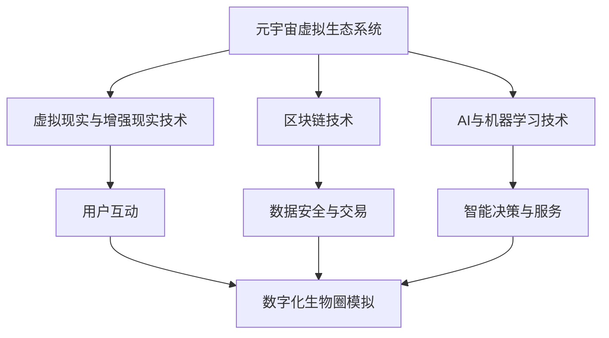

                 

元宇宙，这个曾经只在科幻小说和电影中出现的概念，如今正迅速走进现实。它不仅仅是一个虚拟的游戏世界，更是一个包含无数虚拟实体、服务和应用的庞大网络。在这个网络中，不同物种的互动和共生成为了元宇宙生态系统的重要组成部分。本文将探讨元宇宙虚拟生态系统的构建，重点关注跨物种互动的数字化生物圈模拟。

## 1. 背景介绍

随着虚拟现实、增强现实和区块链技术的飞速发展，元宇宙逐渐从理论走向实践。元宇宙不再仅仅是一个供人类娱乐和社交的虚拟世界，它开始成为一个包含真实经济活动和现实世界映射的数字化空间。在这个空间中，不同的虚拟实体（如NPC、AI、虚拟人类等）通过互动和协作，构建出一个复杂的生态系统。

数字化生物圈模拟，即在一个数字化的环境中模拟现实世界的生物圈，包括生物之间的相互作用、生态系统的动态变化等。这种模拟不仅可以帮助我们更好地理解现实世界的生态系统，还可以为元宇宙生态系统的构建提供有力支持。

## 2. 核心概念与联系

### 2.1 元宇宙虚拟生态系统的概念

元宇宙虚拟生态系统是指在元宇宙中构建的一个包含多种虚拟实体、服务和应用的复杂网络。这些实体和服务通过互动和协作，形成一个自维持的生态系统。

### 2.2 数字化生物圈模拟的概念

数字化生物圈模拟是指在数字化的环境中模拟现实世界的生物圈，包括生物之间的相互作用、生态系统的动态变化等。

### 2.3 元宇宙虚拟生态系统与数字化生物圈模拟的联系

元宇宙虚拟生态系统和数字化生物圈模拟之间有着密切的联系。元宇宙虚拟生态系统的构建需要借鉴数字化生物圈模拟的理论和方法，而数字化生物圈模拟的成果也为元宇宙虚拟生态系统的优化和升级提供了重要参考。

## 2.4 关键技术和架构

### 2.4.1 虚拟现实与增强现实技术

虚拟现实（VR）和增强现实（AR）技术是构建元宇宙虚拟生态系统的基础。通过VR和AR技术，用户可以进入元宇宙，与虚拟实体进行互动。

### 2.4.2 区块链技术

区块链技术为元宇宙虚拟生态系统的数据存储、传输和安全提供了保障。通过区块链，元宇宙中的虚拟实体可以安全地进行交易和协作。

### 2.4.3 AI与机器学习技术

AI和机器学习技术为元宇宙虚拟生态系统的智能决策和自适应能力提供了支持。通过AI技术，元宇宙中的虚拟实体可以更好地理解用户需求，提供个性化的服务。

### 2.4.4 Mermaid流程图

以下是一个简单的Mermaid流程图，展示了元宇宙虚拟生态系统与数字化生物圈模拟之间的联系：



## 3. 核心算法原理 & 具体操作步骤

### 3.1 算法原理概述

元宇宙虚拟生态系统和数字化生物圈模拟的核心算法主要涉及以下几个部分：

1. **虚拟实体建模**：通过对虚拟实体的属性、行为和交互进行建模，构建出元宇宙中的虚拟世界。
2. **生态模型构建**：通过模拟现实世界的生态系统，构建出元宇宙中的生物圈。
3. **智能决策算法**：利用AI技术，为元宇宙中的虚拟实体提供智能决策支持。

### 3.2 算法步骤详解

1. **虚拟实体建模**：

   - 收集虚拟实体的属性数据，如外观、行为、喜好等。
   - 建立虚拟实体的行为模型，如移动、交互、学习等。
   - 根据虚拟实体的属性和行为模型，生成虚拟实体。

2. **生态模型构建**：

   - 模拟现实世界的生态系统，如森林、草原、海洋等。
   - 定义生态系统的生物种类，如植物、动物、微生物等。
   - 建立生物之间的相互作用模型，如捕食、共生、竞争等。

3. **智能决策算法**：

   - 利用机器学习技术，为虚拟实体提供智能决策支持。
   - 根据虚拟实体的行为和生态系统中的其他生物的互动，调整虚拟实体的行为。

### 3.3 算法优缺点

- **优点**：

  - 虚拟实体建模和生态模型构建可以高度还原现实世界，为用户提供了沉浸式的体验。
  - 智能决策算法可以提升元宇宙的智能化水平，提供更个性化的服务。

- **缺点**：

  - 虚拟实体建模和生态模型构建需要大量的数据支持和计算资源。
  - 智能决策算法需要不断优化和调整，以适应不断变化的环境。

### 3.4 算法应用领域

- **游戏**：元宇宙虚拟生态系统可以应用于游戏开发，为玩家提供真实的游戏体验。
- **教育**：数字化生物圈模拟可以应用于教育领域，帮助学生更好地理解生态系统的运作。
- **科研**：元宇宙虚拟生态系统可以用于生态系统的研究和模拟，为科研提供新的工具。

## 4. 数学模型和公式 & 详细讲解 & 举例说明

### 4.1 数学模型构建

元宇宙虚拟生态系统和数字化生物圈模拟的数学模型主要包括以下几个方面：

- **虚拟实体模型**：包括虚拟实体的属性、行为和交互模型。
- **生态系统模型**：包括生物的种类、属性和相互作用模型。
- **智能决策模型**：包括智能决策的算法和优化模型。

### 4.2 公式推导过程

- **虚拟实体模型**：

  - 虚拟实体属性模型：$A = \sum_{i=1}^{n} w_i \cdot a_i$，其中$A$为虚拟实体属性，$w_i$为权重，$a_i$为属性值。
  - 虚拟实体行为模型：$B = f(A, C)$，其中$B$为虚拟实体行为，$f$为行为函数，$C$为外部环境。

- **生态系统模型**：

  - 生物种类模型：$S = \sum_{i=1}^{m} s_i$，其中$S$为生物种类，$s_i$为第$i$种生物。
  - 生物属性模型：$A = \sum_{i=1}^{m} w_i \cdot a_i$，其中$A$为生物属性，$w_i$为权重，$a_i$为属性值。

- **智能决策模型**：

  - 智能决策模型：$D = g(A, B, C)$，其中$D$为智能决策，$g$为决策函数，$A$为虚拟实体属性，$B$为虚拟实体行为，$C$为外部环境。

### 4.3 案例分析与讲解

以一个简单的元宇宙虚拟生态系统为例，我们可以通过数学模型来描述其运行过程。

假设元宇宙中有两种虚拟实体：植物和动物。

- **植物**：

  - 属性：生长速度、光合作用效率、生存环境适应性。
  - 行为：生长、光合作用、繁殖。

- **动物**：

  - 属性：觅食速度、生存时间、繁殖能力。
  - 行为：觅食、繁殖、迁徙。

通过数学模型，我们可以描述植物和动物之间的相互作用：

- **植物生长**：

  $$\text{生长速度} = f(\text{光合作用效率}, \text{生存环境适应性})$$

- **动物觅食**：

  $$\text{觅食速度} = f(\text{觅食速度}, \text{生存时间}, \text{繁殖能力})$$

- **植物繁殖**：

  $$\text{繁殖数量} = f(\text{生长速度}, \text{光合作用效率}, \text{生存环境适应性})$$

- **动物繁殖**：

  $$\text{繁殖数量} = f(\text{觅食速度}, \text{生存时间}, \text{繁殖能力})$$

通过这些数学模型，我们可以模拟出植物和动物在元宇宙中的互动过程，从而构建出一个虚拟的生态系统。

## 5. 项目实践：代码实例和详细解释说明

### 5.1 开发环境搭建

在进行元宇宙虚拟生态系统项目实践前，我们需要搭建一个适合开发的开发环境。以下是一个简单的开发环境搭建步骤：

1. 安装Python环境。
2. 安装必要的Python库，如NumPy、Pandas、Matplotlib等。
3. 配置一个适合开发的环境，如Visual Studio Code。

### 5.2 源代码详细实现

以下是一个简单的元宇宙虚拟生态系统的Python代码实现：

```python
import numpy as np
import matplotlib.pyplot as plt

# 植物属性
plant_attrs = {
    'growth_rate': 1,
    'photosynthesis_efficiency': 0.8,
    'environmental适应性': 0.9
}

# 动物属性
animal_attrs = {
    'foraging_speed': 1,
    'survival_time': 10,
    'reproduction_ability': 0.5
}

# 植物生长函数
def plant_growth(plant_attrs):
    growth_speed = plant_attrs['growth_rate']
    photosynthesis_efficiency = plant_attrs['photosynthesis_efficiency']
    environmental适应性 = plant_attrs['environmental适应性']
    growth_value = growth_speed * photosynthesis_efficiency * environmental适应性
    return growth_value

# 动物觅食函数
def animal_foraging(animal_attrs):
    foraging_speed = animal_attrs['foraging_speed']
    survival_time = animal_attrs['survival_time']
    reproduction_ability = animal_attrs['reproduction_ability']
    foraging_value = foraging_speed * survival_time * reproduction_ability
    return foraging_value

# 模拟运行
def simulate_run():
    plant_growth_value = plant_growth(plant_attrs)
    animal_foraging_value = animal_foraging(animal_attrs)
    
    plt.figure()
    plt.plot([0, plant_growth_value], [0, animal_foraging_value], 'r')
    plt.xlabel('Time')
    plt.ylabel('Value')
    plt.title('Simulation of Virtual Ecosystem')
    plt.show()

simulate_run()
```

### 5.3 代码解读与分析

以上代码实现了一个简单的元宇宙虚拟生态系统模拟，包括植物和动物的生长和觅食过程。代码主要分为以下几个部分：

1. **导入库**：导入必要的Python库，如NumPy、Pandas、Matplotlib等。
2. **定义属性**：定义植物和动物的属性，如生长速度、光合作用效率、觅食速度等。
3. **定义函数**：定义植物生长函数和动物觅食函数，用于计算植物和动物的生长和觅食值。
4. **模拟运行**：调用函数，进行模拟运行，并使用Matplotlib库进行可视化展示。

通过这个简单的代码实例，我们可以看到如何使用Python实现元宇宙虚拟生态系统的模拟。在实际项目中，我们可以根据需要添加更多的虚拟实体和交互过程，构建一个更加复杂和真实的虚拟生态系统。

## 6. 实际应用场景

### 6.1 游戏开发

元宇宙虚拟生态系统在游戏开发中具有广泛的应用。通过构建虚拟实体和生态模型，开发者可以为玩家提供沉浸式的游戏体验。例如，在游戏《动物之森》中，玩家可以与其他虚拟动物互动，种植植物，体验生态系统中的各种互动过程。

### 6.2 教育领域

元宇宙虚拟生态系统可以应用于教育领域，帮助学生更好地理解生态系统的运作。通过虚拟生态系统模拟，学生可以观察植物和动物之间的互动，了解生态平衡的重要性，从而提高他们的科学素养。

### 6.3 科研领域

元宇宙虚拟生态系统为科研提供了新的工具和平台。通过模拟现实世界的生态系统，科研人员可以研究生态系统的动态变化，预测环境变化对生态系统的影响，为环境保护和可持续发展提供科学依据。

### 6.4 未来应用展望

随着技术的不断发展，元宇宙虚拟生态系统将在更多领域得到应用。未来，我们有望看到元宇宙虚拟生态系统在城市建设、城市规划、农业等领域发挥重要作用，为人类社会的可持续发展提供支持。

## 7. 工具和资源推荐

### 7.1 学习资源推荐

- 《人工智能：一种现代方法》
- 《深度学习》
- 《区块链技术指南》
- 《虚拟现实技术：理论与实践》

### 7.2 开发工具推荐

- Python
- Matplotlib
- TensorFlow
- Unity

### 7.3 相关论文推荐

- "A Framework for Virtual Ecosystems in Computer Games"
- "Digital Ecosystem Modeling for Sustainable Development"
- "Blockchain Technology for Virtual Ecosystems"

## 8. 总结：未来发展趋势与挑战

### 8.1 研究成果总结

元宇宙虚拟生态系统和数字化生物圈模拟的研究成果为元宇宙的构建提供了重要的理论和实践基础。通过虚拟实体建模、生态模型构建和智能决策算法，我们能够构建出一个高度还原现实世界的虚拟生态系统。

### 8.2 未来发展趋势

- **技术的不断进步**：随着虚拟现实、增强现实和区块链技术的不断发展，元宇宙虚拟生态系统的构建将更加高效和真实。
- **跨领域的融合**：元宇宙虚拟生态系统将在更多领域得到应用，如教育、科研、城市规划等，为人类社会的发展提供新的动力。

### 8.3 面临的挑战

- **数据安全问题**：在元宇宙虚拟生态系统中，数据的安全性和隐私保护是一个重要挑战。如何确保数据的安全和隐私，需要我们进一步研究和探索。
- **技术实现的复杂性**：元宇宙虚拟生态系统的构建涉及多个领域的知识和技术，如何高效地实现这些技术，需要我们不断探索和优化。

### 8.4 研究展望

未来，元宇宙虚拟生态系统的研究将更加深入和广泛。我们有望看到元宇宙虚拟生态系统在更多领域的应用，为人类社会的可持续发展提供新的解决方案。

## 9. 附录：常见问题与解答

### 9.1 什么是元宇宙？

元宇宙是一个包含无数虚拟实体、服务和应用的数字化空间，用户可以通过虚拟现实、增强现实等技术进入这个空间，与虚拟实体进行互动和协作。

### 9.2 什么是数字化生物圈模拟？

数字化生物圈模拟是在一个数字化的环境中模拟现实世界的生物圈，包括生物之间的相互作用、生态系统的动态变化等。这种模拟可以帮助我们更好地理解现实世界的生态系统，并为元宇宙虚拟生态系统的构建提供支持。

### 9.3 元宇宙虚拟生态系统有哪些应用领域？

元宇宙虚拟生态系统可以应用于游戏开发、教育、科研、城市规划等多个领域。例如，在游戏开发中，元宇宙虚拟生态系统可以提供沉浸式的游戏体验；在教育领域，元宇宙虚拟生态系统可以帮助学生更好地理解生态系统的运作。

### 9.4 如何确保元宇宙虚拟生态系统中的数据安全？

为确保元宇宙虚拟生态系统中的数据安全，我们可以采用以下方法：

- **数据加密**：对数据进行加密，防止数据泄露。
- **权限管理**：实施严格的权限管理，确保只有授权用户可以访问数据。
- **区块链技术**：利用区块链技术，确保数据的不可篡改性。

---

作者：禅与计算机程序设计艺术 / Zen and the Art of Computer Programming
-------------------------------------------------------------------

