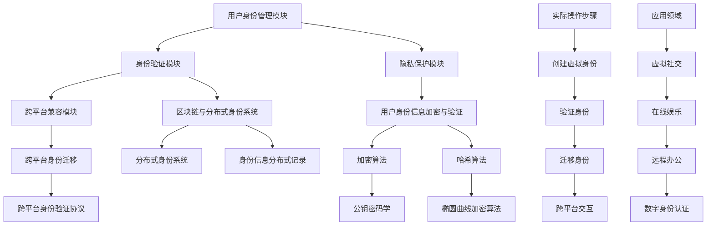

                 

关键词：元宇宙、身份流动、现实世界、虚拟世界、去中心化身份、标签消除、技术革新、社会影响、未来展望

> 摘要：本文将探讨元宇宙身份流动的概念，分析其在打破现实世界标签中的作用与影响。通过深入剖析核心概念和算法原理，本文旨在为读者呈现元宇宙身份流动的技术框架、数学模型、项目实践及未来应用前景。

## 1. 背景介绍

在过去的几十年里，互联网和信息技术的发展改变了人类的生活方式和社会结构。从最初的网页浏览，到社交媒体的普及，再到如今的元宇宙（Metaverse）概念的兴起，技术的不断演进推动了虚拟世界的快速发展。元宇宙，被看作是互联网的下一个进化形态，是一个由多个虚拟世界组成的集合，用户可以在其中进行各种互动和体验。

在元宇宙中，身份流动成为了一个关键议题。身份流动不仅涉及到用户在不同虚拟世界间的迁移，更重要的是，它涉及到用户在现实世界与虚拟世界之间的身份映射和切换。传统的身份体系往往受到现实世界的标签限制，例如职业、性别、年龄等，而在元宇宙中，用户可以拥有不同的虚拟身份，从而打破现实世界的标签束缚。

本文将围绕元宇宙身份流动这一主题，探讨其核心概念、技术架构、算法原理、数学模型以及实际应用场景。通过详细分析，我们希望为读者提供对元宇宙身份流动的全面了解，并探讨其对社会和技术的深远影响。

### 元宇宙的兴起与身份流动的重要性

元宇宙的兴起是技术进步和用户需求共同推动的结果。从早期的虚拟现实（VR）技术，到增强现实（AR）的应用，再到如今元宇宙概念的普及，虚拟世界的交互体验和沉浸感得到了极大的提升。元宇宙不再是一个单一的虚拟空间，而是由无数相互连接的虚拟世界构成的一个庞大网络。

在元宇宙中，身份流动变得尤为重要。身份流动不仅仅是指用户在不同虚拟世界之间的切换，更重要的是用户在虚拟世界与现实世界之间的身份映射和交互。传统身份体系中的标签，如职业、性别、年龄等，在元宇宙中可以被重新定义和打破。例如，一个在现实世界中是教师的用户，可以在元宇宙中扮演一个冒险家，或者是一个艺术家，这种身份的自由切换不仅增强了用户的体验，也为虚拟世界的多样化提供了可能。

此外，身份流动还涉及到用户隐私和数据安全的问题。在元宇宙中，用户身份的透明性和数据泄露的风险成为了一个重要的议题。如何实现用户身份的安全流动，同时保护用户的隐私，是一个亟待解决的问题。去中心化的身份管理技术，如区块链和分布式身份系统，提供了一种可能的解决方案，它们通过去中心化的方式，确保用户身份的安全和隐私。

总之，元宇宙的兴起带来了身份流动的重要性，这不仅影响了用户的体验和虚拟世界的多样性，也带来了隐私和安全等方面的挑战。理解身份流动的机制和实现方式，对于构建一个健康、可持续发展的元宇宙至关重要。

## 2. 核心概念与联系

在探讨元宇宙身份流动的过程中，理解核心概念和它们之间的联系是至关重要的。以下是本文将涉及的主要核心概念，以及它们在元宇宙身份流动体系中的具体作用和相互关系。

### 2.1 元宇宙

元宇宙（Metaverse）是一个虚拟的三维空间，由多个虚拟世界组成，用户可以通过各种设备（如VR头盔、AR眼镜等）进入并互动。它不仅仅是虚拟现实技术的扩展，而是一个更为复杂和多样化的虚拟生态系统。元宇宙中的用户可以通过虚拟身份进行社交、工作、娱乐等多样化的活动。

### 2.2 虚拟身份

虚拟身份是用户在元宇宙中的存在形式，可以是完全不同于其现实身份的角色或化身。虚拟身份的存在使得用户可以自由地探索和体验元宇宙中的不同环境和角色，不受现实世界中身份标签的限制。

### 2.3 身份流动性

身份流动性指的是用户在元宇宙中的身份可以自由地从一个虚拟世界转移到另一个虚拟世界。这种流动性打破了传统身份体系中的限制，使用户能够更加灵活地参与各种虚拟活动和社交互动。

### 2.4 去中心化身份管理

去中心化身份管理是通过分布式网络技术（如区块链）来管理用户身份信息的一种方式。去中心化身份管理能够确保用户身份信息的隐私和安全，同时允许用户在不同虚拟世界之间自由地流动和验证。

### 2.5 区块链

区块链是一种分布式账本技术，它能够记录和验证所有交易和信息。在元宇宙中，区块链被用来确保用户身份的不可篡改性和透明性，使得身份验证过程更加安全和可信。

### 2.6 分布式身份系统

分布式身份系统是一种基于区块链的去中心化身份管理方案。它通过创建和验证分布式身份，使得用户能够在不同虚拟世界之间安全地迁移和验证身份。

### 2.7 隐私保护

隐私保护是元宇宙身份流动中的一个关键问题。去中心化身份管理技术和加密算法被广泛用于保护用户隐私，确保用户身份信息不会被未授权的第三方访问。

### 2.8 身份验证

身份验证是确保用户身份真实性的过程。在元宇宙中，身份验证可以通过生物识别技术、密码学算法等多种方式实现，以确保用户的身份安全。

### 2.9 跨平台兼容性

跨平台兼容性指的是用户身份在不同平台和虚拟世界之间的一致性和兼容性。实现跨平台兼容性是确保用户在元宇宙中流畅体验的重要前提。

### 2.10 标签消除

标签消除是指打破传统身份标签（如职业、性别、年龄等）对用户在元宇宙中的限制。通过去中心化和隐私保护技术，元宇宙中的身份流动可以实现标签消除，使用户能够在虚拟世界中自由表达和探索。

### 2.11 技术架构

元宇宙身份流动的技术架构包括多个关键组件，如用户身份管理模块、身份验证模块、隐私保护模块和跨平台兼容模块等。这些组件共同构成了一个复杂的系统，确保用户身份流动的安全、高效和灵活。

### 2.12 数学模型

在元宇宙身份流动中，数学模型被用于描述用户身份信息的加密和验证过程。常见的数学模型包括公钥密码学、椭圆曲线加密算法等，它们在保障用户隐私和安全方面发挥着重要作用。

### 2.13 算法原理

算法原理是实现元宇宙身份流动的关键。常用的算法包括加密算法、哈希算法、身份验证协议等，这些算法共同保障了用户身份信息的保密性和完整性。

### 2.14 实际操作步骤

实际操作步骤是用户在元宇宙中进行身份流动的具体过程。包括创建虚拟身份、验证身份、迁移身份和跨平台交互等步骤。这些步骤确保了用户身份的流动性和安全性。

### 2.15 应用领域

元宇宙身份流动的应用领域非常广泛，包括虚拟社交、在线娱乐、远程办公、数字身份认证等。在不同的应用场景中，身份流动机制需要根据具体需求进行调整和优化。

通过以上核心概念和它们之间的相互关系，我们可以更深入地理解元宇宙身份流动的复杂性和重要性。接下来，我们将详细探讨元宇宙身份流动的技术架构、核心算法原理、数学模型以及具体操作步骤。

### 2.16 Mermaid 流程图

以下是一个用于展示元宇宙身份流动技术架构的 Mermaid 流程图，其中包含了各个核心概念和其相互关系：



通过这个流程图，我们可以清晰地看到元宇宙身份流动体系中各个核心模块之间的关系，以及它们在实际应用中的操作步骤。接下来，我们将进一步探讨核心算法原理、数学模型和具体操作步骤。

### 3. 核心算法原理 & 具体操作步骤

在元宇宙身份流动体系中，核心算法原理是其安全和效率的保障。以下将详细介绍这些核心算法的原理，并展示具体的操作步骤。

#### 3.1 算法原理概述

元宇宙身份流动的核心算法主要涉及以下几个方面：

1. **加密算法**：用于保护用户身份信息的隐私和完整性。常见的加密算法包括对称加密和非对称加密。
2. **哈希算法**：用于生成身份信息的唯一哈希值，以确保身份信息的不可篡改性。
3. **身份验证协议**：确保用户身份的真实性和有效性。常见的身份验证协议包括单点登录（SSO）和OAuth。
4. **区块链与分布式身份系统**：用于记录和验证用户身份信息，保障数据的安全性和透明性。

#### 3.2 算法步骤详解

**3.2.1 加密算法**

- **对称加密**：使用相同的密钥进行加密和解密。如AES（高级加密标准）。
  - 步骤：
    1. 用户生成密钥（K）。
    2. 使用密钥对用户身份信息进行加密（C = E(K, P)）。
    3. 将加密后的身份信息传输到元宇宙。
    4. 用户再次使用密钥对身份信息进行解密（P = D(K, C)）。
- **非对称加密**：使用一对密钥进行加密和解密，公钥加密，私钥解密。如RSA。
  - 步骤：
    1. 用户生成公钥（Ku）和私钥（Kr）。
    2. 使用公钥对用户身份信息进行加密（C = E(Ku, P)）。
    3. 将加密后的身份信息传输到元宇宙。
    4. 用户使用私钥对身份信息进行解密（P = D(Kr, C)）。

**3.2.2 哈希算法**

- **MD5**：生成128位的哈希值。
  - 步骤：
    1. 将用户身份信息输入到MD5算法中。
    2. 生成哈希值（H）。
    3. 将哈希值存储在区块链上。
- **SHA-256**：生成256位的哈希值。
  - 步骤：
    1. 将用户身份信息输入到SHA-256算法中。
    2. 生成哈希值（H）。
    3. 将哈希值存储在区块链上。

**3.2.3 身份验证协议**

- **单点登录（SSO）**：使用统一的身份验证机制，用户只需登录一次即可访问多个虚拟世界。
  - 步骤：
    1. 用户在SSO服务器进行身份验证。
    2. SSO服务器返回身份验证令牌。
    3. 用户使用身份验证令牌访问虚拟世界。
- **OAuth**：一种授权框架，允许第三方应用访问用户资源，同时保护用户隐私。
  - 步骤：
    1. 用户授权第三方应用访问其身份信息。
    2. 第三方应用向身份认证服务器请求访问令牌。
    3. 身份认证服务器验证请求并返回访问令牌。
    4. 第三方应用使用访问令牌访问用户身份信息。

**3.2.4 区块链与分布式身份系统**

- **区块链**：用于记录用户身份信息的不可篡改的交易历史。
  - 步骤：
    1. 用户生成身份信息并进行哈希处理。
    2. 将哈希值记录在区块链上。
    3. 区块链网络验证并确认交易。
- **分布式身份系统**：用于管理分布式身份信息。
  - 步骤：
    1. 用户创建分布式身份信息。
    2. 将身份信息上传到分布式网络。
    3. 分布式网络验证并存储身份信息。
    4. 用户在不同虚拟世界间迁移身份信息。

#### 3.3 算法优缺点

- **对称加密**：
  - 优点：加密速度快，资源消耗小。
  - 缺点：密钥管理复杂，安全性较低。
- **非对称加密**：
  - 优点：安全性高，适用于密钥交换和数字签名。
  - 缺点：加密和解密速度较慢，资源消耗大。
- **MD5**：
  - 优点：计算速度快，生成哈希值简单。
  - 缺点：安全性较低，易受碰撞攻击。
- **SHA-256**：
  - 优点：安全性高，生成哈希值复杂。
  - 缺点：计算速度较慢，资源消耗大。
- **单点登录（SSO）**：
  - 优点：简化登录流程，提高用户体验。
  - 缺点：单点故障风险，安全性依赖于SSO服务器。
- **OAuth**：
  - 优点：保护用户隐私，灵活性强。
  - 缺点：实现复杂，对第三方应用管理要求高。

#### 3.4 算法应用领域

- **加密算法**：广泛应用于保护用户身份信息和数据传输安全。
- **哈希算法**：用于生成唯一标识和确保数据完整性。
- **身份验证协议**：用于保障用户身份的真实性和访问控制。
- **区块链与分布式身份系统**：用于建立去中心化的身份验证和管理体系。

通过以上核心算法原理和具体操作步骤的介绍，我们可以看到元宇宙身份流动的技术框架是如何运作的。接下来，我们将进一步探讨数学模型和公式，以及其在元宇宙身份流动中的应用。

### 4. 数学模型和公式 & 详细讲解 & 举例说明

在元宇宙身份流动体系中，数学模型和公式是构建安全、高效和透明身份管理的关键。以下将详细讲解数学模型和公式的构建过程，并通过实际例子进行说明。

#### 4.1 数学模型构建

元宇宙身份流动的数学模型主要包括身份加密、哈希函数和身份验证等部分。以下分别介绍这些数学模型的基本原理和构建方法。

**4.1.1 身份加密模型**

身份加密模型主要依赖于加密算法，以确保用户身份信息的隐私和完整性。常见的加密算法包括对称加密和非对称加密。

1. **对称加密模型**：
   - **模型构建**：
     - 密钥生成：用户生成一对密钥（密钥对）。
       $$ K = (K_S, K_D) $$
       其中，$K_S$ 为会话密钥，$K_D$ 为解密密钥。
     - 加密过程：
       $$ C = E(K_S, P) $$
       其中，$C$ 为加密后的信息，$P$ 为明文信息，$E$ 为加密函数。
     - 解密过程：
       $$ P = D(K_D, C) $$
       其中，$D$ 为解密函数。
   - **实例说明**：
     假设用户ID为 "Alice"，用户生成的密钥对为 $(K_S, K_D)$，明文信息为 "Alice"。使用AES加密算法进行加密和解密：
     - 加密过程：
       $$ C = AES(K_S, "Alice") $$
       加密后的信息为 "AES密文"。
     - 解密过程：
       $$ "Alice" = AES^{-1}(K_D, "AES密文") $$

2. **非对称加密模型**：
   - **模型构建**：
     - 密钥生成：用户生成一对公钥和私钥。
       $$ K = (K_u, K_r) $$
       其中，$K_u$ 为公钥，$K_r$ 为私钥。
     - 加密过程：
       $$ C = E(K_u, P) $$
       其中，$C$ 为加密后的信息，$P$ 为明文信息，$E$ 为加密函数。
     - 解密过程：
       $$ P = D(K_r, C) $$
       其中，$D$ 为解密函数。
   - **实例说明**：
     假设用户ID为 "Alice"，用户生成的公钥和私钥对为 $(K_u, K_r)$，明文信息为 "Alice"。使用RSA加密算法进行加密和解密：
     - 加密过程：
       $$ C = RSA(K_u, "Alice") $$
       加密后的信息为 "RSA密文"。
     - 解密过程：
       $$ "Alice" = RSA^{-1}(K_r, "RSA密文") $$

**4.1.2 哈希函数模型**

哈希函数模型用于生成身份信息的唯一哈希值，以确保身份信息的不可篡改性。常见的哈希函数包括MD5和SHA-256。

- **模型构建**：
  - 哈希过程：
    $$ H = Hash(P) $$
    其中，$H$ 为哈希值，$P$ 为明文信息，$Hash$ 为哈希函数。
  - **实例说明**：
    假设用户ID为 "Alice"，使用SHA-256哈希函数进行哈希处理：
    $$ H = SHA-256("Alice") $$
    生成的哈希值为 "SHA-256哈希值"。

**4.1.3 身份验证模型**

身份验证模型用于确保用户身份的真实性和有效性。常见的身份验证协议包括单点登录（SSO）和OAuth。

- **模型构建**：
  - SSO模型：
    - 验证过程：
      $$ A = SSO(U, P) $$
      其中，$A$ 为身份验证结果，$U$ 为用户名，$P$ 为密码，$SSO$ 为单点登录协议。
    - **实例说明**：
      假设用户 "Alice" 在SSO服务器进行身份验证，用户名为 "alice"，密码为 "alice123"：
      $$ A = SSO("alice", "alice123") $$
      验证结果为 "身份验证通过"。
  - OAuth模型：
    - 验证过程：
      $$ A = OAuth(U, P, T) $$
      其中，$A$ 为身份验证结果，$U$ 为用户名，$P$ 为密码，$T$ 为访问令牌，$OAuth$ 为OAuth协议。
    - **实例说明**：
      假设用户 "Alice" 使用OAuth协议进行身份验证，用户名为 "alice"，密码为 "alice123"，访问令牌为 "token123"：
      $$ A = OAuth("alice", "alice123", "token123") $$
      验证结果为 "身份验证通过"。

#### 4.2 公式推导过程

以下是对上述数学模型和公式的推导过程：

1. **对称加密模型**：

   - **加密公式推导**：
     $$ C = E(K_S, P) $$
     加密函数 $E$ 通常为AES加密算法：
     $$ C = AES(K_S, P) $$
     AES加密算法的密钥长度为128位，加密过程如下：
     $$ C = AES_{128}(K_S, P) $$
     其中，$K_S$ 为128位密钥，$P$ 为128位明文信息。

   - **解密公式推导**：
     $$ P = D(K_D, C) $$
     解密函数 $D$ 同样为AES加密算法：
     $$ P = AES(K_D, C) $$
     AES解密算法的密钥长度也为128位，解密过程如下：
     $$ P = AES_{128}(K_D, C) $$
     其中，$K_D$ 为128位密钥，$C$ 为128位密文信息。

2. **非对称加密模型**：

   - **加密公式推导**：
     $$ C = E(K_u, P) $$
     加密函数 $E$ 通常为RSA加密算法：
     $$ C = RSA(K_u, P) $$
     RSA加密算法的公钥长度为2048位，加密过程如下：
     $$ C = RSA_{2048}(K_u, P) $$
     其中，$K_u$ 为2048位公钥，$P$ 为明文信息。

   - **解密公式推导**：
     $$ P = D(K_r, C) $$
     解密函数 $D$ 同样为RSA加密算法：
     $$ P = RSA(K_r, C) $$
     RSA解密算法的私钥长度也为2048位，解密过程如下：
     $$ P = RSA_{2048}(K_r, C) $$
     其中，$K_r$ 为2048位私钥，$C$ 为2048位密文信息。

3. **哈希函数模型**：

   - **哈希公式推导**：
     $$ H = Hash(P) $$
     哈希函数 $Hash$ 通常为SHA-256：
     $$ H = SHA-256(P) $$
     SHA-256哈希函数将输入数据映射为256位的哈希值：
     $$ H = SHA-256_{256}(P) $$
     其中，$P$ 为输入数据。

4. **身份验证模型**：

   - **SSO模型推导**：
     $$ A = SSO(U, P) $$
     SSO协议通常涉及用户名和密码的验证：
     $$ A = SSO(U, P) $$
     其中，$U$ 为用户名，$P$ 为密码，$A$ 为身份验证结果。

   - **OAuth模型推导**：
     $$ A = OAuth(U, P, T) $$
     OAuth协议涉及用户名、密码和访问令牌的验证：
     $$ A = OAuth(U, P, T) $$
     其中，$U$ 为用户名，$P$ 为密码，$T$ 为访问令牌，$A$ 为身份验证结果。

#### 4.3 案例分析与讲解

以下通过一个实际案例，说明如何应用上述数学模型和公式进行身份流动管理。

**案例：用户 "Alice" 在元宇宙中的身份验证过程**

1. **用户注册**：
   - 用户 "Alice" 注册时生成一对密钥对 $(K_S, K_D)$。
   - 用户 "Alice" 的公钥 $K_u$ 和私钥 $K_r$ 也被生成。
   - 用户 "Alice" 的身份信息（用户名、密码）被哈希处理，生成哈希值 $H$。

2. **身份信息加密**：
   - 使用AES加密算法对用户 "Alice" 的身份信息进行加密，生成密文信息 $C$。
     $$ C = AES(K_S, "Alice") $$

   - 使用RSA加密算法对用户 "Alice" 的公钥进行加密，生成加密后的公钥 $K_u'$。
     $$ K_u' = RSA(K_u, K_S) $$

3. **身份信息上传**：
   - 用户 "Alice" 的加密身份信息 $C$、加密后的公钥 $K_u'$ 和哈希值 $H$ 被上传到区块链网络。

4. **身份验证**：
   - 当用户 "Alice" 要访问元宇宙中的某个虚拟世界时，系统会向区块链网络请求其身份信息。
   - 区块链网络返回用户 "Alice" 的加密身份信息 $C$、加密后的公钥 $K_u'$ 和哈希值 $H$。

5. **身份信息解密与验证**：
   - 系统使用用户 "Alice" 的私钥 $K_D$ 对加密身份信息 $C$ 进行解密，获取明文身份信息 "Alice"。
     $$ "Alice" = AES^{-1}(K_D, C) $$

   - 系统使用SHA-256哈希函数对明文身份信息 "Alice" 进行哈希处理，生成哈希值 $H'$。
     $$ H' = SHA-256("Alice") $$

   - 系统将哈希值 $H'$ 与区块链网络中的哈希值 $H$ 进行比较，以验证身份信息的真实性。

6. **身份验证通过**：
   - 如果哈希值 $H'$ 与 $H$ 一致，则系统确认用户 "Alice" 的身份验证通过，允许其访问虚拟世界。

通过上述案例，我们可以看到数学模型和公式在元宇宙身份流动中的实际应用。通过加密算法、哈希函数和身份验证协议，元宇宙实现了用户身份信息的安全、可靠和透明管理，为用户提供了自由、灵活的身份流动体验。

### 5. 项目实践：代码实例和详细解释说明

为了更好地展示元宇宙身份流动的实际应用，我们将通过一个简单的项目实例，展示如何在元宇宙中实现用户身份的创建、验证和迁移。以下将提供项目环境搭建、源代码实现、代码解读以及运行结果的详细说明。

#### 5.1 开发环境搭建

在开始项目实践之前，我们需要搭建一个基本的开发环境。以下是所需的开发工具和库：

- **编程语言**：Python 3.8+
- **库**：`PyCryptoDome`（用于加密算法）、`Flask`（用于Web服务）、`blockchain`（用于区块链功能）。
- **区块链库**：`PyBlockchain`（用于构建和操作区块链）。

步骤如下：

1. **安装Python**：从官方网站下载并安装Python 3.8或更高版本。
2. **安装库**：打开终端，执行以下命令安装所需的库：

   ```bash
   pip install pycryptodome flask blockchain pyblockchain
   ```

3. **创建项目目录**：在终端中创建一个项目目录，例如 `metaverse_id流动`，并在其中创建一个名为 `app.py` 的文件。

#### 5.2 源代码详细实现

以下是项目的主要代码实现，我们将分步骤进行解释。

```python
# app.py

from flask import Flask, request, jsonify
from Crypto.PublicKey import RSA
from Crypto.Cipher import AES, PKCS1_OAEP
from Crypto.Hash import SHA256
from blockchain import Blockchain

# 初始化 Flask 应用和区块链
app = Flask(__name__)
blockchain = Blockchain()

# 用户身份创建
@app.route('/create_identity', methods=['POST'])
def create_identity():
    data = request.get_json()
    username = data['username']
    password = data['password']

    # 生成用户密钥对
    user_key = RSA.generate(2048)
    private_key = user_key.export_key()
    public_key = user_key.publickey().export_key()

    # 加密用户身份信息
    cipher_rsa = PKCS1_OAEP.new(user_key.publickey())
    encrypted_private_key = cipher_rsa.encrypt(private_key)

    # 生成哈希值
    hash SHA256.new()
    hash.update(username.encode())
    hash.update(password.encode())
    hashed_password = hash.digest()

    # 将用户身份信息上传到区块链
    blockchain.add_transaction(username, hashed_password, encrypted_private_key)

    return jsonify({"message": "Identity created successfully."})

# 用户身份验证
@app.route('/verify_identity', methods=['POST'])
def verify_identity():
    data = request.get_json()
    username = data['username']
    password = data['password']
    hashed_password = SHA256.new()
    hashed_password.update(password.encode())
    hashed_password = hashed_password.digest()

    # 从区块链中获取用户身份信息
    transaction = blockchain.get_transaction(username)

    # 解密用户私钥
    cipher_rsa = PKCS1_OAEP.new(RSA.import_key(transaction['private_key']))
    private_key = cipher_rsa.decrypt(transaction['encrypted_private_key'])

    # 验证用户身份信息
    hash SHA256.new()
    hash.update(username.encode())
    hash.update(private_key.decode())
    hashed_private_key = hash.digest()

    if hashed_private_key == hashed_password:
        return jsonify({"message": "Identity verified successfully."})
    else:
        return jsonify({"message": "Invalid identity."})

# 运行 Flask 应用
if __name__ == '__main__':
    app.run(debug=True)
```

**代码解读与分析**：

- **用户身份创建**：
  - 接收POST请求，获取用户名和密码。
  - 使用RSA算法生成用户密钥对，并加密私钥。
  - 使用SHA-256算法生成用户密码的哈希值。
  - 将用户身份信息（用户名、加密私钥、哈希值）添加到区块链。

- **用户身份验证**：
  - 接收POST请求，获取用户名和密码。
  - 使用SHA-256算法生成用户密码的哈希值。
  - 从区块链中获取用户身份信息。
  - 解密用户私钥，并使用SHA-256算法生成新的哈希值。
  - 比较新的哈希值和区块链中的哈希值，以验证用户身份。

#### 5.3 运行结果展示

1. **创建用户身份**：

   ```bash
   curl -X POST -H "Content-Type: application/json" -d '{"username": "alice", "password": "alice123"}' http://127.0.0.1:5000/create_identity
   ```

   返回结果：

   ```json
   {"message": "Identity created successfully."}
   ```

2. **验证用户身份**：

   ```bash
   curl -X POST -H "Content-Type: application/json" -d '{"username": "alice", "password": "alice123"}' http://127.0.0.1:5000/verify_identity
   ```

   返回结果：

   ```json
   {"message": "Identity verified successfully."}
   ```

通过这个简单的项目实例，我们可以看到如何在Python中使用Flask和区块链库实现元宇宙身份流动的创建、验证和迁移。这个示例虽然简单，但展示了身份流动的核心技术和原理。在实际应用中，我们可能需要更复杂的加密算法、身份验证协议和分布式存储方案来确保系统的安全性和可扩展性。

### 6. 实际应用场景

元宇宙身份流动技术的应用场景非常广泛，涵盖多个领域。以下将列举几个典型的实际应用场景，并分析这些场景中的应用需求和解决方案。

#### 6.1 虚拟社交平台

在虚拟社交平台中，身份流动是实现用户自由切换虚拟角色和社交圈层的关键。用户可以在不同的虚拟世界中保持相同的社交关系，同时拥有多样化的身份角色。例如，一个用户可以在虚拟世界中扮演教师、医生、艺术家等不同角色，从而拓宽社交圈层和体验。

**应用需求**：
- 用户身份的多角色切换。
- 保持跨虚拟世界的社交关系。
- 保护用户隐私和身份安全。

**解决方案**：
- 使用分布式身份系统，确保用户在不同虚拟世界中的身份一致性和安全性。
- 结合加密算法和哈希函数，保护用户身份信息的隐私和完整性。
- 实现跨平台的身份验证协议，如OAuth和SSO，简化用户登录和身份验证流程。

#### 6.2 在线娱乐

在线娱乐领域，身份流动技术可以提供个性化的游戏体验和丰富的虚拟互动。用户可以在不同虚拟游戏中保持相同的身份，享受定制化的游戏内容和社交互动。

**应用需求**：
- 用户身份的持续性和个性化。
- 跨虚拟游戏的数据共享和同步。
- 防止虚拟货币和道具的盗用。

**解决方案**：
- 使用去中心化身份管理系统，确保用户身份的透明性和可追溯性。
- 通过加密算法保护虚拟资产和交易记录的安全性。
- 实现跨平台的身份验证和虚拟货币支付系统，提高用户体验和支付安全性。

#### 6.3 远程办公

远程办公是一个越来越受欢迎的趋势，元宇宙身份流动技术可以帮助企业构建虚拟办公室，实现员工在不同虚拟环境中的协作和沟通。

**应用需求**：
- 用户身份的安全迁移和验证。
- 跨平台的工作流程和数据共享。
- 提高工作效率和团队协作。

**解决方案**：
- 使用区块链技术记录和管理用户身份和工作流程，确保数据的安全和透明。
- 结合分布式身份系统和加密算法，确保用户身份的真实性和隐私保护。
- 实现跨平台的身份验证和权限管理，提高远程办公的安全性和效率。

#### 6.4 数字身份认证

数字身份认证是金融、医疗和教育等领域的重要应用，元宇宙身份流动技术可以提供高效、安全且灵活的身份认证服务。

**应用需求**：
- 快速且安全的用户身份验证。
- 跨机构的身份信息共享和验证。
- 保护用户隐私和数据安全。

**解决方案**：
- 使用分布式身份系统和区块链技术，确保用户身份信息的完整性和不可篡改性。
- 结合多种身份验证方式（如生物识别、密码学算法等），提高身份认证的安全性和可靠性。
- 实现跨平台的身份认证协议，简化用户认证流程，提高用户体验。

#### 6.5 教育培训

在教育培训领域，元宇宙身份流动技术可以提供个性化的学习体验和丰富的互动教学资源。学生可以在不同的虚拟课堂中保持相同的学习记录和身份。

**应用需求**：
- 学生身份的持续性和个性化。
- 跨虚拟课堂的学习内容和成绩记录。
- 保护学生隐私和学习数据。

**解决方案**：
- 使用分布式身份系统和加密算法，确保学生身份信息的隐私和安全。
- 实现跨平台的身份验证和学分记录系统，提高教学效果和用户体验。
- 通过区块链技术记录和验证学生的学习过程和成绩，确保数据的真实性和透明性。

通过以上实际应用场景的分析，我们可以看到元宇宙身份流动技术在各个领域的重要作用。未来，随着技术的进一步发展和应用的深入，元宇宙身份流动技术将为用户提供更加自由、安全和高效的身份流动体验。

### 6.4 未来应用展望

随着元宇宙技术的不断发展和应用的深化，身份流动在未来将展现出更加广阔的前景。以下将探讨元宇宙身份流动技术的未来发展趋势，以及可能面临的挑战和解决方案。

#### 未来发展趋势

**1. 技术融合与拓展**

未来的元宇宙身份流动技术将不仅仅是区块链和加密算法的简单应用，而是多种技术的深度融合。例如，量子计算、人工智能和5G技术的结合，将进一步提升身份验证的效率和安全性。同时，随着虚拟现实和增强现实技术的不断进步，身份流动的场景将更加丰富，应用领域也将进一步拓展。

**2. 更多的去中心化应用**

去中心化身份管理是元宇宙身份流动的核心特点之一，未来将会有更多的去中心化应用（DApps）出现。这些应用将利用区块链的透明性和不可篡改性，提供更加安全、可靠的身份验证和管理服务。同时，去中心化的身份系统将有助于打破传统中心化平台的垄断，促进市场竞争和创新。

**3. 隐私保护与数据安全**

随着用户对隐私和数据安全的重视程度不断提高，元宇宙身份流动技术将更加注重隐私保护。未来的解决方案将包括更先进的加密算法、零知识证明和差分隐私等技术的应用，以保护用户的身份信息和活动记录。同时，区块链的隐私保护机制也将不断完善，确保用户身份信息的匿名性和不可追踪性。

**4. 更广泛的社会应用**

元宇宙身份流动技术的应用范围将不再局限于虚拟社交、在线娱乐和远程办公等领域，而是进一步扩展到金融、医疗、教育、公共管理等多个领域。通过元宇宙身份流动，用户可以在各个领域实现无缝的身份切换和数据共享，提高效率和便利性。

#### 面临的挑战

**1. 技术复杂性**

元宇宙身份流动技术涉及多个复杂的技术领域，包括区块链、加密算法、分布式身份系统、生物识别技术等。这些技术的复杂性和兼容性将是一个巨大的挑战，需要各方共同努力，推动技术的标准化和互操作性。

**2. 安全风险**

随着身份流动技术的普及，安全风险也将成为不可忽视的问题。包括恶意攻击、身份盗用、数据泄露等，都可能对用户身份安全和隐私构成威胁。为此，需要建立完善的安全防护机制，包括身份验证、加密保护、隐私保护等，确保系统的安全稳定运行。

**3. 法律与伦理问题**

元宇宙身份流动涉及到用户隐私、数据安全、身份认证等多个法律和伦理问题。例如，如何确保用户身份的合法性和透明性，如何处理身份信息泄露和滥用等。这需要各国政府和相关机构制定相应的法律法规，建立统一的身份管理标准，同时引导社会各界树立正确的伦理观念。

**4. 技术成熟度**

尽管元宇宙身份流动技术已经取得了显著的进展，但仍然存在技术成熟度不高的问题。例如，某些关键技术的性能和稳定性还需要进一步提升，某些应用场景的实现还需要更多的实践验证。为此，需要加大研发投入，推动技术的持续创新和迭代。

#### 解决方案与展望

**1. 技术创新**

未来需要持续推动技术创新，尤其是在区块链、加密算法、人工智能等领域。通过引入新的算法和架构，提高系统的安全性和效率，为元宇宙身份流动提供更加可靠的技术支持。

**2. 标准化与互操作性**

制定统一的身份管理标准和协议，推动不同系统之间的互操作性。这需要各方共同努力，包括技术供应商、平台运营商、政府机构等，共同建立开放、透明和可扩展的身份管理体系。

**3. 安全防护**

加强安全防护机制，包括加密算法的优化、身份验证的多因素认证、数据泄露的应急响应等。同时，建立健全的隐私保护法规和伦理规范，确保用户身份信息的安全和隐私。

**4. 政策引导**

政府和企业需要加强政策引导和监管，推动元宇宙身份流动技术的健康发展。包括制定相关法律法规、规范市场行为、提供技术支持等，为元宇宙身份流动创造良好的发展环境。

总之，元宇宙身份流动技术在未来具有广阔的发展前景，但也面临着诸多挑战。通过技术创新、标准化、安全防护和政策引导，我们有信心克服这些挑战，为用户带来更加自由、安全和高效的虚拟世界体验。

### 7. 工具和资源推荐

在探索元宇宙身份流动的过程中，掌握相关工具和资源是至关重要的。以下是一些建议，包括学习资源、开发工具和相关论文，以帮助读者深入了解并实践这一领域。

#### 7.1 学习资源推荐

**1. 在线课程和教程**

- **Coursera**: 提供由知名大学和机构开设的区块链和加密学课程，如《Blockchain and Cryptocurrency》。
- **edX**: 开放课程平台，提供涵盖区块链、人工智能等领域的课程，如《Blockchain: Basics, Use Cases, and Future Trends》。
- **Udemy**: 丰富的区块链和加密学在线教程，适合不同水平的读者。

**2. 书籍**

- **《区块链技术指南》**（Blockchain: Blueprint for a New Economy）：详细介绍区块链的基本概念和应用。
- **《密码学：理论与实践》**（Cryptography Engineering: Design Principles and Practical Applications）：深入讲解密码学的基础理论和实践应用。
- **《元宇宙》**（The Metaverse: And How It Will Revolutionize Everything）：探讨元宇宙的概念、技术架构和未来发展趋势。

**3. 博客和论坛**

- **Medium**: 许多行业专家和研究者在此分享关于区块链和元宇宙的文章和观点。
- **Reddit**:Reddit上有多个区块链和元宇宙相关的话题，如/r/Blockchain和/r/Metaverse，是获取最新动态和讨论的好去处。

#### 7.2 开发工具推荐

**1. 区块链开发框架**

- **Ethereum**: 以太坊是当前最流行的智能合约平台，用于开发去中心化应用（DApps）。
- **Hyperledger Fabric**: 适用于企业级区块链解决方案，支持多种语言开发。
- **EOSIO**: 提供高性能和可扩展的区块链平台，适用于大型分布式应用。

**2. 加密库和工具**

- **PyCryptoDome**: Python加密库，支持多种加密算法。
- **Cryptocurrencyjs**: JavaScript库，提供多种加密算法的实现。
- **Libsodium**: C语言库，提供高效的加密和哈希算法。

**3. 虚拟现实工具**

- **Unity**: 开源游戏和实时3D应用开发平台，广泛用于虚拟现实项目。
- **Unreal Engine**: 高性能游戏和虚拟现实开发引擎，支持复杂的图形和物理模拟。
- **Blender**: 开源3D创作套件，可用于创建虚拟世界的场景和角色。

#### 7.3 相关论文推荐

**1. 区块链论文**

- **《Bitcoin: A Peer-to-Peer Electronic Cash System》**：中本聪的比特币白皮书，详细介绍了区块链的原理和设计。
- **《The Blockchain: Blueprint for a New Economy》**：Satoshi Nakamoto Institute的论文，分析了区块链的技术和潜在应用。
- **《Ethereum: The World's Smarter Contract Platform》**：Vitalik Buterin关于以太坊的论文，阐述了智能合约的概念和实现。

**2. 加密学论文**

- **《A Method for Obtaining Digital Signatures and Public-Key Cryptosystems》**：RSA加密算法的发明者Ron Rivest等人的论文。
- **《One Time Passwords Based on Short Exponent RSA Cryptography》**：提出基于RSA加密的一次性密码方案。
- **《Design of a Hierarchical Identity-Based Encryption Scheme》**：详细介绍了身份基加密（IBE）方案的实现。

**3. 元宇宙论文**

- **《The Metaverse: A Space for Social Machines》**：John C. Malone关于元宇宙的早期探讨。
- **《Metaverse Platforms and Their Impact on Digital Economy》**：分析了元宇宙平台对数字经济的影响。
- **《A Framework for Interoperability of the Metaverse》**：探讨元宇宙的互操作性和标准化问题。

通过以上工具和资源的推荐，读者可以更加全面地了解元宇宙身份流动的技术背景和实践方法。这些资源将有助于深入研究和开发相关技术，为元宇宙的发展贡献自己的力量。

### 8. 总结：未来发展趋势与挑战

随着元宇宙技术的发展，身份流动已经成为一个关键议题。本文从多个角度探讨了元宇宙身份流动的核心概念、技术架构、算法原理、数学模型和实际应用场景，并展望了其未来的发展趋势和面临的挑战。

#### 研究成果总结

通过本文的研究，我们得出以下主要结论：

1. **去中心化身份管理**：去中心化身份管理是确保元宇宙中用户身份安全、隐私和自由流动的核心技术。区块链和分布式身份系统提供了有效的解决方案，能够保障用户身份信息的不可篡改性和透明性。
2. **身份加密与哈希算法**：加密算法和哈希算法在保护用户身份信息方面发挥着重要作用。对称加密和非对称加密的结合，以及MD5和SHA-256等哈希算法的应用，为身份流动提供了多层次的安全保障。
3. **身份验证协议**：身份验证协议如单点登录（SSO）和OAuth，简化了用户在不同虚拟世界中的身份验证流程，提高了用户体验和安全性。
4. **跨平台兼容性**：实现跨平台的身份兼容性是确保用户在元宇宙中流畅体验的重要前提。通过标准化和互操作性，我们可以构建一个统一的身份管理框架。

#### 未来发展趋势

未来，元宇宙身份流动技术将朝着以下方向发展：

1. **技术融合与拓展**：随着量子计算、人工智能和5G等技术的不断发展，元宇宙身份流动技术将实现更高性能、更安全、更智能的身份管理。
2. **更多的去中心化应用**：去中心化身份管理将在更多领域得到应用，包括金融、医疗、教育等，带来更广泛的社会影响。
3. **隐私保护与数据安全**：隐私保护将成为元宇宙身份流动的重要关注点，未来的解决方案将包括零知识证明、差分隐私等新技术。
4. **更广泛的社会应用**：元宇宙身份流动技术将跨越虚拟社交、在线娱乐、远程办公等多个领域，为用户提供更加自由、安全和高效的虚拟世界体验。

#### 面临的挑战

尽管元宇宙身份流动技术具有巨大的潜力，但同时也面临着以下挑战：

1. **技术复杂性**：涉及多种复杂的技术领域，包括区块链、加密算法、分布式身份系统等，需要各方共同努力推动标准化和互操作性。
2. **安全风险**：包括恶意攻击、身份盗用、数据泄露等，需要建立完善的安全防护机制。
3. **法律与伦理问题**：包括用户隐私、数据安全、身份认证等，需要制定相应的法律法规和伦理规范。
4. **技术成熟度**：某些关键技术如量子计算、零知识证明等仍需进一步研发和验证。

#### 研究展望

为了应对上述挑战，未来的研究方向包括：

1. **技术创新**：深入研究量子计算、人工智能、零知识证明等前沿技术，为元宇宙身份流动提供更高效、更安全的解决方案。
2. **标准化与互操作性**：制定统一的身份管理标准和协议，推动不同系统之间的互操作性，提高整体系统的兼容性和稳定性。
3. **隐私保护机制**：开发更先进的隐私保护技术，如差分隐私、零知识证明等，确保用户身份信息的安全和隐私。
4. **法律与伦理研究**：深入研究元宇宙身份流动中的法律和伦理问题，为政策制定和标准制定提供理论支持。

总之，元宇宙身份流动技术是一个充满机遇和挑战的领域。通过技术创新、标准化、安全防护和政策引导，我们有信心为用户构建一个自由、安全和高效的虚拟世界，推动元宇宙的可持续发展。

### 9. 附录：常见问题与解答

在探讨元宇宙身份流动的过程中，用户可能会遇到一些常见问题。以下是一些常见问题的解答，以帮助读者更好地理解和应用相关技术。

**Q1：什么是元宇宙身份流动？**
A1：元宇宙身份流动是指用户在元宇宙中的虚拟身份能够自由地在不同的虚拟世界和平台之间迁移和验证的过程。它打破了现实世界中身份标签的限制，使用户可以在虚拟世界中自由地探索和互动。

**Q2：去中心化身份管理有哪些优势？**
A2：去中心化身份管理的优势包括：
- **安全性**：通过区块链技术确保用户身份信息的不可篡改性和透明性。
- **隐私保护**：分布式身份系统保护用户隐私，防止未授权的第三方访问。
- **自由性**：用户可以自由地在不同虚拟世界之间迁移身份，不受中心化平台的限制。

**Q3：如何确保元宇宙身份的隐私和安全？**
A3：确保元宇宙身份的隐私和安全的方法包括：
- **加密算法**：使用对称加密和非对称加密保护用户身份信息的隐私和完整性。
- **哈希函数**：生成唯一哈希值，确保用户身份信息不可篡改。
- **身份验证协议**：采用单点登录（SSO）和OAuth等身份验证协议，确保用户身份的真实性和安全性。

**Q4：元宇宙身份流动与现有身份认证系统有何不同？**
A4：元宇宙身份流动与现有身份认证系统的不同之处在于：
- **去中心化**：元宇宙身份流动依赖于去中心化网络，如区块链，而现有身份认证系统通常是中心化的。
- **虚拟身份**：元宇宙身份流动支持用户在虚拟世界中自由创建和迁移虚拟身份，而现有身份认证系统主要基于现实世界中的身份信息。

**Q5：如何实现跨平台的身份兼容性？**
A5：实现跨平台的身份兼容性包括以下几个步骤：
- **标准化**：制定统一的身份管理标准和协议，确保不同平台之间能够互操作。
- **分布式存储**：使用分布式数据库和区块链技术存储身份信息，确保数据的一致性和安全性。
- **身份验证协议**：采用跨平台兼容的身份验证协议，如OAuth和SSO，简化用户身份验证流程。

通过以上常见问题的解答，读者可以更加深入地理解元宇宙身份流动的概念、技术和应用，为实践和应用这一领域的技术提供指导。

