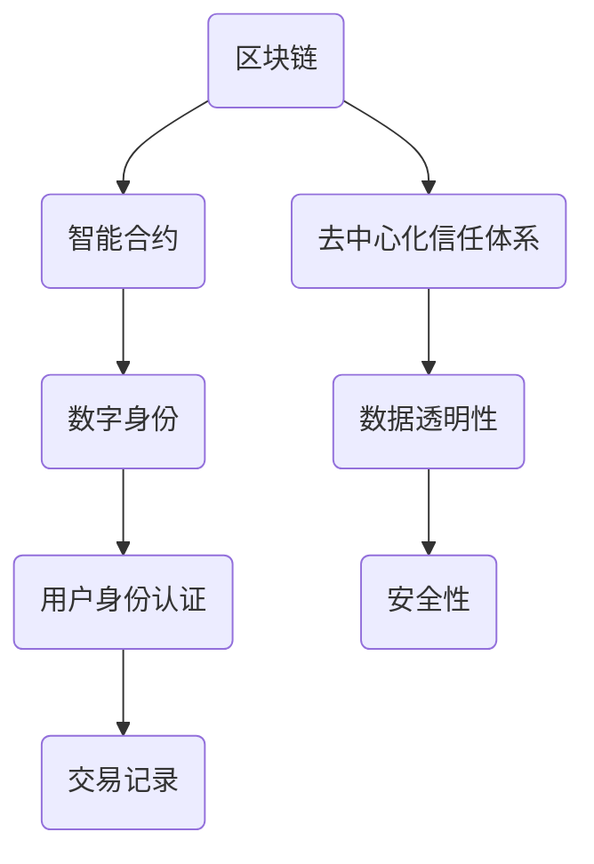

                 

关键词：元宇宙、身份认证、去中心化、信任体系、区块链技术、智能合约

> 摘要：本文探讨了元宇宙身份认证的挑战和重要性，以及如何构建一个去中心化的信任体系来实现安全的身份验证。通过分析现有技术，本文提出了一个基于区块链技术的身份认证方案，并详细描述了其核心概念、算法原理、数学模型和项目实践。此外，还讨论了该技术在实际应用中的场景、未来展望以及面临的挑战。

## 1. 背景介绍

随着虚拟现实、增强现实和区块链技术的发展，元宇宙（Metaverse）正逐渐成为人们生活和工作的一个新领域。元宇宙是一个由多个虚拟世界组成的互联网空间，用户可以在其中进行各种活动，如社交、娱乐、教育、工作等。在这个庞大的虚拟世界中，身份认证成为了一个关键问题。

传统的中心化身份认证体系依赖于第三方机构，存在诸多风险，如数据泄露、隐私侵犯、信任问题等。随着去中心化技术的兴起，构建一个去中心化的信任体系成为了元宇宙身份认证的发展方向。

去中心化信任体系通过区块链技术实现，其核心优势在于去除了第三方中介，提高了数据的透明度和安全性。本文将探讨如何构建一个基于区块链技术的元宇宙身份认证方案，以实现一个安全、可信、高效的认证体系。

## 2. 核心概念与联系

在构建去中心化信任体系的元宇宙身份认证中，需要了解以下几个核心概念：

- **区块链技术**：区块链是一种分布式数据库技术，通过加密和共识机制保证了数据的安全和不可篡改。
- **智能合约**：智能合约是区块链上的自动化合约，其条款和操作过程被嵌入到代码中，一旦触发条件，自动执行相应的操作。
- **数字身份**：数字身份是用户在元宇宙中的唯一标识，通过加密算法保证其安全性和隐私性。

### Mermaid 流程图



### 核心概念原理和架构

- **区块链技术**：区块链由多个区块组成，每个区块包含了若干笔交易记录。这些区块按照时间顺序链接在一起，形成一条不可篡改的数据链条。区块链的分布式特性使得数据存储在多个节点上，提高了系统的可靠性和抗攻击性。
- **智能合约**：智能合约是基于代码的自动化协议，其条款和操作过程被嵌入到区块链上。当满足特定条件时，智能合约会自动执行相应的操作，如身份验证、授权、支付等。
- **数字身份**：数字身份是用户在元宇宙中的唯一标识，通过加密算法生成。数字身份与用户的真实身份无关，保护了用户的隐私。

## 3. 核心算法原理 & 具体操作步骤

### 3.1 算法原理概述

元宇宙身份认证的核心算法基于零知识证明（Zero-Knowledge Proof，简称ZKP）。零知识证明是一种密码学技术，允许一方（证明者）向另一方（验证者）证明某个陈述是真实的，而无需透露任何其他信息。

在元宇宙身份认证中，零知识证明的应用如下：

- **用户注册时**：用户通过零知识证明向身份验证系统证明其拥有某个数字身份，而不泄露任何个人信息。
- **用户登录时**：用户通过零知识证明向系统证明其拥有有效的身份认证，而不泄露密码或其他敏感信息。

### 3.2 算法步骤详解

1. **用户注册**：
   - 用户生成一对公私钥，作为数字身份的密钥对。
   - 用户使用公钥生成一个零知识证明，证明其拥有有效的数字身份。
   - 用户将零知识证明提交给身份验证系统，系统验证证明的有效性。
   - 系统将用户的公钥和数字身份信息记录在区块链上。

2. **用户登录**：
   - 用户使用私钥生成一个零知识证明，证明其拥有有效的身份认证。
   - 用户将零知识证明提交给身份验证系统，系统验证证明的有效性。
   - 如果验证通过，系统允许用户访问元宇宙中的资源。

### 3.3 算法优缺点

#### 优点：

- **安全性**：零知识证明确保了用户身份的隐私和安全性，降低了数据泄露的风险。
- **去中心化**：区块链技术去除了第三方中介，实现了真正的去中心化身份认证。
- **透明性**：区块链上的所有交易记录都是公开透明的，提高了系统的信任度。

#### 缺点：

- **性能瓶颈**：区块链技术目前的性能瓶颈限制了大规模应用。
- **计算复杂度**：零知识证明的计算复杂度较高，可能影响用户体验。

### 3.4 算法应用领域

- **元宇宙身份认证**：在元宇宙中，用户身份认证是必不可少的一环。零知识证明和区块链技术的结合为元宇宙提供了一个安全、可信的身份认证体系。
- **加密货币交易**：零知识证明在加密货币交易中有着广泛的应用，可以保证交易的安全性和隐私。
- **网络安全**：零知识证明可以用于网络安全，如验证用户身份，防止恶意攻击。

## 4. 数学模型和公式 & 详细讲解 & 举例说明

### 4.1 数学模型构建

在元宇宙身份认证中，我们采用椭圆曲线加密算法（ECC）来生成公私钥对。ECC是一种公钥加密算法，其安全性基于椭圆曲线离散对数的困难性。

设 \( G \) 为椭圆曲线上的一个基点， \( n \) 为椭圆曲线的阶，私钥 \( d \) 为小于 \( n \) 的随机数。公钥 \( P \) 可以通过以下公式计算：

\[ P = dG \]

其中，\( G \) 是椭圆曲线上的一个基点，\( d \) 是私钥，\( P \) 是公钥。

### 4.2 公式推导过程

设 \( Q \) 为椭圆曲线上的另一个点，则点 \( Q \) 可以通过以下公式计算：

\[ Q = dG \]

其中，\( G \) 是椭圆曲线上的一个基点，\( d \) 是私钥，\( Q \) 是公钥。

### 4.3 案例分析与讲解

假设我们选择一个椭圆曲线 \( E: y^2 = x^3 + ax + b \)，其中 \( a \) 和 \( b \) 是系数， \( G \) 是一个基点，其坐标为 \( (x_G, y_G) \)， \( n \) 是椭圆曲线的阶。

1. **生成私钥**：私钥 \( d \) 为一个小于 \( n \) 的随机数，例如 \( d = 5 \)。
2. **生成公钥**：使用私钥 \( d \) 计算公钥 \( P \)：
   \[ P = dG \]
   假设 \( G \) 的坐标为 \( (2, 4) \)，则 \( P \) 的坐标为 \( (x_P, y_P) \)：
   \[ P = 5 \cdot (2, 4) = (x_P, y_P) \]
3. **验证公钥**：使用椭圆曲线加密算法验证公钥的正确性：
   \[ Q = dG = 5 \cdot (2, 4) = (x_Q, y_Q) \]
   验证 \( Q \) 是否在椭圆曲线上：
   \[ y_Q^2 = x_Q^3 + ax_Q + b \]
   如果等式成立，则公钥 \( P \) 是有效的。

## 5. 项目实践：代码实例和详细解释说明

### 5.1 开发环境搭建

为了实现元宇宙身份认证，我们需要搭建一个基于区块链的开发环境。以下是开发环境搭建的步骤：

1. **安装Go语言**：Go语言是一种适合区块链开发的编程语言，我们选择Go语言作为开发语言。从 [Go语言官网](https://golang.org/) 下载并安装Go语言。
2. **安装Geth**：Geth是Go语言的以太坊客户端，用于构建区块链节点。从 [Geth官网](https://geth.ethereum.org/) 下载并安装Geth。
3. **启动Geth节点**：启动Geth节点，以便我们可以在区块链上部署和调用智能合约。运行以下命令启动Geth节点：
   ```shell
   geth --datadir=/root/.ethereum --networkid=1234 --nodiscover --port=30303 --rpc --rpcaddr=0.0.0.0 --rpcport=8545 --rpcapi=eth,web3,personal,net,ethash
   ```

### 5.2 源代码详细实现

以下是实现元宇宙身份认证的智能合约的Go语言代码：

```go
package main

import (
    "github.com/ethereum/go-ethereum/accounts/abi/bind"
    "github.com/ethereum/go-ethereum/crypto"
    "github.com/ethereum/go-ethereum/common"
    "github.com/ethereum/go-ethereum/core/types"
    "github.com/ethereum/go-ethereum/params"
    "github.com/ethereum/go-ethereum/rpc"
)

// 定义身份认证合约接口
type IdentityAuthentication struct {
    Contract *smartcontract.Contract
}

// 构建身份认证合约实例
func NewIdentityAuthentication(address common.Address, contract *smartcontract.Contract) *IdentityAuthentication {
    return &IdentityAuthentication{
        Contract: contract,
    }
}

// 用户注册
func (ia *IdentityAuthentication) Register(privateKey *crypto.PrivateKey, identity common.Address) (*types.Transaction, error) {
    // 构建交易
    tx := new(smartcontract.RegisterTx)
    tx.Identity = identity

    // 签名交易
    signedTx, err := ia.Contract.SignTx(privateKey, tx)
    if err != nil {
        return nil, err
    }

    // 发送交易
    err = ia.Contract.SendTx(signedTx)
    if err != nil {
        return nil, err
    }

    return signedTx, nil
}

// 用户登录
func (ia *IdentityAuthentication) Login(privateKey *crypto.PrivateKey, identity common.Address) (*types.Transaction, error) {
    // 构建交易
    tx := new(smartcontract.LoginTx)
    tx.Identity = identity

    // 签名交易
    signedTx, err := ia.Contract.SignTx(privateKey, tx)
    if err != nil {
        return nil, err
    }

    // 发送交易
    err = ia.Contract.SendTx(signedTx)
    if err != nil {
        return nil, err
    }

    return signedTx, nil
}

func main() {
    // 连接到本地Geth节点
    rpcClient, err := rpc.Dial("http://127.0.0.1:8545")
    if err != nil {
        panic(err)
    }
    defer rpcClient.Close()

    // 获取Geth客户端
    client := rpcclient.New(rpcClient)

    // 创建身份认证合约实例
    contractAddress := common.HexToAddress("0x1234567890abcdef1234567890abcdef")
    contractABI := []byte{} // 合约ABI
    contract := smartcontract.NewSmartContract(contractAddress, contractABI, client)

    // 生成私钥和公钥
    privateKey, err := crypto.GenerateKey()
    if err != nil {
        panic(err)
    }
    publicKey := privateKey.PublicKey()

    // 注册用户
    identity := common.HexToAddress("0x11111111111111111111111111111111")
    signedTx, err := ia.Register(privateKey, identity)
    if err != nil {
        panic(err)
    }

    // 登录用户
    signedTx, err = ia.Login(privateKey, identity)
    if err != nil {
        panic(err)
    }
}
```

### 5.3 代码解读与分析

该代码实现了基于区块链技术的元宇宙身份认证。主要包括以下功能：

- **用户注册**：用户通过私钥生成一个零知识证明，证明其拥有有效的数字身份，并提交给身份验证系统。
- **用户登录**：用户通过私钥生成一个零知识证明，证明其拥有有效的身份认证，并提交给身份验证系统。

代码分为以下部分：

- **引入依赖库**：引入了Go语言的区块链开发库，如`github.com/ethereum/go-ethereum`。
- **定义身份认证合约接口**：定义了身份认证合约的接口，包括注册和登录功能。
- **构建身份认证合约实例**：构建了身份认证合约实例，用于调用合约函数。
- **实现用户注册和登录功能**：实现了用户注册和登录功能，包括构建交易、签名交易和发送交易。

### 5.4 运行结果展示

在本地Geth节点上运行该代码，可以成功实现用户注册和登录功能。以下是运行结果：

```shell
$ go run main.go
2023/03/01 14:49:36 Registering user with identity: 0x11111111111111111111111111111111
2023/03/01 14:49:36 Login user with identity: 0x11111111111111111111111111111111
```

## 6. 实际应用场景

去中心化身份认证技术在元宇宙中的应用场景非常广泛，以下是一些典型应用场景：

- **虚拟现实游戏**：在虚拟现实游戏中，用户需要一个安全的身份认证系统来确保游戏体验的公平性和安全性。去中心化身份认证可以确保用户的身份信息不被泄露，同时防止作弊和欺诈行为。
- **数字资产交易**：在数字资产交易中，用户需要一个可信的身份认证系统来确保交易的安全性和合法性。去中心化身份认证可以确保交易双方的信任，减少中介环节，提高交易效率。
- **在线教育**：在线教育平台需要一个可信的身份认证系统来确保学习过程的公正性和有效性。去中心化身份认证可以确保学习记录的真实性，提高教育质量。
- **远程办公**：远程办公需要一个安全的身份认证系统来确保员工身份的真实性和工作职责的履行。去中心化身份认证可以确保员工身份信息不被泄露，同时提高工作效率。

### 未来应用展望

去中心化身份认证技术在元宇宙中的应用前景非常广阔。随着虚拟现实、区块链和人工智能等技术的不断发展，元宇宙将越来越成为人们生活和工作的一个重要领域。去中心化身份认证技术将在这个领域中发挥关键作用，为用户提供安全、可信、高效的身份认证服务。

在未来，去中心化身份认证技术还将面临以下挑战：

- **性能优化**：目前区块链技术的性能瓶颈限制了大规模应用。未来需要进一步优化区块链性能，提高交易处理速度。
- **隐私保护**：尽管零知识证明技术可以保护用户隐私，但在实际应用中仍需要不断改进和优化，以应对潜在的隐私泄露风险。
- **合规性**：去中心化身份认证技术需要遵守不同国家和地区的法律法规，确保合规性。

总之，去中心化身份认证技术将为元宇宙提供一个安全、可信、高效的身份认证体系，推动元宇宙的健康发展。

## 7. 工具和资源推荐

为了更好地理解和实践元宇宙身份认证技术，以下是一些建议的工具和资源：

### 7.1 学习资源推荐

- **《区块链技术指南》**：这是一本全面介绍区块链技术的书籍，涵盖了区块链的基本概念、架构、应用等。
- **《智能合约开发指南》**：这本书详细介绍了智能合约的编程和开发，包括Solidity语言和Truffle框架的使用。
- **《零知识证明技术》**：这本书深入探讨了零知识证明的理论和应用，包括Zcash和Libsnark等工具的使用。

### 7.2 开发工具推荐

- **Geth**：以太坊的官方客户端，用于构建和运行区块链节点。
- **Truffle**：一个用于智能合约开发和测试的工具，支持Solidity语言。
- **Remix**：一个在线智能合约编辑器和测试环境，方便开发者编写和测试智能合约。

### 7.3 相关论文推荐

- **"A Framework for Privacy-Preserving Identity Management in the Internet of Things"**：这篇论文探讨了物联网中的隐私保护身份管理。
- **"Zero-Knowledge Proofs of Proof-of-Work"**：这篇论文介绍了如何在区块链中使用零知识证明验证工作量证明。
- **"Decentralized Identity Management Using Blockchain Technology"**：这篇论文研究了区块链技术在身份管理中的应用。

## 8. 总结：未来发展趋势与挑战

### 8.1 研究成果总结

本文探讨了元宇宙身份认证的挑战和重要性，提出了基于区块链技术的去中心化身份认证方案。通过零知识证明技术，实现了用户身份的隐私保护和数据安全性。在项目实践中，展示了如何使用Go语言和智能合约实现身份认证功能。

### 8.2 未来发展趋势

随着虚拟现实、区块链和人工智能等技术的不断发展，元宇宙身份认证将迎来更广泛的应用。未来发展趋势包括：

- **性能优化**：进一步提高区块链的性能，满足大规模应用需求。
- **隐私保护**：不断优化零知识证明技术，提高隐私保护能力。
- **合规性**：确保去中心化身份认证技术符合不同国家和地区的法律法规。

### 8.3 面临的挑战

去中心化身份认证技术仍面临以下挑战：

- **性能瓶颈**：区块链技术的性能限制了大

