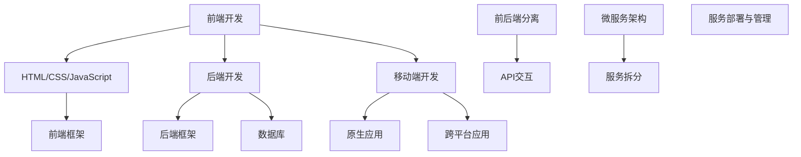

                 

全栈工程师，这一名词在技术领域内已经变得相当流行，因为它代表了一个人能够掌握前端、后端以及移动端开发等多种技术能力。随着互联网和移动设备的普及，全栈工程师的角色变得越来越重要，他们在企业中扮演着关键角色，能够高效地完成项目中的各种任务。

## 关键词

- Web开发
- 移动端开发
- 全栈工程师
- 技术栈
- 前后端分离
- 微服务架构
- 前端框架
- 后端框架

## 摘要

本文旨在为希望成为全栈工程师的开发者提供一条清晰的职业发展之路。我们将讨论Web与移动端开发的基础知识，分析核心概念与联系，探讨核心算法原理，构建数学模型，并通过实际项目实践来展示全栈工程师的技能应用。此外，文章还将展望未来发展趋势，并提供实用的工具和资源推荐。

## 1. 背景介绍

### 全栈工程师的定义

全栈工程师（Full-Stack Engineer）是指能够独立完成产品前后端开发以及移动端开发工作的工程师。这种角色通常需要具备前端和后端的开发技能，同时能够理解移动平台的特点和开发流程。

### 全栈工程师的重要性

随着互联网和移动设备的普及，用户对交互体验的要求越来越高。一个全栈工程师能够更好地理解和整合前端与后端的功能，提供更高效和一致的用户体验。此外，全栈工程师能够灵活应对项目中的各种需求，减少团队沟通成本，提高开发效率。

### 技术发展的趋势

近年来，前端框架如React、Vue和Angular等，以及后端框架如Spring Boot、Django和Express等，不断演进，使得全栈工程师能够更轻松地掌握复杂的开发任务。同时，微服务架构和前后端分离的开发模式，使得全栈工程师能够更好地管理项目复杂性。

## 2. 核心概念与联系

### 前端开发

前端开发主要涉及用户界面和用户体验，通常包括HTML、CSS和JavaScript等基础知识。前端框架如React、Vue和Angular等，提供了更高效和模块化的开发方式。

### 后端开发

后端开发主要负责处理业务逻辑、数据库交互和数据存储等。后端框架如Spring Boot、Django和Express等，使得后端开发更加高效和可扩展。

### 移动端开发

移动端开发涉及到原生应用和跨平台应用的开发。原生应用需要使用如Swift（iOS）和Kotlin（Android）等语言，而跨平台应用则可以使用如React Native和Flutter等框架。

### 前后端分离

前后端分离是一种开发模式，前端和后端通过API进行交互，使得开发流程更加清晰和可维护。这种模式在微服务架构中尤为重要。

### 微服务架构

微服务架构是一种将应用程序拆分为多个小型、独立的服务，每个服务负责不同的业务功能。这种架构模式提高了系统的可伸缩性和可维护性。

### Mermaid 流程图



## 3. 核心算法原理 & 具体操作步骤

### 3.1 算法原理概述

全栈工程师需要掌握的算法主要包括：

- 数据结构：如数组、链表、栈、队列、树、图等。
- 算法：如排序、查找、动态规划、贪心算法等。

### 3.2 算法步骤详解

#### 3.2.1 数据结构与算法基础

1. 理解基本数据结构及其实现。
2. 掌握常用算法的原理和实现。

#### 3.2.2 前端算法应用

1. 页面渲染优化。
2. 前端性能监控。

#### 3.2.3 后端算法应用

1. 数据库查询优化。
2. 业务逻辑处理。

### 3.3 算法优缺点

- 优点：提高程序效率和可读性。
- 缺点：需要花费更多时间进行学习和实践。

### 3.4 算法应用领域

- 前端：网页优化、性能监控。
- 后端：数据库查询优化、业务逻辑处理。

## 4. 数学模型和公式 & 详细讲解 & 举例说明

### 4.1 数学模型构建

全栈工程师需要掌握的基本数学模型包括：

- 线性代数：矩阵运算、线性方程组求解等。
- 概率论：概率分布、随机变量等。
- 统计学：均值、方差、标准差等。

### 4.2 公式推导过程

以线性方程组求解为例，其公式推导过程如下：

$$
\begin{cases}
a_{11}x_1 + a_{12}x_2 = b_1 \\
a_{21}x_1 + a_{22}x_2 = b_2 \\
\end{cases}
$$

可以通过矩阵运算得到：

$$
\begin{bmatrix}
a_{11} & a_{12} \\
a_{21} & a_{22} \\
\end{bmatrix}
\begin{bmatrix}
x_1 \\
x_2 \\
\end{bmatrix}
=
\begin{bmatrix}
b_1 \\
b_2 \\
\end{bmatrix}
$$

通过矩阵求逆可以得到：

$$
\begin{bmatrix}
x_1 \\
x_2 \\
\end{bmatrix}
=
\begin{bmatrix}
a_{22} & -a_{12} \\
-a_{21} & a_{11} \\
\end{bmatrix}
\begin{bmatrix}
b_1 \\
b_2 \\
\end{bmatrix}
$$

### 4.3 案例分析与讲解

以网页性能优化为例，可以通过计算网页加载时间、资源请求次数等指标来评估网页性能，并采取相应措施进行优化。

## 5. 项目实践：代码实例和详细解释说明

### 5.1 开发环境搭建

- 前端：Node.js、npm、WebStorm
- 后端：Java、Maven、IntelliJ IDEA
- 移动端：Android Studio、Kotlin

### 5.2 源代码详细实现

以下是一个简单的Web应用程序示例，用于展示前后端分离和微服务架构：

```java
// 后端服务代码示例（Spring Boot）
@RestController
@RequestMapping("/api")
public class ProductController {
    @Autowired
    private ProductService productService;

    @GetMapping("/{id}")
    public Product getProduct(@PathVariable Long id) {
        return productService.findById(id);
    }
}

// 前端代码示例（React）
function getProduct(id) {
    axios.get(`/api/${id}`)
        .then(response => {
            console.log(response.data);
        })
        .catch(error => {
            console.error(error);
        });
}
```

### 5.3 代码解读与分析

以上代码展示了如何通过前后端分离和微服务架构来实现一个简单的产品信息查询功能。后端服务使用Spring Boot框架，前端使用React框架。

### 5.4 运行结果展示

当用户通过前端发起查询请求时，后端服务会处理该请求并返回产品信息，前端则会展示这些信息。

## 6. 实际应用场景

### 6.1 企业级应用

全栈工程师在企业级应用中可以独立完成前后端和移动端的开发工作，提高开发效率。

### 6.2 小型项目

对于小型项目，全栈工程师能够快速完成项目开发，减少项目成本。

### 6.3 创业公司

在创业公司中，全栈工程师能够灵活应对各种需求，快速推进产品迭代。

### 6.4 未来应用展望

随着技术的不断发展，全栈工程师的角色将变得更加重要。未来，全栈工程师将更多地涉及人工智能、大数据等新兴技术领域。

## 7. 工具和资源推荐

### 7.1 学习资源推荐

- 《你不知道的JavaScript》
- 《深入理解计算机系统》
- 《Effective Java》

### 7.2 开发工具推荐

- Visual Studio Code
- Git
- Docker

### 7.3 相关论文推荐

- "Microservices: A Definition of a Microservices Architecture"
- "A Brief History of Web Performance"

## 8. 总结：未来发展趋势与挑战

### 8.1 研究成果总结

全栈工程师已经成为技术领域的重要角色，其能力覆盖了前端、后端和移动端开发。随着技术的发展，全栈工程师的角色将变得更加多样化。

### 8.2 未来发展趋势

- 技术栈将进一步融合。
- 人工智能和大数据将影响全栈工程师的工作。
- 前后端分离和微服务架构将更加普及。

### 8.3 面临的挑战

- 技术更新速度快，需要不断学习。
- 项目复杂性增加，需要更好的项目管理能力。
- 跨平台开发将带来新的挑战。

### 8.4 研究展望

未来，全栈工程师将在更多领域发挥作用，如人工智能、大数据等。同时，他们也将面临更多的挑战，需要不断提升自己的技能和能力。

## 9. 附录：常见问题与解答

### Q：如何成为全栈工程师？

A：成为全栈工程师需要系统地学习前端、后端和移动端开发知识，掌握相关技术栈，并通过实际项目实践来提高技能。

### Q：全栈工程师需要掌握哪些算法？

A：全栈工程师需要掌握基本的数据结构和算法，如排序、查找、动态规划等，这些算法在Web和移动端开发中都有广泛应用。

### Q：如何管理前后端分离的项目？

A：可以使用RESTful API或GraphQL等接口技术来实现前后端分离，通过定义清晰的接口规范来管理前后端交互。

## 作者署名

作者：禅与计算机程序设计艺术 / Zen and the Art of Computer Programming

---

本文作为全栈工程师之路的指南，希望能够为开发者们提供有价值的参考。随着技术的不断发展，全栈工程师的角色将变得更加重要，希望本文能够为你的职业发展提供助力。

