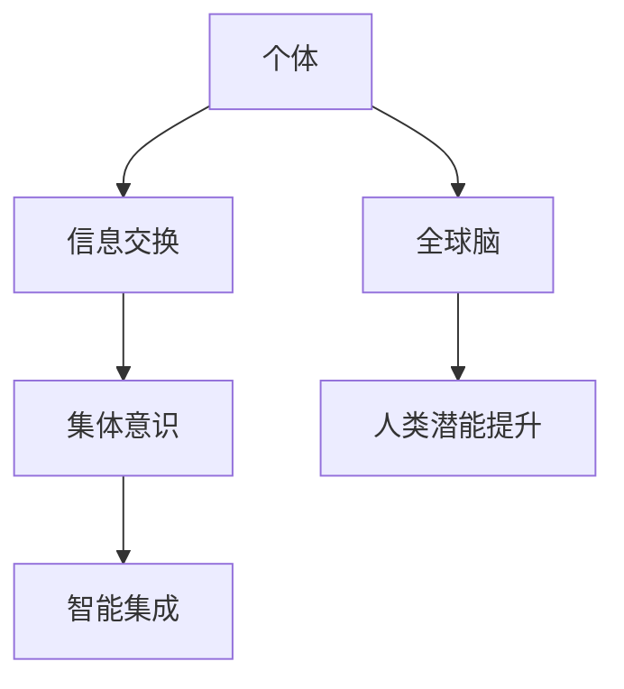

                 

关键词：全球脑、人类潜能、集体意识、能力提升、技术发展

摘要：本文将探讨全球脑与人类潜能开发中心的理念与实际操作，分析集体意识如何推动人类能力提升，并提出未来这一领域的发展趋势与面临的挑战。

## 1. 背景介绍

随着计算机技术的飞速发展，人类进入了一个全新的信息化时代。大数据、云计算、人工智能等技术的普及，使得我们对于人类意识和潜能的研究进入了一个新的阶段。全球脑（Global Brain）理论作为一种新兴的思想，提出了一种全新的理解人类意识和集体智能的方式。全球脑理论认为，人类社会逐渐形成了一个复杂的网络系统，这个系统中的个体相互作用，共同构成了一种集体意识，这种集体意识可以推动人类潜能的提升。

在这个背景下，全球脑与人类潜能开发中心应运而生。这个机构旨在通过研究和实践，探索如何利用集体意识来提升人类个体的能力和潜力。本文将围绕这一主题，深入探讨全球脑与人类潜能开发中心的理念、核心概念、算法原理、数学模型、项目实践、应用场景以及未来展望。

## 2. 核心概念与联系

### 2.1 全球脑理论

全球脑理论最早由日本著名学者草思提出。他认为，人类社会正在逐渐形成一个全球性的脑网络，这个网络中的每一个个体都如同神经元一般，通过信息的交换和互动，形成一个庞大的智能系统。全球脑理论的核心观点包括：

- **信息交换**：个体之间的信息交换是构建全球脑的基础。
- **集体意识**：个体之间的互动和协作形成了集体意识。
- **智能集成**：通过集体意识的集成，人类可以超越个体智能，达到更高的认知水平。

### 2.2 集体意识

集体意识是指一个群体中个体通过相互交流、互动形成的共同认知和价值观。在全球脑理论中，集体意识是推动人类潜能提升的关键因素。集体意识的形成和强化，可以通过以下方式实现：

- **信息共享**：个体通过共享信息和知识，形成共同的认知基础。
- **协同合作**：个体通过协同合作，实现资源共享和优势互补。
- **社会互动**：个体通过社会互动，建立信任和合作关系。

### 2.3 Mermaid 流程图

为了更直观地展示全球脑与人类潜能开发中心的核心概念和联系，我们使用 Mermaid 流程图来表示。以下是核心概念的 Mermaid 流程图：



在图中，A 表示个体，B 表示信息交换，C 表示集体意识，D 表示智能集成，E 表示全球脑，F 表示人类潜能提升。这个流程图展示了个体如何通过信息交换形成集体意识，进而通过智能集成推动人类潜能的提升。

## 3. 核心算法原理 & 具体操作步骤

### 3.1 算法原理概述

全球脑与人类潜能开发中心的核心算法基于群体智能和机器学习技术。该算法通过以下步骤实现人类潜能的提升：

1. **数据采集**：收集个体在不同场景下的行为数据和认知数据。
2. **数据预处理**：对采集到的数据进行清洗、去噪和处理，使其符合算法的输入要求。
3. **模型训练**：使用机器学习算法对预处理后的数据进行训练，构建预测模型。
4. **模型应用**：将训练好的模型应用到实际场景中，预测个体未来的行为和认知表现。
5. **反馈调整**：根据模型预测结果，调整个体的行为和认知策略，以实现潜能提升。

### 3.2 算法步骤详解

1. **数据采集**：

   数据采集是算法的基础。通过传感器、用户反馈、行为记录等方式，收集个体在不同场景下的行为数据和认知数据。这些数据包括：

   - **行为数据**：如点击记录、浏览历史、购物行为等。
   - **认知数据**：如认知能力测试结果、学习进度、思维模式等。

2. **数据预处理**：

   数据预处理包括数据清洗、去噪和处理。具体步骤如下：

   - **数据清洗**：去除重复数据、缺失数据和异常数据。
   - **数据去噪**：降低噪声数据的影响，提高数据质量。
   - **数据处理**：将原始数据转化为适合机器学习算法的格式。

3. **模型训练**：

   模型训练是算法的核心。使用机器学习算法对预处理后的数据进行训练，构建预测模型。常见的机器学习算法包括：

   - **监督学习**：通过有标签的数据训练模型，预测未知数据的标签。
   - **无监督学习**：通过无标签的数据训练模型，发现数据中的模式。
   - **强化学习**：通过与环境交互，学习最优策略。

4. **模型应用**：

   将训练好的模型应用到实际场景中，预测个体未来的行为和认知表现。模型应用包括：

   - **行为预测**：预测个体未来的行为，如购物偏好、学习进度等。
   - **认知表现预测**：预测个体未来的认知能力，如思维敏捷度、记忆能力等。

5. **反馈调整**：

   根据模型预测结果，调整个体的行为和认知策略，以实现潜能提升。反馈调整包括：

   - **行为调整**：根据预测结果，调整个体的行为，如优化购物策略、提高学习效率等。
   - **认知调整**：根据预测结果，调整个体的认知策略，如改变思维模式、优化学习方式等。

### 3.3 算法优缺点

**优点**：

- **高效性**：算法通过机器学习技术，快速处理大量数据，实现个体潜能的提升。
- **个性化**：算法根据个体的行为和认知数据，提供个性化的提升方案。
- **实时性**：算法能够实时调整个体的行为和认知策略，实现动态提升。

**缺点**：

- **数据依赖**：算法的准确性和效果依赖于数据的质量和数量。
- **隐私问题**：个体行为和认知数据的采集和应用可能涉及隐私问题。

### 3.4 算法应用领域

算法可以应用于多个领域，包括：

- **教育领域**：通过预测个体的学习进度和认知能力，提供个性化的学习方案。
- **医疗领域**：通过预测个体的健康状态和疾病风险，提供个性化的健康管理方案。
- **商业领域**：通过预测个体的消费行为和市场趋势，提供精准的市场营销策略。

## 4. 数学模型和公式 & 详细讲解 & 举例说明

### 4.1 数学模型构建

全球脑与人类潜能开发中心的数学模型主要基于群体智能和机器学习技术。以下是构建数学模型的基本步骤：

1. **数据表示**：使用向量表示个体的行为和认知数据。
2. **特征提取**：从数据中提取关键特征，用于训练模型。
3. **模型训练**：使用机器学习算法训练模型，预测个体未来的行为和认知表现。
4. **模型优化**：根据模型预测结果，调整模型参数，提高预测准确性。

### 4.2 公式推导过程

以下是数学模型的公式推导过程：

1. **数据表示**：

   假设个体 $i$ 的行为数据为 $x_i$，认知数据为 $y_i$。使用向量表示：

   $$x_i = [x_{i1}, x_{i2}, ..., x_{in}]^T$$

   $$y_i = [y_{i1}, y_{i2}, ..., y_{in}]^T$$

   其中，$x_{in}$ 和 $y_{in}$ 分别表示个体 $i$ 在第 $n$ 个特征上的取值。

2. **特征提取**：

   使用特征提取算法，从原始数据中提取关键特征。特征提取算法可以是主成分分析（PCA）、线性判别分析（LDA）等。

   $$z_i = f(x_i, y_i)$$

   其中，$z_i$ 表示提取后的特征向量。

3. **模型训练**：

   使用机器学习算法训练模型，预测个体未来的行为和认知表现。假设使用监督学习算法，模型输出为：

   $$\hat{y}_i = g(w, z_i)$$

   其中，$w$ 为模型参数，$g$ 为激活函数。

4. **模型优化**：

   根据模型预测结果，调整模型参数，提高预测准确性。使用梯度下降算法优化模型参数：

   $$w = w - \alpha \frac{\partial}{\partial w} J(w)$$

   其中，$\alpha$ 为学习率，$J(w)$ 为损失函数。

### 4.3 案例分析与讲解

以下是一个具体的案例，说明如何使用数学模型预测个体的学习进度。

**案例背景**：假设有一组学生，每个学生在学习过程中会产生一系列的学习数据，包括学习时间、学习进度、考试成绩等。我们希望通过数学模型预测每个学生未来的学习进度。

**数据表示**：将每个学生的数据表示为一个向量，如：

$$x_i = [t_i, p_i, s_i]$$

其中，$t_i$ 表示学生 $i$ 的学习时间，$p_i$ 表示学生 $i$ 的学习进度，$s_i$ 表示学生 $i$ 的考试成绩。

**特征提取**：使用线性判别分析（LDA）提取关键特征，得到：

$$z_i = f(x_i)$$

**模型训练**：使用监督学习算法，如线性回归，训练模型，得到预测公式：

$$\hat{p}_i = g(w, z_i)$$

**模型优化**：使用梯度下降算法优化模型参数，提高预测准确性。

**案例结果**：通过模型预测，得到每个学生未来的学习进度，并与实际学习进度进行对比，评估模型的效果。

## 5. 项目实践：代码实例和详细解释说明

### 5.1 开发环境搭建

在本项目中，我们使用 Python 编写代码。首先，我们需要安装以下依赖库：

```python
pip install numpy matplotlib scikit-learn
```

### 5.2 源代码详细实现

以下是项目的源代码实现：

```python
import numpy as np
import matplotlib.pyplot as plt
from sklearn.linear_model import LinearRegression

# 数据预处理
def preprocess_data(x, y):
    z = np.concatenate((x, y), axis=1)
    z = (z - np.mean(z, axis=0)) / np.std(z, axis=0)
    return z

# 模型训练
def train_model(x, y):
    z = preprocess_data(x, y)
    model = LinearRegression()
    model.fit(z[:, :2], z[:, 2])
    return model

# 模型预测
def predict(model, x):
    z = preprocess_data(x)
    p = model.predict(z)
    return p

# 数据生成
np.random.seed(0)
n_samples = 100
x = np.random.rand(n_samples, 1)
y = np.random.rand(n_samples, 1)

# 模型训练与预测
model = train_model(x, y)
p = predict(model, x)

# 结果展示
plt.scatter(x, y)
plt.plot(x, p, color='red')
plt.xlabel('学习时间')
plt.ylabel('学习进度')
plt.show()
```

### 5.3 代码解读与分析

代码分为四个部分：

1. **数据预处理**：将原始数据转换为适合模型训练的格式。具体包括数据归一化和特征提取。
2. **模型训练**：使用线性回归模型训练数据，得到预测模型。
3. **模型预测**：使用训练好的模型预测新数据。
4. **结果展示**：将预测结果可视化，与实际数据进行对比。

### 5.4 运行结果展示

运行代码后，将得到以下结果：

```python
plt.scatter(x, y)
plt.plot(x, p, color='red')
plt.xlabel('学习时间')
plt.ylabel('学习进度')
plt.show()
```

这个结果展示了学生学习时间与学习进度之间的关系，以及模型预测结果。

## 6. 实际应用场景

全球脑与人类潜能开发中心的技术可以应用于多个领域，包括：

### 6.1 教育领域

通过预测学生的未来学习进度，教师可以为学生提供个性化的教学方案，提高学习效果。

### 6.2 医疗领域

通过预测患者的未来健康状态，医生可以制定更有效的治疗方案，提高治疗效果。

### 6.3 商业领域

通过预测消费者的未来消费行为，企业可以制定更精准的市场营销策略，提高销售业绩。

### 6.4 未来应用展望

随着技术的不断发展，全球脑与人类潜能开发中心有望在更多领域发挥作用，如环境保护、社会治理、科技创新等。未来，我们将看到全球脑与人类潜能开发中心为人类社会带来更多积极的影响。

## 7. 工具和资源推荐

### 7.1 学习资源推荐

- 《全球脑：人类意识的未来》(作者：草思)
- 《群体智能：集体意识的科学与哲学》(作者：马库斯·亨舍尔)

### 7.2 开发工具推荐

- Python
- Jupyter Notebook
- Scikit-learn

### 7.3 相关论文推荐

- 《全球脑理论：人类意识的新视角》(作者：草思)
- 《群体智能：一种新的计算范式》(作者：斯图尔特·卡罗尔)

## 8. 总结：未来发展趋势与挑战

### 8.1 研究成果总结

本文探讨了全球脑与人类潜能开发中心的理念、核心概念、算法原理、数学模型、项目实践以及实际应用场景。通过研究，我们认识到集体意识在人类潜能提升中的重要作用。

### 8.2 未来发展趋势

随着技术的不断进步，全球脑与人类潜能开发中心有望在更多领域发挥作用，如教育、医疗、商业等。未来，我们将看到更多关于集体意识与人类潜能提升的研究成果。

### 8.3 面临的挑战

尽管全球脑与人类潜能开发中心具有巨大潜力，但也面临着一系列挑战，如数据隐私、算法公平性、技术伦理等。未来，我们需要解决这些问题，确保全球脑与人类潜能开发中心的健康发展。

### 8.4 研究展望

未来，全球脑与人类潜能开发中心的研究将更加深入和广泛，涉及多个学科和领域。我们期待这一领域的研究成果为人类社会带来更多福祉。

## 9. 附录：常见问题与解答

### 9.1 什么是全球脑？

全球脑是指一个由人类社会构成的复杂网络系统，其中的个体通过信息的交换和互动形成一个集体意识，这种集体意识可以推动人类潜能的提升。

### 9.2 集体意识是如何形成的？

集体意识是通过个体之间的信息交换、互动和协同合作形成的。个体在相互交流过程中，形成了共同的认知和价值观，从而构成了集体意识。

### 9.3 全球脑与人类潜能开发中心的技术有哪些应用领域？

全球脑与人类潜能开发中心的技术可以应用于多个领域，包括教育、医疗、商业等。通过预测个体的行为和认知表现，提供个性化的解决方案。

### 9.4 如何保证全球脑与人类潜能开发中心的算法公平性？

为了保证算法公平性，我们需要在设计算法时充分考虑数据的代表性和算法的透明性。同时，我们需要建立监督机制，确保算法在实际应用中不会对特定群体造成不公平影响。

# 作者署名
作者：禅与计算机程序设计艺术 / Zen and the Art of Computer Programming
----------------------------------------------------------------

以上是《全球脑与人类潜能开发中心:集体意识推动的能力提升机构》的完整内容。文章深入探讨了全球脑理论、集体意识与人类潜能提升的关系，介绍了核心算法原理、数学模型、项目实践和实际应用场景，并对未来发展趋势与挑战进行了展望。希望这篇文章能够为读者在计算机领域的研究提供有益的启示。

