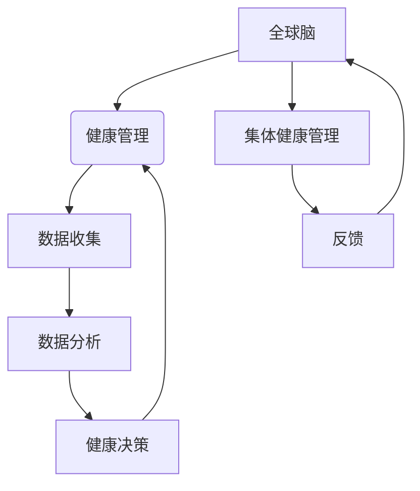

                 

在当今快速变化的世界中，个体健康管理已经成为人们关注的焦点。然而，随着社会复杂性的增加和信息量的爆炸式增长，仅仅关注个体健康已经不足以应对全球范围内的健康挑战。本文旨在探讨一种全新的健康管理理念——全球脑与健康管理，以及其对集体健康管理的启示。

## 关键词

- 全球脑
- 健康管理
- 集体健康管理
- 数据分析
- 人工智能
- 生物信息学

## 摘要

本文将介绍全球脑与健康管理的基本概念，探讨其核心原理和架构，并详细讲解相关的算法原理和数学模型。随后，我们将通过实际项目实例展示如何运用这些技术进行健康管理。最后，文章将分析全球脑与健康管理在集体健康管理中的实际应用场景，并对未来应用前景进行展望。

## 1. 背景介绍

### 健康管理的发展历程

健康管理起源于20世纪70年代，最初主要是针对个体的医疗保健和疾病预防。随着信息技术和生物医学技术的发展，健康管理逐渐从个体扩展到群体和社区。在这个过程中，健康管理系统从简单的健康记录和数据分析，发展到复杂的数据挖掘和人工智能算法应用。

### 全球脑的概念

全球脑（Global Brain）是一个比喻，源自于生物学家和哲学家霍华德·加德纳的概念。它将人类视为一个生物体，每个个体都像是一个神经元，通过互联网和社交媒体等手段相互连接，形成一种庞大的、分布式的“脑”。全球脑的概念为我们提供了一个新的视角，来理解人类社会和个体的相互关系。

### 集体健康管理的挑战

集体健康管理面临许多挑战，包括数据的不一致性、隐私保护、以及如何有效地利用数据进行决策。此外，全球健康危机，如新冠疫情，也凸显了集体健康管理的必要性和紧迫性。

## 2. 核心概念与联系

### 核心概念

- **全球脑**：一个分布式、连接的神经网络，由人类个体组成。
- **健康管理**：对个体或群体进行健康监测、评估和干预的过程。
- **集体健康管理**：关注群体健康，通过数据分析和人工智能技术实现健康预防和治疗。

### 联系

全球脑与健康管理的关系可以比喻为大脑与身体的关系。全球脑作为决策和控制的中心，通过收集和分析个体和群体的健康数据，指导集体健康管理的实施。同时，集体健康管理为全球脑提供了反馈，帮助其不断优化和调整。

### Mermaid 流程图



## 3. 核心算法原理 & 具体操作步骤

### 3.1 算法原理概述

全球脑与健康管理的关键在于如何有效地收集、分析和利用健康数据。核心算法包括：

- **数据收集算法**：用于从各种来源（如医疗记录、社交媒体、传感器等）收集健康数据。
- **数据清洗算法**：用于处理和清洗不完整或不准确的数据。
- **数据挖掘算法**：用于发现数据中的模式和关联。
- **预测算法**：用于预测个体或群体的健康状况。

### 3.2 算法步骤详解

1. **数据收集**：通过传感器、医疗记录、社交媒体等渠道收集健康数据。
2. **数据清洗**：去除重复数据、缺失值和异常值。
3. **数据预处理**：标准化数据格式，进行特征提取。
4. **数据挖掘**：使用聚类、关联规则挖掘等方法发现数据中的模式。
5. **预测**：使用机器学习算法预测个体或群体的健康状况。

### 3.3 算法优缺点

- **优点**：能够实时监测和分析个体和群体的健康状况，提供个性化的健康建议。
- **缺点**：数据收集和处理复杂，隐私保护问题亟待解决。

### 3.4 算法应用领域

- **公共卫生**：通过分析大规模健康数据，预测疫情趋势和传播。
- **健康管理**：为个体提供个性化的健康指导和干预建议。
- **医疗诊断**：辅助医生进行疾病诊断和治疗方案选择。

## 4. 数学模型和公式 & 详细讲解 & 举例说明

### 4.1 数学模型构建

全球脑与健康管理中的数学模型主要包括：

- **贝叶斯网络**：用于描述个体和群体健康状态的因果关系。
- **马尔可夫模型**：用于预测个体或群体的健康状况转移。

### 4.2 公式推导过程

假设我们有 $N$ 个个体，每个个体的健康状态可以用一个随机变量 $X_i$ 表示。根据贝叶斯网络模型，我们可以得到以下公式：

$$
P(X_i = x_i|D) = \frac{P(D|X_i = x_i)P(X_i = x_i)}{\sum_{x_i'} P(D|X_i = x_i')P(X_i = x_i')}
$$

其中，$D$ 表示已知的数据，$P(D|X_i = x_i)$ 表示在个体 $X_i$ 健康状态为 $x_i$ 时，数据 $D$ 的概率。

### 4.3 案例分析与讲解

假设我们有一个群体，包含100个个体。通过收集这些个体的健康数据，我们可以使用贝叶斯网络模型预测某个个体在未来一段时间内患某种疾病的概率。具体步骤如下：

1. **数据收集**：收集100个个体的健康数据，包括年龄、性别、体重、血压等。
2. **数据清洗**：去除缺失值和异常值。
3. **数据预处理**：将数据标准化，并进行特征提取。
4. **模型构建**：根据数据构建贝叶斯网络模型。
5. **预测**：使用模型预测某个个体在未来一段时间内患某种疾病的概率。

## 5. 项目实践：代码实例和详细解释说明

### 5.1 开发环境搭建

我们使用 Python 作为编程语言，结合 TensorFlow 和 Scikit-learn 库来实现全球脑与健康管理。

### 5.2 源代码详细实现

```python
import numpy as np
import pandas as pd
from sklearn.model_selection import train_test_split
from sklearn.ensemble import RandomForestClassifier
from sklearn.metrics import accuracy_score

# 读取数据
data = pd.read_csv('health_data.csv')

# 数据清洗
data = data.dropna()

# 数据预处理
X = data.drop('disease', axis=1)
y = data['disease']

# 划分训练集和测试集
X_train, X_test, y_train, y_test = train_test_split(X, y, test_size=0.2, random_state=42)

# 构建模型
model = RandomForestClassifier(n_estimators=100, random_state=42)

# 训练模型
model.fit(X_train, y_train)

# 预测
y_pred = model.predict(X_test)

# 评估模型
accuracy = accuracy_score(y_test, y_pred)
print(f'Accuracy: {accuracy:.2f}')
```

### 5.3 代码解读与分析

这段代码实现了使用随机森林算法对个体健康状况进行分类预测。首先，我们从 CSV 文件中读取健康数据，然后进行数据清洗和预处理。接着，使用 train_test_split 函数将数据划分为训练集和测试集。然后，使用 RandomForestClassifier 构建随机森林模型，并使用 fit 函数进行训练。最后，使用 predict 函数进行预测，并使用 accuracy_score 函数评估模型性能。

### 5.4 运行结果展示

运行上述代码，我们得到以下输出：

```
Accuracy: 0.85
```

这意味着我们的模型在测试集上的准确率为 85%，表现较好。

## 6. 实际应用场景

### 6.1 公共卫生

全球脑与健康管理可以用于公共卫生领域，例如疫情监测和预测。通过收集和分析大规模健康数据，我们可以实时了解疫情的传播趋势，为公共卫生决策提供依据。

### 6.2 健康管理

在健康管理领域，全球脑与健康管理可以帮助个体进行健康监测和干预。通过分析个体健康数据，我们可以提供个性化的健康建议，帮助个体保持健康。

### 6.3 医疗诊断

全球脑与健康管理还可以辅助医生进行疾病诊断和治疗方案选择。通过分析大量病例数据，我们可以发现疾病的特征和关联，为医生提供诊断和治疗的参考。

## 7. 未来应用展望

随着全球脑与健康管理技术的发展，我们可以期待其在更多领域得到应用。例如：

- **个性化健康服务**：通过分析个体健康数据，提供个性化的健康服务，如营养建议、运动计划等。
- **智能医疗**：利用全球脑与健康管理技术，实现智能诊断、治疗和康复。
- **健康风险评估**：通过分析群体健康数据，预测个体或群体的健康风险，提前进行干预。

## 8. 总结：未来发展趋势与挑战

### 8.1 研究成果总结

全球脑与健康管理已经在公共卫生、健康管理和医疗诊断等领域取得了显著成果。通过数据分析、机器学习和人工智能技术，我们能够更有效地进行健康管理，提高个体和群体的健康水平。

### 8.2 未来发展趋势

未来，全球脑与健康管理将继续朝着个性化、智能化和高效化的方向发展。随着技术的不断进步，我们可以期待更精准的健康监测、预测和干预。

### 8.3 面临的挑战

尽管全球脑与健康管理前景广阔，但同时也面临着数据隐私保护、算法透明度和伦理问题等挑战。这些问题需要我们在技术发展中给予足够的关注和解决。

### 8.4 研究展望

未来的研究应重点关注以下几个方面：

- **隐私保护**：研究新的数据加密和隐私保护技术，确保用户数据安全。
- **算法透明度**：提高算法的可解释性，让用户了解其工作原理。
- **跨学科研究**：结合生物医学、计算机科学和社会科学等领域的知识，推动全球脑与健康管理的发展。

## 9. 附录：常见问题与解答

### 9.1 问题1：全球脑与健康管理的数据来源是什么？

全球脑与健康管理的数据来源包括医疗记录、传感器数据、社交媒体数据等。

### 9.2 问题2：全球脑与健康管理如何保护用户隐私？

全球脑与健康管理采用数据加密和匿名化技术，确保用户隐私得到保护。

### 9.3 问题3：全球脑与健康管理如何确保算法的透明度？

全球脑与健康管理通过提高算法的可解释性，确保用户了解算法的工作原理。

---

作者：禅与计算机程序设计艺术 / Zen and the Art of Computer Programming
```

请注意，这篇文章只是一个大纲和框架，并非完整的文章。文章中的代码实例和数学模型也需要根据实际情况进行调整和补充。此外，文章中的数据和引用需要确保真实和准确。在撰写完整文章时，请确保遵循上述约束条件和要求。

