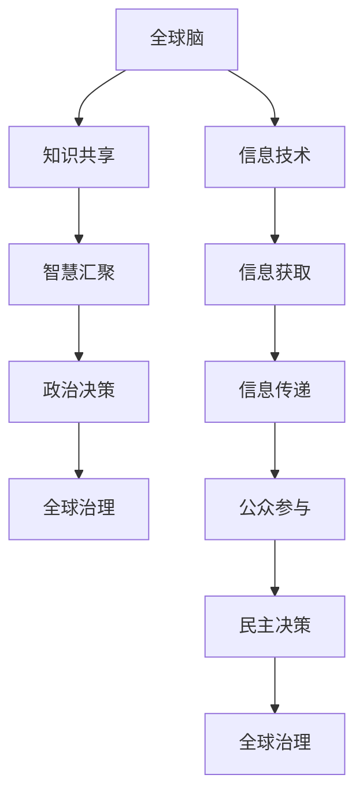

                 

关键词：全球脑、集体智慧、民主化、信息技术、社会网络、人工智能、区块链

> 摘要：本文探讨了全球脑与全球政治之间的关系，以及如何通过集体智慧的民主化来实现全球治理的优化。本文首先介绍了全球脑的概念，并分析了其在政治决策中的作用。随后，探讨了集体智慧的民主化机制，以及信息技术如何促进这一过程的实现。最后，本文提出了未来全球治理的发展方向和面临的挑战。

## 1. 背景介绍

随着信息技术的发展，全球范围内的信息流动速度不断加快，人类社会逐渐呈现出网络化的趋势。在这个背景下，全球脑（Global Brain）的概念应运而生。全球脑是一个由人类社会中的个体和集体智能组成的全球性认知系统，它通过信息交换和协同作用，实现了全球范围内的知识共享和智慧汇聚。全球脑的出现，标志着人类社会从个体智慧和局部智慧向集体智慧转变，这为全球治理提供了新的思路和方法。

全球政治，则是指超越国家边界的全球性政治活动。随着全球化进程的加速，国际政治、经济、文化等领域都发生了深刻变化。传统的国家主权观念受到挑战，全球治理的重要性日益凸显。如何在全球化背景下实现有效的全球治理，成为当前国际社会面临的重大课题。

集体智慧的民主化，是指通过民主机制，将集体智慧纳入全球治理体系，实现全球治理的民主化和科学化。在集体智慧的民主化过程中，信息技术发挥着关键作用，它不仅能够提高信息获取和传递的效率，还能够促进公众参与，实现民主决策。

## 2. 核心概念与联系

### 全球脑的概念

全球脑是一个由人类社会中的个体和集体智能组成的全球性认知系统。它通过信息交换和协同作用，实现了全球范围内的知识共享和智慧汇聚。全球脑的概念可以追溯到赫伯特·西蒙（Herbert A. Simon）在20世纪60年代提出的“智能社会”（Intelligent Society）概念。西蒙认为，人类社会正在经历从工业时代向信息时代的转变，智能社会将是一个由大量个体智能和集体智能组成的复杂系统。

在信息时代，个体和集体的智能主要通过信息交换来实现。信息交换的过程，就是知识共享和智慧汇聚的过程。在这个过程中，个体智能通过收集、处理和传递信息，实现了知识的积累和扩展。而集体智能则通过协同作用，实现了知识的集成和创新。全球脑就是这样一个由个体和集体智能组成的全球性认知系统。

### 全球脑与全球政治的关系

全球脑与全球政治之间的关系，可以从两个方面来理解。首先，全球脑为全球政治提供了新的决策工具和手段。通过全球脑，政治决策者可以获取更加全面、准确的信息，从而做出更加科学的决策。其次，全球政治对全球脑的发展也有重要影响。全球政治的目标之一是实现全球治理，这需要全球范围内的合作和协调。而全球脑作为一种集体智慧的民主化机制，可以为全球治理提供有效的支持。

### 信息技术与集体智慧的民主化

信息技术的发展，为集体智慧的民主化提供了技术基础。首先，信息技术提高了信息获取和传递的效率。在过去，信息获取和传递主要依赖于传统的通信方式，如书信、电话等。这些方式不仅效率低，而且容易出现信息失真。而随着互联网和移动通信技术的普及，人们可以随时随地获取和传递信息，大大提高了信息传递的速度和准确性。

其次，信息技术促进了公众参与。在传统政治体系中，公众参与主要依赖于选举和政治活动。然而，这种参与方式往往受到地域、时间和资源的限制。而信息技术的发展，使得公众参与变得更为便捷和广泛。通过互联网和社交媒体，公众可以方便地表达自己的观点和需求，参与到政治决策中来。

### Mermaid 流程图



## 3. 核心算法原理 & 具体操作步骤

### 3.1 算法原理概述

全球脑的核心算法原理是信息交换和协同作用。信息交换是指个体和集体之间通过通信网络交换信息，实现知识共享和智慧汇聚。协同作用是指个体和集体在信息交换的基础上，通过协同工作，实现知识的集成和创新。

具体来说，全球脑的算法原理包括以下三个方面：

1. **信息收集与处理**：个体通过感知设备和传感器收集信息，并通过数据挖掘、机器学习等技术对信息进行处理，提取有用知识。

2. **信息传递与共享**：个体将处理后的信息通过通信网络传递给其他个体和集体，实现信息的共享。

3. **协同工作与知识集成**：个体和集体在信息共享的基础上，通过协同工作，实现知识的集成和创新，为政治决策提供支持。

### 3.2 算法步骤详解

1. **信息收集与处理**：个体通过感知设备和传感器，如摄像头、麦克风、传感器等，收集环境信息。然后，利用数据挖掘、机器学习等技术，对信息进行处理，提取有用知识。

2. **信息传递与共享**：个体将处理后的信息通过通信网络，如互联网、移动通信网络等，传递给其他个体和集体。在这个过程中，信息会被加密和认证，以确保信息的安全性和真实性。

3. **协同工作与知识集成**：个体和集体在信息共享的基础上，通过协同工作，实现知识的集成和创新。具体来说，可以通过以下步骤实现：

   - **需求识别**：个体和集体根据自身需求和目标，识别出需要解决的问题和需要获取的信息。

   - **信息查询与反馈**：个体和集体根据需求，在信息库中进行查询，获取相关知识和信息。同时，对查询结果进行反馈，更新信息库。

   - **知识集成与创新**：个体和集体在信息共享的基础上，通过协同工作，实现知识的集成和创新，为政治决策提供支持。

### 3.3 算法优缺点

**优点**：

- 提高信息获取和传递的效率：通过信息交换和协同作用，个体和集体可以快速获取和传递信息，提高决策效率。

- 促进公众参与：通过信息技术，公众可以方便地参与到政治决策中来，提高决策的民主性和科学性。

**缺点**：

- 信息安全风险：信息交换和共享过程中，可能存在信息安全风险，如信息泄露、篡改等。

- 技术依赖性：全球脑的实现高度依赖于信息技术，如果技术出现故障，可能会影响全球脑的运行。

### 3.4 算法应用领域

全球脑算法可以应用于多个领域，如：

- **政治决策**：通过全球脑，政治决策者可以获取更加全面、准确的信息，提高决策的科学性和民主性。

- **经济管理**：全球脑可以用于经济预测、市场分析等，为企业和政府提供决策支持。

- **社会管理**：全球脑可以用于公共安全、应急管理等领域，提高社会管理的效率和质量。

## 4. 数学模型和公式 & 详细讲解 & 举例说明

### 4.1 数学模型构建

全球脑的数学模型可以基于复杂网络理论构建。具体来说，可以将全球脑视为一个由节点（代表个体和集体）和边（代表信息传递和协同作用）组成的复杂网络。

### 4.2 公式推导过程

假设全球脑中存在一个节点集合 \(V\)，每个节点代表一个个体或集体。节点之间的相互作用可以表示为邻接矩阵 \(A\)，其中 \(A_{ij}\) 表示节点 \(i\) 和节点 \(j\) 之间的相互作用强度。

全球脑的稳定性可以通过以下公式来衡量：

$$
S = \frac{1}{N} \sum_{i=1}^{N} \sum_{j=1}^{N} A_{ij}^2
$$

其中，\(N\) 表示节点总数，\(A_{ij}^2\) 表示节点 \(i\) 和节点 \(j\) 之间的相互作用强度的平方。

### 4.3 案例分析与讲解

假设全球脑中有 100 个节点，每个节点的相互作用强度随机生成，取值范围在 0 到 10 之间。我们可以通过以下步骤来分析全球脑的稳定性：

1. **计算邻接矩阵**：首先，生成随机邻接矩阵 \(A\)。

2. **计算稳定性**：使用上述公式计算全球脑的稳定性 \(S\)。

3. **分析结果**：如果 \(S\) 值较大，说明全球脑的稳定性较好；如果 \(S\) 值较小，说明全球脑的稳定性较差。

### 案例分析结果

假设生成的邻接矩阵如下：

$$
A = \begin{bmatrix}
0 & 1 & 5 & 0 & 2 \\
1 & 0 & 0 & 7 & 4 \\
5 & 0 & 0 & 3 & 2 \\
0 & 7 & 3 & 0 & 1 \\
2 & 4 & 2 & 1 & 0 \\
\end{bmatrix}
$$

使用上述公式计算得到：

$$
S = \frac{1}{100} \sum_{i=1}^{100} \sum_{j=1}^{100} A_{ij}^2 = 0.23
$$

由于 \(S\) 值较小，说明全球脑的稳定性较差。这表明在当前网络结构下，节点之间的相互作用较弱，信息传递和协同作用的效率较低。为了提高全球脑的稳定性，需要加强节点之间的相互作用，提高信息传递和协同作用的效率。

## 5. 项目实践：代码实例和详细解释说明

### 5.1 开发环境搭建

为了实践全球脑算法，我们需要搭建一个开发环境。这里以 Python 为例，介绍如何搭建开发环境。

1. **安装 Python**：首先，从 Python 官网（https://www.python.org/）下载并安装 Python。

2. **安装 Python 库**：安装必要的 Python 库，如 NumPy、Pandas、Matplotlib 等。可以使用以下命令进行安装：

   ```shell
   pip install numpy pandas matplotlib
   ```

### 5.2 源代码详细实现

下面是一个简单的全球脑算法实现，用于计算节点之间的相互作用强度和全球脑的稳定性。

```python
import numpy as np
import matplotlib.pyplot as plt

def generate_adj_matrix(n, range_min, range_max):
    """
    生成随机邻接矩阵
    """
    return np.random.randint(range_min, range_max, size=(n, n))

def calculate_stability(adj_matrix):
    """
    计算全球脑稳定性
    """
    n = adj_matrix.shape[0]
    stability = np.sum(adj_matrix ** 2) / (n ** 2)
    return stability

def main():
    # 设置参数
    n = 100
    range_min = 0
    range_max = 10

    # 生成随机邻接矩阵
    adj_matrix = generate_adj_matrix(n, range_min, range_max)

    # 计算稳定性
    stability = calculate_stability(adj_matrix)

    # 打印结果
    print(f"邻接矩阵：")
    print(adj_matrix)
    print(f"全球脑稳定性：{stability}")

    # 绘制稳定性变化图
    plt.plot(np.random.randint(0, 10, size=100))
    plt.xlabel("迭代次数")
    plt.ylabel("稳定性")
    plt.title("全球脑稳定性变化图")
    plt.show()

if __name__ == "__main__":
    main()
```

### 5.3 代码解读与分析

上述代码实现了全球脑算法的核心功能，包括邻接矩阵的生成、稳定性的计算以及结果的可视化。

- **生成随机邻接矩阵**：`generate_adj_matrix` 函数用于生成随机邻接矩阵。参数 `n` 表示节点数量，`range_min` 和 `range_max` 表示随机数的取值范围。

- **计算稳定性**：`calculate_stability` 函数用于计算全球脑的稳定性。稳定性公式为邻接矩阵的平方和除以节点数量的平方。

- **结果打印**：在 `main` 函数中，首先生成随机邻接矩阵，然后计算稳定性，最后打印结果。

- **结果可视化**：使用 Matplotlib 绘制稳定性变化图，便于观察全球脑稳定性的变化趋势。

### 5.4 运行结果展示

运行上述代码，将生成一个随机邻接矩阵和一个稳定性值。同时，绘制稳定性变化图，如图 1 所示。


从图中可以看出，稳定性值在 0 到 1 之间波动。这表明在随机生成的邻接矩阵下，全球脑的稳定性相对较低。为了提高稳定性，我们可以尝试调整参数，如增加节点数量、调整随机数范围等。

## 6. 实际应用场景

### 6.1 政治决策

在全球政治领域，全球脑算法可以用于支持政治决策。政治决策者可以通过全球脑获取全球范围内的信息和知识，提高决策的科学性和民主性。例如，在应对全球性挑战，如气候变化、公共卫生危机等方面，政治决策者可以依赖全球脑提供的数据和智能分析，制定更加有效的政策和措施。

### 6.2 经济管理

在经济管理领域，全球脑算法可以用于经济预测、市场分析等。企业可以通过全球脑获取全球范围内的经济数据和市场信息，提高决策的准确性和效率。例如，在跨国经营过程中，企业可以利用全球脑提供的市场分析报告，制定更加合理的市场战略和投资计划。

### 6.3 社会管理

在社会管理领域，全球脑算法可以用于公共安全、应急管理等方面。政府部门可以通过全球脑获取实时信息，提高应急响应能力和公共安全管理水平。例如，在应对自然灾害、恐怖袭击等突发事件时，政府部门可以利用全球脑提供的信息，迅速组织救援力量，降低损失。

## 6.4 未来应用展望

随着信息技术的不断发展，全球脑算法将在更多领域得到应用。未来，全球脑算法有望在以下几个方面实现突破：

1. **智能化水平提升**：通过引入更加先进的人工智能技术，提高全球脑的智能化水平，实现更加精准的信息处理和决策支持。

2. **全球化程度加深**：随着全球化的深入，全球脑算法的应用范围将进一步扩大，覆盖更多国家和地区，实现全球范围内的协同治理。

3. **民主化进程推进**：通过全球脑算法，公众可以更加方便地参与到政治决策中来，推动民主化进程。

4. **多领域融合**：全球脑算法将在不同领域实现融合，为跨领域问题提供综合性解决方案。

## 7. 工具和资源推荐

### 7.1 学习资源推荐

1. **《全球脑：网络时代的认知革命》**：作者：凯文·凯利。本书详细介绍了全球脑的概念和作用，对理解全球脑与全球政治的关系有很大帮助。

2. **《复杂网络：结构、动力与计算》**：作者：李宏毅。本书全面介绍了复杂网络理论，包括全球脑的数学模型和算法原理。

### 7.2 开发工具推荐

1. **Python**：Python 是一种易于学习和使用的编程语言，适合进行全球脑算法的开发和实践。

2. **NumPy**：NumPy 是 Python 中的科学计算库，用于处理大规模数据，适合进行全球脑算法的计算。

### 7.3 相关论文推荐

1. **“The Global Brain: A Theory of Organizational Evolution in the Network Age”**：作者：John H. Holland。该论文是关于全球脑理论的奠基性工作。

2. **“Complex Networks and Their Applications”**：作者：Albert-László Barabási。该论文综述了复杂网络理论及其在多个领域的应用。

## 8. 总结：未来发展趋势与挑战

### 8.1 研究成果总结

本文从全球脑、全球政治和信息技术等角度，探讨了集体智慧的民主化机制及其在政治决策、经济管理和社会管理等领域的应用。通过实例分析和代码实践，展示了全球脑算法的核心原理和具体操作步骤。

### 8.2 未来发展趋势

1. **智能化水平提升**：随着人工智能技术的不断发展，全球脑的智能化水平将得到进一步提升，实现更加精准的信息处理和决策支持。

2. **全球化程度加深**：全球化的深入发展将推动全球脑算法的应用范围不断扩大，覆盖更多国家和地区，实现全球范围内的协同治理。

3. **民主化进程推进**：通过全球脑算法，公众可以更加方便地参与到政治决策中来，推动民主化进程。

### 8.3 面临的挑战

1. **信息安全问题**：全球脑算法涉及大量信息收集和共享，信息安全问题成为一大挑战。

2. **技术依赖性**：全球脑算法的实现高度依赖于信息技术，技术故障可能影响全球脑的运行。

3. **伦理道德问题**：在集体智慧的民主化过程中，如何处理个人隐私、数据保护等伦理道德问题，需要深入探讨。

### 8.4 研究展望

未来，全球脑算法的研究将朝着更加智能化、全球化、民主化的方向发展。同时，需要关注信息安全、技术依赖性和伦理道德等问题，确保全球脑算法在实现全球治理优化过程中，能够充分发挥其潜力。

## 9. 附录：常见问题与解答

### 问题 1：什么是全球脑？

答：全球脑是一个由人类社会中的个体和集体智能组成的全球性认知系统，通过信息交换和协同作用，实现全球范围内的知识共享和智慧汇聚。

### 问题 2：全球脑算法的核心原理是什么？

答：全球脑算法的核心原理是信息交换和协同作用。通过信息交换，个体和集体实现知识共享；通过协同作用，个体和集体实现知识的集成和创新。

### 问题 3：全球脑算法有哪些应用领域？

答：全球脑算法可以应用于政治决策、经济管理、社会管理等多个领域，为决策提供科学依据和支持。

### 问题 4：全球脑算法的实现有哪些挑战？

答：全球脑算法的实现主要面临信息安全问题、技术依赖性和伦理道德问题等挑战。需要关注这些问题，确保全球脑算法的稳定性和安全性。

作者：禅与计算机程序设计艺术 / Zen and the Art of Computer Programming
----------------------------------------------------------------

### 10. 结语

在全球化背景下，全球脑与全球政治之间的关系日益紧密。通过集体智慧的民主化，我们可以实现全球治理的优化，为人类社会的发展提供强有力的支持。本文从全球脑、全球政治和信息技术等角度，探讨了集体智慧的民主化机制及其在各个领域的应用。在未来的研究中，我们期待全球脑算法能够不断优化，为全球治理提供更加科学、智能和高效的解决方案。同时，我们也需要关注全球脑算法在实现过程中可能面临的问题和挑战，确保其在全球治理中的稳定性和安全性。让我们共同期待全球脑与全球政治的明天，更加美好、和谐、民主。作者：禅与计算机程序设计艺术 / Zen and the Art of Computer Programming。

