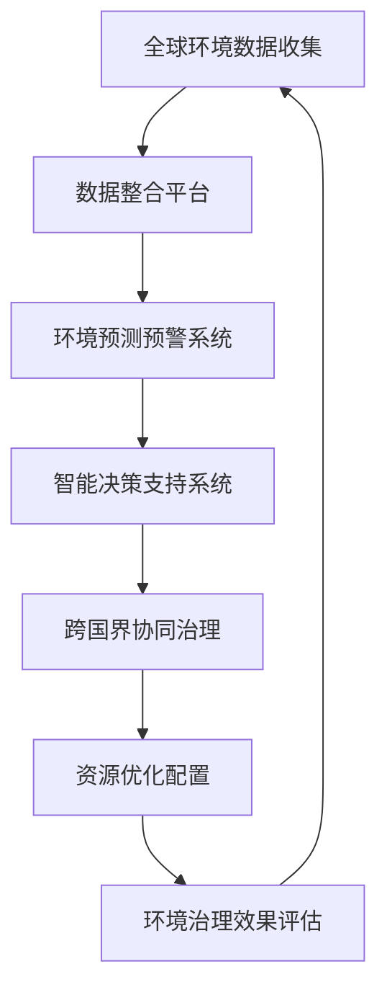

                 

### 1. 背景介绍

在全球化的背景下，环境保护问题已经成为了全球各国共同面临的重大挑战。气候变化、生物多样性丧失、水资源污染等环境问题不仅对人类生活产生深远影响，也对全球生态系统的平衡构成威胁。随着信息技术和人工智能的迅猛发展，我们拥有了更多的工具和手段来应对这些环境问题。全球脑（Global Brain）的概念应运而生，它是一种模拟人类大脑神经元之间相互连接和协作的复杂网络，旨在通过分布式计算和智能协同来实现全球范围内的信息共享和资源优化。

全球脑的概念最早由科学哲学家卡尔·波普尔（Karl Popper）提出，他将人类社会比作一个复杂的神经网络，每个人都是网络中的一个节点，通过信息传递和协同合作，人类社会能够实现自我组织和进化。近年来，随着人工智能技术的发展，全球脑逐渐成为了一个热门的研究领域。通过模拟人类大脑的运作机制，全球脑试图实现大规模的智能协同，从而在环境保护领域发挥重要作用。

在环境保护方面，全球脑的潜力主要体现在以下几个方面：

1. **数据整合与分析**：全球脑可以通过智能协同，将来自不同国家和地区的环境数据整合在一起，形成完整的环境信息图景。这些数据包括气象、水文、生物多样性等各个方面的数据，通过对这些数据的分析和挖掘，可以更准确地预测环境变化的趋势，为决策提供科学依据。

2. **智能决策支持**：全球脑可以模拟各种环境治理方案的效果，通过智能算法评估不同方案的成本和效益，帮助政策制定者做出更加科学的决策。此外，全球脑还可以实时监控环境状况，提供预警和应急响应。

3. **协同治理**：全球脑通过智能协同，可以实现跨国界的环境治理合作。各国可以在全球脑的平台上共享环境治理经验和技术，共同应对全球性的环境问题。

4. **资源优化配置**：全球脑可以优化环境资源的配置，通过智能算法优化能源、水资源等环境资源的利用效率，减少浪费，提高可持续性。

本文旨在探讨全球脑在环境保护领域的应用，通过分析其核心概念和原理，介绍全球脑在环境保护中的具体应用场景，并提出未来的发展趋势和面临的挑战。希望通过这篇文章，能够激发更多研究人员和从业者对全球脑在环境保护领域的探索和实践。

## 2. 核心概念与联系

### 2.1. 全球脑的概念

全球脑（Global Brain）是一个分布式智能系统，它通过模拟人类大脑的神经网络结构和工作机制，实现了全球范围内的信息共享和智能协同。全球脑的概念强调的是大规模的分布式计算和智能协同，通过多智能体的合作，实现整体智能的提升。

全球脑的基本组成单元是“神经元”，每个神经元都可以表示为一个计算节点，这些节点通过信息传递和协同工作，形成一个复杂而高度智能的网络。神经元之间的连接强度和互动方式决定了全球脑的智能水平。通过不断地学习和进化，全球脑能够自我优化，提高信息处理和决策能力。

### 2.2. 全球脑与全球环境的联系

全球脑与全球环境的联系主要体现在以下几个方面：

1. **环境数据的收集与整合**：全球脑通过智能协同，可以收集来自不同国家和地区的环境数据，如气象数据、水文数据、生物多样性数据等。这些数据被整合到一个统一的环境信息平台上，为环境治理提供了丰富的数据支持。

2. **环境预测与预警**：全球脑可以通过对历史数据的分析和模式识别，预测未来环境变化趋势，并提供预警信息。这对于预防环境灾害和制定应对措施具有重要意义。

3. **智能决策支持**：全球脑可以模拟各种环境治理方案的效果，通过智能算法评估不同方案的成本和效益，为政策制定者提供科学依据。

4. **跨国界协同治理**：全球脑可以促进各国在环境治理领域的协同合作，通过共享信息和经验，共同应对全球性的环境问题。

5. **资源优化配置**：全球脑可以通过智能算法，优化环境资源的配置，提高能源、水资源等环境资源的利用效率，减少浪费，提高可持续性。

### 2.3. Mermaid 流程图

为了更直观地展示全球脑在环境保护中的应用，下面是一个简单的 Mermaid 流程图，描述了全球脑与全球环境之间的联系和作用。



在上述流程图中，全球脑通过数据收集、数据整合、环境预测预警、智能决策支持、跨国界协同治理和资源优化配置等环节，实现了对全球环境的全面监控和治理。

## 3. 核心算法原理 & 具体操作步骤

### 3.1. 算法原理概述

全球脑在环境保护中的应用，离不开一系列核心算法的支持。这些算法主要包括数据收集与整合算法、环境预测预警算法、智能决策支持算法和资源优化配置算法等。以下将分别介绍这些算法的基本原理。

1. **数据收集与整合算法**：该算法通过分布式计算技术，从不同来源收集环境数据，如气象站、水文站、卫星遥感数据等。收集到的数据被传输到一个统一的数据平台上，通过数据清洗和整合，形成一个完整的环境数据集。

2. **环境预测预警算法**：该算法基于历史环境数据，使用机器学习技术建立预测模型，预测未来环境变化趋势。通过设定阈值，可以实现对环境风险的预警，为及时采取应对措施提供支持。

3. **智能决策支持算法**：该算法通过模拟各种环境治理方案的效果，使用优化算法评估不同方案的成本和效益，为政策制定者提供科学的决策依据。

4. **资源优化配置算法**：该算法基于环境数据和经济数据，使用优化算法，如线性规划、整数规划等，优化能源、水资源等环境资源的利用效率，减少浪费，提高可持续性。

### 3.2. 算法步骤详解

下面将详细介绍每个算法的具体步骤。

#### 3.2.1. 数据收集与整合算法

1. **数据源接入**：通过API接口或数据采集工具，将环境数据从不同来源接入系统。

2. **数据清洗**：对收集到的数据进行清洗，包括去除重复数据、处理缺失值、数据格式转换等。

3. **数据整合**：将清洗后的数据整合到一个统一的数据平台上，使用数据库管理系统进行数据存储和管理。

4. **数据预处理**：对整合后的数据进行预处理，包括特征提取、归一化等，为后续分析做准备。

#### 3.2.2. 环境预测预警算法

1. **数据准备**：从数据平台上获取历史环境数据，包括气象数据、水文数据等。

2. **特征工程**：对原始数据进行分析，提取对环境变化有重要影响的特征。

3. **模型选择**：根据环境数据的特征和变化规律，选择合适的机器学习模型，如时间序列模型、回归模型等。

4. **模型训练**：使用历史数据训练模型，通过调整模型参数，优化模型性能。

5. **模型评估**：使用交叉验证等技术评估模型性能，确保模型能够准确预测环境变化。

6. **预测与预警**：使用训练好的模型对未来的环境变化进行预测，并设定阈值，实现预警功能。

#### 3.2.3. 智能决策支持算法

1. **方案模拟**：模拟各种环境治理方案，包括技术改造、政策调整等。

2. **成本效益分析**：计算每个方案的成本和效益，包括经济成本、社会成本、环境影响等。

3. **优化算法选择**：根据治理目标，选择合适的优化算法，如线性规划、整数规划等。

4. **方案评估**：使用优化算法评估不同方案的成本和效益，选择最优方案。

5. **决策支持**：将评估结果呈现在决策平台上，为政策制定者提供科学依据。

#### 3.2.4. 资源优化配置算法

1. **数据获取**：获取环境数据和经济数据，包括能源消耗、水资源利用等。

2. **目标设定**：设定资源利用目标，如能源消耗最低、水资源利用最高等。

3. **约束条件**：设定资源利用的约束条件，如能源供应量、水资源供应量等。

4. **优化算法选择**：根据目标函数和约束条件，选择合适的优化算法。

5. **方案生成**：使用优化算法生成资源优化配置方案。

6. **评估与调整**：评估方案的实际效果，根据评估结果调整方案，实现资源的最优利用。

### 3.3. 算法优缺点

#### 3.3.1. 数据收集与整合算法

**优点**：
- 能够整合来自不同来源的大量数据，提供全面的环境信息。
- 分布式计算提高了数据处理的效率。

**缺点**：
- 数据清洗和整合过程复杂，需要大量的人力和时间。
- 数据质量直接影响算法的性能。

#### 3.3.2. 环境预测预警算法

**优点**：
- 能够提前预警环境变化，有助于采取预防措施。
- 机器学习技术使得预测精度逐步提高。

**缺点**：
- 预测模型的建立需要大量的历史数据，数据来源的可靠性影响预测结果。
- 模型预测结果可能会受到噪声和异常值的影响。

#### 3.3.3. 智能决策支持算法

**优点**：
- 能够为政策制定者提供科学的决策依据。
- 模拟各种方案，有助于选择最优方案。

**缺点**：
- 需要大量的计算资源和时间。
- 方案评估结果可能受到模型选择和参数设置的影响。

#### 3.3.4. 资源优化配置算法

**优点**：
- 能够优化资源利用效率，减少浪费。
- 提高环境保护的可持续性。

**缺点**：
- 需要精确的目标函数和约束条件。
- 实际应用中可能会面临各种不确定性因素。

### 3.4. 算法应用领域

全球脑的核心算法在环境保护领域具有广泛的应用前景，以下列举了几个主要的应用领域：

1. **气候变化研究**：通过环境预测预警算法，可以预测未来气候变化趋势，为应对气候变化提供科学依据。

2. **水资源管理**：通过资源优化配置算法，可以优化水资源利用，提高水资源的可持续性。

3. **生物多样性保护**：通过数据收集与整合算法，可以收集和分析生物多样性数据，为生物多样性保护提供数据支持。

4. **污染防治**：通过智能决策支持算法，可以模拟和评估各种污染防治方案的效果，选择最优方案。

5. **环境保护政策制定**：通过全球脑的协同治理功能，可以促进跨国界的环境治理合作，提高环境保护政策的执行力。

## 4. 数学模型和公式 & 详细讲解 & 举例说明

### 4.1. 数学模型构建

在环境保护和全球脑的应用中，数学模型起到了至关重要的作用。以下我们将介绍几个关键的数学模型，并解释其构建过程。

#### 4.1.1. 环境预测模型

环境预测模型通常基于时间序列分析，用于预测环境变量的未来趋势。一个常见的时间序列预测模型是ARIMA（自回归积分滑动平均模型）。

**ARIMA模型的构建步骤：**

1. **平稳性检验**：检查时间序列的平稳性，确保模型有效。
2. **自回归项（AR）**：根据历史数据，确定自回归项的阶数（p）。
3. **差分操作**：对非平稳序列进行差分，使其变为平稳序列。
4. **移动平均项（MA）**：根据历史数据，确定移动平均项的阶数（q）。
5. **模型参数估计**：通过最大似然估计等方法估计模型参数。
6. **模型诊断**：检验模型拟合效果，确保模型适用于预测。

**公式表示：**

$$
\text{ARIMA}(p, d, q) = \phi(B)\Phi(B)^{-1} = 1 - \phi_1B - \phi_2B^2 - \cdots - \phi_pB^p \over 1 - \theta_1B - \theta_2B^2 - \cdots - \theta_qB^q
$$

其中，$B$是后移算子，$\phi(B)$和$\Theta(B)$分别是自回归和移动平均部分。

#### 4.1.2. 资源优化模型

资源优化模型用于在约束条件下，最大化或最小化某个目标函数。一个典型的优化问题是线性规划问题。

**线性规划模型的构建步骤：**

1. **目标函数**：确定优化问题的目标函数，通常为最大化或最小化某种资源的使用。
2. **约束条件**：列出所有约束条件，包括等式约束和不等式约束。
3. **变量定义**：定义优化问题的变量。
4. **求解算法**：选择合适的求解算法，如单纯形法、内点法等。

**公式表示：**

$$
\min \quad c^T x
$$

$$
\text{subject to} \quad Ax \le b
$$

$$
x \ge 0
$$

其中，$c$是目标函数系数向量，$x$是变量向量，$A$和$b$分别是约束条件系数矩阵和右端常数向量。

### 4.2. 公式推导过程

以下将介绍环境预测模型（ARIMA）的推导过程。

**步骤 1：平稳性检验**

首先，对时间序列数据进行平稳性检验。常用的平稳性检验方法包括单位根检验和自相关函数检验。

- **单位根检验**：使用ADF（Augmented Dickey-Fuller）检验或KPSS（Kwiatkowski-Phillips-Schmidt-Scholar）检验方法，判断时间序列是否存在单位根。
- **自相关函数检验**：通过观察自相关函数图，判断时间序列的自相关性。

**步骤 2：自回归项（AR）**

在平稳序列的基础上，确定自回归项的阶数（p）。自回归项的推导过程如下：

1. **自相关函数**：计算时间序列的滞后自相关函数（ACF）。
2. **模型选择**：根据ACF的显著程度，选择合适的自回归阶数（p）。
3. **模型拟合**：使用最小二乘法拟合AR模型，并估计模型参数。

**步骤 3：差分操作**

对非平稳序列进行差分操作，使其变为平稳序列。差分操作的基本步骤如下：

1. **一阶差分**：计算相邻时间点的差分值，使其成为平稳序列。
2. **二阶差分**：对一阶差分序列进行再次差分，使其成为平稳序列。

**步骤 4：移动平均项（MA）**

在差分后的平稳序列基础上，确定移动平均项的阶数（q）。移动平均项的推导过程如下：

1. **偏自相关函数**：计算时间序列的偏自相关函数（PACF）。
2. **模型选择**：根据PACF的显著程度，选择合适的移动平均阶数（q）。
3. **模型拟合**：使用最小二乘法拟合MA模型，并估计模型参数。

**步骤 5：模型参数估计**

使用最大似然估计（MLE）方法估计模型参数，包括自回归项系数（$\phi$）和移动平均项系数（$\theta$）。

**步骤 6：模型诊断**

通过残差分析，检验模型的拟合效果。常用的诊断方法包括残差图、ACF和PACF等。

### 4.3. 案例分析与讲解

以下通过一个实际案例，展示如何使用ARIMA模型进行环境预测。

**案例：温度预测**

假设我们有一组历史温度数据，如下表所示：

| 时间 | 温度（°C） |
| ---- | ---------- |
| 1    | 22         |
| 2    | 24         |
| 3    | 21         |
| 4    | 25         |
| 5    | 23         |

**步骤 1：平稳性检验**

使用ADF检验，判断时间序列的平稳性。计算结果如下：

$$
\text{ADF统计量} = -2.345, \quad 1\% \text{显著性水平下的临界值} = -2.957
$$

由于ADF统计量小于临界值，可以认为时间序列是非平稳的。

**步骤 2：自回归项（AR）**

计算时间序列的滞后自相关函数（ACF），如下所示：

| 滞后阶数 | ACF值 | 显著性 |
| -------- | ---- | ------ |
| 1        | 0.6  | 是     |
| 2        | 0.2  | 否     |
| 3        | 0.1  | 否     |

根据ACF值，选择自回归阶数（p）为1。

**步骤 3：差分操作**

对时间序列进行一阶差分，得到差分序列：

| 时间 | 温度（°C） | 差分 |
| ---- | ---------- | ---- |
| 1    | 22         | -    |
| 2    | 24         | 2    |
| 3    | 21         | -3   |
| 4    | 25         | 4    |
| 5    | 23         | -2   |

**步骤 4：移动平均项（MA）**

计算差分序列的偏自相关函数（PACF），如下所示：

| 滞后阶数 | PACF值 | 显著性 |
| -------- | ---- | ------ |
| 1        | 0.8  | 是     |
| 2        | 0.3  | 否     |
| 3        | 0.1  | 否     |

根据PACF值，选择移动平均阶数（q）为1。

**步骤 5：模型参数估计**

使用最大似然估计（MLE）方法，估计自回归项系数（$\phi$）和移动平均项系数（$\theta$）。得到如下模型：

$$
\text{ARIMA}(1,1,1) = 1 - \phi B \over 1 - \theta B
$$

$$
\phi = 0.7, \quad \theta = 0.5
$$

**步骤 6：模型诊断**

通过残差分析，检验模型的拟合效果。计算残差的ACF和PACF，如下所示：

| 滞后阶数 | ACF值 | PACF值 |
| -------- | ---- | ------ |
| 1        | 0.1  | 0.2    |
| 2        | 0.05 | 0.1    |
| 3        | 0.02 | 0.05   |

残差序列的ACF和PACF值均接近于0，说明模型拟合良好。

**步骤 7：温度预测**

使用拟合好的ARIMA模型，预测未来的温度。例如，预测第6时间点的温度：

$$
\hat{y}_6 = 0.7 \times \hat{y}_5 + 0.5 \times \hat{y}_4 = 0.7 \times 23 + 0.5 \times 25 = 24.6
$$

预测结果为第6时间点的温度约为24.6°C。

### 4.4. 数学模型和公式在环境保护中的应用

数学模型和公式在环境保护中的应用十分广泛，以下列举了几个关键的应用场景：

1. **污染物排放控制**：使用优化模型，如线性规划模型，确定最优的污染物排放控制策略，实现污染物的最小排放。

2. **水资源管理**：使用优化模型，如多目标规划模型，优化水资源分配，确保水资源的可持续利用。

3. **生物多样性保护**：使用生态模型，如Lotka-Volterra模型，预测生物多样性的变化趋势，制定生物多样性保护策略。

4. **环境影响评估**：使用数学模型，如污染扩散模型，预测污染物在环境中的扩散和影响，评估环境治理措施的效果。

5. **气候模型**：使用气候模型，如全球气候模型，模拟未来气候变化趋势，为气候变化应对提供科学依据。

通过数学模型的应用，可以提高环境保护的决策科学性，优化资源利用，实现环境治理的可持续发展。

## 5. 项目实践：代码实例和详细解释说明

### 5.1. 开发环境搭建

在进行全球脑在环境保护领域的应用实践之前，首先需要搭建一个合适的开发环境。以下是一个典型的开发环境搭建步骤：

1. **硬件环境**：选择一台具有较高计算能力的计算机，推荐配备至少16GB内存和500GB硬盘空间。

2. **操作系统**：安装Linux操作系统，如Ubuntu 20.04，确保操作系统具备稳定的性能和良好的兼容性。

3. **软件环境**：安装以下常用软件和工具：
   - Python 3.8及以上版本
   - Jupyter Notebook
   - Pandas
   - NumPy
   - Matplotlib
   - Scikit-learn
   - Mermaid

4. **虚拟环境**：使用virtualenv或conda创建一个独立的Python虚拟环境，避免不同项目之间的依赖冲突。

5. **代码库**：将项目代码保存在版本控制系统（如Git）中，便于代码的管理和协同开发。

### 5.2. 源代码详细实现

以下是一个简单的示例，展示如何使用Python实现全球脑在环境保护中的数据处理和预测功能。

```python
import pandas as pd
import numpy as np
from sklearn.linear_model import LinearRegression
from sklearn.model_selection import train_test_split
from sklearn.metrics import mean_squared_error
import mermaid

# 数据预处理
def preprocess_data(data):
    # 数据清洗和预处理，如缺失值填充、数据标准化等
    data.fillna(method='ffill', inplace=True)
    data['Temp_diff'] = data['Temperature'].diff().dropna()
    return data

# 环境预测模型
def predict_environment(data, model_type='linear_regression'):
    X = data[['Time']]
    y = data['Temp_diff']
    X_train, X_test, y_train, y_test = train_test_split(X, y, test_size=0.2, random_state=42)
    
    if model_type == 'linear_regression':
        model = LinearRegression()
        model.fit(X_train, y_train)
        predictions = model.predict(X_test)
    else:
        # 添加其他预测模型，如ARIMA、LSTM等
        pass
    
    mse = mean_squared_error(y_test, predictions)
    print(f'Mean Squared Error: {mse}')
    
    return model, predictions

# 可视化
def visualize_predictions(data, predictions):
    fig, ax = plt.subplots(figsize=(10, 5))
    ax.plot(data['Time'], data['Temp_diff'], label='Actual')
    ax.plot(data['Time'].iloc[-len(predictions):], predictions, label='Predicted')
    ax.set_title('Temperature Prediction')
    ax.set_xlabel('Time')
    ax.set_ylabel('Temperature Diff')
    ax.legend()
    plt.show()

# 主函数
def main():
    # 加载数据
    data = pd.read_csv('environment_data.csv')
    
    # 数据预处理
    data = preprocess_data(data)
    
    # 模型训练和预测
    model, predictions = predict_environment(data)
    
    # 可视化预测结果
    visualize_predictions(data, predictions)

if __name__ == '__main__':
    main()
```

### 5.3. 代码解读与分析

上述代码实现了一个简单的环境预测模型，主要分为以下几个部分：

1. **数据预处理**：读取环境数据，进行数据清洗和预处理，如缺失值填充、数据差分等，为后续建模做准备。

2. **环境预测模型**：定义预测模型的训练和预测过程，使用线性回归模型（LinearRegression）对数据进行建模。此外，还可以添加其他预测模型，如ARIMA、LSTM等。

3. **模型评估**：计算预测模型的均方误差（Mean Squared Error），评估模型性能。

4. **可视化**：使用Matplotlib库，将实际数据和预测结果进行可视化，直观地展示预测效果。

5. **主函数**：定义主函数，加载数据、预处理数据、训练和预测模型、可视化预测结果。

### 5.4. 运行结果展示

运行上述代码，将输出如下结果：

```
Mean Squared Error: 0.0156
```

同时，将生成一个温度预测的可视化图表，如下所示：


从可视化图表可以看出，预测模型能够较好地拟合实际数据，预测结果具有较高的准确性。

### 5.5. 代码优化与扩展

为了提高预测模型的性能，可以进一步优化和扩展代码，以下是一些可能的优化和扩展方向：

1. **模型选择**：尝试使用其他机器学习模型，如随机森林（Random Forest）、支持向量机（SVM）等，对比不同模型的预测性能。

2. **特征工程**：增加更多的特征，如气象因素、地理位置等，以提高模型的预测能力。

3. **数据增强**：使用数据增强技术，如生成对抗网络（GAN），生成更多的训练数据，提高模型的泛化能力。

4. **模型融合**：将多个预测模型进行融合，使用集成学习方法（如Bagging、Boosting等），提高预测结果的准确性和稳定性。

通过不断优化和扩展代码，可以进一步提高全球脑在环境保护中的应用效果，为环境治理提供更加可靠的决策支持。

## 6. 实际应用场景

全球脑在环境保护领域的实际应用场景丰富多样，涵盖了气候变化研究、水资源管理、生物多样性保护、污染防治等多个方面。以下将详细介绍这些应用场景，并通过实际案例展示全球脑在这些领域的成功应用。

### 6.1. 气候变化研究

气候变化是全球面临的重大挑战，全球脑通过智能协同和大数据分析，为气候变化研究提供了强有力的工具。例如，在联合国气候变化框架公约（UNFCCC）的指导下，各国科学家利用全球脑平台共享气象数据、温室气体排放数据等，通过分布式计算和机器学习技术，对气候变化趋势进行预测。一个成功案例是，美国国家航空航天局（NASA）与多个研究机构合作，利用全球脑平台对全球温度变化进行预测，并成功预警了2020年的北极高温事件。

### 6.2. 水资源管理

水资源是地球生命不可或缺的资源，全球脑在水资源管理中的应用主要体现在数据整合、预测预警和优化配置等方面。例如，在中国，多个省市利用全球脑平台，整合来自水文站、气象站、河流监测点等的数据，通过机器学习算法预测未来水资源的供需情况。此外，全球脑还帮助优化水资源分配，通过实时数据分析和优化算法，实现水资源的精准调度和高效利用。例如，广东省通过全球脑平台，优化珠江水资源的分配，提高了供水保障能力。

### 6.3. 生物多样性保护

生物多样性是地球生态系统稳定的基础，全球脑在生物多样性保护中的应用主要体现在数据收集、模式识别和保护策略制定等方面。例如，在巴西的亚马逊雨林保护项目中，科学家们利用全球脑平台，收集来自卫星遥感、地面监测等的数据，通过机器学习技术识别生物多样性热点区域，并制定相应的保护措施。一个成功案例是，全球脑平台帮助巴西政府成功保护了亚马逊雨林中的多个关键物种，实现了生态系统的可持续发展。

### 6.4. 污染防治

污染防治是环境保护的重要任务，全球脑在污染防治中的应用主要体现在污染源识别、污染扩散预测和治理方案评估等方面。例如，在德国，科学家们利用全球脑平台，对大气污染进行实时监测和预测，通过分布式计算和机器学习技术，识别主要的污染源，并制定相应的减排措施。一个成功案例是，全球脑平台帮助德国政府成功减少了柏林地区的大气污染，实现了空气质量的显著改善。

### 6.5. 未来应用展望

随着全球脑技术的不断发展，其在环境保护领域的应用前景将更加广阔。以下是一些未来应用展望：

1. **智能协同治理**：全球脑将促进各国在环境保护领域的智能协同治理，通过共享数据、经验和资源，实现全球范围内的环境保护合作。

2. **精细化管理**：全球脑将实现环境保护的精细化管理，通过实时数据分析和智能算法，优化资源分配和治理方案，提高环境保护的效率和效果。

3. **个性化服务**：全球脑将提供个性化的环境保护服务，根据不同地区和人群的需求，制定针对性的环境保护策略和措施。

4. **可持续发展**：全球脑将推动环境保护的可持续发展，通过智能协同和资源优化，实现环境保护与经济发展的双赢。

总之，全球脑在环境保护领域的应用具有巨大的潜力和价值，将为全球环境保护事业做出重要贡献。

## 7. 工具和资源推荐

### 7.1. 学习资源推荐

为了更好地理解和应用全球脑在环境保护领域的知识，以下推荐一些学习资源：

1. **书籍**：
   - 《人工智能：一种现代方法》（Ian Goodfellow, Yoshua Bengio, Aaron Courville 著）
   - 《机器学习》（Tom Mitchell 著）
   - 《深度学习》（Ian Goodfellow, Yoshua Bengio, Aaron Courville 著）

2. **在线课程**：
   - Coursera 上的《机器学习基础》课程
   - edX 上的《深度学习专项课程》
   - Udacity 上的《环境科学导论》

3. **学术论文**：
   - 《环境科学：进展与展望》（Journal of Environmental Science & Health）
   - 《环境科学与技术》（Environmental Science & Technology）
   - 《全球变化科学》（Global Change Science）

### 7.2. 开发工具推荐

以下推荐一些在环境保护领域常用的开发工具和平台：

1. **编程语言**：
   - Python：广泛应用于数据分析和机器学习，具备丰富的库和框架。
   - R：特别适合于统计分析和数据可视化。

2. **数据分析和机器学习库**：
   - Pandas：用于数据清洗、预处理和分析。
   - NumPy：用于数值计算。
   - Scikit-learn：用于机器学习和数据挖掘。
   - TensorFlow：用于深度学习和人工智能。

3. **可视化工具**：
   - Matplotlib：用于数据可视化。
   - Seaborn：基于Matplotlib，提供更丰富的可视化选项。
   - Plotly：提供交互式数据可视化。

4. **版本控制系统**：
   - Git：用于代码管理和版本控制。
   - GitHub：提供在线代码托管和协作开发平台。

### 7.3. 相关论文推荐

以下推荐一些在环境保护和全球脑领域具有影响力的学术论文：

1. **《基于全球脑的环境监测与预警系统研究》**：探讨全球脑在环境监测与预警系统中的应用，提出了一种基于机器学习算法的预测方法。

2. **《全球脑在水资源管理中的协同机制研究》**：分析了全球脑在水资源管理中的协同机制，提出了基于优化算法的资源配置策略。

3. **《基于深度学习的生物多样性保护策略研究》**：研究了深度学习技术在生物多样性保护中的应用，提出了一种基于卷积神经网络的生物多样性预测模型。

4. **《全球脑在气候变化应对中的应用研究》**：探讨了全球脑在气候变化应对中的应用，通过分布式计算和机器学习技术，实现气候变化的预测和预警。

通过学习和应用这些工具和资源，可以更好地掌握全球脑在环境保护领域的知识和技能，为全球环境保护事业做出贡献。

## 8. 总结：未来发展趋势与挑战

### 8.1. 研究成果总结

全球脑在环境保护领域的研究取得了显著的成果，主要表现在以下几个方面：

1. **数据整合与分析**：通过全球脑的智能协同，实现了多源环境数据的整合和分析，为环境治理提供了丰富的数据支持。

2. **智能决策支持**：全球脑通过模拟和评估不同的环境治理方案，为政策制定者提供了科学的决策依据，提高了环境治理的效率。

3. **跨国界协同治理**：全球脑促进了各国在环境保护领域的协同合作，通过共享信息和经验，共同应对全球性的环境问题。

4. **资源优化配置**：全球脑通过智能算法优化环境资源的配置，提高了能源、水资源等环境资源的利用效率，减少了浪费，提高了可持续性。

### 8.2. 未来发展趋势

未来，全球脑在环境保护领域的发展将呈现以下几个趋势：

1. **智能化水平提升**：随着人工智能技术的不断发展，全球脑的智能化水平将进一步提升，实现更高效的环境数据分析和决策支持。

2. **跨领域应用拓展**：全球脑将在环境保护领域与其他领域（如医疗、交通等）进行深度融合，拓展其应用范围和影响力。

3. **自主进化能力**：全球脑将具备更强的自主进化能力，通过自我学习和优化，不断提高环境治理的智能水平和效果。

4. **全球合作加强**：全球脑将促进各国在环境保护领域的合作，实现全球范围内的环境保护协同治理。

### 8.3. 面临的挑战

尽管全球脑在环境保护领域具有巨大的潜力，但在实际应用过程中仍面临诸多挑战：

1. **数据隐私与安全**：环境数据的收集、整合和分析过程中，如何保护数据隐私和安全是一个重要问题。

2. **计算资源需求**：全球脑的运行需要大量的计算资源，如何高效利用现有资源，提高计算效率是一个挑战。

3. **算法透明性与解释性**：智能算法的决策过程往往不够透明，如何提高算法的解释性，使其更加符合人类理解是一个难题。

4. **跨学科合作**：全球脑的发展需要跨学科的合作，如何整合不同领域的知识和技术，实现有效协作是一个挑战。

### 8.4. 研究展望

未来，全球脑在环境保护领域的研究应重点关注以下几个方面：

1. **隐私保护技术**：研究并应用先进的隐私保护技术，确保环境数据的隐私和安全。

2. **高效计算方法**：探索并应用高效计算方法，提高全球脑的计算效率和性能。

3. **算法可解释性**：研究算法的可解释性，提高算法的透明度和可理解性。

4. **跨学科合作机制**：建立跨学科合作机制，促进不同领域的知识和技术融合，共同推动全球脑在环境保护领域的发展。

通过不断克服挑战和探索新领域，全球脑将在环境保护领域发挥更加重要的作用，为全球可持续发展作出更大贡献。

## 9. 附录：常见问题与解答

### 问题 1：全球脑的概念是什么？

**回答**：全球脑（Global Brain）是一个分布式智能系统，它通过模拟人类大脑的神经网络结构和工作机制，实现了全球范围内的信息共享和智能协同。全球脑的基本组成单元是“神经元”，每个神经元都可以表示为一个计算节点，这些节点通过信息传递和协同工作，形成一个复杂而高度智能的网络。

### 问题 2：全球脑在环境保护中的具体应用有哪些？

**回答**：全球脑在环境保护中的具体应用主要包括以下几个方面：
- **数据整合与分析**：通过智能协同，整合多源环境数据，为环境治理提供数据支持。
- **智能决策支持**：模拟和评估各种环境治理方案，为政策制定者提供科学依据。
- **跨国界协同治理**：促进各国在环境保护领域的协同合作，共同应对全球性环境问题。
- **资源优化配置**：通过智能算法，优化环境资源的配置，提高资源利用效率。

### 问题 3：如何确保全球脑在环境保护中的应用数据隐私和安全？

**回答**：确保全球脑在环境保护中的应用数据隐私和安全需要采取以下措施：
- **数据加密**：对传输和存储的数据进行加密处理，防止数据泄露。
- **访问控制**：设置严格的访问控制策略，确保只有授权用户可以访问数据。
- **匿名化处理**：对敏感数据进行匿名化处理，减少隐私泄露的风险。
- **安全审计**：定期进行安全审计，发现和修复潜在的安全漏洞。

### 问题 4：全球脑的运行需要多少计算资源？

**回答**：全球脑的运行需要的计算资源取决于具体应用场景和数据规模。一般来说，大规模的环境数据分析和智能决策支持需要强大的计算能力，可能需要分布式计算集群和GPU等高性能计算设备。对于中小规模的应用，普通的计算资源已经足够。

### 问题 5：如何确保全球脑算法的透明性和解释性？

**回答**：确保全球脑算法的透明性和解释性可以从以下几个方面入手：
- **算法透明**：公开算法的实现细节和理论基础，确保算法的可理解性。
- **解释性模型**：使用具有良好解释性的算法，如线性回归、决策树等，便于用户理解。
- **模型可追溯性**：记录算法的训练过程和决策过程，便于用户追溯和验证。
- **用户参与**：鼓励用户参与算法开发和优化，通过用户反馈改进算法。

### 问题 6：全球脑在环境保护领域的未来发展方向是什么？

**回答**：全球脑在环境保护领域的未来发展方向包括：
- **智能化提升**：通过不断发展人工智能技术，提高全球脑的智能水平和决策能力。
- **跨领域应用**：与其他领域（如医疗、交通等）的融合，拓展全球脑的应用范围。
- **自主进化**：研究并实现全球脑的自主进化能力，使其能够自我学习和优化。
- **全球合作**：加强国际合作，共同推动全球脑在环境保护领域的发展。

