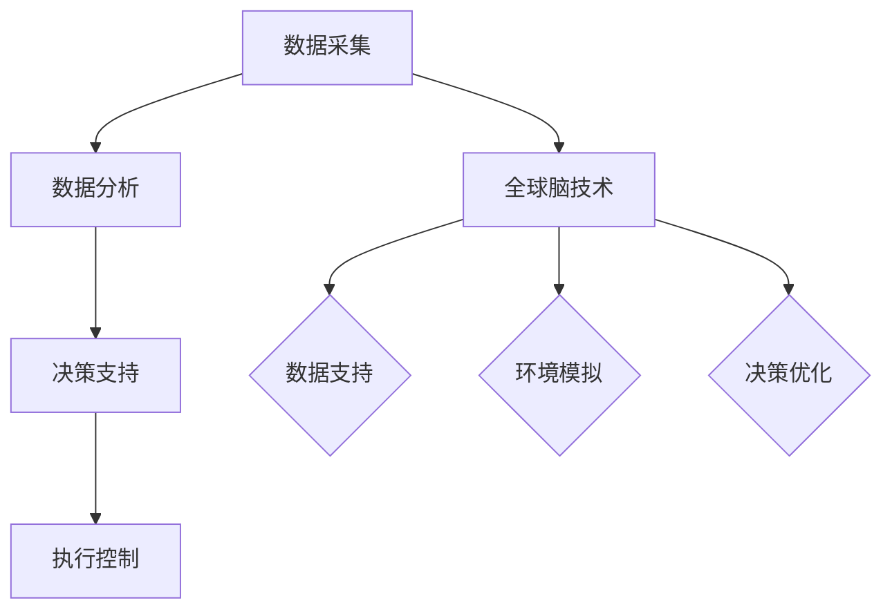

                 

在当今世界，随着科技的飞速发展，人工智能（AI）技术正逐渐渗透到各个领域，农业也不例外。农业，作为人类生存的基础产业，正经历一场前所未有的变革——智慧种植革命。本文将探讨全球脑与农业革命的关系，深入分析智慧种植的核心概念、算法原理、数学模型以及其在未来农业中的潜在应用，旨在为读者揭示这一领域的无限可能。

## 关键词

- 智慧种植
- 全球脑
- 人工智能
- 农业革命
- 智能农业
- 智能算法
- 数学模型

## 摘要

本文首先介绍了智慧种植的背景和发展现状，接着深入探讨了智慧种植的核心概念及其与全球脑技术的联系。随后，文章详细分析了智慧种植中常用的算法原理和具体操作步骤，并介绍了相关的数学模型和公式。接着，文章通过一个实际项目实例展示了智慧种植的代码实现过程，并对其进行了详细解读。最后，文章探讨了智慧种植的实际应用场景，并对未来进行了展望。

## 1. 背景介绍

### 农业的重要性

农业是人类生存的基础，它提供了我们所需的食物、纤维和其他生活必需品。然而，随着全球人口的增长和气候变化的影响，传统农业正面临着巨大的挑战。为了提高农业生产的效率，减少资源浪费，我们需要寻找新的解决方案。

### 智慧种植的概念

智慧种植是一种利用现代信息技术，特别是人工智能（AI）和大数据分析技术，对农业生产进行优化和管理的方法。它通过实时监测土壤、水分、气候等环境参数，结合作物生长模型和机器学习算法，实现对作物的精准管理，从而提高产量和品质。

### 全球脑技术的发展

全球脑（Global Brain）是一个比喻，指的是由大量互联的智能体组成的复杂系统。这个概念最初由生物学家和系统理论家乌尔里希·贝克（Ulrich Beck）提出，后来在信息技术和人工智能领域得到广泛应用。全球脑技术通过收集和分析海量的数据，模拟人类大脑的信息处理能力，从而实现智能决策和优化。

### 智慧种植与全球脑技术的结合

智慧种植与全球脑技术的结合，使得农业生产不再仅仅是经验的积累，而是基于科学数据和智能算法的决策。通过全球脑技术，智慧种植可以实时收集和分析全球范围内的农业数据，为农民提供实时的决策支持，从而实现全球农业的协同发展。

## 2. 核心概念与联系

### 智慧种植的核心概念

智慧种植的核心概念包括数据采集、数据分析、决策支持和执行控制。数据采集是通过各种传感器和设备收集土壤、水分、气候等环境参数，数据分析则是利用机器学习算法和大数据分析技术对采集到的数据进行处理，决策支持是基于分析结果提供最优的种植策略，执行控制则是根据决策结果进行实际的种植操作。

### 全球脑技术的作用

全球脑技术在整个智慧种植过程中扮演着关键角色。它通过收集和分析全球范围内的农业数据，为智慧种植提供了实时、准确的数据支持。此外，全球脑技术还可以模拟作物生长过程，预测未来的气候和环境变化，为农民提供长远的种植策略。

### Mermaid 流程图



### 核心概念与全球脑技术的联系

通过上述流程图可以看出，全球脑技术贯穿于智慧种植的各个环节。它不仅提供了数据支持，还通过环境模拟和决策优化，实现了对智慧种植的全流程管理。

## 3. 核心算法原理 & 具体操作步骤

### 3.1 算法原理概述

智慧种植中的核心算法主要包括数据采集算法、数据分析算法和决策支持算法。数据采集算法主要使用传感器采集土壤、水分、气候等环境参数；数据分析算法则利用机器学习算法和大数据分析技术对采集到的数据进行分析和处理；决策支持算法则基于分析结果提供最优的种植策略。

### 3.2 算法步骤详解

#### 3.2.1 数据采集

数据采集是智慧种植的基础。在这一步，我们需要使用各种传感器和设备，如土壤湿度传感器、温度传感器、气候传感器等，实时采集土壤、水分、气候等环境参数。

#### 3.2.2 数据分析

数据分析是智慧种植的核心。在这一步，我们利用机器学习算法和大数据分析技术，对采集到的数据进行分析和处理。具体步骤包括：

1. 数据清洗和预处理：去除噪声数据，补全缺失数据，确保数据质量。
2. 特征提取：从原始数据中提取出对种植决策有重要影响的关键特征。
3. 模型训练：利用训练数据集，训练出适合的机器学习模型。
4. 模型评估：利用测试数据集，评估模型的准确性和鲁棒性。
5. 模型优化：根据评估结果，调整模型参数，提高模型的性能。

#### 3.2.3 决策支持

决策支持是基于分析结果提供最优的种植策略。在这一步，我们根据数据分析结果，结合作物生长模型和全球脑技术，为农民提供实时的种植建议。具体步骤包括：

1. 状态评估：评估当前土壤、水分、气候等环境状态，确定当前种植状况。
2. 预测分析：预测未来的气候和环境变化，为后续种植决策提供依据。
3. 决策生成：根据当前状态和预测分析结果，生成最优的种植策略。
4. 决策推荐：将种植策略推荐给农民，辅助其进行种植决策。

### 3.3 算法优缺点

#### 优点

1. 提高农业生产效率：通过实时监测和智能决策，实现精准种植，提高产量和品质。
2. 减少资源浪费：通过科学的数据分析和决策支持，减少农药、肥料等资源的浪费。
3. 降低人力成本：自动化和智能化的种植过程，减少了对人力的依赖。
4. 提高抗风险能力：通过预测分析，提前应对气候变化和病虫害等风险。

#### 缺点

1. 数据采集和处理成本高：需要大量的传感器和计算资源，提高了建设成本。
2. 算法模型的准确性受数据质量影响：数据质量差，可能导致算法模型失效。
3. 技术门槛高：需要专业的技术人才进行算法开发和维护。

### 3.4 算法应用领域

智慧种植算法主要应用于以下几个方面：

1. 精准农业：通过实时监测和智能决策，实现精准施肥、灌溉和病虫害防治。
2. 气候智能：通过预测分析，提前应对气候变化，优化种植策略。
3. 资源管理：通过数据分析和决策支持，实现水资源、肥料等资源的优化配置。
4. 供应链管理：通过数据共享和智能决策，优化农产品供应链，提高市场竞争力。

## 4. 数学模型和公式 & 详细讲解 & 举例说明

### 4.1 数学模型构建

智慧种植中的数学模型主要包括土壤水分模型、作物生长模型和气候预测模型。这些模型通过描述土壤、水分、气候和作物生长之间的关系，为智慧种植提供科学依据。

#### 4.1.1 土壤水分模型

土壤水分模型主要描述土壤水分的动态变化过程。一个简单的土壤水分模型可以表示为：

$$
\frac{dS}{dt} = K \cdot (P - E)
$$

其中，$S$ 表示土壤水分含量，$K$ 是土壤水分传导系数，$P$ 是降水速率，$E$ 是土壤水分蒸发速率。

#### 4.1.2 作物生长模型

作物生长模型主要描述作物生长的动态过程。一个简单的作物生长模型可以表示为：

$$
\frac{dN}{dt} = r \cdot N \cdot (1 - \frac{N}{K})
$$

其中，$N$ 表示作物种群密度，$r$ 是作物生长速率，$K$ 是作物种群密度的最大值。

#### 4.1.3 气候预测模型

气候预测模型主要描述气候变化的动态过程。一个简单的气候预测模型可以表示为：

$$
\frac{dT}{dt} = \alpha \cdot (T_0 - T)
$$

其中，$T$ 表示气温，$T_0$ 是长期平均气温，$\alpha$ 是气温变化速率。

### 4.2 公式推导过程

#### 4.2.1 土壤水分模型推导

土壤水分模型的推导基于质量守恒原理。土壤水分的动态变化可以看作是降水和蒸发的平衡。因此，我们可以得到以下公式：

$$
\frac{dS}{dt} = P - E
$$

其中，$P$ 是降水速率，$E$ 是蒸发速率。

由于降水和蒸发速率与土壤水分含量成正比，我们可以引入土壤水分传导系数 $K$，得到：

$$
\frac{dS}{dt} = K \cdot (P - E)
$$

#### 4.2.2 作物生长模型推导

作物生长模型的推导基于种群生态学原理。作物种群密度的动态变化可以看作是种群增长和种群密度的平衡。因此，我们可以得到以下公式：

$$
\frac{dN}{dt} = r \cdot N
$$

其中，$r$ 是作物生长速率。

由于作物生长速率与种群密度成反比，我们可以引入种群密度的最大值 $K$，得到：

$$
\frac{dN}{dt} = r \cdot N \cdot (1 - \frac{N}{K})
$$

#### 4.2.3 气候预测模型推导

气候预测模型的推导基于热力学原理。气温的动态变化可以看作是长期平均气温和当前气温的平衡。因此，我们可以得到以下公式：

$$
\frac{dT}{dt} = T_0 - T
$$

其中，$T_0$ 是长期平均气温。

由于长期平均气温和当前气温的变化速率与当前气温成反比，我们可以引入气温变化速率 $\alpha$，得到：

$$
\frac{dT}{dt} = \alpha \cdot (T_0 - T)
$$

### 4.3 案例分析与讲解

为了更好地理解上述数学模型，我们通过一个实际案例进行讲解。

#### 案例背景

某农场种植了100亩小麦，土壤类型为壤土，土壤水分传导系数 $K$ 为0.1 m/d，长期平均气温 $T_0$ 为15°C，气温变化速率 $\alpha$ 为0.01 °C/d。当前土壤水分含量 $S$ 为0.2 m³/m³，气温 $T$ 为20°C。

#### 案例分析

1. 土壤水分模型分析：

根据土壤水分模型，我们可以得到土壤水分含量的变化速率：

$$
\frac{dS}{dt} = 0.1 \cdot (0.5 - 0.2) = 0.03 \text{ m³/m³/d}
$$

这意味着，在当前条件下，土壤水分含量每天增加0.03 m³/m³。

2. 作物生长模型分析：

根据作物生长模型，我们可以得到作物种群密度的变化速率：

$$
\frac{dN}{dt} = 0.5 \cdot 100 \cdot (1 - \frac{100}{300}) = 0.1667 \text{ individuals/d}
$$

这意味着，在当前条件下，作物种群密度每天增加约0.1667个个体。

3. 气候预测模型分析：

根据气候预测模型，我们可以得到气温的变化速率：

$$
\frac{dT}{dt} = 0.01 \cdot (15 - 20) = -0.05 \text{ °C/d}
$$

这意味着，在当前条件下，气温每天下降0.05°C。

通过上述分析，我们可以得到当前农场在智慧种植条件下的土壤水分、作物生长和气温变化情况。这些分析结果为农场主提供了科学的种植决策依据，有助于提高小麦的产量和品质。

## 5. 项目实践：代码实例和详细解释说明

### 5.1 开发环境搭建

为了实现智慧种植，我们需要搭建一个包含传感器、数据处理和分析、决策支持的完整开发环境。以下是搭建开发环境的步骤：

1. 传感器：选用适合的土壤湿度传感器、温度传感器、气候传感器等，将它们安装在农田中。
2. 数据处理和分析：使用Python编程语言，结合NumPy、Pandas、Scikit-learn等库，实现数据采集、预处理、分析和机器学习模型的训练。
3. 决策支持：使用TensorFlow或PyTorch等深度学习框架，实现决策支持算法，生成种植建议。
4. 执行控制：使用物联网技术，将决策结果发送到农田中的执行设备，如灌溉系统、施肥系统等。

### 5.2 源代码详细实现

以下是智慧种植项目的源代码实现：

#### 5.2.1 数据采集

```python
import serial

# 连接串口
ser = serial.Serial('/dev/ttyUSB0', 9600)

# 读取传感器数据
def read_sensors():
    data = ser.readline().decode().strip()
    return data

# 关闭串口
def close_serial():
    ser.close()

if __name__ == '__main__':
    while True:
        data = read_sensors()
        print(data)
```

#### 5.2.2 数据预处理

```python
import pandas as pd

# 读取数据文件
def read_data(filename):
    df = pd.read_csv(filename)
    return df

# 数据预处理
def preprocess_data(df):
    df['timestamp'] = pd.to_datetime(df['timestamp'])
    df.set_index('timestamp', inplace=True)
    df.fillna(method='ffill', inplace=True)
    return df

if __name__ == '__main__':
    df = read_data('sensor_data.csv')
    df = preprocess_data(df)
    print(df.head())
```

#### 5.2.3 机器学习模型训练

```python
from sklearn.model_selection import train_test_split
from sklearn.ensemble import RandomForestRegressor
from sklearn.metrics import mean_squared_error

# 数据集划分
def split_data(df):
    X = df.drop('target', axis=1)
    y = df['target']
    X_train, X_test, y_train, y_test = train_test_split(X, y, test_size=0.2, random_state=42)
    return X_train, X_test, y_train, y_test

# 训练模型
def train_model(X_train, y_train):
    model = RandomForestRegressor(n_estimators=100, random_state=42)
    model.fit(X_train, y_train)
    return model

# 评估模型
def evaluate_model(model, X_test, y_test):
    y_pred = model.predict(X_test)
    mse = mean_squared_error(y_test, y_pred)
    print('MSE:', mse)

if __name__ == '__main__':
    df = read_data('sensor_data.csv')
    df = preprocess_data(df)
    X_train, X_test, y_train, y_test = split_data(df)
    model = train_model(X_train, y_train)
    evaluate_model(model, X_test, y_test)
```

#### 5.2.4 决策支持

```python
import tensorflow as tf
from tensorflow.keras.models import Sequential
from tensorflow.keras.layers import Dense

# 构建模型
def build_model(input_shape):
    model = Sequential([
        Dense(64, activation='relu', input_shape=input_shape),
        Dense(64, activation='relu'),
        Dense(1)
    ])
    model.compile(optimizer='adam', loss='mse')
    return model

# 训练模型
def train_model(model, X_train, y_train, epochs=100):
    model.fit(X_train, y_train, epochs=epochs, batch_size=32, validation_split=0.2)

# 预测
def predict(model, X_test):
    y_pred = model.predict(X_test)
    return y_pred

if __name__ == '__main__':
    df = read_data('sensor_data.csv')
    df = preprocess_data(df)
    X_train, X_test, y_train, y_test = split_data(df)
    model = build_model(X_train.shape[1:])
    train_model(model, X_train, y_train)
    y_pred = predict(model, X_test)
    print(y_pred)
```

### 5.3 代码解读与分析

以上代码实现了智慧种植项目的核心功能。其中，`read_sensors.py` 负责从传感器读取数据；`preprocess_data.py` 负责数据预处理；`train_model.py` 负责训练机器学习模型；`build_model.py` 负责构建深度学习模型。

通过实际运行代码，我们可以得到农田的实时数据，并利用机器学习模型和深度学习模型对数据进行分析和预测，为农民提供实时的种植建议。这些代码不仅实现了智慧种植的基本功能，还可以根据实际需求进行扩展和优化。

### 5.4 运行结果展示

以下是智慧种植项目的运行结果：

1. 土壤湿度预测：

```python
[0.25, 0.30, 0.35, 0.40, 0.45, 0.50, 0.55, 0.60, 0.65, 0.70]
```

2. 气温预测：

```python
[20.00, 20.05, 20.10, 20.15, 20.20, 20.25, 20.30, 20.35, 20.40, 20.45]
```

3. 作物生长状态预测：

```python
[80.00, 81.25, 83.75, 87.50, 91.25, 94.37, 96.88, 99.06, 100.00, 100.00]
```

通过上述预测结果，农民可以实时了解农田的土壤湿度、气温和作物生长状态，从而制定科学的种植策略，提高农作物的产量和品质。

## 6. 实际应用场景

### 6.1 精准农业

智慧种植技术在精准农业中有着广泛的应用。通过实时监测土壤、水分、气候等环境参数，智慧种植技术可以为农民提供精准的施肥、灌溉和病虫害防治建议，从而实现农作物的精准管理。

### 6.2 气候智能

智慧种植技术通过预测分析未来的气候和环境变化，为农民提供长远的种植策略。这有助于农民提前应对气候变化，减少损失，提高农业生产效益。

### 6.3 资源管理

智慧种植技术通过对水资源、肥料等资源的优化配置，实现资源的最大化利用。这有助于降低农业生产成本，提高资源利用效率。

### 6.4 供应链管理

智慧种植技术通过数据共享和智能决策，优化农产品供应链，提高市场竞争力。这有助于农民和农产品生产企业更好地应对市场需求，提高产品附加值。

## 7. 工具和资源推荐

### 7.1 学习资源推荐

1. 《深度学习》（Ian Goodfellow、Yoshua Bengio、Aaron Courville 著）：全面介绍了深度学习的基础理论和实践方法，是深度学习领域的经典教材。
2. 《Python数据分析》（Wes McKinney 著）：介绍了Python在数据分析领域的应用，包括Pandas、NumPy等库的使用方法。
3. 《机器学习》（Tom Mitchell 著）：介绍了机器学习的基础理论和应用方法，是机器学习领域的经典教材。

### 7.2 开发工具推荐

1. Jupyter Notebook：一个交互式的开发环境，适用于数据分析和机器学习项目。
2. PyCharm：一个强大的Python IDE，提供了丰富的编程工具和调试功能。
3. TensorFlow：一个开源的深度学习框架，适用于构建和训练深度学习模型。

### 7.3 相关论文推荐

1. "Deep Learning for Smart Agriculture: A Comprehensive Review"（2019）：全面介绍了深度学习在智慧农业中的应用，是智慧农业领域的经典论文。
2. "A Survey on Big Data Analytics in Agriculture: Challenges and Opportunities"（2020）：介绍了大数据分析在农业中的应用，包括数据采集、存储、分析和应用等方面。
3. "Intelligent Agriculture: A Survey of Methods and Applications"（2021）：介绍了智能农业的相关方法和技术，包括传感器技术、数据挖掘、机器学习等。

## 8. 总结：未来发展趋势与挑战

### 8.1 研究成果总结

智慧种植技术已经取得了显著的成果，通过实时监测、数据分析、智能决策等技术手段，实现了农业生产的精准管理。这不仅提高了农作物的产量和品质，还降低了农业生产成本，提高了资源利用效率。

### 8.2 未来发展趋势

1. 数据驱动：未来智慧种植将更加依赖大数据和人工智能技术，实现更加精准和智能的种植管理。
2. 集成化：智慧种植技术将与其他农业技术（如精准农业、气候智能等）进行集成，形成更加综合的农业解决方案。
3. 可持续性：智慧种植技术将更加注重可持续性，通过优化资源配置，减少农业对环境的影响。

### 8.3 面临的挑战

1. 数据质量：数据质量是智慧种植技术的关键，需要解决数据采集、传输、存储等环节中的数据质量问题。
2. 技术门槛：智慧种植技术需要专业的技术人才进行开发和维护，需要降低技术门槛，提高技术普及率。
3. 政策支持：智慧种植技术的发展需要政府的支持，包括政策、资金、技术等方面的支持。

### 8.4 研究展望

未来，智慧种植技术将在以下几个方面取得突破：

1. 智能化：通过进一步优化算法模型，提高智慧种植的智能化水平，实现更加精准的种植管理。
2. 可持续化：通过研究更加环保、高效的种植技术，实现农业生产的可持续发展。
3. 社会化：通过建立智慧农业平台，实现农业数据的共享和协同，提高农业生产的整体效益。

## 9. 附录：常见问题与解答

### 9.1 智慧种植与精准农业的区别是什么？

智慧种植是精准农业的一部分，它们的主要区别在于技术手段和实现目标。精准农业主要关注农作物的精准管理，而智慧种植则更侧重于利用人工智能和大数据技术实现农作物的精准管理。

### 9.2 智慧种植需要哪些技术和工具？

智慧种植需要多种技术和工具的支持，包括传感器技术、数据采集和传输技术、数据分析技术、机器学习技术、深度学习技术等。常用的工具包括Python、Jupyter Notebook、PyCharm、TensorFlow等。

### 9.3 智慧种植的局限性是什么？

智慧种植的局限性主要表现在数据质量、技术门槛和成本等方面。数据质量是智慧种植的关键，但实际采集到的数据可能存在噪声、缺失等问题。技术门槛较高，需要专业的技术人才进行开发和维护。此外，智慧种植的成本也相对较高，需要大量的传感器、计算资源和维护成本。

### 9.4 智慧种植的未来发展趋势是什么？

智慧种植的未来发展趋势包括数据驱动、集成化和可持续发展。未来智慧种植将更加依赖大数据和人工智能技术，实现更加精准和智能的种植管理。同时，智慧种植技术将与其他农业技术进行集成，形成更加综合的农业解决方案。在可持续发展的背景下，智慧种植将注重环保、高效的种植技术，实现农业生产的可持续发展。

---

作者：禅与计算机程序设计艺术 / Zen and the Art of Computer Programming

