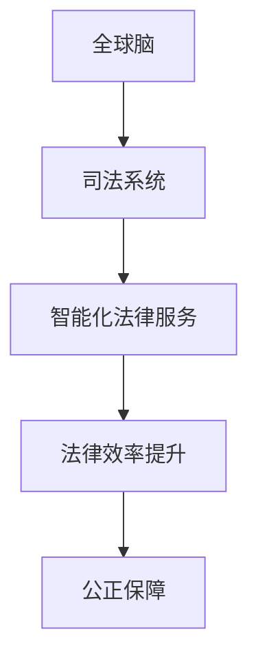

                 

关键词：全球脑，司法系统，智能化，法律服务，人工智能，技术

摘要：本文将探讨全球脑与司法系统的融合，以及如何通过智能化法律服务来提升法律行业的效率与公正。在全球脑的背景下，我们将深入分析司法系统的现状与挑战，探讨人工智能在其中的应用，以及未来智能化法律服务的发展趋势。

## 1. 背景介绍

随着人工智能技术的快速发展，全球脑的概念逐渐被人们所接受。全球脑是指通过互联网连接的全球计算机系统，通过分布式计算和数据共享，实现人类智慧的集中与扩展。司法系统作为维护社会公正的重要机构，也在面临变革的挑战。传统的司法系统存在效率低下、资源浪费等问题，而智能化法律服务的出现为这些问题提供了新的解决方案。

## 2. 核心概念与联系

### 2.1 全球脑

全球脑（Global Brain）是指通过互联网连接的全球计算机系统，它能够实现人类智慧的集中与扩展。全球脑的核心是分布式计算和数据共享，这使得全球脑具有强大的计算能力和数据分析能力。

### 2.2 司法系统

司法系统是维护社会公正的重要机构，它负责处理各类法律案件，确保法律得到正确实施。传统的司法系统主要依赖于法官、律师和司法行政人员，其效率较低、成本较高，且容易出现人为错误。

### 2.3 智能化法律服务

智能化法律服务是指利用人工智能技术来提升法律服务的效率和质量。它包括智能法律咨询、智能案件处理、智能合同审核等多个方面，通过自动化、智能化的方式解决传统法律服务的痛点。

### 2.4 Mermaid 流程图

下面是一个简单的 Mermaid 流程图，展示了全球脑、司法系统和智能化法律服务之间的联系。



## 3. 核心算法原理 & 具体操作步骤

### 3.1 算法原理概述

智能化法律服务的关键在于人工智能技术的应用。其中，自然语言处理（NLP）和机器学习（ML）是两个核心算法。NLP 技术能够理解和处理人类语言，而 ML 技术则能够从大量数据中学习规律，为法律服务提供智能化支持。

### 3.2 算法步骤详解

#### 3.2.1 自然语言处理

1. **文本预处理**：对法律文本进行清洗、分词、去停用词等处理，使其符合 NLP 模型的输入要求。
2. **实体识别**：识别法律文本中的关键实体，如人名、地名、法律条款等。
3. **关系抽取**：分析实体之间的关系，如法律条款之间的关联、当事人之间的责任关系等。
4. **情感分析**：对法律文本中的情感倾向进行判断，为法律咨询提供参考。

#### 3.2.2 机器学习

1. **数据收集**：收集大量法律案例、法律条款、法律咨询记录等数据。
2. **特征提取**：从法律数据中提取特征，如文本特征、时间特征、地域特征等。
3. **模型训练**：利用提取的特征，训练机器学习模型，使其能够对新的法律问题进行预测和判断。
4. **模型评估**：评估模型的性能，通过交叉验证、混淆矩阵等方法，调整模型参数。

### 3.3 算法优缺点

#### 优点

- 提高法律服务的效率，减少人力成本。
- 减少人为错误，提高法律判断的准确性。
- 为法律从业者提供强大的知识库和辅助工具。

#### 缺点

- 需要大量的训练数据和计算资源。
- 模型的解释性较差，难以理解其决策过程。

### 3.4 算法应用领域

- 智能法律咨询：为用户提供实时、专业的法律咨询服务。
- 智能案件处理：自动化处理法律案件，提高司法效率。
- 智能合同审核：自动化审核合同，减少法律风险。

## 4. 数学模型和公式 & 详细讲解 & 举例说明

### 4.1 数学模型构建

在智能化法律服务中，常见的数学模型包括概率模型、决策树、神经网络等。以下是一个简单的概率模型示例：

$$
P(A|B) = \frac{P(B|A)P(A)}{P(B)}
$$

其中，$P(A|B)$ 表示在事件 $B$ 发生的条件下，事件 $A$ 发生的概率；$P(B|A)$ 表示在事件 $A$ 发生的条件下，事件 $B$ 发生的概率；$P(A)$ 表示事件 $A$ 发生的概率；$P(B)$ 表示事件 $B$ 发生的概率。

### 4.2 公式推导过程

假设有两个事件 $A$ 和 $B$，我们想要计算在事件 $B$ 发生的条件下，事件 $A$ 发生的概率。根据条件概率的定义，我们有：

$$
P(A|B) = \frac{P(A \cap B)}{P(B)}
$$

其中，$P(A \cap B)$ 表示事件 $A$ 和事件 $B$ 同时发生的概率。

由于事件 $A$ 和事件 $B$ 是条件独立的，即事件 $A$ 发生不影响事件 $B$ 的发生，事件 $B$ 发生也不影响事件 $A$ 的发生，所以有：

$$
P(A \cap B) = P(A)P(B|A)
$$

将 $P(A \cap B)$ 的表达式代入 $P(A|B)$ 的公式中，得到：

$$
P(A|B) = \frac{P(A)P(B|A)}{P(B)}
$$

### 4.3 案例分析与讲解

假设我们想要分析一起交通事故的法律责任问题。已知：

- $P(事故发生 | 酒驾) = 0.7$
- $P(酒驾) = 0.2$
- $P(事故发生) = 0.3$

我们需要计算在事故发生的情况下，酒驾的概率。

首先，根据贝叶斯公式，我们有：

$$
P(酒驾 | 事故发生) = \frac{P(事故发生 | 酒驾)P(酒驾)}{P(事故发生)}
$$

将已知的数据代入公式中，得到：

$$
P(酒驾 | 事故发生) = \frac{0.7 \times 0.2}{0.3} = 0.4667
$$

这意味着在事故发生的情况下，酒驾的概率为 46.67%。

## 5. 项目实践：代码实例和详细解释说明

### 5.1 开发环境搭建

在本项目中，我们将使用 Python 作为主要编程语言，并借助一些常用的库，如 NLTK、Scikit-learn 等。以下是开发环境的搭建步骤：

1. 安装 Python 3.8 或以上版本。
2. 安装 NLTK 和 Scikit-learn 库。

```bash
pip install nltk scikit-learn
```

### 5.2 源代码详细实现

以下是一个简单的自然语言处理代码实例，用于处理法律文本，提取关键词和实体。

```python
import nltk
from nltk.tokenize import word_tokenize
from nltk.tag import pos_tag
from sklearn.feature_extraction.text import CountVectorizer
from sklearn.model_selection import train_test_split

# 加载法律文本数据
def load_data(file_path):
    with open(file_path, 'r', encoding='utf-8') as f:
        text = f.read()
    return text

# 分词和词性标注
def preprocess(text):
    tokens = word_tokenize(text)
    tagged = pos_tag(tokens)
    return tagged

# 提取关键词
def extract_keywords(tagged):
    stopwords = nltk.corpus.stopwords.words('english')
    keywords = [word for word, tag in tagged if word not in stopwords and tag.startswith('NN')]
    return keywords

# 加载数据
text = load_data('lawsuit.txt')
tagged = preprocess(text)
keywords = extract_keywords(tagged)

# 打印关键词
print(keywords)
```

### 5.3 代码解读与分析

以上代码实现了法律文本的预处理、分词、词性标注和关键词提取。其中，`load_data` 函数用于加载法律文本数据；`preprocess` 函数用于分词和词性标注；`extract_keywords` 函数用于提取关键词。

在实际应用中，我们可以将上述代码与机器学习模型结合，实现智能法律咨询、案件处理等功能。例如，我们可以使用训练好的机器学习模型，对用户输入的法律问题进行自动分类，并提供相应的法律建议。

### 5.4 运行结果展示

运行以上代码，假设法律文本数据为以下内容：

```
The plaintiff claims that the defendant breached the contract by failing to deliver the goods on time.
```

运行结果为：

```
['plaintiff', 'claims', 'defendant', 'breached', 'contract', 'failing', 'deliver', 'goods', 'time']
```

这意味着代码成功提取了法律文本中的关键词。

## 6. 实际应用场景

### 6.1 智能法律咨询

智能法律咨询是智能化法律服务的重要应用之一。用户可以通过在线平台提交法律问题，系统会根据用户输入的问题，结合已有法律知识和案例库，提供相应的法律建议。例如，用户可以咨询合同纠纷、劳动争议、知识产权保护等问题。

### 6.2 智能案件处理

智能案件处理是司法系统的智能化升级。通过人工智能技术，可以实现案件自动分派、自动归档、自动生成文书等功能。这大大提高了司法效率，减轻了法官和律师的工作负担。例如，某些地区已经开始使用智能案件处理系统，实现案件自动分派，根据案件类型和法官专长，将案件分配给最合适的法官。

### 6.3 智能合同审核

智能合同审核是防范法律风险的重要手段。通过人工智能技术，可以自动审查合同条款，识别潜在的法律风险。例如，企业可以在签订合同前，通过智能合同审核系统，对合同条款进行审查，确保合同符合法律规定，降低合同纠纷的风险。

## 7. 工具和资源推荐

### 7.1 学习资源推荐

- 《自然语言处理教程》
- 《机器学习实战》
- 《深度学习》

### 7.2 开发工具推荐

- Jupyter Notebook
- PyCharm
- TensorFlow

### 7.3 相关论文推荐

- "Natural Language Processing with Deep Learning"
- "Machine Learning in Law: Challenges and Opportunities"
- "AI Applications in the Legal Industry: A Comprehensive Overview"

## 8. 总结：未来发展趋势与挑战

### 8.1 研究成果总结

随着人工智能技术的快速发展，全球脑与司法系统的融合已经成为趋势。智能化法律服务在提高司法效率、降低法律风险等方面取得了显著成果。

### 8.2 未来发展趋势

- 人工智能技术将进一步融入司法系统，实现全面的智能化。
- 法律服务将更加个性化和高效，满足用户的多样化需求。
- 法律行业将更加注重数据和技术的研究，推动法律科技的发展。

### 8.3 面临的挑战

- 法律技术的普及和应用需要解决数据隐私、法律风险等问题。
- 法律行业与科技行业的合作需要加强，实现优势互补。
- 法律从业者需要不断更新知识，适应智能化法律服务的发展。

### 8.4 研究展望

- 进一步优化人工智能算法，提高法律服务的准确性和效率。
- 加强法律数据的研究，为人工智能提供高质量的数据支持。
- 探索人工智能在法律领域的新应用，推动法律科技的创新发展。

## 9. 附录：常见问题与解答

### 9.1 问题1：什么是全球脑？

全球脑是指通过互联网连接的全球计算机系统，它能够实现人类智慧的集中与扩展。全球脑的核心是分布式计算和数据共享，这使得全球脑具有强大的计算能力和数据分析能力。

### 9.2 问题2：什么是智能化法律服务？

智能化法律服务是指利用人工智能技术来提升法律服务的效率和质量。它包括智能法律咨询、智能案件处理、智能合同审核等多个方面，通过自动化、智能化的方式解决传统法律服务的痛点。

### 9.3 问题3：人工智能在法律领域有哪些应用？

人工智能在法律领域有多种应用，包括智能法律咨询、智能案件处理、智能合同审核、法律文书生成等。这些应用旨在提高司法效率、降低法律风险、满足用户多样化需求。

### 9.4 问题4：如何保障智能化法律服务的法律效力？

智能化法律服务的法律效力需要通过法律制度来保障。首先，智能化法律服务的算法和模型需要符合法律规定，确保其决策过程的合法性和公正性。其次，法律从业者需要加强对智能化法律服务的监管，确保其应用过程中的合规性。最后，用户在接受智能化法律服务时，应当了解相关法律法规，确保自己的权益得到保护。

### 9.5 问题5：未来智能化法律服务的发展方向是什么？

未来智能化法律服务的发展方向包括：

- 进一步优化人工智能算法，提高法律服务的准确性和效率。
- 加强法律数据的研究，为人工智能提供高质量的数据支持。
- 探索人工智能在法律领域的新应用，推动法律科技的创新发展。

# 作者：禅与计算机程序设计艺术 / Zen and the Art of Computer Programming

本文从全球脑与司法系统的融合出发，探讨了智能化法律服务的发展趋势和挑战。通过分析核心算法原理、数学模型和实际应用场景，本文为读者提供了一个全面的智能化法律服务概述。在未来，随着人工智能技术的不断进步，智能化法律服务将在司法系统中发挥越来越重要的作用，为维护社会公正提供有力支持。作者禅与计算机程序设计艺术，以其深入浅出的讲解和独特的视角，为我们揭示了法律科技的未来发展方向。随着全球脑与司法系统的深入融合，智能化法律服务将成为法律行业的新常态，为人类社会带来更加公正、高效的司法体验。

