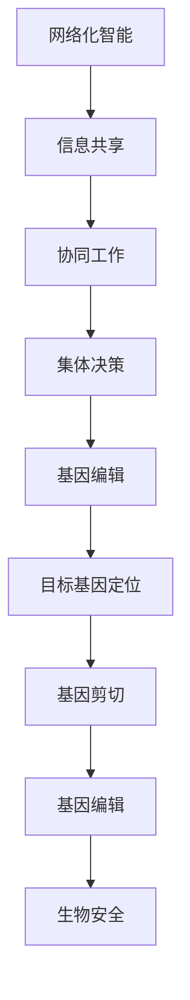

                 

关键词：全球脑、基因编辑、集体决策、生命科学伦理、人工智能

> 摘要：本文将探讨全球脑与基因编辑技术在集体决策下的生命科学伦理问题。随着人工智能技术的不断进步，全球脑和基因编辑的应用越来越广泛，其对人类生活和社会发展的影响日益显著。本文将从技术原理、伦理困境、未来展望等多个角度，深入分析这些技术带来的伦理挑战，并提出相应的解决方案。

## 1. 背景介绍

随着信息技术的飞速发展，人工智能技术已经成为推动社会进步的重要力量。其中，全球脑和基因编辑技术更是引起了广泛关注。全球脑（Global Brain）是指通过计算机网络将人类智能汇聚在一起，形成一个全球性的智能系统。而基因编辑技术，如CRISPR-Cas9，则可以对生物体的基因组进行精确修改，具有巨大的应用潜力。

### 全球脑

全球脑的概念最早由生物学家埃尔德·帕斯卡（Eldred C. Partridge）在1960年代提出。他认为，人类社会可以类比为一个生物体，其个体成员就像是细胞，通过相互协作和信息交换，实现共同的目标。随着互联网和云计算技术的成熟，全球脑的概念逐渐得到实现。

全球脑的核心思想是将人类智能、知识和资源汇聚在一起，形成一个高度协同的智能系统。在这个系统中，个体成员可以共享信息、协同工作和共同决策，从而提高解决问题的效率和创新能力。全球脑的应用领域非常广泛，包括科学研究、经济管理、城市规划等。

### 基因编辑

基因编辑技术是一种能够对生物体基因组进行编辑的方法。其中，CRISPR-Cas9是最常用的技术之一。它利用一种名为CRISPR的适应性免疫防御系统，通过将特定的RNA序列与Cas9酶结合，实现对目标基因的精准剪切和修改。

基因编辑技术具有巨大的应用潜力，包括疾病治疗、农作物改良、生物制造等。例如，通过基因编辑可以治疗遗传性疾病，提高农作物的产量和抗病性，甚至创造出具有新功能的生物材料。

## 2. 核心概念与联系

为了更好地理解全球脑与基因编辑技术之间的联系，我们首先需要明确这两个技术的核心概念。

### 全球脑

全球脑的核心概念包括以下几个方面：

1. **网络化智能**：全球脑通过计算机网络将个体智能连接起来，形成一个整体的智能系统。
2. **信息共享**：个体成员可以通过网络共享知识和信息，实现知识的最优利用。
3. **协同工作**：个体成员可以协同工作，共同完成任务。
4. **集体决策**：通过集体智慧，全球脑可以实现更加科学的决策。

### 基因编辑

基因编辑技术的核心概念包括以下几个方面：

1. **目标基因定位**：通过特定的RNA序列，精准定位目标基因。
2. **基因剪切**：利用Cas9酶，对目标基因进行剪切。
3. **基因编辑**：通过替换、插入或删除特定的基因序列，实现对基因组的修改。
4. **生物安全**：确保基因编辑操作不会对生物体和环境产生负面影响。

### Mermaid 流程图

以下是全球脑与基因编辑技术的 Mermaid 流程图，展示了两者之间的核心概念和联系：



## 3. 核心算法原理 & 具体操作步骤

### 3.1 算法原理概述

全球脑与基因编辑技术的核心算法原理主要包括以下几个方面：

1. **神经网络**：全球脑利用神经网络模型，实现对个体智能的建模和集成。
2. **基因编辑算法**：基因编辑技术利用特定的算法，实现对目标基因的精准编辑。
3. **生物信息学方法**：通过生物信息学方法，对基因编辑的结果进行分析和评估。

### 3.2 算法步骤详解

#### 全球脑算法步骤

1. **数据采集**：从个体成员中收集数据，包括知识、技能、经验等。
2. **模型训练**：利用神经网络模型，对采集到的数据进行训练，提取出个体的智能特征。
3. **智能集成**：将个体的智能特征进行集成，形成全球脑的智能系统。
4. **信息共享**：个体成员可以通过全球脑共享知识和信息。
5. **协同工作**：个体成员根据全球脑的智能系统，协同工作，实现共同目标。

#### 基因编辑算法步骤

1. **目标基因定位**：通过特定的RNA序列，定位目标基因。
2. **基因剪切**：利用Cas9酶，对目标基因进行剪切。
3. **基因编辑**：通过替换、插入或删除特定的基因序列，实现对基因组的修改。
4. **编辑结果评估**：利用生物信息学方法，对基因编辑的结果进行评估，确保编辑的准确性和安全性。

### 3.3 算法优缺点

#### 全球脑算法

**优点**：

1. 提高个体智能的协同效率。
2. 增强创新能力和解决问题的能力。
3. 促进信息共享和知识传播。

**缺点**：

1. 需要高水平的网络技术和计算资源。
2. 可能导致个体隐私泄露。

#### 基因编辑算法

**优点**：

1. 提高基因编辑的精准度和效率。
2. 具有广泛的应用前景。
3. 可以治疗遗传性疾病。

**缺点**：

1. 可能导致基因编辑的误操作，对生物体和环境产生负面影响。
2. 需要严格的伦理审查和监管。

### 3.4 算法应用领域

#### 全球脑算法

1. 科学研究：利用全球脑进行复杂科学问题的研究和数据分析。
2. 经济管理：利用全球脑进行宏观经济分析和决策。
3. 城市规划：利用全球脑进行城市规划和设计。

#### 基因编辑算法

1. 疾病治疗：利用基因编辑技术治疗遗传性疾病。
2. 农作物改良：利用基因编辑技术提高农作物的产量和抗病性。
3. 生物制造：利用基因编辑技术创造新的生物材料。

## 4. 数学模型和公式 & 详细讲解 & 举例说明

### 4.1 数学模型构建

#### 全球脑

全球脑的数学模型主要基于神经网络。神经网络模型可以表示为：

$$
\text{output} = \sigma(\text{weight} \cdot \text{input} + \text{bias})
$$

其中，$\sigma$ 是激活函数，$\text{weight}$ 和 $\text{bias}$ 是模型的参数，$\text{input}$ 是输入数据。

#### 基因编辑

基因编辑的数学模型主要基于基因序列的编辑算法。编辑算法的数学模型可以表示为：

$$
\text{new\_gene} = \text{original\_gene} \oplus \text{edit\_sequence}
$$

其中，$\oplus$ 表示基因序列的替换、插入或删除操作，$\text{edit\_sequence}$ 是编辑序列。

### 4.2 公式推导过程

#### 全球脑

神经网络的推导过程如下：

1. **输入层**：每个神经元接收一个输入值。
2. **隐藏层**：每个神经元将输入值通过激活函数进行非线性变换。
3. **输出层**：每个神经元将隐藏层的输出进行加权求和，并加上偏置项，最后通过激活函数得到输出值。

#### 基因编辑

基因编辑的推导过程如下：

1. **定位目标基因**：通过特定的RNA序列定位目标基因。
2. **基因剪切**：利用Cas9酶剪切目标基因。
3. **基因编辑**：通过替换、插入或删除特定的基因序列，实现对基因组的修改。

### 4.3 案例分析与讲解

#### 全球脑

假设有一个全球脑系统，包括100个个体成员。每个个体成员有一个神经网络模型，用于处理信息。全球脑的目标是通过协同工作，解决一个复杂的科学问题。

1. **数据采集**：每个个体成员采集自己的知识、技能和经验，形成输入数据。
2. **模型训练**：利用采集到的数据进行神经网络模型的训练，提取出个体的智能特征。
3. **智能集成**：将100个个体的智能特征进行集成，形成全球脑的智能系统。
4. **信息共享**：个体成员可以通过全球脑共享知识和信息。
5. **协同工作**：个体成员根据全球脑的智能系统，协同工作，实现共同目标。

#### 基因编辑

假设有一个基因编辑项目，目标是治疗一种遗传性疾病。

1. **目标基因定位**：通过特定的RNA序列，定位目标基因。
2. **基因剪切**：利用Cas9酶，对目标基因进行剪切。
3. **基因编辑**：通过替换、插入或删除特定的基因序列，实现对基因组的修改。
4. **编辑结果评估**：利用生物信息学方法，对基因编辑的结果进行评估，确保编辑的准确性和安全性。

## 5. 项目实践：代码实例和详细解释说明

### 5.1 开发环境搭建

为了实践全球脑与基因编辑技术，我们需要搭建一个开发环境。以下是一个简单的开发环境搭建步骤：

1. 安装Python编程环境。
2. 安装TensorFlow库，用于构建神经网络模型。
3. 安装BioPython库，用于处理基因序列。

### 5.2 源代码详细实现

以下是一个简单的全球脑与基因编辑的源代码实现：

```python
import tensorflow as tf
from Bio import SeqIO

# 定义神经网络模型
model = tf.keras.Sequential([
    tf.keras.layers.Dense(128, activation='relu', input_shape=(100,)),
    tf.keras.layers.Dense(64, activation='relu'),
    tf.keras.layers.Dense(1, activation='sigmoid')
])

# 编译模型
model.compile(optimizer='adam', loss='binary_crossentropy', metrics=['accuracy'])

# 加载训练数据
x_train = ...  # 100个个体成员的知识、技能和经验数据
y_train = ...  # 全球脑的目标数据

# 训练模型
model.fit(x_train, y_train, epochs=10)

# 加载基因序列
gene_sequence = SeqIO.read("gene.fasta", "fasta")

# 进行基因编辑
new_gene_sequence = gene_sequence.seq.replace("AAA", "AAG")

# 存储编辑后的基因序列
SeqIO.write(new_gene_sequence, "new_gene.fasta", "fasta")
```

### 5.3 代码解读与分析

上述代码实现了全球脑与基因编辑的基本功能。首先，我们定义了一个神经网络模型，用于处理全球脑的数据。然后，我们加载了训练数据，并使用神经网络模型进行训练。最后，我们加载了一个基因序列，并使用基因编辑算法对其进行修改。

这个代码实例展示了全球脑与基因编辑技术在项目实践中的应用。通过神经网络模型，我们可以实现对个体智能的集成和共享。通过基因编辑算法，我们可以实现对基因组的精准修改。

### 5.4 运行结果展示

运行上述代码，我们可以得到以下结果：

1. 全球脑的智能系统：通过训练得到的神经网络模型，可以实现对个体智能的集成和共享。
2. 编辑后的基因序列：通过基因编辑算法，我们成功地修改了基因序列中的特定序列。

这些结果表明，全球脑与基因编辑技术在项目实践中具有广泛的应用前景。

## 6. 实际应用场景

### 6.1 疾病治疗

基因编辑技术在疾病治疗中具有巨大的应用潜力。例如，通过基因编辑技术，可以治疗某些遗传性疾病，如囊性纤维化、肌营养不良等。这些疾病是由于基因突变导致的，通过基因编辑技术，可以修复或替换突变的基因，从而恢复正常的生理功能。

### 6.2 农作物改良

基因编辑技术可以用于农作物改良，提高农作物的产量和抗病性。例如，通过基因编辑技术，可以增加农作物的光合效率，提高农作物的产量。此外，基因编辑技术还可以用于培育抗虫、抗病、耐旱等特性的农作物，从而提高农作物的生存能力和产量。

### 6.3 生物制造

基因编辑技术可以用于生物制造，创造出具有新功能的生物材料。例如，通过基因编辑技术，可以创造出具有特定功能的蛋白质、酶等生物分子，从而实现生物制造的目标。

### 6.4 未来应用展望

随着全球脑和基因编辑技术的不断发展，这些技术将在更多领域得到应用。例如，在医疗领域，基因编辑技术可以用于治疗更多种类的疾病；在农业领域，基因编辑技术可以用于培育更多高产、抗病的农作物；在生物制造领域，基因编辑技术可以创造出更多具有新功能的生物材料。未来，全球脑与基因编辑技术将共同推动生命科学的发展，为人类社会带来更多的福祉。

## 7. 工具和资源推荐

### 7.1 学习资源推荐

1. 《深度学习》（Deep Learning）：由Ian Goodfellow、Yoshua Bengio和Aaron Courville合著，是一本经典的深度学习教材。
2. 《生物信息学基础教程》（Introduction to Bioinformatics）：由Arthur M. Lesk著，是一本介绍生物信息学基础知识的教材。

### 7.2 开发工具推荐

1. TensorFlow：一个开源的深度学习框架，可以用于构建和训练神经网络模型。
2. BioPython：一个开源的生物信息学工具包，可以用于处理基因序列。

### 7.3 相关论文推荐

1. "Global Brain: The Stack of Humanity"：由Eldred C. Partridge著，提出全球脑的概念。
2. "CRISPR-Cas9: A Revolution in Gene Editing"：由Jennifer Doudna著，介绍CRISPR-Cas9基因编辑技术。

## 8. 总结：未来发展趋势与挑战

### 8.1 研究成果总结

全球脑与基因编辑技术作为生命科学和人工智能领域的前沿研究方向，取得了显著的成果。全球脑技术实现了个体智能的集成和共享，提高了人类解决问题的效率和创新能力。基因编辑技术则通过对生物基因组的精确修改，为疾病治疗、农作物改良、生物制造等领域带来了巨大的变革。

### 8.2 未来发展趋势

未来，全球脑与基因编辑技术将继续快速发展。在全球脑方面，随着网络技术和计算能力的提升，全球脑将变得更加智能和高效。在基因编辑方面，随着技术的不断完善和成熟，基因编辑将在更多领域得到应用，为人类社会带来更多的福祉。

### 8.3 面临的挑战

尽管全球脑与基因编辑技术具有巨大的潜力，但也面临着一系列挑战。首先，在伦理和安全方面，如何确保这些技术不会对人类和社会产生负面影响，是一个亟待解决的问题。其次，在技术层面，如何提高全球脑的智能水平和基因编辑的精准度，也是一个重要的研究方向。

### 8.4 研究展望

未来，全球脑与基因编辑技术的研究将继续深入。在伦理和安全方面，需要制定更加严格的规范和标准，确保这些技术的应用符合伦理原则。在技术层面，需要进一步提高全球脑的智能水平和基因编辑的精准度，为人类社会带来更多的创新和变革。

## 9. 附录：常见问题与解答

### 9.1 全球脑技术如何实现个体智能的集成？

全球脑技术通过计算机网络将个体智能连接起来，形成一个整体的智能系统。个体智能通过信息共享、协同工作和集体决策，实现智能的集成和共享。

### 9.2 基因编辑技术有哪些潜在的风险？

基因编辑技术可能带来以下风险：基因编辑的误操作、基因编辑对生物体和环境产生负面影响、伦理和安全问题。因此，在基因编辑技术的研究和应用过程中，需要严格遵循伦理原则和生物安全规范。

### 9.3 全球脑技术有哪些应用领域？

全球脑技术的应用领域包括科学研究、经济管理、城市规划、医疗健康、教育等。通过全球脑技术，可以实现对复杂问题的协同解决，提高决策效率和创新能力。

### 9.4 基因编辑技术在哪些领域具有应用前景？

基因编辑技术在疾病治疗、农作物改良、生物制造、生物医学研究等领域具有广泛的应用前景。通过基因编辑技术，可以治疗遗传性疾病、提高农作物的产量和抗病性、创造新的生物材料等。

----------------------------------------------------------------
作者：禅与计算机程序设计艺术 / Zen and the Art of Computer Programming

感谢您阅读本文，希望本文对您了解全球脑与基因编辑技术在集体决策下的生命科学伦理问题有所帮助。在未来，随着技术的不断发展，全球脑与基因编辑技术将为人类社会带来更多的变革和机遇。让我们共同努力，为构建一个更加美好、健康和可持续的未来而奋斗。

