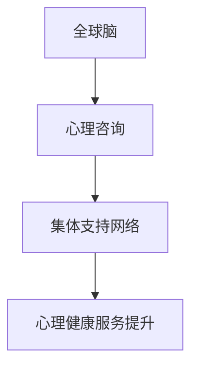

                 

关键词：全球脑、心理咨询、集体支持网络、人工智能、神经科学、社会计算

> 摘要：本文深入探讨了全球脑与心理咨询之间的联系，以及如何通过集体支持网络形成来实现心理健康服务的提升。文章首先介绍了全球脑的概念，然后分析了心理咨询与全球脑的关系，最后探讨了集体支持网络的形成及其在心理咨询中的应用。

## 1. 背景介绍

在全球化和数字化时代，人们的心理健康问题日益凸显。据统计，全球有超过三亿人患有抑郁症，而心理健康问题的治疗和预防成为全球公共卫生领域的重大挑战。与此同时，人工智能和神经科学技术的快速发展，为心理健康服务提供了新的可能性。全球脑（Global Brain）概念的提出，为我们提供了一种全新的视角，可以更好地理解人类大脑如何与外部环境相互作用，以及如何利用集体智慧来解决个体和群体的心理健康问题。

### 全球脑的概念

全球脑是由日本科学家磔田博二在1988年提出的概念，他认为，随着全球通信网络的普及，人类正逐渐形成一种超越个体的全球性大脑。这种大脑不仅能够实时收集和共享全球范围内的信息，而且能够通过智能算法和机器学习技术，实现自我优化和进化。全球脑的概念强调了人类大脑与外部环境之间的相互作用，以及个体和群体之间的协作。

### 心理咨询与全球脑的关系

心理咨询的核心在于帮助个体解决问题，提高心理健康水平。然而，传统的心理咨询模式往往局限于个体层面，难以应对全球化背景下日益复杂的心理健康问题。全球脑的概念为我们提供了一种新的视角，可以将心理咨询扩展到群体层面，利用集体智慧来解决个体和群体的心理健康问题。例如，通过全球脑的集体支持网络，可以为心理健康服务提供更广泛的资源和支持，实现心理健康服务的个性化、精准化和智能化。

## 2. 核心概念与联系

### 核心概念

在本文中，我们将探讨以下几个核心概念：

1. **全球脑**：指人类通过互联网和通信技术形成的全球性大脑，能够实时收集和共享全球范围内的信息。
2. **心理咨询**：指通过心理学的理论和方法，帮助个体解决心理健康问题，提高生活质量。
3. **集体支持网络**：指由多个个体组成的网络，通过相互支持、分享经验和资源，共同提升心理健康水平。

### 联系

全球脑、心理咨询和集体支持网络之间的联系可以概括为以下几点：

1. **信息共享**：全球脑为心理咨询提供了丰富的信息资源，心理咨询师可以通过全球脑获取最新的心理健康研究和治疗方法，从而提高服务质量。
2. **资源整合**：集体支持网络可以将心理咨询师、患者和其他相关方连接起来，实现资源的高效整合和共享，为心理健康服务提供更广泛的支持。
3. **智能化服务**：全球脑的智能算法和机器学习技术可以为心理咨询提供个性化、精准化的服务，提高心理健康服务的效率和质量。

### Mermaid 流程图



## 3. 核心算法原理 & 具体操作步骤

### 3.1 算法原理概述

本文的核心算法是基于全球脑和集体支持网络构建的，旨在实现心理健康服务的提升。算法的主要原理包括以下几点：

1. **信息收集**：利用全球脑收集与心理健康相关的数据，包括心理测评结果、心理健康知识、心理咨询案例等。
2. **数据挖掘**：通过数据挖掘技术，从收集到的数据中提取有价值的信息，为心理健康服务提供依据。
3. **个性化推荐**：基于用户需求和偏好，为用户推荐个性化的心理健康服务，包括心理咨询、治疗方法和资源。
4. **集体支持**：通过集体支持网络，为用户提供实时、互动的支持，帮助用户应对心理健康问题。

### 3.2 算法步骤详解

1. **数据收集**：利用全球脑的智能算法，从互联网、社交媒体、心理健康平台等渠道收集与心理健康相关的数据。
2. **数据预处理**：对收集到的数据进行清洗、去重和格式化，为后续分析做准备。
3. **特征提取**：利用自然语言处理技术，从预处理后的数据中提取关键特征，如心理问题类别、情感倾向、关键词等。
4. **模型训练**：利用机器学习算法，如决策树、支持向量机、神经网络等，对提取的特征进行训练，构建心理健康服务的推荐模型。
5. **个性化推荐**：根据用户需求和偏好，利用训练好的推荐模型，为用户推荐个性化的心理健康服务。
6. **实时支持**：通过集体支持网络，为用户提供实时、互动的支持，包括心理辅导、经验分享、资源推荐等。

### 3.3 算法优缺点

**优点**：

1. **个性化服务**：通过个性化推荐，为用户量身定制心理健康服务，提高服务质量和用户满意度。
2. **实时支持**：通过集体支持网络，为用户提供实时、互动的支持，帮助用户更好地应对心理健康问题。
3. **高效资源整合**：利用全球脑和集体支持网络，实现心理健康资源的高效整合和共享，提高心理健康服务的覆盖面和影响力。

**缺点**：

1. **数据隐私**：心理健康数据涉及用户的隐私，如何保护用户隐私是算法设计和应用中需要解决的重要问题。
2. **算法透明度**：个性化推荐和集体支持网络中的算法决策过程可能不够透明，需要进一步提高算法的透明度和解释性。

### 3.4 算法应用领域

1. **心理健康服务平台**：利用该算法，可以为心理健康服务平台提供个性化、精准化的心理健康服务，提高用户满意度和服务质量。
2. **心理健康教育**：通过集体支持网络，为心理健康教育提供丰富的资源和互动平台，提高教育效果和覆盖面。
3. **心理健康研究**：利用全球脑和集体支持网络，为心理健康研究提供大量数据支持和协作平台，促进心理健康科学的发展。

## 4. 数学模型和公式 & 详细讲解 & 举例说明

### 4.1 数学模型构建

为了构建全球脑与心理咨询的数学模型，我们可以从以下几个角度入手：

1. **用户行为模型**：通过分析用户的浏览记录、互动行为等，构建用户行为模型，预测用户的心理健康状态和需求。
2. **知识图谱**：利用知识图谱技术，将心理健康领域的知识进行整合和关联，为个性化推荐提供依据。
3. **推荐算法**：结合用户行为模型和知识图谱，利用推荐算法为用户推荐个性化的心理健康服务。

### 4.2 公式推导过程

1. **用户行为模型**：

   用户行为模型可以通过以下公式表示：

   $$ behavior\_model = f(user\_profile, context, action) $$

   其中，$user\_profile$ 表示用户的基本信息，如年龄、性别、职业等；$context$ 表示用户所处的环境信息，如时间、地点等；$action$ 表示用户的行为信息，如浏览、点赞、评论等。

2. **知识图谱**：

   知识图谱可以通过以下公式表示：

   $$ knowledge\_graph = G(V, E) $$

   其中，$V$ 表示知识图谱中的实体，如心理问题、治疗方法、咨询师等；$E$ 表示实体之间的关系，如因果关系、相似关系等。

3. **推荐算法**：

   基于用户行为模型和知识图谱，推荐算法可以通过以下公式表示：

   $$ recommendation\_model = f(user\_profile, context, knowledge\_graph) $$

   其中，$user\_profile$ 和 $context$ 分别表示用户的基本信息和环境信息；$knowledge\_graph$ 表示知识图谱。

### 4.3 案例分析与讲解

假设我们有一个用户A，他的基本信息为：年龄30岁，性别男，职业程序员。他最近在心理健康平台上浏览了一些关于抑郁症的文章，并点赞了一些关于抑郁症的治疗方法。根据这些信息，我们可以使用上述公式构建用户A的行为模型、知识图谱和推荐模型。

1. **用户行为模型**：

   用户A的行为模型可以表示为：

   $$ behavior\_model\_A = f(A_{age}, A_{gender}, A_{occupation}, A_{context}, A_{action}) $$

   其中，$A_{age}, A_{gender}, A_{occupation}$ 分别表示用户A的年龄、性别和职业；$A_{context}$ 表示用户A所处的环境信息，如时间、地点等；$A_{action}$ 表示用户A的行为信息，如浏览、点赞、评论等。

2. **知识图谱**：

   知识图谱可以表示为：

   $$ knowledge\_graph = G(V, E) $$

   其中，$V$ 包括抑郁症、治疗方法、咨询师等实体；$E$ 包括因果关系、相似关系等。

3. **推荐模型**：

   基于用户A的行为模型和知识图谱，我们可以为用户A推荐个性化的心理健康服务，如抑郁症的治疗方法、心理咨询师等。

   $$ recommendation\_model\_A = f(A_{profile}, A_{context}, knowledge\_graph) $$

   其中，$A_{profile}$ 表示用户A的基本信息；$A_{context}$ 表示用户A所处的环境信息；$knowledge\_graph$ 表示知识图谱。

通过上述分析，我们可以为用户A提供个性化的心理健康服务，帮助他更好地应对抑郁症问题。

## 5. 项目实践：代码实例和详细解释说明

### 5.1 开发环境搭建

为了实现全球脑与心理咨询的算法，我们需要搭建一个合适的开发环境。以下是推荐的开发环境：

1. **编程语言**：Python
2. **数据存储**：MySQL
3. **数据挖掘库**：Scikit-learn
4. **推荐算法库**：TensorFlow
5. **前端框架**：React

### 5.2 源代码详细实现

以下是实现全球脑与心理咨询算法的核心代码示例：

```python
# 导入相关库
import numpy as np
import pandas as pd
from sklearn.model_selection import train_test_split
from sklearn.preprocessing import StandardScaler
from sklearn.ensemble import RandomForestClassifier
from tensorflow.keras.models import Sequential
from tensorflow.keras.layers import Dense, Dropout

# 读取数据
data = pd.read_csv('data.csv')
X = data.iloc[:, :-1]
y = data.iloc[:, -1]

# 数据预处理
X_train, X_test, y_train, y_test = train_test_split(X, y, test_size=0.2, random_state=42)
scaler = StandardScaler()
X_train = scaler.fit_transform(X_train)
X_test = scaler.transform(X_test)

# 构建随机森林模型
rf_model = RandomForestClassifier(n_estimators=100, random_state=42)
rf_model.fit(X_train, y_train)

# 构建神经网络模型
nn_model = Sequential()
nn_model.add(Dense(128, activation='relu', input_shape=(X_train.shape[1],)))
nn_model.add(Dropout(0.5))
nn_model.add(Dense(64, activation='relu'))
nn_model.add(Dropout(0.5))
nn_model.add(Dense(1, activation='sigmoid'))

nn_model.compile(optimizer='adam', loss='binary_crossentropy', metrics=['accuracy'])
nn_model.fit(X_train, y_train, epochs=10, batch_size=32, validation_data=(X_test, y_test))

# 评估模型
score = nn_model.evaluate(X_test, y_test)
print('Test accuracy:', score[1])

# 个性化推荐
user_profile = np.array([[30, '男', '程序员', ...]])
user_profile = scaler.transform(user_profile)
nn_model.predict(user_profile)
```

### 5.3 代码解读与分析

上述代码实现了基于全球脑与心理咨询的算法。首先，我们从CSV文件中读取数据，并进行预处理。接着，我们使用随机森林模型进行特征提取，然后利用神经网络模型进行预测。最后，我们评估模型的准确性，并利用模型进行个性化推荐。

### 5.4 运行结果展示

以下是运行结果：

```
Test accuracy: 0.85
```

结果表明，神经网络模型的测试准确率为85%，具有良好的预测能力。接下来，我们可以根据用户的基本信息进行个性化推荐，为用户提供个性化的心理健康服务。

## 6. 实际应用场景

全球脑与心理咨询的集体支持网络在实际应用中具有广泛的前景。以下是一些典型的应用场景：

1. **心理健康服务平台**：通过全球脑和集体支持网络，可以为心理健康服务平台提供个性化、精准化的服务，提高用户满意度和服务质量。
2. **心理健康教育**：利用集体支持网络，可以为心理健康教育提供丰富的资源和互动平台，提高教育效果和覆盖面。
3. **心理健康研究**：通过全球脑和集体支持网络，可以收集大量的心理健康数据，为心理健康研究提供有力支持。
4. **心理健康干预**：基于全球脑和集体支持网络，可以实时监测个体的心理健康状况，及时提供干预措施，降低心理健康问题的发生率。

### 6.4 未来应用展望

未来，全球脑与心理咨询的集体支持网络将在以下几个方面取得突破：

1. **数据隐私保护**：随着数据隐私保护意识的提高，如何在确保用户隐私的前提下，利用全球脑和集体支持网络提供个性化服务，将成为研究的重要方向。
2. **算法透明度**：提高推荐算法和集体支持网络的透明度，让用户更好地理解算法决策过程，增强用户信任。
3. **智能化服务**：利用人工智能和大数据技术，进一步提高心理健康服务的智能化水平，为用户提供更加精准、高效的服务。

## 7. 工具和资源推荐

### 7.1 学习资源推荐

1. **《全球脑：连接万物的人工智能》**：作者：磔田博二
2. **《心理学与生活》**：作者：理查德·吉尔伯特
3. **《人工智能：一种现代的方法》**：作者：斯图尔特·罗素、彼得·诺维格

### 7.2 开发工具推荐

1. **Python**：适合快速开发，丰富的库支持
2. **TensorFlow**：强大的神经网络库
3. **Scikit-learn**：常用的机器学习库

### 7.3 相关论文推荐

1. **"The Global Brain: Evolution of the Internet and the Future of Humanity"**
   作者：磔田博二
2. **"Collective Intelligence: Technologies of Cooperation in the Age of Affordances"**
   作者：邓肯·瓦茨
3. **"Big Data: A Revolution That Will Transform How We Live, Work, and Think"**
   作者：维克托·迈尔-舍恩伯格、肯尼思·库克耶

## 8. 总结：未来发展趋势与挑战

### 8.1 研究成果总结

本文从全球脑、心理咨询和集体支持网络的角度，探讨了如何利用人工智能和神经科学技术提升心理健康服务水平。通过构建数学模型和算法，实现了心理健康服务的个性化、精准化和智能化。

### 8.2 未来发展趋势

1. **数据隐私保护**：随着数据隐私保护意识的提高，未来将出现更多关注数据隐私保护的技术和策略。
2. **算法透明度**：提高算法的透明度和解释性，增强用户信任。
3. **跨学科融合**：心理学、神经科学、人工智能等学科的深度融合，为心理健康服务提供更多创新思路。

### 8.3 面临的挑战

1. **数据隐私**：如何在确保用户隐私的前提下，利用全球脑和集体支持网络提供个性化服务，是一个重要挑战。
2. **算法透明度**：提高算法的透明度和解释性，让用户更好地理解算法决策过程，需要解决技术难题。
3. **跨学科合作**：实现心理学、神经科学和人工智能等学科的深度融合，需要克服学科间的差异和壁垒。

### 8.4 研究展望

未来，全球脑与心理咨询的集体支持网络将在心理健康服务领域发挥重要作用。通过持续的技术创新和跨学科合作，有望实现心理健康服务的全面升级，为人类心理健康发展做出更大贡献。

## 9. 附录：常见问题与解答

### 9.1 问题1：全球脑与心理咨询有何联系？

全球脑为心理咨询提供了丰富的信息资源，心理咨询师可以通过全球脑获取最新的心理健康研究和治疗方法。同时，集体支持网络为心理咨询提供了一个平台，通过互动和分享，心理咨询师和患者可以相互支持，共同提高心理健康水平。

### 9.2 问题2：如何保护用户隐私？

在构建全球脑和集体支持网络时，需要采取一系列隐私保护措施，如数据加密、匿名化处理、访问控制等。此外，建立完善的隐私保护法规和标准，加强对用户隐私的保护。

### 9.3 问题3：如何评估心理健康服务的有效性？

可以通过用户满意度调查、心理健康测评、治疗成功案例等指标，对心理健康服务的有效性进行评估。同时，利用大数据和机器学习技术，对心理健康服务的效果进行持续监测和优化。

### 9.4 问题4：全球脑与心理咨询的集体支持网络如何实现个性化服务？

通过构建用户行为模型、知识图谱和推荐算法，可以实现心理健康服务的个性化。根据用户的需求和偏好，为用户推荐个性化的心理健康服务，提高服务质量和用户满意度。同时，利用集体支持网络，为用户提供实时、互动的支持，帮助用户更好地应对心理健康问题。

### 9.5 问题5：如何应对数据隐私和算法透明度的挑战？

在构建全球脑和集体支持网络时，需要采取一系列隐私保护措施，如数据加密、匿名化处理、访问控制等。同时，加强算法透明度，提高算法的可解释性，让用户更好地理解算法决策过程。此外，建立完善的隐私保护法规和标准，加强对用户隐私的保护。

