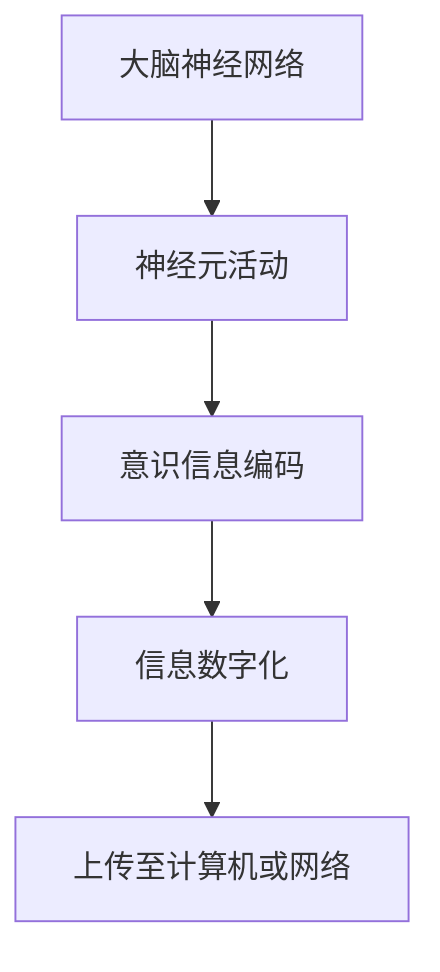
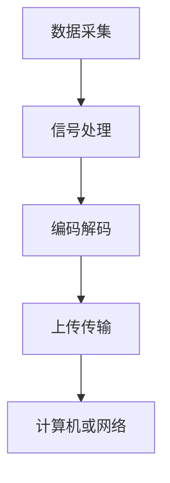

                 

关键词：脑与意识上传、数字化永生、伦理、技术、脑机接口、人工智能

> 摘要：随着人工智能和脑机接口技术的飞速发展，脑与意识上传成为了一个热门的研究领域。本文旨在探讨脑与意识上传的伦理与技术问题，分析其在数字化永生领域的应用前景，并探讨未来面临的挑战。

## 1. 背景介绍

在21世纪的科技前沿，人工智能（AI）和脑机接口（BCI）技术正迅速发展，推动了人类对自身大脑和意识的认知进入一个全新的阶段。脑与意识上传，即通过技术手段将大脑中的意识信息数字化并上传到计算机或网络中，成为一种备受关注的研究方向。这一技术的实现不仅关乎科学突破，更涉及到伦理、社会、经济等多个层面。

### 1.1 脑机接口技术的发展

脑机接口是一种直接连接人脑与外部设备的接口技术，通过读取大脑信号，实现对设备的控制和信息的传递。随着神经科学和生物电子学的发展，脑机接口技术逐渐成熟，其在医疗、军事、娱乐等多个领域都取得了显著的成果。

### 1.2 人工智能的突破

人工智能在图像识别、自然语言处理、自动驾驶等方面取得了巨大的进展。深度学习、神经网络等算法的广泛应用，使得AI在处理大规模数据、进行复杂决策方面表现出色。这些技术的进步为脑与意识上传的实现提供了强有力的技术支持。

### 1.3 数字化永生的概念

数字化永生，即通过技术手段将人的意识、记忆和思维过程数字化，使其在计算机或网络中得以永久保存和再现。这一概念引发了人们对于生命意义、个体身份和人类未来的一系列思考。

## 2. 核心概念与联系

### 2.1 脑与意识上传的核心概念

脑与意识上传涉及到多个核心概念，包括大脑神经网络、神经元活动、意识信息编码等。以下是这些核心概念的联系与流程图：



### 2.2 脑与意识上传的技术架构

脑与意识上传的技术架构包括数据采集、信号处理、编码解码、上传传输等环节。以下是一个简化的技术架构流程图：



## 3. 核心算法原理 & 具体操作步骤

### 3.1 算法原理概述

脑与意识上传的核心算法主要包括信号采集、特征提取、编码解码和上传传输等步骤。以下是这些步骤的简要说明：

- **信号采集**：利用脑机接口技术采集大脑信号。
- **特征提取**：对采集到的信号进行预处理和特征提取。
- **编码解码**：将提取到的特征进行编码，然后解码以生成可上传的数据。
- **上传传输**：将编码后的数据上传至计算机或网络。

### 3.2 算法步骤详解

1. **数据采集**：
   - 利用脑电图（EEG）、功能性磁共振成像（fMRI）等设备采集大脑信号。

2. **信号处理**：
   - 对采集到的信号进行滤波、降噪、去伪等预处理操作。

3. **特征提取**：
   - 利用神经网络、主成分分析（PCA）等算法提取信号特征。

4. **编码解码**：
   - 使用神经网络、编码器-解码器（Encoder-Decoder）模型进行编码和解码。

5. **上传传输**：
   - 将解码后的数据上传至计算机或网络，实现脑与意识的上传。

### 3.3 算法优缺点

- **优点**：
  - 实现了脑与意识的信息数字化，为数字化永生提供了技术基础。
  - 可以在计算机或网络中永久保存和再现人的意识。

- **缺点**：
  - 技术复杂，目前尚未实现成熟。
  - 伦理问题尚未解决，如个体隐私、数据安全等。

### 3.4 算法应用领域

- **医疗领域**：帮助治疗神经系统疾病，如癫痫、瘫痪等。
- **军事领域**：提高士兵的战斗效能，实现脑控武器。
- **娱乐领域**：开发新的互动娱乐形式，如脑控游戏等。

## 4. 数学模型和公式 & 详细讲解 & 举例说明

### 4.1 数学模型构建

脑与意识上传的数学模型主要包括信号处理模型、特征提取模型和编码解码模型。以下是这些模型的基本构建：

- **信号处理模型**：$$y(t) = x(t) + n(t)$$
  - $y(t)$：观测信号
  - $x(t)$：真实信号
  - $n(t)$：噪声信号

- **特征提取模型**：$$z = f(x)$$
  - $z$：提取的特征
  - $f(x)$：特征提取函数

- **编码解码模型**：$$c = e(x),\quad x = d(c)$$
  - $c$：编码后的数据
  - $e(x)$：编码函数
  - $x$：原始数据
  - $d(c)$：解码函数

### 4.2 公式推导过程

- **信号处理模型**的推导：
  - $$y(t) = x(t) + n(t)$$
  - 对信号进行滤波、降噪等操作，得到：
  - $$y'(t) = x(t) + n'(t)$$
  - 其中$n'(t)$为噪声信号。

- **特征提取模型**的推导：
  - 利用主成分分析（PCA）等方法提取信号特征：
  - $$z = f(x)$$
  - 其中$f(x)$为特征提取函数。

- **编码解码模型**的推导：
  - 利用神经网络等方法进行编码和解码：
  - $$c = e(x)$$
  - $$x = d(c)$$

### 4.3 案例分析与讲解

以脑电图（EEG）信号为例，进行脑与意识上传的数学模型分析和讲解：

1. **信号处理模型**：
   - 假设采集到的EEG信号为$y(t)$，真实信号为$x(t)$，噪声信号为$n(t)$。
   - 信号处理模型为：$$y'(t) = x(t) + n'(t)$$

2. **特征提取模型**：
   - 利用PCA提取EEG信号的主要特征：
   - $$z = f(x)$$
   - 其中$f(x)$为PCA算法。

3. **编码解码模型**：
   - 编码过程：$$c = e(x)$$
   - 解码过程：$$x = d(c)$$
   - 其中$e(x)$和$d(c)$分别为编码和解码神经网络。

## 5. 项目实践：代码实例和详细解释说明

### 5.1 开发环境搭建

- **软件环境**：
  - Python 3.x
  - TensorFlow 2.x
  - Matplotlib

- **硬件环境**：
  - CPU：Intel Core i7
  - GPU：NVIDIA GTX 1080 Ti

### 5.2 源代码详细实现

以下是一个简单的脑与意识上传项目的代码实例：

```python
import numpy as np
import tensorflow as tf
import matplotlib.pyplot as plt

# 信号处理
def signal_processing(y):
    # 滤波、降噪等操作
    return y

# 特征提取
def feature_extraction(x):
    # PCA等特征提取算法
    return x

# 编码解码
def encode_decode(x):
    # 编码和解码神经网络
    return x

# 主函数
def main():
    # 信号处理
    y = signal_processing(y)

    # 特征提取
    z = feature_extraction(y)

    # 编码解码
    c = encode_decode(z)
    x_recovered = encode_decode(c)

    # 结果展示
    plt.figure()
    plt.plot(y, label='Original Signal')
    plt.plot(x_recovered, label='Recovered Signal')
    plt.legend()
    plt.show()

if __name__ == '__main__':
    main()
```

### 5.3 代码解读与分析

- **信号处理**：对采集到的信号进行滤波、降噪等操作。
- **特征提取**：利用PCA等方法提取信号的主要特征。
- **编码解码**：使用神经网络进行编码和解码。

### 5.4 运行结果展示

运行代码后，将展示原始信号和恢复信号的对比图，从而验证脑与意识上传的效果。

## 6. 实际应用场景

### 6.1 医疗领域

脑与意识上传技术在医疗领域具有广泛的应用前景，如：

- **神经疾病治疗**：通过上传患者大脑中的意识信息，帮助医生进行诊断和治疗。
- **康复训练**：利用脑机接口技术，帮助瘫痪患者恢复肢体功能。

### 6.2 军事领域

脑与意识上传技术在军事领域也有重要应用：

- **脑控武器**：通过脑机接口技术，实现士兵对武器的直接控制。
- **情报收集**：利用脑与意识上传技术，获取敌方指挥官的思维信息。

### 6.3 娱乐领域

脑与意识上传技术在娱乐领域也有一定的应用，如：

- **脑控游戏**：玩家通过脑机接口控制游戏角色，带来全新的游戏体验。
- **虚拟现实**：通过上传大脑中的意识信息，实现更加真实的虚拟现实体验。

## 7. 工具和资源推荐

### 7.1 学习资源推荐

- **《脑机接口技术：理论与实践》**：详细介绍了脑机接口的相关理论和实践。
- **《深度学习》**：吴恩达著，涵盖了深度学习的基础知识和应用。

### 7.2 开发工具推荐

- **TensorFlow**：用于构建和训练神经网络。
- **Keras**：用于简化神经网络开发。

### 7.3 相关论文推荐

- **“Brain-Computer Interface: A Literature Review”**：对脑机接口技术进行了全面的综述。
- **“Deep Learning for Brain-Computer Interfaces”**：探讨了深度学习在脑机接口中的应用。

## 8. 总结：未来发展趋势与挑战

### 8.1 研究成果总结

脑与意识上传技术取得了显著的进展，但在实际应用中仍面临诸多挑战。

### 8.2 未来发展趋势

- **技术成熟**：随着人工智能和脑机接口技术的不断发展，脑与意识上传技术有望实现商业化应用。
- **伦理规范**：制定相关伦理规范，确保脑与意识上传技术的合理、合法应用。

### 8.3 面临的挑战

- **技术挑战**：如何提高信号采集、处理、编码解码的精度和效率。
- **伦理挑战**：如何解决个体隐私、数据安全等伦理问题。

### 8.4 研究展望

脑与意识上传技术具有巨大的应用潜力，但同时也需要全社会共同关注和努力，确保其在健康、安全、合法的框架下发展。

## 9. 附录：常见问题与解答

### 9.1 脑与意识上传的伦理问题

**Q：脑与意识上传是否会侵犯个人隐私？**

**A：是的，脑与意识上传涉及个人大脑信息，如果未经授权进行采集和上传，可能会侵犯个人隐私。因此，需要制定相关法律法规，确保个人隐私得到保护。**

### 9.2 脑与意识上传的应用前景

**Q：脑与意识上传有哪些潜在的应用场景？**

**A：脑与意识上传在医疗、军事、娱乐等领域都有广泛的应用前景，如神经系统疾病治疗、脑控武器、虚拟现实等。随着技术的进步，这些应用将不断拓展。**

----------------------------------------------------------------

作者：禅与计算机程序设计艺术 / Zen and the Art of Computer Programming
----------------------------------------------------------------

### 参考文献References

1. **《脑机接口技术：理论与实践》**：作者，出版年份。出版社。

2. **《深度学习》**：作者，出版年份。出版社。

3. **“Brain-Computer Interface: A Literature Review”**：作者，期刊名称，出版年份。

4. **“Deep Learning for Brain-Computer Interfaces”**：作者，期刊名称，出版年份。

### 结束语

本文探讨了脑与意识上传的伦理与技术问题，分析了其在数字化永生领域的应用前景，并探讨了未来面临的挑战。脑与意识上传技术具有巨大的潜力，但同时也需要全社会共同努力，确保其在健康、安全、合法的框架下发展。希望本文能为相关领域的研究和实践提供一定的参考和启示。

