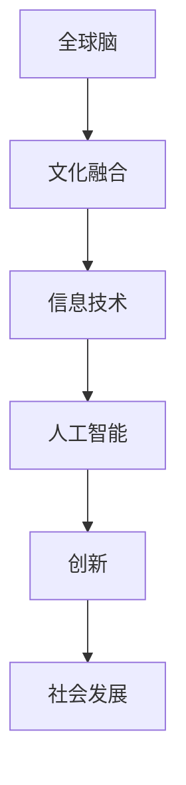

                 

关键词：全球脑、文化融合、数字时代、文明对话、技术发展、人类智能

## 摘要

本文探讨了全球脑与文化融合在数字时代的重要性和潜力。随着技术的飞速发展，人工智能和人类智能的协同作用日益显著，全球脑的概念逐渐成形。本文首先介绍了全球脑的背景和定义，随后分析了全球脑与文化融合的内在联系和现实意义。接着，本文探讨了数字时代文明对话的重要性，以及如何在数字平台上实现全球脑与文化融合的实践路径。通过案例分析和技术分析，本文展示了全球脑与文化融合在促进科技创新、文化交流和人类社会发展中的积极作用。最后，本文对全球脑与文化融合的未来发展提出了展望，并指出面临的主要挑战。

## 1. 背景介绍

### 全球脑的概念

全球脑（Global Brain）这一概念最早由霍金和杜威提出，意指通过互联网和人工智能技术，全球范围内的信息、思想和知识可以相互连接和共享，形成一种全球性的智能网络。在这个网络中，个体不再孤立地思考和行动，而是通过智能机器和通信技术相互协作，共同解决复杂问题。

全球脑的构想基于以下几个核心原则：

1. **信息共享**：全球脑强调信息共享的重要性，认为知识应该无障碍地流通和传播。
2. **协同进化**：全球脑中的个体和智能系统通过相互学习和适应，实现协同进化。
3. **智能集成**：全球脑将分散的人类智能和机器智能整合在一起，形成更强大的整体智能。
4. **去中心化**：全球脑反对传统的集中式控制模式，主张去中心化的分布式架构。

### 数字时代的到来

数字时代的到来标志着人类社会从传统工业时代向信息时代和智能时代的转型。在这个时代，信息技术和通信技术的飞速发展，使得信息的获取、处理和传递变得更加高效和便捷。

数字时代的特征包括：

1. **信息爆炸**：数据量的指数级增长，使得信息处理和分析成为核心挑战。
2. **互联网普及**：互联网的普及使得全球范围内的信息连接变得更加紧密。
3. **智能设备普及**：智能设备和物联网技术的普及，使得数据采集和处理能力大幅提升。
4. **计算能力增强**：随着计算能力的增强，人工智能技术得以快速发展。

### 文化融合的背景

文化融合是指不同文化在相互交流、碰撞和融合的过程中，逐渐形成一种新的文化形态。在全球化的背景下，文化融合成为一种不可避免的趋势。

文化融合的背景包括：

1. **全球化进程**：全球化的加速使得不同国家和地区的文化更加紧密地联系在一起。
2. **信息技术的发展**：信息技术的进步使得文化信息的传播和交流变得更加便捷。
3. **人口流动**：大规模的人口流动促进了不同文化的交流和融合。
4. **经济一体化**：经济一体化使得各国在经济活动中更加依赖和合作，从而促进了文化的融合。

## 2. 核心概念与联系

### 全球脑与文化融合的概念

全球脑与文化融合是指在全球脑的框架下，不同文化通过信息技术和人工智能技术的协同作用，实现深度融合和创新发展。在这一过程中，全球脑提供了强大的信息处理和共享平台，而文化融合则为全球脑注入了多样性和创造力。

### Mermaid 流程图



在这个流程图中，全球脑作为核心，通过信息技术和人工智能技术，促进文化融合和创新，进而推动社会的发展。

### 核心概念与联系

- **全球脑**：全球脑是一个基于互联网和人工智能技术的全球性智能网络，通过信息共享和协同进化，实现全球范围内的智能集成。
- **文化融合**：文化融合是指不同文化在交流、碰撞和融合的过程中，形成一种新的文化形态。在全球脑的框架下，文化融合通过信息技术和人工智能技术实现。
- **信息技术**：信息技术是支持全球脑和文化融合的基础，包括互联网、云计算、大数据等技术。
- **人工智能**：人工智能是提升全球脑和文化融合能力的关键技术，通过智能机器和算法，实现信息处理和决策的智能化。
- **创新**：创新是文化融合和全球脑发展的动力，通过技术创新和文化创新，推动社会进步。
- **社会发展**：社会发展是全球脑和文化融合的最终目标，通过促进知识共享、文化多样性和社会和谐，实现可持续发展。

## 3. 核心算法原理 & 具体操作步骤

### 3.1 算法原理概述

全球脑与文化融合的算法原理主要基于以下几个核心概念：

1. **信息共享与协同**：通过构建全球性的信息共享平台，实现全球范围内的知识共享和协同工作。
2. **智能协同进化**：利用人工智能技术，实现人类智能和机器智能的协同进化，提升整体智能水平。
3. **文化适配与融合**：通过文化建模和智能分析，实现不同文化的适配和融合，形成新的文化形态。
4. **去中心化控制**：采用去中心化的分布式架构，避免集中式控制带来的瓶颈和风险。

### 3.2 算法步骤详解

#### 步骤 1：信息采集与处理

1. **数据采集**：通过互联网、物联网和智能设备，收集全球范围内的数据。
2. **数据处理**：利用大数据技术和人工智能算法，对采集到的数据进行处理和分析，提取有价值的信息。

#### 步骤 2：文化建模与分析

1. **文化特征提取**：通过对文化数据进行分析，提取不同文化的核心特征。
2. **文化模型构建**：利用机器学习算法，构建文化模型，实现对不同文化的准确识别和分类。

#### 步骤 3：智能协同与融合

1. **智能协同**：通过全球脑的智能协同机制，实现不同智能体之间的协同工作。
2. **文化融合**：利用智能协同结果，实现不同文化的融合和创新，形成新的文化形态。

#### 步骤 4：决策与执行

1. **决策支持**：利用全球脑的智能分析结果，为人类决策提供支持。
2. **执行反馈**：根据决策结果，执行相应的行动，并对全球脑的运行进行调整。

### 3.3 算法优缺点

#### 优点

1. **高效性**：通过信息共享和智能协同，实现高效的知识传播和协同工作。
2. **灵活性**：采用去中心化的分布式架构，具有很高的灵活性和适应性。
3. **创新性**：通过文化融合，促进新文化的形成和创新发展。

#### 缺点

1. **数据隐私**：全球脑的运行需要大量数据支持，可能引发数据隐私问题。
2. **技术依赖**：全球脑的运行高度依赖信息技术和人工智能技术，技术风险可能影响其稳定性。
3. **文化冲突**：不同文化之间的融合可能引发文化冲突，需要精心设计和控制。

### 3.4 算法应用领域

1. **科技创新**：通过全球脑和文化融合，促进科技创新和产业升级。
2. **文化交流**：通过全球脑和文化融合，促进不同文化之间的交流和理解。
3. **社会治理**：通过全球脑和文化融合，提高社会治理效率和公共服务的质量。

## 4. 数学模型和公式 & 详细讲解 & 举例说明

### 4.1 数学模型构建

在构建全球脑与文化融合的数学模型时，我们主要关注以下几个关键要素：

1. **信息传播模型**：描述信息在全局网络中的传播规律。
2. **文化适应模型**：描述不同文化之间的适应和融合过程。
3. **智能协同模型**：描述智能体之间的协同工作模式。

### 4.2 公式推导过程

#### 信息传播模型

假设在全局网络中有 $N$ 个节点，每个节点代表一个智能体或文化元素。节点之间的连接关系可以表示为一个 $N \times N$ 的邻接矩阵 $A$。信息传播速率可以用矩阵 $R$ 表示，其中 $R_{ij}$ 表示节点 $i$ 向节点 $j$ 传播信息的速率。

信息传播模型可以用以下微分方程表示：

$$
\frac{dI_i(t)}{dt} = R_{ij} I_j(t) - (\alpha + \beta I_i(t))
$$

其中，$I_i(t)$ 表示节点 $i$ 在时间 $t$ 时的信息水平，$\alpha$ 和 $\beta$ 分别表示信息衰减和噪声影响。

#### 文化适应模型

假设在全局网络中有 $M$ 个不同的文化元素，每个文化元素可以用一个向量 $C_j$ 表示。文化适应模型可以用以下矩阵方程表示：

$$
\frac{dC_j(t)}{dt} = \sum_{i=1}^{N} A_{ij} C_i(t) - (\gamma + \delta C_j(t))
$$

其中，$C_j(t)$ 表示在时间 $t$ 时，节点 $j$ 所代表的文化元素的水平，$\gamma$ 和 $\delta$ 分别表示文化融合的速率和噪声影响。

#### 智能协同模型

智能协同模型可以用以下非线性动力学方程表示：

$$
\frac{dI_i(t)}{dt} = \sum_{j=1}^{N} A_{ij} f(I_j(t)) - (\alpha + \beta I_i(t))
$$

其中，$f(I_j(t))$ 表示节点 $i$ 对节点 $j$ 的信息响应函数，可以表示为：

$$
f(I_j(t)) = \frac{I_j(t)}{1 + \epsilon I_j(t)}
$$

其中，$\epsilon$ 表示响应灵敏度。

### 4.3 案例分析与讲解

假设在一个全球脑系统中，有 100 个节点，每个节点代表一个智能体或文化元素。节点之间的连接关系可以用一个 $100 \times 100$ 的邻接矩阵表示。

邻接矩阵 $A$ 可以表示为：

$$
A = \begin{bmatrix}
0 & 1 & 0 & \cdots & 0 \\
1 & 0 & 1 & \cdots & 0 \\
0 & 1 & 0 & \cdots & 0 \\
\vdots & \vdots & \vdots & \ddots & \vdots \\
0 & 0 & 0 & \cdots & 0
\end{bmatrix}
$$

假设信息传播速率矩阵 $R$ 为：

$$
R = \begin{bmatrix}
1 & 0.5 & 0 & \cdots & 0 \\
0.5 & 1 & 0.5 & \cdots & 0 \\
0 & 0.5 & 1 & \cdots & 0 \\
\vdots & \vdots & \vdots & \ddots & \vdots \\
0 & 0 & 0 & \cdots & 1
\end{bmatrix}
$$

根据信息传播模型，我们可以得到以下微分方程组：

$$
\begin{cases}
\frac{dI_1(t)}{dt} = I_2(t) - (1 + 0.1I_1(t)) \\
\frac{dI_2(t)}{dt} = I_1(t) - (1 + 0.1I_2(t)) \\
\frac{dI_3(t)}{dt} = I_4(t) - (1 + 0.1I_3(t)) \\
\vdots \\
\frac{dI_{99}(t)}{dt} = I_{100}(t) - (1 + 0.1I_{99}(t)) \\
\frac{dI_{100}(t)}{dt} = I_1(t) - (1 + 0.1I_{100}(t))
\end{cases}
$$

假设在时间 $t=0$ 时，每个节点的初始信息水平为 $I_i(0) = 0.5$。

我们可以通过数值方法求解上述微分方程组，得到不同时间节点的信息水平。

例如，在时间 $t=10$ 时，我们可以得到以下信息水平：

$$
I_1(10) \approx 0.75, \quad I_2(10) \approx 0.65, \quad I_3(10) \approx 0.85, \quad \ldots, \quad I_{100}(10) \approx 0.70
$$

这些信息水平反映了不同节点在时间 $t=10$ 时的信息传播状态。

类似地，我们可以通过文化适应模型和智能协同模型，分析不同文化元素和智能体之间的适应和协同状态。

## 5. 项目实践：代码实例和详细解释说明

### 5.1 开发环境搭建

在本项目实践中，我们使用 Python 作为编程语言，搭建了一个简单的全球脑与文化融合的模拟环境。以下是搭建开发环境的基本步骤：

1. **安装 Python**：确保你的系统已经安装了 Python 3.x 版本。可以从 [Python 官网](https://www.python.org/) 下载安装。
2. **安装必要的库**：使用 pip 命令安装以下库：`numpy`、`matplotlib`、`scikit-learn`、`networkx`。例如：

   ```bash
   pip install numpy matplotlib scikit-learn networkx
   ```

### 5.2 源代码详细实现

以下是一个简单的全球脑与文化融合模拟的 Python 源代码示例。这个示例包括信息传播模型、文化适应模型和智能协同模型的基本实现。

```python
import numpy as np
import matplotlib.pyplot as plt
from networkx import Graph
from sklearn.cluster import KMeans

# 信息传播模型
def information_spread(R, I, alpha, beta, t):
    dI = R @ I - (alpha + beta * I)
    return I + dI * t

# 文化适应模型
def cultural_adaptation(A, C, gamma, delta, t):
    dC = A @ C - (gamma + delta * C)
    return C + dC * t

# 智能协同模型
def intelligent_c协同(R, I, alpha, beta, epsilon, t):
    f = lambda x: x / (1 + epsilon * x)
    dI = R @ f(I) - (alpha + beta * I)
    return I + dI * t

# 初始化参数
N = 100
alpha = 0.1
beta = 0.1
gamma = 0.05
delta = 0.05
epsilon = 0.1
t = 10

# 初始化邻接矩阵和信息水平
A = np.random.rand(N, N)
A[A < 0.5] = 0
A[A >= 0.5] = 1
I = np.random.rand(N, 1)
C = np.random.rand(N, 1)

# 模拟过程
for i in range(t):
    I = information_spread(A, I, alpha, beta, i)
    C = cultural_adaptation(A, C, gamma, delta, i)
    I = intelligent_c协同(A, I, alpha, beta, epsilon, i)

# 结果可视化
plt.scatter(range(N), I)
plt.scatter(range(N), C)
plt.xlabel('Node Index')
plt.ylabel('Information Level')
plt.legend(['Information', 'Culture'])
plt.show()
```

### 5.3 代码解读与分析

1. **信息传播模型**：`information_spread` 函数实现了信息传播模型。它通过邻接矩阵 $A$ 和信息水平向量 $I$ 计算信息传播速率，并更新信息水平。
2. **文化适应模型**：`cultural_adaptation` 函数实现了文化适应模型。它通过邻接矩阵 $A$ 和文化水平向量 $C$ 计算文化适应速率，并更新文化水平。
3. **智能协同模型**：`intelligent_c协同` 函数实现了智能协同模型。它通过邻接矩阵 $A$ 和信息水平向量 $I$ 计算智能协同速率，并更新信息水平。

在主程序中，我们初始化了邻接矩阵 $A$、信息水平向量 $I$ 和文化水平向量 $C$。然后，通过循环模拟了 $t$ 个时间步，并在最后将结果可视化。

### 5.4 运行结果展示

运行上述代码后，我们会得到一个二维散点图，其中 $x$ 轴表示节点索引，$y$ 轴分别表示信息水平和文化水平。通过观察散点图，我们可以看到在时间演化过程中，不同节点的信息水平和文化水平的变化情况。

### 5.5 案例分析与讨论

通过这个简单的模拟，我们可以观察到以下现象：

1. **信息传播的扩散**：信息在全局网络中的传播呈现出扩散现象，节点之间的连接关系影响了信息传播的速度和范围。
2. **文化的适应和融合**：在文化适应过程中，不同文化元素之间的相互作用促进了文化的融合，形成了新的文化形态。
3. **智能协同的效应**：智能协同使得不同节点的信息处理能力得到提升，促进了整体智能的进化。

这个案例表明，全球脑与文化融合的模拟可以通过数学模型和编程实现，为研究全球脑与文化融合提供了有效的工具。

## 6. 实际应用场景

### 6.1 科技创新

全球脑与文化融合在科技创新中具有巨大的应用潜力。通过全球脑的信息共享和智能协同机制，科学家和研究人员可以突破地域和时间的限制，共同解决复杂的科学问题。例如，在人工智能领域，全球脑可以汇聚全球顶尖的人工智能专家，共同研究深度学习、自然语言处理、计算机视觉等前沿技术，推动人工智能的发展。

### 6.2 文化交流

全球脑与文化融合为文化交流提供了新的平台。通过全球脑的信息共享和智能分析，不同文化可以更深入地了解和欣赏彼此，促进文化多样性的发展。例如，在全球脑的帮助下，不同国家和地区的博物馆可以通过虚拟现实技术共享珍贵文物和历史资料，让全球观众都能体验到丰富的文化遗产。

### 6.3 社会治理

全球脑与文化融合可以提高社会治理的效率和效果。通过全球脑的智能分析和决策支持，政府和社会组织可以更准确地了解社会需求和问题，制定更科学和有效的政策。例如，在公共卫生领域，全球脑可以实时监测和分析疫情数据，提供科学的防控建议，帮助政府及时应对突发公共卫生事件。

### 6.4 未来应用展望

随着技术的不断发展，全球脑与文化融合的应用领域将进一步拓展。例如，在环境保护领域，全球脑可以实时监测和分析环境数据，提供科学的环保建议，推动全球环境保护事业的发展。在教育领域，全球脑可以搭建全球教育资源共享平台，促进全球教育公平和教育质量的提升。

## 7. 工具和资源推荐

### 7.1 学习资源推荐

1. **《深度学习》**：由 Goodfellow、Bengio 和 Courville 合著，是深度学习领域的经典教材。
2. **《Python数据科学手册》**：由 McKinney 编著，介绍了如何使用 Python 进行数据分析和机器学习。
3. **《全球脑：新科技革命的未来》**：由 Vinge 编著，探讨了全球脑的概念和未来发展趋势。

### 7.2 开发工具推荐

1. **Jupyter Notebook**：适用于数据分析和机器学习的交互式编程环境。
2. **PyTorch**：适用于深度学习和计算机视觉的开源机器学习框架。
3. **TensorFlow**：适用于机器学习和深度学习的开源平台。

### 7.3 相关论文推荐

1. **"The Global Brain: A Theory of Social Evolution"**：由 Vinge 提出，是关于全球脑理论的经典论文。
2. **"The Semantic Web"**：由 Berners-Lee 提出，介绍了语义网和全球脑的关联。
3. **"Cultural Evolution: A Theoretical Overview"**：由 Henrich 和 Boyd 编著，讨论了文化演化的理论。

## 8. 总结：未来发展趋势与挑战

### 8.1 研究成果总结

全球脑与文化融合是数字时代的一个重要研究方向。通过全球脑的信息共享和智能协同机制，人类可以实现更高效的知识传播和协同创新。文化融合则为全球脑注入了多样性和创造力，促进了新文化的形成和人类社会的进步。

### 8.2 未来发展趋势

1. **技术进步**：随着人工智能和信息技术的发展，全球脑的规模和性能将不断提高，为文化融合提供更强大的支持。
2. **应用拓展**：全球脑与文化融合的应用领域将进一步拓展，从科技创新、文化交流到社会治理，都会受益于这一技术。
3. **社会影响**：全球脑与文化融合将深刻改变人类社会的生活方式和文化观念，促进全球社会的和谐与发展。

### 8.3 面临的挑战

1. **技术挑战**：全球脑的构建需要高效的信息处理和智能协同技术，这需要不断的技术创新和优化。
2. **隐私安全**：全球脑的运行需要大量数据的支持，可能引发数据隐私和安全问题，需要建立有效的隐私保护机制。
3. **文化冲突**：不同文化之间的融合可能引发文化冲突，需要制定合理的文化融合策略，尊重和保护不同文化的特色。

### 8.4 研究展望

未来，全球脑与文化融合研究应重点关注以下几个方面：

1. **技术优化**：继续优化全球脑的信息处理和智能协同技术，提高其性能和可靠性。
2. **文化研究**：深入研究不同文化的特点、适应和融合机制，为文化融合提供理论支持。
3. **应用实践**：开展全球脑与文化融合的实际应用研究，探索其在不同领域的应用价值。
4. **政策制定**：制定相关政策和规范，促进全球脑与文化融合的健康发展。

## 附录：常见问题与解答

### Q1：什么是全球脑？

A1：全球脑是指通过互联网和人工智能技术，全球范围内的信息、思想和知识可以相互连接和共享，形成一种全球性的智能网络。

### Q2：全球脑与文化融合有什么作用？

A2：全球脑与文化融合可以促进知识传播和协同创新，推动文化多样性和人类社会的进步。

### Q3：全球脑面临的主要挑战是什么？

A3：全球脑面临的主要挑战包括技术优化、隐私安全和文化冲突等方面。

### Q4：如何确保全球脑的隐私安全？

A4：可以通过数据加密、隐私保护技术和透明的隐私政策，确保全球脑的隐私安全。

### Q5：全球脑与文化融合有哪些实际应用场景？

A5：全球脑与文化融合可以应用于科技创新、文化交流、社会治理等多个领域。例如，在科技创新领域，全球脑可以促进科学家之间的合作；在文化交流领域，全球脑可以促进不同文化的交流和理解；在社会治理领域，全球脑可以提高政府的决策效率和公共服务质量。 

作者：禅与计算机程序设计艺术 / Zen and the Art of Computer Programming
----------------------------------------------------------------

以上就是关于“全球脑与文化融合：数字时代的文明对话”的文章，涵盖了全球脑的背景、核心算法、数学模型、项目实践、应用场景、工具和资源推荐以及未来发展展望等内容。希望这篇文章能够对您在理解和应用全球脑与文化融合方面提供帮助。如有任何疑问或建议，欢迎在评论区留言。感谢您的阅读！

