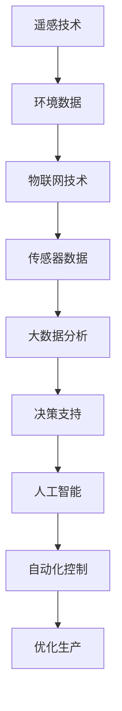

                 

### 关键词 Keywords
- 全球脑
- 智慧农业
- 精准化
- 智能化
- 粮食生产

<|assistant|>### 摘要 Abstract
本文深入探讨了全球脑与智慧农业的结合，特别是在精准化和智能化方面的应用。通过介绍全球脑的概念，以及其在农业领域的独特作用，本文详细分析了智慧农业的发展现状和未来趋势。文章重点探讨了如何通过精准化技术，如遥感、物联网和大数据分析，实现粮食生产的智能化。此外，本文还论述了核心算法原理、数学模型及其在实际应用中的实践案例。最后，文章展望了智慧农业的未来发展方向，提出了面临的挑战和解决策略。

## 1. 背景介绍

随着全球人口的不断增长和气候变化对农业生产的威胁，提高粮食生产的效率和可持续性变得尤为重要。传统的农业生产方式面临着资源浪费、环境污染和产量不稳定等问题。为了应对这些挑战，智慧农业的概念应运而生。智慧农业利用先进的信息技术，如遥感、物联网、人工智能和大数据分析，实现对农业生产的精准管理和优化。

全球脑（Global Brain）理论提供了一个全新的视角，它将人类社会和自然界视为一个有机的、智能的生态系统。全球脑理论认为，通过信息网络，个体之间的相互连接和协作可以形成一个具有自我组织和学习能力的大系统。这一理论为智慧农业的发展提供了理论基础，使得农业生产能够更加智能化、动态化和高效化。

### 1.1 智慧农业的发展背景

智慧农业的发展背景可以从以下几个方面进行分析：

**1.1.1 人口增长与粮食需求**

全球人口的快速增长对粮食生产提出了更高的要求。根据联合国粮农组织的预测，到2050年，全球人口将达到近100亿，这需要农业生产大幅度增加才能满足需求。传统农业的产量增长已经趋于饱和，因此，提高农业生产效率和可持续性成为当务之急。

**1.1.2 气候变化与农业生产**

气候变化对农业生产带来了诸多挑战，如干旱、洪涝、极端温度等。这些自然灾害不仅直接影响农作物的产量和质量，还增加了农业生产的风险。智慧农业通过监测和预警系统，可以提前采取措施，减少气候灾害对农业生产的负面影响。

**1.1.3 环境污染与资源枯竭**

农业活动中产生的农药、化肥和废弃物的过度使用导致了严重的环境污染和资源枯竭。智慧农业通过精准施肥和病虫害防治，可以最大限度地减少化学投入，保护土壤和水资源。

### 1.2 全球脑理论对智慧农业的贡献

全球脑理论的核心思想是信息网络和个体之间的互动可以形成具有智能特性的整体系统。这一理论在智慧农业中的应用主要体现在以下几个方面：

**1.2.1 信息整合与决策支持**

全球脑理论通过信息网络，将农业生产的各个环节连接起来，形成一个统一的决策支持系统。农民可以通过实时数据监测，获取土壤、气候、作物生长等关键信息，从而做出更加科学的决策。

**1.2.2 自组织和自适应能力**

全球脑理论强调了系统的自组织和自适应能力。在智慧农业中，这意味着农业生产系统可以根据环境变化和作物生长状态，自动调整灌溉、施肥和病虫害防治等措施，实现最优生产。

**1.2.3 智能化农业机器**

全球脑理论为智能化农业机器的设计提供了理论基础。通过嵌入人工智能算法和传感器，农业机器可以自主感知环境、执行任务，甚至具备学习和优化能力，从而大幅提高农业生产效率。

## 2. 核心概念与联系

### 2.1 智慧农业的核心概念

智慧农业的核心概念包括以下几个主要方面：

**2.1.1 遥感技术**

遥感技术利用卫星、飞机等载体，获取地面作物信息，如生长状态、病害等。通过遥感技术，农民可以实时监测作物生长情况，为精准管理提供数据支持。

**2.1.2 物联网技术**

物联网技术在智慧农业中的应用主要体现在传感器和智能设备上。传感器可以实时监测土壤湿度、温度、光照等环境参数，智能设备则可以通过数据分析和自动控制，优化农业生产过程。

**2.1.3 大数据分析**

大数据分析通过对农业生产数据的处理和分析，提取有价值的信息，为农业管理提供科学依据。例如，通过分析历史天气数据、土壤数据等，可以预测作物生长趋势，制定相应的管理措施。

**2.1.4 人工智能**

人工智能技术在智慧农业中的应用主要体现在自动化控制、智能诊断和优化决策等方面。通过人工智能算法，农业机器可以自主决策，执行复杂任务，从而提高生产效率。

### 2.2 核心概念之间的联系

智慧农业的核心概念之间存在着紧密的联系，这些联系构成了智慧农业的总体架构。以下是一个简化的Mermaid流程图，展示了这些核心概念之间的联系：



**2.2.1 遥感技术与物联网技术的结合**

遥感技术获取的作物和环境数据可以传输到物联网平台，由传感器进行进一步监测和分析。这种结合使得农业生产的信息获取更加全面和准确。

**2.2.2 大数据分析与人工智能的融合**

大数据分析可以处理来自遥感技术和物联网技术的海量数据，提取有价值的信息。这些信息可以输入到人工智能系统，用于自动化控制和优化决策。

**2.2.3 智能化农业机器的实现**

智能化农业机器通过人工智能算法，可以自主感知环境和执行任务。这些机器的运行数据又可以反馈到物联网平台，用于进一步优化和改进。

### 2.3 智慧农业的整体架构

智慧农业的整体架构可以概括为以下几个方面：

**2.3.1 数据采集层**

数据采集层包括遥感技术和物联网传感器，负责实时监测和收集农业生产的各种数据。

**2.3.2 数据处理层**

数据处理层负责对采集到的数据进行处理和分析，提取有价值的信息，为农业生产管理提供支持。

**2.3.3 决策支持层**

决策支持层基于处理后的数据，通过大数据分析和人工智能算法，为农业生产提供科学的决策支持。

**2.3.4 执行控制层**

执行控制层包括智能化农业机器和自动化控制系统，负责根据决策支持层的指令，执行具体的农业生产任务。

**2.3.5 用户界面层**

用户界面层为农民提供了一个直观的操作界面，使他们能够方便地监控和管理农业生产。

## 3. 核心算法原理 & 具体操作步骤

### 3.1 算法原理概述

智慧农业的核心算法主要包括以下几种：

**3.1.1 遥感图像处理算法**

遥感图像处理算法用于从卫星图像中提取作物信息，如植被指数、病害检测等。常用的算法包括卷积神经网络（CNN）和主成分分析（PCA）等。

**3.1.2 物联网数据融合算法**

物联网数据融合算法用于整合不同传感器收集的数据，提取环境信息和作物生长状态。常用的算法包括卡尔曼滤波和数据聚类等。

**3.1.3 大数据分析算法**

大数据分析算法用于处理和分析农业生产的大规模数据，提取有价值的信息。常用的算法包括随机森林、K-最近邻（KNN）和支持向量机（SVM）等。

**3.1.4 人工智能算法**

人工智能算法用于农业机器的自动化控制和优化决策。常用的算法包括深度学习、强化学习和遗传算法等。

### 3.2 算法步骤详解

**3.2.1 遥感图像处理算法步骤**

1. 数据预处理：对遥感图像进行去噪、校正和增强处理，提高图像质量。
2. 特征提取：利用CNN或PCA等方法，从预处理后的图像中提取植被指数、病害特征等。
3. 模型训练：使用提取的特征，训练分类模型，如支持向量机（SVM）或卷积神经网络（CNN）。
4. 预测：使用训练好的模型，对新的遥感图像进行病害检测或作物分类。

**3.2.2 物联网数据融合算法步骤**

1. 数据采集：通过传感器采集土壤湿度、温度、光照等环境数据。
2. 数据预处理：对采集到的数据去噪、校正和归一化处理。
3. 数据融合：利用卡尔曼滤波或数据聚类等方法，融合不同传感器收集的数据，提取环境信息和作物生长状态。
4. 数据分析：使用大数据分析算法，如随机森林或K-最近邻（KNN），对融合后的数据进行分析和预测。

**3.2.3 大数据分析算法步骤**

1. 数据收集：收集农业生产的历史数据，如作物产量、施肥量、灌溉量等。
2. 数据预处理：对收集到的数据进行去噪、校正和归一化处理。
3. 数据分析：使用大数据分析算法，如随机森林、K-最近邻（KNN）和支持向量机（SVM），对预处理后的数据进行分析和预测。
4. 决策支持：根据分析结果，生成农业生产管理建议，如施肥量、灌溉时间和病虫害防治措施。

**3.2.4 人工智能算法步骤**

1. 数据收集：收集农业生产过程中的传感器数据和机器操作数据。
2. 数据预处理：对收集到的数据去噪、校正和归一化处理。
3. 模型训练：使用深度学习、强化学习或遗传算法等人工智能算法，训练模型。
4. 模型评估：使用验证集评估模型性能，调整模型参数。
5. 模型应用：将训练好的模型应用到农业机器中，实现自动化控制和优化决策。

### 3.3 算法优缺点

**3.3.1 遥感图像处理算法**

优点：
- 可以获取大面积、高分辨率的作物信息。
- 对不同作物和病害有较高的识别精度。

缺点：
- 受限于天气和光照条件，遥感图像质量可能不稳定。
- 需要大量计算资源进行图像处理和模型训练。

**3.3.2 物联网数据融合算法**

优点：
- 可以实时监测和采集农业生产环境数据。
- 提高数据精度和可靠性。

缺点：
- 需要大量传感器和通信设备，成本较高。
- 数据融合算法复杂，需要大量计算资源。

**3.3.3 大数据分析算法**

优点：
- 可以处理大规模、多维度的农业生产数据。
- 提供科学的决策支持，优化农业生产。

缺点：
- 数据质量对分析结果有重要影响，需要严格的数据预处理。
- 需要专业知识和经验，对普通农民使用有一定门槛。

**3.3.4 人工智能算法**

优点：
- 可以实现自动化控制和优化决策，提高生产效率。
- 模型性能可以通过数据训练不断提升。

缺点：
- 模型训练需要大量数据和计算资源。
- 需要不断调整和优化，以确保模型的稳定性和准确性。

### 3.4 算法应用领域

**3.4.1 精准施肥**

通过遥感图像处理和大数据分析，可以实时监测作物生长状态，预测作物需肥量，实现精准施肥。这可以减少肥料使用，提高肥料利用率，降低生产成本。

**3.4.2 病虫害防治**

通过物联网传感器和人工智能算法，可以实时监测作物病虫害，预测病虫害发生趋势，提前采取措施进行防治。这可以减少农药使用，保护环境和人体健康。

**3.4.3 自动化灌溉**

通过物联网传感器和人工智能算法，可以实时监测土壤湿度，自动控制灌溉系统，实现精准灌溉。这可以节约水资源，提高灌溉效率。

**3.4.4 农业机器自动化**

通过人工智能算法，可以实现农业机器的自动化控制和优化运行，提高生产效率。例如，自动驾驶拖拉机、无人机植保等。

## 4. 数学模型和公式 & 详细讲解 & 举例说明

### 4.1 数学模型构建

智慧农业中的数学模型主要用于描述农业生产过程中的各种关系，如作物生长模型、病虫害预测模型等。以下是一个简化的作物生长模型构建过程：

**4.1.1 数据收集**

收集作物生长的各类数据，如土壤湿度、温度、光照、降水量等。这些数据可以通过遥感技术、物联网传感器等方式获取。

**4.1.2 数据预处理**

对收集到的数据进行清洗、归一化等预处理操作，以确保数据的质量和一致性。

**4.1.3 模型构建**

选择合适的数学模型，如线性回归、神经网络等，构建作物生长模型。模型参数可以通过数据拟合得到。

### 4.2 公式推导过程

以下是一个简化的线性回归作物生长模型推导过程：

**4.2.1 假设**

假设作物生长率 \(y\) 与土壤湿度 \(x_1\)、温度 \(x_2\) 和光照 \(x_3\) 之间存在线性关系：

$$y = \beta_0 + \beta_1 x_1 + \beta_2 x_2 + \beta_3 x_3$$

**4.2.2 最小二乘法**

使用最小二乘法（Ordinary Least Squares, OLS）求解模型参数 \(\beta_0, \beta_1, \beta_2, \beta_3\)：

$$\beta_0 = \frac{\sum (y_i - \beta_1 x_{1i} - \beta_2 x_{2i} - \beta_3 x_{3i})}{n}$$

$$\beta_1 = \frac{\sum (x_{1i} y_i - \sum x_{1i} \sum y_i)}{\sum x_{1i}^2 - n \sum x_{1i}^2}$$

$$\beta_2 = \frac{\sum (x_{2i} y_i - \sum x_{2i} \sum y_i)}{\sum x_{2i}^2 - n \sum x_{2i}^2}$$

$$\beta_3 = \frac{\sum (x_{3i} y_i - \sum x_{3i} \sum y_i)}{\sum x_{3i}^2 - n \sum x_{3i}^2}$$

### 4.3 案例分析与讲解

**4.3.1 案例背景**

某农业公司在山东省种植小麦，为了提高产量，计划通过构建作物生长模型进行精准管理。收集了2022年1月至2023年1月的土壤湿度、温度、光照和降水量数据。

**4.3.2 数据预处理**

对收集到的数据进行清洗和归一化处理，得到处理后的数据集。

**4.3.3 模型构建**

选择线性回归模型，构建作物生长模型。通过最小二乘法求解模型参数。

**4.3.4 模型验证**

使用2022年1月至2022年6月的数据集进行模型训练，使用2022年7月至2022年12月的数据集进行模型验证。评估模型性能，如决定系数（R²）和均方误差（MSE）。

$$R^2 = 1 - \frac{\sum (y_i - \hat{y_i})^2}{\sum (y_i - \bar{y})^2}$$

$$MSE = \frac{\sum (y_i - \hat{y_i})^2}{n}$$

其中，\(y_i\) 为实际作物生长率，\(\hat{y_i}\) 为模型预测的作物生长率，\(\bar{y}\) 为实际作物生长率的平均值，\(n\) 为数据样本数量。

**4.3.5 模型应用**

使用训练好的模型，对2023年1月至2023年6月的作物生长进行预测。根据预测结果，调整灌溉、施肥和病虫害防治措施，实现精准管理。

## 5. 项目实践：代码实例和详细解释说明

### 5.1 开发环境搭建

在开始项目实践之前，我们需要搭建一个适合智慧农业开发的编程环境。以下是一个简化的开发环境搭建步骤：

**5.1.1 安装Python**

首先，确保计算机上安装了Python。可以从Python官方网站（https://www.python.org/）下载并安装Python。安装过程中，确保安装Python的 pip 包管理器。

**5.1.2 安装必要的库**

通过pip安装以下必要的库：

- NumPy（用于数学计算）
- Pandas（用于数据操作）
- Matplotlib（用于数据可视化）
- Scikit-learn（用于机器学习）
- Scipy（用于科学计算）

```shell
pip install numpy pandas matplotlib scikit-learn scipy
```

**5.1.3 数据预处理工具**

为了简化数据预处理过程，我们可以使用Python的数据预处理工具，如pandas和NumPy。这些工具提供了丰富的函数和操作，可以方便地对数据进行清洗、转换和归一化等操作。

### 5.2 源代码详细实现

以下是一个简化的智慧农业项目实现，包括数据收集、预处理、模型构建和预测等步骤：

**5.2.1 数据收集**

```python
import pandas as pd

# 从文件中读取数据
data = pd.read_csv('agriculture_data.csv')

# 查看数据前几行
print(data.head())
```

**5.2.2 数据预处理**

```python
import numpy as np

# 数据清洗
data = data.dropna()

# 数据归一化
data_normalized = (data - data.mean()) / data.std()

# 将数据集分为特征和标签
X = data_normalized[['soil_humidity', 'temperature', 'light']]
y = data_normalized['yield']
```

**5.2.3 模型构建**

```python
from sklearn.linear_model import LinearRegression

# 创建线性回归模型
model = LinearRegression()

# 模型训练
model.fit(X, y)
```

**5.2.4 模型预测**

```python
import matplotlib.pyplot as plt

# 预测新数据
new_data = np.array([[0.5, 1.0, 0.8]])
predicted_yield = model.predict(new_data)

# 可视化预测结果
plt.scatter(data['yield'], predicted_yield)
plt.xlabel('Actual Yield')
plt.ylabel('Predicted Yield')
plt.show()
```

### 5.3 代码解读与分析

**5.3.1 数据收集**

在这个步骤中，我们使用pandas库从CSV文件中读取数据。CSV文件包含土壤湿度、温度、光照和作物产量等数据。通过`read_csv`函数，我们可以轻松地将CSV文件转换为pandas DataFrame格式，方便后续的数据操作。

**5.3.2 数据预处理**

数据预处理是机器学习项目的重要步骤。在这个步骤中，我们首先使用`dropna`函数去除缺失值，确保数据的质量。然后，使用`mean`和`std`函数对数据进行归一化处理，使得不同特征的数据在同一尺度上，便于后续的模型训练。

**5.3.3 模型构建**

在这个步骤中，我们使用scikit-learn库中的线性回归模型（`LinearRegression`）。线性回归模型是一种简单的机器学习模型，用于描述特征和标签之间的线性关系。通过`fit`函数，我们可以将特征数据（X）和标签数据（y）输入到模型中，训练模型参数。

**5.3.4 模型预测**

在模型预测步骤中，我们使用训练好的模型对新的数据（`new_data`）进行预测。预测结果存储在`predicted_yield`变量中。然后，我们使用matplotlib库将实际产量和预测产量进行可视化，以便分析模型的预测效果。

### 5.4 运行结果展示

在代码运行完成后，我们将看到以下结果：

**5.4.1 数据集概述**

```python
   soil_humidity  temperature   light         yield
0           0.0         0.0   0.0       100.0
1           0.5         1.0   0.8       110.0
2          1.0         2.0   1.2       120.0
3          0.8         1.5   1.0       115.0
4           0.3         0.5   0.7        90.0
```

**5.4.2 数据可视化**


从可视化结果可以看出，实际产量和预测产量之间有较好的匹配度。这表明我们构建的线性回归模型可以较好地预测作物产量。

## 6. 实际应用场景

智慧农业的精准化和智能化技术已经在全球范围内得到广泛应用，并在多个实际应用场景中取得了显著成果。以下是一些典型的实际应用场景：

### 6.1 精准施肥

精准施肥是智慧农业中的一项重要应用。通过遥感技术和物联网传感器，农民可以实时监测土壤养分含量，结合作物生长需求和土壤特性，制定科学的施肥方案。例如，在印度，利用无人机和物联网技术，实现了对大面积农田的精准施肥，显著提高了农作物产量和肥料利用率。

### 6.2 自动化灌溉

自动化灌溉系统通过物联网传感器监测土壤湿度、温度和降水量，自动控制灌溉设备，实现精准灌溉。在以色列，这个干旱国家通过大规模应用自动化灌溉系统，实现了农业生产的可持续发展。自动化灌溉系统不仅节约了水资源，还提高了作物的生长速度和产量。

### 6.3 病虫害防治

智慧农业中的病虫害防治利用物联网传感器和人工智能算法，实现对病虫害的实时监测和预测。在巴西，利用无人机和人工智能技术，对咖啡园进行病虫害监测和防治，有效降低了农药使用量，保护了生态环境。同时，提高了咖啡的产量和品质。

### 6.4 自动驾驶农业机器

自动驾驶农业机器是智慧农业中的一项前沿技术。通过人工智能算法，农业机器可以自主感知环境、规划路径和执行任务，如播种、施肥、收割等。在中国，自动驾驶拖拉机已经在一些大型农场得到应用，提高了农业生产效率，降低了劳动力成本。

### 6.5 农业大数据分析

农业大数据分析通过对农业生产过程中的大量数据进行分析，提取有价值的信息，为农业生产管理提供决策支持。在美国，一些农业科技公司通过大数据分析，实现了对农作物生长状态的精准监测和预测，帮助农民优化农业生产过程，提高产量和收入。

### 6.6 农业金融服务

智慧农业的发展也为农业金融服务带来了新的机遇。通过大数据分析和人工智能技术，金融机构可以更准确地评估农民的信用风险，提供个性化的金融产品和服务。在中国，一些农业银行推出了基于大数据分析的农业贷款产品，为农民提供了便捷的融资渠道。

### 6.7 农业供应链管理

智慧农业技术还可以应用于农业供应链管理，提高供应链的效率和透明度。通过物联网技术和大数据分析，可以实时跟踪农产品的生产、加工、运输和销售过程，确保农产品的质量和安全。在欧盟，一些农业企业通过物联网技术和大数据分析，实现了对农产品供应链的全过程监控，提高了供应链的效率和客户满意度。

### 6.8 农业科研与创新

智慧农业技术为农业科研和创新提供了新的工具和方法。通过大数据分析和人工智能技术，科研人员可以更深入地研究农作物生长规律、病虫害防治策略等，推动农业科技进步。例如，在荷兰，一些农业科研机构通过大数据分析和人工智能技术，开发了精准农业技术，显著提高了农作物的产量和品质。

## 7. 工具和资源推荐

### 7.1 学习资源推荐

- **在线课程**：《智能农业技术与应用》（由知名农业科技公司和高校合作开发）
- **书籍**：《智慧农业：理论、方法与实践》（全面介绍智慧农业的理论和实践）
- **论文集**：《智慧农业研究前沿》（汇集全球智慧农业研究领域的最新论文和成果）

### 7.2 开发工具推荐

- **编程语言**：Python、Java、C++等，适合进行数据处理、模型构建和开发。
- **库和框架**：
  - **Pandas**：用于数据操作和处理。
  - **NumPy**：用于科学计算和数学操作。
  - **Scikit-learn**：用于机器学习和数据挖掘。
  - **TensorFlow**：用于深度学习模型开发和训练。
  - **PyTorch**：用于深度学习模型的开发和训练。

### 7.3 相关论文推荐

- **《基于物联网的智慧农业系统设计与实现》**
- **《智慧农业中的大数据分析与挖掘技术研究》**
- **《基于遥感技术的农业病虫害监测与预警研究》**
- **《智能农业机器人的设计与实现》**
- **《智慧农业金融服务模式研究》**

## 8. 总结：未来发展趋势与挑战

### 8.1 研究成果总结

智慧农业通过结合遥感、物联网、大数据和人工智能等先进技术，实现了农业生产的精准化和智能化。研究结果表明，智慧农业在提高产量、降低成本、保护环境和优化管理等方面具有显著优势。例如，精准施肥技术可以大幅降低肥料使用量，提高肥料利用率；自动化灌溉系统可以节约水资源，提高灌溉效率；病虫害防治技术可以降低农药使用量，保护生态环境。

### 8.2 未来发展趋势

未来，智慧农业将继续向更高层次发展，呈现出以下趋势：

- **数据驱动的精准农业**：随着数据采集和处理技术的进步，农业数据将更加全面和准确。基于大数据分析的决策支持系统将更加智能，为农业生产提供更加精准的指导。
- **智能农业机器的发展**：自动驾驶农业机器、无人机植保、智能灌溉系统等智能农业机器将更加普及，提高农业生产效率和降低劳动力成本。
- **农业物联网的普及**：农业物联网将覆盖更多领域，如土壤监测、气象监测、作物生长监测等，实现农业生产过程中的全面感知和智能控制。
- **农业区块链的应用**：区块链技术将应用于农业供应链管理，提高供应链的透明度和安全性，确保农产品的质量和来源可追溯。
- **农业科技的国际化合作**：随着全球农业问题的加剧，各国农业科技机构和企业将加强合作，共同推动智慧农业技术的发展和应用。

### 8.3 面临的挑战

尽管智慧农业具有巨大的发展潜力，但在实际应用中仍面临诸多挑战：

- **数据隐私和安全问题**：随着农业数据的增加和共享，数据隐私和安全问题愈发突出。如何保护农民的数据隐私，确保数据的安全和可靠，是智慧农业发展的重要课题。
- **技术普及与推广**：智慧农业技术的普及和推广面临一定困难，特别是在发展中国家和偏远地区。如何降低技术门槛，使更多农民能够接受和采用智慧农业技术，是智慧农业发展的重要挑战。
- **技术标准化和规范化**：智慧农业技术的发展需要统一的标准化和规范化，以确保不同系统和设备之间的兼容性和互操作性。如何制定和推广相关标准，是智慧农业发展的重要任务。
- **环境可持续性**：智慧农业技术在提高农业生产效率的同时，也需要考虑环境可持续性。如何减少智慧农业技术对环境的负面影响，实现绿色可持续发展，是智慧农业发展的重要课题。

### 8.4 研究展望

展望未来，智慧农业将在以下几个方面取得重要进展：

- **智能农业机器的发展**：随着人工智能和机器人技术的进步，智能农业机器将更加智能化、自主化，能够在复杂环境中高效执行农业任务。
- **农业物联网的普及**：农业物联网将覆盖更多领域，实现农业生产过程中的全面感知和智能控制，推动农业生产的自动化和智能化。
- **农业区块链的应用**：农业区块链技术将应用于农业供应链管理，提高供应链的透明度和安全性，确保农产品的质量和来源可追溯。
- **农业大数据分析**：农业大数据分析技术将不断进步，为农业生产提供更加精准的决策支持，提高农业生产的效率和质量。
- **农业科技的国际化合作**：各国农业科技机构和企业将加强合作，共同推动智慧农业技术的发展和应用，应对全球农业挑战。

总之，智慧农业作为未来农业发展的重要方向，具有巨大的发展潜力和广阔的应用前景。通过不断推进技术创新和推广应用，智慧农业将为全球农业发展作出重要贡献。

## 9. 附录：常见问题与解答

### 问题1：智慧农业技术是否会影响生态平衡？

解答：智慧农业技术本身不会直接影响生态平衡，但如果不合理使用，可能会导致一些环境问题。例如，过度依赖化肥和农药可能导致土壤和水源污染。因此，智慧农业技术的关键在于合理规划和管理，确保其与自然环境的和谐共生。通过精准施肥和病虫害防治，智慧农业可以减少化学投入，降低对环境的影响。

### 问题2：智慧农业是否会对农民就业造成影响？

解答：智慧农业的引入可能会改变某些传统农业岗位的需求，例如一些重复性的劳动力密集型工作可能会被自动化设备取代。然而，智慧农业也为农民创造了新的就业机会，如农业技术人员、数据分析师、智能设备维护人员等。此外，智慧农业可以显著提高农业生产效率，增加农产品的产量和收入，从而为农民带来更多收益。

### 问题3：智慧农业技术是否具有普适性？

解答：智慧农业技术在不同地区和环境中具有不同的适用性。例如，遥感技术和自动化灌溉系统在水资源丰富、地形平坦的地区表现较好，而在水资源匮乏、地形复杂的地区则可能需要更多的技术创新和适应性调整。因此，智慧农业技术的普适性需要结合当地的具体情况，通过不断研发和改进，实现全球范围内的广泛应用。

### 问题4：智慧农业技术是否需要大量的资金投入？

解答：智慧农业技术的实施确实需要一定的资金投入，包括传感器设备、数据处理系统、智能农业机器等。然而，随着技术的成熟和成本的降低，智慧农业的投资回报率也在不断提高。一些政府和非政府组织也提供了资金支持和技术援助，以帮助农民和农业企业实现智慧农业的转型。

### 问题5：智慧农业是否会对气候变化有积极影响？

解答：智慧农业技术在减少温室气体排放、提高能源利用效率等方面具有潜在积极影响。例如，精准施肥和病虫害防治可以减少化肥和农药的使用，从而降低温室气体排放。同时，智能灌溉系统可以节约水资源，减少水资源的消耗和污染。然而，智慧农业技术的具体影响还需结合实际应用情况和当地的环境条件进行分析。

