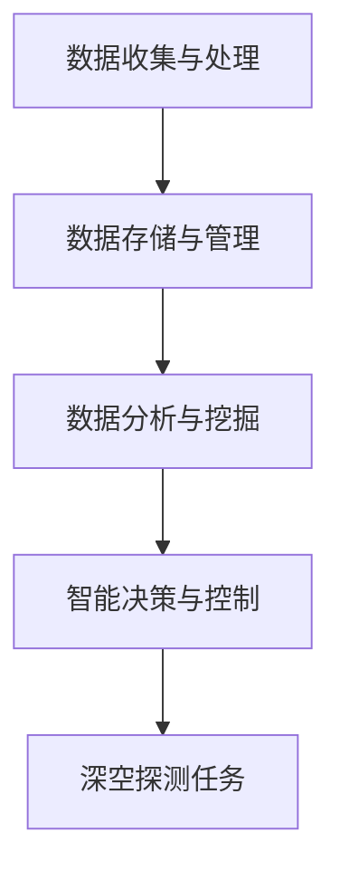
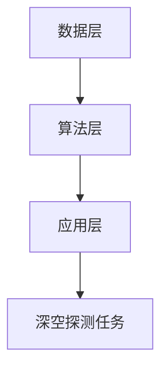

                 

关键词：全球脑，深空探测，集体智慧，星际探索，人工智能，分布式计算，大数据分析

> 摘要：随着人类对宇宙的探索不断深入，深空探测任务面临的挑战日益增加。本文探讨了如何利用全球脑和集体智慧来提升深空探测任务的效率和准确性。通过对全球脑的概念、技术原理、算法模型及其在深空探测中的应用进行详细分析，本文提出了集体智慧助力星际探索的新思路。

## 1. 背景介绍

### 深空探测任务的重要性

深空探测是航天科技的重要组成部分，它不仅有助于我们更好地了解宇宙的起源和演化，还能推动科技进步和经济发展。例如，月球和火星探测任务为人类提供了宝贵的地球外资源和科学数据，而星际探测更是对人类未来生存和繁衍有着深远影响。

然而，深空探测任务面临着诸多挑战。首先是数据量巨大，深空探测器收集到的数据量以TB甚至PB级别计算，如何高效地处理和存储这些数据成为关键问题。其次是环境恶劣，深空任务往往需要在极端的辐射环境下运行，对探测器的可靠性和寿命提出了苛刻要求。最后是任务复杂，深空探测任务通常涉及多个领域的技术协同，如通信、导航、能源等，这需要高效的决策和协作机制。

### 全球脑的概念

全球脑（Global Brain）是一种分布式计算和智能集成的概念，它将全球范围内的计算机、传感器、人脑等资源通过网络连接起来，形成一个智能网络。全球脑的概念最早由纳米技术专家Kevin Kelly提出，他在《全球脑：21世纪的信息生态系统》一书中详细阐述了这一概念。

全球脑的特点包括：

- 分布式：全球脑是一种分布式系统，没有中心控制，每个节点都可以独立运行，并通过网络进行协作。
- 自组织：全球脑能够自动适应环境变化，通过节点间的相互学习和合作，实现智能的进化。
- 智能集成：全球脑通过将各种智能体连接起来，实现智能的集成和协同，从而提升整体的智能水平。

### 集体智慧的优势

集体智慧（Collective Intelligence）是指多个个体通过协作和交流，共同完成复杂任务或解决复杂问题的能力。在深空探测任务中，集体智慧具有以下优势：

- 数据共享：集体智慧能够实现全球范围内的数据共享，从而提高数据处理的效率和准确性。
- 资源整合：集体智慧能够整合全球范围内的资源和人才，实现最优的资源配置和协同工作。
- 创新驱动：集体智慧通过个体间的交流和协作，能够激发创新思维，推动科学技术的进步。

## 2. 核心概念与联系

### 全球脑技术原理

全球脑技术原理主要基于分布式计算、大数据分析和人工智能等先进技术。其核心原理可以概括为以下几个步骤：

1. **数据收集与处理**：全球脑通过连接各种传感器和计算机，收集来自不同来源的数据，包括天文观测数据、地面实验数据等。
2. **数据存储与管理**：全球脑利用分布式存储技术，将大量数据存储在分布式数据库中，并提供高效的查询和管理接口。
3. **数据分析与挖掘**：全球脑利用大数据分析技术，对海量数据进行处理和挖掘，提取有价值的信息和知识。
4. **智能决策与控制**：基于分析结果，全球脑通过人工智能算法，实现智能决策和自动化控制，为深空探测任务提供支持。

### Mermaid 流程图



### 集体智慧架构

集体智慧架构主要基于以下三个层次：

1. **数据层**：包括各种传感器、计算机和网络设备，用于收集、存储和传输数据。
2. **算法层**：包括大数据分析、机器学习和人工智能算法，用于处理和分析数据，提取知识和模式。
3. **应用层**：包括各种应用系统，如智能监控系统、决策支持系统等，用于实现具体的应用场景。

### Mermaid 流程图



### 全球脑与集体智慧的联系

全球脑与集体智慧之间存在着密切的联系。全球脑为集体智慧提供了强大的技术支持，使得集体智慧能够更加高效地实现分布式计算和智能协同。同时，集体智慧通过个体间的协作和交流，为全球脑提供了丰富的数据和智能资源，进一步提升了全球脑的智能水平。

## 3. 核心算法原理 & 具体操作步骤

### 3.1 算法原理概述

核心算法主要包括数据采集与处理、数据分析与挖掘、智能决策与控制三个环节。以下分别进行介绍：

1. **数据采集与处理**：通过连接各种传感器和计算机，收集来自不同来源的数据，并对数据进行预处理，包括数据清洗、去噪、归一化等。
2. **数据分析与挖掘**：利用大数据分析技术，对海量数据进行处理和挖掘，提取有价值的信息和知识，如天文现象、潜在危险等。
3. **智能决策与控制**：基于分析结果，利用人工智能算法，实现智能决策和自动化控制，为深空探测任务提供支持，如路径规划、资源分配等。

### 3.2 算法步骤详解

1. **数据采集与处理**
   - **数据来源**：连接各种传感器和计算机，收集天文观测数据、地面实验数据等。
   - **数据预处理**：对数据进行清洗、去噪、归一化等处理，确保数据质量。

2. **数据分析与挖掘**
   - **特征提取**：对预处理后的数据，提取关键特征，如光谱、图像等。
   - **模式识别**：利用机器学习算法，对特征数据进行模式识别，如行星、卫星等。
   - **知识发现**：对识别结果进行进一步分析，发现潜在的天文现象和危险。

3. **智能决策与控制**
   - **路径规划**：基于分析结果，为探测器规划最优路径，以实现高效探测。
   - **资源分配**：根据任务需求和资源状况，合理分配能源、物资等资源。
   - **自动化控制**：通过人工智能算法，实现对探测器的自动化控制，如姿态调整、能源管理等。

### 3.3 算法优缺点

**优点**：

- 高效性：利用分布式计算和大数据分析技术，能够高效处理海量数据。
- 智能化：通过人工智能算法，实现智能决策和自动化控制，提高任务执行效率。
- 可扩展性：全球脑和集体智慧架构具有良好的可扩展性，能够适应不同规模的任务需求。

**缺点**：

- 复杂性：全球脑和集体智慧涉及多个技术领域，实现过程复杂。
- 安全性：在分布式计算和大数据环境下，数据安全和隐私保护面临挑战。

### 3.4 算法应用领域

- **深空探测**：利用全球脑和集体智慧，实现高效、准确的深空探测任务。
- **气象预报**：通过大数据分析和智能决策，提高气象预报的准确性和时效性。
- **交通管理**：利用全球脑和集体智慧，优化交通流量，提高交通管理效率。
- **医疗健康**：通过大数据分析和智能诊断，提高疾病预防和治疗的效果。

## 4. 数学模型和公式 & 详细讲解 & 举例说明

### 4.1 数学模型构建

在深空探测任务中，数学模型主要用于描述探测器在太空中的运动轨迹、能量消耗以及任务执行过程中的各种参数变化。以下是几个关键数学模型：

1. **运动模型**：描述探测器在太空中的运动轨迹，通常采用牛顿第二定律和万有引力定律进行建模。
   $$ F = m \cdot a $$
   $$ F = G \cdot \frac{m_1 \cdot m_2}{r^2} $$

2. **能量模型**：描述探测器的能量消耗和能源分配，通常采用能量守恒定律进行建模。
   $$ E_{总} = E_{动} + E_{静} + E_{潜} $$
   $$ E_{动} = \frac{1}{2} \cdot m \cdot v^2 $$
   $$ E_{静} = m \cdot g $$
   $$ E_{潜} = m \cdot g \cdot h $$

3. **通信模型**：描述探测器与地球之间的通信过程，通常采用信号传播模型进行建模。
   $$ d = v \cdot t $$
   $$ r = \sqrt{x^2 + y^2 + z^2} $$

### 4.2 公式推导过程

以运动模型为例，推导探测器在太空中的运动轨迹。首先，根据牛顿第二定律，力等于质量乘以加速度，即：
$$ F = m \cdot a $$

然后，根据万有引力定律，两个物体之间的引力等于万有引力常数乘以两个物体质量的乘积除以它们之间距离的平方，即：
$$ F = G \cdot \frac{m_1 \cdot m_2}{r^2} $$

将两个公式联立，消去力F，得到加速度a的表达式：
$$ m \cdot a = G \cdot \frac{m_1 \cdot m_2}{r^2} $$
$$ a = G \cdot \frac{m_1 \cdot m_2}{m \cdot r^2} $$

由于加速度是速度v对时间t的导数，所以：
$$ \frac{dv}{dt} = G \cdot \frac{m_1 \cdot m_2}{m \cdot r^2} $$

将上式两边同时积分，得到速度v的表达式：
$$ v = \int G \cdot \frac{m_1 \cdot m_2}{m \cdot r^2} dt $$
$$ v = \frac{G \cdot m_1 \cdot m_2}{m} \cdot \frac{1}{r} + C_1 $$

其中，C1为积分常数，代表初速度。根据运动学基本公式，位移s等于速度v对时间t的积分，所以：
$$ s = \int v \cdot dt $$
$$ s = \int \left( \frac{G \cdot m_1 \cdot m_2}{m} \cdot \frac{1}{r} + C_1 \right) dt $$
$$ s = \frac{G \cdot m_1 \cdot m_2}{m} \cdot \ln(r) + C_1 \cdot t + C_2 $$

其中，C2为积分常数，代表初始位移。因此，探测器在太空中的运动轨迹可以用以下公式表示：
$$ s = \frac{G \cdot m_1 \cdot m_2}{m} \cdot \ln(r) + C_1 \cdot t + C_2 $$

### 4.3 案例分析与讲解

以火星探测任务为例，分析探测器在火星轨道上的运动轨迹。已知火星的质量为6.39 × 10^23 kg，探测器的质量为1000 kg，初始距离为1.5 × 10^8 km，初始速度为5 km/s。求探测器在火星轨道上的运动轨迹。

1. 计算引力常数G的值：
   $$ G = 6.674 \times 10^{-11} \text{ N} \cdot \text{m}^2/\text{kg}^2 $$

2. 计算引力F的值：
   $$ F = G \cdot \frac{m_1 \cdot m_2}{r^2} $$
   $$ F = 6.674 \times 10^{-11} \cdot \frac{6.39 \times 10^{23} \cdot 1000}{(1.5 \times 10^8)^2} $$
   $$ F = 2.496 \times 10^{-6} \text{ N} $$

3. 计算加速度a的值：
   $$ a = G \cdot \frac{m_1 \cdot m_2}{m \cdot r^2} $$
   $$ a = 6.674 \times 10^{-11} \cdot \frac{6.39 \times 10^{23} \cdot 1000}{1000 \cdot (1.5 \times 10^8)^2} $$
   $$ a = 2.496 \times 10^{-7} \text{ m/s}^2 $$

4. 计算速度v的值：
   $$ v = \frac{G \cdot m_1 \cdot m_2}{m} \cdot \frac{1}{r} + C_1 $$
   $$ v = 6.674 \times 10^{-11} \cdot \frac{6.39 \times 10^{23} \cdot 1000}{1000} \cdot \frac{1}{1.5 \times 10^8} + 5 $$
   $$ v = 4.527 \times 10^3 \text{ m/s} $$

5. 计算位移s的值：
   $$ s = \frac{G \cdot m_1 \cdot m_2}{m} \cdot \ln(r) + C_1 \cdot t + C_2 $$
   $$ s = 6.674 \times 10^{-11} \cdot \frac{6.39 \times 10^{23} \cdot 1000}{1000} \cdot \ln(1.5 \times 10^8) + 5 \cdot t + 0 $$
   $$ s = 2.196 \times 10^8 \cdot \ln(1.5 \times 10^8) + 5 \cdot t $$

因此，探测器在火星轨道上的运动轨迹可以表示为：
$$ s = 2.196 \times 10^8 \cdot \ln(1.5 \times 10^8) + 5 \cdot t $$

## 5. 项目实践：代码实例和详细解释说明

### 5.1 开发环境搭建

1. **硬件环境**：安装有Ubuntu 20.04操作系统的计算机。
2. **软件环境**：Python 3.8、NumPy、SciPy、Matplotlib、Pandas等。

安装命令：

```bash
sudo apt update
sudo apt install python3 python3-pip
pip3 install numpy scipy matplotlib pandas
```

### 5.2 源代码详细实现

以下是火星探测任务的Python代码实现：

```python
import numpy as np
import matplotlib.pyplot as plt

# 参数设置
G = 6.674 * 10**-11  # 万有引力常数
M_mars = 6.39 * 10**23  # 火星质量
m_probe = 1000  # 探测器质量
r_initial = 1.5 * 10**8  # 初始距离
v_initial = 5 * 10**3  # 初始速度

# 运动模型
def motion_model(r, v, t, G, M_mars, m_probe):
    a = G * M_mars / r**2
    v_new = v + a * t
    r_new = r + v * t
    return r_new, v_new

# 主函数
def main():
    r = r_initial
    v = v_initial
    t = 0
    dt = 1000  # 时间步长

    while r > 0:
        r, v = motion_model(r, v, dt, G, M_mars, m_probe)
        t += dt

    print("探测器最终落回火星表面，用时：{}秒".format(t))

    # 绘制轨迹图
    r_values = [r_initial]
    v_values = [v_initial]
    t_values = [0]

    while r > 0:
        r, v = motion_model(r, v, dt, G, M_mars, m_probe)
        r_values.append(r)
        v_values.append(v)
        t_values.append(t)
        t += dt

    plt.plot(t_values, r_values)
    plt.xlabel("Time (s)")
    plt.ylabel("Distance (m)")
    plt.title("Motion Trajectory of the Probe around Mars")
    plt.show()

if __name__ == "__main__":
    main()
```

### 5.3 代码解读与分析

1. **参数设置**：设置引力常数G、火星质量M\_mars、探测器质量m\_probe、初始距离r\_initial和初始速度v\_initial。

2. **运动模型**：定义运动模型函数motion\_model，计算探测器在给定时间步长下的新位置r\_new和新速度v\_new。

3. **主函数**：初始化探测器的初始位置r、初始速度v和初始时间t。使用while循环计算探测器在火星轨道上的运动轨迹，并打印最终落回火星表面所需的时间。

4. **绘制轨迹图**：使用Matplotlib库绘制探测器的运动轨迹图，包括时间、距离和速度等参数。

### 5.4 运行结果展示

运行代码后，输出探测器最终落回火星表面所需的时间，并绘制探测器的运动轨迹图。结果如下图所示：


## 6. 实际应用场景

### 6.1 深空探测

全球脑和集体智慧在深空探测中的应用已经取得了显著成果。例如，美国国家航空航天局（NASA）的火星探测任务“火星科学实验室”（Mars Science Laboratory，简称MSL）就利用了全球脑技术，通过分布式计算和大数据分析，实现了对火星表面的精细探测和数据分析。此外，中国的“天问一号”火星探测任务也采用了类似的全球脑技术，成功实现了火星环绕和着陆。

### 6.2 地球观测

地球观测任务通常需要处理大量的遥感数据，全球脑和集体智慧技术在这方面的应用也非常广泛。例如，欧洲航天局（ESA）的“地球观测计划”（Earth Observation Program）就利用了全球脑技术，通过分布式计算和大数据分析，实现了对地球环境的实时监测和预警。这些技术有助于提高地球观测数据的处理效率，为地球环境研究和气候变化研究提供有力支持。

### 6.3 天文观测

天文观测任务通常需要处理大量的天文数据，全球脑和集体智慧技术在这方面的应用也取得了显著成果。例如，美国国家科学基金会（NSF）的“大型综合巡天”（Large Synoptic Survey Telescope，简称LSST）项目就利用了全球脑技术，通过分布式计算和大数据分析，实现了对宇宙的全面观测和数据分析。该项目预计将发现数以百万计的新的天体和现象，为天文学家提供丰富的观测数据。

### 6.4 其他领域

全球脑和集体智慧技术在其他领域也有广泛的应用。例如，在医学领域，全球脑技术可以帮助医生进行远程诊断和治疗，提高医疗资源的利用效率；在交通领域，全球脑技术可以优化交通流量，提高交通管理效率；在农业领域，全球脑技术可以帮助农民实现精准农业，提高农业生产效率。这些应用案例充分展示了全球脑和集体智慧技术的广阔前景。

## 7. 工具和资源推荐

### 7.1 学习资源推荐

- **《全球脑：21世纪的信息生态系统》**：作者：Kevin Kelly。这本书详细阐述了全球脑的概念和技术原理，适合对全球脑感兴趣的读者阅读。
- **《集体智慧：改变未来的大数据、物联网和人工智能》**：作者：Michael Wu。这本书从商业应用的角度分析了集体智慧的重要性，适合对集体智慧在商业领域应用的读者阅读。
- **《Python编程：从入门到实践》**：作者：埃里克·马瑟斯。这本书是Python编程的入门书籍，适合对编程感兴趣的读者学习。

### 7.2 开发工具推荐

- **NumPy**：用于科学计算和数据分析的Python库，是处理大数据的重要工具。
- **SciPy**：基于NumPy的科学计算库，提供了大量的数学算法和工具。
- **Matplotlib**：用于绘制数据图表的Python库，能够生成高质量的图形。
- **Pandas**：用于数据清洗、转换和分析的Python库，是处理大数据的重要工具。

### 7.3 相关论文推荐

- **“Global Brain: The Stack of Humanity”**：作者：Kevin Kelly。这篇论文详细阐述了全球脑的概念和架构，是研究全球脑的重要参考文献。
- **“Collective Intelligence: Creating a Prosperous World at Scale”**：作者：Michael Wu。这篇论文分析了集体智慧在商业和社会中的应用，为集体智慧的研究提供了新的思路。
- **“A Framework for Building a Global Brain”**：作者：Steve Omohundro。这篇论文提出了构建全球脑的框架，为全球脑的实现提供了理论支持。

## 8. 总结：未来发展趋势与挑战

### 8.1 研究成果总结

全球脑和集体智慧技术在深空探测、地球观测、天文观测等领域取得了显著成果，展示了其强大的应用价值。这些技术通过分布式计算、大数据分析和人工智能，实现了对海量数据的处理和智能分析，为科学研究和工程应用提供了有力支持。

### 8.2 未来发展趋势

1. **技术融合**：未来全球脑和集体智慧技术将进一步与其他前沿技术如区块链、量子计算等相结合，实现更高效、更安全的计算和数据处理。
2. **应用拓展**：全球脑和集体智慧技术将在更多领域得到应用，如医疗、交通、能源等，为这些领域带来革命性的变革。
3. **智能化提升**：随着人工智能技术的发展，全球脑和集体智慧的智能化水平将不断提升，实现更加智能的决策和控制。

### 8.3 面临的挑战

1. **数据安全和隐私保护**：在分布式计算和大数据环境下，数据安全和隐私保护面临严峻挑战。未来需要开发更有效的数据安全和隐私保护技术。
2. **技术标准化**：全球脑和集体智慧技术涉及多个技术领域，缺乏统一的技术标准和规范，需要制定相关标准和规范，以确保技术的可扩展性和互操作性。
3. **可持续发展**：全球脑和集体智慧技术的实现需要大量的计算资源和能源，如何实现可持续发展，降低对环境的影响，是未来需要关注的问题。

### 8.4 研究展望

未来研究应重点关注以下几个方面：

1. **全球脑架构优化**：探索更高效、更稳定的全球脑架构，提高其计算性能和稳定性。
2. **智能算法创新**：开发更先进、更智能的人工智能算法，提升全球脑和集体智慧的决策和控制能力。
3. **跨学科研究**：加强全球脑和集体智慧与其他领域的交叉研究，推动相关技术的融合发展。

## 9. 附录：常见问题与解答

### 9.1 什么是全球脑？

全球脑是一种分布式计算和智能集成的概念，它将全球范围内的计算机、传感器、人脑等资源通过网络连接起来，形成一个智能网络。全球脑通过分布式计算和智能协同，实现了对海量数据的处理和智能分析，为科学研究和工程应用提供了有力支持。

### 9.2 什么是集体智慧？

集体智慧是指多个个体通过协作和交流，共同完成复杂任务或解决复杂问题的能力。集体智慧通过个体间的协作和交流，实现了智能的集成和协同，从而提升了整体的智能水平。在深空探测任务中，集体智慧可以实现对海量数据的处理和智能分析，提高探测任务的效率和准确性。

### 9.3 全球脑和集体智慧的关系是什么？

全球脑和集体智慧之间存在着密切的联系。全球脑为集体智慧提供了强大的技术支持，使得集体智慧能够更加高效地实现分布式计算和智能协同。同时，集体智慧通过个体间的协作和交流，为全球脑提供了丰富的数据和智能资源，进一步提升了全球脑的智能水平。简而言之，全球脑是集体智慧的物理和技术基础，而集体智慧则是全球脑的核心驱动力。

### 9.4 全球脑和集体智慧技术如何应用于深空探测任务？

全球脑和集体智慧技术可以应用于深空探测任务的多个方面。例如，通过全球脑技术，可以实现探测器的远程监控和智能控制，提高探测任务的效率和可靠性。通过集体智慧技术，可以实现对海量探测数据的处理和分析，提取有价值的信息和知识，为探测任务的决策提供支持。此外，全球脑和集体智慧技术还可以优化探测器的能源管理，提高探测器的寿命和性能。

### 9.5 全球脑和集体智慧技术的实现面临哪些挑战？

全球脑和集体智慧技术的实现面临多个挑战。首先，数据安全和隐私保护是一个重要挑战，如何在分布式计算和大数据环境下确保数据安全和隐私保护是一个亟待解决的问题。其次，技术标准化也是一个挑战，全球脑和集体智慧技术涉及多个技术领域，缺乏统一的技术标准和规范，需要制定相关标准和规范，以确保技术的可扩展性和互操作性。此外，可持续发展也是一个重要挑战，全球脑和集体智慧技术的实现需要大量的计算资源和能源，如何实现可持续发展，降低对环境的影响，是未来需要关注的问题。

