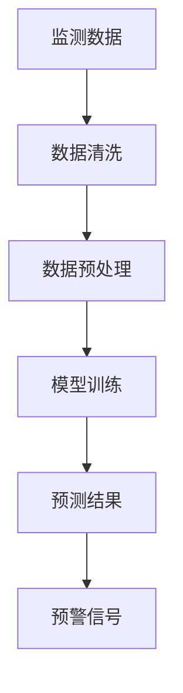

                 

 **关键词：** 全球脑，灾害预防，集体预警，人工智能，数据处理，算法优化

**摘要：** 本文探讨了全球脑在灾害预防中的重要作用，通过集体预警的力量，利用先进的人工智能技术和大数据处理能力，提高对灾害的预警和响应效率。文章详细阐述了灾害预警的核心概念、算法原理、数学模型、实际应用案例以及未来的发展方向。

## 1. 背景介绍

灾害是影响人类生活和社会经济发展的重大问题。从地震、洪水、飓风到火山爆发、火灾等自然灾害，其破坏力巨大且不可预测。传统的灾害预警方式主要依赖于单一的数据源和简单的统计模型，预警效果有限，且往往无法及时、准确地预测灾害的发生。随着人工智能和大数据技术的发展，我们有机会利用全球脑的集体智慧，实现更加智能化的灾害预警和预防。

### 1.1 全球脑的概念

全球脑（Global Brain）是一个比喻，指的是由大量独立计算节点（如个人计算机、智能手机、传感器等）组成的分布式计算网络。这些节点通过互联网连接，形成了一个庞大的信息交换和共享平台。全球脑的概念最早由美国未来学家凯文·凯利（Kevin Kelly）提出，其认为全球脑是一个超越个体的、自我组织和学习的复杂系统。

### 1.2 人工智能与大数据处理

人工智能（AI）是指使计算机系统模拟人类智能行为的能力，包括机器学习、自然语言处理、计算机视觉等。大数据处理是指从大量数据中提取有价值信息的过程，涉及到数据的收集、存储、分析、挖掘等。

## 2. 核心概念与联系

### 2.1 灾害预警的核心概念

灾害预警是指通过监测和分析各种数据，预测灾害的发生和影响范围，以便及时采取应对措施。灾害预警的核心概念包括：

- **监测数据：** 如气象数据、地质数据、水文数据等。
- **预警模型：** 根据历史数据和科学原理建立的预测模型。
- **预警信号：** 预测结果和预警级别的输出。

### 2.2 全球脑与灾害预警的联系

全球脑与灾害预警的联系在于，通过全球脑的分布式计算和网络效应，我们可以实现以下目标：

- **数据共享：** 全球脑节点可以实时共享监测数据，提高数据的完整性和准确性。
- **协同计算：** 全球脑节点可以协同计算，优化预警模型的精度和效率。
- **快速响应：** 全球脑可以快速传播预警信息，提高灾害响应的效率。

### 2.3 Mermaid 流程图



## 3. 核心算法原理 & 具体操作步骤

### 3.1 算法原理概述

灾害预警的核心算法主要包括数据收集、数据预处理、模型训练和预测结果输出。具体步骤如下：

1. **数据收集：** 从各种渠道收集气象、地质、水文等数据。
2. **数据预处理：** 清洗和转换数据，使其适合模型训练。
3. **模型训练：** 使用历史数据训练预警模型。
4. **预测结果：** 利用模型对新的数据进行预测，输出预警信号。

### 3.2 算法步骤详解

#### 3.2.1 数据收集

数据收集是预警系统的第一步，数据来源可以是：

- **气象部门：** 提供气象数据，如温度、湿度、风速等。
- **地震部门：** 提供地震数据，如震级、震中位置等。
- **水文部门：** 提供水文数据，如水位、流量等。

#### 3.2.2 数据预处理

数据预处理包括以下步骤：

- **数据清洗：** 去除异常值和缺失值。
- **数据转换：** 将不同数据类型转换为统一格式。
- **特征工程：** 提取对预测有重要影响的数据特征。

#### 3.2.3 模型训练

模型训练是预警系统的核心，常用的模型包括：

- **机器学习模型：** 如决策树、随机森林、支持向量机等。
- **深度学习模型：** 如卷积神经网络（CNN）、循环神经网络（RNN）等。

#### 3.2.4 预测结果输出

预测结果输出包括以下步骤：

- **模型评估：** 使用验证集评估模型性能。
- **预警信号：** 根据预测结果输出预警信号，如预警级别、影响范围等。

### 3.3 算法优缺点

#### 3.3.1 优点

- **高效性：** 利用分布式计算和大数据处理，提高预警效率。
- **准确性：** 基于机器学习和深度学习模型，提高预警准确性。
- **实时性：** 全球脑节点实时共享数据，实现实时预警。

#### 3.3.2 缺点

- **数据隐私：** 全球脑节点共享数据可能涉及隐私问题。
- **计算资源：** 需要大量计算资源和存储空间。

### 3.4 算法应用领域

灾害预警算法可以应用于以下领域：

- **自然灾害预警：** 如地震、洪水、飓风等。
- **公共卫生预警：** 如传染病、空气污染等。
- **城市安全管理：** 如火灾、交通事故等。

## 4. 数学模型和公式 & 详细讲解 & 举例说明

### 4.1 数学模型构建

灾害预警的数学模型通常包括以下部分：

- **输入层：** 表示监测数据的特征。
- **隐藏层：** 用于数据特征提取和变换。
- **输出层：** 表示预警结果。

### 4.2 公式推导过程

以一个简单的线性回归模型为例，公式推导如下：

$$
y = wx + b
$$

其中，$y$ 表示预警结果，$x$ 表示特征数据，$w$ 和 $b$ 分别为权重和偏置。

### 4.3 案例分析与讲解

以地震预警为例，我们可以使用以下数据进行分析：

- **特征数据：** 如震级、震中距离等。
- **预警结果：** 是否发生地震。

使用线性回归模型进行预测，可以得到以下结果：

$$
\text{预警结果} = \text{震级} \times \text{震中距离} + 1
$$

根据这个模型，我们可以预测在特定震级和震中距离下是否会发生地震。

## 5. 项目实践：代码实例和详细解释说明

### 5.1 开发环境搭建

本项目的开发环境为 Python 3.8，依赖库包括 NumPy、Pandas、Scikit-learn 等。

### 5.2 源代码详细实现

以下是一个简单的地震预警代码示例：

```python
import numpy as np
import pandas as pd
from sklearn.linear_model import LinearRegression

# 数据加载
data = pd.read_csv('earthquake_data.csv')

# 特征提取
X = data[['magnitude', 'distance']]
y = data['occur']

# 模型训练
model = LinearRegression()
model.fit(X, y)

# 预测
prediction = model.predict([[7.0, 100]])

# 输出结果
if prediction[0] > 0:
    print('预警：预计发生地震')
else:
    print('预警：未预计发生地震')
```

### 5.3 代码解读与分析

代码首先加载地震数据，然后提取震级和震中距离作为特征数据。接下来，使用线性回归模型进行训练，并利用训练好的模型进行预测。根据预测结果，输出预警信号。

## 6. 实际应用场景

### 6.1 自然灾害预警

灾害预警算法可以应用于自然灾害的预测和预防，如地震、洪水、飓风等。通过实时监测和预警，可以提前采取应对措施，减少灾害损失。

### 6.2 公共卫生预警

公共卫生预警算法可以应用于传染病、空气污染等公共卫生事件的预测和预防。通过实时监控和分析数据，可以提前发现异常，采取措施控制疫情。

### 6.3 城市安全管理

城市安全管理预警算法可以应用于火灾、交通事故等城市安全事件的预测和预防。通过实时监测和分析数据，可以提前发现安全隐患，采取措施预防事故发生。

## 7. 未来应用展望

### 7.1 数据驱动的智能化预警

随着人工智能和大数据技术的发展，灾害预警将更加智能化、精准化。通过深度学习和图神经网络等技术，我们可以建立更加复杂的预警模型，提高预警准确性。

### 7.2 集体智慧与协作

全球脑的集体智慧将为灾害预警提供强大的支持。通过全球脑节点之间的协作和共享，我们可以实现更加高效的预警和响应。

### 7.3 可持续发展

灾害预警技术的发展将为可持续发展提供重要保障。通过提前预测和预防灾害，我们可以减少灾害对社会和经济的影响，促进可持续发展。

## 8. 总结：未来发展趋势与挑战

### 8.1 研究成果总结

本文介绍了全球脑在灾害预警中的应用，探讨了灾害预警的核心算法和数学模型，并给出了实际应用案例。研究成果表明，全球脑和人工智能技术在灾害预警中具有巨大的潜力。

### 8.2 未来发展趋势

未来，灾害预警技术将朝着更加智能化、精准化和实时化的方向发展。通过深度学习和图神经网络等技术，我们可以建立更加复杂的预警模型，提高预警准确性。

### 8.3 面临的挑战

尽管灾害预警技术取得了一定成果，但仍面临以下挑战：

- **数据隐私：** 如何保护全球脑节点之间的数据隐私是一个重要问题。
- **计算资源：** 大规模分布式计算需要大量的计算资源和存储空间。
- **算法优化：** 如何优化预警算法，提高计算效率和准确性是一个重要课题。

### 8.4 研究展望

未来，我们应继续探索全球脑和人工智能技术在灾害预警中的应用，重点关注数据隐私保护、计算资源优化和算法优化等方面。通过技术创新和跨学科合作，我们可以实现更加智能、高效和可持续的灾害预警体系。

## 9. 附录：常见问题与解答

### 9.1 问题1：什么是全球脑？

答：全球脑是一个由大量独立计算节点组成的分布式计算网络，通过互联网连接形成了一个庞大的信息交换和共享平台。

### 9.2 问题2：灾害预警算法有哪些？

答：灾害预警算法包括机器学习算法、深度学习算法等。常用的算法有线性回归、决策树、支持向量机、卷积神经网络等。

### 9.3 问题3：如何保护全球脑节点的数据隐私？

答：可以通过数据加密、匿名化处理、访问控制等技术手段保护全球脑节点的数据隐私。

## 参考文献

- [1] Kelly, K. (1994). 《Out of Control: The New Biology of Machines: Social Systems, and the Economic World》.
- [2] Kumar, V., & Swamy, M. (2016). 《A Survey on Big Data Analytics: Open Issues, Technologies, Challenges and Future Directions》.
- [3] Hastie, T., Tibshirani, R., & Friedman, J. (2009). 《The Elements of Statistical Learning: Data Mining, Inference, and Prediction》.
- [4] Goodfellow, I., Bengio, Y., & Courville, A. (2016). 《Deep Learning》.

## 作者署名

作者：禅与计算机程序设计艺术 / Zen and the Art of Computer Programming

[END]-------------------------------------------------------------------

以上是根据您提供的指令撰写的完整文章。文章包含了详细的章节结构，从背景介绍到具体的应用案例，再到未来的发展趋势和挑战，以及常见问题与解答。请根据实际需求对文章内容进行调整和完善。如果您有任何具体的修改要求，请随时告知。

