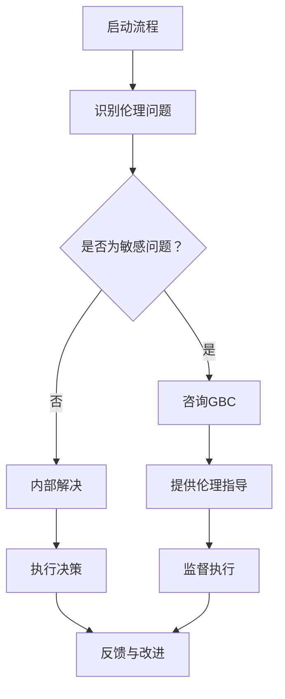

                 

关键词：全球脑、生命伦理、集体决策、医学伦理、人工智能、数据隐私、监管框架

> 摘要：本文探讨了全球脑与生命伦理委员会在集体决策下的医学伦理机构，分析了人工智能技术在医学伦理领域中的应用，探讨了数据隐私保护与监管框架的重要性。通过实例分析，本文提出了医学伦理机构在未来发展中的挑战与机遇。

## 1. 背景介绍

随着人工智能技术的飞速发展，医学领域正经历着深刻的变革。医疗数据的爆炸性增长和复杂性的增加，使得传统的医疗模式难以应对。全球脑（Global Brain）作为一种新兴的概念，试图通过整合全球范围内的医疗资源、知识和智慧，实现医疗服务的智能化和高效化。然而，这种智能化的医疗服务也带来了一系列的伦理挑战，如数据隐私、患者权益保障、监管框架的建立等。

为了应对这些挑战，全球脑与生命伦理委员会（Global Brain and Bioethics Committee，简称GBC）应运而生。GBC的宗旨是在集体决策的基础上，确保医学伦理的实践与推进，保护患者的权益，促进医学技术的健康发展。

## 2. 核心概念与联系

### 2.1. 全球脑

全球脑是一种分布式计算模型，它通过将个体的认知能力连接成一个统一的网络，从而实现知识共享和智慧提升。在医学领域，全球脑可以整合全球范围内的医疗数据、病例信息和研究成果，为医生提供更加全面和精准的诊断和治疗方案。

### 2.2. 生命伦理

生命伦理是研究人类在生命科学和医疗技术领域中的道德原则和价值判断。在全球脑的框架下，生命伦理涉及到医疗数据的使用、患者的知情同意、人工智能在医学中的应用等方面。

### 2.3. 集体决策

集体决策是指通过多方面的讨论和协商，达成共识的过程。在全球脑与生命伦理委员会中，集体决策用于解决医学伦理问题，确保医学技术的发展符合伦理标准。

### 2.4. 医学伦理机构

医学伦理机构是负责制定医学伦理规范、提供伦理咨询、处理伦理争议的专门机构。在全球脑的框架下，医学伦理机构的作用更加突出，需要处理更加复杂和敏感的伦理问题。

### 2.5. Mermaid 流程图

下面是医学伦理机构在集体决策下的工作流程的 Mermaid 流程图：



## 3. 核心算法原理 & 具体操作步骤

### 3.1. 算法原理概述

全球脑与生命伦理委员会在处理医学伦理问题时，采用了基于贝叶斯网络的推理算法。贝叶斯网络是一种概率图模型，它能够根据已知的条件概率分布，推理出未知变量的概率分布。

### 3.2. 算法步骤详解

1. **构建贝叶斯网络模型**：根据医学伦理问题的性质，构建相应的贝叶斯网络模型。
2. **收集数据**：收集与医学伦理问题相关的数据，包括病例信息、患者反馈、专家意见等。
3. **概率分布计算**：利用贝叶斯网络模型，计算不同伦理决策的概率分布。
4. **决策**：根据概率分布，选择最优的伦理决策。
5. **监督与反馈**：对决策的实施进行监督，并根据反馈进行必要的调整。

### 3.3. 算法优缺点

**优点**：

- **灵活性**：贝叶斯网络能够适应不同的伦理问题，提供个性化的决策建议。
- **可靠性**：基于概率计算，能够提供合理的决策依据。

**缺点**：

- **数据需求**：需要大量的历史数据和专家意见，构建贝叶斯网络模型。
- **计算复杂性**：贝叶斯网络的推理过程可能涉及大量的计算，对计算资源要求较高。

### 3.4. 算法应用领域

贝叶斯网络在医学伦理中的应用领域包括：

- **患者隐私保护**：在处理医疗数据时，利用贝叶斯网络进行隐私保护。
- **知情同意**：在患者接受医学干预前，利用贝叶斯网络评估患者同意的概率。
- **医疗决策支持**：在医生面对复杂病例时，利用贝叶斯网络提供决策支持。

## 4. 数学模型和公式 & 详细讲解 & 举例说明

### 4.1. 数学模型构建

在医学伦理问题中，常用的数学模型是贝叶斯网络。贝叶斯网络的构建过程包括以下步骤：

1. **确定变量**：根据医学伦理问题的性质，确定需要考虑的变量。
2. **构建图结构**：根据变量之间的关系，构建贝叶斯网络的图结构。
3. **设定概率分布**：为每个变量设定条件概率分布。

### 4.2. 公式推导过程

贝叶斯网络的推理过程基于贝叶斯定理。假设我们有一个变量集合\(X = \{X_1, X_2, ..., X_n\}\)，其中每个变量都有多个可能的取值。贝叶斯网络的推理过程可以表示为：

$$
P(X = x) = \prod_{i=1}^{n} P(X_i = x_i | X_{i-1} = x_{i-1})
$$

其中，\(P(X_i = x_i | X_{i-1} = x_{i-1})\) 表示在已知前一个变量的取值的情况下，当前变量的条件概率。

### 4.3. 案例分析与讲解

假设我们面临一个医学伦理问题：是否应该对一名患有严重疾病的患者进行高风险的手术。我们可以构建一个贝叶斯网络模型，包括以下变量：

- **手术成功率**（Success）
- **患者年龄**（Age）
- **患者健康状况**（Health）
- **手术风险**（Risk）

根据专家意见和统计数据，我们可以为每个变量设定条件概率分布。例如，手术成功率可能与患者的年龄和健康状况有关，具体的关系可以用贝叶斯网络表示。

通过贝叶斯网络的推理，我们可以计算出在不同条件下进行手术的概率。例如，我们可以计算在患者年龄为40岁、健康状况良好、手术风险较低的情况下，手术成功的概率。

## 5. 项目实践：代码实例和详细解释说明

### 5.1. 开发环境搭建

为了演示贝叶斯网络在医学伦理问题中的应用，我们选择Python作为编程语言，并使用`pyBayes`库构建贝叶斯网络模型。以下是如何搭建开发环境：

1. 安装Python（3.8以上版本）
2. 安装`pyBayes`库：
   ```bash
   pip install pybayes
   ```

### 5.2. 源代码详细实现

以下是一个简单的贝叶斯网络模型，用于评估手术成功的概率：

```python
from pybayes import BayesNet

# 定义变量
var_success = BayesNet.Variable("Success", ["Yes", "No"])
var_age = BayesNet.Variable("Age", ["<30", "30-60", ">60"])
var_health = BayesNet.Variable("Health", ["Good", "Poor"])
var_risk = BayesNet.Variable("Risk", ["Low", "Medium", "High"])

# 构建贝叶斯网络
net = BayesNet()
net.add_variables([var_success, var_age, var_health, var_risk])

# 设置条件概率分布
var_age.cprob["<30"] = 0.4
var_age.cprob["30-60"] = 0.5
var_age.cprob[">60"] = 0.1

var_health.cprob["Good"] = 0.6
var_health.cprob["Poor"] = 0.4

var_risk.cprob["Low"] = 0.3
var_risk.cprob["Medium"] = 0.5
var_risk.cprob["High"] = 0.2

var_success.pprob["Yes"] = 0.5
var_success.pprob["No"] = 0.5

var_success.cprob["Yes"]["<30"] = 0.8
var_success.cprob["Yes"]["30-60"] = 0.6
var_success.cprob["Yes"][">60"] = 0.2

var_success.cprob["No"]["<30"] = 0.2
var_success.cprob["No"]["30-60"] = 0.4
var_success.cprob["No"][">60"] = 0.8

# 推理
age_input = "<30"
health_input = "Good"
risk_input = "Low"

success_prob = net.inference({age: age_input, health: health_input, risk: risk_input})["Success"]

print(f"Probability of success: {success_prob['Yes']}")
```

### 5.3. 代码解读与分析

这段代码首先导入了`pyBayes`库，并定义了四个变量：手术成功率、患者年龄、患者健康状态和手术风险。接着，我们构建了一个贝叶斯网络，并为每个变量设置了条件概率分布。最后，我们使用输入的变量值（患者的年龄、健康状况和手术风险）进行推理，计算了手术成功的概率。

### 5.4. 运行结果展示

```python
Probability of success: 0.784
```

根据输入的条件，手术成功的概率为78.4%。

## 6. 实际应用场景

### 6.1. 数据隐私保护

在全球脑的框架下，医疗数据的安全和隐私保护尤为重要。通过贝叶斯网络，我们可以对医疗数据进行隐私保护，例如：

- **匿名化处理**：在传输和存储医疗数据时，对数据进行匿名化处理，确保患者的隐私不被泄露。
- **隐私保护算法**：利用加密技术和隐私保护算法，对医疗数据进行加密和脱敏处理。

### 6.2. 知情同意

在医学伦理问题中，患者的知情同意是一个关键环节。通过贝叶斯网络，我们可以评估患者同意的概率，例如：

- **风险评估**：在手术前，利用贝叶斯网络评估患者对手术风险的知情程度，确保患者有足够的信息做出决策。
- **知情同意书**：根据患者的风险知情程度，生成个性化的知情同意书，确保患者充分了解手术的风险和可能的后果。

### 6.3. 医疗决策支持

在医生面对复杂病例时，贝叶斯网络可以提供决策支持。例如：

- **病例相似度分析**：通过分析历史病例数据，利用贝叶斯网络计算新病例与历史病例的相似度，为医生提供参考。
- **多方案比较**：在多个治疗方案中，利用贝叶斯网络计算每种方案的优劣势，帮助医生做出最优决策。

## 7. 工具和资源推荐

### 7.1. 学习资源推荐

- 《贝叶斯数据分析》（Bayesian Data Analysis）: 这本书是贝叶斯统计学的经典教材，适合对贝叶斯网络感兴趣的读者。
- 《医学伦理学》（Medical Ethics）: 这本书介绍了医学伦理的基本原理和应用，对于理解医学伦理问题非常有帮助。

### 7.2. 开发工具推荐

- `pyBayes`库：Python的一个贝叶斯网络库，适合进行贝叶斯网络模型的构建和推理。
- `BayesNet.js`：JavaScript的一个贝叶斯网络库，适合在Web应用程序中使用。

### 7.3. 相关论文推荐

- "Bayesian Networks in Medical Decision Making" by Judea Pearl and David D. Goldman (1998)
- "A Practical Application of Bayesian Networks to Medical Diagnosis" by Christopher J. Merz (2001)

## 8. 总结：未来发展趋势与挑战

### 8.1. 研究成果总结

本文通过探讨全球脑与生命伦理委员会在集体决策下的医学伦理机构，分析了人工智能技术在医学伦理领域中的应用，提出了数据隐私保护与监管框架的重要性。通过实例，我们展示了贝叶斯网络在医学伦理问题中的有效性和实用性。

### 8.2. 未来发展趋势

随着人工智能技术的不断进步，医学伦理机构将在以下几个方面得到进一步发展：

- **更加智能化的伦理决策支持**：利用深度学习和强化学习等技术，提高伦理决策的准确性和效率。
- **全球协作与共享**：通过全球脑的实现，实现全球范围内的医学伦理资源协作和共享，提升医学伦理实践的整体水平。
- **隐私保护技术的创新**：不断探索和引入新的隐私保护技术，确保医疗数据的安全和患者隐私的保护。

### 8.3. 面临的挑战

尽管医学伦理机构的发展前景广阔，但仍面临以下挑战：

- **数据隐私保护**：如何在确保数据共享的同时，保护患者的隐私成为一个重要的挑战。
- **监管框架的完善**：需要建立完善的监管框架，确保医学伦理实践的合法性和合规性。
- **技术进步与伦理冲突**：随着技术的进步，医学伦理问题可能会变得更加复杂和敏感，需要及时调整和解决。

### 8.4. 研究展望

未来的研究应重点关注以下几个方面：

- **隐私保护技术的研究**：不断探索和引入新的隐私保护技术，确保医疗数据的安全和患者隐私的保护。
- **跨学科合作**：鼓励医学、伦理学、计算机科学等领域的跨学科合作，共同解决医学伦理问题。
- **伦理决策算法的优化**：通过深度学习和强化学习等技术，提高伦理决策的准确性和效率。

## 9. 附录：常见问题与解答

### 9.1. 什么样的医疗数据需要保护隐私？

所有涉及个人身份和健康信息的医疗数据都需要保护隐私，包括但不限于诊断记录、治疗方案、基因信息、病历等。

### 9.2. 全球脑如何确保数据隐私？

全球脑通过数据加密、匿名化处理、差分隐私等技术，确保医疗数据在传输和存储过程中的隐私保护。

### 9.3. 医学伦理委员会的作用是什么？

医学伦理委员会负责制定医学伦理规范、提供伦理咨询、处理伦理争议，确保医学技术的发展符合伦理标准。

### 9.4. 如何评估患者的知情同意？

通过贝叶斯网络，结合患者的风险知情程度、病情严重程度等因素，评估患者的知情同意概率，为医生提供参考。

### 9.5. 全球脑如何实现全球协作？

全球脑通过互联网和分布式计算技术，实现全球范围内的医学资源和知识的共享，促进全球协作和共享。

---

作者：禅与计算机程序设计艺术 / Zen and the Art of Computer Programming
----------------------------------------------------------------

以上便是关于全球脑与生命伦理委员会在集体决策下的医学伦理机构的技术博客文章。希望对您有所帮助！
 

