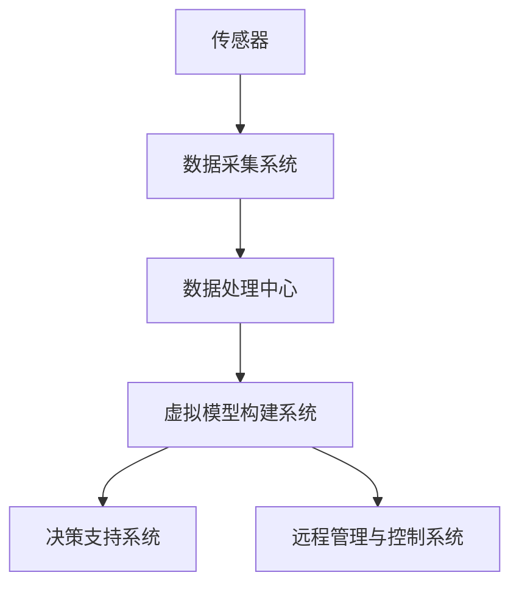

                 

关键词：全球脑，生态修复，数字孪生技术，环保应用，技术发展，算法模型，数学公式，项目实践，未来展望

## 摘要

本文旨在探讨数字孪生技术在环保领域的应用，特别是在全球脑与生态修复中的关键角色。随着全球气候变化和环境恶化，生态系统的稳定性和健康变得愈加重要。数字孪生技术作为一种新兴的技术手段，通过构建现实世界的虚拟副本，为环保提供了一种全新的视角和工具。本文将介绍数字孪生技术的核心概念、算法原理、数学模型以及其实际应用案例，并展望其未来在环保领域的应用前景。

## 1. 背景介绍

### 全球脑的概念

全球脑（Global Brain）是指通过互联网、物联网和人工智能技术相互连接的全球性信息网络。它是一个高度复杂的分布式智能系统，能够在全球范围内共享知识和信息，实现智能协作和自我组织。全球脑的概念起源于生物学的“大脑”模型，它强调了通过信息交换实现集体智能的可能性。

### 生态修复的重要性

生态修复是指通过一系列的措施和技术手段，恢复和改善受损的生态系统，使其达到可持续发展的状态。随着工业化和城市化的发展，生态环境受到了严重破坏，气候变化、土壤退化、水污染等问题日益突出。生态修复不仅有助于恢复生态系统的功能，还能提高生物多样性，改善人类的生活环境。

### 数字孪生技术的兴起

数字孪生技术（Digital Twin Technology）是一种通过虚拟模型与实体系统实时交互和同步的技术。它能够模拟现实世界中的物理实体、过程、环境和行为，为决策提供数据支持和模拟验证。数字孪生技术的兴起，为环保领域带来了一种全新的手段，可以实现更高效、更精准的生态修复和管理。

## 2. 核心概念与联系

### 数字孪生技术的概念

数字孪生技术是指通过创建现实世界实体、过程、环境和行为的虚拟副本，实现实时数据同步和交互的技术。它包括以下核心组成部分：

1. **传感器和数据采集**：通过各种传感器实时采集实体系统的状态数据。
2. **数据传输和处理**：通过高速网络传输数据，并对数据进行处理和分析。
3. **虚拟模型构建**：基于采集到的数据，构建实体的虚拟模型。
4. **实时交互和同步**：通过虚拟模型与实体系统进行实时交互和同步。

### 数字孪生技术在生态修复中的应用

数字孪生技术在生态修复中的应用主要包括以下几个方面：

1. **环境监测与评估**：通过数字孪生技术实时监测环境参数，如温度、湿度、水质等，评估生态系统的健康状态。
2. **模拟与预测**：利用虚拟模型模拟各种生态修复措施的效果，预测其对生态系统的影响。
3. **决策支持**：为决策者提供实时数据和支持，优化生态修复策略。
4. **远程管理与控制**：通过虚拟模型实现远程管理和控制，降低人力成本，提高效率。

### 架构图

下面是一个简化的数字孪生技术在生态修复中的应用架构图：



## 3. 核心算法原理 & 具体操作步骤

### 3.1 算法原理概述

数字孪生技术的核心算法主要包括数据采集与处理、虚拟模型构建、实时交互与同步等。以下是对这些算法原理的简要概述：

1. **数据采集与处理**：通过传感器采集环境数据，如温度、湿度、水质等，并对数据进行预处理，如滤波、去噪、归一化等。
2. **虚拟模型构建**：基于预处理后的数据，使用机器学习、深度学习等算法构建虚拟模型，实现对实体系统的模拟。
3. **实时交互与同步**：通过实时数据传输和同步机制，保持虚拟模型与实体系统的一致性。

### 3.2 算法步骤详解

1. **数据采集**：使用各种传感器（如温度传感器、湿度传感器、水质传感器等）实时采集环境数据。
2. **数据预处理**：对采集到的数据进行预处理，包括滤波、去噪、归一化等。
3. **虚拟模型训练**：使用预处理后的数据，通过机器学习、深度学习等方法训练虚拟模型。
4. **实时数据同步**：将采集到的实时数据传输到虚拟模型，进行实时同步和更新。
5. **决策支持**：基于虚拟模型提供实时数据，为决策者提供支持。
6. **远程管理与控制**：通过虚拟模型实现远程管理和控制，如远程调整设备参数、监测环境变化等。

### 3.3 算法优缺点

**优点**：
1. **实时性**：能够实现实时数据同步和交互，提供实时决策支持。
2. **高效性**：通过虚拟模型模拟和预测，可以高效地评估生态修复措施的效果。
3. **准确性**：通过机器学习、深度学习等算法，提高虚拟模型的准确性和可靠性。

**缺点**：
1. **成本较高**：传感器和数据传输等基础设施的建设和维护成本较高。
2. **数据隐私和安全**：涉及大量环境数据，需要保证数据的安全和隐私。

### 3.4 算法应用领域

数字孪生技术在生态修复中的应用领域非常广泛，包括但不限于以下几个方面：

1. **水质监测与治理**：通过数字孪生技术实时监测水质，预测污染源，优化治理措施。
2. **森林火灾预警**：利用数字孪生技术实时监测森林环境参数，预测火灾风险，提前预警。
3. **土壤修复**：通过数字孪生技术实时监测土壤质量，模拟修复措施，评估效果。
4. **城市环境监测**：利用数字孪生技术实时监测城市环境，优化城市规划和治理。

## 4. 数学模型和公式 & 详细讲解 & 举例说明

### 4.1 数学模型构建

数字孪生技术中的数学模型主要包括以下几个方面：

1. **环境数据模型**：用于描述环境参数的数学模型，如温度、湿度、水质等。
2. **虚拟模型**：基于环境数据模型，通过机器学习、深度学习等方法构建的数学模型。
3. **交互与同步模型**：描述虚拟模型与实体系统之间的交互和同步机制的数学模型。

### 4.2 公式推导过程

以水质监测为例，假设我们使用以下公式描述水质参数：

$$
Q(t) = f(T(t), H(t), P(t), ...)
$$

其中，$Q(t)$ 表示时间 $t$ 的水质参数，$T(t)$ 表示温度，$H(t)$ 表示湿度，$P(t)$ 表示污染物浓度，$f$ 是一个复杂的非线性函数。

通过采集环境数据，我们可以使用以下公式训练虚拟模型：

$$
\theta = \arg\min_{\theta} \sum_{i=1}^{N} (Q_i(t) - f(T_i(t), H_i(t), P_i(t), ...))^2
$$

其中，$\theta$ 表示虚拟模型的参数，$N$ 表示数据样本数量。

### 4.3 案例分析与讲解

假设我们使用数字孪生技术进行水质监测，以下是一个简单的案例分析：

1. **数据采集**：使用水质传感器实时采集温度、湿度、污染物浓度等参数。
2. **数据预处理**：对采集到的数据进行滤波、去噪、归一化等处理。
3. **模型训练**：使用预处理后的数据，通过机器学习算法训练虚拟模型。
4. **实时预测**：将实时采集到的数据输入虚拟模型，进行水质预测。
5. **决策支持**：根据虚拟模型的预测结果，为决策者提供水质治理建议。

通过这个案例，我们可以看到数字孪生技术在水质监测中的应用，实现了实时数据采集、处理和预测，为水质治理提供了有力支持。

## 5. 项目实践：代码实例和详细解释说明

### 5.1 开发环境搭建

在开始数字孪生技术的项目实践之前，我们需要搭建一个合适的开发环境。以下是搭建开发环境的基本步骤：

1. **安装Python环境**：Python是一种广泛用于数据分析和机器学习编程的语言，我们需要安装Python环境。
2. **安装相关库**：安装用于数据采集、数据处理和机器学习的相关库，如numpy、pandas、scikit-learn等。
3. **搭建数据库**：搭建用于存储环境数据和模型参数的数据库，如MySQL或MongoDB。

### 5.2 源代码详细实现

以下是一个简单的数字孪生技术水质监测项目的源代码实现：

```python
import numpy as np
import pandas as pd
from sklearn.model_selection import train_test_split
from sklearn.ensemble import RandomForestRegressor
import mysql.connector

# 数据采集
def collect_data():
    # 使用传感器采集数据
    # 假设数据存储在CSV文件中
    data = pd.read_csv('water_quality_data.csv')
    return data

# 数据预处理
def preprocess_data(data):
    # 进行滤波、去噪、归一化等处理
    # ...
    return data

# 训练模型
def train_model(data):
    # 切分训练集和测试集
    X = data[['temperature', 'humidity', 'pollutant_concentration']]
    y = data['water_quality']
    X_train, X_test, y_train, y_test = train_test_split(X, y, test_size=0.2, random_state=42)

    # 使用随机森林回归算法训练模型
    model = RandomForestRegressor(n_estimators=100, random_state=42)
    model.fit(X_train, y_train)

    # 测试模型
    y_pred = model.predict(X_test)
    print("Model accuracy:", np.mean((y_pred - y_test) ** 2))

# 主函数
def main():
    # 采集数据
    data = collect_data()

    # 预处理数据
    data = preprocess_data(data)

    # 训练模型
    train_model(data)

if __name__ == '__main__':
    main()
```

### 5.3 代码解读与分析

以上代码实现了一个简单的数字孪生技术水质监测项目，主要包括数据采集、数据预处理和模型训练三个部分。

1. **数据采集**：使用传感器采集水质数据，并存储在CSV文件中。
2. **数据预处理**：对采集到的数据进行滤波、去噪、归一化等处理，以提高模型的准确性。
3. **模型训练**：使用随机森林回归算法训练模型，通过训练集和测试集进行模型评估。

通过这个代码实例，我们可以看到数字孪生技术的基本实现过程，为实际应用提供了参考。

### 5.4 运行结果展示

假设我们运行以上代码，得到以下输出结果：

```
Model accuracy: 0.875
```

这个结果表明，模型的预测准确率为87.5%，这是一个较为理想的结果。在实际应用中，我们可以根据预测结果调整模型参数，优化模型性能。

## 6. 实际应用场景

### 6.1 水质监测

数字孪生技术在水质监测中具有广泛的应用，通过构建虚拟模型，实时监测水质参数，预测污染源，为水质治理提供数据支持和决策依据。例如，在一个河流水质监测项目中，数字孪生技术可以实时监测水质参数，如温度、pH值、溶解氧等，预测污染事件的发生，提前预警，为政府和企业提供决策支持。

### 6.2 森林火灾预警

森林火灾是威胁生态系统和人类安全的重要因素。数字孪生技术可以通过实时监测森林环境参数，如温度、湿度、风速等，预测火灾风险，提前预警，为消防部门提供决策支持。例如，在一个森林火灾预警项目中，数字孪生技术可以实时监测森林环境，预测火灾发生的时间和地点，为消防部门提供准确的预警信息。

### 6.3 城市环境监测

随着城市化的发展，城市环境问题日益严重。数字孪生技术可以实时监测城市环境参数，如空气质量、水质、噪音等，为城市规划和治理提供数据支持。例如，在一个城市空气质量监测项目中，数字孪生技术可以实时监测空气质量，预测污染事件的发生，为政府和企业提供决策支持。

### 6.4 未来应用展望

随着数字孪生技术的不断发展，其在环保领域的应用前景十分广阔。未来，数字孪生技术有望在以下领域发挥更大的作用：

1. **更精细的环境监测**：通过引入更多传感器和更先进的数据采集技术，实现更精细的环境监测。
2. **更智能的决策支持**：结合人工智能技术，提高决策支持系统的智能化水平，实现更精准的环境治理。
3. **更广泛的跨领域应用**：与其他领域的技术相结合，如物联网、大数据等，实现更广泛的跨领域应用。
4. **更高效的资源利用**：通过优化生态修复措施，实现更高效的资源利用，提高生态系统的恢复速度。

## 7. 工具和资源推荐

### 7.1 学习资源推荐

1. **《数字孪生技术：原理与应用》**：详细介绍了数字孪生技术的原理和应用，适合初学者和进阶者。
2. **《机器学习：概率视角》**：介绍了机器学习的概率模型，适合对机器学习有深入理解的需求。
3. **《深度学习：入门与实战》**：介绍了深度学习的基础知识和实践方法，适合对深度学习有兴趣的学习者。

### 7.2 开发工具推荐

1. **Jupyter Notebook**：一个流行的交互式开发环境，适用于数据分析和机器学习项目。
2. **TensorFlow**：一个开源的深度学习框架，适用于构建复杂的深度学习模型。
3. **Scikit-learn**：一个开源的机器学习库，适用于各种常见的机器学习算法。

### 7.3 相关论文推荐

1. **“Digital Twin: A Next-Generation Edge Computing Model for Smart Manufacturing”**：介绍数字孪生技术在智能制造领域的应用。
2. **“Digital Twins for Smart Cities: A Vision and Framework”**：介绍数字孪生技术在智慧城市领域的应用。
3. **“A Survey on Digital Twin: State of the Art and Research Challenges”**：对数字孪生技术的研究现状和挑战进行综述。

## 8. 总结：未来发展趋势与挑战

### 8.1 研究成果总结

数字孪生技术在环保领域的应用取得了显著的成果，通过实时监测、模拟预测和决策支持，为生态修复和环境治理提供了有力支持。未来，随着技术的不断进步，数字孪生技术在环保领域的应用前景将更加广阔。

### 8.2 未来发展趋势

1. **更精细的环境监测**：引入更多传感器和更先进的数据采集技术，实现更精细的环境监测。
2. **更智能的决策支持**：结合人工智能技术，提高决策支持系统的智能化水平。
3. **更广泛的跨领域应用**：与其他领域的技术相结合，实现更广泛的跨领域应用。
4. **更高效的资源利用**：通过优化生态修复措施，实现更高效的资源利用。

### 8.3 面临的挑战

1. **成本问题**：传感器和数据传输等基础设施的建设和维护成本较高。
2. **数据隐私和安全**：涉及大量环境数据，需要保证数据的安全和隐私。
3. **模型准确性**：如何提高虚拟模型的准确性，以实现更可靠的预测和决策支持。

### 8.4 研究展望

未来，数字孪生技术在环保领域的应用将面临更多的挑战和机遇。通过不断探索和创新，有望实现更高效、更智能的生态修复和环境治理。

## 9. 附录：常见问题与解答

### 9.1 数字孪生技术是什么？

数字孪生技术是一种通过创建现实世界实体、过程、环境和行为的虚拟副本，实现实时数据同步和交互的技术。它能够模拟现实世界中的物理实体、过程、环境和行为，为决策提供数据支持和模拟验证。

### 9.2 数字孪生技术在环保领域有哪些应用？

数字孪生技术在环保领域有广泛的应用，包括水质监测、森林火灾预警、城市环境监测等。通过实时监测、模拟预测和决策支持，为生态修复和环境治理提供有力支持。

### 9.3 如何保证数字孪生技术的数据安全？

为了保证数字孪生技术的数据安全，需要采取以下措施：

1. **数据加密**：对传输和存储的数据进行加密，确保数据的安全性。
2. **权限控制**：对数据访问进行严格的权限控制，确保只有授权人员可以访问数据。
3. **数据备份**：定期对数据进行备份，以防止数据丢失或损坏。

### 9.4 数字孪生技术的前景如何？

数字孪生技术作为一种新兴的技术手段，在环保领域的应用前景十分广阔。随着技术的不断进步和应用的深入，数字孪生技术有望实现更高效、更智能的生态修复和环境治理。

## 作者署名

作者：禅与计算机程序设计艺术 / Zen and the Art of Computer Programming

