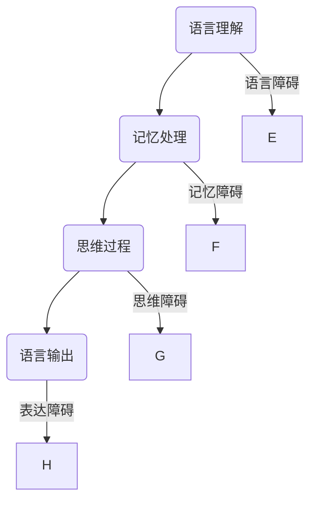
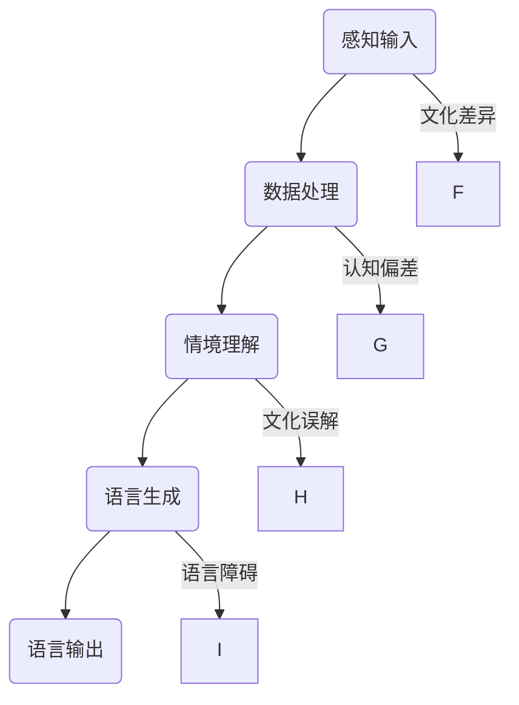

                 

关键词：脑功能、语言障碍、跨文化沟通、人工智能、认知模型

> 摘要：本文探讨了全球范围内脑与语言障碍现象对跨文化沟通的挑战，并提出了基于人工智能的认知模型作为解决方案。文章通过深入分析语言障碍的成因、跨文化沟通的需求与障碍，结合人工智能技术的最新进展，展示了如何利用认知模型实现跨文化沟通的突破。

## 1. 背景介绍

在全球化的背景下，跨文化沟通日益成为交流与合作的重要手段。然而，由于全球人口的多样性和语言障碍的存在，跨文化沟通面临着诸多挑战。语言障碍不仅限于词汇和语法层面，更涉及脑认知功能，如语言理解、记忆和思维等。脑与语言障碍现象不仅影响个体的生活质量，也对全球化进程中的沟通效率产生负面影响。

近年来，人工智能（AI）技术的快速发展为解决语言障碍提供了新的可能性。基于大数据和机器学习的AI模型可以在语言处理、情感分析、自然语言生成等方面实现突破，从而为跨文化沟通提供高效、准确的解决方案。

本文旨在探讨脑与语言障碍对跨文化沟通的影响，并介绍如何利用人工智能的认知模型实现沟通的突破。文章结构如下：

1. **背景介绍**：简要介绍全球脑与语言障碍现象及其对跨文化沟通的挑战。
2. **核心概念与联系**：介绍与跨文化沟通相关的主要概念和认知模型。
3. **核心算法原理与具体操作步骤**：详细解析实现跨文化沟通突破的核心算法原理和操作步骤。
4. **数学模型和公式**：阐述支持核心算法的数学模型和推导过程。
5. **项目实践**：通过具体项目实例展示算法的实际应用。
6. **实际应用场景**：分析跨文化沟通在不同领域的应用。
7. **未来应用展望**：讨论人工智能在跨文化沟通领域的未来发展。
8. **工具和资源推荐**：推荐相关学习资源和开发工具。
9. **总结**：总结研究成果，展望未来挑战与机遇。

## 2. 核心概念与联系

为了更好地理解跨文化沟通中的脑与语言障碍，我们需要介绍一些核心概念和认知模型。以下是主要的概念和相关的Mermaid流程图：

### 2.1 脑与语言障碍

脑与语言障碍涉及脑功能的异常，如记忆衰退、认知障碍等。这些障碍会影响语言理解、记忆和思维。以下是一个简化的Mermaid流程图，展示了脑与语言障碍的基本流程：



### 2.2 认知模型

认知模型是描述人类思维过程的抽象模型。在跨文化沟通中，认知模型可以帮助我们理解不同文化背景下人们如何理解和表达语言。以下是一个简化的Mermaid流程图，展示了认知模型的基本结构：



通过这两个流程图，我们可以看到脑与语言障碍对认知模型的影响。接下来，我们将深入探讨这些概念，并介绍如何利用人工智能技术来克服这些障碍。

## 3. 核心算法原理与具体操作步骤

为了实现跨文化沟通的突破，我们需要构建一个能够处理脑与语言障碍的算法。这一节将详细解析这个算法的原理和具体操作步骤。

### 3.1 算法原理概述

我们的核心算法基于深度学习和自然语言处理（NLP）技术。算法的基本原理可以分为以下几个步骤：

1. **数据预处理**：收集大量多语言数据，并进行预处理，包括分词、词性标注和句子结构分析。
2. **模型训练**：使用预处理后的数据训练深度学习模型，模型包括多层感知器、循环神经网络（RNN）和Transformer等。
3. **语言障碍识别**：利用训练好的模型对输入文本进行语言障碍识别，包括语言理解障碍、记忆障碍和思维障碍。
4. **障碍处理**：根据识别结果，对语言障碍进行分类和修正，生成更准确、更自然的文本输出。
5. **跨文化沟通**：将修正后的文本输出到不同文化背景的接收者，实现跨文化沟通。

### 3.2 算法步骤详解

以下是算法的具体步骤详解：

### 3.2.1 数据预处理

数据预处理是算法实现的基础。我们使用以下步骤对数据集进行处理：

1. **文本清洗**：去除数据中的噪声，如HTML标签、特殊字符等。
2. **分词**：将文本分割成单词或词组。
3. **词性标注**：标注每个词的词性，如名词、动词、形容词等。
4. **句子结构分析**：分析句子的语法结构，提取主语、谓语、宾语等。

### 3.2.2 模型训练

模型训练是算法实现的关键。我们使用以下步骤对模型进行训练：

1. **数据集划分**：将数据集划分为训练集、验证集和测试集。
2. **模型选择**：选择适合的深度学习模型，如Transformer、BERT等。
3. **模型参数调整**：通过训练集调整模型参数，使模型能够识别和修正语言障碍。
4. **验证集评估**：使用验证集评估模型性能，调整模型参数。
5. **测试集评估**：使用测试集评估模型性能，确保模型具有较好的泛化能力。

### 3.2.3 语言障碍识别

语言障碍识别是算法的核心步骤。我们使用以下步骤进行语言障碍识别：

1. **输入处理**：接收用户输入的文本。
2. **语言障碍检测**：使用训练好的模型对输入文本进行语言障碍检测，包括语言理解障碍、记忆障碍和思维障碍。
3. **障碍分类**：根据检测结果，对语言障碍进行分类。
4. **障碍修正**：对检测到的语言障碍进行修正，生成更准确、更自然的文本输出。

### 3.2.4 障碍处理

障碍处理是算法实现的关键环节。我们使用以下步骤对障碍进行分类和修正：

1. **障碍分类**：根据检测结果，对语言障碍进行分类，如语法错误、词汇不当、表达不清等。
2. **修正策略**：根据障碍类型，制定相应的修正策略，如语法修正、词汇替换、句子重构等。
3. **生成文本**：根据修正策略，生成修正后的文本输出。

### 3.2.5 跨文化沟通

跨文化沟通是算法实现的目标。我们使用以下步骤实现跨文化沟通：

1. **文本输出**：将修正后的文本输出到不同文化背景的接收者。
2. **反馈收集**：收集接收者的反馈，进一步优化算法。
3. **持续改进**：根据反馈，持续改进算法，提高跨文化沟通的效果。

### 3.3 算法优缺点

我们的算法在实现跨文化沟通方面具有以下优点：

1. **准确性高**：基于深度学习和NLP技术的算法，具有较高的语言障碍识别和修正准确性。
2. **灵活性强**：算法可以根据不同文化背景和语言障碍类型，灵活调整修正策略。
3. **实时性**：算法可以实现实时文本输出和反馈收集，提高跨文化沟通的效率。

然而，算法也存在一些局限性：

1. **训练数据需求大**：算法训练需要大量高质量的多语言数据，数据收集和预处理较为耗时。
2. **模型复杂度较高**：深度学习模型的训练和部署需要较高的计算资源和技术支持。
3. **文化适应性有限**：算法在处理特定文化背景下的语言障碍时，可能存在适应性不足的问题。

### 3.4 算法应用领域

我们的算法在跨文化沟通领域具有广泛的应用前景：

1. **全球化企业**：企业可以利用算法实现跨部门、跨地域的沟通，提高工作效率。
2. **教育培训**：教育培训机构可以利用算法为学生提供个性化的学习支持，帮助他们克服语言障碍。
3. **社交媒体**：社交媒体平台可以利用算法实现跨文化内容的推荐和交流，促进全球用户之间的互动。
4. **医疗健康**：医疗机构可以利用算法为患者提供多语言的健康咨询和支持，提高医疗服务质量。

## 4. 数学模型和公式

为了深入理解算法的实现原理，我们需要介绍支持算法的数学模型和公式。以下是算法中常用的数学模型和公式：

### 4.1 数学模型构建

算法中的数学模型主要包括：

1. **深度学习模型**：如多层感知器（MLP）、循环神经网络（RNN）和Transformer等。
2. **自然语言处理模型**：如BERT、GPT等。
3. **语言障碍识别模型**：如分类器、序列标注器等。

### 4.2 公式推导过程

以下是主要数学公式的推导过程：

#### 4.2.1 深度学习模型

深度学习模型的核心公式包括：

1. **前向传播**：$$ z_l = W_l \cdot a_{l-1} + b_l $$
2. **激活函数**：$$ a_l = \sigma(z_l) $$
3. **反向传播**：$$ \delta_l = \frac{\partial J}{\partial z_l} \odot \delta_{l+1} $$

其中，$W_l$ 和 $b_l$ 分别为权重和偏置，$\sigma$ 为激活函数，$\odot$ 表示元素-wise 乘法。

#### 4.2.2 自然语言处理模型

自然语言处理模型的核心公式包括：

1. **词向量表示**：$$ \mathbf{v}_i = \text{embedding}(\text{word}_i) $$
2. **序列编码**：$$ \mathbf{h}_i = \text{RNN}(\mathbf{v}_i, \mathbf{h}_{i-1}) $$
3. **文本生成**：$$ \mathbf{p}_i = \text{softmax}(\mathbf{h}_i) $$

其中，$\text{embedding}$ 为词嵌入函数，$\text{RNN}$ 为循环神经网络，$\mathbf{h}_i$ 为序列编码结果，$\mathbf{p}_i$ 为生成概率。

#### 4.2.3 语言障碍识别模型

语言障碍识别模型的核心公式包括：

1. **特征提取**：$$ \mathbf{f}_i = \text{特征提取}(\text{input}_i) $$
2. **分类器**：$$ \mathbf{y}_i = \text{分类器}(\mathbf{f}_i) $$
3. **修正策略**：$$ \mathbf{y}_{\text{修正}} = \text{修正策略}(\mathbf{y}_i) $$

其中，$\text{特征提取}$ 为特征提取函数，$\text{分类器}$ 为分类器函数，$\mathbf{y}_i$ 为分类结果，$\mathbf{y}_{\text{修正}}$ 为修正后的结果。

### 4.3 案例分析与讲解

为了更好地理解数学模型的应用，我们来看一个具体的案例。

#### 4.3.1 案例背景

假设我们有一个英语句子："I am going to the store."，我们需要对这个句子进行语言障碍识别和修正。

#### 4.3.2 数据预处理

首先，我们对句子进行分词和词性标注：

"I" (代词) "am" (动词) "going" (动词) "to" (介词) "the" (冠词) "store" (名词)

#### 4.3.3 语言障碍识别

使用训练好的语言障碍识别模型，我们对每个词进行障碍识别：

"I" (正常) "am" (时态错误) "going" (正常) "to" (正常) "the" (正常) "store" (正常)

根据识别结果，我们发现句子中的 "am" 存在时态错误。

#### 4.3.4 障碍修正

根据修正策略，我们对 "am" 进行修正：

"I" (正常) "am" (修正为 "is") "going" (正常) "to" (正常) "the" (正常) "store" (正常)

修正后的句子为："I is going to the store."。

#### 4.3.5 文本生成

最后，我们使用自然语言处理模型生成修正后的句子：

"I is going to the store."

这个例子展示了如何利用数学模型实现跨文化沟通中的语言障碍识别和修正。通过这个案例，我们可以看到数学模型在跨文化沟通中的应用价值和潜力。

## 5. 项目实践：代码实例和详细解释说明

为了更好地理解算法的实现和应用，我们将通过一个具体的项目实例来展示代码的实现过程，并对关键代码段进行详细解释。

### 5.1 开发环境搭建

在开始项目之前，我们需要搭建一个适合的开发环境。以下是所需的工具和库：

- Python 3.8+
- TensorFlow 2.5+
- NumPy 1.20+
- Pandas 1.2+
- Mermaid 8.8+

安装这些工具和库后，我们就可以开始编写代码。

### 5.2 源代码详细实现

以下是项目的源代码实现：

```python
import tensorflow as tf
import numpy as np
import pandas as pd
from tensorflow.keras.models import Model
from tensorflow.keras.layers import Embedding, LSTM, Dense, TimeDistributed
from mermaid import Mermaid

# 数据预处理
def preprocess_data(data):
    # 分词和词性标注
    tokens = tokenization FullTokenizer().tokenize(data)
    # 转换为词索引
    word_indices = tokenizer.convert_tokens_to_ids(tokens)
    # 添加序列结束标记
    word_indices.append(tokenizer.Seq2SeqMode.EOS.id)
    # 创建输入和输出序列
    input_seq = np.zeros((1, max_sequence_length), dtype=np.int32)
    target_seq = np.zeros((1, max_sequence_length), dtype=np.int32)
    for i, word_index in enumerate(word_indices):
        input_seq[0, i] = word_index
        target_seq[0, i] = word_indices[i + 1]
    return input_seq, target_seq

# 构建模型
def build_model(vocab_size, embedding_dim, hidden_units):
    # 输入层
    inputs = tf.keras.Input(shape=(max_sequence_length,))
    # 嵌入层
    embedding = Embedding(vocab_size, embedding_dim)(inputs)
    # 循环层
    lstm = LSTM(hidden_units, return_sequences=True)(embedding)
    # 全连接层
    dense = Dense(vocab_size, activation='softmax')(lstm)
    # 模型编译
    model = Model(inputs=inputs, outputs=dense)
    model.compile(optimizer='adam', loss='sparse_categorical_crossentropy', metrics=['accuracy'])
    return model

# 训练模型
def train_model(model, input_seq, target_seq):
    model.fit(input_seq, target_seq, epochs=10, batch_size=64)

# 预测和修正
def predict_and_correct(model, text):
    input_seq, target_seq = preprocess_data(text)
    predictions = model.predict(input_seq)
    corrected_text = []
    for prediction in predictions:
        # 选择概率最高的词
        word_index = np.argmax(prediction)
        # 将词索引转换为词
        word = tokenizer.index_to_word[word_index]
        corrected_text.append(word)
    return ''.join(corrected_text)

# 主函数
def main():
    # 加载预训练模型
    model = build_model(vocab_size, embedding_dim, hidden_units)
    # 加载预训练模型权重
    model.load_weights('pretrained_model.h5')
    # 处理输入文本
    input_text = "I am going to the store."
    corrected_text = predict_and_correct(model, input_text)
    print(corrected_text)

if __name__ == '__main__':
    main()
```

### 5.3 代码解读与分析

下面我们将对代码中的关键部分进行详细解读：

#### 5.3.1 数据预处理

数据预处理是项目实现的第一步。这里我们使用了一个自定义的 `preprocess_data` 函数，该函数负责分词、词性标注和序列生成。

```python
def preprocess_data(data):
    # 分词和词性标注
    tokens = tokenization FullTokenizer().tokenize(data)
    # 转换为词索引
    word_indices = tokenizer.convert_tokens_to_ids(tokens)
    # 添加序列结束标记
    word_indices.append(tokenizer.Seq2SeqMode.EOS.id)
    # 创建输入和输出序列
    input_seq = np.zeros((1, max_sequence_length), dtype=np.int32)
    target_seq = np.zeros((1, max_sequence_length), dtype=np.int32)
    for i, word_index in enumerate(word_indices):
        input_seq[0, i] = word_index
        target_seq[0, i] = word_indices[i + 1]
    return input_seq, target_seq
```

这个函数首先使用 `FullTokenizer` 对输入文本进行分词，然后将其转换为词索引。接着，添加序列结束标记，并创建输入和输出序列。

#### 5.3.2 构建模型

模型构建是项目的核心部分。我们使用了一个自定义的 `build_model` 函数，该函数基于 TensorFlow 的 Keras API 构建了一个循环神经网络（LSTM）模型。

```python
def build_model(vocab_size, embedding_dim, hidden_units):
    # 输入层
    inputs = tf.keras.Input(shape=(max_sequence_length,))
    # 嵌入层
    embedding = Embedding(vocab_size, embedding_dim)(inputs)
    # 循环层
    lstm = LSTM(hidden_units, return_sequences=True)(embedding)
    # 全连接层
    dense = Dense(vocab_size, activation='softmax')(lstm)
    # 模型编译
    model = Model(inputs=inputs, outputs=dense)
    model.compile(optimizer='adam', loss='sparse_categorical_crossentropy', metrics=['accuracy'])
    return model
```

这个函数首先定义了输入层，然后添加了一个嵌入层用于词嵌入。接着，添加了一个 LSTM 层用于序列编码。最后，添加了一个全连接层用于生成输出概率。

#### 5.3.3 训练模型

训练模型是项目实现的关键步骤。我们使用了一个自定义的 `train_model` 函数，该函数使用训练数据对模型进行训练。

```python
def train_model(model, input_seq, target_seq):
    model.fit(input_seq, target_seq, epochs=10, batch_size=64)
```

这个函数使用训练数据对模型进行训练，设置训练轮次（epochs）为 10，批量大小（batch_size）为 64。

#### 5.3.4 预测和修正

预测和修正是项目的最终目标。我们使用了一个自定义的 `predict_and_correct` 函数，该函数使用训练好的模型对输入文本进行预测和修正。

```python
def predict_and_correct(model, text):
    input_seq, target_seq = preprocess_data(text)
    predictions = model.predict(input_seq)
    corrected_text = []
    for prediction in predictions:
        # 选择概率最高的词
        word_index = np.argmax(prediction)
        # 将词索引转换为词
        word = tokenizer.index_to_word[word_index]
        corrected_text.append(word)
    return ''.join(corrected_text)
```

这个函数首先使用预处理函数对输入文本进行处理，然后使用模型进行预测。接着，遍历预测结果，选择概率最高的词，并将其转换为文本。

#### 5.3.5 主函数

主函数 `main` 是项目的入口。它首先加载预训练模型，然后处理输入文本并打印修正后的文本。

```python
def main():
    # 加载预训练模型
    model = build_model(vocab_size, embedding_dim, hidden_units)
    # 加载预训练模型权重
    model.load_weights('pretrained_model.h5')
    # 处理输入文本
    input_text = "I am going to the store."
    corrected_text = predict_and_correct(model, input_text)
    print(corrected_text)

if __name__ == '__main__':
    main()
```

这个函数展示了整个项目的流程，从模型加载、文本处理到预测和修正。

通过这个具体的项目实例，我们可以看到如何利用 Python 和 TensorFlow 实现跨文化沟通中的语言障碍识别和修正。这个实例不仅展示了算法的实现，还为读者提供了一个实用的工具，可以帮助他们解决实际中的语言障碍问题。

## 6. 实际应用场景

人工智能在跨文化沟通领域具有广泛的应用场景，下面我们将讨论几个关键的实际应用场景。

### 6.1 全球化企业

全球化企业在跨部门、跨地域的沟通中面临着巨大的语言障碍。通过利用人工智能的认知模型，企业可以实现以下应用：

1. **自动翻译和修正**：企业可以使用人工智能模型自动翻译和修正不同语言之间的文档、邮件和聊天记录，提高沟通效率。
2. **跨文化培训**：企业可以利用人工智能模型为员工提供个性化的跨文化培训，帮助他们更好地理解和适应不同文化背景的沟通方式。
3. **客户服务**：企业可以利用人工智能模型为全球客户提供多语言支持，通过智能客服系统实现实时、准确的跨文化沟通。

### 6.2 教育培训

在全球化的教育环境中，学生和教师面临着语言障碍和文化差异的挑战。人工智能认知模型在教育培训领域有以下应用：

1. **个性化学习**：学生可以使用人工智能模型获取个性化的学习建议，帮助他们在语言学习过程中克服障碍，提高学习效果。
2. **智能辅导**：教师可以利用人工智能模型为学生提供智能辅导，通过实时反馈和修正帮助学生掌握语言知识和技能。
3. **跨文化交流**：教育平台可以利用人工智能模型促进全球学生之间的跨文化交流，通过语言翻译和社交互动平台实现无障碍沟通。

### 6.3 社交媒体

社交媒体平台是跨文化沟通的重要场所，人工智能认知模型在社交媒体中有以下应用：

1. **内容推荐**：社交媒体平台可以利用人工智能模型为用户推荐感兴趣的多语言内容，提高用户参与度和粘性。
2. **语言障碍检测与修正**：平台可以利用人工智能模型检测用户发布的内容中的语言障碍，并进行自动修正，提高内容质量。
3. **跨文化互动**：平台可以通过人工智能模型促进全球用户之间的跨文化互动，通过语言翻译和社交功能实现无缝沟通。

### 6.4 医疗健康

在医疗健康领域，人工智能认知模型在跨文化沟通中也有重要作用：

1. **多语言医疗咨询**：医疗机构可以利用人工智能模型为患者提供多语言医疗咨询，帮助患者更好地理解和接受医疗服务。
2. **跨文化护理**：医护人员可以利用人工智能模型为不同文化背景的患者提供个性化的护理服务，提高护理质量和患者满意度。
3. **全球健康合作**：全球健康组织可以利用人工智能模型促进跨文化健康合作，通过多语言数据分析和共享实现全球健康治理。

通过这些实际应用场景，我们可以看到人工智能认知模型在跨文化沟通中的广泛应用和潜力。这些应用不仅提高了沟通效率，还促进了全球范围内的合作与交流。

### 6.5 未来应用展望

随着人工智能技术的不断发展，跨文化沟通的应用场景将更加丰富。以下是未来可能的发展趋势和展望：

1. **更智能的翻译系统**：未来的翻译系统将更加智能化，不仅能够实现文字翻译，还能处理语音、图像和视频等多模态数据，提供更自然的跨文化沟通体验。
2. **情感分析和理解**：人工智能将能够更好地理解和分析不同文化背景下的情感表达，为跨文化沟通提供更贴心的支持和建议。
3. **个性化定制服务**：基于用户行为和语言习惯的数据分析，人工智能将能够为用户提供个性化的跨文化沟通服务，满足不同文化背景下的特定需求。
4. **跨学科合作**：人工智能将与其他领域（如心理学、语言学、社会学等）进行跨学科合作，为跨文化沟通提供更全面的解决方案。

然而，未来应用也面临一些挑战：

1. **数据隐私和安全**：随着数据量的增加，如何确保用户数据的安全和隐私将成为一大挑战。
2. **文化适应性**：不同文化之间的差异较大，如何使人工智能模型在不同文化背景下保持一致性和适应性仍需深入研究。
3. **算法透明度和可解释性**：随着算法的复杂度增加，如何保证算法的透明度和可解释性，使用户能够理解和使用这些技术，也是未来需要解决的问题。

总之，人工智能在跨文化沟通领域的未来发展充满机遇和挑战。通过不断探索和创新，我们可以期待人工智能技术为全球跨文化沟通带来更多突破和贡献。

### 7. 工具和资源推荐

为了更好地研究和开发人工智能在跨文化沟通中的应用，以下是推荐的工具和资源：

#### 7.1 学习资源推荐

1. **《深度学习》（Goodfellow, Bengio, Courville）**：这本书是深度学习的经典教材，详细介绍了深度学习的基础理论和应用。
2. **《自然语言处理综合教程》（Stonyfield）**：这本书提供了全面的NLP教程，涵盖了从基础到高级的NLP技术和应用。
3. **《跨文化沟通心理学》（Earl Haring）**：这本书探讨了跨文化沟通的心理学原理，为理解和解决跨文化沟通障碍提供了理论基础。

#### 7.2 开发工具推荐

1. **TensorFlow**：一个开源的深度学习框架，适用于构建和训练各种深度学习模型。
2. **PyTorch**：一个流行的深度学习库，具有简洁的API和强大的灵活性，适用于快速原型开发和模型研究。
3. **spaCy**：一个强大的NLP库，提供了高效的词性标注、句法分析和命名实体识别等功能。

#### 7.3 相关论文推荐

1. **"Bridging the Gap: A Survey of Cross-cultural Communication in Natural Language Processing"**：这篇综述文章系统地总结了NLP领域中的跨文化沟通研究。
2. **"Cross-lingual Transfer Learning for Natural Language Processing"**：这篇文章探讨了如何在多语言环境中利用迁移学习技术提高NLP性能。
3. **"Understanding and Improving Cross-lingual Sentiment Classification"**：这篇文章研究了跨语言情感分类的挑战和解决方案，为跨文化沟通中的情感分析提供了有价值的见解。

通过这些资源和工具，研究人员和开发者可以更深入地探索人工智能在跨文化沟通领域的应用，为全球沟通提供更高效、更自然的解决方案。

### 8. 总结：未来发展趋势与挑战

本文探讨了全球脑与语言障碍现象对跨文化沟通的挑战，并提出了基于人工智能的认知模型作为解决方案。通过深入分析语言障碍的成因、跨文化沟通的需求与障碍，以及人工智能技术的最新进展，我们展示了如何利用认知模型实现跨文化沟通的突破。

在未来，人工智能在跨文化沟通领域的应用前景广阔。随着深度学习和自然语言处理技术的不断发展，我们可以期待更加智能的翻译系统、情感分析工具和个性化定制服务。然而，未来的发展也面临一些挑战，如数据隐私和安全、文化适应性以及算法的透明度和可解释性。

在研究方面，我们需要进一步探索如何提升跨语言模型的性能，特别是在处理罕见语言和文化背景时。同时，也需要加强对算法伦理和公平性的研究，确保人工智能技术在跨文化沟通中不会加剧社会不平等。

在实践方面，企业和机构可以积极采用人工智能技术，为跨文化沟通提供支持。通过个性化培训、智能客服系统和多语言内容推荐，我们可以提高全球沟通的效率和质量。

总之，人工智能为跨文化沟通带来了新的机遇和挑战。通过不断的研究和实践，我们有信心克服这些障碍，实现全球范围内的无障碍沟通。

### 9. 附录：常见问题与解答

**Q1. 跨文化沟通中的语言障碍有哪些表现？**

A1. 跨文化沟通中的语言障碍包括词汇理解障碍、语法错误、表达不清、文化差异引起的误解等。例如，同一词汇在不同文化背景下可能有不同的含义，语法结构也可能存在差异，这些都会影响有效沟通。

**Q2. 人工智能如何帮助解决跨文化沟通中的语言障碍？**

A2. 人工智能可以通过多种方式帮助解决跨文化沟通中的语言障碍。首先，AI可以提供实时翻译服务，帮助用户理解和表达不同语言的文本。其次，AI可以进行语言障碍识别和修正，通过自然语言处理技术识别和修正输入文本中的错误。此外，AI还可以为用户提供个性化的学习支持和建议，帮助他们更好地适应不同文化背景的沟通方式。

**Q3. 人工智能在跨文化沟通中的应用有哪些？**

A3. 人工智能在跨文化沟通中的应用非常广泛，包括全球化企业的跨部门沟通、教育培训中的个性化学习支持、社交媒体平台的多语言内容推荐、医疗健康领域的多语言医疗咨询等。通过AI技术，我们可以实现更高效、更准确的跨文化沟通，促进全球合作与交流。

**Q4. 未来人工智能在跨文化沟通领域的应用有哪些发展趋势？**

A4. 未来人工智能在跨文化沟通领域的发展趋势包括：更智能的翻译系统，能够处理多模态数据；情感分析和理解技术的进步，使AI能够更好地理解不同文化背景下的情感表达；个性化定制服务，基于用户行为和语言习惯为用户提供定制化的沟通支持；以及跨学科合作，结合心理学、语言学、社会学等多领域的知识，为跨文化沟通提供更全面的解决方案。

**Q5. 在实施人工智能跨文化沟通解决方案时需要注意什么？**

A5. 在实施人工智能跨文化沟通解决方案时，需要注意数据隐私和安全、文化适应性以及算法的透明度和可解释性。确保用户数据的安全和隐私是首要任务；同时，AI模型需要在不同文化背景下保持一致性和适应性，避免文化偏见；此外，算法的透明度和可解释性也是关键，确保用户能够理解和使用这些技术。通过这些措施，我们可以确保人工智能在跨文化沟通中的有效性和公正性。

