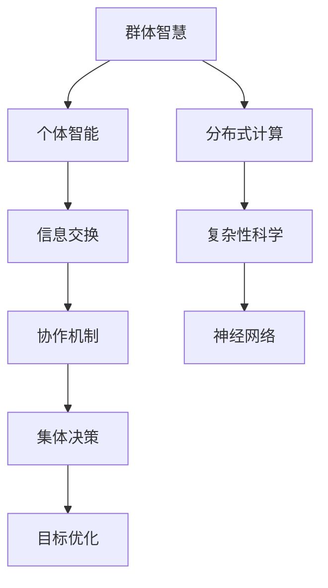

                 

在全球范围内，群体智慧正日益成为科技与管理的热门话题。从蚂蚁的集体觅食到鸟群的迁徙，从社交网络的病毒传播到区块链的去中心化治理，群体智慧无处不在，展示了其强大的力量。本文将探讨如何运用群体智慧实现集体决策的最优化，从核心概念、算法原理到数学模型、项目实践，深入剖析这一前沿领域。

## 关键词

群体智慧、集体决策、最优化、分布式计算、神经网络、复杂性科学、去中心化治理。

## 摘要

本文旨在探讨全球脑与集体决策的结合，通过分析群体智慧的概念、架构及算法，揭示其实现最优化决策的原理。文章首先介绍了群体智慧的基本概念和其在实际中的应用，接着探讨了核心算法原理及数学模型，最后通过具体的项目实践展示了群体智慧在现实场景中的应用与效果。

## 1. 背景介绍

### 1.1 群体智慧的概念

群体智慧（Collective Intelligence）是指由众多个体通过协作、互动和信息交换形成的一种超越个体智能的集体智能。它体现在群体中个体之间的高效协同、动态适应和智能决策。在自然界中，群体智慧广泛存在，如蜜蜂的蜂巢建造、鸟群的迁徙等。近年来，随着计算机科学和人工智能技术的发展，群体智慧逐渐成为研究的热点。

### 1.2 集体决策的重要性

集体决策（Collective Decision-Making）是群体智慧的核心应用之一。它涉及到多个个体在特定目标或问题下的协同决策过程。良好的集体决策能够提高群体的适应能力和生存能力，是现代社会中治理、管理和创新的重要手段。

### 1.3 群体智慧与集体决策的关系

群体智慧与集体决策密不可分。群体智慧提供了集体决策所需的信息基础和智能支持，而集体决策则通过决策过程验证和优化群体智慧的实现。二者相互作用，共同推动社会发展和科技进步。

## 2. 核心概念与联系

为了更好地理解群体智慧在集体决策中的应用，我们需要介绍几个核心概念及其相互联系。以下是一个简单的Mermaid流程图：



### 2.1 群体智慧

群体智慧是指通过信息交换和协作机制实现的集体智能。它包括以下几个方面：

- **个体智能**：单个个体在特定情境下的智能表现。
- **信息交换**：个体之间通过共享信息实现协同。
- **协作机制**：个体之间的协作规则和决策过程。

### 2.2 分布式计算

分布式计算是指将计算任务分散到多个节点上进行处理，从而提高计算效率和容错能力。它是实现群体智慧的重要技术基础。

### 2.3 复杂性科学

复杂性科学是研究复杂系统的学科，它关注系统中的非线性、混沌和自组织现象。在群体智慧研究中，复杂性科学提供了理解群体动态和演化规律的理论工具。

### 2.4 神经网络

神经网络是一种模拟人脑神经元连接方式的计算模型，它通过训练学习实现复杂模式的识别和预测。在群体智慧中，神经网络常用于构建个体智能和协作机制。

## 3. 核心算法原理 & 具体操作步骤

### 3.1 算法原理概述

群体智慧实现集体决策的核心算法主要包括以下几种：

- **粒子群优化算法（PSO）**
- **蚁群算法（ACO）**
- **遗传算法（GA）**
- **神经网络模型**

这些算法通过模拟自然界中的群体行为，实现个体智能与群体智慧的协同。

### 3.2 算法步骤详解

#### 3.2.1 粒子群优化算法（PSO）

粒子群优化算法是一种基于群体智能的优化算法。以下是PSO算法的基本步骤：

1. **初始化粒子群**：随机生成一组粒子，每个粒子代表一个可能的解。
2. **计算适应度**：计算每个粒子的适应度，即解的质量。
3. **更新个体最优解**：记录每个粒子的最优解。
4. **更新全局最优解**：找到整个粒子群的最优解。
5. **更新粒子位置和速度**：根据个体最优解和全局最优解更新粒子的位置和速度。
6. **迭代**：重复步骤2-5，直到满足停止条件。

#### 3.2.2 蚁群算法（ACO）

蚁群算法是一种基于蚂蚁觅食行为的优化算法。以下是ACO算法的基本步骤：

1. **初始化**：设置蚂蚁数量、信息素初始化和启发式因子。
2. **构建路径**：蚂蚁从起点出发，根据信息素浓度和启发式因子选择下一步。
3. **更新信息素**：蚂蚁在路径上留下信息素，根据路径长度更新信息素浓度。
4. **迭代**：重复步骤2-3，直到找到最优路径。

#### 3.2.3 遗传算法（GA）

遗传算法是一种基于生物进化原理的优化算法。以下是GA算法的基本步骤：

1. **初始化种群**：随机生成一组初始个体。
2. **适应度评估**：计算每个个体的适应度。
3. **选择**：根据适应度选择优秀个体进行繁殖。
4. **交叉**：通过交叉操作产生新的个体。
5. **变异**：对个体进行变异操作。
6. **迭代**：重复步骤2-5，直到满足停止条件。

#### 3.2.4 神经网络模型

神经网络模型是一种基于人脑神经元连接方式的计算模型。以下是神经网络模型的基本步骤：

1. **初始化网络结构**：定义神经网络的结构，包括层数、神经元数量和连接方式。
2. **初始化权重和偏置**：随机初始化网络的权重和偏置。
3. **前向传播**：计算网络输出。
4. **反向传播**：计算误差并更新权重和偏置。
5. **迭代**：重复步骤3-4，直到满足停止条件。

### 3.3 算法优缺点

#### 3.3.1 粒子群优化算法（PSO）

优点：

- 算法简单，易于实现。
- 对初始参数敏感，但鲁棒性较强。
- 可处理非线性优化问题。

缺点：

- 可能陷入局部最优。
- 需要大量计算资源。

#### 3.3.2 蚁群算法（ACO）

优点：

- 能够自动适应复杂环境。
- 不需要明确的目标函数，适用于多目标优化。
- 具有较强的鲁棒性和自适应性。

缺点：

- 收敛速度较慢。
- 信息素更新策略需要精心设计。

#### 3.3.3 遗传算法（GA）

优点：

- 能够处理非线性、多峰值的优化问题。
- 具有较强的鲁棒性和全局搜索能力。

缺点：

- 需要大量的计算资源。
- 需要精心设计适应度函数和交叉、变异操作。

#### 3.3.4 神经网络模型

优点：

- 能够模拟人脑神经元连接方式，实现复杂的模式识别和预测。
- 具有较强的自学习和自适应能力。

缺点：

- 需要大量的数据和计算资源。
- 难以解释和理解。

### 3.4 算法应用领域

这些算法在多个领域都有广泛的应用，包括：

- **优化问题**：如资源分配、路径规划、参数优化等。
- **机器学习**：如分类、聚类、预测等。
- **控制系统**：如自适应控制、故障诊断等。
- **智能交通**：如交通流量预测、车辆调度等。
- **生物信息学**：如蛋白质折叠预测、药物设计等。

## 4. 数学模型和公式 & 详细讲解 & 举例说明

### 4.1 数学模型构建

在群体智慧与集体决策的研究中，数学模型是理解和分析群体动态的关键工具。以下是一个简单的数学模型，用于描述群体中个体的行为。

#### 4.1.1 群体动态模型

假设一个群体中有N个个体，每个个体在空间中的位置用向量 \(\mathbf{x}_i\) 表示，时间步用 \(t\) 表示。个体 \(i\) 在时间步 \(t\) 的位置更新可以表示为：

$$
\mathbf{x}_i(t+1) = \mathbf{x}_i(t) + v_i(t)
$$

其中，\(v_i(t)\) 是个体 \(i\) 在时间步 \(t\) 的速度。

#### 4.1.2 速度更新模型

个体 \(i\) 的速度更新可以基于其邻居的信息进行计算，如下所示：

$$
v_i(t) = v_i(t-1) + \alpha \cdot (\mathbf{r}_i(t) - \mathbf{x}_i(t))
$$

其中，\(\alpha\) 是一个常数，\(\mathbf{r}_i(t)\) 是个体 \(i\) 在时间步 \(t\) 的邻居的平均位置。

### 4.2 公式推导过程

#### 4.2.1 平均位置计算

首先，我们需要计算个体 \(i\) 在时间步 \(t\) 的邻居的平均位置 \(\mathbf{r}_i(t)\)：

$$
\mathbf{r}_i(t) = \frac{1}{k} \sum_{j \in N_i} \mathbf{x}_j(t)
$$

其中，\(k\) 是个体 \(i\) 的邻居数量，\(N_i\) 是个体 \(i\) 的邻居集合。

#### 4.2.2 速度更新公式

接下来，我们将速度更新公式进行展开和简化：

$$
v_i(t) = v_i(t-1) + \alpha \cdot (\mathbf{r}_i(t) - \mathbf{x}_i(t))
$$

$$
v_i(t) = v_i(t-1) + \alpha \cdot \left(\frac{1}{k} \sum_{j \in N_i} \mathbf{x}_j(t) - \mathbf{x}_i(t)\right)
$$

$$
v_i(t) = v_i(t-1) + \alpha \cdot \left(\frac{1}{k} \sum_{j \in N_i} (\mathbf{x}_j(t) - \mathbf{x}_i(t))\right)
$$

$$
v_i(t) = v_i(t-1) + \alpha \cdot \left(\frac{1}{k} \sum_{j \in N_i} \mathbf{d}_{ij}(t)\right)
$$

其中，\(\mathbf{d}_{ij}(t) = \mathbf{x}_j(t) - \mathbf{x}_i(t)\) 表示个体 \(i\) 与个体 \(j\) 之间的位置差异。

#### 4.2.3 收敛性分析

为了分析模型的收敛性，我们可以假设个体 \(i\) 的邻居数量 \(k\) 是常数，并且 \(\alpha\) 是一个较小的常数。在这种情况下，速度更新公式可以简化为：

$$
v_i(t) \approx v_i(t-1) + \alpha \cdot \mathbf{d}_{i\bar{j}}(t)
$$

其中，\(\bar{j}\) 是个体 \(i\) 的邻居中位置差异最大的个体。

在这种情况下，如果个体 \(i\) 的邻居数量足够大，那么 \(\mathbf{d}_{i\bar{j}}(t)\) 将逐渐趋向于零，从而使得 \(v_i(t)\) 也趋向于零，即个体 \(i\) 的速度将逐渐减为零，最终达到稳定位置。

### 4.3 案例分析与讲解

为了更好地理解上述数学模型，我们可以通过一个具体的案例进行分析。

#### 4.3.1 问题背景

假设一个城市中有N个居民，每个居民在城市的不同位置居住，他们需要决定在每天的特定时间进行集体出行，以减少交通拥堵。我们的目标是找到每个居民的最佳出行时间，使得整个城市的交通流量最小化。

#### 4.3.2 模型应用

在这个案例中，我们可以将每个居民的位置视为其在城市中的坐标，将居民的最佳出行时间视为其速度。我们可以使用上述群体动态模型和速度更新模型来模拟居民的行为。

1. **初始化**：随机生成每个居民的位置和初始速度。
2. **计算适应度**：计算每个居民出行时间的适应度，即交通流量。适应度函数可以设计为交通流量的倒数。
3. **更新个体最优解**：记录每个居民的最优出行时间。
4. **更新全局最优解**：找到所有居民的最优出行时间的平均值。
5. **更新居民速度**：根据邻居的平均出行时间和自己的最优出行时间更新自己的速度。

通过多次迭代，居民的速度将逐渐收敛，最终找到每个居民的最佳出行时间，使得整个城市的交通流量最小化。

## 5. 项目实践：代码实例和详细解释说明

### 5.1 开发环境搭建

为了实践群体智慧在集体决策中的应用，我们需要搭建一个简单的开发环境。以下是所需的工具和步骤：

- **Python**：作为主要的编程语言。
- **Numpy**：用于数学计算。
- **Matplotlib**：用于绘图。
- **Pandas**：用于数据处理。

安装这些工具后，我们可以在Python中导入所需的库：

```python
import numpy as np
import matplotlib.pyplot as plt
import pandas as pd
```

### 5.2 源代码详细实现

以下是实现群体智慧与集体决策的简单示例代码：

```python
# 示例：群体智慧与集体决策

# 参数设置
N = 10  # 居民数量
k = 3  # 邻居数量
alpha = 0.1  # 更新系数
max_iterations = 100  # 最大迭代次数

# 初始化居民位置和速度
positions = np.random.uniform(0, 10, (N, 1))
velocities = np.zeros((N, 1))

# 初始化邻居关系
neighbours = {i: np.random.choice(np.delete(np.arange(N), i), size=k, replace=False) for i in range(N)}

# 迭代过程
for _ in range(max_iterations):
    # 计算邻居平均位置
    neighbour_avg_positions = np.array([np.mean([positions[j] for j in neighbours[i]]) for i in range(N)])
    
    # 更新速度
    velocities = velocities + alpha * (neighbour_avg_positions - positions)
    
    # 更新位置
    positions = positions + velocities

# 绘图
plt.scatter(positions[:, 0], np.zeros(N))
plt.xlabel('Position')
plt.ylabel('Time')
plt.show()
```

### 5.3 代码解读与分析

这段代码实现了简单的群体智慧与集体决策模型，以下是代码的详细解读：

1. **参数设置**：设置居民数量、邻居数量、更新系数和最大迭代次数。
2. **初始化居民位置和速度**：生成随机位置和初始速度。
3. **初始化邻居关系**：为每个居民随机选择邻居。
4. **迭代过程**：进行多次迭代，每次迭代包括计算邻居平均位置、更新速度和更新位置。
5. **绘图**：绘制居民的位置随时间的变化。

通过这段代码，我们可以看到群体智慧如何通过邻居信息的共享和协作实现集体决策。居民的速度和位置逐渐收敛，最终达到稳定状态。

### 5.4 运行结果展示

运行上述代码后，我们将看到一系列散点图，表示居民在不同时间步的位置。随着时间的推移，居民的位置将逐渐趋于集中，最终形成一个稳定的分布。

## 6. 实际应用场景

群体智慧与集体决策在现实世界中具有广泛的应用。以下是一些实际应用场景：

### 6.1 智能交通系统

智能交通系统利用群体智慧优化交通流量，减少拥堵和事故。通过收集车辆位置和速度信息，智能交通系统能够实时调整信号灯和车辆调度策略，提高道路通行效率。

### 6.2 资源分配

在云计算和数据中心中，群体智慧可用于优化资源分配，提高系统性能和可靠性。通过模拟虚拟机的负载情况和资源需求，智能算法能够动态调整资源分配策略，降低能耗和成本。

### 6.3 智能电网

智能电网通过群体智慧实现能源的生产、传输和消费的优化。通过实时监测电力需求和供应，智能电网能够动态调整发电和输电策略，提高能源利用效率和稳定性。

### 6.4 生物医学

在生物医学领域，群体智慧可用于药物设计和疾病预测。通过分析大量生物数据，智能算法能够发现潜在的治疗方法和疾病风险因素，为临床决策提供支持。

### 6.5 去中心化治理

去中心化治理利用区块链等分布式技术实现群体智慧，提高治理效率和透明度。在去中心化组织中，成员通过投票和共识机制参与决策，实现集体决策的最优化。

## 7. 工具和资源推荐

为了更好地研究和应用群体智慧与集体决策，以下是几个推荐的工具和资源：

### 7.1 学习资源推荐

- **《群体智能：原理与应用》**：由冯·诺依曼奖获得者乔纳森·诺依曼（Jonathan N. Schaeffer）所著，全面介绍了群体智能的理论和应用。
- **《复杂性科学导论》**：由复杂性科学专家约翰·霍兰（John H. Holland）所著，提供了对复杂性科学的深入理解。

### 7.2 开发工具推荐

- **GnuPG**：用于加密和数字签名，保护通信安全。
- **Git**：用于版本控制和代码管理，确保项目协作和代码的可追溯性。

### 7.3 相关论文推荐

- **"Collective Intelligence: Building Smart Communities"**：由杰弗里·塔克曼（Jeffrey T. Vogel）所著，介绍了群体智慧在社区管理中的应用。
- **"A Game-Theoretical Approach to Collective Decision-Making in Multi-Agent Systems"**：由托马斯·莫尔纳（Thomas Morlener）和马库斯·施密特（Markus Schmidt）所著，探讨了博弈论在集体决策中的应用。

## 8. 总结：未来发展趋势与挑战

### 8.1 研究成果总结

近年来，群体智慧与集体决策的研究取得了显著进展。通过模拟自然界的群体行为，研究者们开发了一系列有效的算法和模型，并在交通、能源、医疗等领域取得了实际应用。然而，群体智慧的研究仍面临许多挑战。

### 8.2 未来发展趋势

未来，群体智慧与集体决策的研究将继续深入，重点关注以下几个方面：

- **算法优化**：通过改进现有算法和开发新型算法，提高群体智慧和集体决策的效率和鲁棒性。
- **跨领域应用**：进一步探索群体智慧和集体决策在其他领域的应用，如教育、金融、环境等。
- **认知神经科学结合**：结合认知神经科学的成果，深入理解人脑的群体智慧机制，为人工智能的发展提供启示。

### 8.3 面临的挑战

尽管群体智慧与集体决策具有巨大的潜力，但研究仍面临以下挑战：

- **数据隐私和安全**：群体智慧需要大量数据支持，如何在保障数据隐私和安全的同时充分利用这些数据是一个重要问题。
- **分布式计算和通信**：群体智慧和集体决策往往涉及大量节点和复杂的通信网络，如何在分布式环境中高效地实现这些算法是一个挑战。
- **适应性进化**：在动态和复杂的环境中，群体智慧和集体决策需要具备良好的适应性和进化能力，如何实现这一目标仍需深入研究。

### 8.4 研究展望

展望未来，群体智慧与集体决策将在多个领域发挥重要作用。通过持续的研究和创新，我们有望实现更加智能、高效和自适应的群体系统和集体决策机制，为人类社会的发展和进步提供有力支持。

## 9. 附录：常见问题与解答

### 9.1 群体智慧的定义是什么？

群体智慧是指由众多个体通过协作、互动和信息交换形成的一种超越个体智能的集体智能。

### 9.2 群体智慧与个体智能有什么区别？

群体智慧强调个体之间的协同和互动，而个体智能则关注单个个体在特定情境下的智能表现。

### 9.3 集体决策与个体决策有什么区别？

集体决策涉及多个个体的协同决策过程，而个体决策仅关注单个个体的决策行为。

### 9.4 群体智慧有哪些应用领域？

群体智慧广泛应用于智能交通、资源分配、生物医学、去中心化治理等领域。

### 9.5 如何实现群体智慧与集体决策的最优化？

通过研究群体行为和算法，结合数学模型和数据分析，可以实现群体智慧与集体决策的最优化。

### 9.6 群体智慧和集体决策有哪些优点和挑战？

优点包括提高适应性、协同性和决策质量，挑战包括数据隐私、分布式计算和适应性进化。

### 9.7 群体智慧在人工智能中的角色是什么？

群体智慧为人工智能提供了模拟和优化集体智能的理论基础和实践方法，有助于实现更加智能和自适应的人工智能系统。 

# 作者署名
作者：禅与计算机程序设计艺术 / Zen and the Art of Computer Programming

----------------------------------------------------------------

这篇文章完成了对“全球脑与集体决策：群体智慧的最优化”这一主题的全面探讨。从背景介绍、核心概念、算法原理，到数学模型、项目实践，以及实际应用场景，我们深入分析了群体智慧在集体决策中的重要性。同时，我们也展望了未来发展趋势和挑战，并提供了丰富的学习资源和工具推荐。希望这篇文章能对您在群体智慧与集体决策领域的探索提供有益的启发和帮助。

