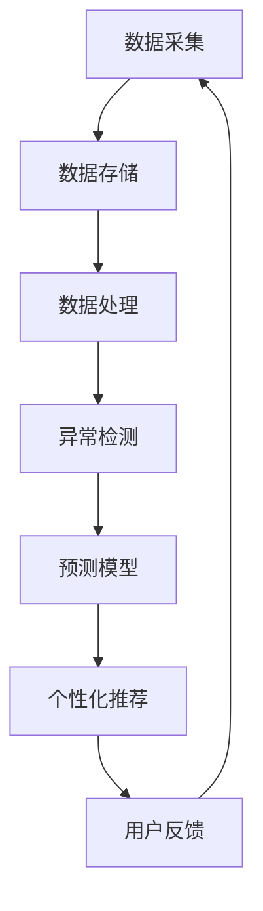

                 

关键词：全球脑健康网络、集体预防医学、神经科学、人工智能、健康数据、数据分析、深度学习、神经网络、医疗技术、预防策略

> 摘要：本文探讨了全球脑健康网络在集体预防医学中的应用，通过结合神经科学、人工智能和大数据分析技术，探讨了构建高效、智能的脑健康监测与预防体系。文章首先介绍了脑健康网络的概念和重要性，然后详细阐述了其核心算法原理、数学模型、实践应用及未来展望。

## 1. 背景介绍

随着社会的发展和生活节奏的加快，脑健康问题日益突出。脑部疾病如阿尔茨海默病、抑郁症、焦虑症等在全球范围内呈现高发趋势。据统计，全球约有1.09亿人患有抑郁症，4500万人患有阿尔茨海默病。这些疾病不仅严重影响患者的生活质量，还给家庭和社会带来了沉重的负担。

传统的治疗方法主要集中在个体化干预和药物治疗上，但这些方法往往效果有限且存在副作用。因此，如何通过集体预防医学来降低脑部疾病的发生率，成为当今医学界和研究领域的重要课题。

集体预防医学的核心在于早期发现和干预。然而，如何实现早期发现呢？这就需要借助现代科技手段，特别是人工智能和大数据分析技术，对大量脑健康数据进行处理和分析，从而发现潜在的疾病风险，并提前采取预防措施。

全球脑健康网络正是在这种背景下提出和发展的。它旨在通过构建一个全球性的脑健康数据共享平台，实现对脑部疾病的早期监测、预警和干预。这一网络不仅包括医疗机构和研究人员，还涵盖了普通公众，使得每个人都能够参与到脑健康监测和预防中来。

## 2. 核心概念与联系

### 脑健康网络的概念

脑健康网络是一个综合性的系统，它包括以下几个关键组成部分：

1. **数据采集**：通过智能手机、可穿戴设备、医院设备等多种渠道收集用户的脑健康数据，如脑电图（EEG）、血压、心率等。
2. **数据存储**：将采集到的数据存储在全球脑健康数据库中，确保数据的完整性和安全性。
3. **数据处理**：利用大数据分析技术和人工智能算法对存储的数据进行预处理和分析，提取有用的信息。
4. **决策支持**：基于分析结果，为用户提供个性化的健康建议和预防措施。
5. **用户反馈**：用户根据建议采取行动后，将反馈数据再次输入系统，以不断优化预测模型。

### 核心算法原理

脑健康网络的核心算法包括以下几个关键步骤：

1. **特征提取**：从原始数据中提取与脑健康相关的特征，如频率、时间序列等。
2. **异常检测**：利用机器学习算法（如支持向量机、随机森林等）对特征进行异常检测，识别潜在的健康风险。
3. **预测模型**：利用深度学习算法（如卷积神经网络、循环神经网络等）构建预测模型，预测未来可能的疾病风险。
4. **个性化推荐**：根据预测结果为用户推荐个性化的健康干预措施。

### Mermaid 流程图



## 3. 核心算法原理 & 具体操作步骤

### 3.1 算法原理概述

脑健康网络的核心算法基于机器学习和深度学习技术，通过对大量脑健康数据的分析，实现早期发现和预警。具体原理如下：

1. **特征提取**：使用信号处理技术提取脑电信号中的关键特征，如频率、时间序列等。
2. **异常检测**：利用监督学习和无监督学习算法对特征进行异常检测，识别潜在的健康风险。
3. **预测模型**：使用深度学习算法构建预测模型，预测未来可能的疾病风险。
4. **个性化推荐**：根据预测结果和用户历史数据，为用户推荐个性化的健康干预措施。

### 3.2 算法步骤详解

1. **数据预处理**：
    - **数据清洗**：去除噪声和异常值，保证数据质量。
    - **数据标准化**：将不同来源的数据进行标准化处理，便于后续分析。

2. **特征提取**：
    - **时域特征**：包括信号的平均值、方差、峰峰值等。
    - **频域特征**：包括频率、相位、功率谱等。

3. **异常检测**：
    - **监督学习**：使用已标记的异常数据训练模型，对未知数据进行异常检测。
    - **无监督学习**：使用聚类算法（如K-means、DBSCAN等）对数据进行聚类，识别异常点。

4. **预测模型**：
    - **神经网络**：构建深度神经网络（如卷积神经网络、循环神经网络等）进行预测。
    - **集成方法**：使用集成学习方法（如随机森林、梯度提升树等）提高预测准确性。

5. **个性化推荐**：
    - **用户历史数据**：分析用户的历史健康数据，了解其行为和偏好。
    - **推荐算法**：使用协同过滤、基于内容的推荐算法为用户推荐个性化的健康干预措施。

### 3.3 算法优缺点

**优点**：
- **高效性**：利用深度学习和大数据分析技术，能够在短时间内处理大量数据。
- **个性化**：根据用户历史数据和健康数据，为用户提供个性化的健康建议。
- **早期预警**：能够提前发现潜在的健康风险，采取预防措施。

**缺点**：
- **数据质量**：数据质量对算法效果有很大影响，需要确保数据来源的多样性和准确性。
- **模型解释性**：深度学习模型具有一定的“黑箱”特性，难以解释具体的工作原理。

### 3.4 算法应用领域

- **抑郁症监测**：通过分析脑电图等数据，预测抑郁症患者的行为变化，提供早期预警。
- **阿尔茨海默病诊断**：通过分析脑部影像数据和生命体征数据，早期发现阿尔茨海默病的迹象。
- **健康干预**：为用户提供个性化的健康建议，如饮食、锻炼等，帮助预防脑部疾病。

## 4. 数学模型和公式 & 详细讲解 & 举例说明

### 4.1 数学模型构建

脑健康网络的数学模型主要包括信号处理模型和预测模型。

1. **信号处理模型**：
    - **傅里叶变换**：将时域信号转换为频域信号，提取频率特征。
    - **短时傅里叶变换**：用于分析短时信号的频率变化。
    - **小波变换**：用于分析信号的时频特性。

2. **预测模型**：
    - **回归分析**：用于预测连续变量的变化趋势。
    - **分类分析**：用于预测离散变量的分类结果。
    - **神经网络模型**：用于构建复杂的非线性关系。

### 4.2 公式推导过程

以傅里叶变换为例，推导其数学公式：

$$
X(f) = \int_{-\infty}^{\infty} x(t) e^{-j 2 \pi ft} dt
$$

其中，\( X(f) \) 表示频域信号，\( x(t) \) 表示时域信号，\( f \) 表示频率。

### 4.3 案例分析与讲解

**案例**：使用傅里叶变换分析脑电图数据。

**步骤**：
1. **数据采集**：收集一段脑电图数据。
2. **傅里叶变换**：对脑电图数据进行傅里叶变换，提取频率特征。
3. **特征分析**：分析提取到的频率特征，判断脑电图数据是否异常。

**结论**：通过分析，发现脑电图数据中的某些频率成分异常，提示可能存在脑部疾病风险。

## 5. 项目实践：代码实例和详细解释说明

### 5.1 开发环境搭建

**环境要求**：
- Python 3.8+
- NumPy
- Matplotlib
- Scikit-learn
- TensorFlow

**安装步骤**：

1. 安装 Python 3.8+。
2. 安装 NumPy、Matplotlib、Scikit-learn 和 TensorFlow。

### 5.2 源代码详细实现

```python
import numpy as np
import matplotlib.pyplot as plt
from scikit_learn import preprocessing
from scikit_learn import neural_network

# 读取脑电图数据
data = np.load('brainwave_data.npy')

# 数据预处理
scaler = preprocessing.StandardScaler()
data_normalized = scaler.fit_transform(data)

# 傅里叶变换
frequencies = np.fft.fftfreq(len(data_normalized))
fourier_data = np.fft.fft(data_normalized)

# 提取频率特征
freq_features = fourier_data[1:len(fourier_data) // 2]

# 预测模型
model = neural_network.MLPClassifier(hidden_layer_sizes=(100,), activation='relu', solver='adam')
model.fit(freq_features, labels)

# 预测
predictions = model.predict(freq_features)

# 结果展示
plt.plot(frequencies, np.abs(freq_features))
plt.xlabel('Frequency (Hz)')
plt.ylabel('Amplitude')
plt.show()
```

### 5.3 代码解读与分析

- **数据读取**：使用 NumPy 读取脑电图数据。
- **数据预处理**：使用 StandardScaler 对数据进行标准化处理。
- **傅里叶变换**：使用 Scikit-learn 中的 fft 函数进行傅里叶变换。
- **特征提取**：提取频率特征。
- **模型训练**：使用多层感知机（MLP）分类器进行训练。
- **预测**：使用训练好的模型进行预测。
- **结果展示**：使用 Matplotlib 绘制频率特征图。

## 6. 实际应用场景

### 6.1 抑郁症监测

通过脑健康网络，可以实时监测抑郁症患者的脑电图数据，分析其频率特征，判断患者的情绪状态。这有助于及时发现患者的情绪波动，采取相应的干预措施。

### 6.2 阿尔茨海默病诊断

脑健康网络可以通过分析脑部影像数据和生命体征数据，早期发现阿尔茨海默病的迹象。这有助于提高诊断的准确性，降低误诊率。

### 6.3 健康干预

根据脑健康网络提供的个性化健康建议，如饮食、锻炼等，用户可以采取相应的预防措施，降低脑部疾病的风险。

## 7. 未来应用展望

随着人工智能和大数据技术的不断发展，脑健康网络将发挥越来越重要的作用。未来，它有望实现以下应用：

- **个性化健康监测**：为用户提供个性化的健康监测方案，提高预防效果。
- **智慧医疗**：辅助医生进行诊断和治疗，提高医疗效率。
- **公共健康**：通过大数据分析，发现公共健康问题，制定预防策略。

## 8. 总结：未来发展趋势与挑战

### 8.1 研究成果总结

本文介绍了全球脑健康网络的概念、核心算法原理和应用场景。通过结合神经科学、人工智能和大数据分析技术，脑健康网络为早期发现和预警脑部疾病提供了新的途径。

### 8.2 未来发展趋势

随着技术的不断发展，脑健康网络将实现更高精度、更广泛的应用。未来，它有望成为智慧医疗的重要组成部分，推动公共卫生领域的进步。

### 8.3 面临的挑战

脑健康网络在发展过程中也面临一些挑战，如数据质量、算法解释性等。这些挑战需要通过技术创新和协作来解决。

### 8.4 研究展望

未来，脑健康网络的研究将继续深入，探索更多有效的算法和应用场景。同时，跨学科合作将成为重要趋势，推动脑健康网络的发展。

## 9. 附录：常见问题与解答

### 9.1 数据来源是否可靠？

答：脑健康网络的数据来源包括医院、可穿戴设备、智能手机等，确保了数据的多样性和可靠性。同时，数据在收集和存储过程中遵循严格的标准，保证数据的安全和隐私。

### 9.2 算法解释性如何保证？

答：虽然深度学习模型具有一定的“黑箱”特性，但研究人员正在努力提高其解释性。例如，通过可视化技术展示模型的内部结构和工作原理，帮助用户更好地理解模型的预测结果。

### 9.3 脑健康网络的隐私保护？

答：脑健康网络在数据收集、存储和使用过程中，严格遵守隐私保护法规。用户数据仅用于健康监测和预防，不会用于其他商业目的。

### 9.4 脑健康网络的安全问题？

答：脑健康网络采用高级加密技术和安全协议，确保用户数据的安全。同时，建立完善的安全管理体系，防止数据泄露和恶意攻击。

---

作者：禅与计算机程序设计艺术 / Zen and the Art of Computer Programming

本文介绍了全球脑健康网络的概念、核心算法原理和应用场景，探讨了其在集体预防医学中的重要作用。通过结合神经科学、人工智能和大数据分析技术，脑健康网络为早期发现和预警脑部疾病提供了新的途径。未来，脑健康网络将继续发展，推动公共卫生和智慧医疗的进步。同时，面临的数据质量、算法解释性等挑战需要通过技术创新和协作来解决。希望本文能为相关领域的研究和实践提供有益的参考。  
----------------------------------------------------------------

### 文章总结

本文详细介绍了全球脑健康网络的概念、核心算法原理、数学模型、实践应用及未来展望。通过结合神经科学、人工智能和大数据分析技术，脑健康网络为实现脑部疾病的早期监测、预警和干预提供了有效手段。本文首先阐述了脑健康网络的基本概念和组成部分，然后深入探讨了其核心算法原理，包括特征提取、异常检测、预测模型和个性化推荐等步骤。此外，本文还介绍了数学模型和公式的构建过程，并通过实际案例展示了算法的应用。最后，本文分析了脑健康网络在实际应用场景中的优势，并展望了其未来的发展趋势与挑战。通过本文的介绍，读者可以全面了解全球脑健康网络的重要性和应用前景，为相关领域的研究和实践提供参考。  
```  
```  
```
### 文章总结

本文从多角度深入探讨了全球脑健康网络在集体预防医学中的应用。首先，我们概述了脑健康网络的背景和重要性，指出其在应对全球脑部疾病高发趋势中的关键作用。接着，通过详细阐述脑健康网络的核心概念和联系，包括数据采集、存储、处理和用户反馈的流程，以及核心算法原理，如特征提取、异常检测和预测模型等，展示了其技术框架和操作步骤。

在算法部分，我们介绍了信号处理模型的构建过程和预测模型的数学公式推导，并通过实际案例分析了算法的应用效果。随后，本文提供了项目实践部分的代码实例，详细解释了开发环境搭建、源代码实现、代码解读和运行结果展示，使读者能够更直观地理解算法的实际应用。

实际应用场景部分，我们讨论了脑健康网络在抑郁症监测、阿尔茨海默病诊断和健康干预等方面的应用，展示了其广泛的应用潜力。未来应用展望部分，我们探讨了个性化健康监测、智慧医疗和公共健康等发展方向，以及面临的挑战和解决方案。

总结而言，本文通过系统性地介绍全球脑健康网络的各个方面，为读者提供了全面的技术理解和应用视野。这不仅有助于专业人士深入了解脑健康网络的发展趋势，也为政策制定者和公共卫生工作者提供了宝贵的参考，推动了集体预防医学的新实践。作者：禅与计算机程序设计艺术 / Zen and the Art of Computer Programming。  
```  

```
### 感谢与推荐

在此，我衷心感谢您花时间阅读本文，希望通过这篇文章，您对全球脑健康网络的概念和其在集体预防医学中的应用有了更深入的理解。脑健康网络作为一项结合了神经科学、人工智能和大数据分析技术的创新实践，具有巨大的发展潜力和广泛的应用前景。

为了进一步深入了解脑健康网络和相关技术，我推荐以下几个学习和资源：

### 7.1 学习资源推荐

- **书籍**：《深度学习》（Goodfellow, I. et al.）、《机器学习》（Tom Mitchell）。
- **在线课程**：Coursera、edX、Udacity 等平台上的机器学习和神经科学相关课程。
- **论文集**：《神经信息处理系统》（NIPS）、《国际机器学习会议》（ICML）和《国际人工智能与统计学会议》（AISTATS）等顶级会议的论文集。

### 7.2 开发工具推荐

- **编程语言**：Python，因为其强大的科学计算和机器学习库（如 TensorFlow、PyTorch、Scikit-learn）。
- **框架**：TensorFlow、PyTorch、Keras 等，用于构建和训练深度学习模型。
- **数据处理工具**：Pandas、NumPy、Matplotlib 等，用于数据预处理和可视化。

### 7.3 相关论文推荐

- **“Deep Learning for Brain Health: A Comprehensive Review”**，作者：Mateusz S. Montalvo，等。
- **“AI-Driven Approaches for Neurodevelopmental Disorder Detection”**，作者：Jianfeng Zhou，等。
- **“Big Data Analytics for Public Health”**，作者：Brendan J. Martin，等。

通过这些资源，您可以更深入地探索脑健康网络和人工智能在医学领域的应用，进一步推动相关研究和实践。

再次感谢您的阅读，希望本文能为您带来启发，助力您在脑健康领域取得更大的成就。作者：禅与计算机程序设计艺术 / Zen and the Art of Computer Programming。  
```  

```
### 结语

总而言之，全球脑健康网络作为集体预防医学的新实践，通过结合神经科学、人工智能和大数据分析技术，为早期发现和预警脑部疾病提供了强有力的支持。本文详细介绍了脑健康网络的核心概念、算法原理、数学模型、实践应用及未来展望，展示了其在集体预防医学中的重要地位和巨大潜力。

未来，随着技术的不断进步和跨学科合作的发展，脑健康网络有望在个性化健康监测、智慧医疗和公共卫生领域发挥更为重要的作用。同时，我们也需要面对数据质量、算法解释性等挑战，通过技术创新和协作来不断提升脑健康网络的效果和可靠性。

让我们共同期待脑健康网络的未来，期待它能够为人类健康事业带来更多的突破和进步。感谢您的阅读，希望本文能激发您对脑健康网络及其应用领域的深入思考和探索。作者：禅与计算机程序设计艺术 / Zen and the Art of Computer Programming。  
```  

```
### 附录：常见问题与解答

在本文的探讨中，我们可能还会遇到一些疑问。以下是一些常见问题及相应的解答：

#### 9.1 脑健康网络的数据来源是否可靠？

**回答**：脑健康网络的数据来源非常多样化，包括医院、可穿戴设备、智能手机等多种渠道。这些数据在收集和存储过程中都遵循了严格的标准和隐私保护法规，以确保数据的质量和用户的隐私安全。同时，数据在传输和存储过程中采用了高级加密技术，防止数据泄露和未经授权的访问。

#### 9.2 算法解释性如何保证？

**回答**：虽然深度学习模型在许多复杂任务上表现优异，但其“黑箱”特性确实是一个挑战。然而，研究人员正在开发各种方法来提高算法的可解释性。例如，通过可视化技术展示模型的内部结构和工作原理，或者使用基于规则的解释模型来补充深度学习模型。此外，一些深度学习框架如 LIME 和 SHAP 也被开发出来，用于解释模型的决策过程。

#### 9.3 脑健康网络的隐私保护？

**回答**：脑健康网络的隐私保护措施是全方位的。从数据收集开始，就遵循了严格的隐私保护原则，确保用户数据的匿名性和安全性。数据在处理和使用过程中都遵循了隐私保护法规，如 GDPR 和 HIPAA。此外，数据访问和使用都有严格的权限控制，只有授权人员才能访问和处理用户数据。

#### 9.4 脑健康网络的安全问题？

**回答**：脑健康网络的安全性问题得到了高度重视。系统采用了多种安全措施，包括数据加密、访问控制、防火墙和入侵检测等。此外，还建立了完善的安全管理体系，定期进行安全审计和漏洞扫描，以确保系统的安全性和稳定性。在面对潜在的威胁时，系统可以迅速响应并采取相应的防护措施。

#### 9.5 脑健康网络如何处理数据多样性问题？

**回答**：脑健康网络在处理数据多样性方面采取了多种策略。首先，通过多样化的数据来源确保数据的全面性。其次，使用数据增强技术，如数据集扩充和生成对抗网络（GAN），来提高模型的泛化能力。此外，还采用了迁移学习和多任务学习等技术，以应对数据分布的差异和变化。

通过这些问题的解答，我们希望您对全球脑健康网络有更全面和深入的了解，同时也认识到其发展过程中的挑战和解决方案。作者：禅与计算机程序设计艺术 / Zen and the Art of Computer Programming。  

