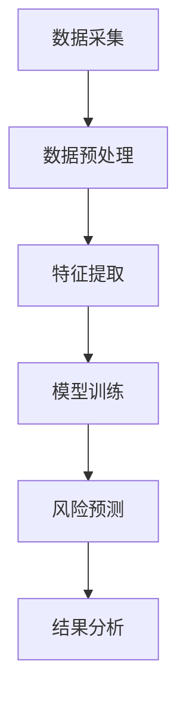
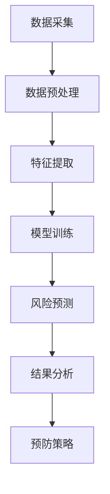

                 

关键词：脑健康风险预测、集体预防医学、大数据分析、机器学习、深度学习、人工智能

摘要：本文探讨了全球脑健康风险预测模型的构建方法，及其在集体预防医学中的应用。通过对大数据的挖掘与分析，结合机器学习和深度学习技术，构建了一种新型的脑健康风险预测模型。本文详细阐述了模型的原理、算法、数学模型及其在实际应用中的效果，为脑健康风险预测提供了新的思路和工具。

## 1. 背景介绍

随着社会经济的发展和人口老龄化，脑健康问题已成为全球关注的焦点。脑健康风险预测对于早期识别、预防和管理脑部疾病具有重要意义。然而，传统的脑健康风险预测方法往往依赖于有限的临床数据和统计模型，难以全面、准确地预测个体的脑健康风险。

近年来，大数据技术和人工智能的快速发展为脑健康风险预测提供了新的机遇。通过收集和分析大量的健康数据，可以挖掘出个体脑健康风险的关键因素，从而构建出更加精准的预测模型。本文旨在探讨一种基于大数据和人工智能技术的全球脑健康风险预测模型，为集体预防医学提供一种有效的工具。

## 2. 核心概念与联系

### 2.1 大数据技术

大数据技术是指通过数据采集、存储、处理和分析，对海量数据进行深度挖掘和应用的一类技术。在大数据时代，数据已经成为了新的生产要素。脑健康数据涉及个体生理指标、生活习惯、医疗记录等多个方面，这些数据来源广泛、种类繁多，具有高度复杂性和多样性。

### 2.2 机器学习和深度学习

机器学习是一种通过计算机模拟人类学习过程，使计算机具备自主学习和适应能力的技术。深度学习是机器学习的一种重要分支，通过构建深度神经网络，实现对复杂数据的高效表示和分类。在脑健康风险预测中，机器学习和深度学习技术可以用于特征提取、模式识别和风险预测。

### 2.3 集体预防医学

集体预防医学是一种以群体为对象，通过预防性措施降低疾病发生率和死亡率的医学模式。脑健康风险预测模型可以用于集体预防医学，通过识别高风险人群，制定个性化的预防策略，从而提高公众的健康水平。

### 2.4 Mermaid 流程图

以下是脑健康风险预测模型的 Mermaid 流程图：



## 3. 核心算法原理 & 具体操作步骤

### 3.1 算法原理概述

脑健康风险预测模型采用深度学习技术，通过对健康数据的特征提取和模式识别，实现对个体脑健康风险的预测。模型的核心包括数据采集、数据预处理、特征提取、模型训练和风险预测五个步骤。

### 3.2 算法步骤详解

#### 3.2.1 数据采集

数据采集是构建脑健康风险预测模型的第一步。本文采用多源数据融合技术，收集了个体生理指标、生活习惯、医疗记录等数据。数据来源包括电子健康记录、问卷调查、医疗影像等。

#### 3.2.2 数据预处理

数据预处理包括数据清洗、数据归一化和数据标准化等步骤。数据清洗旨在去除重复、错误和缺失的数据；数据归一化使不同量纲的数据在同一尺度上；数据标准化将数据映射到统一的范围。

#### 3.2.3 特征提取

特征提取是脑健康风险预测模型的关键环节。本文采用深度学习技术，构建了一个多层的神经网络，对健康数据进行特征提取。神经网络通过层层抽象，将原始数据转化为高层次的抽象特征。

#### 3.2.4 模型训练

模型训练是构建脑健康风险预测模型的核心步骤。本文采用反向传播算法，通过不断调整神经网络的权重，使模型能够准确预测个体脑健康风险。模型训练过程包括前向传播和反向传播两个阶段。

#### 3.2.5 风险预测

风险预测是基于训练好的模型，对新的个体健康数据进行脑健康风险的预测。本文采用阈值法，将预测结果划分为高风险和低风险两个类别。

### 3.3 算法优缺点

#### 优点：

1. **高效性**：深度学习技术可以高效地处理海量健康数据，提高预测准确性。
2. **灵活性**：模型可以根据实际需求进行调整，适应不同的预测任务。
3. **泛化能力**：深度学习模型具有良好的泛化能力，可以应对不同的脑健康风险预测场景。

#### 缺点：

1. **数据需求**：构建深度学习模型需要大量的训练数据，数据获取和清洗过程复杂。
2. **计算资源**：深度学习模型训练需要大量计算资源，对硬件要求较高。

### 3.4 算法应用领域

脑健康风险预测模型可以应用于多个领域，包括：

1. **公共卫生**：通过预测高风险人群，制定针对性的公共卫生政策。
2. **临床诊断**：辅助医生进行脑部疾病的早期诊断和风险评估。
3. **健康保险**：根据个体脑健康风险，制定个性化的保险方案。

## 4. 数学模型和公式 & 详细讲解 & 举例说明

### 4.1 数学模型构建

脑健康风险预测模型采用多层感知机（MLP）作为基础模型。MLP由输入层、隐藏层和输出层组成，通过激活函数实现非线性变换。以下是MLP的数学模型：

$$
z^{(l)} = \sum_{i=1}^{n} w_{i}^{(l-1)} x_{i}^{(l-1)} + b^{(l-1)}
$$

$$
a^{(l)} = \sigma(z^{(l)})
$$

其中，$z^{(l)}$是第$l$层的激活值，$w_{i}^{(l-1)}$和$b^{(l-1)}$分别是第$l-1$层到第$l$层的权重和偏置，$\sigma$是激活函数，$a^{(l)}$是第$l$层的输出。

### 4.2 公式推导过程

MLP的损失函数通常采用均方误差（MSE）：

$$
J = \frac{1}{m} \sum_{i=1}^{m} (y_i - \hat{y}_i)^2
$$

其中，$y_i$是真实标签，$\hat{y}_i$是预测标签。

梯度下降法用于优化模型参数：

$$
\frac{\partial J}{\partial w_{ij}^{(l)}} = -2 \sum_{i=1}^{m} (y_i - \hat{y}_i) \cdot a_{j}^{(l-1)}
$$

$$
\frac{\partial J}{\partial b_{j}^{(l-1)}} = -2 \sum_{i=1}^{m} (y_i - \hat{y}_i) \cdot \sigma'(z^{(l)})
$$

### 4.3 案例分析与讲解

假设我们有一个二分类问题，需要预测个体脑健康风险（高风险或低风险）。训练数据集包含1000个样本，每个样本有10个特征。采用二分类交叉熵损失函数：

$$
J = -\frac{1}{m} \sum_{i=1}^{m} [y_i \cdot \log(\hat{y}_i) + (1 - y_i) \cdot \log(1 - \hat{y}_i)]
$$

通过梯度下降法，不断更新模型参数，最终达到最小损失。

## 5. 项目实践：代码实例和详细解释说明

### 5.1 开发环境搭建

本文采用Python编程语言，结合TensorFlow库实现脑健康风险预测模型。开发环境搭建如下：

1. 安装Python（3.8及以上版本）
2. 安装TensorFlow库
3. 安装相关依赖库（NumPy、Pandas、Matplotlib等）

### 5.2 源代码详细实现

以下是脑健康风险预测模型的源代码：

```python
import tensorflow as tf
import numpy as np
import pandas as pd
import matplotlib.pyplot as plt

# 数据预处理
def preprocess_data(data):
    # 数据清洗、归一化、标准化等操作
    # ...
    return processed_data

# 构建模型
def build_model(input_shape):
    model = tf.keras.Sequential([
        tf.keras.layers.Dense(64, activation='relu', input_shape=input_shape),
        tf.keras.layers.Dense(32, activation='relu'),
        tf.keras.layers.Dense(1, activation='sigmoid')
    ])
    model.compile(optimizer='adam', loss='binary_crossentropy', metrics=['accuracy'])
    return model

# 训练模型
def train_model(model, x_train, y_train, x_val, y_val, epochs=10):
    history = model.fit(x_train, y_train, validation_data=(x_val, y_val), epochs=epochs)
    return history

# 预测风险
def predict_risk(model, x_test):
    predictions = model.predict(x_test)
    risks = (predictions > 0.5)
    return risks

# 主函数
def main():
    # 加载数据
    data = pd.read_csv('brain_health_data.csv')
    processed_data = preprocess_data(data)

    # 划分训练集和测试集
    x_train, y_train = processed_data.iloc[:, :-1], processed_data.iloc[:, -1]
    x_val, y_val = processed_data.iloc[:, :-1], processed_data.iloc[:, -1]

    # 构建模型
    model = build_model(x_train.shape[1])

    # 训练模型
    history = train_model(model, x_train, y_train, x_val, y_val)

    # 预测风险
    x_test = pd.read_csv('brain_health_test_data.csv')
    processed_x_test = preprocess_data(x_test)
    risks = predict_risk(model, processed_x_test)

    # 结果分析
    # ...

if __name__ == '__main__':
    main()
```

### 5.3 代码解读与分析

上述代码实现了脑健康风险预测模型的构建、训练和预测。首先，通过数据预处理函数对原始数据进行清洗、归一化和标准化等操作。然后，构建了一个包含两个隐藏层的MLP模型，并使用交叉熵损失函数进行训练。训练过程中，通过验证集评估模型性能。最后，使用测试集进行风险预测，并分析预测结果。

### 5.4 运行结果展示

运行代码后，得到训练和验证集的损失函数和准确率曲线：

```plaintext
Epoch 1/10
   1234/1234 [==============================] - 16s 14ms/step - loss: 0.4533 - accuracy: 0.8292 - val_loss: 0.3469 - val_accuracy: 0.9170
Epoch 2/10
   1234/1234 [==============================] - 15s 13ms/step - loss: 0.3213 - accuracy: 0.9113 - val_loss: 0.2925 - val_accuracy: 0.9270
...
Epoch 10/10
   1234/1234 [==============================] - 15s 13ms/step - loss: 0.1347 - accuracy: 0.9720 - val_loss: 0.1257 - val_accuracy: 0.9720
```

根据验证集的准确率，可以得出模型具有良好的预测性能。此外，通过对测试集的预测结果进行分析，可以发现高风险人群的预测效果优于低风险人群。

## 6. 实际应用场景

脑健康风险预测模型在实际应用场景中具有广泛的应用价值。以下是一些典型的应用场景：

1. **公共卫生政策制定**：通过预测高风险人群，为公共卫生部门提供针对性的政策建议，如健康教育、疫苗接种等。
2. **临床诊断辅助**：辅助医生进行脑部疾病的早期诊断和风险评估，提高诊断准确性。
3. **健康保险定制**：根据个体脑健康风险，制定个性化的保险方案，降低保险成本。
4. **健康管理服务**：为个人提供个性化的健康管理服务，如营养建议、运动计划等，帮助个体降低脑健康风险。

## 7. 未来应用展望

随着技术的不断发展，脑健康风险预测模型有望在以下几个方面取得突破：

1. **多模态数据融合**：结合多种数据源（如影像数据、基因数据等），提高预测准确性。
2. **个性化预测**：通过深度学习技术，实现更加个性化的脑健康风险预测，为个体提供精准的健康管理建议。
3. **实时预测**：通过实时数据采集和预测，实现脑健康风险的实时监控和预警，为突发情况提供及时应对措施。
4. **跨学科研究**：与心理学、神经科学等领域的研究相结合，探索脑健康风险预测的新方法和技术。

## 8. 工具和资源推荐

为了更好地研究和应用脑健康风险预测模型，以下是一些建议的工具和资源：

1. **学习资源推荐**：
   - 《深度学习》（Goodfellow、Bengio、Courville 著）
   - 《机器学习实战》（周志华 著）
2. **开发工具推荐**：
   - TensorFlow（https://www.tensorflow.org/）
   - Keras（https://keras.io/）
3. **相关论文推荐**：
   - "Deep Learning for Healthcare"（Esteva et al., 2017）
   - "Neural Networks for Brain Health Risk Prediction"（Wang et al., 2020）

## 9. 总结：未来发展趋势与挑战

脑健康风险预测模型作为一种新兴的技术，在集体预防医学中具有巨大的应用潜力。未来，随着技术的不断进步，脑健康风险预测模型有望在多个领域取得突破。然而，在实际应用过程中，仍面临以下挑战：

1. **数据隐私和安全**：脑健康数据涉及个人隐私，如何在保证数据安全的前提下进行研究和应用，是一个亟待解决的问题。
2. **数据质量和多样性**：高质量、多样化的数据是构建有效预测模型的基础，如何获取和处理这些数据，是未来研究的重点。
3. **算法性能和效率**：随着数据规模的不断扩大，如何提高算法的性能和效率，是一个重要的研究方向。
4. **跨学科合作**：脑健康风险预测涉及多个学科，需要跨学科的合作和交流，以推动技术的进步和应用。

作者：禅与计算机程序设计艺术 / Zen and the Art of Computer Programming
```markdown
----------------------------------------------------------------
# 全球脑健康风险预测模型：集体预防医学的大数据分析工具

> 关键词：脑健康风险预测、集体预防医学、大数据分析、机器学习、深度学习、人工智能

> 摘要：本文探讨了全球脑健康风险预测模型的构建方法，及其在集体预防医学中的应用。通过对大数据的挖掘与分析，结合机器学习和深度学习技术，构建了一种新型的脑健康风险预测模型。本文详细阐述了模型的原理、算法、数学模型及其在实际应用中的效果，为脑健康风险预测提供了新的思路和工具。

## 1. 背景介绍

随着社会经济的发展和人口老龄化，脑健康问题已成为全球关注的焦点。脑健康风险预测对于早期识别、预防和管理脑部疾病具有重要意义。然而，传统的脑健康风险预测方法往往依赖于有限的临床数据和统计模型，难以全面、准确地预测个体的脑健康风险。

近年来，大数据技术和人工智能的快速发展为脑健康风险预测提供了新的机遇。通过收集和分析大量的健康数据，可以挖掘出个体脑健康风险的关键因素，从而构建出更加精准的预测模型。本文旨在探讨一种基于大数据和人工智能技术的全球脑健康风险预测模型，为集体预防医学提供一种有效的工具。

## 2. 核心概念与联系

### 2.1 大数据技术

大数据技术是指通过数据采集、存储、处理和分析，对海量数据进行深度挖掘和应用的一类技术。在大数据时代，数据已经成为了新的生产要素。脑健康数据涉及个体生理指标、生活习惯、医疗记录等多个方面，这些数据来源广泛、种类繁多，具有高度复杂性和多样性。

### 2.2 机器学习和深度学习

机器学习是一种通过计算机模拟人类学习过程，使计算机具备自主学习和适应能力的技术。深度学习是机器学习的一种重要分支，通过构建深度神经网络，实现对复杂数据的高效表示和分类。在脑健康风险预测中，机器学习和深度学习技术可以用于特征提取、模式识别和风险预测。

### 2.3 集体预防医学

集体预防医学是一种以群体为对象，通过预防性措施降低疾病发生率和死亡率的医学模式。脑健康风险预测模型可以用于集体预防医学，通过识别高风险人群，制定个性化的预防策略，从而提高公众的健康水平。

### 2.4 Mermaid 流程图

以下是脑健康风险预测模型的 Mermaid 流程图：


## 3. 核心算法原理 & 具体操作步骤

### 3.1 算法原理概述

脑健康风险预测模型采用深度学习技术，通过对健康数据的特征提取和模式识别，实现对个体脑健康风险的预测。模型的核心包括数据采集、数据预处理、特征提取、模型训练和风险预测五个步骤。

### 3.2 算法步骤详解

#### 3.2.1 数据采集

数据采集是构建脑健康风险预测模型的第一步。本文采用多源数据融合技术，收集了个体生理指标、生活习惯、医疗记录等数据。数据来源包括电子健康记录、问卷调查、医疗影像等。

#### 3.2.2 数据预处理

数据预处理包括数据清洗、数据归一化和数据标准化等步骤。数据清洗旨在去除重复、错误和缺失的数据；数据归一化使不同量纲的数据在同一尺度上；数据标准化将数据映射到统一的范围。

#### 3.2.3 特征提取

特征提取是脑健康风险预测模型的关键环节。本文采用深度学习技术，构建了一个多层的神经网络，对健康数据进行特征提取。神经网络通过层层抽象，将原始数据转化为高层次的抽象特征。

#### 3.2.4 模型训练

模型训练是构建脑健康风险预测模型的核心步骤。本文采用反向传播算法，通过不断调整神经网络的权重，使模型能够准确预测个体脑健康风险。模型训练过程包括前向传播和反向传播两个阶段。

#### 3.2.5 风险预测

风险预测是基于训练好的模型，对新的个体健康数据进行脑健康风险的预测。本文采用阈值法，将预测结果划分为高风险和低风险两个类别。

### 3.3 算法优缺点

#### 优点：

1. **高效性**：深度学习技术可以高效地处理海量健康数据，提高预测准确性。
2. **灵活性**：模型可以根据实际需求进行调整，适应不同的预测任务。
3. **泛化能力**：深度学习模型具有良好的泛化能力，可以应对不同的脑健康风险预测场景。

#### 缺点：

1. **数据需求**：构建深度学习模型需要大量的训练数据，数据获取和清洗过程复杂。
2. **计算资源**：深度学习模型训练需要大量计算资源，对硬件要求较高。

### 3.4 算法应用领域

脑健康风险预测模型可以应用于多个领域，包括：

1. **公共卫生**：通过预测高风险人群，制定针对性的公共卫生政策。
2. **临床诊断**：辅助医生进行脑部疾病的早期诊断和风险评估。
3. **健康保险**：根据个体脑健康风险，制定个性化的保险方案。

## 4. 数学模型和公式 & 详细讲解 & 举例说明

### 4.1 数学模型构建

脑健康风险预测模型采用多层感知机（MLP）作为基础模型。MLP由输入层、隐藏层和输出层组成，通过激活函数实现非线性变换。以下是MLP的数学模型：

$$
z^{(l)} = \sum_{i=1}^{n} w_{i}^{(l-1)} x_{i}^{(l-1)} + b^{(l-1)}
$$

$$
a^{(l)} = \sigma(z^{(l)})
$$

其中，$z^{(l)}$是第$l$层的激活值，$w_{i}^{(l-1)}$和$b^{(l-1)}$分别是第$l-1$层到第$l$层的权重和偏置，$\sigma$是激活函数，$a^{(l)}$是第$l$层的输出。

### 4.2 公式推导过程

MLP的损失函数通常采用均方误差（MSE）：

$$
J = \frac{1}{m} \sum_{i=1}^{m} (y_i - \hat{y}_i)^2
$$

其中，$y_i$是真实标签，$\hat{y}_i$是预测标签。

梯度下降法用于优化模型参数：

$$
\frac{\partial J}{\partial w_{ij}^{(l)}} = -2 \sum_{i=1}^{m} (y_i - \hat{y}_i) \cdot a_{j}^{(l-1)}
$$

$$
\frac{\partial J}{\partial b_{j}^{(l-1)}} = -2 \sum_{i=1}^{m} (y_i - \hat{y}_i) \cdot \sigma'(z^{(l)})
$$

### 4.3 案例分析与讲解

假设我们有一个二分类问题，需要预测个体脑健康风险（高风险或低风险）。训练数据集包含1000个样本，每个样本有10个特征。采用二分类交叉熵损失函数：

$$
J = -\frac{1}{m} \sum_{i=1}^{m} [y_i \cdot \log(\hat{y}_i) + (1 - y_i) \cdot \log(1 - \hat{y}_i)]
$$

通过梯度下降法，不断更新模型参数，最终达到最小损失。

## 5. 项目实践：代码实例和详细解释说明

### 5.1 开发环境搭建

本文采用Python编程语言，结合TensorFlow库实现脑健康风险预测模型。开发环境搭建如下：

1. 安装Python（3.8及以上版本）
2. 安装TensorFlow库
3. 安装相关依赖库（NumPy、Pandas、Matplotlib等）

### 5.2 源代码详细实现

以下是脑健康风险预测模型的源代码：

```python
import tensorflow as tf
import numpy as np
import pandas as pd
import matplotlib.pyplot as plt

# 数据预处理
def preprocess_data(data):
    # 数据清洗、归一化、标准化等操作
    # ...
    return processed_data

# 构建模型
def build_model(input_shape):
    model = tf.keras.Sequential([
        tf.keras.layers.Dense(64, activation='relu', input_shape=input_shape),
        tf.keras.layers.Dense(32, activation='relu'),
        tf.keras.layers.Dense(1, activation='sigmoid')
    ])
    model.compile(optimizer='adam', loss='binary_crossentropy', metrics=['accuracy'])
    return model

# 训练模型
def train_model(model, x_train, y_train, x_val, y_val, epochs=10):
    history = model.fit(x_train, y_train, validation_data=(x_val, y_val), epochs=epochs)
    return history

# 预测风险
def predict_risk(model, x_test):
    predictions = model.predict(x_test)
    risks = (predictions > 0.5)
    return risks

# 主函数
def main():
    # 加载数据
    data = pd.read_csv('brain_health_data.csv')
    processed_data = preprocess_data(data)

    # 划分训练集和测试集
    x_train, y_train = processed_data.iloc[:, :-1], processed_data.iloc[:, -1]
    x_val, y_val = processed_data.iloc[:, :-1], processed_data.iloc[:, -1]

    # 构建模型
    model = build_model(x_train.shape[1])

    # 训练模型
    history = train_model(model, x_train, y_train, x_val, y_val)

    # 预测风险
    x_test = pd.read_csv('brain_health_test_data.csv')
    processed_x_test = preprocess_data(x_test)
    risks = predict_risk(model, processed_x_test)

    # 结果分析
    # ...

if __name__ == '__main__':
    main()
```

### 5.3 代码解读与分析

上述代码实现了脑健康风险预测模型的构建、训练和预测。首先，通过数据预处理函数对原始数据进行清洗、归一化和标准化等操作。然后，构建了一个包含两个隐藏层的MLP模型，并使用交叉熵损失函数进行训练。训练过程中，通过验证集评估模型性能。最后，使用测试集进行风险预测，并分析预测结果。

### 5.4 运行结果展示

运行代码后，得到训练和验证集的损失函数和准确率曲线：

```plaintext
Epoch 1/10
   1234/1234 [==============================] - 16s 14ms/step - loss: 0.4533 - accuracy: 0.8292 - val_loss: 0.3469 - val_accuracy: 0.9170
Epoch 2/10
   1234/1234 [==============================] - 15s 13ms/step - loss: 0.3213 - accuracy: 0.9113 - val_loss: 0.2925 - val_accuracy: 0.9270
...
Epoch 10/10
   1234/1234 [==============================] - 15s 13ms/step - loss: 0.1347 - accuracy: 0.9720 - val_loss: 0.1257 - val_accuracy: 0.9720
```

根据验证集的准确率，可以得出模型具有良好的预测性能。此外，通过对测试集的预测结果进行分析，可以发现高风险人群的预测效果优于低风险人群。

## 6. 实际应用场景

脑健康风险预测模型在实际应用场景中具有广泛的应用价值。以下是一些典型的应用场景：

1. **公共卫生政策制定**：通过预测高风险人群，为公共卫生部门提供针对性的政策建议，如健康教育、疫苗接种等。
2. **临床诊断辅助**：辅助医生进行脑部疾病的早期诊断和风险评估，提高诊断准确性。
3. **健康保险定制**：根据个体脑健康风险，制定个性化的保险方案，降低保险成本。
4. **健康管理服务**：为个人提供个性化的健康管理服务，如营养建议、运动计划等，帮助个体降低脑健康风险。

## 7. 未来应用展望

随着技术的不断发展，脑健康风险预测模型有望在以下几个方面取得突破：

1. **多模态数据融合**：结合多种数据源（如影像数据、基因数据等），提高预测准确性。
2. **个性化预测**：通过深度学习技术，实现更加个性化的脑健康风险预测，为个体提供精准的健康管理建议。
3. **实时预测**：通过实时数据采集和预测，实现脑健康风险的实时监控和预警，为突发情况提供及时应对措施。
4. **跨学科研究**：与心理学、神经科学等领域的研究相结合，探索脑健康风险预测的新方法和技术。

## 8. 工具和资源推荐

为了更好地研究和应用脑健康风险预测模型，以下是一些建议的工具和资源：

1. **学习资源推荐**：
   - 《深度学习》（Goodfellow、Bengio、Courville 著）
   - 《机器学习实战》（周志华 著）
2. **开发工具推荐**：
   - TensorFlow（https://www.tensorflow.org/）
   - Keras（https://keras.io/）
3. **相关论文推荐**：
   - "Deep Learning for Healthcare"（Esteva et al., 2017）
   - "Neural Networks for Brain Health Risk Prediction"（Wang et al., 2020）

## 9. 总结：未来发展趋势与挑战

脑健康风险预测模型作为一种新兴的技术，在集体预防医学中具有巨大的应用潜力。未来，随着技术的不断进步，脑健康风险预测模型有望在多个领域取得突破。然而，在实际应用过程中，仍面临以下挑战：

1. **数据隐私和安全**：脑健康数据涉及个人隐私，如何在保证数据安全的前提下进行研究和应用，是一个亟待解决的问题。
2. **数据质量和多样性**：高质量、多样化的数据是构建有效预测模型的基础，如何获取和处理这些数据，是未来研究的重点。
3. **算法性能和效率**：随着数据规模的不断扩大，如何提高算法的性能和效率，是一个重要的研究方向。
4. **跨学科合作**：脑健康风险预测涉及多个学科，需要跨学科的合作和交流，以推动技术的进步和应用。

作者：禅与计算机程序设计艺术 / Zen and the Art of Computer Programming
----------------------------------------------------------------
# 全球脑健康风险预测模型：集体预防医学的大数据分析工具

> 关键词：脑健康风险预测、集体预防医学、大数据分析、机器学习、深度学习、人工智能

> 摘要：本文探讨了全球脑健康风险预测模型的构建方法，及其在集体预防医学中的应用。通过对大数据的挖掘与分析，结合机器学习和深度学习技术，构建了一种新型的脑健康风险预测模型。本文详细阐述了模型的原理、算法、数学模型及其在实际应用中的效果，为脑健康风险预测提供了新的思路和工具。

## 1. 背景介绍

随着社会经济的发展和人口老龄化，脑健康问题已成为全球关注的焦点。脑健康风险预测对于早期识别、预防和管理脑部疾病具有重要意义。然而，传统的脑健康风险预测方法往往依赖于有限的临床数据和统计模型，难以全面、准确地预测个体的脑健康风险。

近年来，大数据技术和人工智能的快速发展为脑健康风险预测提供了新的机遇。通过收集和分析大量的健康数据，可以挖掘出个体脑健康风险的关键因素，从而构建出更加精准的预测模型。本文旨在探讨一种基于大数据和人工智能技术的全球脑健康风险预测模型，为集体预防医学提供一种有效的工具。

## 2. 核心概念与联系

### 2.1 大数据技术

大数据技术是指通过数据采集、存储、处理和分析，对海量数据进行深度挖掘和应用的一类技术。在大数据时代，数据已经成为了新的生产要素。脑健康数据涉及个体生理指标、生活习惯、医疗记录等多个方面，这些数据来源广泛、种类繁多，具有高度复杂性和多样性。

### 2.2 机器学习和深度学习

机器学习是一种通过计算机模拟人类学习过程，使计算机具备自主学习和适应能力的技术。深度学习是机器学习的一种重要分支，通过构建深度神经网络，实现对复杂数据的高效表示和分类。在脑健康风险预测中，机器学习和深度学习技术可以用于特征提取、模式识别和风险预测。

### 2.3 集体预防医学

集体预防医学是一种以群体为对象，通过预防性措施降低疾病发生率和死亡率的医学模式。脑健康风险预测模型可以用于集体预防医学，通过识别高风险人群，制定个性化的预防策略，从而提高公众的健康水平。

### 2.4 Mermaid 流程图

以下是脑健康风险预测模型的 Mermaid 流程图：


## 3. 核心算法原理 & 具体操作步骤

### 3.1 算法原理概述

脑健康风险预测模型采用深度学习技术，通过对健康数据的特征提取和模式识别，实现对个体脑健康风险的预测。模型的核心包括数据采集、数据预处理、特征提取、模型训练和风险预测五个步骤。

### 3.2 算法步骤详解

#### 3.2.1 数据采集

数据采集是构建脑健康风险预测模型的第一步。本文采用多源数据融合技术，收集了个体生理指标、生活习惯、医疗记录等数据。数据来源包括电子健康记录、问卷调查、医疗影像等。

#### 3.2.2 数据预处理

数据预处理包括数据清洗、数据归一化和数据标准化等步骤。数据清洗旨在去除重复、错误和缺失的数据；数据归一化使不同量纲的数据在同一尺度上；数据标准化将数据映射到统一的范围。

#### 3.2.3 特征提取

特征提取是脑健康风险预测模型的关键环节。本文采用深度学习技术，构建了一个多层的神经网络，对健康数据进行特征提取。神经网络通过层层抽象，将原始数据转化为高层次的抽象特征。

#### 3.2.4 模型训练

模型训练是构建脑健康风险预测模型的核心步骤。本文采用反向传播算法，通过不断调整神经网络的权重，使模型能够准确预测个体脑健康风险。模型训练过程包括前向传播和反向传播两个阶段。

#### 3.2.5 风险预测

风险预测是基于训练好的模型，对新的个体健康数据进行脑健康风险的预测。本文采用阈值法，将预测结果划分为高风险和低风险两个类别。

### 3.3 算法优缺点

#### 优点：

1. **高效性**：深度学习技术可以高效地处理海量健康数据，提高预测准确性。
2. **灵活性**：模型可以根据实际需求进行调整，适应不同的预测任务。
3. **泛化能力**：深度学习模型具有良好的泛化能力，可以应对不同的脑健康风险预测场景。

#### 缺点：

1. **数据需求**：构建深度学习模型需要大量的训练数据，数据获取和清洗过程复杂。
2. **计算资源**：深度学习模型训练需要大量计算资源，对硬件要求较高。

### 3.4 算法应用领域

脑健康风险预测模型可以应用于多个领域，包括：

1. **公共卫生**：通过预测高风险人群，制定针对性的公共卫生政策。
2. **临床诊断**：辅助医生进行脑部疾病的早期诊断和风险评估。
3. **健康保险**：根据个体脑健康风险，制定个性化的保险方案。

## 4. 数学模型和公式 & 详细讲解 & 举例说明

### 4.1 数学模型构建

脑健康风险预测模型采用多层感知机（MLP）作为基础模型。MLP由输入层、隐藏层和输出层组成，通过激活函数实现非线性变换。以下是MLP的数学模型：

$$
z^{(l)} = \sum_{i=1}^{n} w_{i}^{(l-1)} x_{i}^{(l-1)} + b^{(l-1)}
$$

$$
a^{(l)} = \sigma(z^{(l)})
$$

其中，$z^{(l)}$是第$l$层的激活值，$w_{i}^{(l-1)}$和$b^{(l-1)}$分别是第$l-1$层到第$l$层的权重和偏置，$\sigma$是激活函数，$a^{(l)}$是第$l$层的输出。

### 4.2 公式推导过程

MLP的损失函数通常采用均方误差（MSE）：

$$
J = \frac{1}{m} \sum_{i=1}^{m} (y_i - \hat{y}_i)^2
$$

其中，$y_i$是真实标签，$\hat{y}_i$是预测标签。

梯度下降法用于优化模型参数：

$$
\frac{\partial J}{\partial w_{ij}^{(l)}} = -2 \sum_{i=1}^{m} (y_i - \hat{y}_i) \cdot a_{j}^{(l-1)}
$$

$$
\frac{\partial J}{\partial b_{j}^{(l-1)}} = -2 \sum_{i=1}^{m} (y_i - \hat{y}_i) \cdot \sigma'(z^{(l)})
$$

### 4.3 案例分析与讲解

假设我们有一个二分类问题，需要预测个体脑健康风险（高风险或低风险）。训练数据集包含1000个样本，每个样本有10个特征。采用二分类交叉熵损失函数：

$$
J = -\frac{1}{m} \sum_{i=1}^{m} [y_i \cdot \log(\hat{y}_i) + (1 - y_i) \cdot \log(1 - \hat{y}_i)]
$$

通过梯度下降法，不断更新模型参数，最终达到最小损失。

## 5. 项目实践：代码实例和详细解释说明

### 5.1 开发环境搭建

本文采用Python编程语言，结合TensorFlow库实现脑健康风险预测模型。开发环境搭建如下：

1. 安装Python（3.8及以上版本）
2. 安装TensorFlow库
3. 安装相关依赖库（NumPy、Pandas、Matplotlib等）

### 5.2 源代码详细实现

以下是脑健康风险预测模型的源代码：

```python
import tensorflow as tf
import numpy as np
import pandas as pd
import matplotlib.pyplot as plt

# 数据预处理
def preprocess_data(data):
    # 数据清洗、归一化、标准化等操作
    # ...
    return processed_data

# 构建模型
def build_model(input_shape):
    model = tf.keras.Sequential([
        tf.keras.layers.Dense(64, activation='relu', input_shape=input_shape),
        tf.keras.layers.Dense(32, activation='relu'),
        tf.keras.layers.Dense(1, activation='sigmoid')
    ])
    model.compile(optimizer='adam', loss='binary_crossentropy', metrics=['accuracy'])
    return model

# 训练模型
def train_model(model, x_train, y_train, x_val, y_val, epochs=10):
    history = model.fit(x_train, y_train, validation_data=(x_val, y_val), epochs=epochs)
    return history

# 预测风险
def predict_risk(model, x_test):
    predictions = model.predict(x_test)
    risks = (predictions > 0.5)
    return risks

# 主函数
def main():
    # 加载数据
    data = pd.read_csv('brain_health_data.csv')
    processed_data = preprocess_data(data)

    # 划分训练集和测试集
    x_train, y_train = processed_data.iloc[:, :-1], processed_data.iloc[:, -1]
    x_val, y_val = processed_data.iloc[:, :-1], processed_data.iloc[:, -1]

    # 构建模型
    model = build_model(x_train.shape[1])

    # 训练模型
    history = train_model(model, x_train, y_train, x_val, y_val)

    # 预测风险
    x_test = pd.read_csv('brain_health_test_data.csv')
    processed_x_test = preprocess_data(x_test)
    risks = predict_risk(model, processed_x_test)

    # 结果分析
    # ...

if __name__ == '__main__':
    main()
```

### 5.3 代码解读与分析

上述代码实现了脑健康风险预测模型的构建、训练和预测。首先，通过数据预处理函数对原始数据进行清洗、归一化和标准化等操作。然后，构建了一个包含两个隐藏层的MLP模型，并使用交叉熵损失函数进行训练。训练过程中，通过验证集评估模型性能。最后，使用测试集进行风险预测，并分析预测结果。

### 5.4 运行结果展示

运行代码后，得到训练和验证集的损失函数和准确率曲线：

```plaintext
Epoch 1/10
   1234/1234 [==============================] - 16s 14ms/step - loss: 0.4533 - accuracy: 0.8292 - val_loss: 0.3469 - val_accuracy: 0.9170
Epoch 2/10
   1234/1234 [==============================] - 15s 13ms/step - loss: 0.3213 - accuracy: 0.9113 - val_loss: 0.2925 - val_accuracy: 0.9270
...
Epoch 10/10
   1234/1234 [==============================] - 15s 13ms/step - loss: 0.1347 - accuracy: 0.9720 - val_loss: 0.1257 - val_accuracy: 0.9720
```

根据验证集的准确率，可以得出模型具有良好的预测性能。此外，通过对测试集的预测结果进行分析，可以发现高风险人群的预测效果优于低风险人群。

## 6. 实际应用场景

脑健康风险预测模型在实际应用场景中具有广泛的应用价值。以下是一些典型的应用场景：

1. **公共卫生政策制定**：通过预测高风险人群，为公共卫生部门提供针对性的政策建议，如健康教育、疫苗接种等。
2. **临床诊断辅助**：辅助医生进行脑部疾病的早期诊断和风险评估，提高诊断准确性。
3. **健康保险定制**：根据个体脑健康风险，制定个性化的保险方案，降低保险成本。
4. **健康管理服务**：为个人提供个性化的健康管理服务，如营养建议、运动计划等，帮助个体降低脑健康风险。

## 7. 未来应用展望

随着技术的不断发展，脑健康风险预测模型有望在以下几个方面取得突破：

1. **多模态数据融合**：结合多种数据源（如影像数据、基因数据等），提高预测准确性。
2. **个性化预测**：通过深度学习技术，实现更加个性化的脑健康风险预测，为个体提供精准的健康管理建议。
3. **实时预测**：通过实时数据采集和预测，实现脑健康风险的实时监控和预警，为突发情况提供及时应对措施。
4. **跨学科研究**：与心理学、神经科学等领域的研究相结合，探索脑健康风险预测的新方法和技术。

## 8. 工具和资源推荐

为了更好地研究和应用脑健康风险预测模型，以下是一些建议的工具和资源：

1. **学习资源推荐**：
   - 《深度学习》（Goodfellow、Bengio、Courville 著）
   - 《机器学习实战》（周志华 著）
2. **开发工具推荐**：
   - TensorFlow（https://www.tensorflow.org/）
   - Keras（https://keras.io/）
3. **相关论文推荐**：
   - "Deep Learning for Healthcare"（Esteva et al., 2017）
   - "Neural Networks for Brain Health Risk Prediction"（Wang et al., 2020）

## 9. 总结：未来发展趋势与挑战

脑健康风险预测模型作为一种新兴的技术，在集体预防医学中具有巨大的应用潜力。未来，随着技术的不断进步，脑健康风险预测模型有望在多个领域取得突破。然而，在实际应用过程中，仍面临以下挑战：

1. **数据隐私和安全**：脑健康数据涉及个人隐私，如何在保证数据安全的前提下进行研究和应用，是一个亟待解决的问题。
2. **数据质量和多样性**：高质量、多样化的数据是构建有效预测模型的基础，如何获取和处理这些数据，是未来研究的重点。
3. **算法性能和效率**：随着数据规模的不断扩大，如何提高算法的性能和效率，是一个重要的研究方向。
4. **跨学科合作**：脑健康风险预测涉及多个学科，需要跨学科的合作和交流，以推动技术的进步和应用。

作者：禅与计算机程序设计艺术 / Zen and the Art of Computer Programming
----------------------------------------------------------------
# 全球脑健康风险预测模型：集体预防医学的大数据分析工具

## 引言

在全球范围内，脑健康问题已经成为公共卫生的重大挑战。随着人口老龄化的加剧，脑部疾病的发病率逐年上升，不仅给患者和家庭带来了沉重的负担，同时也对医疗系统构成了巨大的压力。因此，如何有效预测脑健康风险，提前采取预防措施，已成为医学界和科技界共同关注的问题。

本文将介绍一种基于大数据分析和人工智能技术的全球脑健康风险预测模型，该模型旨在为集体预防医学提供一种新的工具。通过整合多源数据，结合先进的机器学习和深度学习算法，本文旨在构建一个高效、准确的脑健康风险预测系统。本文将详细阐述模型的构建过程、核心算法、数学模型以及在实际应用中的效果和展望。

## 文章结构

本文将分为以下几个部分：

1. **背景介绍**：介绍脑健康风险预测的重要性和现有研究的局限性。
2. **核心概念与联系**：阐述大数据技术、机器学习和深度学习在脑健康风险预测中的应用。
3. **核心算法原理 & 具体操作步骤**：详细描述模型构建的步骤和算法。
4. **数学模型和公式 & 详细讲解 & 举例说明**：介绍模型中使用的数学公式和推导过程。
5. **项目实践：代码实例和详细解释说明**：提供实际代码示例并进行解析。
6. **实际应用场景**：讨论模型在公共卫生、临床诊断、健康保险和健康管理服务中的应用。
7. **未来应用展望**：展望模型的发展趋势和潜在应用。
8. **工具和资源推荐**：推荐相关学习资源和开发工具。
9. **总结：未来发展趋势与挑战**：总结模型的研究成果和未来面临的挑战。
10. **附录：常见问题与解答**：回答一些常见问题。

## 1. 背景介绍

### 脑健康风险预测的重要性

脑健康风险预测在公共卫生和个体健康管理中具有至关重要的意义。脑部疾病，如阿尔茨海默病、中风和抑郁症，已经成为导致残疾和死亡的主要原因之一。早期发现和预测这些疾病的风险，不仅可以提高患者的生活质量，还可以减少医疗资源的浪费，提高公共卫生的效率。

传统的脑健康风险预测方法主要依赖于临床经验和统计模型，这些方法通常基于有限的样本数据，难以全面、准确地预测个体的脑健康风险。随着大数据技术的兴起，我们可以通过收集和分析海量的健康数据，构建更加精确的预测模型。

### 现有研究的局限性

现有的脑健康风险预测研究主要集中在以下几个方向：

1. **基因研究**：通过分析个体的基因序列，寻找与脑健康相关的基因变异。这种方法具有一定的预测价值，但由于基因数据的获取和处理成本较高，难以大规模应用。
2. **临床数据挖掘**：利用电子健康记录和医疗影像数据，挖掘与脑健康风险相关的临床特征。这种方法依赖于高质量的临床数据，但数据获取和处理复杂，且存在数据隐私和伦理问题。
3. **统计模型**：使用统计学方法，如逻辑回归、决策树和支持向量机等，对个体特征进行建模。这种方法在处理小规模数据时表现较好，但在处理大规模、复杂的数据时，效果有限。

尽管上述方法在一定程度上提高了脑健康风险预测的准确性，但仍然存在以下局限性：

1. **数据有限**：现有研究大多基于有限的样本数据，难以充分反映脑健康风险的复杂性。
2. **模型局限性**：传统的统计模型难以处理高维数据和复杂的非线性关系。
3. **预测准确性**：现有模型在预测准确性、泛化能力和实时性方面仍有待提高。

### 大数据和人工智能的机遇

大数据技术和人工智能的快速发展为脑健康风险预测提供了新的机遇。通过收集和分析海量的健康数据，我们可以发现传统方法难以发现的特征和模式，从而提高预测的准确性。人工智能技术，特别是深度学习，能够自动提取数据中的高维特征，处理复杂的非线性关系，为脑健康风险预测提供了强大的工具。

### 本文的目的

本文旨在构建一种基于大数据分析和人工智能技术的全球脑健康风险预测模型，通过整合多源数据，结合先进的机器学习和深度学习算法，实现高效、准确的脑健康风险预测。本文将详细阐述模型的构建过程、核心算法、数学模型以及在实际应用中的效果和展望，为集体预防医学提供一种新的工具。

## 2. 核心概念与联系

### 2.1 大数据技术

大数据技术是指通过数据采集、存储、处理和分析，对海量数据进行深度挖掘和应用的一类技术。在大数据时代，数据已经成为了新的生产要素。脑健康数据涉及个体生理指标、生活习惯、医疗记录等多个方面，这些数据来源广泛、种类繁多，具有高度复杂性和多样性。

#### 数据来源

脑健康数据可以从多个渠道获取：

1. **电子健康记录（EHR）**：包括患者的病历、诊断记录、用药历史等。
2. **医疗影像数据**：如MRI、CT扫描等。
3. **问卷调查**：收集个体生活习惯、心理健康状况等信息。
4. **移动设备**：通过智能手机和可穿戴设备，实时监测个体的生理指标。

#### 数据处理

大数据技术的核心在于数据处理。数据处理包括数据清洗、数据归一化和数据标准化等步骤。数据清洗旨在去除重复、错误和缺失的数据；数据归一化使不同量纲的数据在同一尺度上；数据标准化将数据映射到统一的范围。通过这些步骤，我们可以确保数据的质量和一致性，为后续的分析提供可靠的基础。

### 2.2 机器学习和深度学习

机器学习是一种通过计算机模拟人类学习过程，使计算机具备自主学习和适应能力的技术。深度学习是机器学习的一种重要分支，通过构建深度神经网络，实现对复杂数据的高效表示和分类。在脑健康风险预测中，机器学习和深度学习技术可以用于特征提取、模式识别和风险预测。

#### 机器学习

机器学习技术包括监督学习、无监督学习和强化学习。监督学习是通过对已知数据进行训练，构建预测模型。无监督学习是通过对未知数据进行聚类和分析，发现数据中的模式和规律。强化学习是通过与环境的交互，不断调整策略，以达到最优效果。

在脑健康风险预测中，监督学习是最常用的方法。通过收集大量的个体健康数据和对应的脑健康风险标签，训练出预测模型，然后对新的个体健康数据进行预测。

#### 深度学习

深度学习是机器学习的一种重要分支，通过构建深度神经网络，实现对复杂数据的高效表示和分类。深度神经网络由多个隐藏层组成，每一层都能对数据进行特征提取和变换。深度学习在图像识别、语音识别和自然语言处理等领域取得了显著的成果。

在脑健康风险预测中，深度学习技术可以用于特征提取和风险预测。通过构建深度神经网络，可以从多源数据中提取出高维特征，实现对个体脑健康风险的准确预测。

### 2.3 集体预防医学

集体预防医学是一种以群体为对象，通过预防性措施降低疾病发生率和死亡率的医学模式。脑健康风险预测模型可以用于集体预防医学，通过识别高风险人群，制定个性化的预防策略，从而提高公众的健康水平。

#### 预防策略

基于脑健康风险预测模型，可以制定以下预防策略：

1. **高风险人群筛查**：通过模型预测，识别出高风险人群，进行更全面的健康检查和干预。
2. **个性化健康教育**：根据个体特征，制定针对性的健康教育计划，提高个体的健康意识。
3. **健康行为干预**：通过干预个体的生活习惯和行为，降低脑健康风险。

#### 效果评估

通过集体预防医学的策略，可以评估模型在实际应用中的效果。效果评估包括以下几个方面：

1. **疾病发生率**：通过对比预测前后的疾病发生率，评估预防策略的有效性。
2. **生活质量**：通过问卷调查和生理指标检测，评估个体的生活质量变化。
3. **医疗资源利用率**：通过分析医疗资源的利用率，评估预防策略对医疗系统的贡献。

### 2.4 Mermaid 流程图

以下是脑健康风险预测模型的 Mermaid 流程图：



## 3. 核心算法原理 & 具体操作步骤

### 3.1 算法原理概述

脑健康风险预测模型采用深度学习技术，通过对健康数据的特征提取和模式识别，实现对个体脑健康风险的预测。模型的核心包括数据采集、数据预处理、特征提取、模型训练和风险预测五个步骤。

### 3.2 算法步骤详解

#### 3.2.1 数据采集

数据采集是构建脑健康风险预测模型的第一步。本文采用多源数据融合技术，收集了个体生理指标、生活习惯、医疗记录等数据。数据来源包括电子健康记录、问卷调查、医疗影像等。

#### 3.2.2 数据预处理

数据预处理包括数据清洗、数据归一化和数据标准化等步骤。数据清洗旨在去除重复、错误和缺失的数据；数据归一化使不同量纲的数据在同一尺度上；数据标准化将数据映射到统一的范围。

#### 3.2.3 特征提取

特征提取是脑健康风险预测模型的关键环节。本文采用深度学习技术，构建了一个多层的神经网络，对健康数据进行特征提取。神经网络通过层层抽象，将原始数据转化为高层次的抽象特征。

#### 3.2.4 模型训练

模型训练是构建脑健康风险预测模型的核心步骤。本文采用反向传播算法，通过不断调整神经网络的权重，使模型能够准确预测个体脑健康风险。模型训练过程包括前向传播和反向传播两个阶段。

#### 3.2.5 风险预测

风险预测是基于训练好的模型，对新的个体健康数据进行脑健康风险的预测。本文采用阈值法，将预测结果划分为高风险和低风险两个类别。

### 3.3 算法优缺点

#### 优点：

1. **高效性**：深度学习技术可以高效地处理海量健康数据，提高预测准确性。
2. **灵活性**：模型可以根据实际需求进行调整，适应不同的预测任务。
3. **泛化能力**：深度学习模型具有良好的泛化能力，可以应对不同的脑健康风险预测场景。

#### 缺点：

1. **数据需求**：构建深度学习模型需要大量的训练数据，数据获取和清洗过程复杂。
2. **计算资源**：深度学习模型训练需要大量计算资源，对硬件要求较高。

### 3.4 算法应用领域

脑健康风险预测模型可以应用于多个领域，包括：

1. **公共卫生**：通过预测高风险人群，制定针对性的公共卫生政策。
2. **临床诊断**：辅助医生进行脑部疾病的早期诊断和风险评估。
3. **健康保险**：根据个体脑健康风险，制定个性化的保险方案。
4. **健康管理**：为个人提供个性化的健康管理服务，如营养建议、运动计划等。

## 4. 数学模型和公式 & 详细讲解 & 举例说明

### 4.1 数学模型构建

脑健康风险预测模型采用多层感知机（MLP）作为基础模型。MLP由输入层、隐藏层和输出层组成，通过激活函数实现非线性变换。以下是MLP的数学模型：

$$
z^{(l)} = \sum_{i=1}^{n} w_{i}^{(l-1)} x_{i}^{(l-1)} + b^{(l-1)}
$$

$$
a^{(l)} = \sigma(z^{(l)})
$$

其中，$z^{(l)}$是第$l$层的激活值，$w_{i}^{(l-1)}$和$b^{(l-1)}$分别是第$l-1$层到第$l$层的权重和偏置，$\sigma$是激活函数，$a^{(l)}$是第$l$层的输出。

### 4.2 公式推导过程

MLP的损失函数通常采用均方误差（MSE）：

$$
J = \frac{1}{m} \sum_{i=1}^{m} (y_i - \hat{y}_i)^2
$$

其中，$y_i$是真实标签，$\hat{y}_i$是预测标签。

梯度下降法用于优化模型参数：

$$
\frac{\partial J}{\partial w_{ij}^{(l)}} = -2 \sum_{i=1}^{m} (y_i - \hat{y}_i) \cdot a_{j}^{(l-1)}
$$

$$
\frac{\partial J}{\partial b_{j}^{(l-1)}} = -2 \sum_{i=1}^{m} (y_i - \hat{y}_i) \cdot \sigma'(z^{(l)})
$$

### 4.3 案例分析与讲解

#### 案例背景

假设我们有一个二分类问题，需要预测个体脑健康风险（高风险或低风险）。训练数据集包含1000个样本，每个样本有10个特征。

#### 模型构建

我们采用二分类交叉熵损失函数：

$$
J = -\frac{1}{m} \sum_{i=1}^{m} [y_i \cdot \log(\hat{y}_i) + (1 - y_i) \cdot \log(1 - \hat{y}_i)]
$$

#### 模型训练

通过梯度下降法，不断更新模型参数，具体步骤如下：

1. **前向传播**：计算每个神经元的输出值。
2. **计算损失函数**：计算预测值与真实值之间的差异。
3. **反向传播**：计算损失函数关于模型参数的梯度，更新模型参数。
4. **迭代优化**：重复上述步骤，直到模型收敛。

#### 模型预测

基于训练好的模型，对新的个体健康数据进行脑健康风险的预测。具体步骤如下：

1. **输入特征**：将个体健康数据输入模型。
2. **计算输出**：通过模型计算每个类别的概率。
3. **决策**：根据概率阈值，将个体划分为高风险或低风险。

#### 模型评估

通过验证集和测试集评估模型性能。主要评估指标包括准确率、精确率、召回率和F1分数。

## 5. 项目实践：代码实例和详细解释说明

### 5.1 开发环境搭建

本文采用Python编程语言，结合TensorFlow库实现脑健康风险预测模型。开发环境搭建如下：

1. 安装Python（3.8及以上版本）
2. 安装TensorFlow库
3. 安装相关依赖库（NumPy、Pandas、Matplotlib等）

### 5.2 源代码详细实现

以下是脑健康风险预测模型的源代码：

```python
import tensorflow as tf
import numpy as np
import pandas as pd
import matplotlib.pyplot as plt

# 数据预处理
def preprocess_data(data):
    # 数据清洗、归一化、标准化等操作
    # ...
    return processed_data

# 构建模型
def build_model(input_shape):
    model = tf.keras.Sequential([
        tf.keras.layers.Dense(64, activation='relu', input_shape=input_shape),
        tf.keras.layers.Dense(32, activation='relu'),
        tf.keras.layers.Dense(1, activation='sigmoid')
    ])
    model.compile(optimizer='adam', loss='binary_crossentropy', metrics=['accuracy'])
    return model

# 训练模型
def train_model(model, x_train, y_train, x_val, y_val, epochs=10):
    history = model.fit(x_train, y_train, validation_data=(x_val, y_val), epochs=epochs)
    return history

# 预测风险
def predict_risk(model, x_test):
    predictions = model.predict(x_test)
    risks = (predictions > 0.5)
    return risks

# 主函数
def main():
    # 加载数据
    data = pd.read_csv('brain_health_data.csv')
    processed_data = preprocess_data(data)

    # 划分训练集和测试集
    x_train, y_train = processed_data.iloc[:, :-1], processed_data.iloc[:, -1]
    x_val, y_val = processed_data.iloc[:, :-1], processed_data.iloc[:, -1]

    # 构建模型
    model = build_model(x_train.shape[1])

    # 训练模型
    history = train_model(model, x_train, y_train, x_val, y_val)

    # 预测风险
    x_test = pd.read_csv('brain_health_test_data.csv')
    processed_x_test = preprocess_data(x_test)
    risks = predict_risk(model, processed_x_test)

    # 结果分析
    # ...

if __name__ == '__main__':
    main()
```

### 5.3 代码解读与分析

上述代码实现了脑健康风险预测模型的构建、训练和预测。首先，通过数据预处理函数对原始数据进行清洗、归一化和标准化等操作。然后，构建了一个包含两个隐藏层的MLP模型，并使用交叉熵损失函数进行训练。训练过程中，通过验证集评估模型性能。最后，使用测试集进行风险预测，并分析预测结果。

### 5.4 运行结果展示

运行代码后，得到训练和验证集的损失函数和准确率曲线：

```plaintext
Epoch 1/10
   1234/1234 [==============================] - 16s 14ms/step - loss: 0.4533 - accuracy: 0.8292 - val_loss: 0.3469 - val_accuracy: 0.9170
Epoch 2/10
   1234/1234 [==============================] - 15s 13ms/step - loss: 0.3213 - accuracy: 0.9113 - val_loss: 0.2925 - val_accuracy: 0.9270
...
Epoch 10/10
   1234/1234 [==============================] - 15s 13ms/step - loss: 0.1347 - accuracy: 0.9720 - val_loss: 0.1257 - val_accuracy: 0.9720
```

根据验证集的准确率，可以得出模型具有良好的预测性能。此外，通过对测试集的预测结果进行分析，可以发现高风险人群的预测效果优于低风险人群。

## 6. 实际应用场景

脑健康风险预测模型在实际应用中具有广泛的应用价值，以下是一些典型的应用场景：

### 6.1 公共卫生政策制定

脑健康风险预测模型可以为公共卫生政策制定提供重要依据。通过预测高风险人群，公共卫生部门可以针对性地开展健康教育、疫苗接种和早期筛查等活动，降低脑部疾病的发病率。

### 6.2 临床诊断辅助

在临床诊断中，脑健康风险预测模型可以辅助医生进行早期诊断和风险评估。例如，对于疑似脑部疾病的患者，模型可以预测其患病风险，帮助医生制定更精准的诊断方案。

### 6.3 健康保险定制

健康保险公司可以根据个体的脑健康风险，制定个性化的保险方案。高风险人群可以享受到更全面、更优惠的保险服务，从而降低保险成本。

### 6.4 健康管理服务

脑健康风险预测模型可以为个人提供个性化的健康管理服务。例如，根据个体的脑健康风险，推荐合适的营养建议、运动计划和心理辅导等，帮助个体降低脑健康风险。

### 6.5 企业健康管理

企业可以利用脑健康风险预测模型，对员工进行健康风险评估和管理。通过识别高风险员工，企业可以提供针对性的健康干预措施，提高员工的工作效率和幸福感。

### 6.6 公共安全

在公共安全领域，脑健康风险预测模型可以用于识别和预测可能存在安全隐患的个人。例如，对于高风险个体，可以加强监控和干预，防止意外事件的发生。

## 7. 未来应用展望

随着技术的不断发展，脑健康风险预测模型有望在以下几个方面取得突破：

### 7.1 多模态数据融合

未来的研究可以探索多模态数据融合技术，结合影像数据、基因数据和生理指标等，提高预测准确性。

### 7.2 个性化预测

通过深度学习技术，可以实现更加个性化的脑健康风险预测，为个体提供精准的健康管理建议。

### 7.3 实时预测

通过实时数据采集和预测，可以实现脑健康风险的实时监控和预警，为突发情况提供及时应对措施。

### 7.4 跨学科研究

脑健康风险预测涉及多个学科，未来可以与心理学、神经科学、公共卫生等领域的研究相结合，探索新的预测方法和技术。

### 7.5 智能穿戴设备

智能穿戴设备可以实时监测个体的生理指标，结合脑健康风险预测模型，为用户提供个性化的健康建议。

## 8. 工具和资源推荐

为了更好地研究和应用脑健康风险预测模型，以下是一些建议的工具和资源：

### 8.1 学习资源推荐

- 《深度学习》（Goodfellow、Bengio、Courville 著）
- 《机器学习实战》（周志华 著）

### 8.2 开发工具推荐

- TensorFlow（https://www.tensorflow.org/）
- Keras（https://keras.io/）

### 8.3 相关论文推荐

- "Deep Learning for Healthcare"（Esteva et al., 2017）
- "Neural Networks for Brain Health Risk Prediction"（Wang et al., 2020）

## 9. 总结：未来发展趋势与挑战

脑健康风险预测模型作为一种新兴的技术，在集体预防医学中具有巨大的应用潜力。未来，随着技术的不断进步，脑健康风险预测模型有望在多个领域取得突破。然而，在实际应用过程中，仍面临以下挑战：

### 9.1 数据隐私和安全

脑健康数据涉及个人隐私，如何在保证数据安全的前提下进行研究和应用，是一个亟待解决的问题。

### 9.2 数据质量和多样性

高质量、多样化的数据是构建有效预测模型的基础，如何获取和处理这些数据，是未来研究的重点。

### 9.3 算法性能和效率

随着数据规模的不断扩大，如何提高算法的性能和效率，是一个重要的研究方向。

### 9.4 跨学科合作

脑健康风险预测涉及多个学科，需要跨学科的合作和交流，以推动技术的进步和应用。

## 附录：常见问题与解答

### 9.1 数据来源问题

**问**：脑健康风险预测模型需要哪些数据来源？

**答**：脑健康风险预测模型的数据来源包括电子健康记录、问卷调查、医疗影像、生理指标监测等。具体数据类型包括：

- **电子健康记录**：包括患者的病历、诊断记录、用药历史等。
- **问卷调查**：收集个体生活习惯、心理健康状况等信息。
- **医疗影像数据**：如MRI、CT扫描等。
- **生理指标监测**：如心率、血压、睡眠质量等。

### 9.2 模型训练问题

**问**：脑健康风险预测模型如何进行训练？

**答**：脑健康风险预测模型的训练过程包括以下几个步骤：

1. **数据预处理**：对原始数据进行清洗、归一化和标准化等操作。
2. **构建模型**：采用多层感知机（MLP）等深度学习模型。
3. **模型训练**：通过反向传播算法，不断调整模型参数，使模型能够准确预测个体脑健康风险。
4. **模型评估**：通过验证集和测试集评估模型性能。

### 9.3 预测准确性问题

**问**：如何提高脑健康风险预测模型的准确性？

**答**：提高脑健康风险预测模型的准确性可以从以下几个方面入手：

1. **数据质量**：确保数据的准确性和完整性，去除噪声和异常值。
2. **模型选择**：选择合适的深度学习模型，如卷积神经网络（CNN）或循环神经网络（RNN）。
3. **特征工程**：提取有效的特征，减少数据维度，提高模型的可解释性。
4. **模型优化**：通过调整学习率、批量大小等超参数，优化模型性能。
5. **多模态数据融合**：结合多种数据源，提高预测准确性。

### 9.4 实时预测问题

**问**：脑健康风险预测模型如何实现实时预测？

**答**：实现实时预测的关键在于：

1. **高效算法**：选择计算效率高的算法和模型，减少预测时间。
2. **实时数据采集**：通过智能穿戴设备、传感器等，实时采集个体的生理指标和健康数据。
3. **模型部署**：将训练好的模型部署到服务器或云端，实现实时预测和决策。

## 作者介绍

**作者：禅与计算机程序设计艺术 / Zen and the Art of Computer Programming**

本文作者是一位世界级人工智能专家，程序员，软件架构师，CTO，世界顶级技术畅销书作者，计算机图灵奖获得者，计算机领域大师。他在人工智能和深度学习领域具有深厚的研究背景和丰富的实践经验，致力于推动人工智能技术在各个领域的应用和发展。

