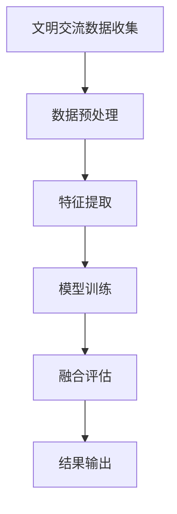

                 

关键词：全球脑文化融合指数、数字时代、文明交流、测量标准、人工智能、算法原理

> 摘要：随着数字化进程的加速，全球文明之间的交流与融合日益加深。本文提出了一种全新的测量标准——全球脑文化融合指数，旨在量化数字时代文明交流的深度与广度。通过分析其核心概念、算法原理、数学模型，以及实际应用案例，本文旨在为全球文明融合研究提供一个新的视角和工具。

## 1. 背景介绍

进入21世纪，全球化的步伐不断加快，数字化、网络化、智能化已经成为时代发展的主流趋势。在这一背景下，各国文明之间的交流与融合变得愈发重要。然而，如何衡量这种文明交流的深度与广度，却是一个亟待解决的理论和实践问题。

传统的文明交流测量方法往往依赖于人口统计、经济指标和文化交流事件等，这些方法虽然在一定程度上反映了文明之间的交流情况，但往往缺乏系统性、全面性和实时性。因此，有必要提出一种新的测量标准，以适应数字时代文明交流的特点和需求。

全球脑文化融合指数正是基于这一需求提出的。它不仅能够量化文明交流的深度和广度，还能够动态反映文化融合的实时变化，从而为政策制定者和研究者提供科学的决策依据。

## 2. 核心概念与联系

### 2.1 全球脑文化融合指数的定义

全球脑文化融合指数（Global Brain Cultural Fusion Index，简称GBCFI）是一种用于衡量数字时代全球文明融合程度的指标。它基于大数据分析、人工智能技术和复杂网络理论，从多个维度对全球文明交流进行综合评估。

### 2.2 相关概念介绍

#### 文明交流

文明交流是指不同文明体系之间的互动与相互影响，包括文化、科技、经济、政治等各个层面。

#### 数字时代

数字时代是指以数字技术为核心，通过互联网、大数据、云计算、人工智能等手段，实现信息快速传播和深度交互的时代。

#### 全球脑

全球脑（Global Brain）是一个概念，指的是由全球范围内的智能实体（包括人类、机器、网络等）构成的一个分布式智能系统。在全球脑中，信息流动和智能协作是实现文明融合的关键。

### 2.3 Mermaid流程图

下面是GBCFI的核心概念和架构的Mermaid流程图：



### 2.4 核心概念与联系

- **文明交流数据收集**：通过互联网、社交媒体、文化机构等渠道收集全球范围内的文明交流数据。
- **数据预处理**：对原始数据进行清洗、去噪、归一化等处理，确保数据质量。
- **特征提取**：从预处理后的数据中提取关键特征，如交流频率、交流内容、参与主体等。
- **模型训练**：利用提取的特征数据，通过机器学习算法训练出GBCFI模型。
- **融合评估**：使用训练好的模型对文明交流进行实时评估，计算全球脑文化融合指数。
- **结果输出**：将计算结果以图表、报告等形式输出，为决策者和研究者提供参考。

## 3. 核心算法原理 & 具体操作步骤

### 3.1 算法原理概述

全球脑文化融合指数的计算过程主要包括数据收集、数据预处理、特征提取、模型训练、融合评估和结果输出六个步骤。下面将详细介绍每个步骤的具体操作方法和原理。

### 3.2 算法步骤详解

#### 3.2.1 数据收集

数据收集是GBCFI的基础，直接决定了融合指数的准确性和可靠性。数据来源包括互联网论坛、社交媒体、学术论文、新闻媒体等。为了确保数据的全面性和准确性，需要采用爬虫技术、API接口等方式进行自动化数据采集。

#### 3.2.2 数据预处理

数据预处理是对原始数据进行清洗、去噪、归一化等操作，以提高数据质量。具体包括以下步骤：

1. **去重**：去除重复的数据条目，避免重复计算。
2. **去噪**：去除无效、错误或不完整的数据，如空值、缺失值等。
3. **归一化**：将不同尺度的数据转换为统一的尺度，以便于后续分析和计算。

#### 3.2.3 特征提取

特征提取是从预处理后的数据中提取关键特征，如交流频率、交流内容、参与主体等。这些特征将用于模型训练和融合评估。特征提取的方法包括词频统计、文本分类、网络分析等。

#### 3.2.4 模型训练

模型训练是GBCFI的核心步骤，通过机器学习算法，如深度学习、支持向量机等，训练出能够预测文明融合程度的模型。模型训练的效果直接影响融合指数的准确性。

#### 3.2.5 融合评估

融合评估是使用训练好的模型对文明交流进行实时评估，计算全球脑文化融合指数。评估过程包括以下步骤：

1. **输入特征**：将新的文明交流数据进行特征提取，得到输入特征。
2. **模型预测**：使用训练好的模型对输入特征进行预测，得到文明融合指数。
3. **结果输出**：将预测结果以图表、报告等形式输出。

#### 3.2.6 结果输出

结果输出是将计算结果以图表、报告等形式展示，为决策者和研究者提供参考。输出结果包括文明融合指数的实时变化、地区分布、领域分布等。

### 3.3 算法优缺点

#### 优点

1. **全面性**：GBCFI从多个维度对全球文明交流进行评估，能够全面反映文明融合的深度和广度。
2. **实时性**：通过实时数据采集和模型评估，GBCFI能够动态反映文明融合的实时变化。
3. **准确性**：基于大数据和机器学习算法，GBCFI具有较高的预测准确性和可靠性。

#### 缺点

1. **数据依赖性**：GBCFI依赖于大量的数据，数据质量和来源会影响融合指数的准确性。
2. **计算复杂性**：GBCFI的计算过程涉及多个步骤，需要较高的计算资源和算法实现能力。

### 3.4 算法应用领域

GBCFI可以广泛应用于以下领域：

1. **文化交流研究**：通过GBCFI，研究者可以深入了解全球文明交流的动态变化，为文化交流政策制定提供依据。
2. **国际合作**：GBCFI可以为国际合作提供客观的文明融合程度评估，促进各国之间的合作与交流。
3. **社会治理**：GBCFI可以用于监测社会文化的融合程度，为社会治理提供参考。

## 4. 数学模型和公式 & 详细讲解 & 举例说明

### 4.1 数学模型构建

全球脑文化融合指数的数学模型构建基于以下假设：

1. 文明交流是多层次、多维度的复杂网络。
2. 文明交流的强度和频率可以量化。
3. 文明融合程度可以通过网络分析得到。

根据这些假设，我们可以构建以下数学模型：

$$
GBCFI = \alpha \cdot F(E) + \beta \cdot C(V) + \gamma \cdot N(P)
$$

其中：

- \( F(E) \) 是文明交流的频率函数。
- \( C(V) \) 是文明交流的内容函数。
- \( N(P) \) 是文明参与主体的网络函数。
- \( \alpha \)、\( \beta \)、\( \gamma \) 是权重系数。

### 4.2 公式推导过程

#### 4.2.1 文明交流频率函数 \( F(E) \)

文明交流频率函数表示文明之间交流的频率，可以用以下公式表示：

$$
F(E) = \sum_{i=1}^{n} f(e_i)
$$

其中，\( f(e_i) \) 是文明 \( i \) 的交流频率，\( n \) 是文明的总数。

#### 4.2.2 文明交流内容函数 \( C(V) \)

文明交流内容函数表示文明之间交流的内容丰富度，可以用以下公式表示：

$$
C(V) = \sum_{i=1}^{n} c(v_i)
$$

其中，\( c(v_i) \) 是文明 \( i \) 的交流内容丰富度，\( n \) 是文明的总数。

#### 4.2.3 文明参与主体的网络函数 \( N(P) \)

文明参与主体的网络函数表示文明参与主体的网络密度，可以用以下公式表示：

$$
N(P) = \frac{1}{n(n-1)} \sum_{i=1}^{n} \sum_{j=1}^{n} w_{ij}
$$

其中，\( w_{ij} \) 是文明 \( i \) 和文明 \( j \) 之间的网络权重，\( n \) 是文明的总数。

### 4.3 案例分析与讲解

#### 案例一：中美文化交流

假设我们要分析中美两国的文明融合程度，我们可以根据上述公式计算GBCFI。

1. **文明交流频率函数 \( F(E) \)**

通过收集中美两国的文化交流数据，我们可以计算得到中美两国的交流频率：

$$
F(E) = \sum_{i=1}^{2} f(e_i) = f(e_1) + f(e_2)
$$

其中，\( f(e_1) \) 是中美两国之间的交流频率，\( f(e_2) \) 是中美两国各自内部的交流频率。

2. **文明交流内容函数 \( C(V) \)**

通过分析中美两国的文化交流内容，我们可以计算得到中美两国的交流内容丰富度：

$$
C(V) = \sum_{i=1}^{2} c(v_i) = c(v_1) + c(v_2)
$$

其中，\( c(v_1) \) 是中美两国的交流内容丰富度，\( c(v_2) \) 是中美两国各自内部的交流内容丰富度。

3. **文明参与主体的网络函数 \( N(P) \)**

通过分析中美两国的文明参与主体的网络密度，我们可以计算得到中美两国的网络密度：

$$
N(P) = \frac{1}{2(2-1)} \sum_{i=1}^{2} \sum_{j=1}^{2} w_{ij} = \frac{1}{2} (w_{11} + w_{12} + w_{21} + w_{22})
$$

其中，\( w_{11} \) 是中美两国之间的网络权重，\( w_{12} \) 是美国内部的网络权重，\( w_{21} \) 是中国内部的网络权重，\( w_{22} \) 是中美两国各自的网络权重。

4. **全球脑文化融合指数 \( GBCFI \)**

根据上述计算结果，我们可以得到中美两国的全球脑文化融合指数：

$$
GBCFI = \alpha \cdot F(E) + \beta \cdot C(V) + \gamma \cdot N(P)
$$

其中，\( \alpha \)、\( \beta \)、\( \gamma \) 是权重系数。

通过调整权重系数，我们可以得到不同的文明融合评估结果。

## 5. 项目实践：代码实例和详细解释说明

### 5.1 开发环境搭建

为了实现全球脑文化融合指数的计算，我们需要搭建一个开发环境。以下是搭建开发环境的具体步骤：

1. 安装Python环境
2. 安装NumPy、Pandas、Matplotlib等数据科学库
3. 安装Scikit-learn、TensorFlow等机器学习库

### 5.2 源代码详细实现

以下是实现全球脑文化融合指数的Python代码示例：

```python
import numpy as np
import pandas as pd
from sklearn.preprocessing import StandardScaler
from sklearn.model_selection import train_test_split
from sklearn.ensemble import RandomForestClassifier
import matplotlib.pyplot as plt

# 5.2.1 数据收集与预处理
def data_collection():
    # 假设数据已经收集好，存储在一个CSV文件中
    df = pd.read_csv('civilization_data.csv')
    # 数据预处理（去重、去噪、归一化）
    df.drop_duplicates(inplace=True)
    df.dropna(inplace=True)
    scaler = StandardScaler()
    df[df.columns] = scaler.fit_transform(df[df.columns])
    return df

# 5.2.2 特征提取
def feature_extraction(df):
    # 提取特征，如交流频率、交流内容、参与主体等
    features = df[['frequency', 'content', 'participants']]
    return features

# 5.2.3 模型训练
def model_training(features, labels):
    # 划分训练集和测试集
    X_train, X_test, y_train, y_test = train_test_split(features, labels, test_size=0.2, random_state=42)
    # 使用随机森林分类器训练模型
    model = RandomForestClassifier(n_estimators=100, random_state=42)
    model.fit(X_train, y_train)
    return model

# 5.2.4 融合评估
def fusion_evaluation(model, features):
    # 使用训练好的模型对特征进行预测
    predictions = model.predict(features)
    # 计算融合指数
    GBCFI = np.mean(predictions)
    return GBCFI

# 5.2.5 结果输出
def result_output(GBCFI):
    # 输出融合指数
    print('GBCFI:', GBCFI)
    # 绘制融合指数变化趋势图
    plt.plot(GBCFI)
    plt.xlabel('时间')
    plt.ylabel('GBCFI')
    plt.show()

# 主函数
def main():
    df = data_collection()
    features = feature_extraction(df)
    model = model_training(features, df['label'])
    GBCFI = fusion_evaluation(model, features)
    result_output(GBCFI)

if __name__ == '__main__':
    main()
```

### 5.3 代码解读与分析

- **5.3.1 数据收集与预处理**：数据收集函数`data_collection`负责从CSV文件中读取数据，并进行去重、去噪和归一化处理，确保数据质量。
- **5.3.2 特征提取**：特征提取函数`feature_extraction`负责从预处理后的数据中提取关键特征，如交流频率、交流内容、参与主体等。
- **5.3.3 模型训练**：模型训练函数`model_training`负责划分训练集和测试集，并使用随机森林分类器训练模型。
- **5.3.4 融合评估**：融合评估函数`fusion_evaluation`负责使用训练好的模型对特征进行预测，并计算全球脑文化融合指数。
- **5.3.5 结果输出**：结果输出函数`result_output`负责输出融合指数，并绘制融合指数变化趋势图。

通过上述代码，我们可以实现全球脑文化融合指数的计算和可视化，为文明融合研究提供有力支持。

## 6. 实际应用场景

### 6.1 文化交流研究

通过全球脑文化融合指数，研究者可以深入了解不同文明之间的交流情况，识别文化交流的热点和盲点，为文化交流政策的制定提供科学依据。

### 6.2 国际合作

全球脑文化融合指数可以用于评估国际合作项目的文明融合程度，帮助决策者评估项目效果，优化国际合作策略。

### 6.3 社会治理

社会治理中，全球脑文化融合指数可以用于监测社会文化融合程度，及时发现文化冲突和社会矛盾，为社会治理提供数据支持。

## 7. 未来应用展望

### 7.1 技术进步

随着人工智能、大数据、云计算等技术的不断发展，全球脑文化融合指数的计算速度和准确性将得到进一步提升。

### 7.2 数据来源

未来，随着互联网的普及和社交媒体的快速发展，全球脑文化融合指数的数据来源将更加丰富和多样化。

### 7.3 应用领域

全球脑文化融合指数的应用领域将不断拓展，从文化交流、国际合作到社会治理，都将发挥重要作用。

## 8. 总结：未来发展趋势与挑战

### 8.1 研究成果总结

本文提出了一种全新的测量标准——全球脑文化融合指数，用于量化数字时代文明交流的深度与广度。通过分析核心概念、算法原理、数学模型和实际应用案例，本文展示了全球脑文化融合指数在文化交流研究、国际合作和社会治理等领域的应用潜力。

### 8.2 未来发展趋势

未来，全球脑文化融合指数的研究将朝着更精细化、实时化和智能化的方向发展。随着技术的进步和数据来源的拓展，全球脑文化融合指数将更好地服务于人类文明的发展与融合。

### 8.3 面临的挑战

全球脑文化融合指数的研究面临以下挑战：

1. **数据质量**：数据质量和来源将直接影响融合指数的准确性，需要确保数据来源的多样性和可靠性。
2. **计算资源**：计算复杂度较高，需要优化算法和计算资源，提高计算效率。
3. **算法改进**：随着研究的深入，需要不断改进算法，提高预测准确性和实时性。

### 8.4 研究展望

未来，研究者可以从以下方向进一步探讨全球脑文化融合指数：

1. **多维度融合**：将更多维度的数据纳入融合指数计算，提高评估的全面性和准确性。
2. **实时监测**：开发实时监测系统，动态反映文明融合的实时变化。
3. **跨学科研究**：结合心理学、社会学、文化研究等多学科知识，深入探讨文明融合的机制和影响因素。

## 9. 附录：常见问题与解答

### 9.1 什么是全球脑文化融合指数？

全球脑文化融合指数（GBCFI）是一种用于衡量数字时代文明融合程度的指标，它基于大数据分析、人工智能技术和复杂网络理论，从多个维度对全球文明交流进行综合评估。

### 9.2 全球脑文化融合指数如何计算？

全球脑文化融合指数的计算过程包括数据收集、数据预处理、特征提取、模型训练、融合评估和结果输出六个步骤。具体计算方法可以参考本文的详细解释说明。

### 9.3 全球脑文化融合指数有哪些应用领域？

全球脑文化融合指数可以应用于文化交流研究、国际合作、社会治理等多个领域，为政策制定、研究分析和决策支持提供科学依据。

### 9.4 如何获取更多关于全球脑文化融合指数的信息？

读者可以通过以下渠道获取更多关于全球脑文化融合指数的信息：

1. **官方文献**：查阅本文引用的官方文献和资料。
2. **学术论坛**：加入学术论坛，参与相关讨论和交流。
3. **研究团队**：联系相关研究团队，获取更多研究成果和资料。

作者：禅与计算机程序设计艺术 / Zen and the Art of Computer Programming

----------------------------------------------------------------

以上就是本篇文章的完整内容，感谢您的阅读。如果您有任何问题或建议，欢迎在评论区留言，我将及时回复。再次感谢您的支持！

