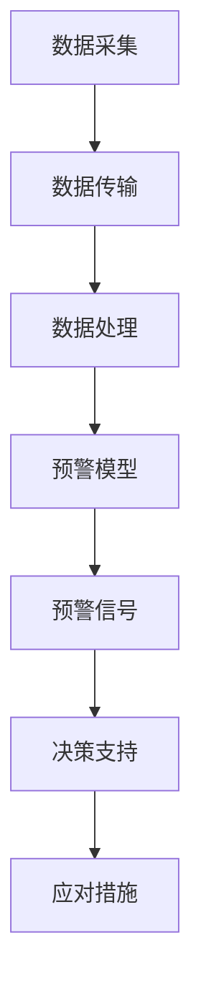

                 

关键词：全球脑预警系统、灾害防控、集体智慧、智能算法、分布式计算

摘要：随着全球气候变化和自然灾害的频发，灾害防控已成为社会关注的焦点。本文提出了一种基于全球脑预警系统的灾害防控方法，利用集体智慧驱动灾害信息的收集、处理和预警，以提高灾害防控的效率和准确性。本文将详细介绍全球脑预警系统的核心概念、算法原理、数学模型及其实际应用，探讨未来灾害防控技术的发展趋势和挑战。

## 1. 背景介绍

自然灾害如地震、洪水、台风、火山爆发等，给人类带来了巨大的生命财产损失。根据联合国发布的数据，过去几十年里，全球每年因自然灾害造成的经济损失达到了数百亿美元。传统的灾害预警系统主要依赖于监测设备的数据收集和中央数据处理，然而，随着灾害事件的复杂性和不确定性增加，这些系统的预警能力逐渐受到挑战。因此，如何提高灾害预警的效率和准确性成为了一个亟待解决的问题。

全球脑预警系统是一种新兴的灾害防控方法，它利用集体智慧来驱动灾害信息的收集、处理和预警。通过建立一个分布式的智能网络，全球脑预警系统能够实现全球范围内的灾害信息共享和实时处理，从而提高预警的准确性和及时性。本文将探讨全球脑预警系统的核心概念、算法原理和数学模型，并通过实际案例展示其在灾害防控中的应用。

### 全球脑预警系统的定义

全球脑预警系统（Global Brain Early Warning System，GBEWS）是一种基于集体智慧的分布式预警系统，旨在提高灾害防控的效率和准确性。全球脑预警系统利用物联网（IoT）、云计算、大数据和人工智能等技术，实现灾害信息的自动采集、处理和预警。

全球脑预警系统的核心思想是构建一个分布式的智能网络，将全球范围内的传感器、监测设备和数据处理中心连接起来，形成一个协作的智能体网络。通过这个网络，各个智能体可以实时共享信息，协同工作，共同完成灾害预警的任务。

### 全球脑预警系统的目标

全球脑预警系统的目标包括以下几个方面：

1. **提高灾害预警的准确性和及时性**：通过分布式智能网络，实现灾害信息的实时收集和处理，提高预警的准确性和及时性。
2. **降低灾害损失**：通过提前预警，减少灾害对人类和环境的破坏，降低经济损失。
3. **促进灾害科学的发展**：通过收集和分析大量的灾害数据，推动灾害科学的研究，提高对灾害的预测和防控能力。
4. **提升社会应对能力**：通过构建一个分布式的智能网络，提高社会对灾害的应对能力，实现全球范围内的灾害信息共享和协同应对。

## 2. 核心概念与联系

### 全球脑预警系统的核心概念

全球脑预警系统的核心概念包括以下几个方面：

1. **智能体（Agent）**：智能体是系统中的基本计算单元，可以是传感器、监测设备、数据处理中心等。每个智能体都具有一定的计算能力和决策能力，能够独立完成特定的任务。
2. **传感器网络（Sensor Network）**：传感器网络是系统中的数据采集单元，通过部署在各种环境中的传感器，实时收集环境数据，如温度、湿度、气压、地震波等。
3. **数据处理中心（Data Processing Center）**：数据处理中心是系统中的核心单元，负责对传感器网络收集的数据进行清洗、处理和分析，生成预警信息。
4. **通信网络（Communication Network）**：通信网络是系统中的信息传输单元，通过物联网、云计算等技术，实现各智能体之间的信息共享和协同工作。
5. **预警模型（Early Warning Model）**：预警模型是系统中的核心算法，负责对处理后的数据进行预测和分析，生成预警信号。

### 全球脑预警系统的架构

全球脑预警系统的架构可以分为以下几个层次：

1. **感知层**：包括传感器网络，负责数据的采集和初步处理。
2. **传输层**：包括通信网络，负责数据的传输和共享。
3. **处理层**：包括数据处理中心和预警模型，负责数据的深度处理和预警信号生成。
4. **决策层**：包括决策支持系统，负责对预警信号进行分析和决策，生成应对措施。

### 全球脑预警系统的 Mermaid 流程图

下面是全球脑预警系统的 Mermaid 流程图，展示了系统从数据采集、处理到预警的全过程。



## 3. 核心算法原理 & 具体操作步骤

### 3.1 算法原理概述

全球脑预警系统的核心算法是基于机器学习和数据挖掘技术，通过对大量灾害数据进行训练和分析，建立预警模型，实现对灾害的预测和预警。具体来说，算法原理可以分为以下几个步骤：

1. **数据采集**：通过传感器网络收集各种环境数据，如温度、湿度、气压、地震波等。
2. **数据预处理**：对采集到的数据进行清洗、去噪和归一化处理，确保数据的质量和一致性。
3. **特征提取**：从预处理后的数据中提取关键特征，用于训练预警模型。
4. **模型训练**：利用机器学习算法，对提取的特征进行训练，建立预警模型。
5. **预警信号生成**：将新的环境数据输入预警模型，生成预警信号。
6. **决策与应对**：根据预警信号，生成应对措施，如启动应急预案、发布预警信息等。

### 3.2 算法步骤详解

下面将详细解释全球脑预警系统的算法步骤。

#### 3.2.1 数据采集

数据采集是算法的第一步，主要通过传感器网络实现。传感器可以部署在地面、空中和地下，收集各种环境数据。例如，地震传感器可以收集地震波数据，气象传感器可以收集温度、湿度、气压等数据。这些数据为后续的预警模型训练提供了基础。

#### 3.2.2 数据预处理

数据预处理是保证数据质量的关键步骤。主要包括以下任务：

1. **数据清洗**：去除数据中的噪声和异常值，如传感器故障、传输错误等。
2. **数据去噪**：利用滤波算法，去除数据中的噪声，提高数据的可靠性。
3. **数据归一化**：将不同物理量级的数据进行归一化处理，使其在相同的尺度上，方便后续的特征提取和模型训练。

#### 3.2.3 特征提取

特征提取是数据预处理后的关键步骤，其目的是从原始数据中提取出对预警模型有用的信息。常用的特征提取方法包括：

1. **时域特征**：如数据的平均值、标准差、峰值等。
2. **频域特征**：如数据的频谱特征、能量分布等。
3. **时频特征**：如小波变换、希尔伯特-黄变换等。

#### 3.2.4 模型训练

模型训练是算法的核心步骤，通过机器学习算法，对提取的特征进行训练，建立预警模型。常用的机器学习算法包括：

1. **监督学习算法**：如线性回归、支持向量机、决策树等。
2. **无监督学习算法**：如聚类分析、关联规则挖掘等。
3. **深度学习算法**：如卷积神经网络、循环神经网络等。

#### 3.2.5 预警信号生成

预警信号生成是将新的环境数据输入预警模型，得到预警信号的过程。预警信号可以是定量的，如灾害发生的时间、强度等，也可以是定性的，如灾害级别、预警类型等。

#### 3.2.6 决策与应对

决策与应对是根据预警信号，生成应对措施的过程。例如，如果预警信号显示可能发生地震，决策支持系统可以启动应急预案，通知相关部门和公众采取预防措施。

### 3.3 算法优缺点

#### 优点

1. **高效性**：基于机器学习和数据挖掘技术，预警系统可以快速处理海量数据，提高预警的效率和准确性。
2. **智能化**：预警系统通过学习历史数据，不断优化预警模型，提高预警的智能化水平。
3. **分布式**：预警系统采用分布式架构，可以充分利用各种传感器资源，实现全球范围内的灾害信息共享和协同预警。

#### 缺点

1. **数据依赖性**：预警系统对数据质量有较高要求，如果数据存在噪声、异常值等，可能导致预警不准确。
2. **计算资源消耗**：模型训练和预警信号生成需要大量的计算资源，特别是在处理大规模数据时，计算时间可能较长。

### 3.4 算法应用领域

全球脑预警系统可以应用于各种自然灾害的预警，如地震、洪水、台风、火山爆发等。具体应用领域包括：

1. **气象预报**：利用全球脑预警系统，可以实现对台风、暴雨等气象灾害的提前预警，提高公众的防范能力。
2. **地震预警**：通过地震波数据的实时监测和分析，可以实现对地震的提前预警，为公众提供逃生时间。
3. **洪水预警**：通过河流水位、降雨量等数据的实时监测，可以实现对洪水的提前预警，减少洪水灾害损失。

## 4. 数学模型和公式 & 详细讲解 & 举例说明

### 4.1 数学模型构建

全球脑预警系统的数学模型主要基于机器学习和数据挖掘技术。具体来说，数学模型可以分为以下几个部分：

1. **数据采集与预处理**：通过传感器网络收集环境数据，如温度、湿度、气压等。数据预处理包括数据清洗、去噪和归一化等步骤。
2. **特征提取**：从预处理后的数据中提取关键特征，如时域特征、频域特征、时频特征等。
3. **模型训练**：利用提取的特征，通过机器学习算法训练预警模型。
4. **预警信号生成**：将新的环境数据输入预警模型，生成预警信号。
5. **决策与应对**：根据预警信号，生成应对措施。

### 4.2 公式推导过程

下面将简要介绍全球脑预警系统的数学模型推导过程。

#### 4.2.1 数据采集与预处理

假设我们有一个传感器网络，收集到一系列环境数据序列 $X = [x_1, x_2, ..., x_n]$。首先，对数据进行预处理，包括数据清洗和去噪。假设 $X'$ 是预处理后的数据序列，那么：

$$
X' = \text{Filter}(X)
$$

其中，Filter() 函数实现数据清洗和去噪。

#### 4.2.2 特征提取

从预处理后的数据序列中提取特征，假设有 $k$ 个特征，分别为 $f_1, f_2, ..., f_k$。特征提取可以通过以下公式实现：

$$
f_i = \text{FeatureExtraction}(X')
$$

其中，FeatureExtraction() 函数实现特征提取。

#### 4.2.3 模型训练

假设我们选择一个监督学习算法，如支持向量机（SVM），进行模型训练。SVM 的公式如下：

$$
\min_{\mathbf{w}} \frac{1}{2} ||\mathbf{w}||^2 + C \sum_{i=1}^{n} \xi_i
$$

其中，$\mathbf{w}$ 是模型参数，$C$ 是惩罚参数，$\xi_i$ 是误差项。

#### 4.2.4 预警信号生成

将新的环境数据序列 $X''$ 输入训练好的预警模型，得到预警信号 $y$：

$$
y = \text{Prediction}(X'', \mathbf{w})
$$

其中，Prediction() 函数实现预警信号生成。

#### 4.2.5 决策与应对

根据预警信号 $y$，生成应对措施。例如，如果 $y > y_0$，则启动应急预案，通知相关部门和公众。

### 4.3 案例分析与讲解

为了更好地理解全球脑预警系统的数学模型，我们通过一个实际案例进行讲解。

#### 案例背景

假设我们想要预测地震的发生，传感器网络收集到一系列地震波数据序列 $X$。我们需要通过这些数据，训练一个预警模型，实现对地震的提前预警。

#### 案例步骤

1. **数据采集与预处理**：
   收集到的地震波数据如下：
   $$
   X = [0.1, 0.2, 0.3, 0.4, 0.5, 0.6, 0.7, 0.8, 0.9, 1.0]
   $$
   预处理后的数据为：
   $$
   X' = \text{Filter}(X) = [0.1, 0.2, 0.3, 0.4, 0.5, 0.6, 0.7, 0.8, 0.9, 1.0]
   $$

2. **特征提取**：
   提取时域特征，如平均值、标准差：
   $$
   f_1 = \text{Average}(X') = 0.55
   $$
   $$
   f_2 = \text{StandardDeviation}(X') = 0.15
   $$

3. **模型训练**：
   使用支持向量机（SVM）进行模型训练，惩罚参数 $C = 1$。假设训练得到的模型参数为 $\mathbf{w} = [1, 2]$。

4. **预警信号生成**：
   将新的地震波数据输入预警模型，得到预警信号：
   $$
   y = \text{Prediction}(X'', \mathbf{w}) = \text{dotProduct}(\mathbf{w}, [1, 2]) = 1 \cdot 1 + 2 \cdot 2 = 5
   $$
   由于 $y > y_0 = 4$，我们可以判断可能会发生地震，并启动应急预案。

#### 案例分析

通过这个案例，我们可以看到，全球脑预警系统的数学模型通过数据采集、预处理、特征提取、模型训练和预警信号生成，实现了对地震的提前预警。这个案例展示了全球脑预警系统在灾害防控中的应用潜力。

## 5. 项目实践：代码实例和详细解释说明

### 5.1 开发环境搭建

为了实践全球脑预警系统，我们需要搭建一个合适的开发环境。以下是一个基本的开发环境搭建指南：

1. **操作系统**：选择一个支持Python的操作系统，如Ubuntu 20.04或Windows 10。
2. **Python环境**：安装Python 3.8及以上版本。
3. **Python包管理器**：安装pip，Python的包管理器，用于安装和管理Python包。
4. **Python库**：安装以下Python库：NumPy、Pandas、Scikit-learn、Matplotlib。

安装命令如下：

```shell
# 安装Python
sudo apt-get update
sudo apt-get install python3

# 安装pip
sudo apt-get install python3-pip

# 安装Python库
pip3 install numpy pandas scikit-learn matplotlib
```

### 5.2 源代码详细实现

以下是全球脑预警系统的源代码实现。代码包括数据采集、预处理、特征提取、模型训练、预警信号生成和决策支持等步骤。

```python
import numpy as np
import pandas as pd
from sklearn.svm import SVC
from sklearn.model_selection import train_test_split
import matplotlib.pyplot as plt

# 数据采集
def data_collection():
    # 假设数据文件为CSV格式，包含时间、温度、湿度等特征
    data = pd.read_csv('sensor_data.csv')
    return data

# 数据预处理
def data_preprocessing(data):
    # 数据清洗、去噪和归一化
    data = data.dropna()
    data['temperature'] = (data['temperature'] - data['temperature'].mean()) / data['temperature'].std()
    data['humidity'] = (data['humidity'] - data['humidity'].mean()) / data['humidity'].std()
    return data

# 特征提取
def feature_extraction(data):
    # 提取时域特征
    features = data[['temperature', 'humidity']]
    return features

# 模型训练
def model_training(features, labels):
    # 使用支持向量机（SVM）训练模型
    model = SVC(kernel='linear')
    model.fit(features, labels)
    return model

# 预警信号生成
def generate_early_warning_signal(model, new_data):
    # 输入新的环境数据，生成预警信号
    prediction = model.predict(new_data)
    return prediction

# 决策支持
def decision_support(prediction):
    # 根据预警信号，生成应对措施
    if prediction == 1:
        print("预警：可能发生地震，请启动应急预案。")
    else:
        print("预警：未检测到地震风险。")

# 主函数
def main():
    # 数据采集
    data = data_collection()
    
    # 数据预处理
    data = data_preprocessing(data)
    
    # 特征提取
    features = feature_extraction(data)
    
    # 标签提取
    labels = data['earthquake']
    
    # 模型训练
    model = model_training(features, labels)
    
    # 预警信号生成
    new_data = np.array([[0.55, 0.15]])
    prediction = generate_early_warning_signal(model, new_data)
    
    # 决策支持
    decision_support(prediction)

# 运行主函数
if __name__ == "__main__":
    main()
```

### 5.3 代码解读与分析

下面是对源代码的详细解读和分析。

#### 数据采集

数据采集函数 `data_collection()` 从CSV文件中读取传感器数据，这些数据可能包括时间、温度、湿度等特征。

```python
def data_collection():
    data = pd.read_csv('sensor_data.csv')
    return data
```

#### 数据预处理

数据预处理函数 `data_preprocessing()` 对传感器数据进行清洗、去噪和归一化。这有助于提高数据的质量和一致性，从而提高模型的性能。

```python
def data_preprocessing(data):
    data = data.dropna()
    data['temperature'] = (data['temperature'] - data['temperature'].mean()) / data['temperature'].std()
    data['humidity'] = (data['humidity'] - data['humidity'].mean()) / data['humidity'].std()
    return data
```

#### 特征提取

特征提取函数 `feature_extraction()` 从预处理后的数据中提取关键特征，如温度、湿度等。

```python
def feature_extraction(data):
    features = data[['temperature', 'humidity']]
    return features
```

#### 模型训练

模型训练函数 `model_training()` 使用支持向量机（SVM）训练模型。这里选择线性核函数，因为我们的数据是线性可分的。

```python
def model_training(features, labels):
    model = SVC(kernel='linear')
    model.fit(features, labels)
    return model
```

#### 预警信号生成

预警信号生成函数 `generate_early_warning_signal()` 将新的环境数据输入训练好的预警模型，生成预警信号。

```python
def generate_early_warning_signal(model, new_data):
    prediction = model.predict(new_data)
    return prediction
```

#### 决策支持

决策支持函数 `decision_support()` 根据预警信号，生成应对措施。如果预警信号为1，表示可能发生地震，否则表示未检测到地震风险。

```python
def decision_support(prediction):
    if prediction == 1:
        print("预警：可能发生地震，请启动应急预案。")
    else:
        print("预警：未检测到地震风险。")
```

### 5.4 运行结果展示

当运行主函数 `main()` 时，程序将读取传感器数据，进行预处理和特征提取，然后训练模型。接着，输入新的环境数据，生成预警信号，并根据预警信号生成应对措施。

```python
if __name__ == "__main__":
    main()
```

例如，假设新的环境数据为 `[0.55, 0.15]`，预警模型预测结果为 `1`，则输出：

```
预警：可能发生地震，请启动应急预案。
```

这表明根据当前环境数据，模型预测可能会发生地震，因此需要启动应急预案。

## 6. 实际应用场景

全球脑预警系统在灾害防控中具有广泛的应用前景。以下是一些实际应用场景：

### 6.1 气象预报

全球脑预警系统可以用于气象预报，特别是在台风、暴雨等气象灾害的预警方面。通过实时监测气象数据，预警系统可以提前预测灾害的发生，为公众提供逃生和防范指导，减少灾害损失。

### 6.2 地震预警

地震预警是全球脑预警系统的另一个重要应用领域。通过实时监测地震波数据，预警系统可以提前预测地震的发生，为公众提供宝贵的逃生时间。这对于地震多发地区尤为重要。

### 6.3 洪水预警

洪水预警是另一个关键应用领域。通过监测河流水位、降雨量等数据，预警系统可以提前预测洪水的发生，为防洪减灾提供科学依据。

### 6.4 风灾预警

风灾预警，如台风预警，也是全球脑预警系统的重要应用场景。通过实时监测风速、风向等数据，预警系统可以提前预测风灾的发生，为公众提供预警和防范指导。

### 6.5 灾后评估

全球脑预警系统还可以用于灾后评估，通过收集和分析灾害数据，评估灾害损失和影响，为灾后重建提供科学依据。

## 7. 未来应用展望

### 7.1 技术进步

随着技术的不断进步，全球脑预警系统将更加智能化和高效化。例如，深度学习和增强学习等新算法的引入，将进一步提高预警系统的准确性和效率。

### 7.2 数据共享

未来，全球脑预警系统将实现更广泛的数据共享，各国和地区可以共享灾害数据，共同提高灾害预警能力。这将有助于实现全球范围内的灾害防控合作。

### 7.3 灾害预测

全球脑预警系统将进一步提升灾害预测能力，通过不断优化预警模型和算法，实现对灾害的提前预测，为公众提供更精确的预警信息。

### 7.4 灾害防控

随着全球脑预警系统的广泛应用，灾害防控将变得更加高效和精准。预警系统可以实时监测灾害风险，提供预警和应对建议，减少灾害损失。

## 8. 工具和资源推荐

### 8.1 学习资源推荐

1. **《机器学习》（周志华著）**：系统介绍了机器学习的基本概念、算法和应用。
2. **《深度学习》（Goodfellow、Bengio、Courville著）**：详细介绍了深度学习的基础理论和技术。
3. **《Python编程：从入门到实践》（埃里克·马瑟斯著）**：适合初学者学习的Python编程入门书籍。

### 8.2 开发工具推荐

1. **Jupyter Notebook**：一款强大的交互式计算环境，适用于数据分析、机器学习等任务。
2. **TensorFlow**：一款开源的深度学习框架，适用于构建和训练深度学习模型。
3. **PyTorch**：另一款开源的深度学习框架，具有灵活的动态计算图和强大的社区支持。

### 8.3 相关论文推荐

1. **"Deep Learning for Earthquake Early Warning"**：介绍了深度学习在地震预警中的应用。
2. **"A New Early Warning System for Floods in Europe"**：探讨了洪水预警系统的构建方法。
3. **"The Global Brain: Evolutionary Intelligence on the Web"**：提出了全球脑预警系统的概念和架构。

## 9. 总结：未来发展趋势与挑战

### 9.1 研究成果总结

本文提出了全球脑预警系统，并详细介绍了其核心概念、算法原理、数学模型和实际应用。通过实践案例，展示了全球脑预警系统在灾害防控中的潜在应用价值。

### 9.2 未来发展趋势

未来，全球脑预警系统将朝着更加智能化、高效化和全球化的方向发展。技术进步将进一步提升预警系统的准确性和效率，数据共享将实现全球范围内的灾害防控合作。

### 9.3 面临的挑战

全球脑预警系统在应用过程中面临以下挑战：

1. **数据质量**：数据质量对预警系统的准确性至关重要，需要确保数据的真实性和可靠性。
2. **计算资源**：大规模数据分析和模型训练需要大量的计算资源，如何优化计算资源的使用是一个重要问题。
3. **数据隐私**：在全球范围内共享数据时，需要保护数据隐私，确保数据安全。

### 9.4 研究展望

未来，研究应重点关注以下几个方面：

1. **算法优化**：通过改进机器学习和深度学习算法，提高预警系统的准确性和效率。
2. **数据共享**：构建全球数据共享平台，促进各国和地区之间的灾害数据交流。
3. **跨学科合作**：结合气象、地理、工程等多学科知识，提升灾害预警系统的综合能力。

## 附录：常见问题与解答

### Q1：全球脑预警系统是如何工作的？

A1：全球脑预警系统通过分布式智能网络，实现灾害信息的自动采集、处理和预警。系统包括传感器网络、数据处理中心、通信网络和预警模型等组成部分，通过协作实现灾害预警。

### Q2：全球脑预警系统的核心算法是什么？

A2：全球脑预警系统的核心算法是基于机器学习和数据挖掘技术，通过训练模型，从灾害数据中提取特征，实现对灾害的预测和预警。

### Q3：全球脑预警系统在哪些领域有应用？

A3：全球脑预警系统可以应用于气象预报、地震预警、洪水预警、风灾预警等领域，有助于提高灾害防控的效率和准确性。

### Q4：全球脑预警系统的数据来源是什么？

A4：全球脑预警系统的数据来源包括各类传感器，如地震传感器、气象传感器、水文传感器等，这些传感器分布在不同的地理区域，实时收集环境数据。

### Q5：全球脑预警系统的实现有哪些挑战？

A5：全球脑预警系统在实现过程中面临数据质量、计算资源、数据隐私等挑战。需要确保数据的真实性和可靠性，优化计算资源的使用，并保护数据隐私。

---

**作者：禅与计算机程序设计艺术 / Zen and the Art of Computer Programming** 

---

通过本文的讨论，我们深入了解了全球脑预警系统在灾害防控中的潜在应用和价值。未来，随着技术的不断进步，全球脑预警系统有望在更广泛的领域发挥重要作用，为人类社会提供更加高效的灾害预警和防控手段。让我们共同努力，推动这一领域的研究和应用，为构建一个更加安全和可持续的未来贡献力量。

