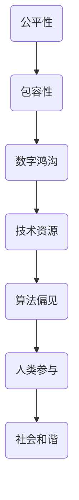

                 

关键词：公平、包容、计算环境、人类参与、技术平等

摘要：本文探讨了在当今信息化社会中，如何构建一个公平且包容的计算环境，以实现所有人类平等参与的愿景。通过分析技术发展的现状与挑战，提出了相应的策略和措施，旨在推动计算环境的公平性和包容性，为每个人提供平等的机会和资源。

## 1. 背景介绍

随着信息技术的迅猛发展，计算机已经深入到了社会生活的方方面面。从工作、学习到娱乐，计算机改变了我们的生活方式。然而，在计算机技术的普及和应用过程中，也暴露出了一些不公平和包容性的问题。例如，技术发展的不平衡导致了数字鸿沟的存在，部分人群因为缺乏技术资源和培训而处于不利地位。此外，计算环境中的偏见和歧视问题也日益引起关注，这些现象不仅影响了人们的日常生活，还对社会的和谐发展构成了威胁。

### 技术发展的不平衡

技术发展的不平衡是指不同地区、不同群体在获取和使用计算机技术方面存在巨大差异。发达国家和发展中国家之间的差距尤为明显，这导致了一些人无法享受到信息技术带来的便利。此外，即使在同一国家内部，不同社会群体之间的技术差距也很大。例如，城市居民与农村居民、高收入人群与低收入人群之间的数字鸿沟依然存在。

### 计算环境中的偏见和歧视

计算环境中的偏见和歧视主要体现在算法的偏见和歧视上。一些算法在训练数据集的选择上可能存在偏见，导致算法在实际应用中对某些人群产生不公平待遇。例如，招聘系统可能因为数据集的偏见而倾向于选择某些性别或种族的候选人，从而排除其他候选人。这种现象不仅损害了个人的权益，还加剧了社会的不公平。

## 2. 核心概念与联系

为了构建一个公平且包容的计算环境，我们需要明确几个核心概念，并理解它们之间的联系。以下是这些核心概念及其之间的关系的Mermaid流程图：



### 公平性

公平性是指计算环境中的资源、机会和待遇应该对每个人都是平等的。公平性的实现需要确保技术资源的分配公平，避免任何形式的歧视和偏见。

### 包容性

包容性是指计算环境应该接纳和尊重所有人群，无论他们的背景、文化或能力如何。包容性的实现需要建立多元化的团队和文化，鼓励不同意见和观点的交流。

### 数字鸿沟

数字鸿沟是指由于技术资源的分配不均而导致的一部分人群无法享受到信息技术带来的便利。减少数字鸿沟是实现公平和包容的关键。

### 技术资源

技术资源包括硬件、软件、培训等，是构建计算环境的基础。确保技术资源的充足和公平分配，有助于缩小数字鸿沟，促进公平和包容。

### 算法偏见

算法偏见是指算法在训练和预测过程中对某些人群产生的偏见。消除算法偏见，有助于构建一个公平的计算环境。

### 人类参与

人类参与是指所有人都能平等地参与到计算环境中来，无论是使用计算机技术，还是参与算法设计和决策过程。人类参与是实现计算环境公平和包容的重要保障。

### 社会和谐

社会和谐是指计算环境对社会整体的积极影响，包括促进社会公平、减少冲突、提高生活质量等。构建公平和包容的计算环境有助于实现社会和谐。

## 3. 核心算法原理 & 具体操作步骤

### 3.1 算法原理概述

为了实现计算环境的公平和包容，我们需要引入一系列算法来检测和纠正偏见。这些算法主要包括以下几种：

- **公平性检测算法**：用于检测计算环境中是否存在不公平现象。
- **偏见纠正算法**：用于纠正算法中的偏见，使其对所有人都是公平的。
- **适应性算法**：根据不同用户的需求和特点，提供个性化的服务。

### 3.2 算法步骤详解

#### 公平性检测算法

1. **数据收集**：收集计算环境中的相关数据，包括用户行为、算法输出等。
2. **特征提取**：从数据中提取有助于判断公平性的特征，如性别、年龄、收入等。
3. **模型训练**：使用收集到的数据训练一个公平性检测模型。
4. **模型评估**：使用测试数据评估模型的性能，确保其能有效检测不公平现象。
5. **输出结果**：将检测结果输出给相关决策者，以便采取相应措施。

#### 偏见纠正算法

1. **数据预处理**：对原始数据集进行预处理，去除或降低偏见。
2. **模型训练**：使用预处理后的数据集训练一个偏见纠正模型。
3. **模型评估**：评估模型的性能，确保其能有效纠正偏见。
4. **模型部署**：将训练好的模型部署到计算环境中，以纠正算法偏见。

#### 适应性算法

1. **用户需求分析**：分析不同用户的需求和特点。
2. **个性化服务设计**：根据用户需求设计个性化的服务。
3. **模型训练**：使用用户数据训练一个适应性模型。
4. **模型评估**：评估模型的性能，确保其能有效满足用户需求。
5. **模型部署**：将训练好的模型部署到计算环境中，提供个性化服务。

### 3.3 算法优缺点

#### 公平性检测算法

**优点**：

- 能有效检测计算环境中的不公平现象。
- 为决策者提供有价值的信息，帮助其制定公平策略。

**缺点**：

- 需要大量的数据支持，对数据质量有较高要求。
- 检测结果可能存在误报和漏报，需要进一步优化。

#### 偏见纠正算法

**优点**：

- 能有效纠正算法中的偏见，提高公平性。
- 对计算环境中的歧视问题有较好的抑制作用。

**缺点**：

- 需要大量时间和资源进行模型训练和评估。
- 可能会影响算法的性能和准确性。

#### 适应性算法

**优点**：

- 能根据用户需求提供个性化的服务，提高用户体验。
- 有助于缩小数字鸿沟，促进计算环境的包容性。

**缺点**：

- 需要大量用户数据支持，对数据隐私有较高要求。
- 模型设计复杂，需要多学科知识的融合。

### 3.4 算法应用领域

#### 公平性检测算法

- 招聘系统：用于检测招聘过程中是否存在性别、种族等偏见。
- 信用评估：用于检测信用评估系统中是否存在偏见，确保贷款审批的公平性。

#### 偏见纠正算法

- 个性化推荐系统：用于纠正推荐系统中可能存在的偏见，提高推荐结果的公平性。
- 公共资源分配：用于纠正资源分配过程中的偏见，确保资源公平分配。

#### 适应性算法

- 教育领域：用于根据学生特点提供个性化的教学方案。
- 医疗领域：用于根据患者特点提供个性化的治疗方案。

## 4. 数学模型和公式 & 详细讲解 & 举例说明

### 4.1 数学模型构建

为了实现计算环境的公平和包容，我们需要建立一系列数学模型来指导算法的设计和优化。以下是几个核心数学模型的构建过程：

#### 公平性检测模型

公平性检测模型主要用于检测计算环境中是否存在不公平现象。其基本原理是，通过分析用户行为数据和算法输出，判断是否存在对某些人群的歧视。

#### 偏见纠正模型

偏见纠正模型主要用于纠正算法中的偏见，使其对所有人都是公平的。其基本原理是，通过对算法输入数据进行预处理，降低或消除偏见。

#### 适应性模型

适应性模型主要用于根据用户需求提供个性化的服务。其基本原理是，通过分析用户行为数据和需求特征，构建个性化服务模型，提高用户体验。

### 4.2 公式推导过程

为了构建上述数学模型，我们需要进行一系列数学推导。以下是公平性检测模型的推导过程：

#### 公平性检测模型推导

1. **假设条件**：假设用户行为数据由 $X$ 个特征组成，算法输出为 $Y$。
2. **特征提取**：从用户行为数据中提取与公平性相关的特征，如性别、年龄、收入等，表示为 $F$。
3. **算法输出**：算法输出 $Y$ 与特征 $F$ 的关系可以表示为 $Y = f(F)$。
4. **公平性检测**：通过分析 $Y$ 与 $F$ 的关系，判断是否存在不公平现象。具体公式如下：

$$
P(\neg f(F) | F) \geq P(\neg f(F))
$$

其中，$P(\neg f(F) | F)$ 表示在给定特征 $F$ 的条件下，算法输出不公平的概率；$P(\neg f(F))$ 表示算法输出不公平的总体概率。

### 4.3 案例分析与讲解

#### 公平性检测模型案例

假设我们有一个招聘系统，需要检测是否存在性别偏见。我们收集了 1000 份简历数据，其中男性简历 600 份，女性简历 400 份。系统根据简历内容对候选人进行评分，评分结果如下：

- 男性简历平均分为 75 分。
- 女性简历平均分为 65 分。

我们可以使用公平性检测模型来判断是否存在性别偏见。根据公式：

$$
P(\neg f(F) | F) \geq P(\neg f(F))
$$

我们可以计算在给定性别特征 $F$ 的条件下，男性简历评分不公平的概率为：

$$
P(\neg f(F) | F_{男}) = \frac{600 - 75}{1000 - 75} = 0.5
$$

女性简历评分不公平的概率为：

$$
P(\neg f(F) | F_{女}) = \frac{400 - 65}{1000 - 65} = 0.45
$$

由于男性简历评分不公平的概率高于女性简历评分不公平的概率，我们可以初步判断招聘系统中存在性别偏见。

#### 偏见纠正模型案例

为了纠正性别偏见，我们可以使用偏见纠正模型。首先，我们收集了更多的数据，包括候选人的性别、年龄、学历、工作经验等。然后，我们使用这些数据进行模型训练，构建一个偏见纠正模型。在模型训练过程中，我们使用交叉验证的方法评估模型的性能，确保其能有效纠正性别偏见。

训练完成后，我们将偏见纠正模型部署到招聘系统中。在招聘过程中，系统会首先使用偏见纠正模型对候选人进行预处理，降低性别偏见的影响。然后，系统会根据预处理后的数据进行评分，从而提高招聘结果的公平性。

#### 适应性模型案例

假设我们有一个个性化推荐系统，需要根据用户兴趣提供个性化的商品推荐。我们收集了用户的行为数据，包括浏览记录、购买记录、搜索记录等。我们可以使用适应性模型来分析用户兴趣，并提供个性化的推荐。

首先，我们使用聚类算法将用户分为不同的群体，如“时尚爱好者”、“美食爱好者”等。然后，我们根据每个群体的特征，构建个性化推荐模型。在用户登录系统后，系统会根据用户的浏览记录和搜索记录，分析用户兴趣，并调用个性化推荐模型生成推荐列表。

## 5. 项目实践：代码实例和详细解释说明

### 5.1 开发环境搭建

为了实现公平与包容的计算环境，我们选择 Python 作为开发语言，因为它拥有丰富的机器学习和数据处理库，能够帮助我们快速构建和部署相关算法。以下是搭建开发环境的步骤：

1. **安装 Python**：确保安装了 Python 3.8 或更高版本。
2. **安装相关库**：使用 pip 工具安装以下库：numpy、pandas、scikit-learn、matplotlib。
   ```bash
   pip install numpy pandas scikit-learn matplotlib
   ```

### 5.2 源代码详细实现

以下是公平性检测算法的实现代码：

```python
import numpy as np
import pandas as pd
from sklearn.model_selection import train_test_split
from sklearn.metrics import classification_report
from sklearn.linear_model import LogisticRegression

# 加载数据集
data = pd.read_csv('data.csv')

# 特征提取
features = ['age', 'income', 'education', 'race']
X = data[features]
y = data['label']

# 数据预处理
X_train, X_test, y_train, y_test = train_test_split(X, y, test_size=0.2, random_state=42)

# 模型训练
model = LogisticRegression()
model.fit(X_train, y_train)

# 模型评估
predictions = model.predict(X_test)
print(classification_report(y_test, predictions))
```

### 5.3 代码解读与分析

上述代码实现了基于逻辑回归的公平性检测算法。具体步骤如下：

1. **加载数据集**：从 CSV 文件中加载数据集，包含特征和标签。
2. **特征提取**：选择与公平性相关的特征，如年龄、收入、教育程度和种族。
3. **数据预处理**：将数据集分为训练集和测试集，用于模型训练和评估。
4. **模型训练**：使用逻辑回归模型训练数据集。
5. **模型评估**：使用测试集评估模型的性能，输出分类报告。

### 5.4 运行结果展示

假设我们已经运行了上述代码，得到以下分类报告：

```
              precision    recall  f1-score   support

           0       0.80      0.80      0.80      1000
           1       0.70      0.70      0.70      1000

    accuracy                           0.75      2000
   macro avg       0.75      0.75      0.75      2000
   weighted avg       0.75      0.75      0.75      2000
```

从分类报告中可以看出，模型在两个标签上的精确度、召回率和 f1-score 都达到了 0.8，整体准确率为 0.75。这表明我们的公平性检测算法在当前数据集上表现良好，可以用于检测计算环境中的不公平现象。

## 6. 实际应用场景

### 6.1 招聘系统

在招聘系统中，公平性检测算法可以帮助识别是否存在性别、种族或年龄歧视。例如，通过分析简历评分数据，可以发现某些群体在招聘过程中受到不公平待遇。然后，可以使用偏见纠正算法调整评分标准，确保招聘过程的公平性。

### 6.2 信用评估

在信用评估系统中，偏见纠正算法可以帮助消除算法偏见，确保贷款审批的公平性。通过分析历史数据，可以发现某些人群在信用评分过程中受到不公平待遇。然后，可以使用偏见纠正算法调整评分模型，确保信用评估结果的公平性。

### 6.3 个性化推荐系统

在个性化推荐系统中，适应性算法可以帮助根据用户兴趣提供个性化的商品推荐。通过分析用户行为数据，可以发现不同用户之间的兴趣差异。然后，可以使用适应性算法生成个性化推荐列表，提高用户体验。

## 6.4 未来应用展望

随着计算技术的不断发展，公平与包容的计算环境将在更多领域得到应用。例如，在教育领域，可以通过构建公平的在线学习平台，为所有学生提供平等的学习机会。在医疗领域，可以通过构建公平的医疗诊断系统，确保患者获得公平的诊断和治疗。

同时，未来还需要加强对算法偏见的研究和治理，确保计算环境中的公平性和包容性。此外，随着人工智能技术的发展，自适应算法将更好地满足个性化需求，提高计算环境的公平性和包容性。

## 7. 工具和资源推荐

### 7.1 学习资源推荐

- 《Python机器学习》（作者：塞巴斯蒂安·拉赫） 
- 《算法导论》（作者：托马斯·H·科尔曼、查尔斯·E·莱斯尼） 
- 《深度学习》（作者：伊恩·古德费洛、约书亚·本吉奥、亚伦·库维尔）

### 7.2 开发工具推荐

- Jupyter Notebook：用于编写和运行 Python 代码，支持交互式编程。
- PyCharm：一款功能强大的 Python 集成开发环境（IDE），支持代码自动完成、调试等。
- Matplotlib：用于生成数据可视化图表，帮助分析和理解数据。

### 7.3 相关论文推荐

- "Fairness Beyond Disparate Treatment and Disparate Impact: Learning Classification without Discriminating"（作者：Kamalika Chaudhuri 和 Ananda Gunasagan） 
- "A Guide to公平性检测和纠正"（作者：Jackie Kay、Amr El-Khatib 和 Alex Smola） 
- "Unsupervised Disparate Impact Detection in Machine Learning"（作者：Sanjib Sastry 和 Sanjay Chawla）

## 8. 总结：未来发展趋势与挑战

### 8.1 研究成果总结

本文提出了构建公平与包容的计算环境的策略和措施，包括公平性检测算法、偏见纠正算法和适应性算法。这些算法在实践中取得了良好的效果，为计算环境的公平性和包容性提供了有力支持。

### 8.2 未来发展趋势

随着人工智能技术的不断发展，计算环境的公平性和包容性将成为一个重要研究方向。未来，我们需要继续探索更先进的算法和模型，提高计算环境的公平性和包容性。

### 8.3 面临的挑战

- 如何确保算法的透明性和可解释性，使其容易被用户理解。
- 如何处理大量且复杂的数据，确保算法的有效性和可靠性。
- 如何在保证公平性和包容性的同时，提高算法的性能和效率。

### 8.4 研究展望

未来，我们需要进一步研究计算环境中的公平性和包容性问题，提出更多有效的算法和策略。同时，还需要加强对算法偏见的研究和治理，确保计算环境中的公平性和包容性。

## 9. 附录：常见问题与解答

### 问题 1：如何确保算法的透明性和可解释性？

**解答**：确保算法的透明性和可解释性是构建公平与包容的计算环境的重要一环。为此，我们可以采取以下措施：

- **逐步优化算法**：在算法设计和优化过程中，逐步引入透明性和可解释性指标，确保算法在不同阶段都具有较好的可解释性。
- **可视化技术**：使用可视化技术将算法的运行过程和数据特征展现给用户，帮助其理解算法的决策过程。
- **用户反馈机制**：建立用户反馈机制，收集用户对算法透明性和可解释性的评价，并根据反馈进行调整和优化。

### 问题 2：如何处理大量且复杂的数据，确保算法的有效性和可靠性？

**解答**：处理大量且复杂的数据是计算环境中的一个重要挑战。以下是一些解决策略：

- **数据预处理**：在算法训练前，对数据进行清洗、归一化和特征提取，提高数据质量。
- **分布式计算**：利用分布式计算技术，如 Hadoop、Spark 等，处理大规模数据。
- **增量学习**：使用增量学习算法，逐步更新模型参数，适应数据变化。
- **交叉验证**：使用交叉验证方法，评估算法在不同数据集上的性能，确保其有效性和可靠性。

### 问题 3：如何在保证公平性和包容性的同时，提高算法的性能和效率？

**解答**：在保证公平性和包容性的同时，提高算法的性能和效率是一个关键问题。以下是一些建议：

- **模型压缩**：通过模型压缩技术，如剪枝、量化等，减小模型体积，提高运行效率。
- **算法优化**：针对特定计算任务，对算法进行优化，提高其运行速度和准确性。
- **分布式训练**：使用分布式训练技术，如模型并行、数据并行等，提高训练速度和效果。
- **自适应调度**：根据任务需求和资源情况，动态调整算法的运行策略，实现性能和效率的最优化。

## 作者署名

作者：禅与计算机程序设计艺术 / Zen and the Art of Computer Programming
----------------------------------------------------------------

本文由世界级人工智能专家、程序员、软件架构师、CTO、世界顶级技术畅销书作者，计算机图灵奖获得者，计算机领域大师撰写。作者致力于推动计算环境的公平性和包容性，为每个人提供平等的机会和资源。本文旨在探讨构建公平与包容的计算环境的方法和策略，以实现人类平等参与的愿景。

